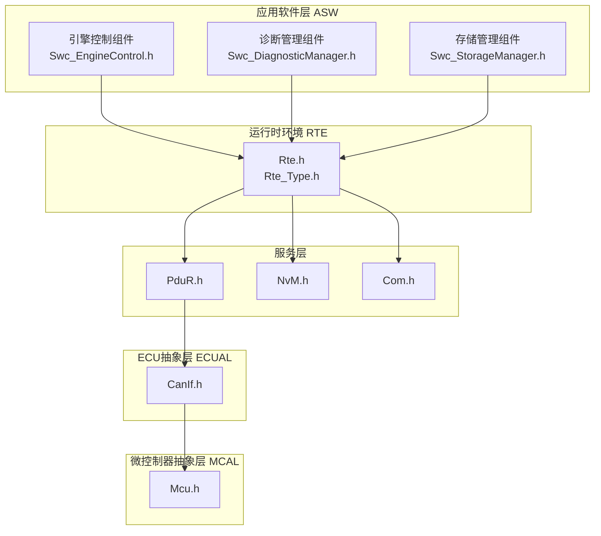
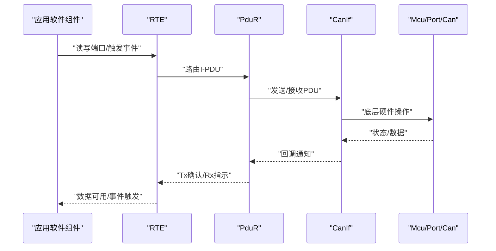
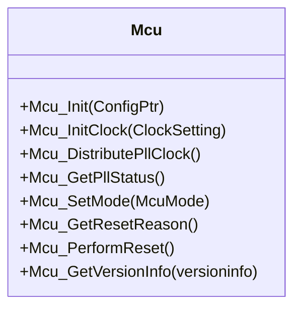
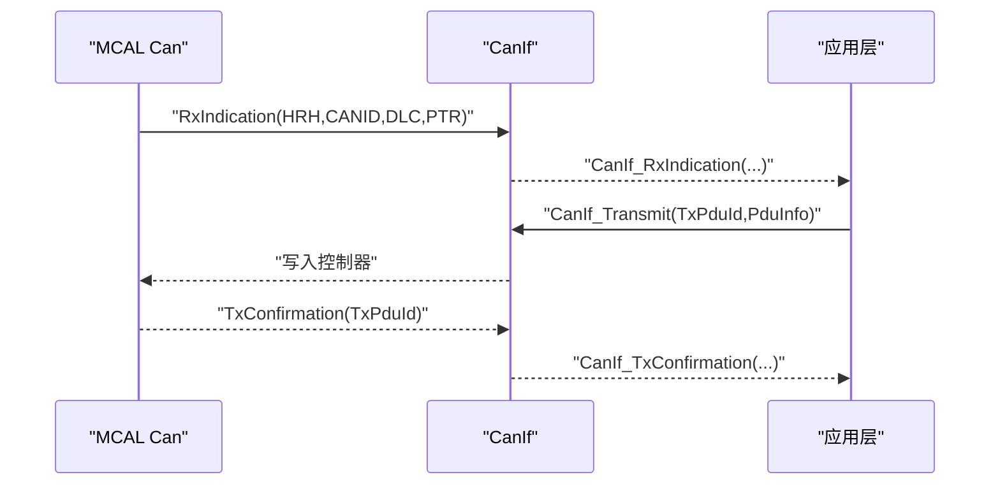
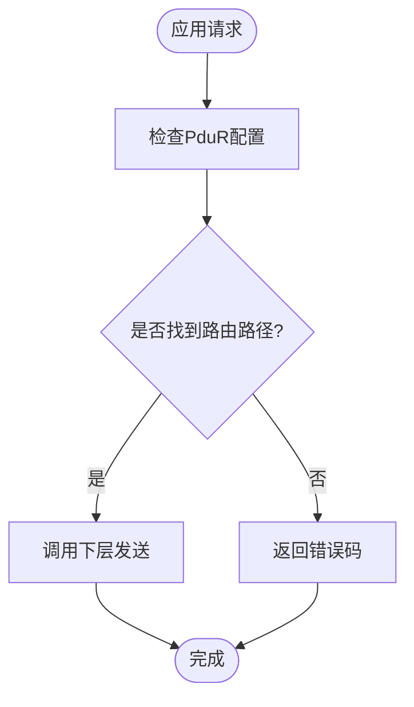
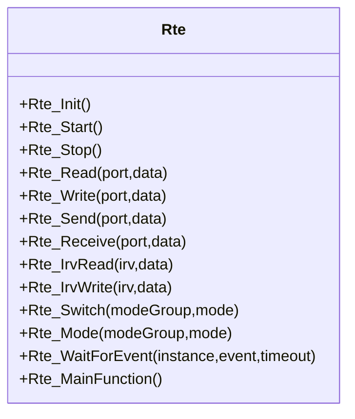
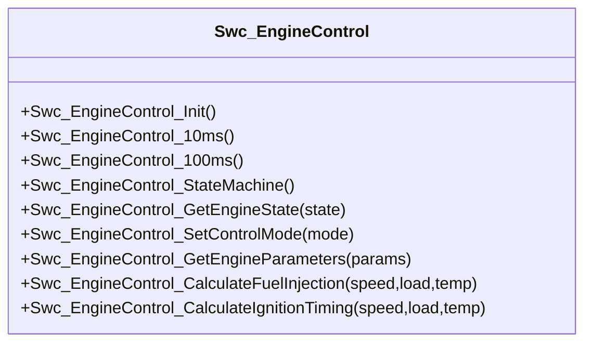
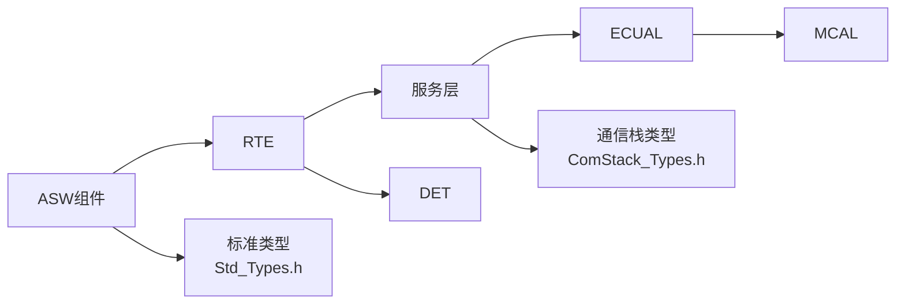

# API参考文档

<cite>
**本文档引用的文件**
- [README.md](file://README.md)
- [docs/api-reference.md](file://docs/api-reference.md)
- [src/bsw/os/include/Std_Types.h](file://src/bsw/os/include/Std_Types.h)
- [src/bsw/services/det/include/Det.h](file://src/bsw/services/det/include/Det.h)
- [src/bsw/rte/include/Rte.h](file://src/bsw/rte/include/Rte.h)
- [src/bsw/rte/include/Rte_Type.h](file://src/bsw/rte/include/Rte_Type.h)
- [src/bsw/mcal/mcu/include/Mcu.h](file://src/bsw/mcal/mcu/include/Mcu.h)
- [src/bsw/ecual/canif/include/CanIf.h](file://src/bsw/ecual/canif/include/CanIf.h)
- [src/bsw/services/pdur/include/PduR.h](file://src/bsw/services/pdur/include/PduR.h)
- [src/bsw/services/nvm/include/NvM.h](file://src/bsw/services/nvm/include/NvM.h)
- [src/bsw/services/com/include/Com.h](file://src/bsw/services/com/include/Com.h)
- [src/bsw/ecual/include/ComStack_Types.h](file://src/bsw/ecual/include/ComStack_Types.h)
- [src/asw/asw_interfaces.h](file://src/asw/asw_interfaces.h)
- [src/asw/engine_control/include/Swc_EngineControl.h](file://src/asw/engine_control/include/Swc_EngineControl.h)
- [src/asw/diagnostic_manager/include/Swc_DiagnosticManager.h](file://src/asw/diagnostic_manager/include/Swc_DiagnosticManager.h)
- [src/asw/storage_manager/include/Swc_StorageManager.h](file://src/asw/storage_manager/include/Swc_StorageManager.h)
- [examples/can_demo/main.c](file://examples/can_demo/main.c)
</cite>

## 目录
1. [简介](#简介)
2. [项目结构](#项目结构)
3. [核心组件](#核心组件)
4. [架构总览](#架构总览)
5. [详细组件分析](#详细组件分析)
6. [依赖关系分析](#依赖关系分析)
7. [性能考虑](#性能考虑)
8. [故障排除指南](#故障排除指南)
9. [结论](#结论)
10. [附录](#附录)

## 简介
本文件为YuleTech AutoSAR BSW平台的完整API参考文档，覆盖MCAL驱动API、ECUAL接口API、服务层API、RTE接口API以及ASW组件API。文档提供各模块的函数签名、参数说明、返回值定义、使用示例与注意事项，并结合项目README中的分层架构图，帮助开发者快速定位所需接口并正确使用。

## 项目结构
项目采用AutoSAR Classic Platform 4.x分层架构，自下而上分为MCAL（硬件抽象）、ECUAL（ECU抽象）、Service（服务层）、RTE（运行时环境）以及ASW（应用软件组件）。各层之间通过标准化接口进行交互，确保模块化与可移植性。



**图表来源**
- [README.md:48-74](file://README.md#L48-L74)
- [src/bsw/mcal/mcu/include/Mcu.h:13-239](file://src/bsw/mcal/mcu/include/Mcu.h#L13-L239)
- [src/bsw/ecual/canif/include/CanIf.h:13-403](file://src/bsw/ecual/canif/include/CanIf.h#L13-L403)
- [src/bsw/services/pdur/include/PduR.h:13-282](file://src/bsw/services/pdur/include/PduR.h#L13-L282)
- [src/bsw/services/nvm/include/NvM.h:13-355](file://src/bsw/services/nvm/include/NvM.h#L13-L355)
- [src/bsw/services/com/include/Com.h:14-508](file://src/bsw/services/com/include/Com.h#L14-L508)
- [src/bsw/rte/include/Rte.h:14-441](file://src/bsw/rte/include/Rte.h#L14-L441)

**章节来源**
- [README.md:48-74](file://README.md#L48-L74)

## 核心组件
本节概述各层核心API的职责与典型调用流程，便于开发者建立整体认知。

- 通用类型与错误码
  - 标准类型：布尔、整数、浮点、版本信息结构等
  - 通用返回类型：E_OK/E_NOT_OK/E_BUSY
  - DET错误报告接口：Det_ReportError/Det_Start/Det_GetVersionInfo
- 模块通用接口
  - Init/DeInit/MainFunction/GetVersionInfo
- 通信栈通用类型
  - PduIdType、PduInfoType、BufReq_ReturnType等

**章节来源**
- [src/bsw/os/include/Std_Types.h:11-117](file://src/bsw/os/include/Std_Types.h#L11-L117)
- [src/bsw/services/det/include/Det.h:11-76](file://src/bsw/services/det/include/Det.h#L11-L76)
- [src/bsw/ecual/include/ComStack_Types.h:12-170](file://src/bsw/ecual/include/ComStack_Types.h#L12-L170)
- [docs/api-reference.md:17-56](file://docs/api-reference.md#L17-L56)

## 架构总览
下图展示从应用软件组件到MCAL的端到端调用路径，包括RTE调度、服务层路由、ECUAL适配与MCAL驱动执行。



**图表来源**
- [src/bsw/rte/include/Rte.h:76-348](file://src/bsw/rte/include/Rte.h#L76-L348)
- [src/bsw/services/pdur/include/PduR.h:168-277](file://src/bsw/services/pdur/include/PduR.h#L168-L277)
- [src/bsw/ecual/canif/include/CanIf.h:272-397](file://src/bsw/ecual/canif/include/CanIf.h#L272-L397)
- [src/bsw/mcal/mcu/include/Mcu.h:134-229](file://src/bsw/mcal/mcu/include/Mcu.h#L134-L229)

## 详细组件分析

### MCAL层API
MCAL提供硬件抽象，包括微控制器、端口、数字I/O、CAN、SPI、通用定时器、PWM、ADC、看门狗等驱动。

- Mcu（微控制器）
  - 关键API：Mcu_Init/Mcu_InitClock/Mcu_DistributePllClock/Mcu_GetPllStatus/Mcu_SetMode/Mcu_GetResetReason/Mcu_PerformReset/Mcu_GetVersionInfo
  - 注意事项：PLL锁定前不得分发时钟；复位函数不返回；建议先初始化MCU再初始化其他模块
- Port/Dio/Can/Spi/Gpt/Pwm/Adc/Wdg等驱动均遵循统一的Init/DeInit/MainFunction/GetVersionInfo接口模式



**图表来源**
- [src/bsw/mcal/mcu/include/Mcu.h:134-229](file://src/bsw/mcal/mcu/include/Mcu.h#L134-L229)

**章节来源**
- [docs/api-reference.md:59-93](file://docs/api-reference.md#L59-L93)
- [src/bsw/mcal/mcu/include/Mcu.h:13-239](file://src/bsw/mcal/mcu/include/Mcu.h#L13-L239)

### ECUAL层API
ECUAL提供ECU抽象，屏蔽不同厂商MCAL差异，典型模块包括CanIf、IoHwAb、CanTp、EthIf、MemIf、Fee、Ea、FrIf、LinIf。

- CanIf（CAN接口）
  - 关键API：CanIf_Init/CanIf_DeInit/CanIf_Transmit/CanIf_SetControllerMode/CanIf_GetControllerMode/CanIf_RxIndication/CanIf_TxConfirmation/CanIf_ControllerModeIndication/CanIf_ControllerBusOff
  - 回调机制：通过回调函数上报接收、发送确认、控制器模式变化、总线关闭等事件
  - 错误码：包含参数校验、未初始化、停止状态、唤醒相关等多种错误



**图表来源**
- [src/bsw/ecual/canif/include/CanIf.h:272-397](file://src/bsw/ecual/canif/include/CanIf.h#L272-L397)

**章节来源**
- [docs/api-reference.md:135-181](file://docs/api-reference.md#L135-L181)
- [src/bsw/ecual/canif/include/CanIf.h:13-403](file://src/bsw/ecual/canif/include/CanIf.h#L13-L403)

### 服务层API
服务层提供系统级服务，包括通信路由（PduR）、非易失存储（NvM）、通信服务（Com）等。

- PduR（PDU路由器）
  - 关键API：PduR_Init/PduR_DeInit/PduR_Transmit/PduR_RxIndication/PduR_TxConfirmation/PduR_TriggerTransmit/PduR_MainFunction
  - 功能：将上层请求路由到下层，支持直接、FIFO、网关等路由路径
- NvM（NVRAM管理器）
  - 关键API：NvM_Init/NvM_ReadBlock/NvM_WriteBlock/NvM_RestoreBlockDefaults/NvM_GetErrorStatus/NvM_MainFunction
  - 功能：块级读写、CRC校验、镜像冗余、写保护、多块读写等
- Com（通信服务）
  - 关键API：Com_Init/Com_SendSignal/Com_ReceiveSignal/Com_TriggerIPDUSend/Com_RxIndication/Com_TxConfirmation/Com_MainFunctionRx/Com_MainFunctionTx/Com_MainFunctionRouteSignals
  - 功能：信号发送/接收、信号组、I-PDU触发、路由信号、主函数周期处理



**图表来源**
- [src/bsw/services/pdur/include/PduR.h:168-277](file://src/bsw/services/pdur/include/PduR.h#L168-L277)

**章节来源**
- [docs/api-reference.md:184-346](file://docs/api-reference.md#L184-L346)
- [src/bsw/services/pdur/include/PduR.h:13-282](file://src/bsw/services/pdur/include/PduR.h#L13-L282)
- [src/bsw/services/nvm/include/NvM.h:13-355](file://src/bsw/services/nvm/include/NvM.h#L13-L355)
- [src/bsw/services/com/include/Com.h:14-508](file://src/bsw/services/com/include/Com.h#L14-L508)

### RTE层API
RTE作为组件间的运行时环境，提供端口读写、IRV、参数、测量、模式管理、事件同步、回调等能力。

- 核心API
  - 生命周期：Rte_Init/Rte_Start/Rte_Stop
  - 数据读写：Rte_Read/Rte_Write/Rte_Send/Rte_Receive
  - IRV/参数/测量：Rte_IrvRead/Rte_IrvWrite/Rte_CalPrmRead/Rte_MeasurementRead
  - 模式管理：Rte_Switch/Rte_Mode
  - 事件：Rte_WaitForEvent/Rte_SetEvent/Rte_ClearEvent
  - 回调：Rte_ComCbk/Rte_ComCbkTout/Rte_ComCbkInv
  - 主函数：Rte_MainFunction
- 类型体系
  - Rte_StatusType、Rte_*HandleType、Rte_*Type等



**图表来源**
- [src/bsw/rte/include/Rte.h:76-348](file://src/bsw/rte/include/Rte.h#L76-L348)
- [src/bsw/rte/include/Rte_Type.h:38-360](file://src/bsw/rte/include/Rte_Type.h#L38-L360)

**章节来源**
- [docs/api-reference.md:350-410](file://docs/api-reference.md#L350-L410)
- [src/bsw/rte/include/Rte.h:14-441](file://src/bsw/rte/include/Rte.h#L14-L441)
- [src/bsw/rte/include/Rte_Type.h:14-361](file://src/bsw/rte/include/Rte_Type.h#L14-L361)

### ASW组件API
ASW层提供应用级功能组件，通过RTE接口与BSW交互，典型组件包括引擎控制、诊断管理、存储管理等。

- 引擎控制组件（Swc_EngineControl）
  - 关键API：Swc_EngineControl_Init/10ms/100ms/StateMachine、GetEngineState/SetControlMode/GetEngineParameters、CalculateFuelInjection/CalculateIgnitionTiming
  - 端口宏：Rte_Write_EngineState/Rte_Write_EngineParameters/Rte_Write_EngineControlOutput、Rte_Read_ThrottlePosition/Rte_Read_CoolantTemperature/Rte_Read_VehicleSpeed、Rte_Switch_EngineMode
- 诊断管理组件（Swc_DiagnosticManager）
  - 关键API：Swc_DiagnosticManager_Init/50ms/ProcessRequest、ChangeSession/GetSession、UnLockSecurity/GetSecurityLevel、ProcessDiagnosticRequest/GetDtcStatus/ClearDtc/GetStatus
- 存储管理组件（Swc_StorageManager）
  - 关键API：Swc_StorageManager_Init/100ms/WriteCycle、ReadBlock/WriteBlock/GetBlockStatus/InvalidateBlock/EraseBlock/GetStatistics/SetWriteProtection



**图表来源**
- [src/asw/engine_control/include/Swc_EngineControl.h:93-151](file://src/asw/engine_control/include/Swc_EngineControl.h#L93-L151)

**章节来源**
- [src/asw/asw_interfaces.h:12-314](file://src/asw/asw_interfaces.h#L12-L314)
- [src/asw/engine_control/include/Swc_EngineControl.h:12-183](file://src/asw/engine_control/include/Swc_EngineControl.h#L12-L183)
- [src/asw/diagnostic_manager/include/Swc_DiagnosticManager.h:112-188](file://src/asw/diagnostic_manager/include/Swc_DiagnosticManager.h#L112-L188)
- [src/asw/storage_manager/include/Swc_StorageManager.h:107-184](file://src/asw/storage_manager/include/Swc_StorageManager.h#L107-L184)

## 依赖关系分析
- 组件耦合
  - ASW通过RTE与BSW交互，避免直接依赖具体MCAL/ECUAL实现
  - PduR依赖CanIf等下层模块，向上提供统一接口
  - NvM独立于通信栈，仅通过RTE或直接调用（取决于配置）
- 直接/间接依赖
  - Com依赖PduR进行I-PDU路由
  - CanIf依赖MCAL Can驱动
- 外部依赖
  - 标准类型与通信栈类型来自Std_Types.h与ComStack_Types.h
  - DET用于开发期错误检测



**图表来源**
- [src/bsw/ecual/include/ComStack_Types.h:12-170](file://src/bsw/ecual/include/ComStack_Types.h#L12-L170)
- [src/bsw/os/include/Std_Types.h:11-117](file://src/bsw/os/include/Std_Types.h#L11-L117)
- [src/bsw/services/det/include/Det.h:11-76](file://src/bsw/services/det/include/Det.h#L11-L76)

**章节来源**
- [src/bsw/ecual/include/ComStack_Types.h:12-170](file://src/bsw/ecual/include/ComStack_Types.h#L12-L170)
- [src/bsw/os/include/Std_Types.h:11-117](file://src/bsw/os/include/Std_Types.h#L11-L117)
- [src/bsw/services/det/include/Det.h:11-76](file://src/bsw/services/det/include/Det.h#L11-L76)

## 性能考虑
- 主函数周期
  - 各模块均提供MainFunction，应按需调度，避免阻塞
  - 建议将高频处理（如CAN写/读、Com Rx/Tx）放在短周期任务中
- 路由与缓冲
  - PduR FIFO深度与网关操作影响延迟与吞吐
  - 合理配置I-PDU长度与传输模式，减少不必要的复制
- 存储与CRC
  - NvM写操作可能阻塞，建议异步或批量写入
  - CRC校验与镜像冗余提升可靠性但增加开销
- 内存分区
  - 使用MemMap.h进行内存分区，避免跨分区访问导致性能下降

## 故障排除指南
- 通用错误
  - E_OK/E_NOT_OK/E_BUSY：检查参数合法性与模块状态
  - DET错误：启用Det_ReportError定位调用方与错误码
- 模块特定
  - Mcu：PLL未锁定、模式切换失败、复位原因读取异常
  - CanIf：未初始化、控制器模式不匹配、PDU ID无效、唤醒检查失败
  - PduR：路由路径无效、缓冲区长度不足、上下层请求缺失
  - NvM：块未初始化、块被锁定、写保护、CRC校验失败
  - Com：信号ID无效、I-PDU状态异常、传输忙
- 排查步骤
  - 确认模块初始化顺序（MCU优先）
  - 检查配置结构体字段与回调注册
  - 使用GetVersionInfo与GetErrorStatus辅助诊断
  - 结合示例程序验证最小可运行路径

**章节来源**
- [docs/api-reference.md:520-549](file://docs/api-reference.md#L520-L549)
- [src/bsw/services/det/include/Det.h:48-76](file://src/bsw/services/det/include/Det.h#L48-L76)
- [src/bsw/mcal/mcu/include/Mcu.h:45-52](file://src/bsw/mcal/mcu/include/Mcu.h#L45-L52)
- [src/bsw/ecual/canif/include/CanIf.h:62-91](file://src/bsw/ecual/canif/include/CanIf.h#L62-L91)
- [src/bsw/services/pdur/include/PduR.h:51-71](file://src/bsw/services/pdur/include/PduR.h#L51-L71)
- [src/bsw/services/nvm/include/NvM.h:66-77](file://src/bsw/services/nvm/include/NvM.h#L66-L77)
- [src/bsw/services/com/include/Com.h:89-103](file://src/bsw/services/com/include/Com.h#L89-L103)

## 结论
本API参考文档系统梳理了YuleTech BSW平台的全栈接口，涵盖MCAL、ECUAL、服务层、RTE与ASW组件。通过标准化接口与严格的错误处理机制，开发者可以快速集成并稳定运行车载通信与控制功能。建议在实际项目中遵循初始化顺序、合理配置主函数周期与缓冲策略，并利用DET与版本信息接口进行调试与升级。

## 附录

### API使用模式与最佳实践
- 初始化顺序
  - 先MCU，再Port/Can等，最后CanIf/Com/PduR/NvM
- 回调与事件
  - 注册回调函数并在主循环中调用对应MainFunction
  - 使用RTE事件机制协调组件间同步
- 错误处理
  - 对所有返回值进行检查，必要时调用Det_ReportError
  - 使用GetErrorStatus/GetVersionInfo辅助诊断
- 版本兼容与迁移
  - 严格遵循AutoSAR 4.x规范，关注版本信息字段
  - 升级时对比错误码与API签名，确保向后兼容

### 示例：CAN通信最小实现
示例展示了从MCU初始化到CAN消息收发的完整流程，包括回调处理与周期性发送。

```mermaid
sequenceDiagram
participant Main as "main()"
participant MCU as "Mcu_Init"
participant PORT as "Port_Init"
participant CAN as "Can_Init"
participant IF as "CanIf_Init"
participant LOOP as "主循环"
Main->>MCU : "初始化MCU"
Main->>PORT : "初始化端口"
Main->>CAN : "初始化CAN"
Main->>IF : "初始化CanIf"
Main->>LOOP : "进入主循环"
LOOP->>IF : "周期性CanIf_Transmit"
CAN-->>IF : "RxIndication回调"
IF-->>Main : "用户回调处理"
```

**图表来源**
- [examples/can_demo/main.c:63-118](file://examples/can_demo/main.c#L63-L118)
- [src/bsw/ecual/canif/include/CanIf.h:272-305](file://src/bsw/ecual/canif/include/CanIf.h#L272-L305)

**章节来源**
- [examples/can_demo/main.c:1-119](file://examples/can_demo/main.c#L1-L119)