# CanIf CAN接口API

<cite>
**本文档引用的文件**
- [CanIf.h](file://src/bsw/ecual/CanIf/include/CanIf.h)
- [CanIf.c](file://src/bsw/ecual/CanIf/src/CanIf.c)
- [CanIf_Cfg.h](file://src/bsw/ecual/CanIf/include/CanIf_Cfg.h)
- [Can.h](file://src/bsw/mcal/can/include/Can.h)
- [PduR.h](file://src/bsw/services/pdur/include/PduR.h)
- [Std_Types.h](file://src/bsw/os/include/Std_Types.h)
- [ComStack_Types.h](file://src/bsw/ecual/include/ComStack_Types.h)
- [Det.h](file://src/bsw/services/det/include/Det.h)
- [MemMap.h](file://src/bsw/general/inc/MemMap.h)
- [main.c](file://examples/can_demo/main.c)
</cite>

## 目录
1. [简介](#简介)
2. [项目结构](#项目结构)
3. [核心组件](#核心组件)
4. [架构概览](#架构概览)
5. [详细组件分析](#详细组件分析)
6. [依赖关系分析](#依赖关系分析)
7. [性能考虑](#性能考虑)
8. [故障排除指南](#故障排除指南)
9. [结论](#结论)
10. [附录](#附录)

## 简介

CanIf（Controller Area Network Interface）是AUTOSAR经典平台ECUAL层的CAN接口模块，遵循AUTOSAR 4.x标准。该模块作为应用层与MCAL层之间的抽象接口，提供了标准化的CAN通信服务。

CanIf模块的主要功能包括：
- CAN控制器初始化和配置
- 控制器模式管理和状态监控
- PDU（Protocol Data Unit）传输和路由
- 动态ID设置和管理
- 收发器（Transceiver）模式控制
- 错误检测和处理机制

## 项目结构

CanIf模块位于AUTOSAR分层架构中的ECUAL层，与上层应用软件组件（ASW）和下层MCAL驱动程序进行交互。

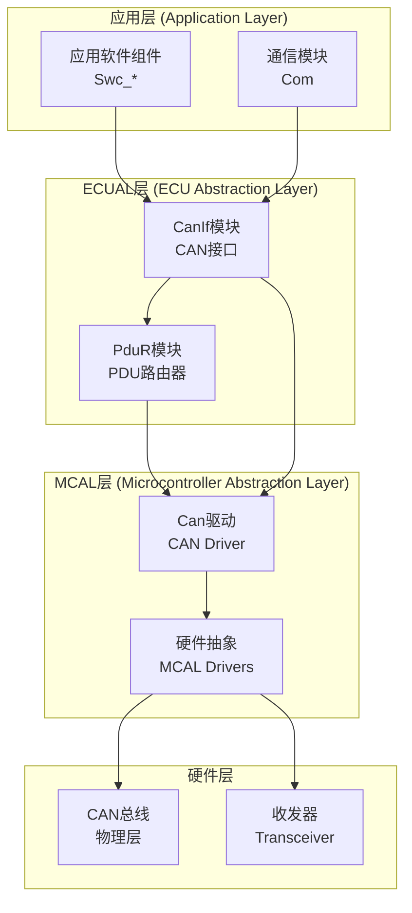

**图表来源**
- [CanIf.h:1-403](file://src/bsw/ecual/CanIf/include/CanIf.h#L1-L403)
- [Can.h:1-269](file://src/bsw/mcal/can/include/Can.h#L1-L269)
- [PduR.h:1-282](file://src/bsw/services/pdur/include/PduR.h#L1-L282)

**章节来源**
- [CanIf.h:1-403](file://src/bsw/ecual/CanIf/include/CanIf.h#L1-L403)
- [CanIf_Cfg.h:1-84](file://src/bsw/ecual/CanIf/include/CanIf_Cfg.h#L1-L84)

## 核心组件

### 主要API函数

CanIf模块提供以下核心API函数：

#### 初始化和配置
- `CanIf_Init()` - 初始化CAN接口
- `CanIf_DeInit()` - 反初始化CAN接口
- `CanIf_GetVersionInfo()` - 获取版本信息

#### 控制器管理
- `CanIf_SetControllerMode()` - 设置控制器模式
- `CanIf_GetControllerMode()` - 获取控制器模式
- `CanIf_CheckWakeup()` - 检查唤醒事件

#### PDU传输管理
- `CanIf_Transmit()` - 发送PDU数据
- `CanIf_CancelTransmit()` - 取消传输请求
- `CanIf_SetPduMode()` - 设置PDU模式
- `CanIf_GetPduMode()` - 获取PDU模式

#### 动态ID管理
- `CanIf_SetDynamicTxId()` - 设置动态TX ID

#### 收发器管理
- `CanIf_SetTrcvMode()` - 设置收发器模式
- `CanIf_GetTrcvMode()` - 获取收发器模式
- `CanIf_GetTrcvWakeupReason()` - 获取收发器唤醒原因
- `CanIf_SetTrcvWakeupMode()` - 设置收发器唤醒模式

**章节来源**
- [CanIf.h:267-403](file://src/bsw/ecual/CanIf/include/CanIf.h#L267-L403)
- [CanIf.c:29-487](file://src/bsw/ecual/CanIf/src/CanIf.c#L29-L487)

### 核心数据结构

#### 返回类型定义
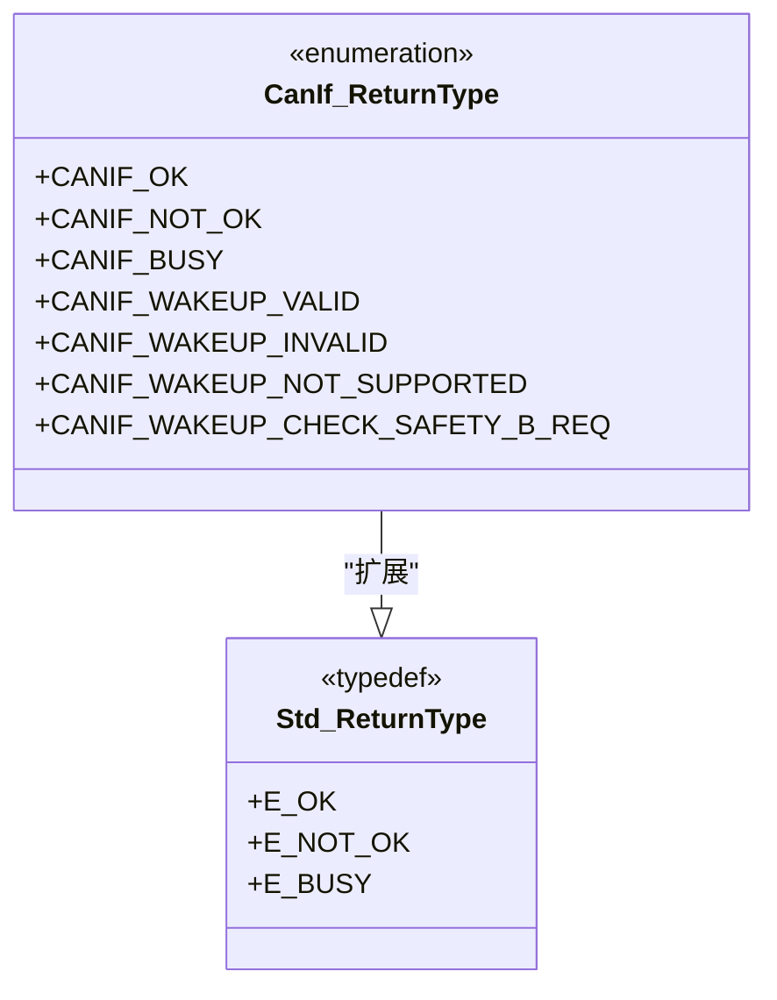

**图表来源**
- [CanIf.h:95-103](file://src/bsw/ecual/CanIf/include/CanIf.h#L95-L103)
- [Std_Types.h:23-31](file://src/bsw/os/include/Std_Types.h#L23-L31)

#### 模式类型定义
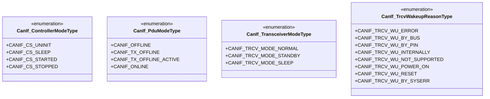

**图表来源**
- [CanIf.h:126-163](file://src/bsw/ecual/CanIf/include/CanIf.h#L126-L163)

#### 配置结构体
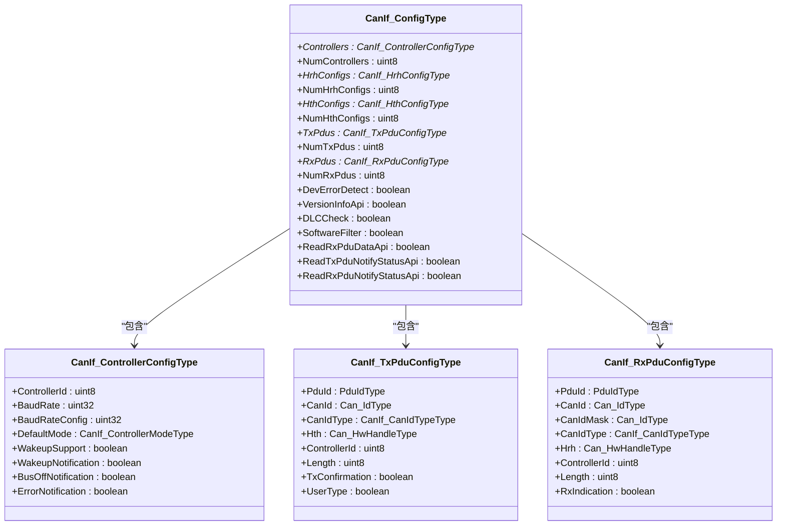

**图表来源**
- [CanIf.h:227-245](file://src/bsw/ecual/CanIf/include/CanIf.h#L227-L245)
- [CanIf.h:213-222](file://src/bsw/ecual/CanIf/include/CanIf.h#L213-L222)
- [CanIf.h:168-191](file://src/bsw/ecual/CanIf/include/CanIf.h#L168-L191)

**章节来源**
- [CanIf.h:95-245](file://src/bsw/ecual/CanIf/include/CanIf.h#L95-L245)

## 架构概览

CanIf模块采用分层架构设计，实现了应用层与MCAL层的有效解耦。

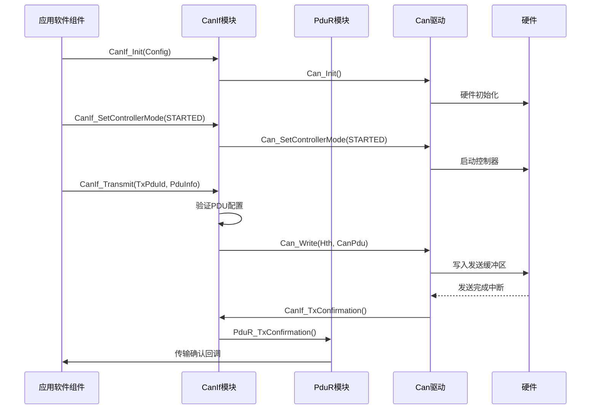

**图表来源**
- [CanIf.c:29-185](file://src/bsw/ecual/CanIf/src/CanIf.c#L29-L185)
- [CanIf.c:259-271](file://src/bsw/ecual/CanIf/src/CanIf.c#L259-L271)

**章节来源**
- [CanIf.c:29-185](file://src/bsw/ecual/CanIf/src/CanIf.c#L29-L185)

## 详细组件分析

### 初始化流程

CanIf初始化过程确保了模块的正确配置和状态管理。

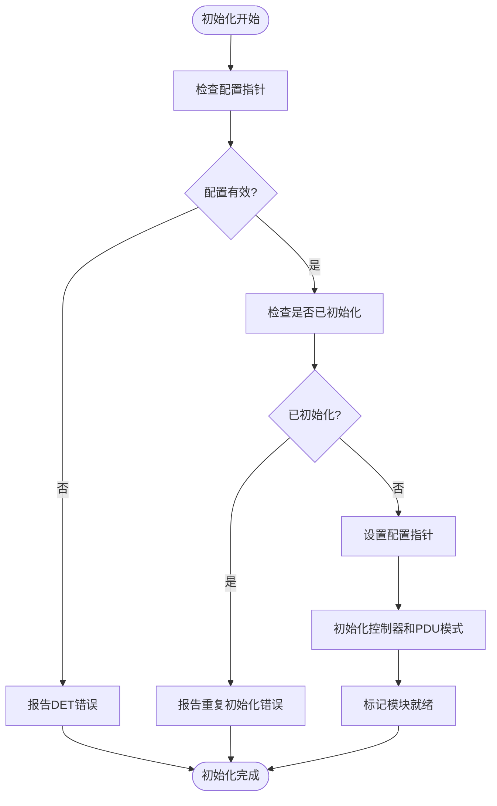

**图表来源**
- [CanIf.c:29-50](file://src/bsw/ecual/CanIf/src/CanIf.c#L29-L50)

#### 初始化参数验证
- 配置指针不能为空
- 防止重复初始化
- 检查开发错误检测配置

**章节来源**
- [CanIf.c:29-50](file://src/bsw/ecual/CanIf/src/CanIf.c#L29-L50)

### 控制器模式管理

控制器模式管理实现了CAN控制器状态的统一控制。

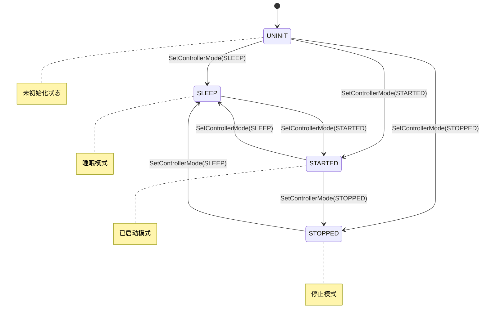

**图表来源**
- [CanIf.c:69-119](file://src/bsw/ecual/CanIf/src/CanIf.c#L69-L119)

#### 模式转换逻辑
- STARTED模式：激活CAN控制器
- STOPPED模式：停止CAN控制器
- SLEEP模式：进入低功耗状态

**章节来源**
- [CanIf.c:69-119](file://src/bsw/ecual/CanIf/src/CanIf.c#L69-L119)

### PDU传输流程

PDU传输流程展示了从应用层到硬件层的数据传输路径。

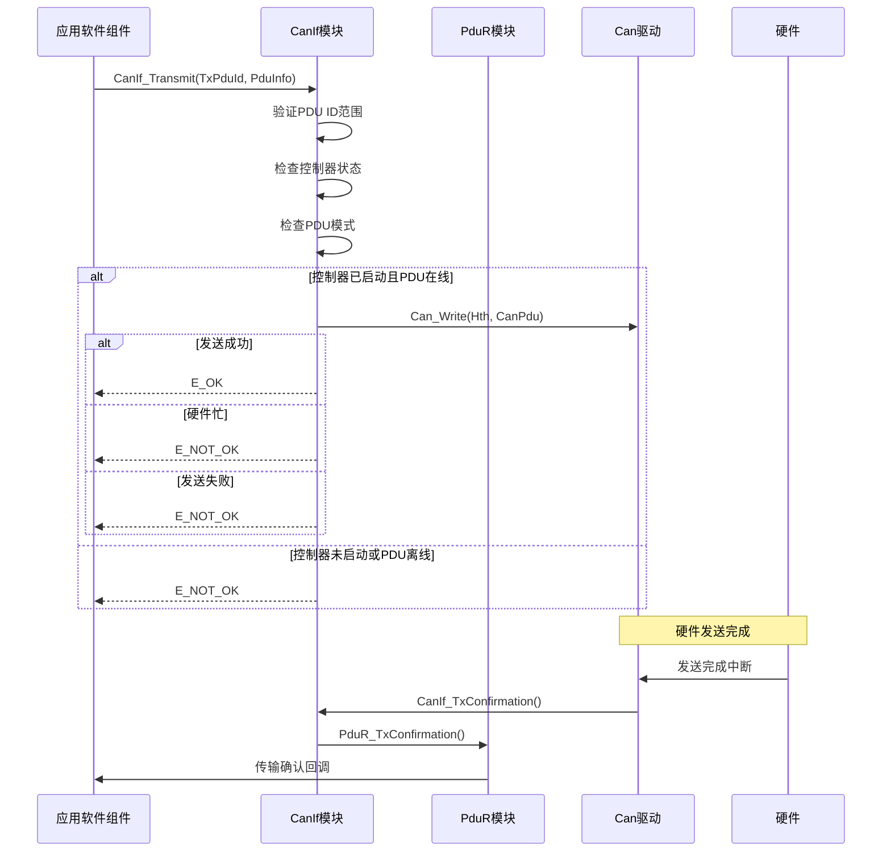

**图表来源**
- [CanIf.c:142-185](file://src/bsw/ecual/CanIf/src/CanIf.c#L142-L185)
- [CanIf.c:259-271](file://src/bsw/ecual/CanIf/src/CanIf.c#L259-L271)

#### 传输验证规则
- PDU ID必须在有效范围内
- 控制器必须处于STARTED状态
- PDU模式不能为OFFLINE
- DLC长度检查（可选）

**章节来源**
- [CanIf.c:142-185](file://src/bsw/ecual/CanIf/src/CanIf.c#L142-L185)

### 收发器管理

收发器管理提供了对CAN总线收发器的控制能力。

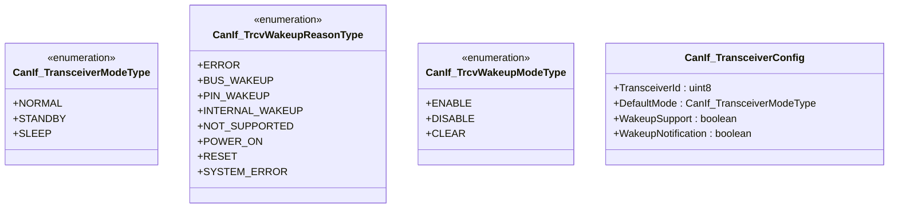

**图表来源**
- [CanIf.h:136-163](file://src/bsw/ecual/CanIf/include/CanIf.h#L136-L163)

#### 收发器操作流程
- 模式设置：NORMAL/STANDBY/SLEEP
- 唤醒检测：总线唤醒/PIN唤醒/内部唤醒
- 唤醒模式：启用/禁用/清除

**章节来源**
- [CanIf.c:368-444](file://src/bsw/ecual/CanIf/src/CanIf.c#L368-L444)

## 依赖关系分析

### 外部依赖

CanIf模块依赖于多个AUTOSAR标准模块：

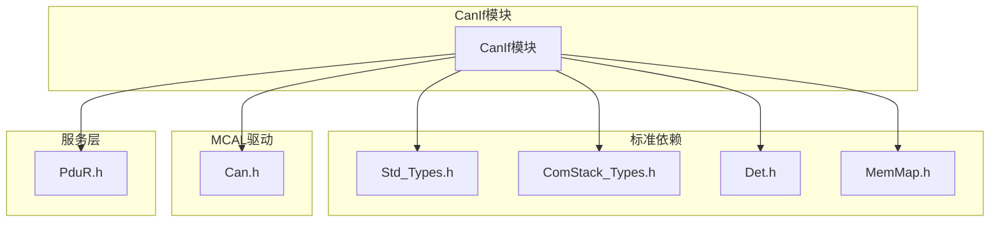

**图表来源**
- [CanIf.h:18-22](file://src/bsw/ecual/CanIf/include/CanIf.h#L18-L22)
- [CanIf.c:9-14](file://src/bsw/ecual/CanIf/src/CanIf.c#L9-L14)

### 内部依赖关系

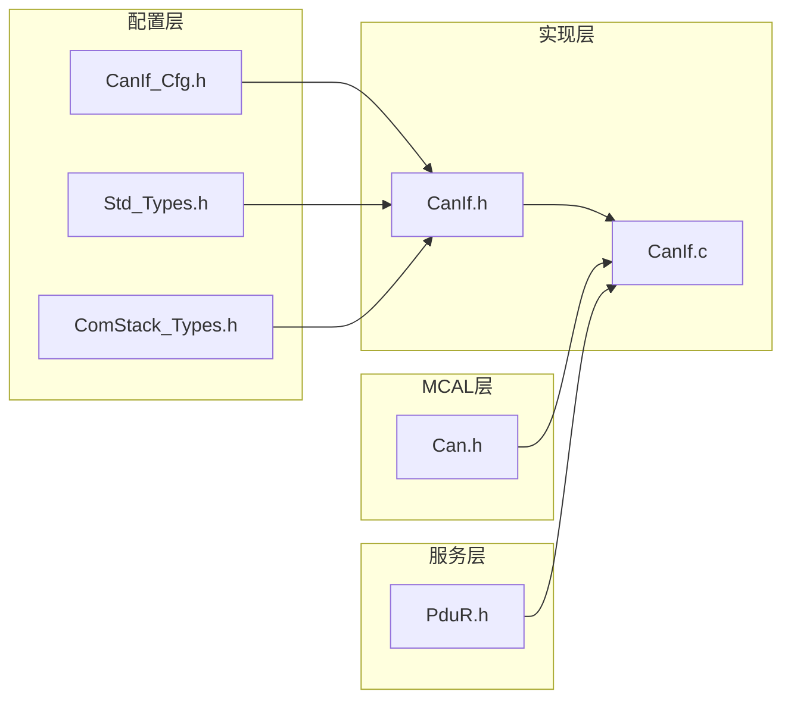

**图表来源**
- [CanIf_Cfg.h:1-84](file://src/bsw/ecual/CanIf/include/CanIf_Cfg.h#L1-L84)
- [CanIf.h:18-245](file://src/bsw/ecual/CanIf/include/CanIf.h#L18-L245)

**章节来源**
- [CanIf_Cfg.h:1-84](file://src/bsw/ecual/CanIf/include/CanIf_Cfg.h#L1-L84)
- [CanIf.h:18-245](file://src/bsw/ecual/CanIf/include/CanIf.h#L18-L245)

## 性能考虑

### 内存管理

CanIf模块采用了AUTOSAR标准的内存映射机制：

- **静态内存分配**：控制器和PDU模式状态存储
- **配置常量存储**：配置信息存储在只读段
- **内存分区**：使用MemMap.h进行精确的内存段管理

### 中断处理

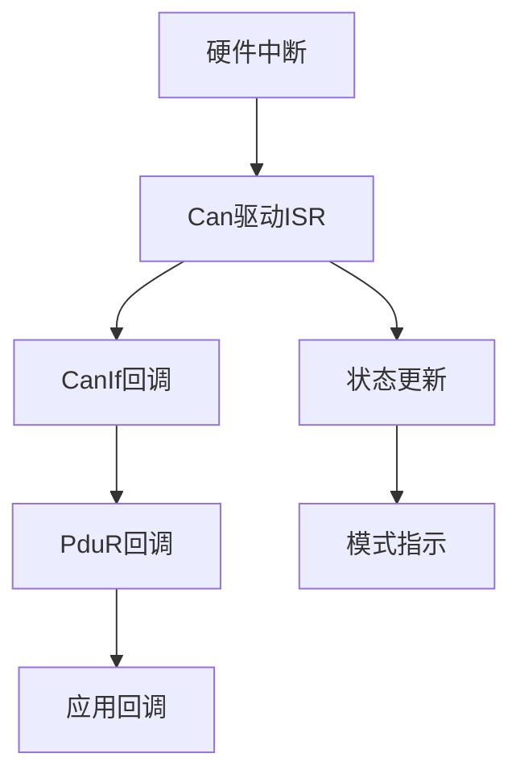

**图表来源**
- [CanIf.c:273-325](file://src/bsw/ecual/CanIf/src/CanIf.c#L273-L325)

### 性能优化建议

1. **批处理传输**：合并多个小PDU以减少中断开销
2. **优先级调度**：为关键消息设置更高的传输优先级
3. **缓冲区管理**：合理配置发送和接收缓冲区大小
4. **错误恢复**：实现快速错误检测和恢复机制

## 故障排除指南

### 常见错误代码

| 错误代码 | 描述 | 可能原因 | 解决方案 |
|---------|------|----------|----------|
| CANIF_E_UNINIT | 未初始化 | 模块未正确初始化 | 调用CanIf_Init() |
| CANIF_E_PARAM_POINTER | 参数指针无效 | 传入NULL指针 | 检查传入参数 |
| CANIF_E_INVALID_TXPDUID | 无效的TX PDU ID | PDU ID超出范围 | 验证PDU ID配置 |
| CANIF_E_PARAM_CONTROLLER | 无效的控制器ID | 控制器ID越界 | 检查控制器配置 |
| CANIF_E_NOT_OK | 一般性失败 | 硬件或驱动错误 | 检查硬件连接 |

### 错误检测机制

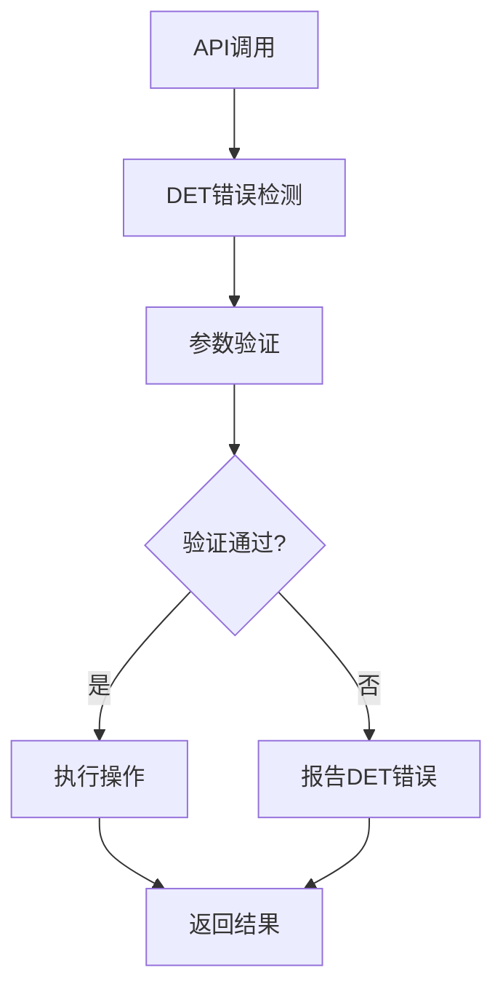

**图表来源**
- [CanIf.c:31-40](file://src/bsw/ecual/CanIf/src/CanIf.c#L31-L40)

### 调试技巧

1. **启用开发错误检测**：在配置中启用CANIF_DEV_ERROR_DETECT
2. **日志记录**：记录关键状态变化和错误信息
3. **单元测试**：编写针对各种边界条件的测试用例
4. **硬件验证**：使用示波器验证CAN总线信号质量

**章节来源**
- [CanIf.c:31-40](file://src/bsw/ecual/CanIf/src/CanIf.c#L31-L40)

## 结论

CanIf模块为AUTOSAR系统提供了标准化的CAN通信接口，具有以下特点：

1. **标准化接口**：完全符合AUTOSAR 4.x标准
2. **模块化设计**：清晰的层次结构和职责分离
3. **错误处理**：完善的错误检测和报告机制
4. **可配置性**：支持多种配置选项和运行时调整

该模块为上层应用提供了简单易用的CAN通信接口，同时保持了与底层硬件的高度解耦，便于系统的维护和扩展。

## 附录

### API参考表

#### 初始化相关
| 函数名 | 参数 | 返回值 | 描述 |
|--------|------|--------|------|
| CanIf_Init | ConfigPtr: 配置指针 | void | 初始化CAN接口 |
| CanIf_DeInit | 无 | void | 反初始化CAN接口 |
| CanIf_GetVersionInfo | versioninfo: 版本信息指针 | void | 获取版本信息 |

#### 控制器管理
| 函数名 | 参数 | 返回值 | 描述 |
|--------|------|--------|------|
| CanIf_SetControllerMode | ControllerId: 控制器ID<br/>ControllerMode: 模式 | Std_ReturnType | 设置控制器模式 |
| CanIf_GetControllerMode | ControllerId: 控制器ID<br/>ControllerModePtr: 模式指针 | Std_ReturnType | 获取控制器模式 |
| CanIf_CheckWakeup | WakeupSource: 唤醒源 | Std_ReturnType | 检查唤醒事件 |

#### PDU传输
| 函数名 | 参数 | 返回值 | 描述 |
|--------|------|--------|------|
| CanIf_Transmit | TxPduId: TX PDU ID<br/>PduInfoPtr: PDU信息指针 | Std_ReturnType | 发送PDU数据 |
| CanIf_CancelTransmit | TxPduId: TX PDU ID | Std_ReturnType | 取消传输请求 |
| CanIf_SetPduMode | ControllerId: 控制器ID<br/>PduModeRequest: PDU模式 | Std_ReturnType | 设置PDU模式 |
| CanIf_GetPduMode | ControllerId: 控制器ID<br/>PduModePtr: 模式指针 | Std_ReturnType | 获取PDU模式 |

#### 动态ID管理
| 函数名 | 参数 | 返回值 | 描述 |
|--------|------|--------|------|
| CanIf_SetDynamicTxId | CanTxPduId: TX PDU ID<br/>CanId: CAN ID | Std_ReturnType | 设置动态TX ID |

#### 收发器管理
| 函数名 | 参数 | 返回值 | 描述 |
|--------|------|--------|------|
| CanIf_SetTrcvMode | TransceiverId: 收发器ID<br/>TransceiverMode: 模式 | Std_ReturnType | 设置收发器模式 |
| CanIf_GetTrcvMode | TransceiverId: 收发器ID<br/>TransceiverModePtr: 模式指针 | Std_ReturnType | 获取收发器模式 |
| CanIf_GetTrcvWakeupReason | TransceiverId: 收发器ID<br/>TrcvWuReasonPtr: 原因指针 | Std_ReturnType | 获取收发器唤醒原因 |
| CanIf_SetTrcvWakeupMode | TransceiverId: 收发器ID<br/>TrcvWakeupMode: 唤醒模式 | Std_ReturnType | 设置收发器唤醒模式 |

### 配置示例

#### 基本配置结构
```c
const CanIf_ConfigType CanIf_Config = {
    .Controllers = g_CanIfControllers,
    .NumControllers = CANIF_NUM_CONTROLLERS,
    .TxPdus = g_CanIfTxPdus,
    .NumTxPdus = CANIF_NUM_TX_PDUS,
    .RxPdus = g_CanIfRxPdus,
    .NumRxPdus = CANIF_NUM_RX_PDUS,
    .DevErrorDetect = CANIF_DEV_ERROR_DETECT,
    .VersionInfoApi = CANIF_VERSION_INFO_API,
    .DLCCheck = CANIF_DLC_CHECK,
    .SoftwareFilter = CANIF_SOFTWARE_FILTER_TYPE
};
```

#### PDU配置示例
```c
const CanIf_TxPduConfigType g_CanIfTxPdus[] = {
    {
        .PduId = CANIF_TXPDU_ENGINE_STATUS,
        .CanId = CANIF_CANID_ENGINE_STATUS,
        .CanIdType = CANIF_CANID_TYPE_STANDARD,
        .Hth = 0,
        .ControllerId = CANIF_CONTROLLER_0,
        .Length = 8,
        .TxConfirmation = TRUE,
        .UserType = FALSE
    }
};
```

**章节来源**
- [CanIf_Cfg.h:1-84](file://src/bsw/ecual/CanIf/include/CanIf_Cfg.h#L1-L84)
- [CanIf.h:227-245](file://src/bsw/ecual/CanIf/include/CanIf.h#L227-L245)