# CanTp CAN传输协议API

<cite>
**本文档引用的文件**
- [CanTp.h](file://src/bsw/ecual/cantp/include/CanTp.h)
- [CanTp_Cfg.h](file://src/bsw/ecual/cantp/include/CanTp_Cfg.h)
- [CanTp.c](file://src/bsw/ecual/cantp/src/CanTp.c)
- [ComStack_Types.h](file://src/bsw/ecual/include/ComStack_Types.h)
- [Det.h](file://src/bsw/services/det/include/Det.h)
- [Det.c](file://src/bsw/services/det/src/Det.c)
- [Com.h](file://src/bsw/services/com/include/Com.h)
- [main.c](file://examples/can_demo/main.c)
- [bsw_config.json](file://config/bsw_config.json)
</cite>

## 目录
1. [简介](#简介)
2. [项目结构](#项目结构)
3. [核心组件](#核心组件)
4. [架构概览](#架构概览)
5. [详细组件分析](#详细组件分析)
6. [依赖关系分析](#依赖关系分析)
7. [性能考虑](#性能考虑)
8. [故障排除指南](#故障排除指南)
9. [结论](#结论)

## 简介

CanTp（CAN传输协议）是遵循AutoSAR经典平台4.x标准的CAN传输协议模块，实现了ISO 15765-2诊断和大数据传输协议。该模块提供了完整的长消息传输、帧组装、流量控制和错误恢复功能，支持单帧（SF）、首帧（FF）、连续帧（CF）和流控帧（FC）四种帧类型。

CanTp模块采用分层架构设计，位于ECU抽象层（ECUAL），与底层CAN接口、上层通信服务协同工作，为AUTOSAR系统提供可靠的车载网络通信能力。

## 项目结构

CanTp模块在项目中的组织结构如下：

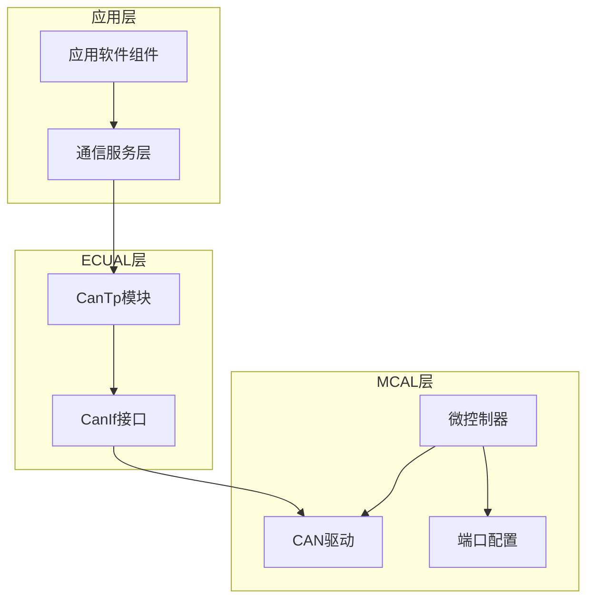

**图表来源**
- [CanTp.h:1-330](file://src/bsw/ecual/cantp/include/CanTp.h#L1-L330)
- [CanTp.c:1-664](file://src/bsw/ecual/cantp/src/CanTp.c#L1-L664)

**章节来源**
- [CanTp.h:1-330](file://src/bsw/ecual/cantp/include/CanTp.h#L1-L330)
- [CanTp_Cfg.h:1-95](file://src/bsw/ecual/cantp/include/CanTp_Cfg.h#L1-L95)

## 核心组件

### 传输协议类型

CanTp支持以下帧类型和传输模式：

| 帧类型 | PCI类型 | 描述 | 数据长度 |
|--------|---------|------|----------|
| 单帧（SF） | 0x00 | 简单数据传输 | 1-7字节 |
| 首帧（FF） | 0x10 | 长消息首段 | 6字节数据 |
| 连续帧（CF） | 0x20 | 长消息后续段 | 7字节数据 |
| 流控帧（FC） | 0x30 | 流量控制信号 | 固定8字节 |

### 地址格式支持

| 地址格式 | 类型 | 描述 |
|----------|------|------|
| 标准地址 | STANDARD | 11位标准标识符 |
| 扩展地址 | EXTENDED | 29位扩展标识符 |
| 混合地址 | MIXED | 11位地址混合模式 |
| 混合29位 | MIXED29BIT | 29位地址混合模式 |
| 正常固定 | NORMALFIXED | 固定地址模式 |
| 自定义地址 | CUSTOM | 用户自定义地址格式 |

### 通道模式

| 模式 | 类型 | 描述 |
|------|------|------|
| 全双工 | FULL_DUPLEX | 支持同时收发 |
| 半双工 | HALF_DUPLEX | 串行收发模式 |

**章节来源**
- [CanTp.h:98-142](file://src/bsw/ecual/cantp/include/CanTp.h#L98-L142)
- [CanTp.h:117-126](file://src/bsw/ecual/cantp/include/CanTp.h#L117-L126)
- [CanTp.h:137-142](file://src/bsw/ecual/cantp/include/CanTp.h#L137-L142)

## 架构概览

CanTp模块采用分层架构，实现了完整的ISO 15765-2协议栈：

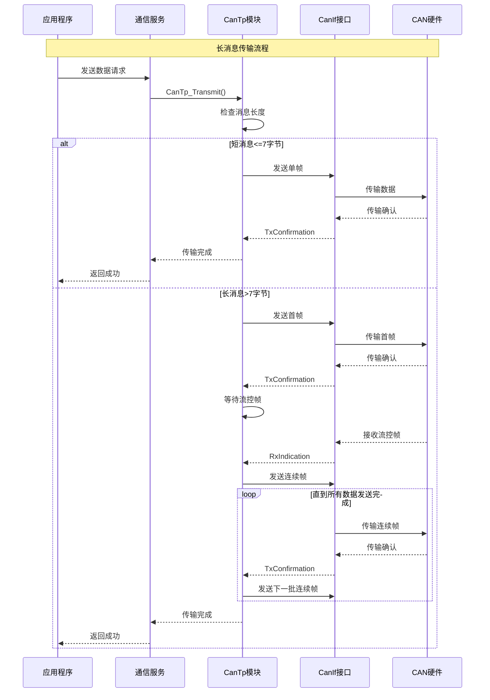

**图表来源**
- [CanTp.c:232-284](file://src/bsw/ecual/cantp/src/CanTp.c#L232-L284)
- [CanTp.c:417-569](file://src/bsw/ecual/cantp/src/CanTp.c#L417-L569)

**章节来源**
- [CanTp.c:1-664](file://src/bsw/ecual/cantp/src/CanTp.c#L1-L664)

## 详细组件分析

### 传输状态管理

CanTp使用有限状态机管理传输过程：

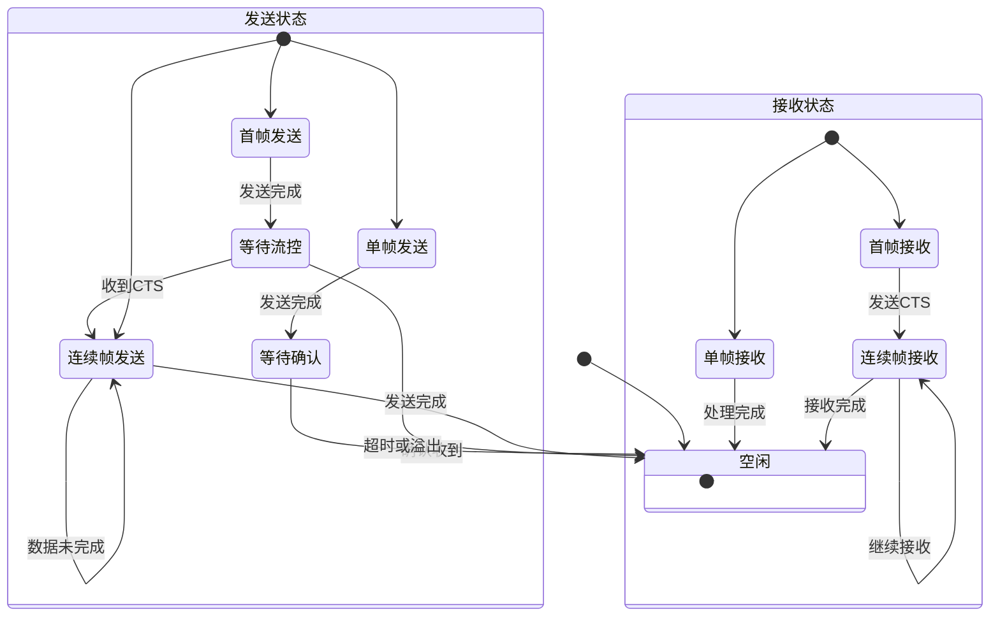

**图表来源**
- [CanTp.c:18-45](file://src/bsw/ecual/cantp/src/CanTp.c#L18-L45)

### 配置参数详解

#### 通用配置参数

| 参数名称 | 默认值 | 描述 | 范围 |
|----------|--------|------|------|
| DevErrorDetect | STD_ON | 错误检测开关 | STD_ON/OFF |
| VersionInfoApi | STD_ON | 版本信息API | STD_ON/OFF |
| DynamicChannelAllocation | STD_OFF | 动态通道分配 | STD_ON/OFF |
| PaddingByte | STD_ON | 填充字节启用 | STD_ON/OFF |
| PaddingByteValue | 0xCC | 填充字节值 | 0x00-0xFF |
| ChangeParameterApi | STD_ON | 参数修改API | STD_ON/OFF |
| ReadParameterApi | STD_ON | 参数读取API | STD_ON/OFF |
| MainFunctionPeriod | 5ms | 主函数周期 | >0 |

#### 通道配置参数

| 参数名称 | 默认值 | 描述 |
|----------|--------|------|
| MaxChannelCnt | 4 | 最大通道数 |
| NumChannels | 2 | 实际通道数 |
| NumTxNsdu | 4 | 发送NSDU数量 |
| NumRxNsdu | 4 | 接收NSDU数量 |

#### 超时配置参数

| 参数名称 | 默认值(ms) | 描述 |
|----------|------------|------|
| NAS_DEFAULT | 25 | N_As：单帧/首帧确认等待时间 |
| NBS_DEFAULT | 75 | N_Bs：等待流控帧超时 |
| NCS_DEFAULT | 25 | N_Cs：连续帧间隔超时 |
| NAR_DEFAULT | 25 | N_Ar：接收确认等待时间 |
| NBR_DEFAULT | 75 | N_Br：接收等待超时 |
| NCR_DEFAULT | 150 | N_Cr：连续帧接收超时 |

#### 流控默认参数

| 参数名称 | 默认值 | 描述 |
|----------|--------|------|
| BS_DEFAULT | 8 | 块大小 |
| STMIN_DEFAULT | 20ms | 最小分离时间 |
| WFT_MAX_DEFAULT | 8 | 最大等待帧次数 |

**章节来源**
- [CanTp_Cfg.h:14-95](file://src/bsw/ecual/cantp/include/CanTp_Cfg.h#L14-L95)

### API接口详解

#### 初始化接口

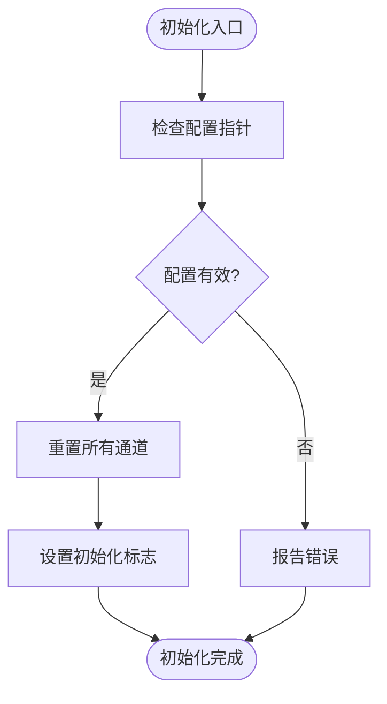

**图表来源**
- [CanTp.c:195-212](file://src/bsw/ecual/cantp/src/CanTp.c#L195-L212)

#### 传输接口

CanTp_Transmit函数处理不同长度的消息：

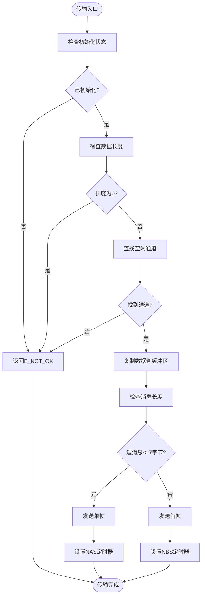

**图表来源**
- [CanTp.c:232-284](file://src/bsw/ecual/cantp/src/CanTp.c#L232-L284)

#### 接收处理接口

接收处理采用状态机模式：

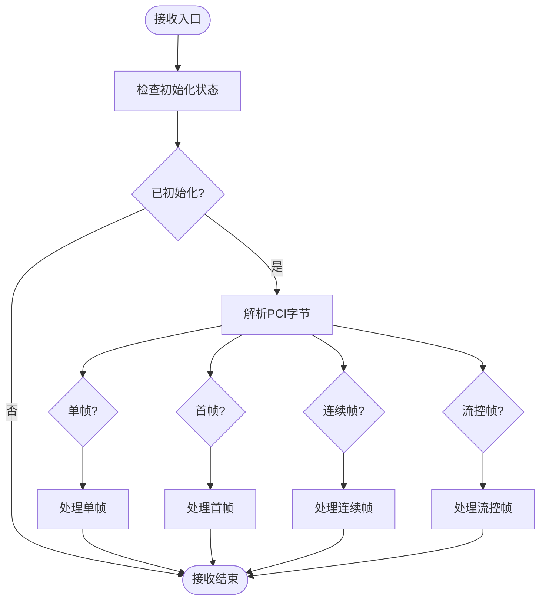

**图表来源**
- [CanTp.c:417-569](file://src/bsw/ecual/cantp/src/CanTp.c#L417-L569)

**章节来源**
- [CanTp.h:251-324](file://src/bsw/ecual/cantp/include/CanTp.h#L251-L324)
- [CanTp.c:232-660](file://src/bsw/ecual/cantp/src/CanTp.c#L232-L660)

### 错误处理机制

CanTp实现了完整的错误检测和处理机制：

#### 错误码分类

| 错误类别 | 错误码范围 | 描述 |
|----------|------------|------|
| DET错误 | 0x01-0x04 | 运行时开发错误 |
| 参数错误 | 0x20-0x80 | 参数验证失败 |
| 传输错误 | 0x01-0x18 | 传输过程错误 |
| 超时错误 | 0x03-0x08 | 超时相关错误 |
| 协议错误 | 0x09-0x17 | 协议违规错误 |

#### 错误检测流程

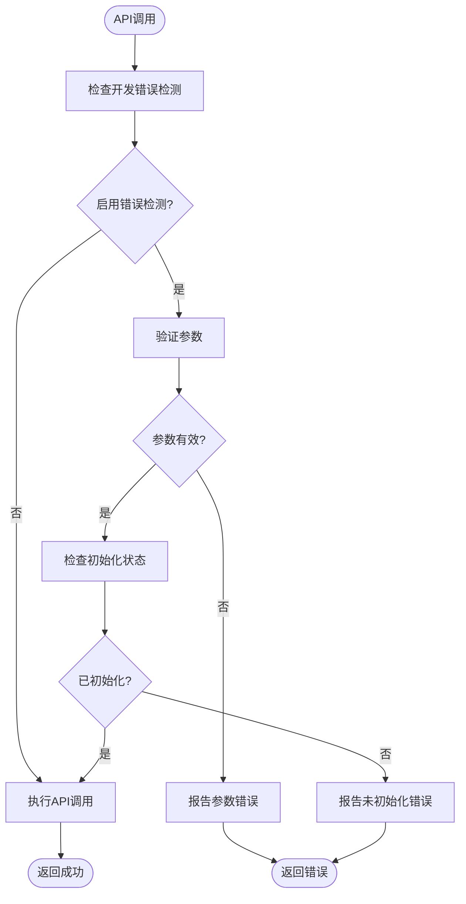

**图表来源**
- [CanTp.c:197-202](file://src/bsw/ecual/cantp/src/CanTp.c#L197-L202)

**章节来源**
- [CanTp.h:52-96](file://src/bsw/ecual/cantp/include/CanTp.h#L52-L96)
- [CanTp.c:195-230](file://src/bsw/ecual/cantp/src/CanTp.c#L195-L230)

## 依赖关系分析

### 外部依赖

CanTp模块依赖于以下外部组件：

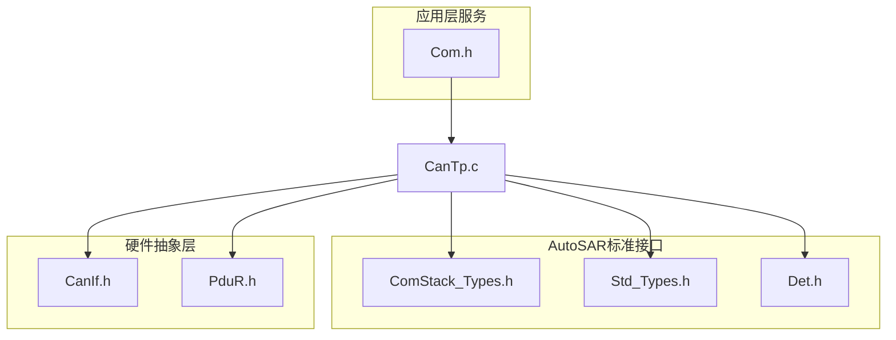

**图表来源**
- [CanTp.c:9-13](file://src/bsw/ecual/cantp/src/CanTp.c#L9-L13)

### 内部数据结构

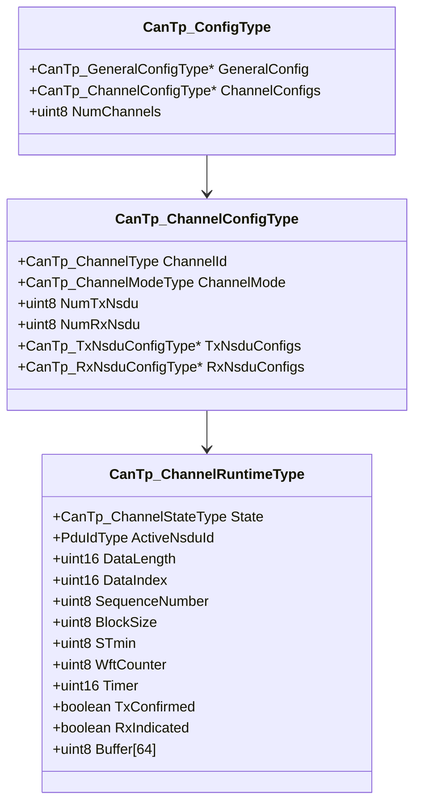

**图表来源**
- [CanTp.h:199-232](file://src/bsw/ecual/cantp/include/CanTp.h#L199-L232)
- [CanTp.c:31-49](file://src/bsw/ecual/cantp/src/CanTp.c#L31-L49)

**章节来源**
- [CanTp.h:159-232](file://src/bsw/ecual/cantp/include/CanTp.h#L159-L232)
- [CanTp.c:31-49](file://src/bsw/ecual/cantp/src/CanTp.c#L31-L49)

## 性能考虑

### 缓冲区管理

CanTp使用静态缓冲区优化内存使用：
- 每个通道维护64字节临时缓冲区
- 支持最大4095字节消息长度
- 内存分配在编译时确定，避免运行时分配开销

### 定时器优化

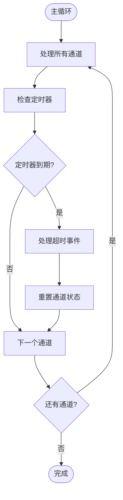

**图表来源**
- [CanTp.c:605-660](file://src/bsw/ecual/cantp/src/CanTp.c#L605-L660)

### 性能调优建议

1. **定时器配置优化**
   - 根据网络负载调整NBS_DEFAULT和NCS_DEFAULT
   - 在高延迟网络中适当增加超时值

2. **缓冲区配置**
   - 根据应用需求调整MAX_MESSAGE_LENGTH
   - 监控缓冲区使用情况，避免频繁重置

3. **流控参数调优**
   - BS_DEFAULT影响吞吐量，STMIN_DEFAULT影响延迟
   - 根据链路特性平衡BS和STMIN值

**章节来源**
- [CanTp_Cfg.h:52-84](file://src/bsw/ecual/cantp/include/CanTp_Cfg.h#L52-L84)
- [CanTp.c:605-660](file://src/bsw/ecual/cantp/src/CanTp.c#L605-L660)

## 故障排除指南

### 常见问题诊断

#### 传输失败排查

| 问题症状 | 可能原因 | 解决方案 |
|----------|----------|----------|
| 传输立即失败 | 未初始化模块 | 调用CanTp_Init() |
| 无响应 | 通道不足 | 增加CANTP_MAX_CHANNEL_CNT |
| 超时错误 | 网络拥塞 | 调整超时参数 |
| 数据损坏 | 填充字节冲突 | 检查填充字节配置 |

#### 接收异常处理

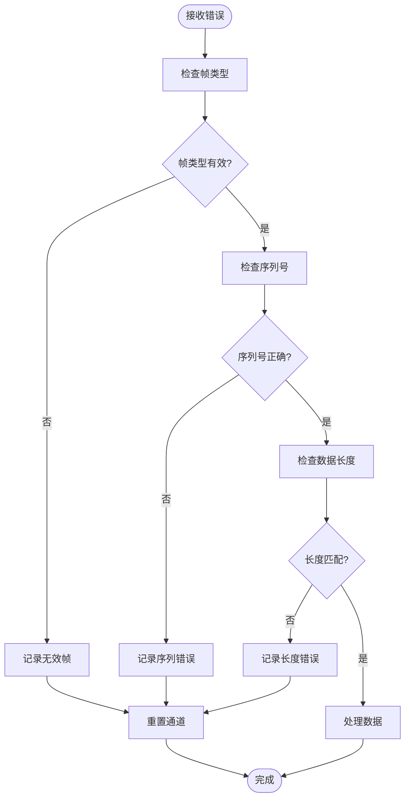

**图表来源**
- [CanTp.c:490-527](file://src/bsw/ecual/cantp/src/CanTp.c#L490-L527)

#### 调试工具和方法

1. **启用开发错误检测**
   ```c
   #define CANTP_DEV_ERROR_DETECT STD_ON
   ```

2. **监控通道状态**
   - 使用调试输出跟踪状态转换
   - 监控定时器值变化

3. **性能监控**
   - 记录传输延迟分布
   - 监控错误率统计

**章节来源**
- [CanTp.c:417-569](file://src/bsw/ecual/cantp/src/CanTp.c#L417-L569)
- [Det.h:47-70](file://src/bsw/services/det/include/Det.h#L47-L70)

## 结论

CanTp模块提供了完整的ISO 15765-2协议实现，具有以下特点：

1. **标准化实现**：完全符合AutoSAR和ISO 15765-2标准
2. **灵活配置**：支持多种地址格式和传输模式
3. **健壮性**：完善的错误检测和恢复机制
4. **高性能**：优化的内存使用和处理效率
5. **可扩展性**：模块化设计便于功能扩展

该模块为车载网络应用提供了可靠的数据传输基础，支持从简单诊断到复杂数据下载的各种场景。通过合理的配置和调优，可以在不同网络环境下获得最佳的传输性能。