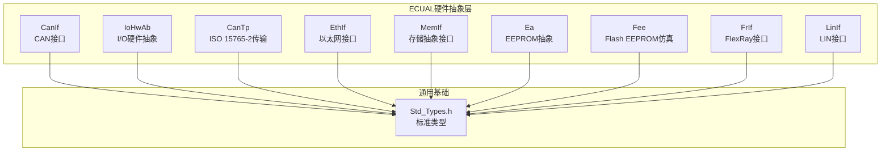
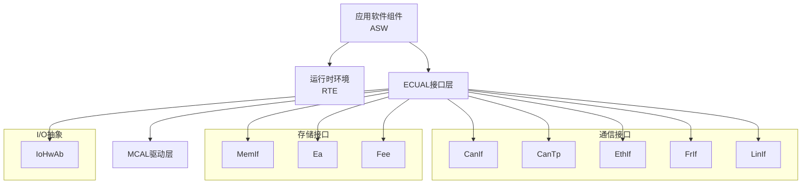
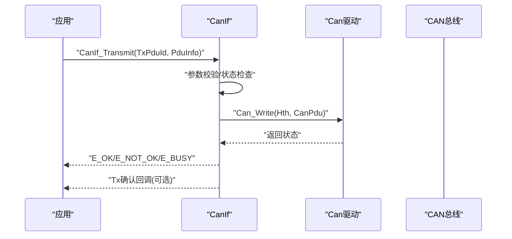
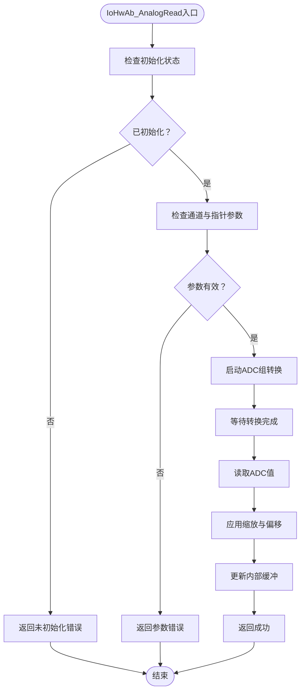
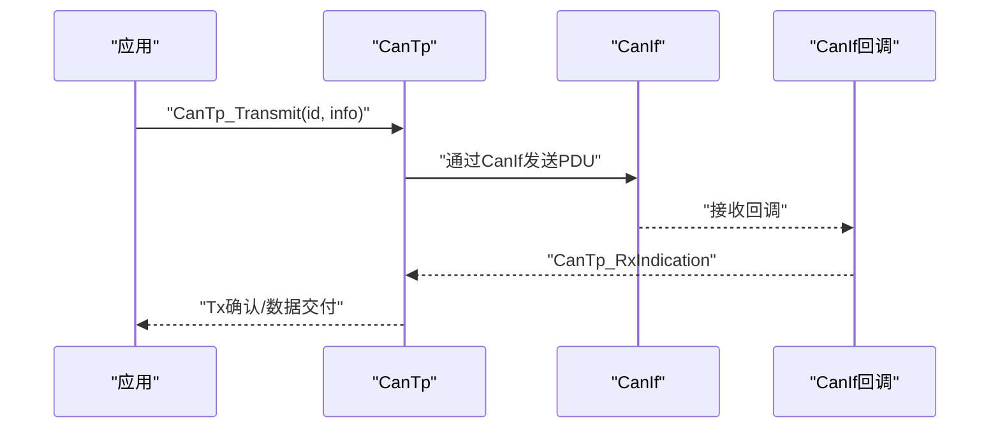
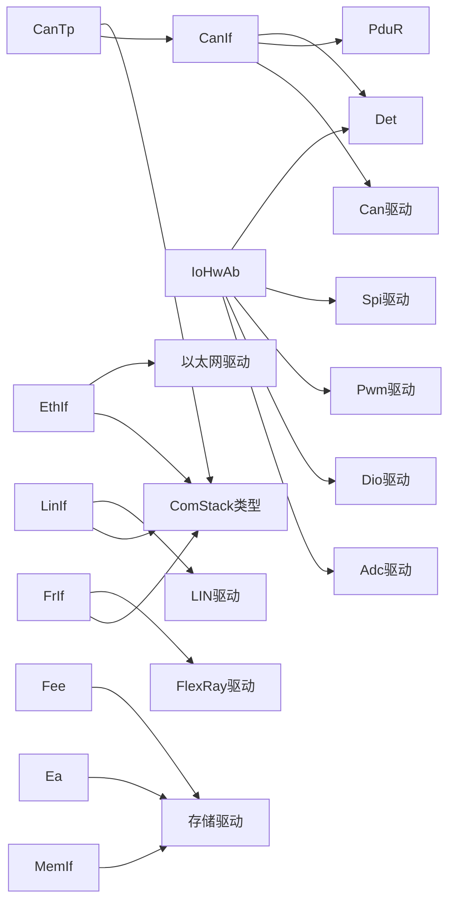

# ECUAL硬件抽象接口层API

<cite>
**本文档引用的文件**
- [CanIf.h](file://src/bsw/ecual/canif/include/CanIf.h)
- [CanIf.c](file://src/bsw/ecual/canif/src/CanIf.c)
- [CanIf_Cfg.h](file://src/bsw/ecual/canif/include/CanIf_Cfg.h)
- [IoHwAb.h](file://src/bsw/ecual/iohwab/include/IoHwAb.h)
- [IoHwAb.c](file://src/bsw/ecual/iohwab/src/IoHwAb.c)
- [IoHwAb_Cfg.h](file://src/bsw/ecual/iohwab/include/IoHwAb_Cfg.h)
- [CanTp.h](file://src/bsw/ecual/cantp/include/CanTp.h)
- [EthIf.h](file://src/bsw/ecual/ethif/include/EthIf.h)
- [MemIf.h](file://src/bsw/ecual/memif/include/MemIf.h)
- [Ea.h](file://src/bsw/ecual/ea/include/Ea.h)
- [Fee.h](file://src/bsw/ecual/fee/include/Fee.h)
- [FrIf.h](file://src/bsw/ecual/frif/include/FrIf.h)
- [LinIf.h](file://src/bsw/ecual/linif/include/LinIf.h)
- [Std_Types.h](file://src/bsw/os/include/Std_Types.h)
- [main.c](file://examples/can_demo/main.c)
- [main.c](file://examples/led_blink/main.c)
</cite>

## 目录
1. [简介](#简介)
2. [项目结构](#项目结构)
3. [核心组件](#核心组件)
4. [架构总览](#架构总览)
5. [详细组件分析](#详细组件分析)
6. [依赖关系分析](#依赖关系分析)
7. [性能考虑](#性能考虑)
8. [故障排除指南](#故障排除指南)
9. [结论](#结论)
10. [附录](#附录)

## 简介
本文件为ECUAL（ECU抽象层）硬件抽象接口层的全面API参考文档，覆盖以下模块的公共接口与使用说明：
- 通信接口：CanIf（CAN）、CanTp（ISO 15765-2）、EthIf（以太网）、FrIf（FlexRay）、LinIf（LIN）
- 存储抽象：MemIf（统一存储接口）、Ea（EEPROM抽象）、Fee（Flash EEPROM仿真）
- 输入输出抽象：IoHwAb（I/O硬件抽象）

文档重点包括：
- 接口函数签名、参数说明、返回值定义
- 配置参数与启用开关
- 错误码与检测策略
- 典型使用场景与流程图
- 性能优化与最佳实践

## 项目结构
ECUAL位于src/bsw/ecual目录下，按功能模块分层组织，每个模块包含头文件与实现源文件，并配套独立的配置头文件。

图表来源
- [CanIf.h:1-403](file://src/bsw/ecual/canif/include/CanIf.h#L1-L403)
- [IoHwAb.h:1-263](file://src/bsw/ecual/iohwab/include/IoHwAb.h#L1-L263)
- [CanTp.h:1-330](file://src/bsw/ecual/cantp/include/CanTp.h#L1-L330)
- [EthIf.h:1-367](file://src/bsw/ecual/ethif/include/EthIf.h#L1-L367)
- [MemIf.h:1-232](file://src/bsw/ecual/memif/include/MemIf.h#L1-L232)
- [Ea.h:1-242](file://src/bsw/ecual/ea/include/Ea.h#L1-L242)
- [Fee.h:1-273](file://src/bsw/ecual/fee/include/Fee.h#L1-L273)
- [FrIf.h:1-367](file://src/bsw/ecual/frif/include/FrIf.h#L1-L367)
- [LinIf.h:1-305](file://src/bsw/ecual/linif/include/LinIf.h#L1-L305)
- [Std_Types.h:1-117](file://src/bsw/os/include/Std_Types.h#L1-L117)

章节来源
- [CanIf.h:1-403](file://src/bsw/ecual/canif/include/CanIf.h#L1-L403)
- [IoHwAb.h:1-263](file://src/bsw/ecual/iohwab/include/IoHwAb.h#L1-L263)
- [CanTp.h:1-330](file://src/bsw/ecual/cantp/include/CanTp.h#L1-L330)
- [EthIf.h:1-367](file://src/bsw/ecual/ethif/include/EthIf.h#L1-L367)
- [MemIf.h:1-232](file://src/bsw/ecual/memif/include/MemIf.h#L1-L232)
- [Ea.h:1-242](file://src/bsw/ecual/ea/include/Ea.h#L1-L242)
- [Fee.h:1-273](file://src/bsw/ecual/fee/include/Fee.h#L1-L273)
- [FrIf.h:1-367](file://src/bsw/ecual/frif/include/FrIf.h#L1-L367)
- [LinIf.h:1-305](file://src/bsw/ecual/linif/include/LinIf.h#L1-L305)
- [Std_Types.h:1-117](file://src/bsw/os/include/Std_Types.h#L1-L117)

## 核心组件
本节概述各模块提供的核心能力与典型职责：
- CanIf：提供CAN控制器模式控制、PDU收发、动态ID设置、收发器模式与唤醒管理等接口，支持错误检测与版本信息查询。
- IoHwAb：抽象ADC、DIO、PWM、SPI等外设，提供模拟量读取/写入、数字量读取/写入、PWM参数设置、SPI数据传输等接口。
- CanTp：实现ISO 15765-2传输协议，支持单帧/首帧/连续帧/流控帧处理、参数变更与读取、主函数周期性处理。
- EthIf：以太网控制器初始化与模式控制、物理地址设置/读取、帧传输、时间戳获取、收发器唤醒模式管理等。
- MemIf：统一存储接口，抽象底层EEPROM与Flash设备，提供读写、取消、状态查询、块失效/擦除等操作。
- Ea：EEPROM抽象层，提供块级读写、状态查询、作业结果、块失效/擦除、擦写次数统计等。
- Fee：Flash EEPROM仿真，提供虚拟页管理、垃圾回收、写/擦写计数统计、作业通知回调等。
- FrIf：FlexRay接口，提供控制器初始化、绝对/相对定时器、全局时间、POC状态、冷启动/通信控制、唤醒通道设置等。
- LinIf：LIN接口，提供通道初始化、调度请求、睡眠/唤醒、收发器模式、唤醒检测与取消、主函数处理等。

章节来源
- [CanIf.h:268-403](file://src/bsw/ecual/canif/include/CanIf.h#L268-L403)
- [IoHwAb.h:173-263](file://src/bsw/ecual/iohwab/include/IoHwAb.h#L173-L263)
- [CanTp.h:246-330](file://src/bsw/ecual/cantp/include/CanTp.h#L246-L330)
- [EthIf.h:228-367](file://src/bsw/ecual/ethif/include/EthIf.h#L228-L367)
- [MemIf.h:139-232](file://src/bsw/ecual/memif/include/MemIf.h#L139-L232)
- [Ea.h:141-242](file://src/bsw/ecual/ea/include/Ea.h#L141-L242)
- [Fee.h:160-273](file://src/bsw/ecual/fee/include/Fee.h#L160-L273)
- [FrIf.h:230-367](file://src/bsw/ecual/frif/include/FrIf.h#L230-L367)
- [LinIf.h:191-305](file://src/bsw/ecual/linif/include/LinIf.h#L191-L305)

## 架构总览
ECUAL通过“接口层+驱动层”解耦，上层应用仅依赖接口层，不直接访问具体MCAL驱动。接口层负责：
- 参数校验与错误上报（DET）
- 协议适配与状态机管理
- 回调与事件通知
- 统一的配置入口与运行时参数

图表来源
- [CanIf.h:1-403](file://src/bsw/ecual/canif/include/CanIf.h#L1-L403)
- [IoHwAb.h:1-263](file://src/bsw/ecual/iohwab/include/IoHwAb.h#L1-L263)
- [CanTp.h:1-330](file://src/bsw/ecual/cantp/include/CanTp.h#L1-L330)
- [EthIf.h:1-367](file://src/bsw/ecual/ethif/include/EthIf.h#L1-L367)
- [MemIf.h:1-232](file://src/bsw/ecual/memif/include/MemIf.h#L1-L232)
- [Ea.h:1-242](file://src/bsw/ecual/ea/include/Ea.h#L1-L242)
- [Fee.h:1-273](file://src/bsw/ecual/fee/include/Fee.h#L1-L273)
- [FrIf.h:1-367](file://src/bsw/ecual/frif/include/FrIf.h#L1-L367)
- [LinIf.h:1-305](file://src/bsw/ecual/linif/include/LinIf.h#L1-L305)

## 详细组件分析

### CanIf（CAN接口）
- 初始化与去初始化
  - 函数：CanIf_Init、CanIf_DeInit
  - 功能：加载配置、初始化内部状态；去初始化时重置状态并释放资源
  - 错误：未初始化/重复初始化、空指针
- 控制器模式管理
  - 函数：CanIf_SetControllerMode、CanIf_GetControllerMode
  - 支持模式：未初始化、睡眠、已启动、已停止
- PDU模式管理
  - 函数：CanIf_SetPduMode、CanIf_GetPduMode
  - 支持模式：离线、仅TX离线、仅TX离线激活、在线
- 数据传输
  - 函数：CanIf_Transmit、CanIf_CancelTransmit
  - 发送前检查控制器状态与PDU模式；返回E_OK/E_NOT_OK/E_BUSY
- 收发器与唤醒
  - 函数：CanIf_SetTrcvMode、CanIf_GetTrcvMode、CanIf_GetTrcvWakeupReason、CanIf_SetTrcvWakeupMode、CanIf_CheckWakeup
- 波特率与版本信息
  - 函数：CanIf_SetBaudrate、CanIf_GetBaudrate、CanIf_GetVersionInfo

图表来源
- [CanIf.h:272-305](file://src/bsw/ecual/canif/include/CanIf.h#L272-L305)
- [CanIf.c:142-185](file://src/bsw/ecual/canif/src/CanIf.c#L142-L185)

章节来源
- [CanIf.h:268-403](file://src/bsw/ecual/canif/include/CanIf.h#L268-L403)
- [CanIf.c:1-200](file://src/bsw/ecual/canif/src/CanIf.c#L1-L200)
- [CanIf_Cfg.h:1-84](file://src/bsw/ecual/canif/include/CanIf_Cfg.h#L1-L84)

### IoHwAb（I/O硬件抽象）
- 初始化与去初始化
  - 函数：IoHwAb_Init、IoHwAb_DeInit
  - 功能：初始化ADC/PWM/SPI驱动，清空内部缓冲区；去初始化时反向释放
- 模拟量接口
  - 函数：IoHwAb_AnalogRead、IoHwAb_AnalogWrite
  - 支持缩放与偏移转换，写入需DAC支持（当前平台无DAC，返回未实现）
- 数字量接口
  - 函数：IoHwAb_DigitalRead、IoHwAb_DigitalWrite
  - 支持引脚反转配置
- PWM接口
  - 函数：IoHwAb_PwmSetDuty、IoHwAb_PwmSetFreqAndDuty
  - 默认周期与占空比由配置决定
- SPI接口
  - 函数：IoHwAb_SpiTransfer
  - 支持指定设备序列、片选拉低引脚与波特率
- 版本信息与主函数
  - 函数：IoHwAb_GetVersionInfo、IoHwAb_MainFunction

图表来源
- [IoHwAb.h:194-204](file://src/bsw/ecual/iohwab/include/IoHwAb.h#L194-L204)
- [IoHwAb.c:97-142](file://src/bsw/ecual/iohwab/src/IoHwAb.c#L97-L142)

章节来源
- [IoHwAb.h:173-263](file://src/bsw/ecual/iohwab/include/IoHwAb.h#L173-L263)
- [IoHwAb.c:1-200](file://src/bsw/ecual/iohwab/src/IoHwAb.c#L1-L200)
- [IoHwAb_Cfg.h:1-102](file://src/bsw/ecual/iohwab/include/IoHwAb_Cfg.h#L1-L102)

### CanTp（ISO 15765-2传输）
- 初始化与关闭
  - 函数：CanTp_Init、CanTp_Shutdown
- 数据传输与取消
  - 函数：CanTp_Transmit、CanTp_CancelTransmit、CanTp_CancelReceive
- 参数读写
  - 函数：CanTp_ChangeParameter、CanTp_ReadParameter
- 周期性处理与回调
  - 函数：CanTp_MainFunction
  - 回调：CanTp_RxIndication、CanTp_TxConfirmation

图表来源
- [CanTp.h:246-330](file://src/bsw/ecual/cantp/include/CanTp.h#L246-L330)

章节来源
- [CanTp.h:246-330](file://src/bsw/ecual/cantp/include/CanTp.h#L246-L330)

### EthIf（以太网接口）
- 控制器初始化与模式
  - 函数：EthIf_Init、EthIf_ControllerInit、EthIf_SetControllerMode、EthIf_GetControllerMode
- 地址与帧传输
  - 函数：EthIf_GetPhysAddr、EthIf_SetPhysAddr、EthIf_Transmit
- 时间戳与收发器
  - 函数：EthIf_GetCurrentTime、EthIf_EnableEgressTimeStamp、EthIf_GetEgressTimeStamp、EthIf_GetIngressTimeStamp
  - 支持收发器唤醒模式设置与查询
- 版本信息与主函数
  - 函数：EthIf_GetVersionInfo、EthIf_MainFunction
  - 回调：EthIf_RxIndication、EthIf_TxConfirmation

章节来源
- [EthIf.h:228-367](file://src/bsw/ecual/ethif/include/EthIf.h#L228-L367)

### MemIf（存储抽象接口）
- 设备与块管理
  - 函数：MemIf_Init、MemIf_Read、MemIf_Write、MemIf_Cancel、MemIf_GetStatus、MemIf_GetJobResult
  - 块操作：MemIf_InvalidateBlock、MemIf_EraseImmediateBlock
- 模式设置
  - 函数：MemIf_SetMode（慢速/快速模式）

章节来源
- [MemIf.h:139-232](file://src/bsw/ecual/memif/include/MemIf.h#L139-L232)

### Ea（EEPROM抽象）
- 块级操作
  - 函数：Ea_Init、Ea_Read、Ea_Write、Ea_Cancel、Ea_GetStatus、Ea_GetJobResult
  - 块操作：Ea_InvalidateBlock、Ea_EraseImmediateBlock
- 作业通知与擦写统计
  - 函数：Ea_JobEndNotification、Ea_JobErrorNotification、Ea_GetEraseCycleCount
- 模式设置与主函数
  - 函数：Ea_SetMode、Ea_MainFunction

章节来源
- [Ea.h:141-242](file://src/bsw/ecual/ea/include/Ea.h#L141-L242)

### Fee（Flash EEPROM仿真）
- 块级操作与垃圾回收
  - 函数：Fee_Init、Fee_Read、Fee_Write、Fee_Cancel、Fee_GetStatus、Fee_GetJobResult
  - 块操作：Fee_InvalidateBlock、Fee_EraseImmediateBlock
- 统计与通知
  - 函数：Fee_JobEndNotification、Fee_JobErrorNotification、Fee_GetCycleCount、Fee_GetEraseCycleCount、Fee_GetWriteCycleCount
- 模式设置与主函数
  - 函数：Fee_SetMode、Fee_MainFunction

章节来源
- [Fee.h:160-273](file://src/bsw/ecual/fee/include/Fee.h#L160-L273)

### FrIf（FlexRay接口）
- 控制器与定时器
  - 函数：FrIf_Init、FrIf_ControllerInit、FrIf_SetAbsoluteTimer、FrIf_SetRelativeTimer、FrIf_CancelAbsoluteTimer、FrIf_CancelRelativeTimer
- 通信与状态
  - 函数：FrIf_Transmit、FrIf_GetPOCStatus、FrIf_GetGlobalTime、FrIf_AllowColdstart、FrIf_HaltCommunication、FrIf_AbortCommunication
- 唤醒与收发器
  - 函数：FrIf_SendWUP、FrIf_SetWakeupChannel、FrIf_SetTransceiverMode、FrIf_GetTransceiverMode、FrIf_GetTransceiverWakeupReason、FrIf_EnableTransceiverWakeup、FrIf_DisableTransceiverWakeup、FrIf_ClearTransceiverWakeup
- 版本信息与主函数

章节来源
- [FrIf.h:230-367](file://src/bsw/ecual/frif/include/FrIf.h#L230-L367)

### LinIf（LIN接口）
- 通道与调度
  - 函数：LinIf_Init、LinIf_InitChannel、LinIf_Transmit、LinIf_ScheduleRequest、LinIf_GotoSleep、LinIf_WakeUp
- 收发器与唤醒
  - 函数：LinIf_SetTransceiverMode、LinIf_GetTransceiverMode、LinIf_CheckWakeup、LinIf_DisableWakeup、LinIf_EnableWakeup
- 取消与版本信息
  - 函数：LinIf_CancelTransmit、LinIf_GetVersionInfo、LinIf_WakeUpConfirmation、LinIf_MainFunction

章节来源
- [LinIf.h:191-305](file://src/bsw/ecual/linif/include/LinIf.h#L191-L305)

## 依赖关系分析
- 接口到驱动的依赖
  - CanIf依赖Can驱动与PduR、Det
  - IoHwAb依赖Adc、Dio、Pwm、Spi驱动与Det
  - CanTp依赖CanIf与ComStack类型
  - EthIf依赖ComStack类型与底层以太网驱动
  - MemIf/Ea/Fee依赖底层存储驱动
  - FrIf依赖ComStack类型与FlexRay驱动
  - LinIf依赖ComStack类型与LIN驱动
- 配置依赖
  - 各模块均通过各自的Cfg头文件进行编译期配置与运行期全局配置指针

图表来源
- [CanIf.c:9-14](file://src/bsw/ecual/canif/src/CanIf.c#L9-L14)
- [IoHwAb.c:9-15](file://src/bsw/ecual/iohwab/src/IoHwAb.c#L9-L15)
- [CanTp.h:18-23](file://src/bsw/ecual/cantp/include/CanTp.h#L18-L23)
- [EthIf.h:17-22](file://src/bsw/ecual/ethif/include/EthIf.h#L17-L22)
- [FrIf.h:17-22](file://src/bsw/ecual/frif/include/FrIf.h#L17-L22)
- [LinIf.h:17-22](file://src/bsw/ecual/linif/include/LinIf.h#L17-L22)

章节来源
- [CanIf.c:9-14](file://src/bsw/ecual/canif/src/CanIf.c#L9-L14)
- [IoHwAb.c:9-15](file://src/bsw/ecual/iohwab/src/IoHwAb.c#L9-L15)
- [CanTp.h:18-23](file://src/bsw/ecual/cantp/include/CanTp.h#L18-L23)
- [EthIf.h:17-22](file://src/bsw/ecual/ethif/include/EthIf.h#L17-L22)
- [FrIf.h:17-22](file://src/bsw/ecual/frif/include/FrIf.h#L17-L22)
- [LinIf.h:17-22](file://src/bsw/ecual/linif/include/LinIf.h#L17-L22)

## 性能考虑
- 错误检测与日志
  - 所有模块均支持DET（开发期错误检测），在调试阶段开启可显著提升问题定位效率，但会带来少量运行时开销
- 中断与轮询
  - 对于I/O与存储类操作，优先采用中断方式减少CPU占用；必要时使用轮询以简化实现
- 缓冲与批处理
  - IoHwAb内部维护缓冲区，避免频繁底层调用；存储类接口建议批量写入以降低擦写次数
- 定时器与主函数
  - 各模块提供主函数接口，建议在系统主循环中定期调用，确保协议栈与状态机及时推进
- 内存映射与分区
  - 使用MemMap.h进行代码与配置段划分，合理布局静态变量与常量，减少内存碎片

## 故障排除指南
- 常见错误码定位
  - CanIf：参数无效、未初始化、控制器模式错误、PDU模式错误、波特率参数错误等
  - IoHwAb：通道越界、参数指针为空、未初始化、忙/超时等
  - CanTp：配置参数错误、SDU ID无效、缓冲区长度错误、通信错误等
  - EthIf：控制器索引/收发器索引无效、帧类型/ID错误、时间戳类型不支持等
  - MemIf/Ea/Fee：设备/块参数无效、作业被取消、内部忙、GC忙等
  - FrIf：控制器/通道/收发器索引无效、定时器索引无效、POC状态错误等
  - LinIf：通道不存在、调度请求错误、收发器模式不支持、唤醒源错误等
- 排查步骤
  - 检查初始化顺序与配置指针是否正确传递
  - 开启DET并查看报告，定位首次触发错误的调用点
  - 核对PDU ID、控制器ID、通道ID与配置表一致
  - 对于存储类接口，确认块大小、偏移与写入长度匹配
  - 对于通信类接口，确认控制器模式与PDU模式满足发送条件

章节来源
- [CanIf.h:60-91](file://src/bsw/ecual/canif/include/CanIf.h#L60-L91)
- [IoHwAb.h:54-64](file://src/bsw/ecual/iohwab/include/IoHwAb.h#L54-L64)
- [CanTp.h:52-96](file://src/bsw/ecual/cantp/include/CanTp.h#L52-L96)
- [EthIf.h:62-91](file://src/bsw/ecual/ethif/include/EthIf.h#L62-L91)
- [MemIf.h:48-56](file://src/bsw/ecual/memif/include/MemIf.h#L48-L56)
- [Ea.h:54-66](file://src/bsw/ecual/ea/include/Ea.h#L54-L66)
- [Fee.h:57-77](file://src/bsw/ecual/fee/include/Fee.h#L57-L77)
- [FrIf.h:71-96](file://src/bsw/ecual/frif/include/FrIf.h#L71-L96)
- [LinIf.h:57-78](file://src/bsw/ecual/linif/include/LinIf.h#L57-L78)

## 结论
ECUAL硬件抽象接口层通过标准化的API与严格的配置管理，实现了对多种通信与存储协议的统一抽象。结合DET与清晰的错误码体系，开发者可在保证可移植性的同时获得良好的可维护性与可诊断性。建议在实际项目中：
- 严格遵循初始化顺序与配置规范
- 在开发阶段开启DET，生产阶段根据需求选择性关闭
- 合理设计PDU路由与存储策略，优化性能与可靠性

## 附录

### 实际应用场景与示例路径
- CAN通信演示（含回调与周期处理）
  - 示例路径：[examples/can_demo/main.c:1-119](file://examples/can_demo/main.c#L1-L119)
- LED闪烁（基于Dio与Gpt）
  - 示例路径：[examples/led_blink/main.c:1-100](file://examples/led_blink/main.c#L1-L100)

章节来源
- [main.c:1-119](file://examples/can_demo/main.c#L1-L119)
- [main.c:1-100](file://examples/led_blink/main.c#L1-L100)

### 配置参数速查
- CanIf
  - 开关：DEV_ERROR_DETECT、VERSION_INFO_API、DLC_CHECK、SOFTWARE_FILTER_TYPE
  - API使能：READRXPDUDATA_API、READTXPDUNOTIFYSTATUS_API、READRXPDUNOTIFYSTATUS_API、SETDYNAMICTXID_API、CANCELTRANSMIT_SUPPORT
  - 数量：NUM_CONTROLLERS、NUM_TX_PDUS、NUM_RX_PDUS、NUM_HRH、NUM_HTH、NUM_TRANSCEIVERS
  - 默认波特率：DEFAULT_BAUDRATE
  - 主函数周期：MAIN_FUNCTION_PERIOD_MS
- IoHwAb
  - 开关：DEV_ERROR_DETECT、VERSION_INFO_API
  - 数量：NUM_ANALOG_CHANNELS、NUM_DIGITAL_CHANNELS、NUM_PWM_CHANNELS、NUM_SPI_DEVICES
  - ADC分辨率：ADC_RESOLUTION
  - PWM占空比缩放：PWM_DUTY_SCALE
  - 主函数周期：MAIN_FUNCTION_PERIOD_MS

章节来源
- [CanIf_Cfg.h:15-84](file://src/bsw/ecual/canif/include/CanIf_Cfg.h#L15-L84)
- [IoHwAb_Cfg.h:15-102](file://src/bsw/ecual/iohwab/include/IoHwAb_Cfg.h#L15-L102)