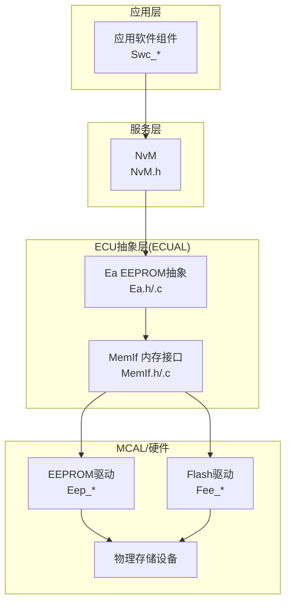
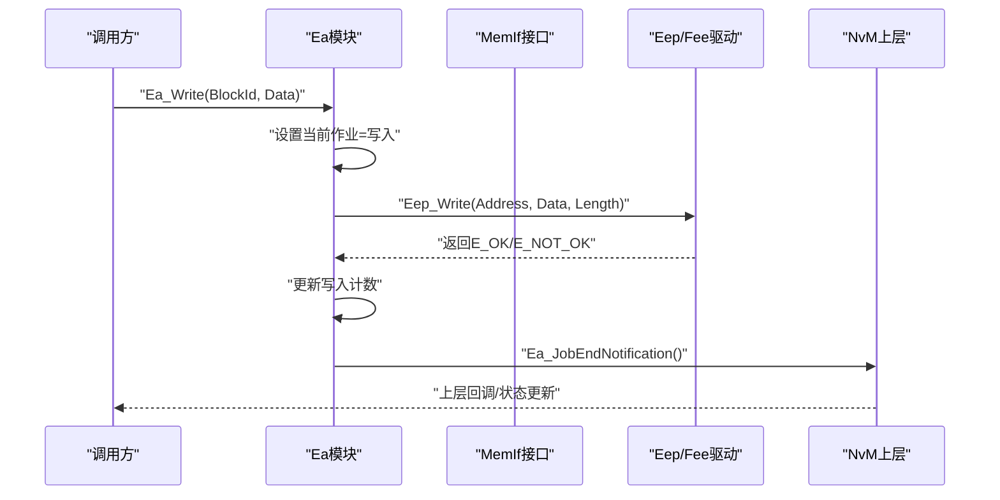
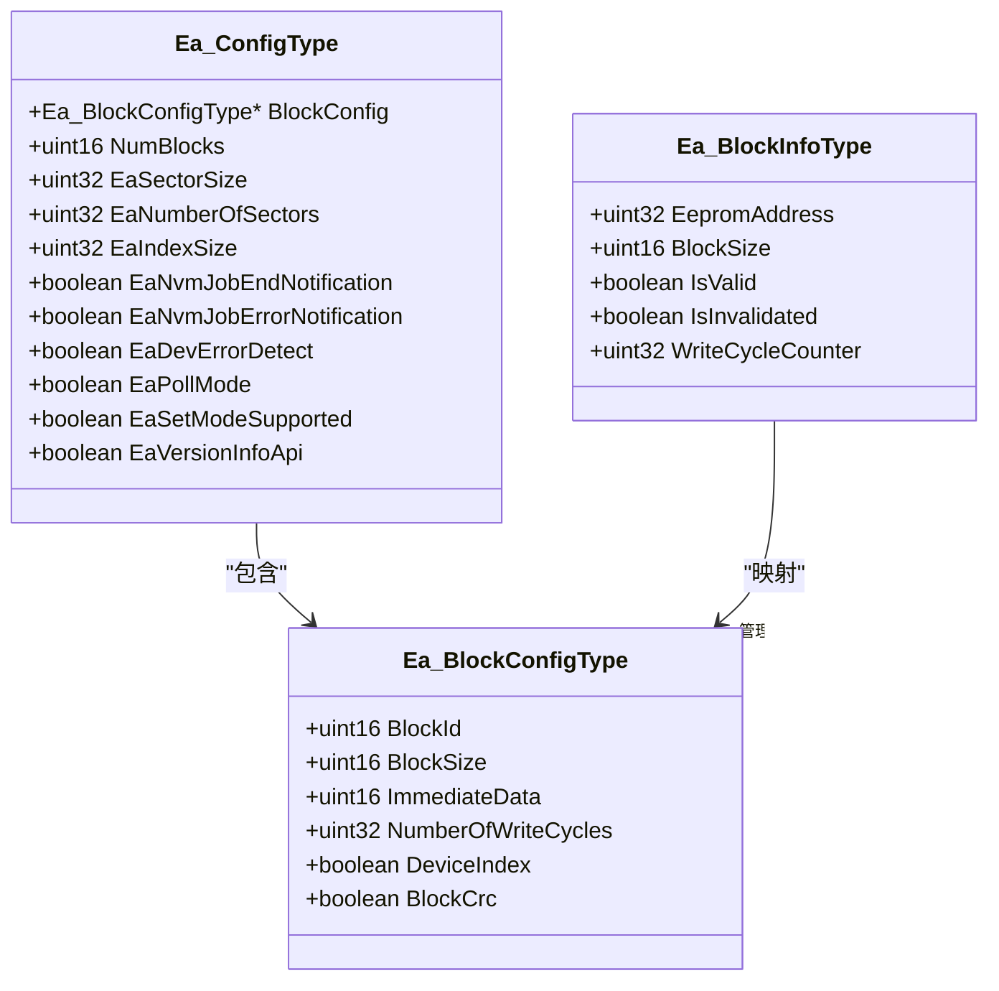
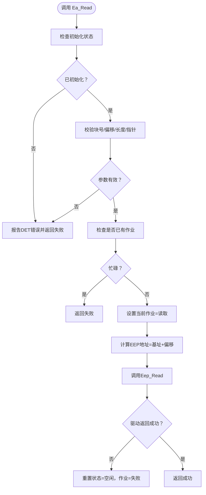
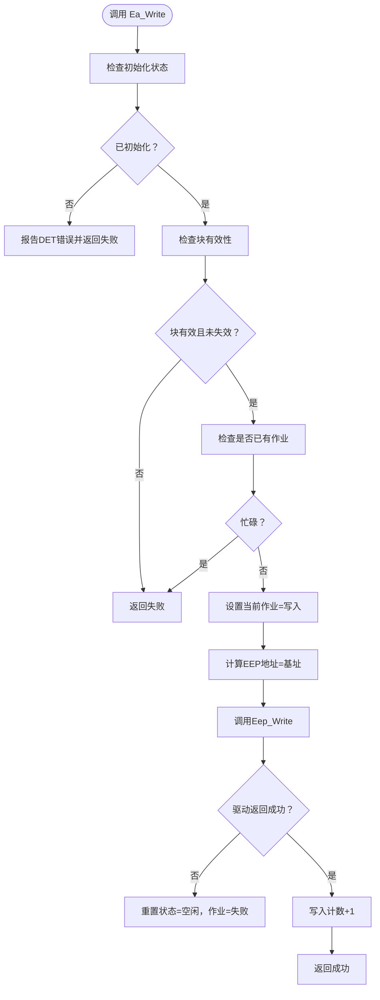
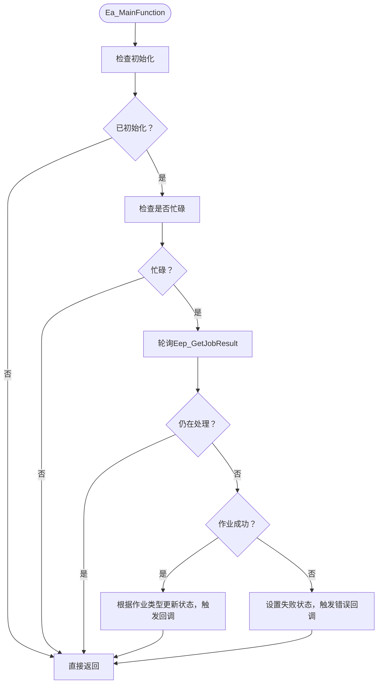
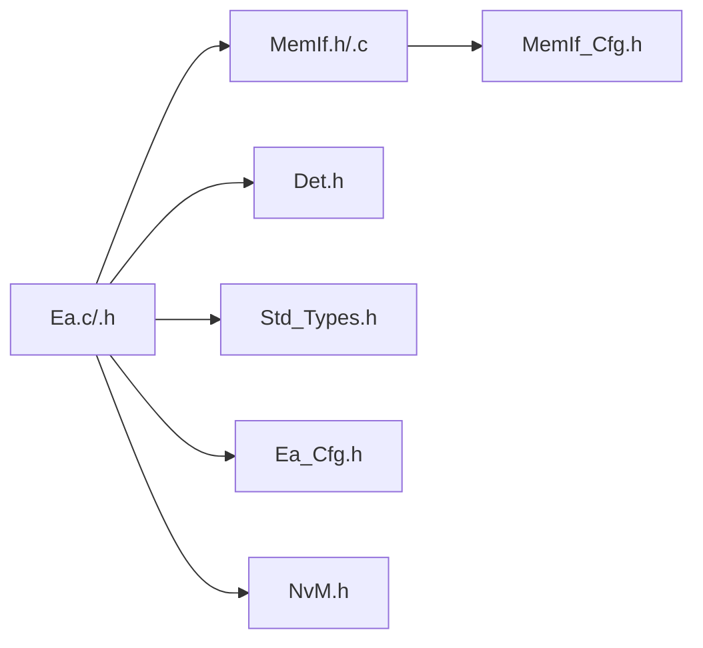

# Ea EEPROM抽象API

<cite>
**本文引用的文件**
- [Ea.h](file://src/bsw/ecual/ea/include/Ea.h)
- [Ea_Cfg.h](file://src/bsw/ecual/ea/include/Ea_Cfg.h)
- [Ea.c](file://src/bsw/ecual/ea/src/Ea.c)
- [MemIf.h](file://src/bsw/ecual/memif/include/MemIf.h)
- [MemIf_Cfg.h](file://src/bsw/ecual/memif/include/MemIf_Cfg.h)
- [NvM.h](file://src/bsw/services/nvm/include/NvM.h)
- [NvM_Cfg.h](file://src/bsw/services/nvm/include/NvM_Cfg.h)
- [Det.h](file://src/bsw/services/det/include/Det.h)
- [Std_Types.h](file://src/bsw/os/include/Std_Types.h)
- [bsw_config.json](file://config/bsw_config.json)
</cite>

## 目录
1. [简介](#简介)
2. [项目结构](#项目结构)
3. [核心组件](#核心组件)
4. [架构总览](#架构总览)
5. [详细组件分析](#详细组件分析)
6. [依赖关系分析](#依赖关系分析)
7. [性能考虑](#性能考虑)
8. [故障排查指南](#故障排查指南)
9. [结论](#结论)
10. [附录](#附录)

## 简介
本文件为Ea EEPROM抽象模块的全面API参考文档，面向AutoSAR Classic Platform 4.x标准实现。该模块位于ECU抽象层（ECUAL），向上提供统一的EEPROM访问接口，向下通过MemIf适配不同底层存储设备（如EEPROM/FEE/Flash）。核心功能涵盖初始化、读写、取消、状态查询、块失效与立即擦除、作业通知回调、版本信息与擦除计数查询，以及周期性主函数处理。

## 项目结构
Ea模块位于ECUAL层，与MemIf、NvM、DET、标准类型等模块协同工作，形成从应用到硬件的完整存储栈。

**图表来源**
- [Ea.h:147-239](file://src/bsw/ecual/ea/include/Ea.h#L147-L239)
- [MemIf.h:145-229](file://src/bsw/ecual/memif/include/MemIf.h#L145-L229)
- [NvM.h:191-350](file://src/bsw/services/nvm/include/NvM.h#L191-L350)

**章节来源**
- [Ea.h:1-242](file://src/bsw/ecual/ea/include/Ea.h#L1-L242)
- [Ea_Cfg.h:1-77](file://src/bsw/ecual/ea/include/Ea_Cfg.h#L1-L77)
- [MemIf.h:1-232](file://src/bsw/ecual/memif/include/MemIf.h#L1-L232)
- [NvM.h:1-355](file://src/bsw/services/nvm/include/NvM.h#L1-L355)

## 核心组件
- Ea模块：提供EEPROM抽象接口，管理块地址、作业状态、写入计数与擦除计数。
- MemIf模块：统一内存设备接口，向上提供读写、取消、状态查询等能力。
- NvM模块：上层NVRAM管理器，协调块管理、CRC校验、镜像/冗余策略等。
- DET模块：开发期错误检测与报告。
- 标准类型：统一的返回值、布尔、整型等基础类型定义。

**章节来源**
- [Ea.c:25-60](file://src/bsw/ecual/ea/src/Ea.c#L25-L60)
- [MemIf.h:58-127](file://src/bsw/ecual/memif/include/MemIf.h#L58-L127)
- [NvM.h:78-173](file://src/bsw/services/nvm/include/NvM.h#L78-L173)
- [Det.h:38-76](file://src/bsw/services/det/include/Det.h#L38-L76)
- [Std_Types.h:23-81](file://src/bsw/os/include/Std_Types.h#L23-L81)

## 架构总览
Ea模块采用“块管理+作业队列”的异步处理模型：调用者发起读写请求后，Ea将作业委托给底层MemIf/Eep驱动；在Ea_MainFunction中轮询作业结果，完成后通过回调通知上层NvM。

**图表来源**
- [Ea.c:200-248](file://src/bsw/ecual/ea/src/Ea.c#L200-L248)
- [Ea.c:429-479](file://src/bsw/ecual/ea/src/Ea.c#L429-L479)
- [MemIf.h:166-176](file://src/bsw/ecual/memif/include/MemIf.h#L166-L176)

**章节来源**
- [Ea.c:417-427](file://src/bsw/ecual/ea/src/Ea.c#L417-L427)
- [Ea.c:429-479](file://src/bsw/ecual/ea/src/Ea.c#L429-L479)

## 详细组件分析

### 数据模型与配置
- 块配置结构体包含块ID、大小、立即数据、写入周期数、设备索引、CRC开关等字段。
- Ea配置结构体包含块配置数组、块数量、扇区大小、扇区数量、索引大小、通知使能、错误检测、轮询模式、模式支持、版本信息API等。
- 预编译配置定义了块数量上限、最大块大小、设备索引、主函数周期、通知开关、CRC开关等。

**图表来源**
- [Ea.h:104-128](file://src/bsw/ecual/ea/include/Ea.h#L104-L128)
- [Ea.h:32-38](file://src/bsw/ecual/ea/include/Ea.h#L32-L38)
- [Ea_Cfg.h:15-77](file://src/bsw/ecual/ea/include/Ea_Cfg.h#L15-L77)

**章节来源**
- [Ea.h:104-128](file://src/bsw/ecual/ea/include/Ea.h#L104-L128)
- [Ea.h:32-38](file://src/bsw/ecual/ea/include/Ea.h#L32-L38)
- [Ea_Cfg.h:15-77](file://src/bsw/ecual/ea/include/Ea_Cfg.h#L15-L77)

### API参考与行为说明

#### 初始化与模式控制
- 函数：Ea_Init、Ea_SetMode
- 功能：初始化模块、设置运行模式（快速/慢速）
- 参数与返回：参见函数声明路径
- 错误码：未初始化、无效配置、无效模式
- 使用要点：初始化后方可进行读写；模式支持可配置

**章节来源**
- [Ea.h:147-157](file://src/bsw/ecual/ea/include/Ea.h#L147-L157)
- [Ea.c:70-107](file://src/bsw/ecual/ea/src/Ea.c#L70-L107)
- [Ea.c:109-131](file://src/bsw/ecual/ea/src/Ea.c#L109-L131)

#### 读取与写入
- 函数：Ea_Read、Ea_Write
- 功能：按块偏移读取指定长度数据；按块写入完整数据
- 参数与返回：参见函数声明路径
- 错误码：未初始化、无效块号、无效偏移、空指针、长度非法、忙态
- 行为特性：异步作业、状态机切换、写入计数递增

**章节来源**
- [Ea.h:167-178](file://src/bsw/ecual/ea/include/Ea.h#L167-L178)
- [Ea.c:133-198](file://src/bsw/ecual/ea/src/Ea.c#L133-L198)
- [Ea.c:200-248](file://src/bsw/ecual/ea/src/Ea.c#L200-L248)

#### 取消与状态查询
- 函数：Ea_Cancel、Ea_GetStatus、Ea_GetJobResult
- 功能：取消当前作业；查询模块状态与作业结果
- 错误码：未初始化
- 行为特性：取消仅在忙碌状态下有效

**章节来源**
- [Ea.h:183-195](file://src/bsw/ecual/ea/include/Ea.h#L183-L195)
- [Ea.c:250-266](file://src/bsw/ecual/ea/src/Ea.c#L250-L266)
- [Ea.c:268-290](file://src/bsw/ecual/ea/src/Ea.c#L268-L290)

#### 块管理与擦除
- 函数：Ea_InvalidateBlock、Ea_EraseImmediateBlock
- 功能：标记块失效（立即完成）、对块执行擦除（增加擦除计数）
- 错误码：未初始化、无效块号
- 行为特性：擦除立即作业；失效为本地标记

**章节来源**
- [Ea.h:202-209](file://src/bsw/ecual/ea/include/Ea.h#L202-L209)
- [Ea.c:292-329](file://src/bsw/ecual/ea/src/Ea.c#L292-L329)
- [Ea.c:331-371](file://src/bsw/ecual/ea/src/Ea.c#L331-L371)

#### 回调与信息查询
- 函数：Ea_JobEndNotification、Ea_JobErrorNotification、Ea_GetVersionInfo、Ea_GetEraseCycleCount、Ea_MainFunction
- 功能：作业完成/错误通知回调、版本信息填充、擦除计数查询、周期性主函数处理
- 行为特性：主函数轮询底层作业结果，完成后触发上层回调

**章节来源**
- [Ea.h:214-236](file://src/bsw/ecual/ea/include/Ea.h#L214-L236)
- [Ea.c:373-387](file://src/bsw/ecual/ea/src/Ea.c#L373-L387)
- [Ea.c:389-403](file://src/bsw/ecual/ea/src/Ea.c#L389-L403)
- [Ea.c:405-415](file://src/bsw/ecual/ea/src/Ea.c#L405-L415)
- [Ea.c:417-427](file://src/bsw/ecual/ea/src/Ea.c#L417-L427)

### 错误码与状态枚举
- DET错误码：参数指针为空、不可用等
- Ea状态类型：空闲、忙碌、内部忙碌
- Ea作业结果类型：成功、失败、待定、已取消、块不一致、块无效
- Ea模式类型：慢速、快速
- 标准返回类型：成功、失败、忙

**章节来源**
- [Det.h:38-76](file://src/bsw/services/det/include/Det.h#L38-L76)
- [Ea.h:70-94](file://src/bsw/ecual/ea/include/Ea.h#L70-L94)
- [Std_Types.h:23-41](file://src/bsw/os/include/Std_Types.h#L23-L41)

### 数据流与处理逻辑

#### 读取流程

**图表来源**
- [Ea.c:133-198](file://src/bsw/ecual/ea/src/Ea.c#L133-L198)

**章节来源**
- [Ea.c:133-198](file://src/bsw/ecual/ea/src/Ea.c#L133-L198)

#### 写入流程

**图表来源**
- [Ea.c:200-248](file://src/bsw/ecual/ea/src/Ea.c#L200-L248)

**章节来源**
- [Ea.c:200-248](file://src/bsw/ecual/ea/src/Ea.c#L200-L248)

#### 主函数处理流程

**图表来源**
- [Ea.c:417-427](file://src/bsw/ecual/ea/src/Ea.c#L417-L427)
- [Ea.c:429-479](file://src/bsw/ecual/ea/src/Ea.c#L429-L479)

**章节来源**
- [Ea.c:417-427](file://src/bsw/ecual/ea/src/Ea.c#L417-L427)
- [Ea.c:429-479](file://src/bsw/ecual/ea/src/Ea.c#L429-L479)

### 配置参数与存储策略
- 预编译配置项
  - 开关：开发错误检测、版本信息API、模式设置支持、轮询模式
  - 块与尺寸：块数量、最大块大小、各块ID与大小
  - 设备：扇区大小、扇区数量、索引大小、设备索引
  - 通知：NvM作业结束/错误通知
  - CRC：块级CRC启用
  - 主函数周期：毫秒级周期
- 存储策略
  - 块地址计算：基于块号与最大块大小的线性映射
  - 写入计数：每次写入成功后递增
  - 擦除计数：立即擦除块时递增
  - 块失效：本地标记，不影响底层擦除

**章节来源**
- [Ea_Cfg.h:15-77](file://src/bsw/ecual/ea/include/Ea_Cfg.h#L15-L77)
- [Ea.c:495-500](file://src/bsw/ecual/ea/src/Ea.c#L495-L500)
- [Ea.c:446-447](file://src/bsw/ecual/ea/src/Ea.c#L446-L447)
- [Ea.c:368-369](file://src/bsw/ecual/ea/src/Ea.c#L368-L369)

## 依赖关系分析
- 模块间依赖
  - Ea依赖MemIf以访问底层存储设备
  - Ea通过DET上报开发错误
  - 上层NvM通过回调感知作业完成/错误
- 外部接口
  - MemIf对外提供统一的读写、取消、状态查询接口
  - 标准类型提供统一的返回值与版本信息结构

**图表来源**
- [Ea.c:9-21](file://src/bsw/ecual/ea/src/Ea.c#L9-L21)
- [MemIf.h:14-22](file://src/bsw/ecual/memif/include/MemIf.h#L14-L22)
- [NvM.h:16-21](file://src/bsw/services/nvm/include/NvM.h#L16-L21)

**章节来源**
- [Ea.c:9-21](file://src/bsw/ecual/ea/src/Ea.c#L9-L21)
- [MemIf.h:14-22](file://src/bsw/ecual/memif/include/MemIf.h#L14-L22)
- [NvM.h:16-21](file://src/bsw/services/nvm/include/NvM.h#L16-L21)

## 性能考虑
- 异步处理：读写通过底层驱动异步执行，Ea在主函数中轮询结果，避免阻塞
- 写入计数：用于统计写入压力，便于评估磨损与维护策略
- 擦除计数：记录强制擦除次数，辅助健康监控
- 主函数周期：合理设置周期以平衡实时性与CPU占用
- CRC校验：启用块CRC可提升数据完整性，但会增加处理开销

[本节为通用指导，无需具体文件分析]

## 故障排查指南
- 常见错误与定位
  - 未初始化：调用任何API前必须先初始化
  - 参数非法：检查块号、偏移、长度、指针是否有效
  - 忙碌状态：同一时刻仅允许一个作业进行
  - 底层失败：检查MemIf/Eep驱动状态与返回值
- 排查步骤
  - 启用DET并查看错误码
  - 确认Ea_GetStatus/Ea_GetJobResult状态
  - 检查Ea_MainFunction是否被周期性调用
  - 核对配置项（块数量、大小、扇区参数）

**章节来源**
- [Ea.c:72-77](file://src/bsw/ecual/ea/src/Ea.c#L72-L77)
- [Ea.c:138-159](file://src/bsw/ecual/ea/src/Ea.c#L138-L159)
- [Ea.c:172-175](file://src/bsw/ecual/ea/src/Ea.c#L172-L175)
- [Ea.c:429-479](file://src/bsw/ecual/ea/src/Ea.c#L429-L479)
- [Det.h:38-76](file://src/bsw/services/det/include/Det.h#L38-L76)

## 结论
Ea EEPROM抽象模块提供了符合AutoSAR标准的统一接口，通过MemIf屏蔽底层差异，结合NvM实现块管理与数据保护。其异步设计与完善的错误处理机制确保了在复杂嵌入式环境中的可靠性与可维护性。建议在产品设计中充分利用写入/擦除计数与CRC功能，制定合理的磨损均衡与数据备份策略。

[本节为总结性内容，无需具体文件分析]

## 附录

### API清单与关键参数说明
- Ea_Init(ConfigPtr)
  - 参数：配置结构体指针
  - 返回：无
  - 说明：初始化块信息与状态
- Ea_SetMode(Mode)
  - 参数：模式（快速/慢速）
  - 返回：无
  - 说明：设置运行模式（可配置是否支持）
- Ea_Read(BlockNumber, BlockOffset, DataBufferPtr, Length)
  - 参数：块号、块内偏移、数据缓冲、长度
  - 返回：标准返回类型
  - 说明：异步读取指定长度数据
- Ea_Write(BlockNumber, DataBufferPtr)
  - 参数：块号、数据缓冲
  - 返回：标准返回类型
  - 说明：异步写入整块数据
- Ea_Cancel()
  - 参数：无
  - 返回：无
  - 说明：取消当前作业
- Ea_GetStatus()
  - 参数：无
  - 返回：模块状态
- Ea_GetJobResult()
  - 参数：无
  - 返回：作业结果
- Ea_InvalidateBlock(BlockNumber)
  - 参数：块号
  - 返回：标准返回类型
  - 说明：标记块失效（本地）
- Ea_EraseImmediateBlock(BlockNumber)
  - 参数：块号
  - 返回：标准返回类型
  - 说明：立即擦除块（增加擦除计数）
- Ea_JobEndNotification()
  - 参数：无
  - 返回：无
  - 说明：作业完成回调（可配置）
- Ea_JobErrorNotification()
  - 参数：无
  - 返回：无
  - 说明：作业错误回调（可配置）
- Ea_GetVersionInfo(versioninfo)
  - 参数：版本信息结构体指针
  - 返回：无
- Ea_GetEraseCycleCount()
  - 参数：无
  - 返回：擦除计数
- Ea_MainFunction()
  - 参数：无
  - 返回：无
  - 说明：周期性处理作业结果

**章节来源**
- [Ea.h:147-239](file://src/bsw/ecual/ea/include/Ea.h#L147-L239)
- [Ea.c:417-427](file://src/bsw/ecual/ea/src/Ea.c#L417-L427)

### 配置项速查
- 开关类：EA_DEV_ERROR_DETECT、EA_VERSION_INFO_API、EA_SET_MODE_SUPPORTED、EA_POLL_MODE
- 块与尺寸：EA_NUM_BLOCKS、EA_MAX_BLOCK_SIZE、各块ID与大小
- 设备：EA_SECTOR_SIZE、EA_NUMBER_OF_SECTORS、EA_INDEX_SIZE、EA_DEVICE_INDEX
- 通知：EA_NVM_JOB_END_NOTIFICATION、EA_NVM_JOB_ERROR_NOTIFICATION
- CRC：EA_BLOCK_CRC_ENABLED
- 主函数周期：EA_MAIN_FUNCTION_PERIOD_MS

**章节来源**
- [Ea_Cfg.h:15-77](file://src/bsw/ecual/ea/include/Ea_Cfg.h#L15-L77)

### 实际应用场景与示例路径
- 读取配置数据：调用Ea_Read读取配置块，随后在主循环中通过Ea_GetJobResult确认结果
- 写入标定数据：调用Ea_Write写入标定块，写入完成后检查写入计数
- 块失效与恢复：调用Ea_InvalidateBlock标记失效，必要时调用Ea_EraseImmediateBlock擦除
- 错误处理：在Ea_MainFunction中检测失败状态并上报DET

**章节来源**
- [Ea.c:133-198](file://src/bsw/ecual/ea/src/Ea.c#L133-L198)
- [Ea.c:200-248](file://src/bsw/ecual/ea/src/Ea.c#L200-L248)
- [Ea.c:292-371](file://src/bsw/ecual/ea/src/Ea.c#L292-L371)
- [Ea.c:429-479](file://src/bsw/ecual/ea/src/Ea.c#L429-L479)