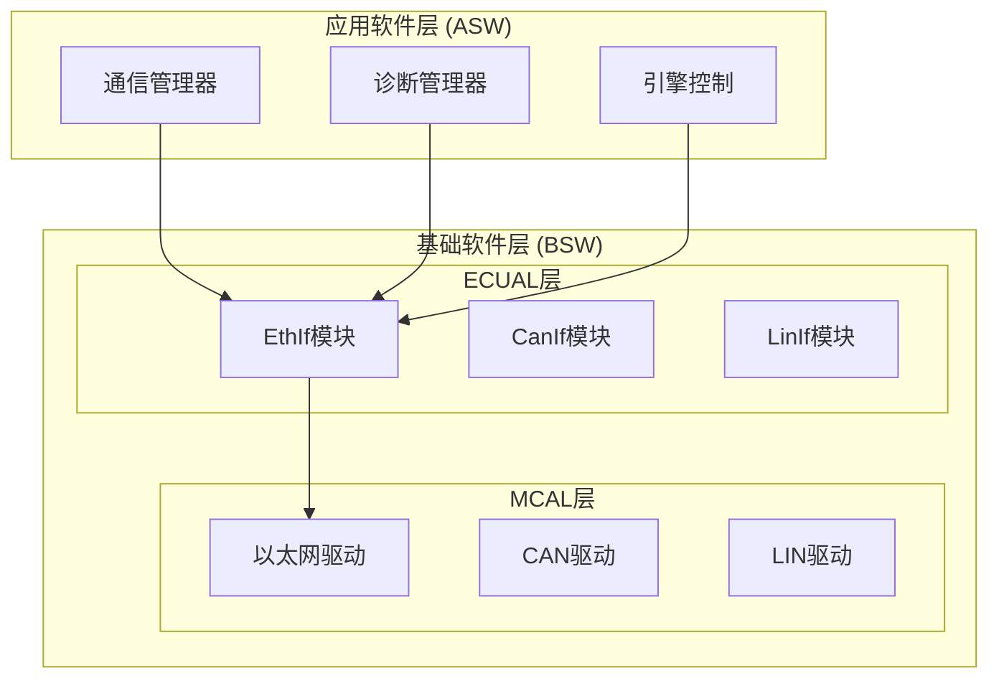
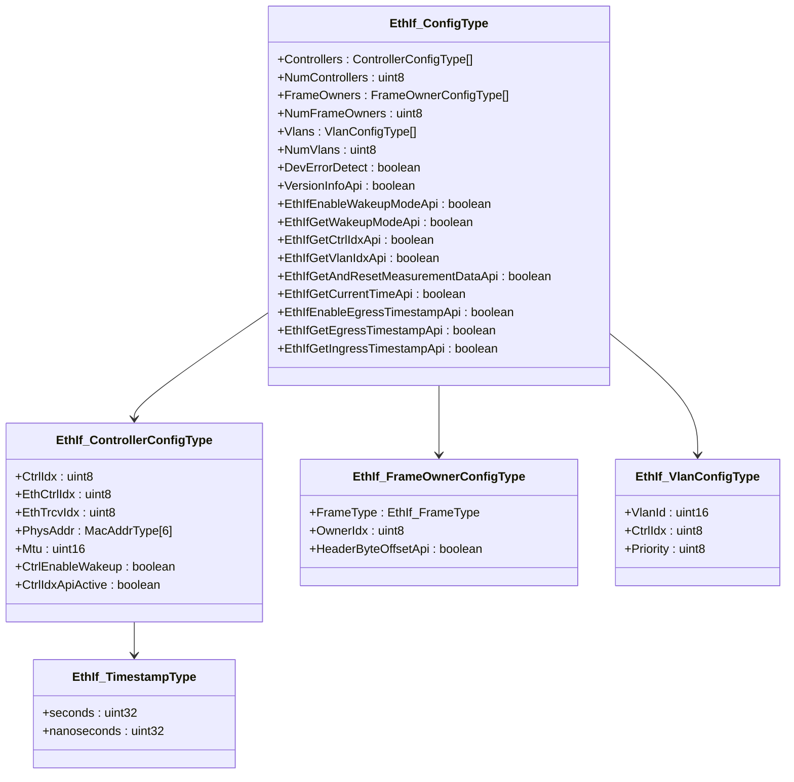
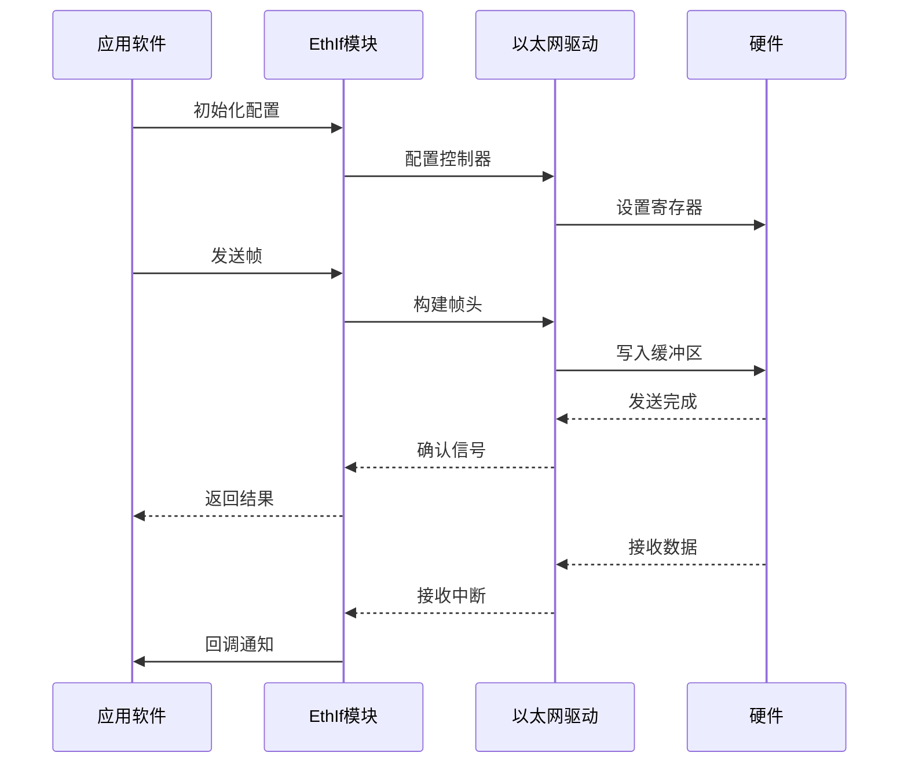
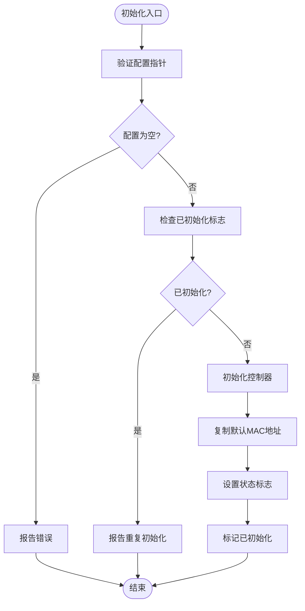
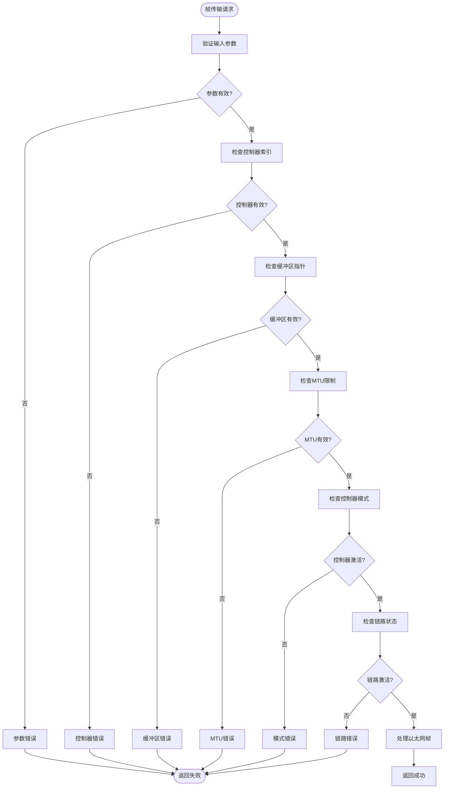
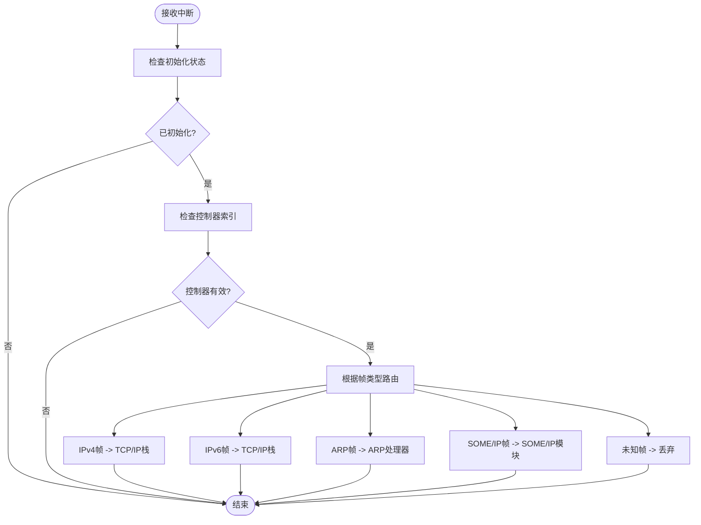
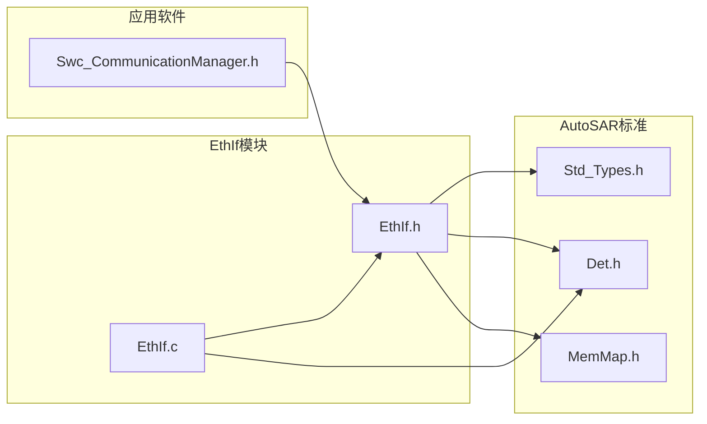

# EthIf 以太网接口API

<cite>
**本文档引用的文件**
- [EthIf.h](file://src/bsw/ecual/ethif/include/EthIf.h)
- [EthIf_Cfg.h](file://src/bsw/ecual/ethif/include/EthIf_Cfg.h)
- [EthIf.c](file://src/bsw/ecual/ethif/src/EthIf.c)
- [Std_Types.h](file://src/bsw/os/include/Std_Types.h)
- [Det.h](file://src/bsw/services/det/include/Det.h)
- [Det.c](file://src/bsw/services/det/src/Det.c)
- [MemMap.h](file://src/bsw/general/inc/MemMap.h)
- [Swc_CommunicationManager.h](file://src/asw/communication_manager/include/Swc_CommunicationManager.h)
</cite>

## 目录
1. [简介](#简介)
2. [项目结构](#项目结构)
3. [核心组件](#核心组件)
4. [架构概览](#架构概览)
5. [详细组件分析](#详细组件分析)
6. [依赖关系分析](#依赖关系分析)
7. [性能考虑](#性能考虑)
8. [故障排除指南](#故障排除指南)
9. [结论](#结论)

## 简介

EthIf（以太网接口）模块是基于AutoSAR经典平台4.x标准的ECU抽象层（ECUAL）组件，负责提供标准化的以太网硬件抽象接口。该模块实现了以太网控制器的初始化、配置、状态管理和数据传输功能，为上层应用软件组件（ASW）提供统一的以太网通信接口。

本模块支持多种以太网帧类型、VLAN配置、时间戳功能和唤醒模式管理，适用于现代汽车网络系统中的各种以太网应用场景。

## 项目结构

EthIf模块位于BSW（基础软件）层的ECUAL子目录中，采用标准的AutoSAR分层架构设计：

**图表来源**
- [EthIf.h:1-367](file://src/bsw/ecual/ethif/include/EthIf.h#L1-L367)
- [Swc_CommunicationManager.h:1-222](file://src/asw/communication_manager/include/Swc_CommunicationManager.h#L1-L222)

**章节来源**
- [EthIf.h:1-367](file://src/bsw/ecual/ethif/include/EthIf.h#L1-L367)
- [EthIf_Cfg.h:1-92](file://src/bsw/ecual/ethif/include/EthIf_Cfg.h#L1-L92)

## 核心组件

### 数据类型定义

EthIf模块定义了完整的以太网通信所需的数据类型体系：

**图表来源**
- [EthIf.h:166-215](file://src/bsw/ecual/ethif/include/EthIf.h#L166-L215)

### 枚举类型

模块提供了完整的枚举类型定义，涵盖以太网通信的所有关键状态和配置：

| 枚举类型 | 可能的值 | 描述 |
|---------|---------|------|
| EthIf_ControllerModeType | ETHIF_MODE_DOWN, ETHIF_MODE_ACTIVE | 控制器工作模式 |
| EthIf_SpeedType | ETHIF_SPEED_10MBPS, ETHIF_SPEED_100MBPS, ETHIF_SPEED_1GBPS, ETHIF_SPEED_2_5GBPS, ETHIF_SPEED_10GBPS | 以太网速度配置 |
| EthIf_DuplexType | ETHIF_DUPLEX_HALF, ETHIF_DUPLEX_FULL | 全双工/半双工模式 |
| EthIf_LinkStateType | ETHIF_LINK_STATE_DOWN, ETHIF_LINK_STATE_ACTIVE | 链路状态 |
| EthIf_TimestampQualityType | ETHIF_TIMESTAMP_VALID, ETHIF_TIMESTAMP_INVALID, ETHIF_TIMESTAMP_NOT_SUPPORTED | 时间戳质量状态 |

**章节来源**
- [EthIf.h:105-152](file://src/bsw/ecual/ethif/include/EthIf.h#L105-L152)

## 架构概览

EthIf模块采用分层架构设计，实现了从应用软件到硬件驱动的完整抽象：

**图表来源**
- [EthIf.c:29-59](file://src/bsw/ecual/ethif/src/EthIf.c#L29-L59)
- [EthIf.c:184-226](file://src/bsw/ecual/ethif/src/EthIf.c#L184-L226)

## 详细组件分析

### 初始化流程

EthIf模块的初始化过程包含多个关键步骤：

**图表来源**
- [EthIf.c:29-59](file://src/bsw/ecual/ethif/src/EthIf.c#L29-L59)

### 帧传输处理

EthIf模块的帧传输流程包含完整的错误检查和状态验证：

**图表来源**
- [EthIf.c:184-226](file://src/bsw/ecual/ethif/src/EthIf.c#L184-L226)

### 接收处理回调

EthIf模块的接收处理机制支持多种以太网帧类型的智能路由：

**图表来源**
- [EthIf.c:381-420](file://src/bsw/ecual/ethif/src/EthIf.c#L381-L420)

**章节来源**
- [EthIf.c:29-440](file://src/bsw/ecual/ethif/src/EthIf.c#L29-L440)

## 依赖关系分析

### 外部依赖

EthIf模块依赖于多个AutoSAR标准组件：

**图表来源**
- [EthIf.h:19-22](file://src/bsw/ecual/ethif/include/EthIf.h#L19-L22)
- [EthIf.c:9-12](file://src/bsw/ecual/ethif/src/EthIf.c#L9-L12)

### 错误检测机制

EthIf模块集成了完整的错误检测和报告机制：

| 错误代码 | 错误类型 | 触发条件 |
|---------|---------|---------|
| ETHIF_E_INV_CTRL_IDX | 无效控制器索引 | 访问不存在的控制器 |
| ETHIF_E_INV_PARAM_POINTER | 无效指针参数 | 空指针或非法指针 |
| ETHIF_E_UNINIT | 未初始化 | 在未初始化状态下调用API |
| ETHIF_E_ALREADY_INITIALIZED | 重复初始化 | 已初始化状态下再次初始化 |
| ETHIF_E_INV_MTU | MTU限制错误 | 超过最大传输单元 |
| ETHIF_E_INV_MODE | 无效模式 | 设置不支持的控制器模式 |

**章节来源**
- [EthIf.h:65-91](file://src/bsw/ecual/ethif/include/EthIf.h#L65-L91)
- [EthIf.c:31-40](file://src/bsw/ecual/ethif/src/EthIf.c#L31-L40)

## 性能考虑

### 内存管理

EthIf模块采用了AutoSAR标准的内存映射机制，确保在不同编译器环境下的一致性：

- **代码段**: 使用`ETHIF_START_SEC_CODE`和`ETHIF_STOP_SEC_CODE`宏
- **配置数据**: 使用`ETHIF_START_SEC_CONFIG_DATA_UNSPECIFIED`宏
- **变量段**: 使用`ETHIF_START_SEC_VAR_CLEARED_UNSPECIFIED`宏

### 实时性能

模块设计考虑了实时性能要求：
- **主函数周期**: 默认5ms周期，可通过`ETHIF_MAIN_FUNCTION_PERIOD_MS`配置
- **非阻塞操作**: 所有API调用均为非阻塞实现
- **状态缓存**: 关键状态信息缓存在静态变量中

### 配置优化

推荐的配置优化策略：
1. **按需启用功能**: 仅启用实际需要的API功能
2. **合理设置MTU**: 根据应用需求选择合适的MTU大小
3. **时间同步**: 启用gPTP支持以获得精确的时间同步

## 故障排除指南

### 常见问题诊断

| 问题症状 | 可能原因 | 解决方案 |
|---------|---------|---------|
| 初始化失败 | 配置指针为空 | 检查配置结构体初始化 |
| 传输失败 | 控制器未激活 | 调用`EthIf_SetControllerMode`激活控制器 |
| 接收无响应 | 链路状态异常 | 检查物理连接和PHY状态 |
| 时间戳错误 | 功能未启用 | 确认`ETHIF_GET_CURRENT_TIME_API`配置 |

### 调试建议

1. **启用开发错误检测**: 设置`ETHIF_DEV_ERROR_DETECT = STD_ON`
2. **检查返回值**: 所有API调用都应检查返回的`Std_ReturnType`
3. **验证配置**: 确保配置数组大小与实际硬件匹配
4. **监控状态**: 定期检查控制器模式和链路状态

**章节来源**
- [EthIf.c:31-40](file://src/bsw/ecual/ethif/src/EthIf.c#L31-L40)
- [Det.c:47-57](file://src/bsw/services/det/src/Det.c#L47-L57)

## 结论

EthIf以太网接口模块提供了完整的AutoSAR兼容的以太网通信解决方案。通过标准化的API接口、完善的错误检测机制和灵活的配置选项，该模块能够满足现代汽车网络系统的各种需求。

模块的主要优势包括：
- **标准化接口**: 完全符合AutoSAR经典平台4.x标准
- **可扩展性**: 支持多控制器、多VLAN和多帧类型配置
- **可靠性**: 集成完整的错误检测和报告机制
- **性能**: 优化的内存管理和实时处理能力

对于开发者而言，EthIf模块提供了清晰的接口定义和详细的错误码说明，便于集成到更大的汽车电子系统中。