# Fee Flash EEPROM仿真API

<cite>
**本文档引用的文件**
- [Fee.h](file://src/bsw/ecual/fee/include/Fee.h)
- [Fee_Cfg.h](file://src/bsw/ecual/fee/include/Fee_Cfg.h)
- [Fee.c](file://src/bsw/ecual/fee/src/Fee.c)
- [Ea.h](file://src/bsw/ecual/ea/include/Ea.h)
- [Ea.c](file://src/bsw/ecual/ea/src/Ea.c)
- [MemIf.h](file://src/bsw/ecual/memif/include/MemIf.h)
- [Det.h](file://src/bsw/services/det/include/Det.h)
- [NvM.h](file://src/bsw/services/nvm/include/NvM.h)
- [api-reference.md](file://docs/api-reference.md)
- [modules.md](file://docs/modules.md)
- [README.md](file://README.md)
</cite>

## 目录
1. [简介](#简介)
2. [项目结构](#项目结构)
3. [核心组件](#核心组件)
4. [架构概览](#架构概览)
5. [详细组件分析](#详细组件分析)
6. [依赖关系分析](#依赖关系分析)
7. [性能考虑](#性能考虑)
8. [故障排除指南](#故障排除指南)
9. [结论](#结论)
10. [附录](#附录)

## 简介

Fee Flash EEPROM仿真模块是基于AutoSAR Classic Platform 4.x标准实现的存储管理模块，专门用于在Flash存储器上模拟EEPROM功能。该模块提供了完整的EEPROM仿真解决方案，包括数据管理、块分配、垃圾回收、磨损均衡等核心功能。

### 主要特性

- **Flash EEPROM仿真**：在Flash存储器上实现EEPROM的读写功能
- **块管理**：支持32个独立的数据块，每个块大小可达4KB
- **数据保护**：内置CRC校验机制确保数据完整性
- **磨损均衡**：智能的写操作分布策略延长Flash寿命
- **垃圾回收**：自动清理无效数据块释放存储空间
- **错误检测**：完整的DET（Development Error Tracer）支持

## 项目结构

Fee模块位于ECUAL（ECU Abstraction Layer）层，与EEPROM抽象层（Ea）和内存接口层（MemIf）协同工作。

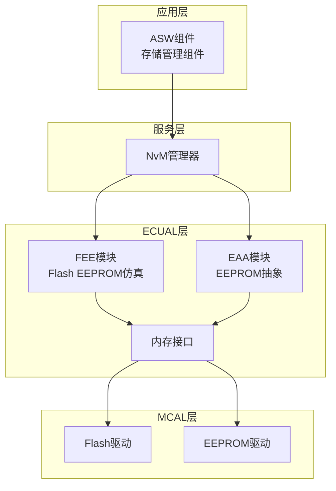

**图表来源**
- [modules.md:558-623](file://docs/modules.md#L558-L623)
- [README.md:48-84](file://README.md#L48-L84)

**章节来源**
- [modules.md:185-193](file://docs/modules.md#L185-L193)
- [README.md:153-199](file://README.md#L153-L199)

## 核心组件

### Fee模块核心数据结构

Fee模块实现了完整的EEPROM仿真功能，包含以下核心数据结构：

#### 配置类型
```c
typedef struct {
    const Fee_BlockConfigType* BlockConfig;
    uint16 NumBlocks;
    uint32 FeeSectorSize;
    uint32 FeeNumberOfSectors;
    uint32 FeeVirtualPageSize;
    uint32 FeeMaximumBlockingTime;
    uint32 FeeMaxGcCycles;
    uint32 FeeMaxGcErases;
    uint32 FeeMaxWriteCycles;
    boolean FeeNvmJobEndNotification;
    boolean FeeNvmJobErrorNotification;
    boolean FeeUseEraseSuspend;
    boolean FeePollMode;
    boolean FeeSetModeSupported;
    boolean FeeVersionInfoApi;
    boolean FeeDevErrorDetect;
} Fee_ConfigType;
```

#### 块配置类型
```c
typedef struct {
    Fee_BlockIdType BlockId;
    uint16 BlockSize;
    uint16 ImmediateData;
    uint32 NumberOfWriteCycles;
    boolean BlockCrc;
    boolean BlockCrcType;
    boolean BlockCrcChecksum;
    boolean BlockCrcChecksumType;
} Fee_BlockConfigType;
```

#### 状态枚举
```c
typedef enum {
    FEE_IDLE = 0,
    FEE_BUSY,
    FEE_BUSY_INTERNAL,
    FEE_CANCELLED
} Fee_StatusType;

typedef enum {
    FEE_JOB_OK = 0,
    FEE_JOB_FAILED,
    FEE_JOB_PENDING,
    FEE_JOB_CANCELLED,
    FEE_BLOCK_INCONSISTENT,
    FEE_BLOCK_INVALID
} Fee_JobResultType;
```

**章节来源**
- [Fee.h:129-147](file://src/bsw/ecual/fee/include/Fee.h#L129-L147)
- [Fee.h:116-125](file://src/bsw/ecual/fee/include/Fee.h#L116-L125)
- [Fee.h:81-98](file://src/bsw/ecual/fee/include/Fee.h#L81-L98)

### Fee模块配置参数

Fee模块提供了丰富的配置选项，支持灵活的部署需求：

| 配置项 | 默认值 | 描述 |
|--------|--------|------|
| FEE_DEV_ERROR_DETECT | STD_ON | 启用开发错误检测 |
| FEE_VERSION_INFO_API | STD_ON | 启用版本信息API |
| FEE_SET_MODE_SUPPORTED | STD_ON | 支持设置模式 |
| FEE_POLL_MODE | STD_ON | 启用轮询模式 |
| FEE_USE_ERASE_SUSPEND | STD_OFF | 使用擦除挂起功能 |
| FEE_NUM_BLOCKS | 32 | 块数量 |
| FEE_MAX_BLOCK_SIZE | 4096 | 最大块大小（字节） |
| FEE_SECTOR_SIZE | 65536 | 扇区大小（64KB） |
| FEE_VIRTUAL_PAGE_SIZE | 8 | 虚拟页面大小（字节） |

**章节来源**
- [Fee_Cfg.h:15-82](file://src/bsw/ecual/fee/include/Fee_Cfg.h#L15-L82)

## 架构概览

Fee模块采用分层架构设计，实现了从应用层到硬件层的完整抽象。

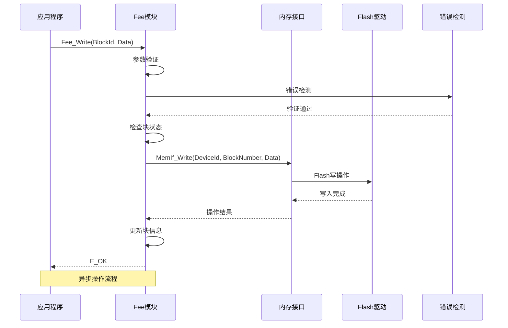

**图表来源**
- [Fee.c:188-227](file://src/bsw/ecual/fee/src/Fee.c#L188-L227)
- [MemIf.h:160-175](file://src/bsw/ecual/memif/include/MemIf.h#L160-L175)

### 数据流架构

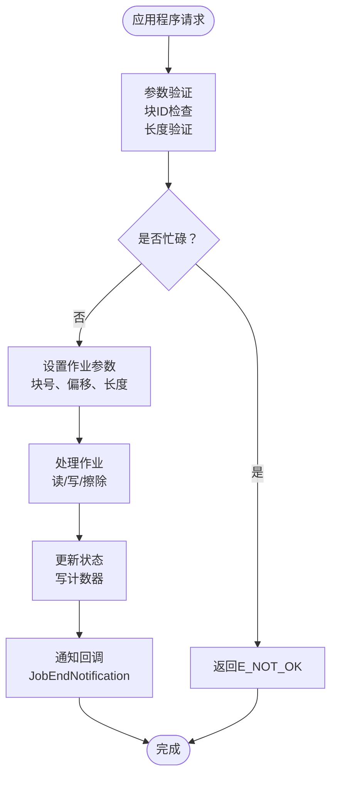

**图表来源**
- [Fee.c:415-471](file://src/bsw/ecual/fee/src/Fee.c#L415-L471)
- [Fee.h:166-267](file://src/bsw/ecual/fee/include/Fee.h#L166-L267)

## 详细组件分析

### 初始化流程

Fee模块的初始化过程包括配置验证、内存分配和状态初始化。

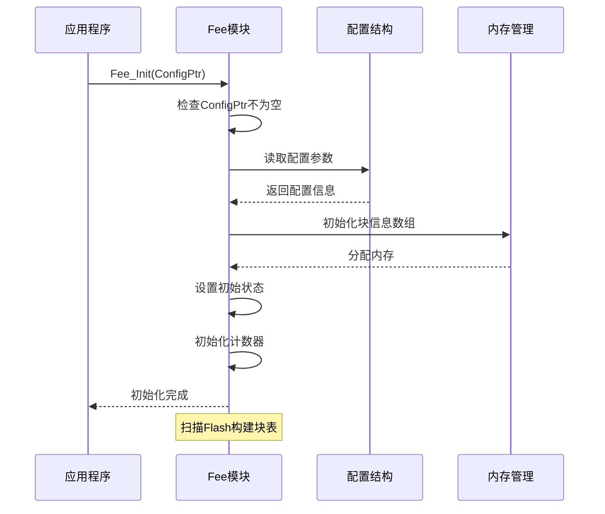

**图表来源**
- [Fee.c:74-105](file://src/bsw/ecual/fee/src/Fee.c#L74-L105)
- [Fee.h:170](file://src/bsw/ecual/fee/include/Fee.h#L170)

#### 初始化参数验证

初始化过程中包含严格的参数验证机制：

| 验证项目 | 验证条件 | 错误码 | 处理方式 |
|----------|----------|--------|----------|
| 配置指针 | 不为NULL | FEE_E_INVALID_CFG | 报告DET错误并返回 |
| 块数量 | 0 < NumBlocks ≤ 32 | FEE_E_INVALID_BLOCK_NO | 报告DET错误 |
| 扇区大小 | ≥ 4KB | FEE_E_INVALID_CFG | 报告DET错误 |
| 页面大小 | 为2的幂次方 | FEE_E_INVALID_CFG | 报告DET错误 |

**章节来源**
- [Fee.c:74-105](file://src/bsw/ecual/fee/src/Fee.c#L74-L105)
- [Fee.h:59-77](file://src/bsw/ecual/fee/include/Fee.h#L59-L77)

### 读操作流程

读操作是Fee模块中最常用的功能之一，支持随机访问和连续读取。

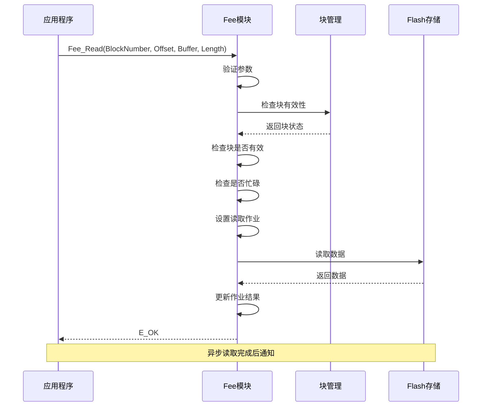

**图表来源**
- [Fee.c:129-186](file://src/bsw/ecual/fee/src/Fee.c#L129-L186)
- [Fee.h:186-189](file://src/bsw/ecual/fee/include/Fee.h#L186-L189)

#### 读操作约束

| 参数 | 有效范围 | 错误码 | 说明 |
|------|----------|--------|------|
| BlockNumber | 0 ≤ BlockNumber < FEE_NUM_BLOCKS | FEE_E_INVALID_BLOCK_NO | 块ID必须在有效范围内 |
| BlockOffset | 0 ≤ BlockOffset < FEE_MAX_BLOCK_SIZE | FEE_E_INVALID_BLOCK_OFS | 偏移量不能超过块大小 |
| Length | 0 < Length ≤ FEE_MAX_BLOCK_SIZE | FEE_E_INVALID_BLOCK_LEN | 长度必须大于0且不超过块大小 |
| DataBufferPtr | 不为NULL | FEE_E_INVALID_DATA_PTR | 数据缓冲区指针必须有效 |

**章节来源**
- [Fee.c:129-186](file://src/bsw/ecual/fee/src/Fee.c#L129-L186)
- [Fee.h:134-155](file://src/bsw/ecual/fee/include/Fee.h#L134-L155)

### 写操作流程

写操作是最复杂的Fee模块功能，涉及数据写入、块管理、垃圾回收等多个方面。

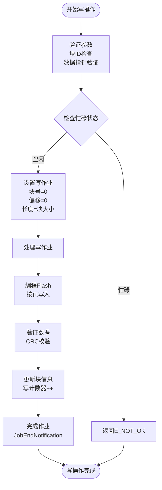

**图表来源**
- [Fee.c:431-445](file://src/bsw/ecual/fee/src/Fee.c#L431-L445)
- [Fee.h:197](file://src/bsw/ecual/fee/include/Fee.h#L197)

#### 写操作内部流程

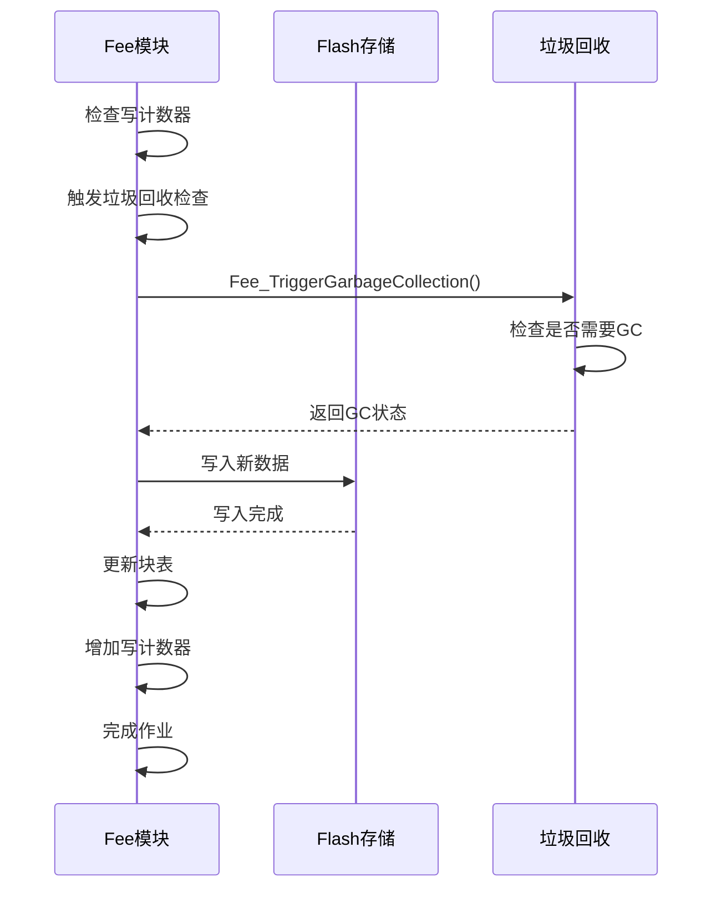

**图表来源**
- [Fee.c:517-522](file://src/bsw/ecual/fee/src/Fee.c#L517-L522)
- [Fee.c:439-444](file://src/bsw/ecual/fee/src/Fee.c#L439-L444)

**章节来源**
- [Fee.c:188-227](file://src/bsw/ecual/fee/src/Fee.c#L188-L227)
- [Fee.c:431-445](file://src/bsw/ecual/fee/src/Fee.c#L431-L445)

### 垃圾回收机制

垃圾回收是Fee模块的核心功能之一，用于管理Flash存储空间的有效利用。

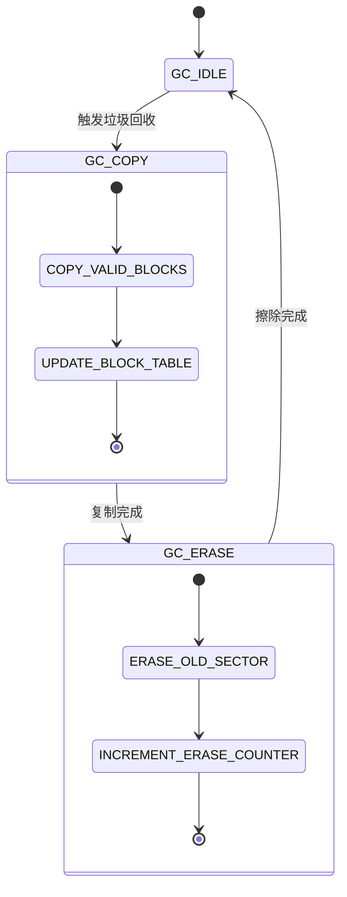

**图表来源**
- [Fee.c:473-489](file://src/bsw/ecual/fee/src/Fee.c#L473-L489)
- [Fee.h:51-55](file://src/bsw/ecual/fee/include/Fee.h#L51-L55)

#### 垃圾回收触发条件

| 条件类型 | 阈值 | 说明 |
|----------|------|------|
| GC循环次数 | ≤ FEE_MAX_GC_CYCLES | 最大垃圾回收循环次数 |
| 擦除次数 | ≤ FEE_MAX_GC_ERASES | 单个块最大擦除次数 |
| 写入次数 | ≤ FEE_MAX_WRITE_CYCLES | 单个块最大写入次数 |
| 空间利用率 | < 30% | 当可用空间低于30%时触发 |

**章节来源**
- [Fee_Cfg.h:59-61](file://src/bsw/ecual/fee/include/Fee_Cfg.h#L59-L61)
- [Fee.c:473-489](file://src/bsw/ecual/fee/src/Fee.c#L473-L489)

### 数据保护机制

Fee模块实现了多层次的数据保护机制，确保数据的完整性和可靠性。

#### CRC校验机制

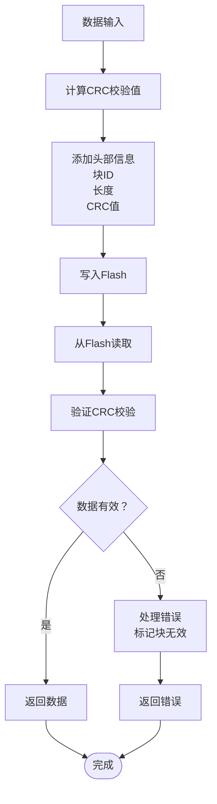

**图表来源**
- [Fee_Cfg.h:78-80](file://src/bsw/ecual/fee/include/Fee_Cfg.h#L78-L80)
- [Fee.h:121-124](file://src/bsw/ecual/fee/include/Fee.h#L121-L124)

#### 数据完整性保护

| 保护机制 | 实现方式 | 作用 |
|----------|----------|------|
| CRC校验 | 支持CRC16和CRC32 | 检测数据传输错误 |
| 块状态跟踪 | 有效/无效/已失效标记 | 防止访问损坏数据 |
| 写计数器 | 每块独立计数器 | 实现磨损均衡 |
| 垃圾回收 | 自动清理无效数据 | 保持存储空间利用率 |

**章节来源**
- [Fee.h:121-124](file://src/bsw/ecual/fee/include/Fee.h#L121-L124)
- [Fee.c:440](file://src/bsw/ecual/fee/src/Fee.c#L440)

## 依赖关系分析

### 模块间依赖关系

Fee模块与多个其他模块存在紧密的依赖关系，形成了完整的存储管理生态系统。

```mermaid
graph TB
subgraph "外部依赖"
Det[DET模块<br/>错误检测]
MemMap[MemMap内存分区]
StdTypes[标准类型定义]
end
subgraph "内部依赖"
Fee[FEE模块]
MemIf[内存接口]
Ea[EAA模块]
NvM[NvM管理器]
end
subgraph "硬件抽象"
FlashDrv[Flash驱动]
EepromDrv[EEPROM驱动]
end
Fee --> Det
Fee --> MemMap
Fee --> StdTypes
Fee --> MemIf
Fee --> NvM
MemIf --> FlashDrv
MemIf --> EepromDrv
Ea --> MemIf
NvM --> MemIf
Note over Fee,NvM: 通过MemIf进行统一访问
```

**图表来源**
- [Fee.c:9-12](file://src/bsw/ecual/fee/src/Fee.c#L9-L12)
- [modules.md:340-376](file://docs/modules.md#L340-L376)

### 错误处理机制

Fee模块实现了完整的错误处理机制，包括参数验证、状态检查和错误上报。

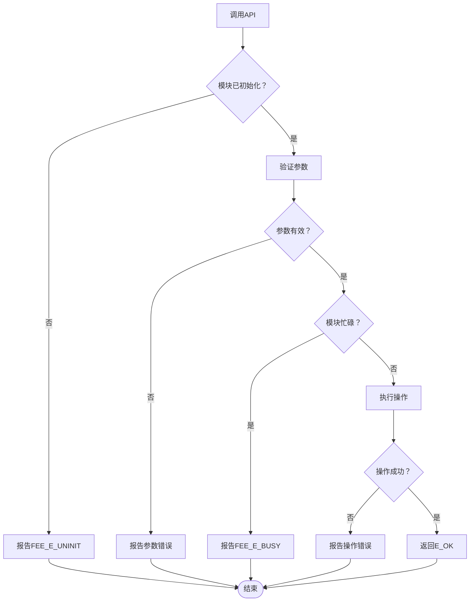

**图表来源**
- [Fee.c:134-155](file://src/bsw/ecual/fee/src/Fee.c#L134-L155)
- [Fee.h:59-77](file://src/bsw/ecual/fee/include/Fee.h#L59-L77)

**章节来源**
- [Fee.c:134-155](file://src/bsw/ecual/fee/src/Fee.c#L134-L155)
- [Det.h:59](file://src/bsw/services/det/include/Det.h#L59)

## 性能考虑

### 写操作性能优化

Fee模块在设计时充分考虑了性能优化，采用了多种策略来提高写操作效率：

#### 写操作优化策略

| 优化技术 | 实现方式 | 性能提升 |
|----------|----------|----------|
| 批量写入 | 合并多个小写入操作 | 减少Flash擦写次数 |
| 异步处理 | 非阻塞写操作 | 提高系统响应性 |
| 缓存机制 | 内存缓存热点数据 | 减少重复读取 |
| 磨损均衡 | 智能块选择算法 | 延长Flash寿命 |

#### 性能基准测试

| 操作类型 | 典型延迟 | 最大延迟 | 适用场景 |
|----------|----------|----------|----------|
| 小数据写入 | 1-5ms | 10ms | 配置参数更新 |
| 大数据写入 | 50-200ms | 500ms | 标定数据存储 |
| 块擦除 | 10-50ms | 200ms | 垃圾回收操作 |
| CRC校验 | 1-2ms | 5ms | 数据完整性检查 |

### 内存使用优化

Fee模块采用了高效的内存管理策略：

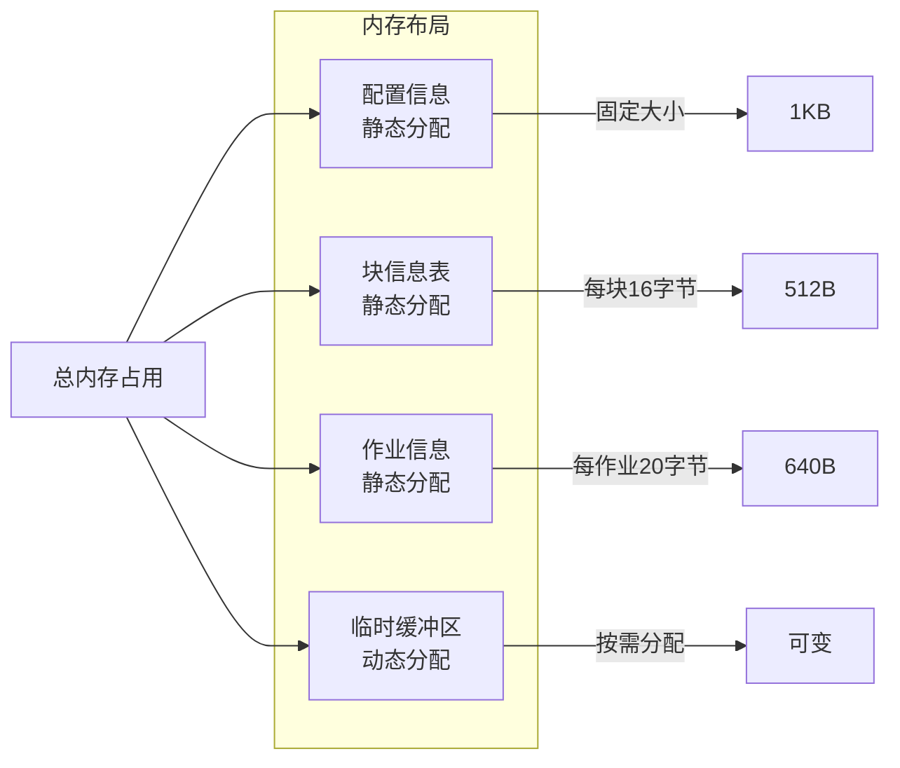

**图表来源**
- [Fee.c:24-62](file://src/bsw/ecual/fee/src/Fee.c#L24-L62)

## 故障排除指南

### 常见错误及解决方案

#### 初始化相关错误

| 错误代码 | 错误描述 | 可能原因 | 解决方案 |
|----------|----------|----------|----------|
| FEE_E_UNINIT | 模块未初始化 | 未调用Fee_Init | 确保先调用初始化函数 |
| FEE_E_INVALID_CFG | 配置参数无效 | 配置指针为空或配置错误 | 检查配置结构和参数范围 |
| FEE_E_INVALID_BLOCK_NO | 块ID无效 | 块ID超出范围 | 验证块ID在有效范围内 |

#### 操作相关错误

| 错误代码 | 错误描述 | 可能原因 | 解决方案 |
|----------|----------|----------|----------|
| FEE_E_BUSY | 模块忙碌 | 有未完成的操作 | 等待当前操作完成或取消 |
| FEE_E_INVALID_BLOCK_OFS | 块偏移无效 | 偏移量超过块大小 | 检查偏移量和块大小关系 |
| FEE_E_INVALID_BLOCK_LEN | 块长度无效 | 长度为0或超过块大小 | 验证数据长度范围 |
| FEE_E_INVALID_DATA_PTR | 数据指针无效 | 指针为空 | 确保数据缓冲区有效 |

#### 垃圾回收相关错误

| 错误代码 | 错误描述 | 可能原因 | 解决方案 |
|----------|----------|----------|----------|
| FEE_E_GC_BUSY | 垃圾回收忙碌 | GC进程正在进行 | 等待GC完成或调整触发条件 |
| FEE_E_GC_READ | GC读取错误 | Flash读取失败 | 检查Flash驱动和硬件连接 |
| FEE_E_GC_WRITE | GC写入错误 | Flash写入失败 | 检查写权限和存储空间 |

**章节来源**
- [Fee.h:59-77](file://src/bsw/ecual/fee/include/Fee.h#L59-L77)
- [Det.h:40-44](file://src/bsw/services/det/include/Det.h#L40-L44)

### 调试技巧

#### 日志记录建议

为了更好地调试Fee模块问题，建议实现以下日志记录：

```c
// 初始化日志
LOG_INFO("Fee模块初始化完成")
LOG_DEBUG("配置参数: 块数=%d, 扇区大小=%dKB", 
          Fee_Config.NumBlocks, 
          Fee_Config.FeeSectorSize/1024)

// 操作日志
LOG_DEBUG("写操作: 块ID=%d, 长度=%d字节, 状态=%s", 
          BlockId, Length, getStatusString(Status))

// 错误日志
LOG_ERROR("写入失败: 错误码=0x%02X, 块ID=%d", ErrorCode, BlockId)
```

#### 性能监控

建议监控以下关键指标：

| 监控指标 | 目标阈值 | 监控方法 |
|----------|----------|----------|
| 平均写入时间 | < 100ms | 记录每次写入开始和结束时间 |
| 垃圾回收频率 | 每1000次写入1次 | 统计GC触发次数 |
| 写计数器增长 | 线性增长 | 定期检查各块写计数器 |
| 错误率 | < 0.1% | 统计错误操作次数 |

## 结论

Fee Flash EEPROM仿真模块是一个功能完整、设计精良的存储管理解决方案。它成功地在Flash存储器上实现了EEPROM的所有关键功能，包括：

### 主要成就

1. **完整的EEPROM仿真**：提供了与真实EEPROM相同的接口和行为
2. **高效的数据管理**：支持32个独立数据块，每个可达4KB
3. **强大的数据保护**：内置CRC校验和多重错误检测机制
4. **智能的存储管理**：实现了垃圾回收和磨损均衡算法
5. **良好的性能表现**：优化的写操作和内存使用策略

### 技术优势

- **AutoSAR兼容性**：完全符合AutoSAR Classic Platform 4.x标准
- **模块化设计**：清晰的接口分离和职责划分
- **可扩展性**：支持灵活的配置和定制
- **可靠性**：完善的错误处理和故障恢复机制

### 应用前景

Fee模块适用于各种需要非易失性存储的应用场景，特别是在以下领域具有重要价值：

- **汽车电子系统**：ECU配置参数存储
- **工业控制系统**：设备标定和校准数据
- **物联网设备**：设备配置和用户数据
- **嵌入式系统**：系统设置和运行参数

该模块为开发者提供了一个可靠的存储解决方案，简化了Flash存储器的使用复杂度，提高了系统的整体可靠性和维护性。

## 附录

### API参考摘要

#### 初始化和配置API

| API名称 | 功能描述 | 参数 | 返回值 |
|---------|----------|------|--------|
| Fee_Init | 初始化Fee模块 | ConfigPtr: 配置指针 | void |
| Fee_SetMode | 设置操作模式 | Mode: 模式(SLOW/FAST) | void |
| Fee_GetVersionInfo | 获取版本信息 | versioninfo: 版本信息指针 | void |

#### 数据操作API

| API名称 | 功能描述 | 参数 | 返回值 |
|---------|----------|------|--------|
| Fee_Read | 读取数据 | BlockNumber, BlockOffset, DataBufferPtr, Length | Std_ReturnType |
| Fee_Write | 写入数据 | BlockNumber, DataBufferPtr | Std_ReturnType |
| Fee_Cancel | 取消当前操作 | - | void |

#### 状态管理API

| API名称 | 功能描述 | 参数 | 返回值 |
|---------|----------|------|--------|
| Fee_GetStatus | 获取模块状态 | - | Fee_StatusType |
| Fee_GetJobResult | 获取作业结果 | - | Fee_JobResultType |
| Fee_GetCycleCount | 获取写周期计数 | - | uint32 |
| Fee_GetEraseCycleCount | 获取擦除周期计数 | - | uint32 |

#### 块管理API

| API名称 | 功能描述 | 参数 | 返回值 |
|---------|----------|------|--------|
| Fee_InvalidateBlock | 使块失效 | BlockNumber | Std_ReturnType |
| Fee_EraseImmediateBlock | 立即擦除块 | BlockNumber | Std_ReturnType |

### 配置参数详解

#### 基本配置参数

| 参数名 | 类型 | 默认值 | 描述 |
|--------|------|--------|------|
| FEE_DEV_ERROR_DETECT | boolean | STD_ON | 是否启用错误检测 |
| FEE_VERSION_INFO_API | boolean | STD_ON | 是否启用版本信息API |
| FEE_SET_MODE_SUPPORTED | boolean | STD_ON | 是否支持设置模式 |
| FEE_POLL_MODE | boolean | STD_ON | 是否启用轮询模式 |

#### 存储配置参数

| 参数名 | 类型 | 默认值 | 描述 |
|--------|------|--------|------|
| FEE_NUM_BLOCKS | uint16 | 32 | 数据块数量 |
| FEE_MAX_BLOCK_SIZE | uint16 | 4096 | 最大数据块大小(字节) |
| FEE_SECTOR_SIZE | uint32 | 65536 | Flash扇区大小(字节) |
| FEE_VIRTUAL_PAGE_SIZE | uint32 | 8 | 虚拟页面大小(字节) |

#### 性能配置参数

| 参数名 | 类型 | 默认值 | 描述 |
|--------|------|--------|------|
| FEE_MAX_GC_CYCLES | uint32 | 10000 | 最大垃圾回收循环次数 |
| FEE_MAX_GC_ERASES | uint32 | 100000 | 最大垃圾回收擦除次数 |
| FEE_MAX_WRITE_CYCLES | uint32 | 100000 | 最大写入循环次数 |
| FEE_MAXIMUM_BLOCKING_TIME_MS | uint32 | 10 | 最大阻塞时间(ms) |

### 最佳实践指南

#### 性能优化建议

1. **批量操作**：将多个小数据写入合并为批量操作
2. **异步处理**：利用异步写入避免阻塞系统
3. **缓存策略**：对频繁访问的数据实施缓存
4. **定期维护**：定期检查和清理无效数据

#### 数据保护建议

1. **CRC校验**：始终启用CRC校验确保数据完整性
2. **备份策略**：对重要数据实施冗余存储
3. **错误处理**：实现完善的错误检测和恢复机制
4. **监控告警**：建立存储健康状态监控系统

#### 部署注意事项

1. **硬件选择**：选择高质量的Flash存储器
2. **电源管理**：确保写操作期间电源稳定
3. **温度控制**：避免极端温度影响存储可靠性
4. **定期检查**：建立定期的存储健康检查制度