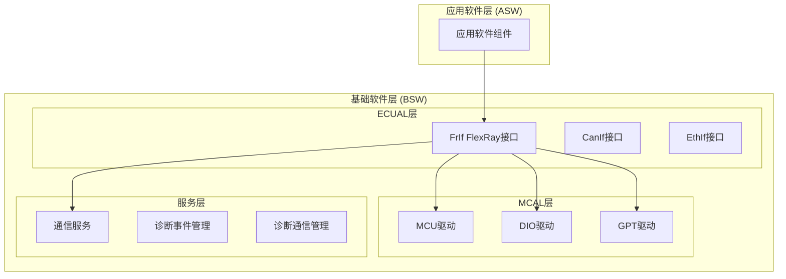
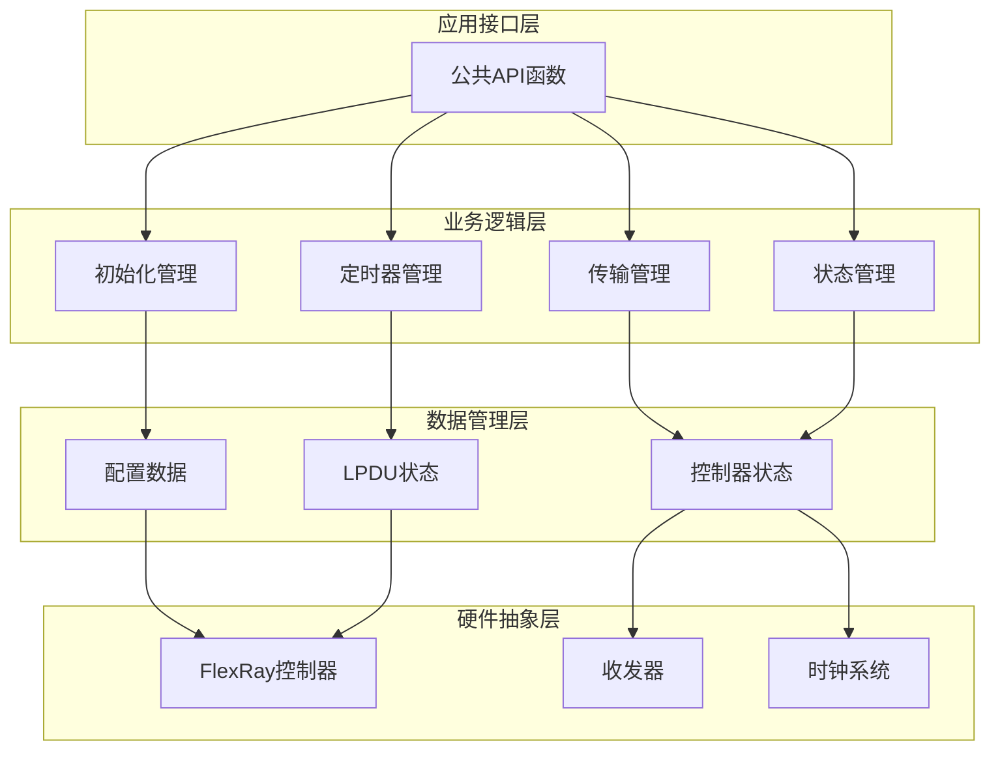
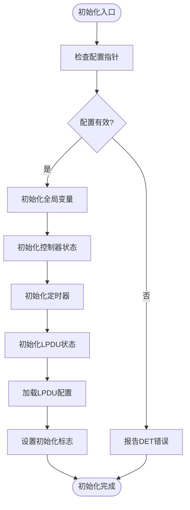
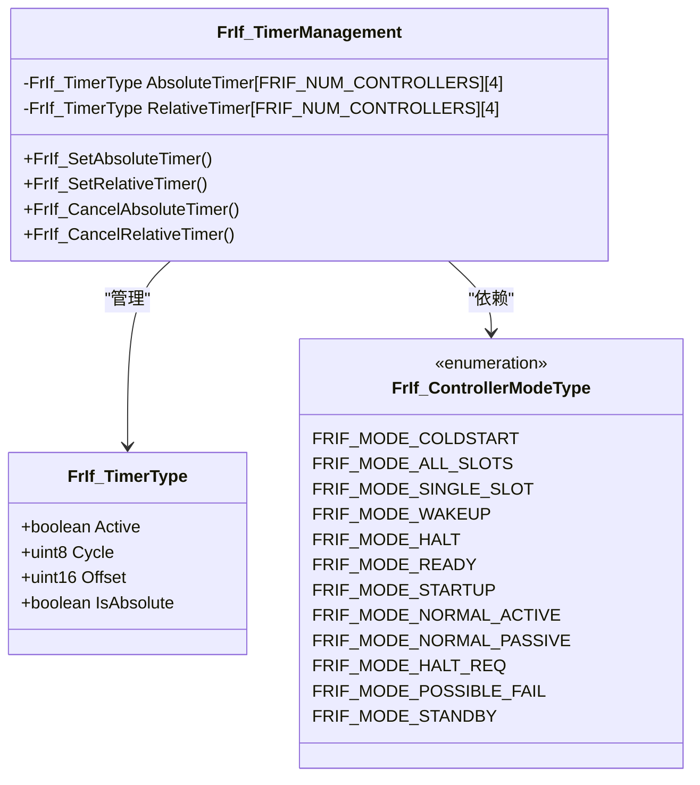
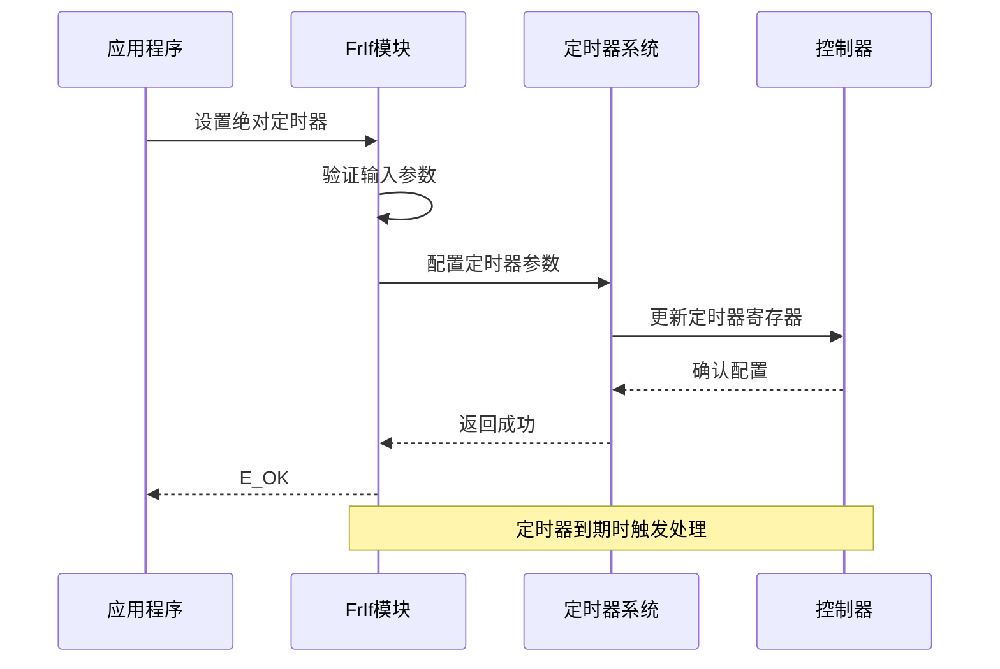
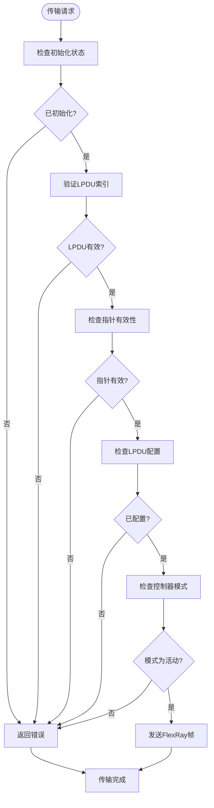
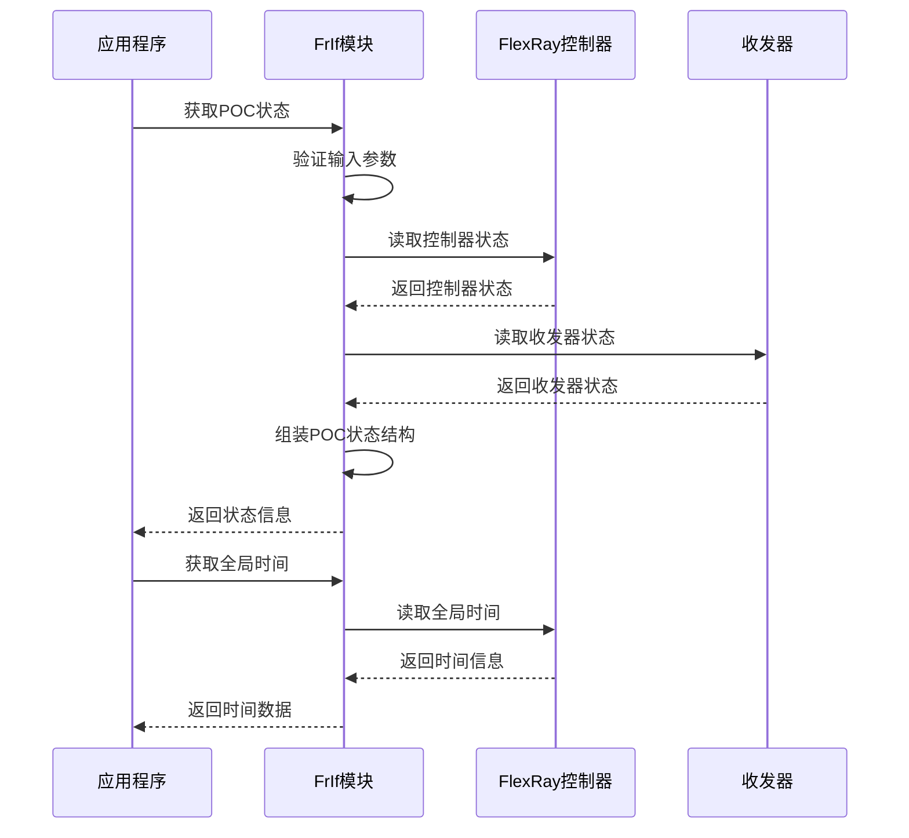
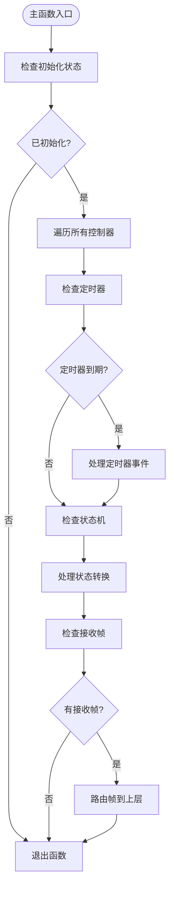
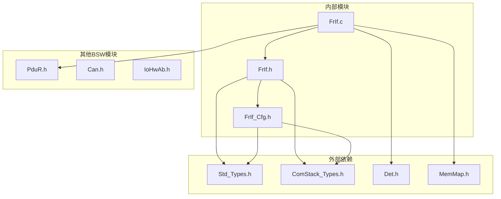

# FrIf FlexRay接口API

<cite>
**本文档引用的文件**
- [FrIf.h](file://src/bsw/ecual/frif/include/FrIf.h)
- [FrIf.c](file://src/bsw/ecual/frif/src/FrIf.c)
- [FrIf_Cfg.h](file://src/bsw/ecual/frif/include/FrIf_Cfg.h)
- [Std_Types.h](file://src/bsw/common/Std_Types.h)
- [ComStack_Types.h](file://src/bsw/common/ComStack_Types.h)
- [Det.h](file://src/bsw/common/Det.h)
- [MemMap.h](file://src/bsw/general/inc/MemMap.h)
</cite>

## 目录
1. [简介](#简介)
2. [项目结构](#项目结构)
3. [核心组件](#核心组件)
4. [架构概览](#架构概览)
5. [详细组件分析](#详细组件分析)
6. [依赖关系分析](#依赖关系分析)
7. [性能考虑](#性能考虑)
8. [故障排除指南](#故障排除指南)
9. [结论](#结论)
10. [附录](#附录)

## 简介

FrIf FlexRay接口模块是遵循AutoSAR经典平台4.x标准的ECU抽象层模块，为FlexRay总线提供了统一的硬件抽象接口。该模块实现了FlexRay帧传输、接收处理、时钟同步、节点管理和网络管理等核心功能。

FrIf模块的主要目标是：
- 提供标准化的FlexRay接口，屏蔽底层硬件差异
- 支持多种FlexRay通信模式（正常活动、正常被动、启动、冷启动等）
- 实现定时器管理和调度机制
- 提供错误检测和状态管理功能
- 支持唤醒和冷启动功能

## 项目结构

FrIf模块位于BSW（基础软件）层的ECUAL（ECU抽象层）中，采用标准的AutoSAR分层架构：

**图表来源**
- [FrIf.h:1-367](file://src/bsw/ecual/frif/include/FrIf.h#L1-L367)
- [FrIf.c:1-506](file://src/bsw/ecual/frif/src/FrIf.c#L1-L506)

**章节来源**
- [FrIf.h:1-367](file://src/bsw/ecual/frif/include/FrIf.h#L1-L367)
- [FrIf.c:1-506](file://src/bsw/ecual/frif/src/FrIf.c#L1-L506)

## 核心组件

FrIf模块包含以下核心组件：

### 1. 配置管理组件
- **FrIf_ConfigType**: 主配置结构体，包含控制器、LPDU配置和功能开关
- **FrIf_ControllerConfigType**: 控制器配置结构体
- **FrIf_LpduConfigType**: LPDU配置结构体

### 2. 状态管理组件
- **FrIf_ControllerModeType**: 控制器模式枚举
- **FrIf_TransceiverModeType**: 收发器模式枚举
- **FrIf_POCStatusType**: POC状态结构体

### 3. 数据结构组件
- **FrIf_TimerType**: 定时器管理结构体
- **FrIf_LpduStateType**: LPDU状态结构体

**章节来源**
- [FrIf.h:175-217](file://src/bsw/ecual/frif/include/FrIf.h#L175-L217)
- [FrIf.c:22-43](file://src/bsw/ecual/frif/src/FrIf.c#L22-L43)

## 架构概览

FrIf模块采用分层架构设计，实现了完整的FlexRay通信栈：

**图表来源**
- [FrIf.c:51-104](file://src/bsw/ecual/frif/src/FrIf.c#L51-L104)
- [FrIf.c:17-43](file://src/bsw/ecual/frif/src/FrIf.c#L17-L43)

## 详细组件分析

### 初始化管理组件

初始化组件负责FrIf模块的初始化过程，包括配置加载、状态变量初始化和资源分配。

#### 初始化流程图

**图表来源**
- [FrIf.c:51-104](file://src/bsw/ecual/frif/src/FrIf.c#L51-L104)

#### 关键特性
- **错误检测**: 支持配置指针验证和重复初始化检测
- **状态管理**: 初始化所有控制器和收发器状态
- **配置加载**: 动态加载LPDU配置信息
- **内存管理**: 使用标准AutoSAR内存映射机制

**章节来源**
- [FrIf.c:51-104](file://src/bsw/ecual/frif/src/FrIf.c#L51-L104)

### 定时器管理系统

定时器管理系统支持绝对定时器和相对定时器两种模式，每控制器最多支持4个定时器。

#### 定时器类图

**图表来源**
- [FrIf.c:22-31](file://src/bsw/ecual/frif/src/FrIf.c#L22-L31)
- [FrIf.h:108-122](file://src/bsw/ecual/frif/include/FrIf.h#L108-L122)

#### 定时器操作序列图

**图表来源**
- [FrIf.c:127-155](file://src/bsw/ecual/frif/src/FrIf.c#L127-L155)

**章节来源**
- [FrIf.c:127-225](file://src/bsw/ecual/frif/src/FrIf.c#L127-L225)
- [FrIf.h:108-122](file://src/bsw/ecual/frif/include/FrIf.h#L108-L122)

### 传输管理组件

传输管理组件负责FlexRay帧的发送和接收处理，实现了基于LPDU的传输机制。

#### 传输处理流程图

**图表来源**
- [FrIf.c:227-266](file://src/bsw/ecual/frif/src/FrIf.c#L227-L266)

#### 关键特性
- **LPDU管理**: 基于LPDU索引的传输机制
- **模式检查**: 确保控制器处于正确的工作模式
- **错误处理**: 完善的参数验证和错误报告
- **扩展性**: 支持动态LPDU配置

**章节来源**
- [FrIf.c:227-266](file://src/bsw/ecual/frif/src/FrIf.c#L227-L266)

### 状态管理组件

状态管理组件提供了FlexRay控制器和收发器的状态查询功能。

#### 状态查询序列图

**图表来源**
- [FrIf.c:268-318](file://src/bsw/ecual/frif/src/FrIf.c#L268-L318)

**章节来源**
- [FrIf.c:268-318](file://src/bsw/ecual/frif/src/FrIf.c#L268-L318)

### 主函数组件

主函数组件实现了FrIf模块的周期性处理逻辑，包括定时器检查、状态机处理和帧接收。

#### 主函数处理流程

**图表来源**
- [FrIf.c:456-502](file://src/bsw/ecual/frif/src/FrIf.c#L456-L502)

**章节来源**
- [FrIf.c:456-502](file://src/bsw/ecual/frif/src/FrIf.c#L456-L502)

## 依赖关系分析

FrIf模块的依赖关系体现了AutoSAR标准的分层架构：

**图表来源**
- [FrIf.h:18-22](file://src/bsw/ecual/frif/include/FrIf.h#L18-L22)
- [FrIf.c:9-12](file://src/bsw/ecual/frif/src/FrIf.c#L9-L12)

### 关键依赖特性

1. **标准类型依赖**: 依赖Std_Types.h和ComStack_Types.h提供标准数据类型
2. **错误检测**: 通过Det.h实现运行时错误检测
3. **内存管理**: 使用MemMap.h进行内存段管理
4. **配置管理**: 通过FrIf_Cfg.h集中管理配置参数

**章节来源**
- [FrIf.h:18-22](file://src/bsw/ecual/frif/include/FrIf.h#L18-L22)
- [FrIf.c:9-12](file://src/bsw/ecual/frif/src/FrIf.c#L9-L12)

## 性能考虑

### 内存优化策略

1. **静态内存分配**: 所有状态变量使用静态分配，减少堆栈压力
2. **配置常量化**: 配置参数使用const修饰符，存储在只读段
3. **内存映射**: 使用标准AutoSAR内存映射机制优化内存布局

### 处理效率优化

1. **快速路径**: 关键路径使用直接访问，避免不必要的函数调用
2. **循环优化**: 使用固定大小的数组避免动态内存分配
3. **状态缓存**: 缓存控制器和收发器状态减少硬件访问

### 实时性保证

1. **确定性执行**: 所有操作具有确定的执行时间
2. **中断安全**: 关键操作使用适当的保护机制
3. **周期性处理**: 通过主函数实现可预测的周期性任务

## 故障排除指南

### 常见错误代码

FrIf模块定义了完整的错误代码体系：

| 错误代码 | 含义 | 可能原因 |
|---------|------|----------|
| FRIF_E_UNINIT | 未初始化 | 在初始化前调用API |
| FRIF_E_INV_CTRL_IDX | 控制器索引无效 | 超出控制器数量范围 |
| FRIF_E_INV_LPDU_IDX | LPDU索引无效 | LPDU索引超出范围 |
| FRIF_E_INV_POINTER | 指针无效 | 传入NULL指针 |
| FRIF_E_INV_TIMER_IDX | 定时器索引无效 | 定时器索引超出4个限制 |

### 调试建议

1. **启用DET**: 在开发阶段启用错误检测以捕获配置错误
2. **状态监控**: 定期检查控制器状态和POC状态
3. **日志记录**: 记录关键API调用和返回值
4. **边界测试**: 测试所有边界条件和异常情况

**章节来源**
- [FrIf.h:73-96](file://src/bsw/ecual/frif/include/FrIf.h#L73-L96)
- [FrIf.c:53-62](file://src/bsw/ecual/frif/src/FrIf.c#L53-L62)

## 结论

FrIf FlexRay接口模块是一个功能完整、结构清晰的AutoSAR兼容模块。它提供了：

1. **完整的FlexRay功能支持**: 包括传输、接收、定时器、状态管理等核心功能
2. **标准的API接口**: 符合AutoSAR规范，易于集成到现有系统中
3. **良好的可扩展性**: 支持配置定制和功能扩展
4. **完善的错误处理**: 提供详细的错误检测和报告机制

该模块为FlexRay总线的应用提供了可靠的硬件抽象层，简化了复杂硬件的使用，并确保了系统的可移植性和可维护性。

## 附录

### API函数参考表

#### 初始化和配置函数
| 函数名 | 参数 | 返回值 | 描述 |
|--------|------|--------|------|
| FrIf_Init | ConfigPtr: 配置指针 | void | 初始化FrIf模块 |
| FrIf_ControllerInit | FrIf_CtrlIdx: 控制器索引 | Std_ReturnType | 初始化指定控制器 |

#### 传输相关函数
| 函数名 | 参数 | 返回值 | 描述 |
|--------|------|--------|------|
| FrIf_Transmit | FrIf_TxPduId: LPDU ID FrIf_PduInfoPtr: PDU信息指针 | Std_ReturnType | 发送FlexRay帧 |
| FrIf_GetPOCStatus | FrIf_CtrlIdx: 控制器索引 FrIf_POCStatusPtr: 状态指针 | Std_ReturnType | 获取POC状态 |

#### 定时器管理函数
| 函数名 | 参数 | 返回值 | 描述 |
|--------|------|--------|------|
| FrIf_SetAbsoluteTimer | FrIf_CtrlIdx: 控制器索引 FrIf_AbsTimerIdx: 定时器索引 FrIf_Cycle: 周期 FrIf_Offset: 偏移量 | Std_ReturnType | 设置绝对定时器 |
| FrIf_SetRelativeTimer | FrIf_CtrlIdx: 控制器索引 FrIf_RelTimerIdx: 定时器索引 FrIf_Offset: 偏移量 | Std_ReturnType | 设置相对定时器 |

#### 状态和查询函数
| 函数名 | 参数 | 返回值 | 描述 |
|--------|------|--------|------|
| FrIf_GetGlobalTime | FrIf_CtrlIdx: 控制器索引 FrIf_CyclePtr: 周期指针 FrIf_MacrotickPtr: 微tick指针 | Std_ReturnType | 获取全局时间 |
| FrIf_GetVersionInfo | versioninfo: 版本信息指针 | void | 获取模块版本信息 |

### 配置选项说明

#### 运行时配置
- **FRIF_DEV_ERROR_DETECT**: 启用/禁用错误检测
- **FRIF_VERSION_INFO_API**: 启用/禁用版本信息API
- **FRIF_WAKEUP_SUPPORT**: 启用/禁用唤醒功能
- **FRIF_COLDSTART_SUPPORT**: 启用/禁用冷启动功能

#### 编译时常量
- **FRIF_NUM_CONTROLLERS**: 控制器数量
- **FRIF_NUM_LPDUS**: LPDU数量
- **FRIF_MAIN_FUNCTION_PERIOD_MS**: 主函数周期（毫秒）

**章节来源**
- [FrIf_Cfg.h:15-91](file://src/bsw/ecual/frif/include/FrIf_Cfg.h#L15-L91)
- [FrIf.h:236-361](file://src/bsw/ecual/frif/include/FrIf.h#L236-L361)