# IoHwAb I/O硬件抽象API

<cite>
**本文档引用的文件**
- [IoHwAb.h](file://src/bsw/ecual/iohwab/include/IoHwAb.h)
- [IoHwAb_Cfg.h](file://src/bsw/ecual/iohwab/include/IoHwAb_Cfg.h)
- [IoHwAb.c](file://src/bsw/ecual/iohwab/src/IoHwAb.c)
- [Dio.h](file://src/bsw/mcal/dio/include/Dio.h)
- [Port.h](file://src/bsw/mcal/port/include/Port.h)
- [Adc.h](file://src/bsw/mcal/adc/include/Adc.h)
- [Pwm.h](file://src/bsw/mcal/pwm/include/Pwm.h)
- [Spi.h](file://src/bsw/mcal/spi/include/Spi.h)
- [api-reference.md](file://docs/api-reference.md)
- [modules.md](file://docs/modules.md)
- [README.md](file://README.md)
</cite>

## 目录
1. [简介](#简介)
2. [项目结构](#项目结构)
3. [核心组件](#核心组件)
4. [架构概览](#架构概览)
5. [详细组件分析](#详细组件分析)
6. [依赖关系分析](#依赖关系分析)
7. [性能考虑](#性能考虑)
8. [故障排除指南](#故障排除指南)
9. [结论](#结论)
10. [附录](#附录)

## 简介

IoHwAb（I/O硬件抽象）是YuleTech AutoSAR BSW平台中的关键模块，遵循AutoSAR Classic Platform 4.x标准，为ECU抽象层（ECUAL）提供统一的I/O硬件访问接口。该模块实现了对数字输入输出、模拟信号处理、PWM控制和SPI通信的标准化抽象，为上层应用提供了与硬件无关的编程接口。

IoHwAb模块的核心价值在于：
- **硬件无关性**：通过统一的抽象接口屏蔽底层硬件差异
- **模块化设计**：支持独立的数字、模拟、PWM和SPI功能模块
- **错误检测**：集成DET（Development Error Tracer）支持
- **实时性能**：优化的缓冲机制和异步处理能力

## 项目结构

IoHwAb模块位于ECUAL层，是AutoSAR BSW平台的第11个模块，与MCAL层的Dio、Adc、Pwm、Spi驱动紧密协作。

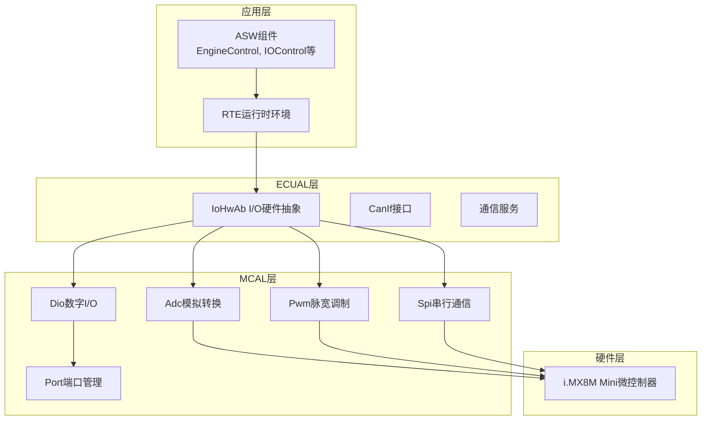

**图表来源**
- [modules.md:340-376](file://docs/modules.md#L340-L376)
- [README.md:153-199](file://README.md#L153-L199)

**章节来源**
- [modules.md:145-154](file://docs/modules.md#L145-L154)
- [README.md:32-94](file://README.md#L32-L94)

## 核心组件

IoHwAb模块包含四个主要功能组件：

### 1. 数字I/O组件
负责数字输入输出信号的读写操作，支持信号反转配置和缓冲管理。

### 2. 模拟I/O组件  
提供模数转换功能，支持多通道ADC配置和信号缩放处理。

### 3. PWM控制组件
实现脉宽调制信号生成，支持频率和占空比的精确控制。

### 4. SPI通信组件
提供同步和异步SPI数据传输功能，支持多设备配置。

**章节来源**
- [IoHwAb.h:86-141](file://src/bsw/ecual/iohwab/include/IoHwAb.h#L86-L141)
- [IoHwAb_Cfg.h:14-25](file://src/bsw/ecual/iohwab/include/IoHwAb_Cfg.h#L14-L25)

## 架构概览

IoHwAb采用分层架构设计，通过配置驱动的方式实现硬件抽象：

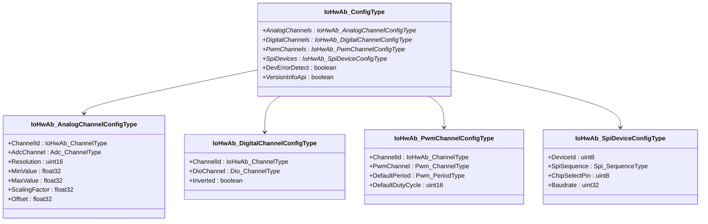

**图表来源**
- [IoHwAb.h:86-141](file://src/bsw/ecual/iohwab/include/IoHwAb.h#L86-L141)

### 硬件映射原理

IoHwAb通过配置结构实现硬件映射：

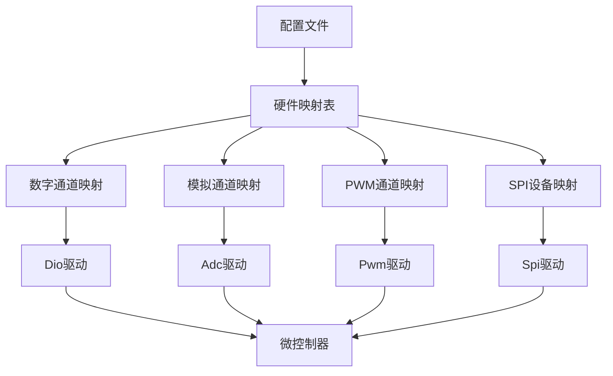

**图表来源**
- [IoHwAb.h:130-141](file://src/bsw/ecual/iohwab/include/IoHwAb.h#L130-L141)
- [IoHwAb_Cfg.h:28-85](file://src/bsw/ecual/iohwab/include/IoHwAb_Cfg.h#L28-L85)

**章节来源**
- [IoHwAb.h:128-141](file://src/bsw/ecual/iohwab/include/IoHwAb.h#L128-L141)
- [IoHwAb_Cfg.h:14-101](file://src/bsw/ecual/iohwab/include/IoHwAb_Cfg.h#L14-L101)

## 详细组件分析

### 数字I/O操作

数字I/O模块提供输入和输出功能，支持信号反转配置：

#### 数字读取流程

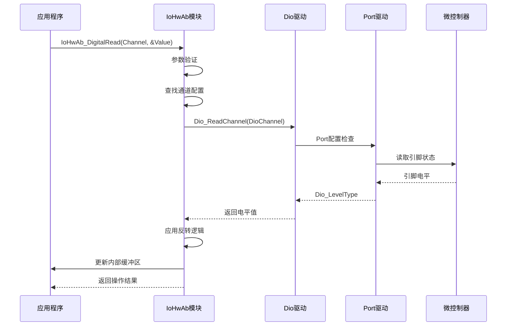

**图表来源**
- [IoHwAb.c:165-198](file://src/bsw/ecual/iohwab/src/IoHwAb.c#L165-L198)
- [Dio.h:90-112](file://src/bsw/mcal/dio/include/Dio.h#L90-L112)

#### 数字写入流程

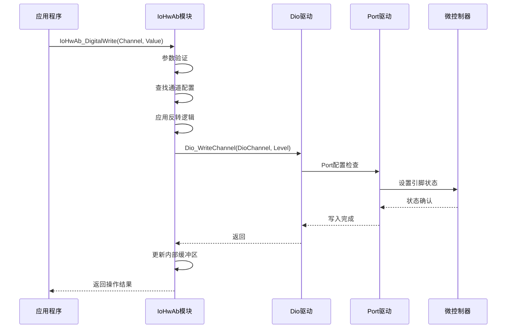

**图表来源**
- [IoHwAb.c:200-230](file://src/bsw/ecual/iohwab/src/IoHwAb.c#L200-L230)
- [Dio.h:112-134](file://src/bsw/mcal/dio/include/Dio.h#L112-L134)

**章节来源**
- [IoHwAb.c:165-230](file://src/bsw/ecual/iohwab/src/IoHwAb.c#L165-L230)
- [Dio.h:90-134](file://src/bsw/mcal/dio/include/Dio.h#L90-L134)

### 模拟信号处理

模拟I/O模块实现模数转换和信号缩放：

#### 模拟读取流程

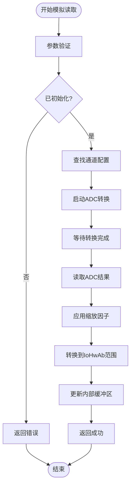

**图表来源**
- [IoHwAb.c:97-142](file://src/bsw/ecual/iohwab/src/IoHwAb.c#L97-L142)
- [Adc.h:272-290](file://src/bsw/mcal/adc/include/Adc.h#L272-L290)

#### 模拟写入流程

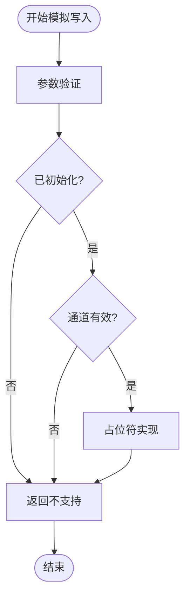

**图表来源**
- [IoHwAb.c:144-163](file://src/bsw/ecual/iohwab/src/IoHwAb.c#L144-L163)

**章节来源**
- [IoHwAb.c:97-163](file://src/bsw/ecual/iohwab/src/IoHwAb.c#L97-L163)
- [Adc.h:261-270](file://src/bsw/mcal/adc/include/Adc.h#L261-L270)

### PWM控制功能

PWM模块提供精确的脉宽调制信号生成：

#### PWM设置流程

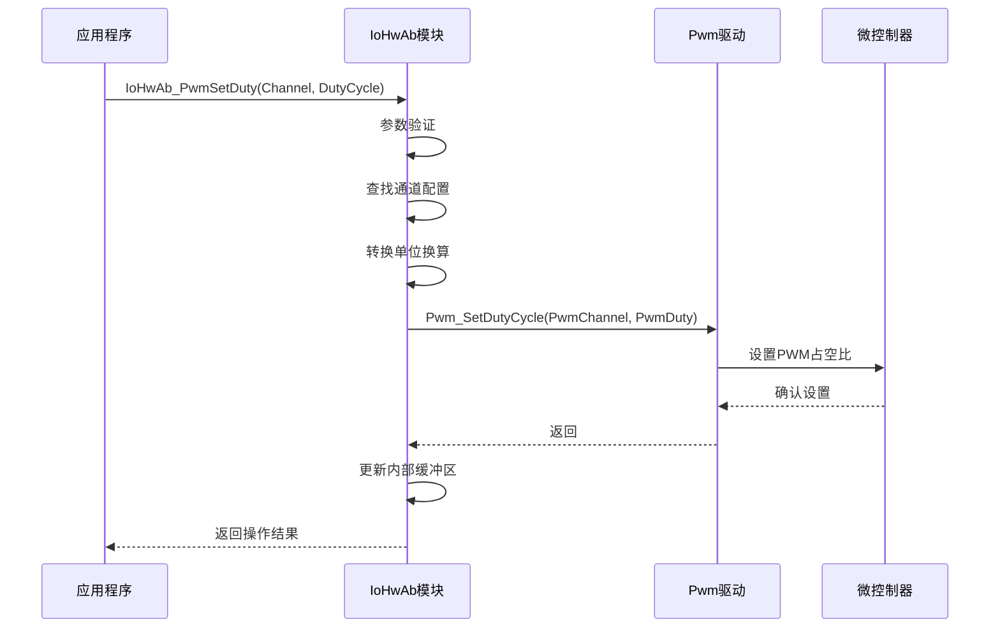

**图表来源**
- [IoHwAb.c:232-261](file://src/bsw/ecual/iohwab/src/IoHwAb.c#L232-L261)
- [Pwm.h:220-225](file://src/bsw/mcal/pwm/include/Pwm.h#L220-L225)

#### PWM频率和占空比设置

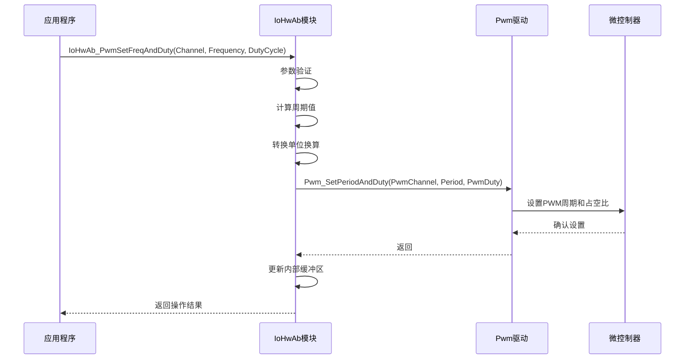

**图表来源**
- [IoHwAb.c:263-296](file://src/bsw/ecual/iohwab/src/IoHwAb.c#L263-L296)
- [Pwm.h:227-233](file://src/bsw/mcal/pwm/include/Pwm.h#L227-L233)

**章节来源**
- [IoHwAb.c:232-296](file://src/bsw/ecual/iohwab/src/IoHwAb.c#L232-L296)
- [Pwm.h:220-233](file://src/bsw/mcal/pwm/include/Pwm.h#L220-L233)

### SPI通信功能

SPI模块提供灵活的数据传输能力：

#### SPI传输流程

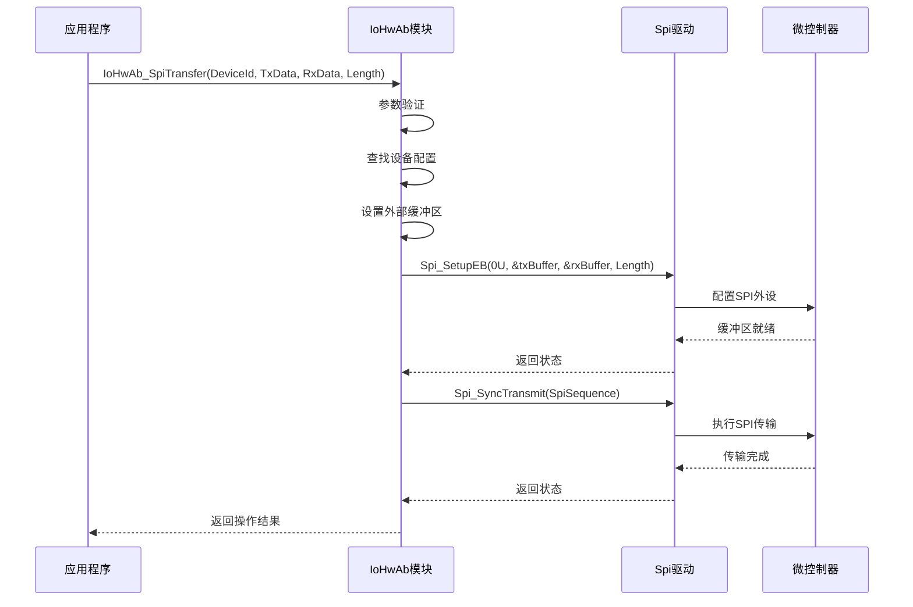

**图表来源**
- [IoHwAb.c:298-343](file://src/bsw/ecual/iohwab/src/IoHwAb.c#L298-L343)
- [Spi.h:290-327](file://src/bsw/mcal/spi/include/Spi.h#L290-L327)

**章节来源**
- [IoHwAb.c:298-343](file://src/bsw/ecual/iohwab/src/IoHwAb.c#L298-L343)
- [Spi.h:290-327](file://src/bsw/mcal/spi/include/Spi.h#L290-L327)

## 依赖关系分析

IoHwAb模块与MCAL层驱动存在紧密的依赖关系：

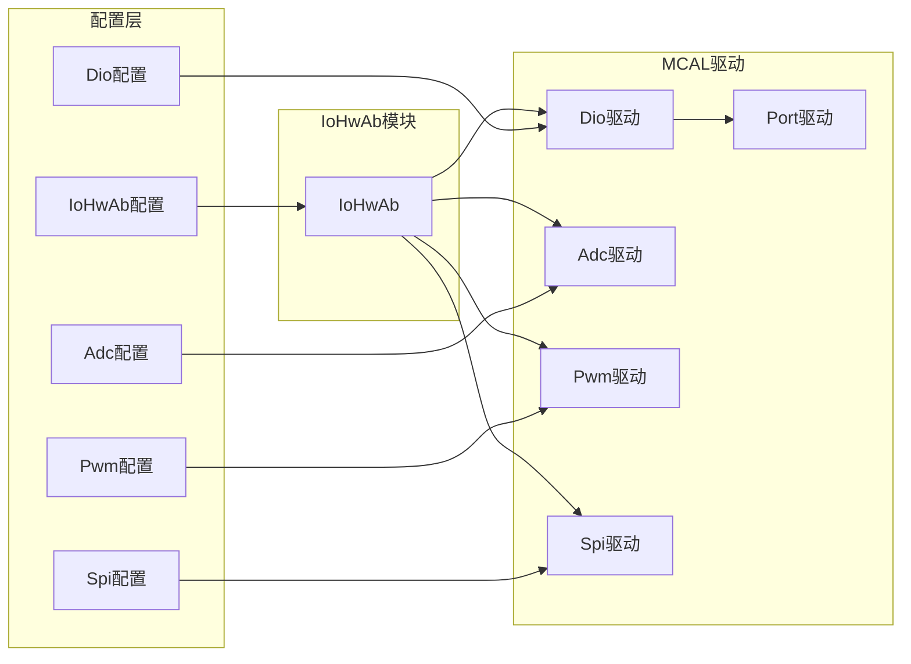

**图表来源**
- [IoHwAb.h:19-25](file://src/bsw/ecual/iohwab/include/IoHwAb.h#L19-L25)
- [IoHwAb_Cfg.h:14-25](file://src/bsw/ecual/iohwab/include/IoHwAb_Cfg.h#L14-L25)

### 错误处理策略

IoHwAb实现了完整的错误检测和处理机制：

| 错误代码 | 值 | 描述 | 处理策略 |
|:---------|:---|:-----|:---------|
| IOHWAB_E_UNINIT | 0x04 | 未初始化 | 返回IOHWAB_NOT_OK，记录DET错误 |
| IOHWAB_E_PARAM_CHANNEL | 0x02 | 通道参数无效 | 返回IOHWAB_NOT_OK，记录DET错误 |
| IOHWAB_E_PARAM_POINTER | 0x01 | 指针参数为空 | 返回IOHWAB_NOT_OK，记录DET错误 |
| IOHWAB_E_PARAM_VALUE | 0x03 | 值参数越界 | 返回IOHWAB_NOT_OK，记录DET错误 |
| IOHWAB_E_ALREADY_INITIALIZED | 0x05 | 已经初始化 | 返回IOHWAB_NOT_OK，记录DET错误 |

**章节来源**
- [IoHwAb.h:55-63](file://src/bsw/ecual/iohwab/include/IoHwAb.h#L55-L63)
- [IoHwAb.c:34-43](file://src/bsw/ecual/iohwab/src/IoHwAb.c#L34-L43)

## 性能考虑

### 缓冲机制优化

IoHwAb实现了内部缓冲机制来提高性能：

- **模拟缓冲**：`IoHwAb_AnalogBuffer[IOHWAB_NUM_ANALOG_CHANNELS]` - 存储最近的ADC读取值
- **数字缓冲**：`IoHwAb_DigitalBuffer[IOHWAB_NUM_DIGITAL_CHANNELS]` - 存储数字I/O状态
- **PWM缓冲**：`IoHwAb_PwmBuffer[IOHWAB_NUM_PWM_CHANNELS]` - 存储PWM配置状态

### 主函数周期优化

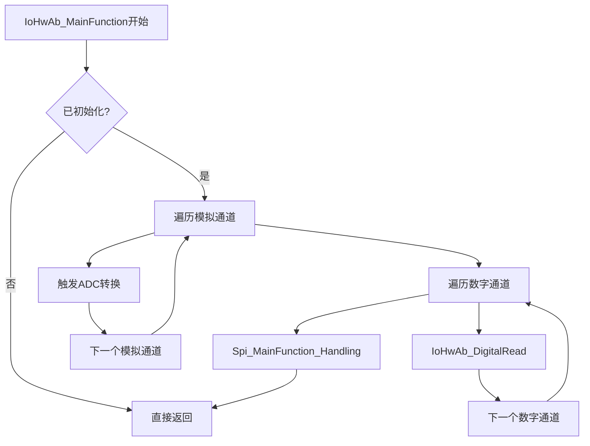

**图表来源**
- [IoHwAb.c:361-382](file://src/bsw/ecual/iohwab/src/IoHwAb.c#L361-L382)

### 内存管理

IoHwAb使用MemMap进行内存分区管理，确保符合AutoSAR标准：

- **静态变量**：使用`IOHWAB_START_SEC_VAR_CLEARED_UNSPECIFIED`和`IOHWAB_STOP_SEC_VAR_CLEARED_UNSPECIFIED`宏
- **代码段**：使用`IOHWAB_START_SEC_CODE`和`IOHWAB_STOP_SEC_CODE`宏
- **配置数据**：使用`IOHWAB_START_SEC_CONFIG_DATA_UNSPECIFIED`和`IOHWAB_STOP_SEC_CONFIG_DATA_UNSPECIFIED`宏

**章节来源**
- [IoHwAb.c:17-27](file://src/bsw/ecual/iohwab/src/IoHwAb.c#L17-L27)
- [IoHwAb.h:146-152](file://src/bsw/ecual/iohwab/include/IoHwAb.h#L146-L152)

## 故障排除指南

### 常见问题诊断

#### 初始化失败
**症状**：调用IoHwAb_Init返回错误
**可能原因**：
- 配置指针为空
- 模块已经初始化
- ADC/PWM/SPI驱动初始化失败

**解决方法**：
1. 检查配置指针有效性
2. 确认模块状态
3. 验证底层驱动初始化

#### 通道访问错误
**症状**：数字/模拟/PWM操作返回错误
**可能原因**：
- 通道号超出范围
- 参数指针为空
- 设备未正确配置

**解决方法**：
1. 验证通道编号
2. 检查参数指针
3. 确认配置文件正确

#### SPI传输失败
**症状**：IoHwAb_SpiTransfer返回失败
**可能原因**：
- 设备ID无效
- 缓冲区配置错误
- SPI外设忙

**解决方法**：
1. 验证设备ID
2. 检查缓冲区设置
3. 等待SPI空闲状态

**章节来源**
- [IoHwAb.c:32-95](file://src/bsw/ecual/iohwab/src/IoHwAb.c#L32-L95)
- [IoHwAb.c:298-343](file://src/bsw/ecual/iohwab/src/IoHwAb.c#L298-L343)

## 结论

IoHwAb模块作为AutoSAR BSW平台的核心抽象层，成功实现了对多种I/O硬件功能的统一管理。通过清晰的模块化设计、完善的错误处理机制和优化的性能特性，该模块为上层应用提供了稳定可靠的硬件抽象接口。

主要优势包括：
- **标准化接口**：符合AutoSAR 4.x标准
- **硬件无关性**：支持多种MCAL驱动
- **错误检测**：完整的DET支持
- **性能优化**：缓冲机制和异步处理
- **可扩展性**：模块化设计便于维护

未来改进方向：
- 增强模拟写入功能支持
- 优化DMA使用提高ADC性能
- 扩展更多硬件平台支持

## 附录

### API参考摘要

#### 初始化和配置
- `IoHwAb_Init(const IoHwAb_ConfigType* ConfigPtr)` - 初始化模块
- `IoHwAb_DeInit(void)` - 反初始化模块
- `IoHwAb_GetVersionInfo(Std_VersionInfoType* versioninfo)` - 获取版本信息

#### 数字I/O操作
- `IoHwAb_DigitalRead(IoHwAb_ChannelType Channel, IoHwAb_DigitalValueType* Value)` - 读取数字输入
- `IoHwAb_DigitalWrite(IoHwAb_ChannelType Channel, IoHwAb_DigitalValueType Value)` - 写入数字输出

#### 模拟信号处理
- `IoHwAb_AnalogRead(IoHwAb_ChannelType Channel, IoHwAb_AnalogValueType* Value)` - 读取模拟输入
- `IoHwAb_AnalogWrite(IoHwAb_ChannelType Channel, IoHwAb_AnalogValueType Value)` - 写入模拟输出（占位符）

#### PWM控制
- `IoHwAb_PwmSetDuty(IoHwAb_ChannelType Channel, uint16 DutyCycle)` - 设置占空比
- `IoHwAb_PwmSetFreqAndDuty(IoHwAb_ChannelType Channel, uint32 Frequency, uint16 DutyCycle)` - 设置频率和占空比

#### SPI通信
- `IoHwAb_SpiTransfer(uint8 DeviceId, const uint8* TxData, uint8* RxData, uint16 Length)` - SPI数据传输

#### 周期性处理
- `IoHwAb_MainFunction(void)` - 主函数，处理周期性任务

**章节来源**
- [IoHwAb.h:178-257](file://src/bsw/ecual/iohwab/include/IoHwAb.h#L178-L257)
- [api-reference.md:1-609](file://docs/api-reference.md#L1-L609)