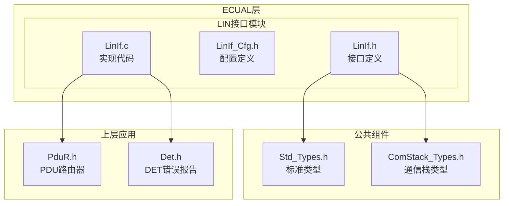
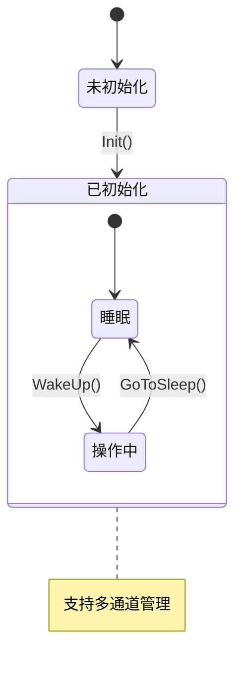
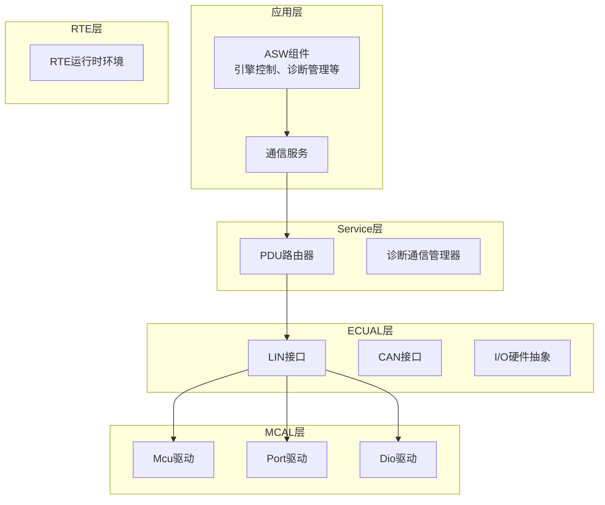
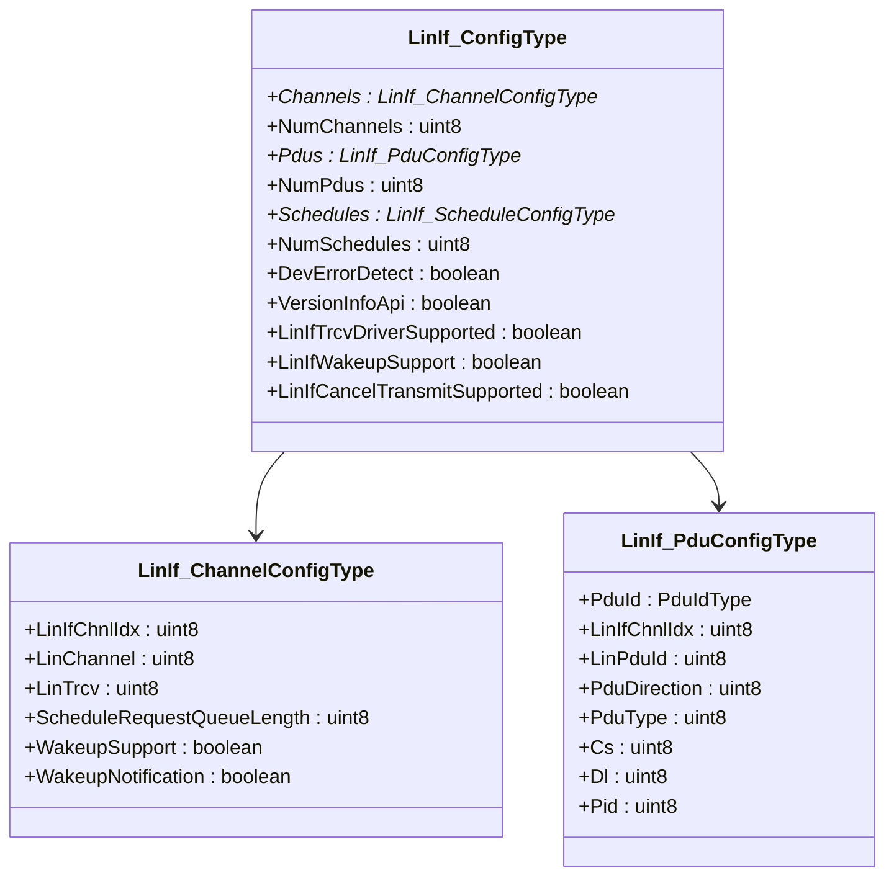
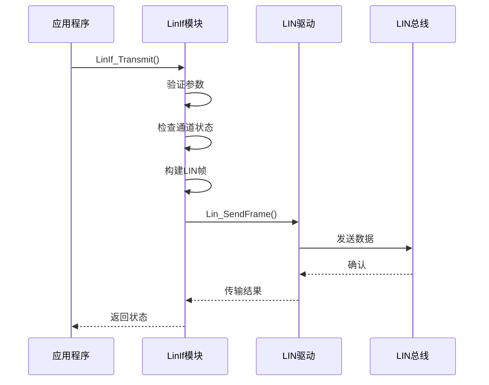
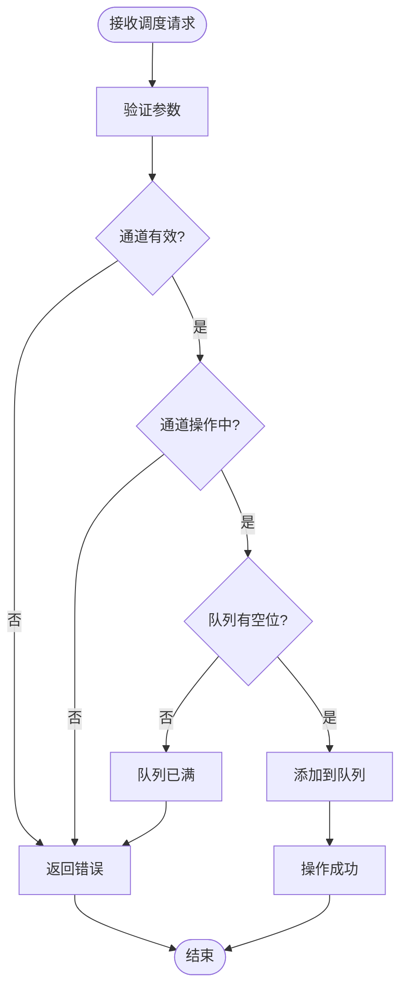
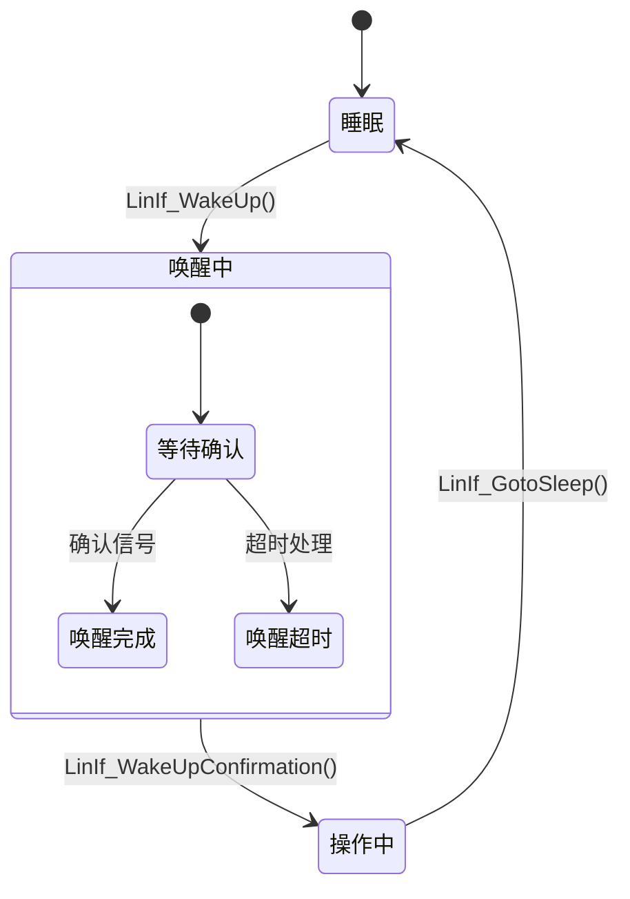
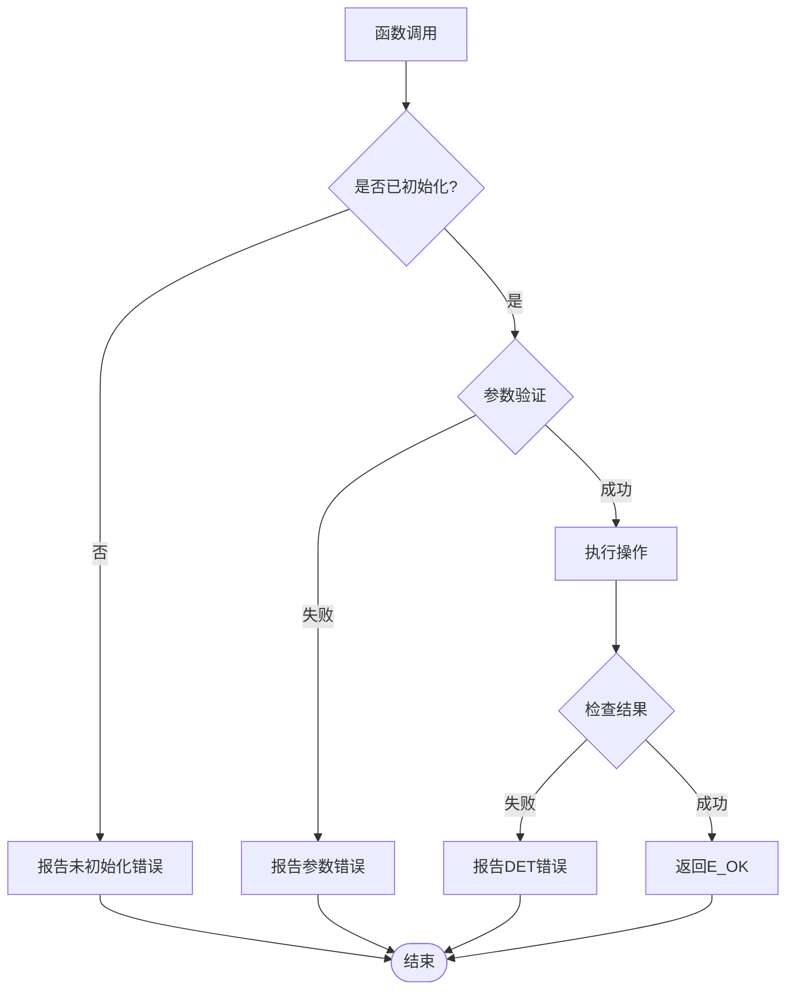
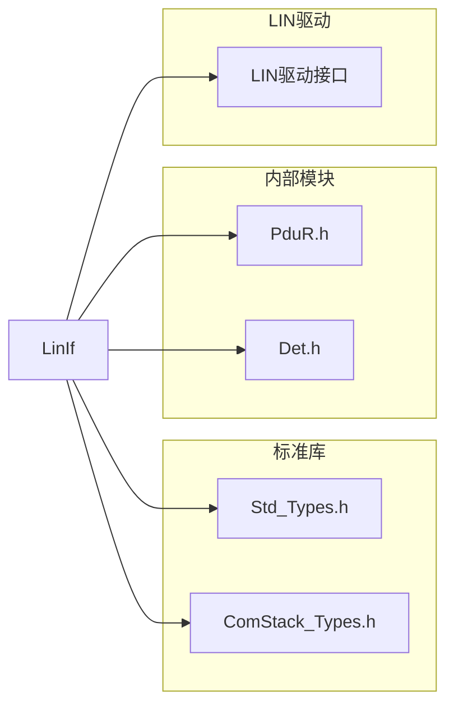

# LinIf LIN接口API

<cite>
**本文档引用的文件**
- [LinIf.h](file://src/bsw/ecual/linif/include/LinIf.h)
- [LinIf_Cfg.h](file://src/bsw/ecual/linif/include/LinIf_Cfg.h)
- [LinIf.c](file://src/bsw/ecual/linif/src/LinIf.c)
- [Std_Types.h](file://src/bsw/common/Std_Types.h)
- [ComStack_Types.h](file://src/bsw/common/ComStack_Types.h)
- [modules.md](file://docs/modules.md)
- [api-reference.md](file://docs/api-reference.md)
- [bsw_config.json](file://config/bsw_config.json)
</cite>

## 目录
1. [简介](#简介)
2. [项目结构](#项目结构)
3. [核心组件](#核心组件)
4. [架构概览](#架构概览)
5. [详细组件分析](#详细组件分析)
6. [依赖关系分析](#依赖关系分析)
7. [性能考虑](#性能考虑)
8. [故障排除指南](#故障排除指南)
9. [结论](#结论)
10. [附录](#附录)

## 简介

LinIf（LIN接口）是遵循AutoSAR经典平台4.x标准的LIN总线硬件抽象层模块。该模块提供了LIN总线通信的完整接口，包括LIN帧传输、接收处理、节点管理、同步控制等核心功能。

LIN（Local Interconnect Network）是一种低成本的车载网络协议，主要用于辅助设备和传感器通信。LinIf模块作为ECUAL（ECU抽象层）的一部分，为上层应用提供了标准化的LIN通信接口。

## 项目结构

LinIf模块位于项目的ECUAL层，具体组织结构如下：

**图表来源**
- [LinIf.h:1-305](file://src/bsw/ecual/linif/include/LinIf.h#L1-L305)
- [LinIf_Cfg.h:1-105](file://src/bsw/ecual/linif/include/LinIf_Cfg.h#L1-L105)
- [LinIf.c:1-495](file://src/bsw/ecual/linif/src/LinIf.c#L1-L495)

**章节来源**
- [LinIf.h:1-305](file://src/bsw/ecual/linif/include/LinIf.h#L1-L305)
- [LinIf_Cfg.h:1-105](file://src/bsw/ecual/linif/include/LinIf_Cfg.h#L1-L105)
- [modules.md:215-224](file://docs/modules.md#L215-L224)

## 核心组件

### LIN接口状态管理

LinIf模块实现了完整的状态管理系统，包括模块状态和通道状态：

**图表来源**
- [LinIf.h:82-93](file://src/bsw/ecual/linif/include/LinIf.h#L82-L93)
- [LinIf.c:25-32](file://src/bsw/ecual/linif/src/LinIf.c#L25-L32)

### 传输接收器模式

LinIf支持三种传输接收器模式：

| 模式 | 描述 | 用途 |
|------|------|------|
| 正常模式 | 标准通信模式 | 日常数据传输 |
| 待机模式 | 低功耗模式 | 空闲时节能 |
| 睡眠模式 | 最低功耗模式 | 系统休眠 |

**章节来源**
- [LinIf.h:98-102](file://src/bsw/ecual/linif/include/LinIf.h#L98-L102)
- [LinIf.c:260-279](file://src/bsw/ecual/linif/src/LinIf.c#L260-L279)

## 架构概览

LinIf模块采用分层架构设计，与上层和下层组件的交互关系如下：

**图表来源**
- [modules.md:558-623](file://docs/modules.md#L558-L623)
- [LinIf.h:19-21](file://src/bsw/ecual/linif/include/LinIf.h#L19-L21)

## 详细组件分析

### 配置管理组件

LinIf模块提供了灵活的配置管理机制，支持编译时配置和运行时参数调整。

#### 配置类型定义

**图表来源**
- [LinIf.h:166-178](file://src/bsw/ecual/linif/include/LinIf.h#L166-L178)
- [LinIf.h:118-139](file://src/bsw/ecual/linif/include/LinIf.h#L118-L139)

#### 通道配置参数

| 参数 | 默认值 | 描述 |
|------|--------|------|
| LINIF_NUM_CHANNELS | 4 | 通道数量 |
| LINIF_NUM_PDUS | 32 | PDU数量 |
| LINIF_NUM_SCHEDULES | 16 | 调度数量 |
| LINIF_BAUDRATE_9600 | 9600 | 9600波特率 |
| LINIF_BAUDRATE_19200 | 19200 | 19200波特率 |
| LINIF_BAUDRATE_115200 | 115200 | 115200波特率 |

**章节来源**
- [LinIf_Cfg.h:24-87](file://src/bsw/ecual/linif/include/LinIf_Cfg.h#L24-L87)
- [LinIf_Cfg.h:31-51](file://src/bsw/ecual/linif/include/LinIf_Cfg.h#L31-L51)

### 通信协议处理

#### LIN帧传输流程

**图表来源**
- [LinIf.c:104-150](file://src/bsw/ecual/linif/src/LinIf.c#L104-L150)

#### 调度请求处理

**图表来源**
- [LinIf.c:152-185](file://src/bsw/ecual/linif/src/LinIf.c#L152-L185)

**章节来源**
- [LinIf.c:104-150](file://src/bsw/ecual/linif/src/LinIf.c#L104-L150)
- [LinIf.c:152-185](file://src/bsw/ecual/linif/src/LinIf.c#L152-L185)

### 节点管理功能

#### 唤醒管理

**图表来源**
- [LinIf.c:215-245](file://src/bsw/ecual/linif/src/LinIf.c#L215-L245)
- [LinIf.c:418-437](file://src/bsw/ecual/linif/src/LinIf.c#L418-L437)

#### 传输取消

LinIf模块支持传输取消功能，允许在传输过程中取消正在进行的操作：

| 功能 | 条件编译 | 描述 |
|------|----------|------|
| LinIf_CancelTransmit | LINIF_CANCEL_TRANSMIT_SUPPORTED | 取消PDU传输 |
| LinIf_CheckWakeup | LINIF_WAKEUP_SUPPORT | 检测唤醒源 |
| LinIf_DisableWakeup | LINIF_WAKEUP_SUPPORT | 禁用通道唤醒 |
| LinIf_EnableWakeup | LINIF_WAKEUP_SUPPORT | 启用通道唤醒 |

**章节来源**
- [LinIf_Cfg.h:15-19](file://src/bsw/ecual/linif/include/LinIf_Cfg.h#L15-L19)
- [LinIf.c:379-400](file://src/bsw/ecual/linif/src/LinIf.c#L379-L400)

### 错误处理机制

LinIf模块实现了完整的错误检测和报告机制：

**图表来源**
- [LinIf.c:48-80](file://src/bsw/ecual/linif/src/LinIf.c#L48-L80)

**章节来源**
- [LinIf.h:59-77](file://src/bsw/ecual/linif/include/LinIf.h#L59-L77)
- [LinIf.c:48-80](file://src/bsw/ecual/linif/src/LinIf.c#L48-L80)

## 依赖关系分析

### 外部依赖

LinIf模块依赖于以下外部组件：

**图表来源**
- [LinIf.h:19-21](file://src/bsw/ecual/linif/include/LinIf.h#L19-L21)
- [LinIf.c:9-12](file://src/bsw/ecual/linif/src/LinIf.c#L9-L12)

### 内部耦合关系

| 模块 | 耦合类型 | 说明 |
|------|----------|------|
| LinIf.c | 高内聚 | 单一职责的实现 |
| LinIf.h | 低耦合 | 接口定义与实现分离 |
| LinIf_Cfg.h | 配置耦合 | 编译时配置管理 |
| Det.h | 错误检测 | 运行时错误报告 |
| PduR.h | 通信耦合 | PDU路由接口 |

**章节来源**
- [LinIf.h:19-21](file://src/bsw/ecual/linif/include/LinIf.h#L19-L21)
- [LinIf.c:9-12](file://src/bsw/ecual/linif/src/LinIf.c#L9-L12)

## 性能考虑

### 时间复杂度分析

| 函数 | 时间复杂度 | 空间复杂度 | 说明 |
|------|------------|------------|------|
| LinIf_Init | O(n) | O(1) | n为通道数量 |
| LinIf_Transmit | O(1) | O(1) | 固定开销 |
| LinIf_ScheduleRequest | O(q) | O(1) | q为队列长度 |
| LinIf_MainFunction | O(c×q) | O(1) | c为通道数，q为队列长度 |

### 内存使用优化

- **静态内存分配**：所有状态变量使用静态分配，避免堆栈压力
- **队列缓存**：调度请求队列预分配固定大小
- **配置常量**：编译时常量减少运行时查找开销

### 并发处理

LinIf模块采用单线程设计，通过周期性调用`LinIf_MainFunction`来处理异步操作，确保线程安全性。

## 故障排除指南

### 常见错误诊断

| 错误代码 | 错误类型 | 可能原因 | 解决方案 |
|----------|----------|----------|----------|
| LINIF_E_UNINIT | 初始化错误 | 模块未初始化 | 调用LinIf_Init() |
| LINIF_E_NONEXISTENT_CHANNEL | 通道错误 | 通道索引越界 | 检查通道配置 |
| LINIF_E_PARAMETER | 参数错误 | PDU ID无效 | 验证PDU标识符 |
| LINIF_E_PARAMETER_POINTER | 指针错误 | 空指针参数 | 检查传入指针 |
| LINIF_E_TRCV_INV_MODE | 模式错误 | 传输接收器模式无效 | 使用有效模式值 |

### 调试建议

1. **启用DET错误检测**：设置`LINIF_DEV_ERROR_DETECT = STD_ON`
2. **检查配置参数**：验证通道、PDU和调度配置
3. **监控状态变化**：跟踪通道状态转换
4. **分析队列行为**：监控调度请求队列

**章节来源**
- [LinIf.h:59-77](file://src/bsw/ecual/linif/include/LinIf.h#L59-L77)
- [LinIf_Cfg.h:15](file://src/bsw/ecual/linif/include/LinIf_Cfg.h#L15)

## 结论

LinIf LIN接口模块提供了完整的LIN总线通信解决方案，具有以下特点：

1. **标准化接口**：完全符合AutoSAR标准，便于集成和维护
2. **灵活配置**：支持编译时和运行时配置，适应不同应用场景
3. **健壮性设计**：完善的错误检测和处理机制
4. **高效实现**：优化的时间和空间复杂度
5. **可扩展性**：模块化设计支持功能扩展

该模块为车载网络应用提供了可靠的LIN通信基础，支持从简单传感器到复杂控制系统的各种需求。

## 附录

### API参考摘要

#### 初始化相关
- `LinIf_Init()` - 模块初始化
- `LinIf_InitChannel()` - 通道初始化

#### 通信相关
- `LinIf_Transmit()` - PDU传输
- `LinIf_ScheduleRequest()` - 调度请求
- `LinIf_MainFunction()` - 主函数

#### 状态管理
- `LinIf_GotoSleep()` - 进入睡眠
- `LinIf_WakeUp()` - 唤醒
- `LinIf_WakeUpConfirmation()` - 唤醒确认

#### 配置管理
- `LinIf_SetTransceiverMode()` - 设置模式
- `LinIf_GetTransceiverMode()` - 获取模式
- `LinIf_ChangeParam()` - 参数更改

**章节来源**
- [LinIf.h:197-300](file://src/bsw/ecual/linif/include/LinIf.h#L197-L300)

### 配置参数说明

| 参数名称 | 默认值 | 描述 | 适用场景 |
|----------|--------|------|----------|
| LINIF_DEV_ERROR_DETECT | STD_ON | 错误检测开关 | 开发调试 |
| LINIF_VERSION_INFO_API | STD_ON | 版本信息API | 调试诊断 |
| LINIF_TRCV_DRIVER_SUPPORTED | STD_ON | 传输接收器支持 | 硬件配置 |
| LINIF_WAKEUP_SUPPORT | STD_ON | 唤醒支持 | 低功耗应用 |
| LINIF_CANCEL_TRANSMIT_SUPPORTED | STD_ON | 传输取消支持 | 实时系统 |