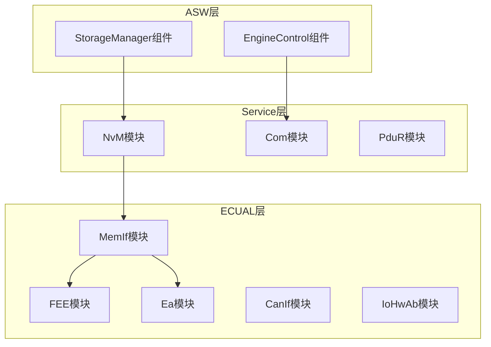
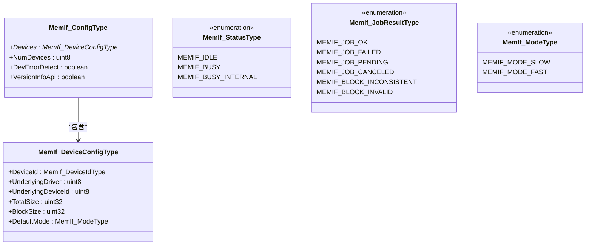
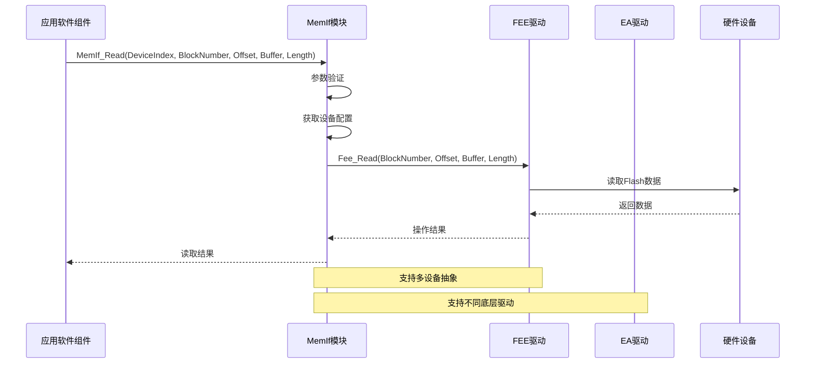
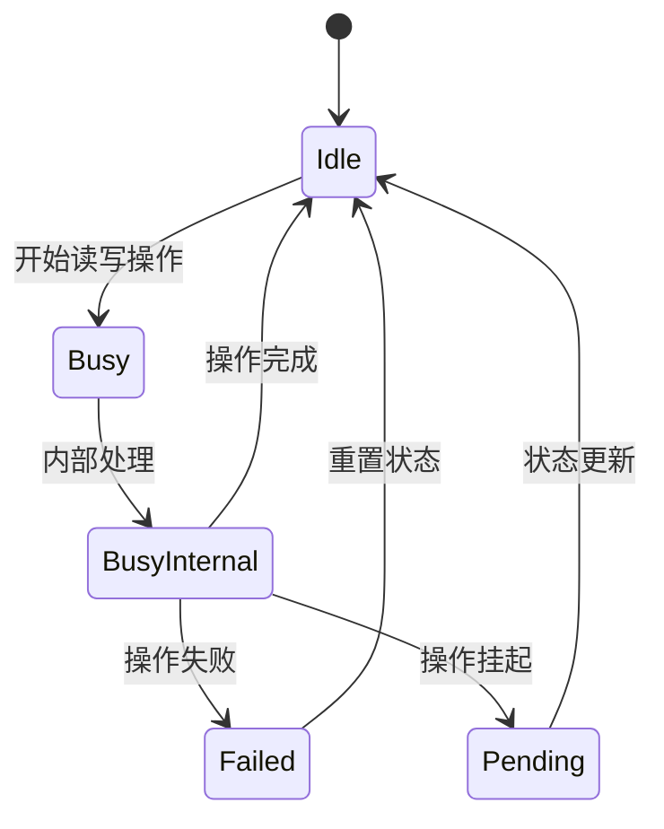
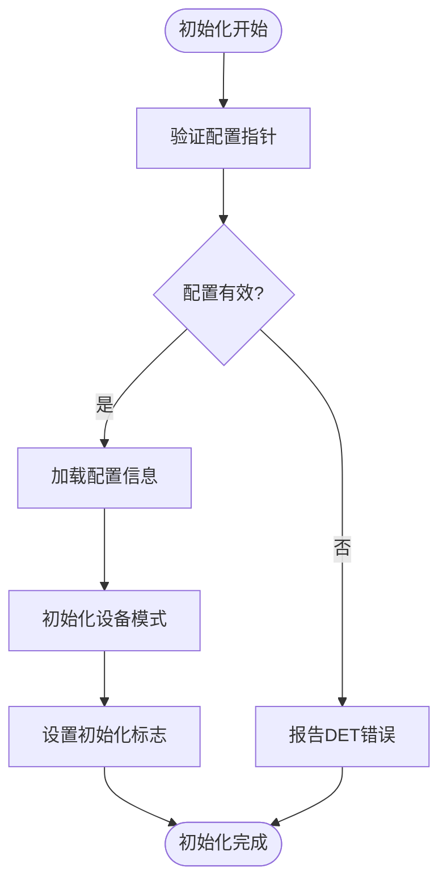
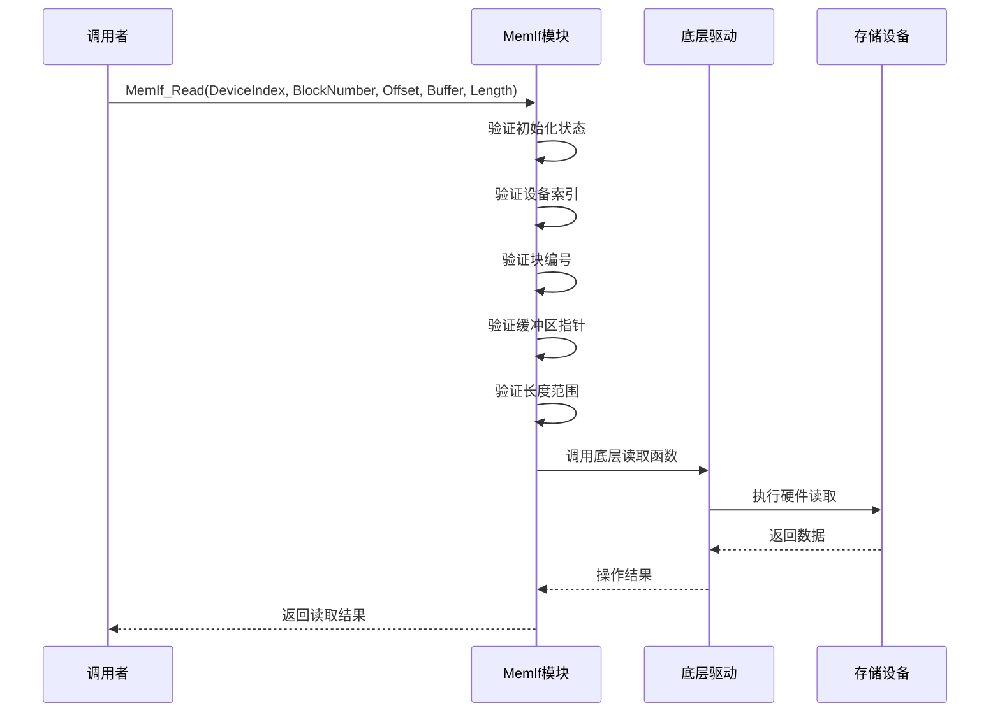
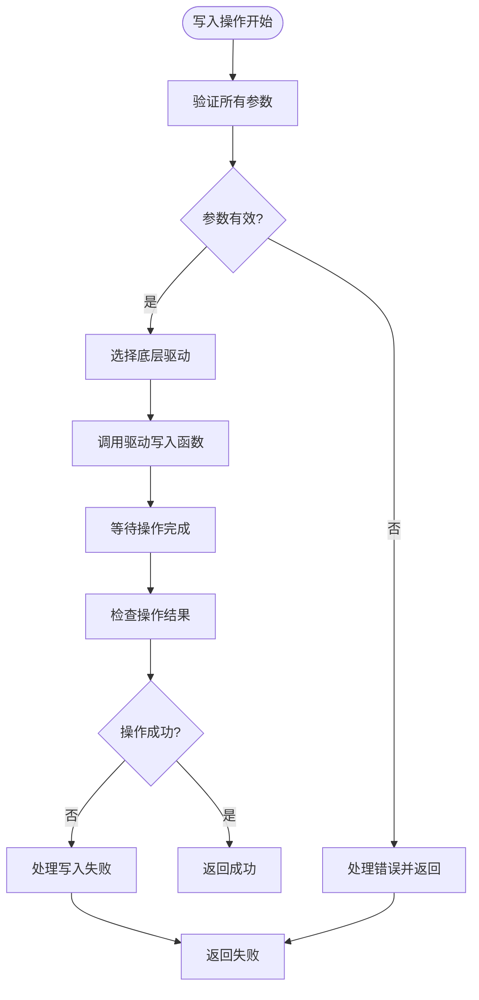
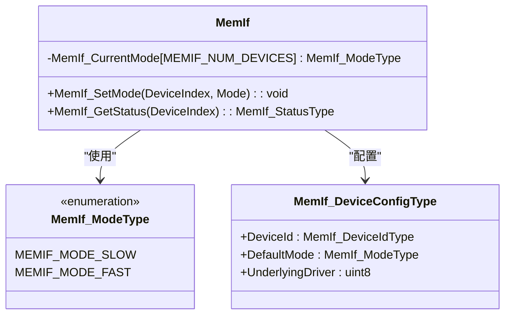
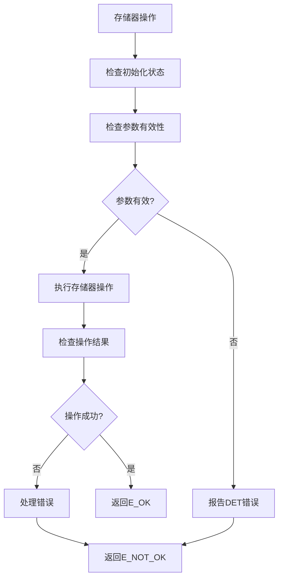
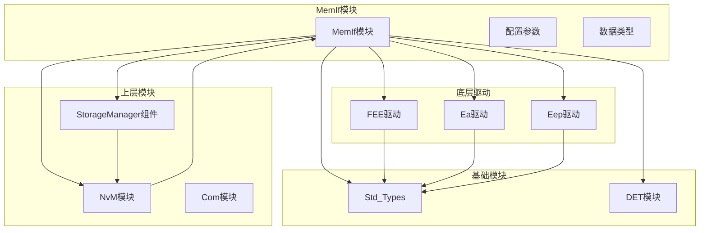

# MemIf 存储器接口API

<cite>
**本文档引用的文件**
- [MemIf.h](file://src/bsw/ecual/memif/include/MemIf.h)
- [MemIf_Cfg.h](file://src/bsw/ecual/memif/include/MemIf_Cfg.h)
- [MemIf.c](file://src/bsw/ecual/memif/src/MemIf.c)
- [Det.h](file://src/bsw/services/det/include/Det.h)
- [Std_Types.h](file://src/bsw/os/include/Std_Types.h)
- [Fee.h](file://src/bsw/ecual/fee/include/Fee.h)
- [Ea.h](file://src/bsw/ecual/ea/include/Ea.h)
- [modules.md](file://docs/modules.md)
- [bsw_integration_verification.md](file://verification/bsw_integration_verification.md)
</cite>

## 目录
1. [简介](#简介)
2. [项目结构](#项目结构)
3. [核心组件](#核心组件)
4. [架构概览](#架构概览)
5. [详细组件分析](#详细组件分析)
6. [依赖关系分析](#依赖关系分析)
7. [性能考虑](#性能考虑)
8. [故障排除指南](#故障排除指南)
9. [结论](#结论)
10. [附录](#附录)

## 简介

MemIf（Memory Interface）是YuleTech AutoSAR BSW平台中的存储器接口模块，遵循AutoSAR Classic Platform 4.x标准。该模块作为ECU抽象层（ECUAL）的一部分，提供了统一的存储器访问接口，抽象了底层EEPROM和Flash驱动程序的差异。

MemIf模块的主要职责包括：
- 提供统一的存储器访问接口
- 支持多种底层存储器驱动（EEPROM、Flash EEPROM Emulation、Eeprom Abstraction）
- 实现存储器状态管理和错误处理
- 提供读写操作、块管理、设备模式控制等功能

该模块在系统架构中处于关键位置，为上层应用软件组件（ASW）提供标准化的存储器访问能力，同时向上层服务模块（如NvM）提供统一的接口。

## 项目结构

MemIf模块位于AutoSAR BSW平台的ECUAL层，具体组织结构如下：

**图表来源**
- [modules.md:175-203](file://docs/modules.md#L175-L203)
- [bsw_integration_verification.md:47-61](file://verification/bsw_integration_verification.md#L47-L61)

**章节来源**
- [modules.md:175-203](file://docs/modules.md#L175-L203)
- [bsw_integration_verification.md:47-61](file://verification/bsw_integration_verification.md#L47-L61)

## 核心组件

MemIf模块的核心组件包括以下主要部分：

### 数据类型定义

MemIf模块定义了完整的数据类型体系，确保与AutoSAR标准的兼容性：

**图表来源**
- [MemIf.h:108-126](file://src/bsw/ecual/memif/include/MemIf.h#L108-L126)
- [MemIf.h:59-84](file://src/bsw/ecual/memif/include/MemIf.h#L59-L84)

### 配置参数

MemIf模块支持灵活的配置参数，允许根据具体硬件需求进行定制：

| 参数名称 | 默认值 | 描述 |
|---------|--------|------|
| MEMIF_DEV_ERROR_DETECT | STD_ON | 开发错误检测开关 |
| MEMIF_VERSION_INFO_API | STD_ON | 版本信息API开关 |
| MEMIF_NUM_DEVICES | 2U | 设备数量配置 |
| MEMIF_DEFAULT_MODE | MEMIF_MODE_FAST | 默认操作模式 |
| MEMIF_MAX_BLOCK_NUMBER | 256U | 最大块编号 |
| MEMIF_MAX_BLOCK_SIZE | 4096U | 最大块大小 |

**章节来源**
- [MemIf_Cfg.h:15-58](file://src/bsw/ecual/memif/include/MemIf_Cfg.h#L15-L58)

## 架构概览

MemIf模块采用分层架构设计，实现了存储器访问的抽象化：

**图表来源**
- [MemIf.c:65-120](file://src/bsw/ecual/memif/src/MemIf.c#L65-L120)
- [MemIf.c:147-171](file://src/bsw/ecual/memif/src/MemIf.c#L147-L171)

### 状态管理机制

MemIf模块实现了完整的状态管理系统，支持设备状态查询和作业结果获取：

**图表来源**
- [MemIf.h:60-76](file://src/bsw/ecual/memif/include/MemIf.h#L60-L76)

**章节来源**
- [MemIf.c:208-247](file://src/bsw/ecual/memif/src/MemIf.c#L208-L247)
- [MemIf.c:249-288](file://src/bsw/ecual/memif/src/MemIf.c#L249-L288)

## 详细组件分析

### 初始化流程

MemIf模块的初始化过程确保了正确的配置加载和状态设置：

**图表来源**
- [MemIf.c:44-63](file://src/bsw/ecual/memif/src/MemIf.c#L44-L63)

### 读取操作流程

MemIf模块的读取操作实现了完整的参数验证和错误处理：

**图表来源**
- [MemIf.c:65-120](file://src/bsw/ecual/memif/src/MemIf.c#L65-L120)

**章节来源**
- [MemIf.c:65-120](file://src/bsw/ecual/memif/src/MemIf.c#L65-L120)

### 写入操作流程

写入操作与读取操作类似，但涉及更多的状态管理和错误处理：

**图表来源**
- [MemIf.c:122-171](file://src/bsw/ecual/memif/src/MemIf.c#L122-L171)

**章节来源**
- [MemIf.c:122-171](file://src/bsw/ecual/memif/src/MemIf.c#L122-L171)

### 设备模式管理

MemIf模块支持设备模式的动态切换，这对于优化存储器性能至关重要：

**图表来源**
- [MemIf.h:81-84](file://src/bsw/ecual/memif/include/MemIf.h#L81-L84)
- [MemIf.c:398-417](file://src/bsw/ecual/memif/src/MemIf.c#L398-L417)

**章节来源**
- [MemIf.c:398-417](file://src/bsw/ecual/memif/src/MemIf.c#L398-L417)

### 错误处理机制

MemIf模块实现了完整的错误处理机制，遵循AutoSAR标准的DET（Development Error Tracer）规范：

**图表来源**
- [MemIf.c:71-92](file://src/bsw/ecual/memif/src/MemIf.c#L71-L92)

**章节来源**
- [MemIf.c:71-92](file://src/bsw/ecual/memif/src/MemIf.c#L71-L92)

## 依赖关系分析

MemIf模块与多个其他模块存在紧密的依赖关系：

**图表来源**
- [MemIf.c:9-11](file://src/bsw/ecual/memif/src/MemIf.c#L9-L11)
- [modules.md:367](file://docs/modules.md#L367)

### 配置依赖

MemIf模块的配置依赖于多个配置文件和常量定义：

| 依赖项 | 来源 | 用途 |
|--------|------|------|
| MEMIF_DEV_ERROR_DETECT | MemIf_Cfg.h | 错误检测开关 |
| MEMIF_NUM_DEVICES | MemIf_Cfg.h | 设备数量配置 |
| MEMIF_DEVICE_0/1 | MemIf_Cfg.h | 设备标识符 |
| MEMIF_UNDERLYING_* | MemIf_Cfg.h | 底层驱动类型 |
| MEMIF_DEFAULT_MODE | MemIf_Cfg.h | 默认操作模式 |
| MEMIF_MAX_BLOCK_NUMBER | MemIf_Cfg.h | 最大块编号限制 |
| MEMIF_MAX_BLOCK_SIZE | MemIf_Cfg.h | 最大数据块大小 |

**章节来源**
- [MemIf_Cfg.h:15-58](file://src/bsw/ecual/memif/include/MemIf_Cfg.h#L15-L58)

## 性能考虑

MemIf模块在设计时充分考虑了性能优化：

### 模式切换优化

MemIf模块支持快速和慢速两种操作模式，允许根据应用需求进行优化：

- **快速模式（MEMIF_MODE_FAST）**：适用于实时性要求较高的场景
- **慢速模式（MEMIF_MODE_SLOW）**：适用于功耗敏感或可靠性优先的场景

### 缓冲管理

模块实现了高效的缓冲管理策略：
- 支持最大4KB的数据块大小
- 提供灵活的块偏移访问
- 优化的内存对齐处理

### 并发处理

MemIf模块支持多设备并发操作：
- 每个设备独立的状态管理
- 独立的错误处理机制
- 设备间的隔离保护

## 故障排除指南

### 常见错误及解决方案

| 错误代码 | 错误含义 | 可能原因 | 解决方案 |
|----------|----------|----------|----------|
| MEMIF_E_UNINIT | 未初始化 | MemIf_Init未调用或配置指针为空 | 确保正确调用初始化函数 |
| MEMIF_E_PARAM_DEVICE | 设备参数无效 | 设备索引超出范围 | 检查设备配置和索引值 |
| MEMIF_E_PARAM_BLOCK | 块参数无效 | 块编号超出限制 | 验证块配置和编号范围 |
| MEMIF_E_PARAM_POINTER | 指针参数无效 | 缓冲区指针为空 | 确保传入有效的缓冲区地址 |
| MEMIF_E_PARAM_LENGTH | 长度参数无效 | 数据长度超出限制 | 检查数据长度是否在允许范围内 |

### 调试建议

1. **启用DET错误检测**：确保MEMIF_DEV_ERROR_DETECT设置为STD_ON
2. **检查配置参数**：验证所有配置宏定义的正确性
3. **监控设备状态**：定期调用MemIf_GetStatus检查设备状态
4. **跟踪作业结果**：使用MemIf_GetJobResult获取操作结果
5. **验证内存映射**：确保MemMap.h正确配置内存分区

**章节来源**
- [MemIf.h:48-56](file://src/bsw/ecual/memif/include/MemIf.h#L48-L56)
- [MemIf.c:71-92](file://src/bsw/ecual/memif/src/MemIf.c#L71-L92)

## 结论

MemIf存储器接口模块是YuleTech AutoSAR BSW平台中的关键组件，成功实现了存储器访问的抽象化和标准化。该模块具有以下特点：

1. **标准化接口**：完全遵循AutoSAR Classic Platform 4.x标准
2. **灵活配置**：支持多设备、多驱动的灵活配置
3. **完善错误处理**：实现完整的DET错误检测机制
4. **高性能设计**：支持快速和慢速两种操作模式
5. **良好的扩展性**：易于添加新的底层驱动支持

MemIf模块为上层应用软件提供了可靠的存储器访问接口，是整个AutoSAR BSW平台的重要基础设施组件。

## 附录

### API参考表

| 函数名称 | 功能描述 | 参数 | 返回值 |
|----------|----------|------|--------|
| MemIf_Init | 初始化MemIf模块 | ConfigPtr: 配置指针 | void |
| MemIf_Read | 从存储器读取数据 | DeviceIndex, BlockNumber, BlockOffset, DataBufferPtr, Length | Std_ReturnType |
| MemIf_Write | 向存储器写入数据 | DeviceIndex, BlockNumber, DataBufferPtr | Std_ReturnType |
| MemIf_Cancel | 取消正在进行的操作 | DeviceIndex | void |
| MemIf_GetStatus | 获取设备状态 | DeviceIndex | MemIf_StatusType |
| MemIf_GetJobResult | 获取作业结果 | DeviceIndex | MemIf_JobResultType |
| MemIf_InvalidateBlock | 使块失效 | DeviceIndex, BlockNumber | Std_ReturnType |
| MemIf_EraseImmediateBlock | 立即擦除块 | DeviceIndex, BlockNumber | Std_ReturnType |
| MemIf_GetVersionInfo | 获取版本信息 | versioninfo: 版本信息指针 | void |
| MemIf_SetMode | 设置设备模式 | DeviceIndex, Mode | void |

### 配置参数说明

| 参数名称 | 类型 | 默认值 | 描述 |
|----------|------|--------|------|
| MEMIF_DEV_ERROR_DETECT | boolean | STD_ON | 是否启用开发错误检测 |
| MEMIF_VERSION_INFO_API | boolean | STD_ON | 是否启用版本信息API |
| MEMIF_NUM_DEVICES | uint8 | 2U | 系统中存储器设备的数量 |
| MEMIF_DEFAULT_MODE | MemIf_ModeType | MEMIF_MODE_FAST | 默认操作模式 |
| MEMIF_MAX_BLOCK_NUMBER | uint16 | 256U | 最大块编号限制 |
| MEMIF_MAX_BLOCK_SIZE | uint32 | 4096U | 最大数据块大小（字节） |

### 最佳实践指南

1. **正确初始化**：始终在系统启动时调用MemIf_Init
2. **参数验证**：在调用任何MemIf函数前验证所有参数
3. **错误处理**：实现完善的错误处理逻辑
4. **模式选择**：根据应用需求选择合适的操作模式
5. **资源管理**：合理管理缓冲区和内存资源
6. **状态监控**：定期检查设备状态和作业结果
7. **配置优化**：根据硬件特性优化配置参数