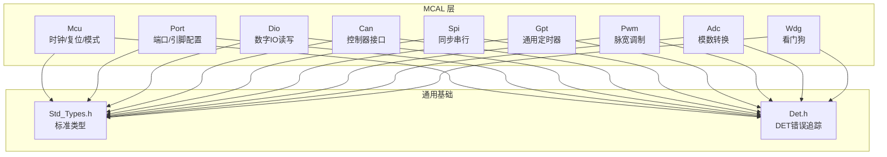
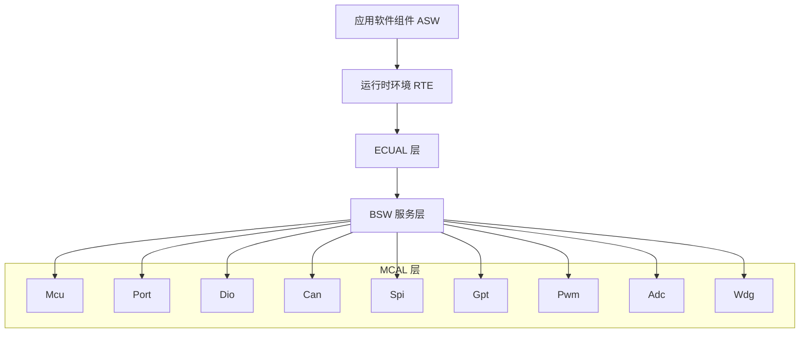
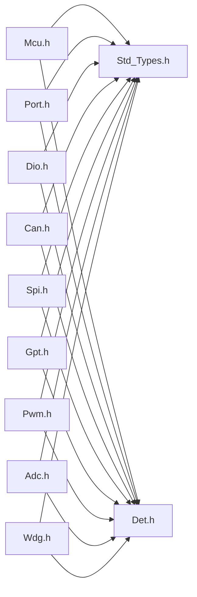

# MCAL硬件抽象层API

<cite>
**本文档引用的文件**
- [Mcu.h](file://src/bsw/mcal/mcu/include/Mcu.h)
- [Mcu_Cfg.h](file://src/bsw/mcal/mcu/include/Mcu_Cfg.h)
- [Port.h](file://src/bsw/mcal/port/include/Port.h)
- [Port_Cfg.h](file://src/bsw/mcal/port/include/Port_Cfg.h)
- [Dio.h](file://src/bsw/mcal/dio/include/Dio.h)
- [Can.h](file://src/bsw/mcal/can/include/Can.h)
- [Spi.h](file://src/bsw/mcal/spi/include/Spi.h)
- [Gpt.h](file://src/bsw/mcal/gpt/include/Gpt.h)
- [Pwm.h](file://src/bsw/mcal/pwm/include/Pwm.h)
- [Adc.h](file://src/bsw/mcal/adc/include/Adc.h)
- [Wdg.h](file://src/bsw/mcal/wdg/include/Wdg.h)
- [Std_Types.h](file://src/bsw/common/Std_Types.h)
- [Det.h](file://src/bsw/common/Det.h)
- [api-reference.md](file://docs/api-reference.md)
- [main.c（LED闪烁示例）](file://examples/led_blink/main.c)
- [main.c（CAN通信示例）](file://examples/can_demo/main.c)
</cite>

## 目录
1. [简介](#简介)
2. [项目结构](#项目结构)
3. [核心组件](#核心组件)
4. [架构总览](#架构总览)
5. [详细组件分析](#详细组件分析)
6. [依赖关系分析](#依赖关系分析)
7. [性能考量](#性能考量)
8. [故障排查指南](#故障排查指南)
9. [结论](#结论)
10. [附录](#附录)

## 简介
本文件为 YuleTech AutoSAR BSW 平台的 MCAL（微控制器抽象层）模块提供完整的 API 参考与使用指南。覆盖 Mcu、Port、Dio、Can、Spi、Gpt、Pwm、Adc、Wdg 等模块的公共接口，包括函数签名、参数说明、返回值定义、调用时机、配置要求、错误处理机制以及典型应用场景示例。文档同时提供版本兼容性说明、性能优化建议与最佳实践。

## 项目结构
MCAL 层位于 src/bsw/mcal 下，按模块划分头文件与源文件，每个模块均提供统一的初始化、反初始化、主函数与版本信息接口规范；配置通过独立的配置头文件进行编译期或运行期配置选择。

图表来源
- [Mcu.h:13-239](file://src/bsw/mcal/mcu/include/Mcu.h#L13-L239)
- [Port.h:15-183](file://src/bsw/mcal/port/include/Port.h#L15-L183)
- [Dio.h:14-195](file://src/bsw/mcal/dio/include/Dio.h#L14-L195)
- [Can.h:13-269](file://src/bsw/mcal/can/include/Can.h#L13-L269)
- [Spi.h:13-362](file://src/bsw/mcal/spi/include/Spi.h#L13-L362)
- [Gpt.h:13-267](file://src/bsw/mcal/gpt/include/Gpt.h#L13-L267)
- [Pwm.h:13-299](file://src/bsw/mcal/pwm/include/Pwm.h#L13-L299)
- [Adc.h:13-384](file://src/bsw/mcal/adc/include/Adc.h#L13-L384)
- [Wdg.h:13-169](file://src/bsw/mcal/wdg/include/Wdg.h#L13-L169)
- [Std_Types.h:11-117](file://src/bsw/common/Std_Types.h#L11-L117)
- [Det.h:11-76](file://src/bsw/common/Det.h#L11-L76)

章节来源
- [Mcu.h:13-239](file://src/bsw/mcal/mcu/include/Mcu.h#L13-L239)
- [Port.h:15-183](file://src/bsw/mcal/port/include/Port.h#L15-L183)
- [Dio.h:14-195](file://src/bsw/mcal/dio/include/Dio.h#L14-L195)
- [Can.h:13-269](file://src/bsw/mcal/can/include/Can.h#L13-L269)
- [Spi.h:13-362](file://src/bsw/mcal/spi/include/Spi.h#L13-L362)
- [Gpt.h:13-267](file://src/bsw/mcal/gpt/include/Gpt.h#L13-L267)
- [Pwm.h:13-299](file://src/bsw/mcal/pwm/include/Pwm.h#L13-L299)
- [Adc.h:13-384](file://src/bsw/mcal/adc/include/Adc.h#L13-L384)
- [Wdg.h:13-169](file://src/bsw/mcal/wdg/include/Wdg.h#L13-L169)
- [Std_Types.h:11-117](file://src/bsw/common/Std_Types.h#L11-L117)
- [Det.h:11-76](file://src/bsw/common/Det.h#L11-L76)

## 核心组件
- 标准类型与错误码：统一的返回类型、布尔、数值类型与版本信息结构，确保跨模块一致性。
- DET（Development Error Tracer）：统一的错误上报接口，便于调试与诊断。
- 模块通用接口：所有 MCAL 模块遵循统一的 Init/DeInit/MainFunction/GetVersionInfo 接口风格，便于集成与维护。

章节来源
- [Std_Types.h:23-80](file://src/bsw/common/Std_Types.h#L23-L80)
- [Det.h:51-70](file://src/bsw/common/Det.h#L51-L70)
- [api-reference.md:39-56](file://docs/api-reference.md#L39-L56)

## 架构总览
MCAL 层向上为 ECUAL/Service/RTE 层提供硬件抽象，向下直接操控寄存器与外设。各模块通过配置头文件进行变体选择（预编译/链接时/后构建），并通过标准类型与 DET 保证一致性和可诊断性。

图表来源
- [api-reference.md:94-131](file://docs/api-reference.md#L94-L131)

## 详细组件分析

### Mcu（微控制器）
- 功能：系统时钟初始化、PLL 分发与状态查询、系统模式设置（正常/睡眠/深度睡眠）、复位原因读取与执行软复位。
- 关键接口
  - 初始化与时钟：Mcu_Init、Mcu_InitClock、Mcu_DistributePllClock、Mcu_GetPllStatus
  - 模式与复位：Mcu_SetMode、Mcu_GetResetReason、Mcu_GetResetRawValue、Mcu_PerformReset
  - 版本信息：Mcu_GetVersionInfo
- 参数与返回
  - 返回值：E_OK/E_NOT_OK，配合 DET 报告错误
  - 复位原因枚举：上电、看门狗、软件、外部、欠压、锁死
- 使用示例路径
  - [examples/led_blink/main.c:63-72](file://examples/led_blink/main.c#L63-L72)
  - [examples/can_demo/main.c:65-74](file://examples/can_demo/main.c#L65-L74)
- 配置要点
  - 时钟频率、PLL 参数、模式数量、超时配置等在 Mcu_Cfg.h 中定义
- 错误处理
  - 参数非法、未初始化、PLL 未锁定、初始化失败等错误码

章节来源
- [Mcu.h:134-230](file://src/bsw/mcal/mcu/include/Mcu.h#L134-L230)
- [Mcu_Cfg.h:15-80](file://src/bsw/mcal/mcu/include/Mcu_Cfg.h#L15-L80)

### Port（端口）
- 功能：端口与引脚初始化、方向刷新、引脚方向/模式动态设置（可选）。
- 关键接口
  - 初始化：Port_Init
  - 方向/模式：Port_SetPinDirection（可选）、Port_RefreshPortDirection、Port_SetPinMode（可选）
  - 版本信息：Port_GetVersionInfo（可选）
- 参数与返回
  - 引脚编号、方向（输入/输出）、模式（GPIO/CAN/SPI/UART/I2C/PWM/ADC/ETH/USB/FLEXIO/禁用）
- 使用示例路径
  - [examples/led_blink/main.c:74-77](file://examples/led_blink/main.c#L74-L77)
  - [examples/can_demo/main.c:76-79](file://examples/can_demo/main.c#L76-L79)
- 配置要点
  - 端口数量、每端口引脚数、引脚编号宏、模式定义等

章节来源
- [Port.h:109-173](file://src/bsw/mcal/port/include/Port.h#L109-L173)
- [Port_Cfg.h:15-102](file://src/bsw/mcal/port/include/Port_Cfg.h#L15-L102)

### Dio（数字输入输出）
- 功能：通道、端口、通道组的读写与翻转（可选）。
- 关键接口
  - 通道/端口/组：Dio_ReadChannel、Dio_WriteChannel、Dio_ReadPort、Dio_WritePort、Dio_ReadChannelGroup、Dio_WriteChannelGroup
  - 翻转与版本：Dio_FlipChannel（可选）、Dio_GetVersionInfo（可选）
- 参数与返回
  - 电平：STD_HIGH/STD_LOW
  - 组掩码与偏移用于多通道批量操作
- 使用示例路径
  - [examples/led_blink/main.c:49-54](file://examples/led_blink/main.c#L49-L54)

章节来源
- [Dio.h:90-185](file://src/bsw/mcal/dio/include/Dio.h#L90-L185)

### Can（控制器局域网）
- 功能：控制器模式设置、中断使能/禁用、消息写入、主函数（写/读/总线关闭/唤醒/模式）。
- 关键接口
  - 初始化与版本：Can_Init、Can_GetVersionInfo
  - 模式与中断：Can_SetControllerMode、Can_DisableControllerInterrupts、Can_EnableControllerInterrupts
  - 传输：Can_Write、Can_MainFunction_Write、Can_MainFunction_Read、Can_MainFunction_BusOff、Can_MainFunction_Wakeup、Can_MainFunction_Mode
  - 唤醒检测：Can_CheckWakeup
- 参数与返回
  - 控制器状态：UNINIT/STARTED/STOPPED/SLEEP
  - 返回类型：CAN_OK/CAN_NOT_OK/CAN_BUSY
- 使用示例路径
  - [examples/can_demo/main.c:81-84](file://examples/can_demo/main.c#L81-L84)
  - [examples/can_demo/main.c:89-90](file://examples/can_demo/main.c#L89-L90)
  - [examples/can_demo/main.c:112-114](file://examples/can_demo/main.c#L112-L114)

章节来源
- [Can.h:193-263](file://src/bsw/mcal/can/include/Can.h#L193-L263)

### Spi（串行外设接口）
- 功能：异步/同步传输、内部缓冲、外部缓冲、作业与序列管理、状态查询与取消。
- 关键接口
  - 初始化/反初始化：Spi_Init、Spi_DeInit
  - 缓冲操作：Spi_WriteIB、Spi_ReadIB、Spi_SetupEB
  - 传输：Spi_AsyncTransmit、Spi_SyncTransmit
  - 状态：Spi_GetStatus、Spi_GetJobResult、Spi_GetSequenceResult、Spi_GetHWUnitStatus
  - 模式与版本：Spi_SetAsyncMode、Spi_GetVersionInfo
  - 取消：Spi_Cancel
  - 主函数：Spi_MainFunction_Handling、Spi_MainFunction_Driving
- 参数与返回
  - 状态：SPI_UNINIT/SPI_IDLE/SPI_BUSY
  - 结果：JOB_OK/PENDING/FAILED/QUEUED 或 SEQ_OK/PENDING/FAILED/CANCELLED
- 使用示例路径
  - [examples/can_demo/main.c:86-87](file://examples/can_demo/main.c#L86-L87)

章节来源
- [Spi.h:250-356](file://src/bsw/mcal/spi/include/Spi.h#L250-L356)

### Gpt（通用定时器）
- 功能：定时器启动/停止、剩余/已过时间查询、通知使能/禁用、休眠/唤醒支持。
- 关键接口
  - 初始化/反初始化：Gpt_Init、Gpt_DeInit
  - 时间查询：Gpt_GetTimeElapsed、Gpt_GetTimeRemaining
  - 定时控制：Gpt_StartTimer、Gpt_StopTimer
  - 通知：Gpt_EnableNotification、Gpt_DisableNotification
  - 模式与唤醒：Gpt_SetMode、Gpt_EnableWakeup、Gpt_DisableWakeup、Gpt_CheckWakeup
  - 预定义计时器：Gpt_GetPredefTimerValue
  - 版本信息：Gpt_GetVersionInfo
- 参数与返回
  - 模式：NORMAL/SLEEP
  - 预定义计时器：1μs/16位、1μs/24位、1μs/32位、100μs/32位
- 使用示例路径
  - [examples/led_blink/main.c:82-89](file://examples/led_blink/main.c#L82-L89)

章节来源
- [Gpt.h:174-261](file://src/bsw/mcal/gpt/include/Gpt.h#L174-L261)

### Pwm（脉宽调制）
- 功能：周期与占空比设置、输出空闲状态、输出状态查询、边沿通知、电源状态管理。
- 关键接口
  - 初始化/反初始化：Pwm_Init、Pwm_DeInit
  - 输出控制：Pwm_SetDutyCycle、Pwm_SetPeriodAndDuty、Pwm_SetOutputToIdle、Pwm_GetOutputState
  - 通知：Pwm_EnableNotification、Pwm_DisableNotification
  - 电源：Pwm_SetPowerState、Pwm_GetTargetPowerState、Pwm_GetCurrentPowerState、Pwm_PreparePowerState
  - 版本信息：Pwm_GetVersionInfo
- 参数与返回
  - 边沿：上升沿/下降沿/双边沿
  - 电源状态：FULL_POWER/LOW_POWER
- 使用示例路径
  - [examples/led_blink/main.c:49-54](file://examples/led_blink/main.c#L49-L54)

章节来源
- [Pwm.h:209-293](file://src/bsw/mcal/pwm/include/Pwm.h#L209-L293)

### Adc（模数转换）
- 功能：组转换启动/停止、结果读取、硬件触发使能/禁用、组通知、流式缓冲、自检、电源状态管理。
- 关键接口
  - 初始化/反初始化：Adc_Init、Adc_DeInit
  - 转换控制：Adc_StartGroupConversion、Adc_StopGroupConversion
  - 结果读取：Adc_ReadGroup、Adc_GetStreamLastPointer、Adc_SetupResultBuffer
  - 触发与通知：Adc_EnableHardwareTrigger、Adc_DisableHardwareTrigger、Adc_EnableGroupNotification、Adc_DisableGroupNotification
  - 状态：Adc_GetGroupStatus
  - 电源：Adc_SetPowerState、Adc_GetTargetPowerState、Adc_GetCurrentPowerState、Adc_PreparePowerState
  - 自检：Adc_SelfGroupCheck
  - 版本信息：Adc_GetVersionInfo
- 参数与返回
  - 访问模式：单次/流式
  - 采样时间与分辨率：多种预设
- 使用示例路径
  - [examples/led_blink/main.c:79](file://examples/led_blink/main.c#L79)

章节来源
- [Adc.h:261-378](file://src/bsw/mcal/adc/include/Adc.h#L261-L378)

### Wdg（看门狗）
- 功能：模式设置（OFF/SLOW/FAST）、触发喂狗、触发条件设置、版本信息。
- 关键接口
  - 初始化：Wdg_Init
  - 模式与触发：Wdg_SetMode、Wdg_Trigger、Wdg_SetTriggerCondition
  - 版本信息：Wdg_GetVersionInfo
- 参数与返回
  - 模式：OFF/SLOW/FAST
  - 触发条件：超时与分频配置
- 使用示例路径
  - [examples/led_blink/main.c:95](file://examples/led_blink/main.c#L95)

章节来源
- [Wdg.h:134-163](file://src/bsw/mcal/wdg/include/Wdg.h#L134-L163)

## 依赖关系分析

图表来源
- [Std_Types.h:11-117](file://src/bsw/common/Std_Types.h#L11-L117)
- [Det.h:11-76](file://src/bsw/common/Det.h#L11-L76)
- [Mcu.h:19-20](file://src/bsw/mcal/mcu/include/Mcu.h#L19-L20)
- [Port.h:21-22](file://src/bsw/mcal/port/include/Port.h#L21-L22)
- [Dio.h:19-21](file://src/bsw/mcal/dio/include/Dio.h#L19-L21)
- [Can.h:19-20](file://src/bsw/mcal/can/include/Can.h#L19-L20)
- [Spi.h:19-20](file://src/bsw/mcal/spi/include/Spi.h#L19-L20)
- [Gpt.h:19-20](file://src/bsw/mcal/gpt/include/Gpt.h#L19-L20)
- [Pwm.h:19-20](file://src/bsw/mcal/pwm/include/Pwm.h#L19-L20)
- [Adc.h:19-20](file://src/bsw/mcal/adc/include/Adc.h#L19-L20)
- [Wdg.h:19-20](file://src/bsw/mcal/wdg/include/Wdg.h#L19-L20)

章节来源
- [Std_Types.h:11-117](file://src/bsw/common/Std_Types.h#L11-L117)
- [Det.h:11-76](file://src/bsw/common/Det.h#L11-L76)

## 性能考量
- 时钟与分频：合理配置系统/总线/Flash 时钟与 PLL 参数，避免过高的系统频率导致功耗与稳定性问题。
- 中断与轮询：SPI 支持中断与轮询模式，根据实时性需求选择异步传输以降低 CPU 占用。
- 定时器精度：Gpt 的预定义计时器与分频器影响定时精度与分辨率，需结合应用周期选择合适的配置。
- ADC 流式采集：启用流式缓冲与环形缓冲可减少 CPU 干预，提高吞吐量。
- PWM 功耗：在低功耗场景下使用 LOW_POWER 模式与合适的极性/空闲状态。
- DET 开销：开发阶段开启 DET 有助于快速定位问题，发布版本可根据需要关闭以减少开销。

## 故障排查指南
- 初始化顺序
  - 必须先初始化 Mcu，再初始化 Port，随后初始化其他模块；否则可能出现时钟/复位/端口配置不生效。
- 错误码定位
  - 使用 DET 报告的模块 ID、实例 ID、API ID、错误 ID 快速定位问题来源。
- 常见问题
  - Mcu：PLL 未锁定、时钟初始化失败、模式切换异常。
  - Port：引脚方向/模式不可更改、配置指针为空。
  - Dio：通道 ID 无效、端口/组配置错误。
  - Can：控制器未启动、写入队列繁忙、总线关闭。
  - Spi：缓冲长度/通道无效、序列挂起/进行中、硬件错误。
  - Gpt：通道忙、参数无效、未初始化。
  - Pwm：周期不可变、电源状态不支持、转换不可能。
  - Adc：组忙/空闲、缓冲无效、触发源/分辨率配置错误。
  - Wdg：驱动状态错误、参数模式/超时非法。
- 示例参考
  - LED 闪烁示例展示了 Mcu、Port、Dio、Gpt 的正确初始化与回调使用。
  - CAN 示例展示了 Mcu、Port、Can、CanIf 的初始化与主函数循环处理。

章节来源
- [Det.h:51-70](file://src/bsw/common/Det.h#L51-L70)
- [Mcu.h:46-52](file://src/bsw/mcal/mcu/include/Mcu.h#L46-L52)
- [Port.h:44-50](file://src/bsw/mcal/port/include/Port.h#L44-L50)
- [Dio.h:46-49](file://src/bsw/mcal/dio/include/Dio.h#L46-L49)
- [Can.h:62-71](file://src/bsw/mcal/can/include/Can.h#L62-L71)
- [Spi.h:65-78](file://src/bsw/mcal/spi/include/Spi.h#L65-L78)
- [Gpt.h:62-71](file://src/bsw/mcal/gpt/include/Gpt.h#L62-L71)
- [Pwm.h:62-70](file://src/bsw/mcal/pwm/include/Pwm.h#L62-L70)
- [Adc.h:66-79](file://src/bsw/mcal/adc/include/Adc.h#L66-L79)
- [Wdg.h:53-61](file://src/bsw/mcal/wdg/include/Wdg.h#L53-L61)
- [examples/led_blink/main.c:61-99](file://examples/led_blink/main.c#L61-L99)
- [examples/can_demo/main.c:63-118](file://examples/can_demo/main.c#L63-L118)

## 结论
本 MCAL API 参考文档系统梳理了各模块的接口、配置与使用方法，并提供了基于示例工程的实际应用路径。遵循统一的初始化顺序、配置策略与错误处理机制，可在保证功能正确性的前提下获得良好的性能与可维护性。建议在开发过程中充分利用 DET 与版本信息接口，以便于问题定位与升级管理。

## 附录

### 版本兼容性说明
- AutoSAR 版本：各模块头文件声明遵循 AutoSAR Classic Platform 4.4 标准（Vendor ID、Module ID、AR/SW 版本号）。
- 变体支持：预编译（Pre-Compile）、链接时（Link-Time）、后构建（Post-Build）三种配置变体，满足不同集成需求。

章节来源
- [Can.h:25-32](file://src/bsw/mcal/can/include/Can.h#L25-L32)
- [Spi.h:25-32](file://src/bsw/mcal/spi/include/Spi.h#L25-L32)
- [Gpt.h:25-32](file://src/bsw/mcal/gpt/include/Gpt.h#L25-L32)
- [Pwm.h:25-32](file://src/bsw/mcal/pwm/include/Pwm.h#L25-L32)
- [Adc.h:25-32](file://src/bsw/mcal/adc/include/Adc.h#L25-L32)
- [Wdg.h:25-32](file://src/bsw/mcal/wdg/include/Wdg.h#L25-L32)

### 最佳实践建议
- 初始化优先级：Mcu → Port → 其他模块
- 配置最小化：仅启用必要的 API 与功能，减少内存占用与复杂度
- 错误处理：统一通过 DET 报告，保留足够的上下文信息
- 性能优化：根据实时性需求选择中断/轮询模式，合理设置定时器与 ADC 分辨率
- 可测试性：为主函数与回调提供清晰的测试入口与模拟手段