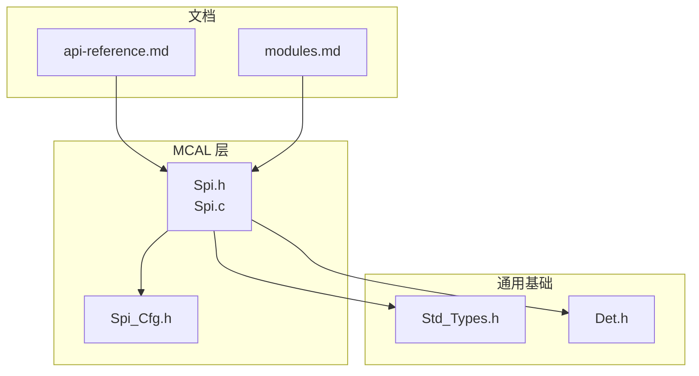
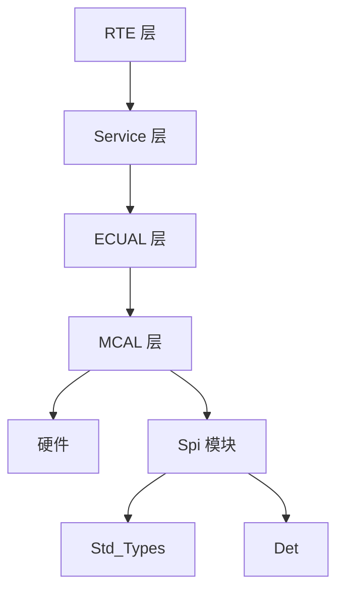
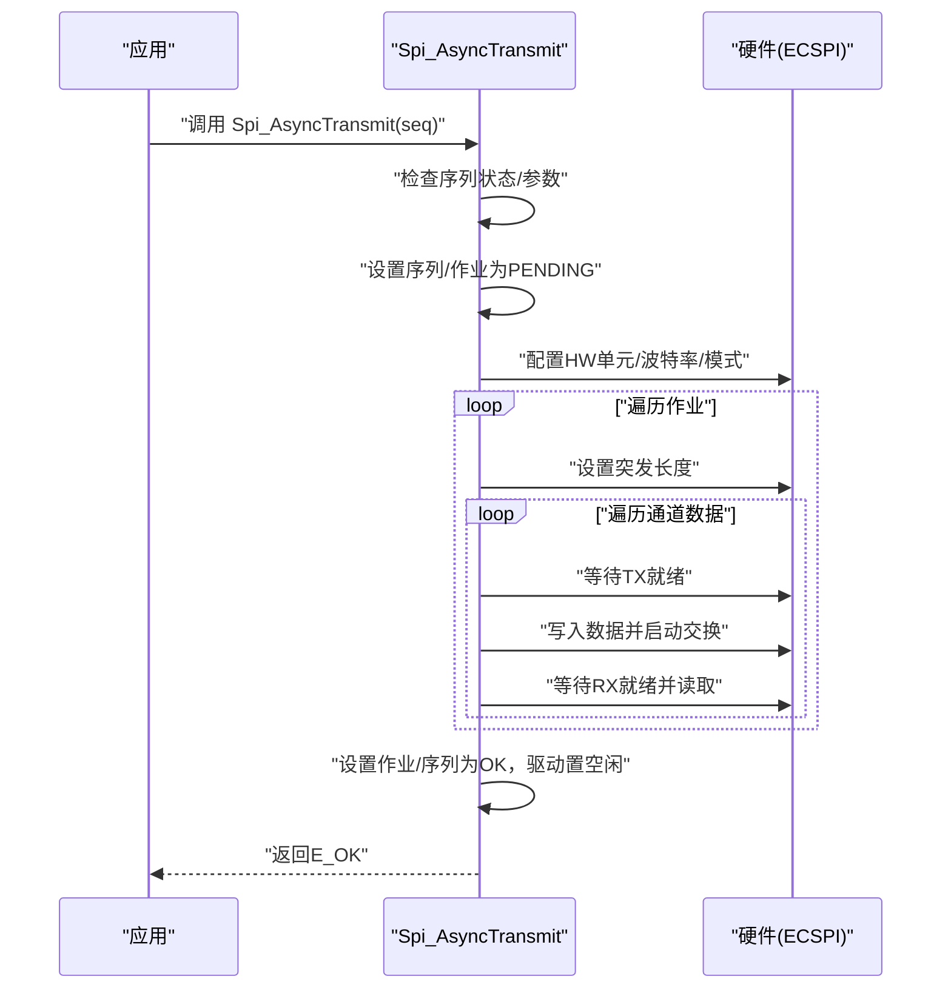
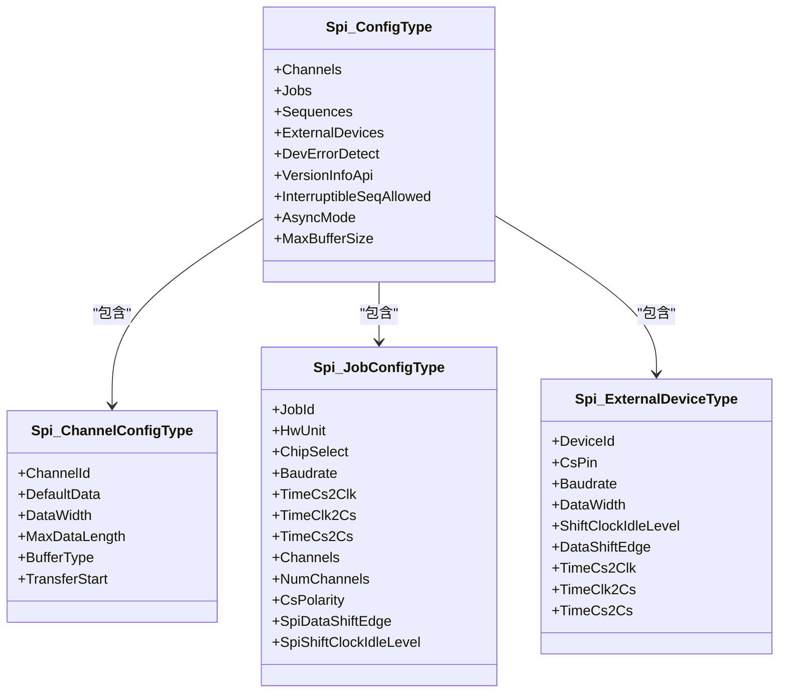

# 串行外设接口(SPI)API

<cite>
**本文引用的文件列表**
- [Spi.h](file://src/bsw/mcal/spi/include/Spi.h)
- [Spi.c](file://src/bsw/mcal/spi/src/Spi.c)
- [Spi_Cfg.h](file://src/bsw/config/templates/Spi_Cfg.h)
- [Std_Types.h](file://src/bsw/common/Std_Types.h)
- [Det.h](file://src/bsw/common/Det.h)
- [api-reference.md](file://docs/api-reference.md)
- [modules.md](file://docs/modules.md)
</cite>

## 目录
1. [简介](#简介)
2. [项目结构](#项目结构)
3. [核心组件](#核心组件)
4. [架构总览](#架构总览)
5. [详细组件分析](#详细组件分析)
6. [依赖关系分析](#依赖关系分析)
7. [性能考虑](#性能考虑)
8. [故障排查指南](#故障排查指南)
9. [结论](#结论)
10. [附录](#附录)

## 简介
本文件为 YuleTech AutoSAR BSW 平台中 SPI（串行外设接口）模块的详细 API 参考文档。内容覆盖 SPI 主机与从机通信的公共接口，包括初始化、数据传输、配置管理、状态查询、取消与版本信息等能力；重点解释 Spi_Init、Spi_WriteIB、Spi_AsyncTransmit 等核心函数的函数签名、参数说明、返回值定义与使用要点，并结合配置模板说明 SPI 传输模式、数据格式、时钟极性与相位设置等关键概念。同时提供同步/异步传输、多设备配置、错误处理、DMA 配置与性能优化的最佳实践指导。

## 项目结构
SPI 模块位于 MCAL 层，遵循 AutoSAR Classic Platform 4.x 标准，采用头文件声明接口、源文件实现硬件寄存器访问与状态管理的方式组织。相关配置通过预编译配置模板进行参数化。

图表来源
- [Spi.h:1-362](file://src/bsw/mcal/spi/include/Spi.h#L1-L362)
- [Spi.c:1-439](file://src/bsw/mcal/spi/src/Spi.c#L1-L439)
- [Spi_Cfg.h:1-93](file://src/bsw/config/templates/Spi_Cfg.h#L1-L93)
- [Std_Types.h:1-117](file://src/bsw/common/Std_Types.h#L1-L117)
- [Det.h:1-76](file://src/bsw/common/Det.h#L1-L76)
- [api-reference.md:1-609](file://docs/api-reference.md#L1-L609)
- [modules.md:1-639](file://docs/modules.md#L1-L639)

章节来源
- [Spi.h:1-362](file://src/bsw/mcal/spi/include/Spi.h#L1-L362)
- [Spi.c:1-439](file://src/bsw/mcal/spi/src/Spi.c#L1-L439)
- [Spi_Cfg.h:1-93](file://src/bsw/config/templates/Spi_Cfg.h#L1-L93)
- [api-reference.md:1-609](file://docs/api-reference.md#L1-L609)
- [modules.md:74-82](file://docs/modules.md#L74-L82)

## 核心组件
- 接口头文件：提供 SPI 驱动对外公开的 API 声明、类型定义、错误码与服务 ID。
- 实现文件：封装硬件寄存器访问、时钟分频计算、模式配置、状态机与错误检测。
- 配置模板：定义通道、作业、序列、外部设备等数量与常量，以及 SPI 传输模式相关宏。
- 基础类型与 DET：提供标准返回类型、版本信息结构与开发错误追踪接口。

章节来源
- [Spi.h:13-362](file://src/bsw/mcal/spi/include/Spi.h#L13-L362)
- [Spi.c:1-439](file://src/bsw/mcal/spi/src/Spi.c#L1-L439)
- [Spi_Cfg.h:1-93](file://src/bsw/config/templates/Spi_Cfg.h#L1-L93)
- [Std_Types.h:1-117](file://src/bsw/common/Std_Types.h#L1-L117)
- [Det.h:1-76](file://src/bsw/common/Det.h#L1-L76)

## 架构总览
SPI 模块在 AutoSAR 分层架构中的定位如下：
- 层次：MCAL（微控制器抽象层）
- 依赖：Std_Types、Det（开发错误检测）
- 硬件：针对 i.MX8M Mini ECSPI 控制器的寄存器映射与配置流程

图表来源
- [modules.md:340-354](file://docs/modules.md#L340-L354)
- [modules.md:608-616](file://docs/modules.md#L608-L616)

## 详细组件分析

### 接口概览与类型定义
- 服务 ID：用于 DET 报告错误时标识具体 API。
- 错误码：涵盖参数校验、重复初始化、未初始化、序列挂起/进行中、硬件错误等。
- 状态类型：驱动状态（未初始化/空闲/忙）、作业结果、序列结果。
- 缓冲类型：内部缓冲与外部缓冲区分。
- 异步模式：轮询与中断模式选择。
- 关键类型：通道、作业、序列、硬件单元、数据长度等。

章节来源
- [Spi.h:42-107](file://src/bsw/mcal/spi/include/Spi.h#L42-L107)
- [Spi.h:110-148](file://src/bsw/mcal/spi/include/Spi.h#L110-L148)
- [Spi.h:150-231](file://src/bsw/mcal/spi/include/Spi.h#L150-L231)

### 核心函数详解

#### Spi_Init
- 函数签名路径：[Spi_Init:131-174](file://src/bsw/mcal/spi/src/Spi.c#L131-L174)
- 功能：初始化 SPI 驱动，配置硬件单元默认状态，清空作业/序列结果，设置驱动状态为空闲。
- 参数：
  - Config：指向配置结构体的指针，包含通道、作业、序列、外部设备等配置数组与数量。
- 返回值：无（无返回值的初始化函数，但内部可能通过 DET 报错）。
- 关键行为：
  - 开启硬件单元时钟（占位实现，当前为空）。
  - 禁用 SPI 控制器，清空状态寄存器。
  - 配置默认控制寄存器与中断/周期寄存器。
  - 初始化作业与序列结果数组。
- 错误处理：当配置为空或重复初始化时，通过 DET 报告错误码。

章节来源
- [Spi.c:131-174](file://src/bsw/mcal/spi/src/Spi.c#L131-L174)
- [Spi.h:250-260](file://src/bsw/mcal/spi/include/Spi.h#L250-L260)

#### Spi_WriteIB
- 函数签名路径：[Spi_WriteIB:203-217](file://src/bsw/mcal/spi/src/Spi.c#L203-L217)
- 功能：向指定通道的内部缓冲写入数据（当前实现为空操作，仅做参数与初始化校验）。
- 参数：
  - Channel：通道编号。
  - DataBufferPtr：指向数据缓冲结构体的指针。
- 返回值：无。
- 注意：当前实现不执行实际写入，仅进行 DET 参数校验。

章节来源
- [Spi.c:203-217](file://src/bsw/mcal/spi/src/Spi.c#L203-L217)
- [Spi.h:262-267](file://src/bsw/mcal/spi/include/Spi.h#L262-L267)

#### Spi_AsyncTransmit
- 函数签名路径：[Spi_AsyncTransmit:219-293](file://src/bsw/mcal/spi/src/Spi.c#L219-L293)
- 功能：异步传输一个序列（Sequence），按序执行序列内的作业，逐通道执行数据交换。
- 参数：
  - Sequence：要传输的序列编号。
- 返回值：Std_ReturnType（E_OK/E_NOT_OK）。
- 关键流程：
  - 序列状态检查（若已在处理则返回失败）。
  - 设置序列与作业状态为“挂起”，驱动状态置为“忙”。
  - 遍历序列中的作业，对每个作业：
    - 配置硬件单元、波特率、模式（时钟极性/相位、片选极性）。
    - 设置突发长度（数据宽度）。
    - 对通道内每个数据项：
      - 等待 TX 就绪，写入数据，启动交换，等待 RX 就绪并读取数据。
  - 完成后设置作业/序列结果为“成功”，驱动状态置为“空闲”。

图表来源
- [Spi.c:219-293](file://src/bsw/mcal/spi/src/Spi.c#L219-L293)

章节来源
- [Spi.c:219-293](file://src/bsw/mcal/spi/src/Spi.c#L219-L293)
- [Spi.h:269-274](file://src/bsw/mcal/spi/include/Spi.h#L269-L274)

#### Spi_ReadIB
- 函数签名路径：[Spi_ReadIB:295-309](file://src/bsw/mcal/spi/src/Spi.c#L295-L309)
- 功能：从指定通道的内部缓冲读取数据（当前实现为空操作，仅做参数与初始化校验）。
- 参数：
  - Channel：通道编号。
  - DataBufferPtr：指向数据缓冲结构体的指针。
- 返回值：无。
- 注意：当前实现不执行实际读取，仅进行 DET 参数校验。

章节来源
- [Spi.c:295-309](file://src/bsw/mcal/spi/src/Spi.c#L295-L309)
- [Spi.h:276-281](file://src/bsw/mcal/spi/include/Spi.h#L276-L281)

#### Spi_SetupEB
- 函数签名路径：[Spi_SetupEB:311-329](file://src/bsw/mcal/spi/src/Spi.c#L311-L329)
- 功能：为指定通道设置外部缓冲（EB）的源/目的缓冲与长度（当前实现为空操作，仅做参数与初始化校验）。
- 参数：
  - Channel：通道编号。
  - SrcDataBufferPtr：源数据缓冲结构体指针。
  - DesDataBufferPtr：目的数据缓冲结构体指针。
  - Length：数据长度。
- 返回值：Std_ReturnType（E_OK/E_NOT_OK）。
- 注意：当前实现不执行实际设置，仅进行 DET 参数校验。

章节来源
- [Spi.c:311-329](file://src/bsw/mcal/spi/src/Spi.c#L311-L329)
- [Spi.h:283-294](file://src/bsw/mcal/spi/include/Spi.h#L283-L294)

#### 其他常用接口
- Spi_DeInit：反初始化，禁用 SPI 控制器并关闭时钟，返回 E_OK/E_NOT_OK。
- Spi_GetStatus：获取驱动状态（未初始化/空闲/忙）。
- Spi_GetJobResult：获取指定作业结果。
- Spi_GetSequenceResult：获取指定序列结果。
- Spi_GetVersionInfo：获取 SPI 模块版本信息。
- Spi_SyncTransmit：同步传输（当前直接委托异步传输）。
- Spi_GetHWUnitStatus：获取硬件单元状态。
- Spi_Cancel：取消指定序列（若处于挂起状态则标记为已取消）。
- Spi_SetAsyncMode：设置异步模式（当前为空操作）。
- Spi_MainFunction_Handling/Driving：主函数（当前为空操作）。

章节来源
- [Spi.c:176-201](file://src/bsw/mcal/spi/src/Spi.c#L176-L201)
- [Spi.c:331-364](file://src/bsw/mcal/spi/src/Spi.c#L331-L364)
- [Spi.c:366-379](file://src/bsw/mcal/spi/src/Spi.c#L366-L379)
- [Spi.c:381-384](file://src/bsw/mcal/spi/src/Spi.c#L381-L384)
- [Spi.c:386-403](file://src/bsw/mcal/spi/src/Spi.c#L386-L403)
- [Spi.c:405-422](file://src/bsw/mcal/spi/src/Spi.c#L405-L422)
- [Spi.c:424-435](file://src/bsw/mcal/spi/src/Spi.c#L424-L435)
- [Spi.h:256-356](file://src/bsw/mcal/spi/include/Spi.h#L256-L356)

### 配置与数据模型

#### 配置模板（Spi_Cfg.h）
- 预编译配置项：开发错误检测、版本信息 API、硬件状态 API、可取消 API、中断允许等。
- 资源数量：通道、作业、序列、硬件单元的数量定义。
- 常量定义：通道/作业/序列 ID、数据宽度、时钟极性/相位、传输起始位、波特率预分频等。

章节来源
- [Spi_Cfg.h:17-92](file://src/bsw/config/templates/Spi_Cfg.h#L17-L92)

#### 配置结构体（Spi_ConfigType）
- 包含通道、作业、序列、外部设备数组及其数量。
- 驱动级开关：错误检测、版本信息 API、是否允许可中断序列、异步模式、最大缓冲大小等。

章节来源
- [Spi.h:214-231](file://src/bsw/mcal/spi/include/Spi.h#L214-L231)

#### 作业配置（Spi_JobConfigType）
- 硬件单元、片选引脚、波特率、时钟极性/相位、片选极性、通道列表与数量等。

章节来源
- [Spi.h:171-187](file://src/bsw/mcal/spi/include/Spi.h#L171-L187)

#### 外部设备配置（Spi_ExternalDeviceType）
- 设备 ID、片选引脚、波特率、数据宽度、时钟极性/相位、片选到时钟/时钟到片选延迟等。

章节来源
- [Spi.h:199-212](file://src/bsw/mcal/spi/include/Spi.h#L199-L212)

### 关键概念与配置说明

#### SPI 传输模式
- 时钟极性（CPOL）与相位（CPHA）：通过作业配置中的时钟空闲电平与数据移位边沿字段设置。
- 片选极性（CS Polarity）：通过作业配置中的片选极性字段设置。
- 传输起始位：支持 LSB 或 MSB，由配置模板提供常量。

章节来源
- [Spi_Cfg.h:67-78](file://src/bsw/config/templates/Spi_Cfg.h#L67-L78)
- [Spi.h:171-187](file://src/bsw/mcal/spi/include/Spi.h#L171-L187)

#### 数据格式与宽度
- 数据宽度支持 8/16/32 位，通过通道配置的 DataWidth 字段设置。
- 突发长度（Burst Length）根据数据宽度动态设置。

章节来源
- [Spi_Cfg.h:60-64](file://src/bsw/config/templates/Spi_Cfg.h#L60-L64)
- [Spi.c:259-263](file://src/bsw/mcal/spi/src/Spi.c#L259-L263)

#### 波特率与时钟分频
- 采用参考时钟与预分频/后分频组合计算目标波特率。
- 当前实现固定参考时钟频率，按公式计算并写入控制寄存器。

章节来源
- [Spi.c:87-106](file://src/bsw/mcal/spi/src/Spi.c#L87-L106)

#### 多设备与多通道
- 通过作业配置中的 Channels 数组与 NumChannels 指定参与本次作业的通道集合。
- 通过序列配置中的 Jobs 数组与 NumJobs 指定参与本次序列的作业集合。

章节来源
- [Spi.h:171-187](file://src/bsw/mcal/spi/include/Spi.h#L171-L187)
- [Spi.h:190-197](file://src/bsw/mcal/spi/include/Spi.h#L190-L197)

### 使用示例与最佳实践

#### 初始化与基本使用
- 初始化：调用 Spi_Init 并传入配置结构体。
- 异步传输：准备序列与作业配置，调用 Spi_AsyncTransmit 执行传输。
- 查询结果：使用 Spi_GetSequenceResult/Spi_GetJobResult 获取结果。
- 取消传输：在序列挂起状态下调用 Spi_Cancel 取消。

章节来源
- [Spi.c:131-174](file://src/bsw/mcal/spi/src/Spi.c#L131-L174)
- [Spi.c:219-293](file://src/bsw/mcal/spi/src/Spi.c#L219-L293)
- [Spi.c:405-422](file://src/bsw/mcal/spi/src/Spi.c#L405-L422)

#### 同步/异步传输
- 同步传输：当前实现直接委托异步传输，返回值与异步一致。
- 异步传输：适合长时延或后台处理场景，需配合状态查询与回调机制。

章节来源
- [Spi.c:381-384](file://src/bsw/mcal/spi/src/Spi.c#L381-L384)

#### 多设备配置
- 通过不同作业配置不同的硬件单元、片选引脚与波特率，实现多设备共用总线的差异化配置。
- 通过序列配置将多个作业按顺序执行，满足复杂设备交互需求。

章节来源
- [Spi.h:171-187](file://src/bsw/mcal/spi/include/Spi.h#L171-L187)
- [Spi.h:190-197](file://src/bsw/mcal/spi/include/Spi.h#L190-L197)

#### 错误处理与 DET
- 所有公共接口均支持参数校验与状态检查，未初始化、参数越界、重复初始化等情况通过 DET 报告错误码。
- 建议在开发阶段开启 SPI_DEV_ERROR_DETECT，生产阶段可根据需求关闭以减少开销。

章节来源
- [Spi.h:63-78](file://src/bsw/mcal/spi/include/Spi.h#L63-L78)
- [Spi.c:133-141](file://src/bsw/mcal/spi/src/Spi.c#L133-L141)
- [Spi.c:205-213](file://src/bsw/mcal/spi/src/Spi.c#L205-L213)

#### DMA 配置与性能优化
- 当前实现未启用 DMA，所有数据通过寄存器轮询方式传输。
- 若需要更高吞吐量与更低 CPU 占用，可在硬件支持的前提下扩展 DMA 配置与中断处理逻辑，结合异步模式提升并发能力。
- 优化建议：
  - 合理设置波特率与突发长度，避免频繁切换。
  - 将多个小数据合并为批量传输，减少启动/停止开销。
  - 使用中断模式替代轮询，降低 CPU 等待时间。

章节来源
- [Spi.c:267-282](file://src/bsw/mcal/spi/src/Spi.c#L267-L282)
- [Spi.c:424-427](file://src/bsw/mcal/spi/src/Spi.c#L424-L427)

## 依赖关系分析

图表来源
- [Spi.h:150-231](file://src/bsw/mcal/spi/include/Spi.h#L150-L231)

章节来源
- [Spi.h:150-231](file://src/bsw/mcal/spi/include/Spi.h#L150-L231)

## 性能考虑
- 轮询 vs 中断：当前实现为轮询等待 TX/RX 就绪，CPU 占用较高；建议在具备中断与 DMA 的平台上采用中断/ DMA 方案。
- 波特率与分频：合理设置波特率与分频，避免过高的 CPU 频率导致功耗增加。
- 批量传输：合并小数据为批量传输，减少启动/停止次数。
- 突发长度：根据数据宽度设置合适的突发长度，提高吞吐量。

## 故障排查指南
- 未初始化错误：调用任何 SPI 接口前必须先调用 Spi_Init。
- 参数越界：检查通道/作业/序列/硬件单元编号是否在配置范围内。
- 重复初始化：确保只调用一次 Spi_Init。
- 序列挂起：在序列处于挂起状态时调用 Spi_AsyncTransmit 将返回失败。
- 取消无效：仅在序列挂起时调用 Spi_Cancel 才会生效。
- 硬件错误：若底层硬件异常，可能触发硬件错误码。

章节来源
- [Spi.h:63-78](file://src/bsw/mcal/spi/include/Spi.h#L63-L78)
- [Spi.c:133-141](file://src/bsw/mcal/spi/src/Spi.c#L133-L141)
- [Spi.c:232-234](file://src/bsw/mcal/spi/src/Spi.c#L232-L234)
- [Spi.c:417-421](file://src/bsw/mcal/spi/src/Spi.c#L417-L421)

## 结论
SPI 模块提供了符合 AutoSAR 标准的主机通信接口，支持多设备、多通道、多作业与多序列的灵活配置。当前实现以轮询方式完成数据交换，具备良好的可移植性与可配置性；在需要更高性能与更低 CPU 占用的场景下，可扩展 DMA 与中断机制。通过 DET 的参数校验与状态查询接口，开发者可以快速定位问题并构建稳定可靠的 SPI 通信链路。

## 附录

### API 一览（按功能分类）
- 初始化与去初始化
  - [Spi_Init:131-174](file://src/bsw/mcal/spi/src/Spi.c#L131-L174)
  - [Spi_DeInit:176-201](file://src/bsw/mcal/spi/src/Spi.c#L176-L201)
- 数据传输
  - [Spi_WriteIB:203-217](file://src/bsw/mcal/spi/src/Spi.c#L203-L217)
  - [Spi_ReadIB:295-309](file://src/bsw/mcal/spi/src/Spi.c#L295-L309)
  - [Spi_AsyncTransmit:219-293](file://src/bsw/mcal/spi/src/Spi.c#L219-L293)
  - [Spi_SyncTransmit:381-384](file://src/bsw/mcal/spi/src/Spi.c#L381-L384)
- 缓冲设置
  - [Spi_SetupEB:311-329](file://src/bsw/mcal/spi/src/Spi.c#L311-L329)
- 状态与结果
  - [Spi_GetStatus:331-334](file://src/bsw/mcal/spi/src/Spi.c#L331-L334)
  - [Spi_GetJobResult:336-349](file://src/bsw/mcal/spi/src/Spi.c#L336-L349)
  - [Spi_GetSequenceResult:351-364](file://src/bsw/mcal/spi/src/Spi.c#L351-L364)
  - [Spi_GetHWUnitStatus:386-403](file://src/bsw/mcal/spi/src/Spi.c#L386-L403)
- 取消与模式
  - [Spi_Cancel:405-422](file://src/bsw/mcal/spi/src/Spi.c#L405-L422)
  - [Spi_SetAsyncMode:424-427](file://src/bsw/mcal/spi/src/Spi.c#L424-L427)
- 主函数
  - [Spi_MainFunction_Handling:429-431](file://src/bsw/mcal/spi/src/Spi.c#L429-L431)
  - [Spi_MainFunction_Driving:433-435](file://src/bsw/mcal/spi/src/Spi.c#L433-L435)
- 版本信息
  - [Spi_GetVersionInfo:366-379](file://src/bsw/mcal/spi/src/Spi.c#L366-L379)

### 关键数据结构与类型
- 配置结构体：[Spi_ConfigType:214-231](file://src/bsw/mcal/spi/include/Spi.h#L214-L231)
- 作业配置：[Spi_JobConfigType:171-187](file://src/bsw/mcal/spi/include/Spi.h#L171-L187)
- 通道配置：[Spi_ChannelConfigType:160-169](file://src/bsw/mcal/spi/include/Spi.h#L160-L169)
- 外部设备配置：[Spi_ExternalDeviceType:199-212](file://src/bsw/mcal/spi/include/Spi.h#L199-L212)
- 标准类型与返回值：[Std_Types.h:23-41](file://src/bsw/common/Std_Types.h#L23-L41)