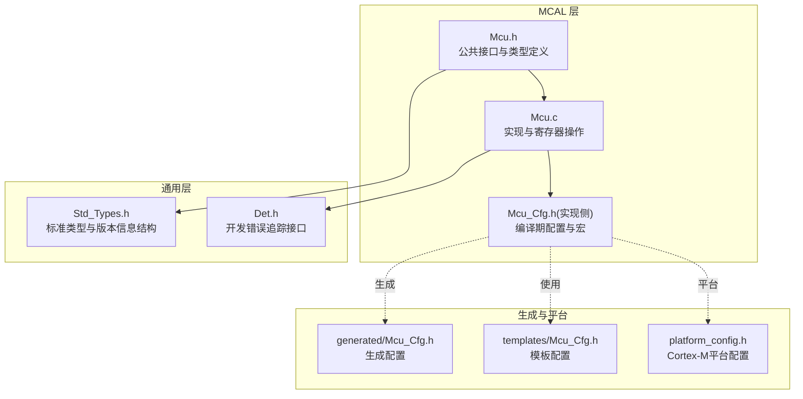
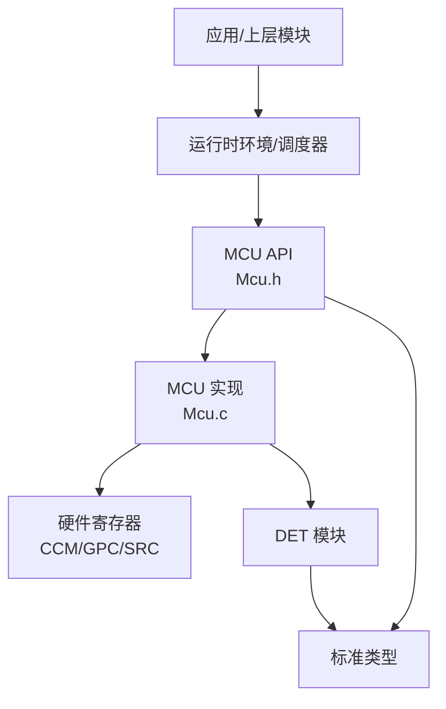
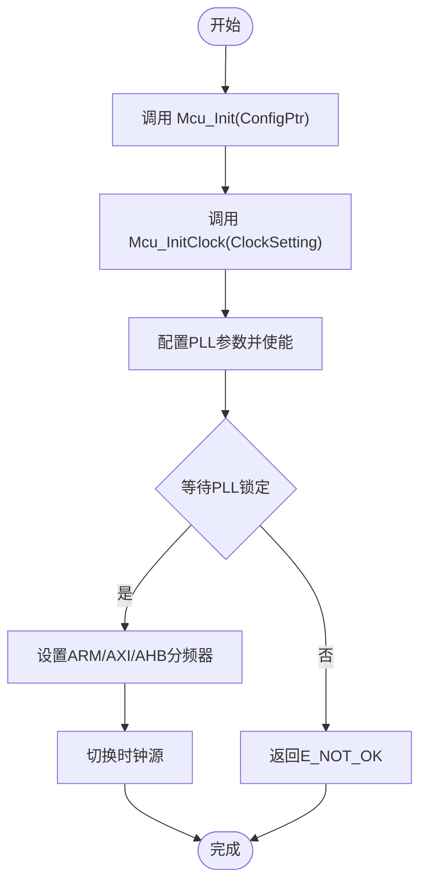
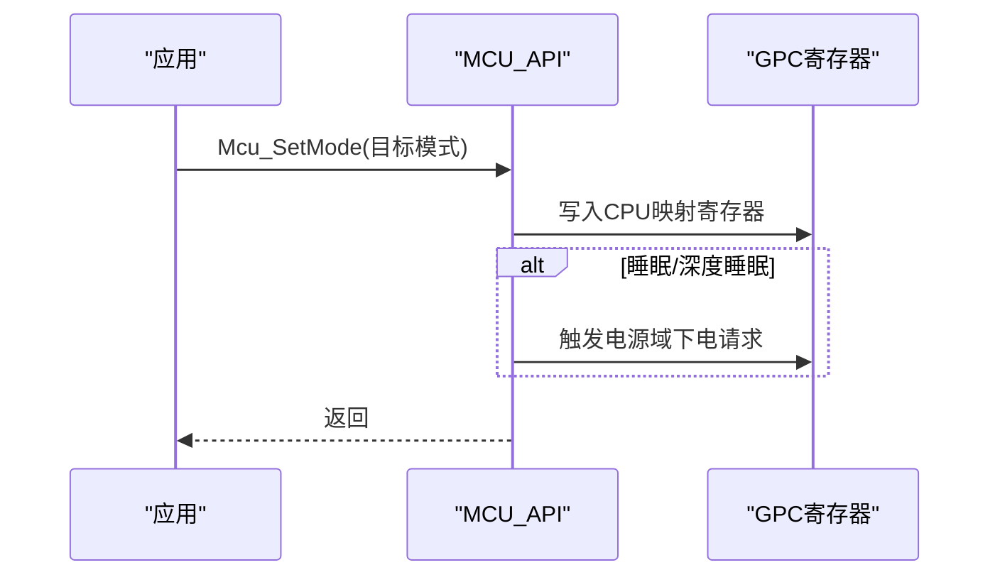
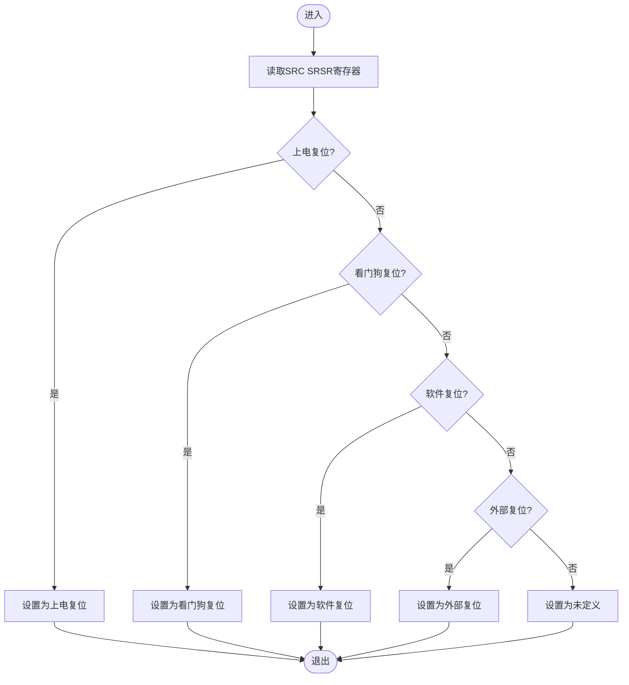
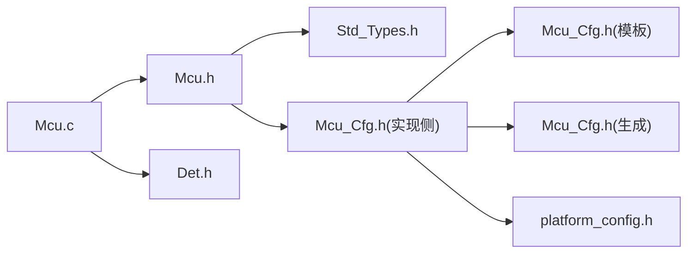

# 微控制器驱动(MCU)API

<cite>
**本文引用的文件**
- [Mcu.h](file://src/bsw/mcal/mcu/include/Mcu.h)
- [Mcu.c](file://src/bsw/mcal/mcu/src/Mcu.c)
- [Mcu_Cfg.h（官方模板）](file://src/bsw/config/templates/Mcu_Cfg.h)
- [Mcu_Cfg.h（生成配置）](file://generated/Mcu_Cfg.h)
- [Mcu_Cfg.h（实现侧）](file://src/bsw/mcal/mcu/include/Mcu_Cfg.h)
- [Std_Types.h](file://src/bsw/common/Std_Types.h)
- [Det.h](file://src/bsw/common/Det.h)
- [platform_config.h](file://platform/cortex-m/platform_config.h)
- [test_mcu.c](file://tests/unit/test_mcu.c)
- [main.c（LED闪烁示例）](file://examples/led_blink/main.c)
</cite>

## 目录
1. [简介](#简介)
2. [项目结构](#项目结构)
3. [核心组件](#核心组件)
4. [架构总览](#架构总览)
5. [详细组件分析](#详细组件分析)
6. [依赖关系分析](#依赖关系分析)
7. [性能考虑](#性能考虑)
8. [故障排查指南](#故障排查指南)
9. [结论](#结论)
10. [附录](#附录)

## 简介
本文件为微控制器驱动(MCU)模块的详细API参考文档，覆盖初始化、时钟配置、复位管理与低功耗模式控制等核心能力。重点解释以下函数的函数签名、参数说明、返回值定义与使用要点：Mcu_Init、Mcu_InitClock、Mcu_DistributePllClock、Mcu_SetMode；并说明时钟配置结构体、复位原因枚举、PLL状态管理等关键数据类型。同时提供完整的硬件初始化流程、时钟系统配置与电源管理模式的实际应用示例路径，以及错误码定义、API服务ID、版本信息获取等技术细节。

## 项目结构
MCU模块位于BSW（基础软件）层的MCAL（微控制器抽象层），采用AutoSAR标准类型与错误检测机制，配合平台配置与生成配置共同完成目标平台适配。

**图表来源**
- [Mcu.h:13-239](file://src/bsw/mcal/mcu/include/Mcu.h#L13-L239)
- [Mcu.c:14-547](file://src/bsw/mcal/mcu/src/Mcu.c#L14-L547)
- [Mcu_Cfg.h（实现侧）:15-82](file://src/bsw/mcal/mcu/include/Mcu_Cfg.h#L15-L82)
- [Mcu_Cfg.h（生成配置）:1-19](file://generated/Mcu_Cfg.h#L1-L19)
- [Mcu_Cfg.h（官方模板）:1-69](file://src/bsw/config/templates/Mcu_Cfg.h#L1-L69)
- [Std_Types.h:11-117](file://src/bsw/common/Std_Types.h#L11-L117)
- [Det.h:11-76](file://src/bsw/common/Det.h#L11-L76)
- [platform_config.h:12-307](file://platform/cortex-m/platform_config.h#L12-L307)

**章节来源**
- [Mcu.h:13-239](file://src/bsw/mcal/mcu/include/Mcu.h#L13-L239)
- [Mcu.c:14-547](file://src/bsw/mcal/mcu/src/Mcu.c#L14-L547)
- [Mcu_Cfg.h（实现侧）:15-82](file://src/bsw/mcal/mcu/include/Mcu_Cfg.h#L15-L82)
- [Mcu_Cfg.h（生成配置）:1-19](file://generated/Mcu_Cfg.h#L1-L19)
- [Mcu_Cfg.h（官方模板）:1-69](file://src/bsw/config/templates/Mcu_Cfg.h#L1-L69)
- [Std_Types.h:11-117](file://src/bsw/common/Std_Types.h#L11-L117)
- [Det.h:11-76](file://src/bsw/common/Det.h#L11-L76)
- [platform_config.h:12-307](file://platform/cortex-m/platform_config.h#L12-L307)

## 核心组件
- 接口与类型定义：位于公共头文件，暴露所有对外API、错误码、服务ID、版本信息结构体与关键数据类型（时钟、复位、模式、PLL状态等）。
- 实现与寄存器操作：在源文件中实现具体逻辑，包括时钟配置、PLL分频/倍频、时钟分发、模式切换、复位原因读取与执行复位等。
- 配置与平台：通过编译期配置与生成配置控制功能开关、时钟频率、模式数量、复位原因映射等；平台配置提供Cortex-M系列特性与内存/中断基地址等。

**章节来源**
- [Mcu.h:134-230](file://src/bsw/mcal/mcu/include/Mcu.h#L134-L230)
- [Mcu.c:249-488](file://src/bsw/mcal/mcu/src/Mcu.c#L249-L488)
- [Mcu_Cfg.h（实现侧）:15-82](file://src/bsw/mcal/mcu/include/Mcu_Cfg.h#L15-L82)

## 架构总览
MCU模块遵循AutoSAR分层架构，MCAL层直接操作硬件寄存器，向上提供统一接口，向下依赖标准类型与错误检测模块。

**图表来源**
- [Mcu.h:134-230](file://src/bsw/mcal/mcu/include/Mcu.h#L134-L230)
- [Mcu.c:249-488](file://src/bsw/mcal/mcu/src/Mcu.c#L249-L488)
- [Det.h:59-70](file://src/bsw/common/Det.h#L59-L70)
- [Std_Types.h:40-80](file://src/bsw/common/Std_Types.h#L40-L80)

## 详细组件分析

### API 服务ID与错误码
- 服务ID：用于DET报告错误时标识调用API。
- 错误码：涵盖参数无效、未初始化、PLL未锁定、初始化失败等场景。

**章节来源**
- [Mcu.h:34-52](file://src/bsw/mcal/mcu/include/Mcu.h#L34-L52)
- [Mcu.c:254-264](file://src/bsw/mcal/mcu/src/Mcu.c#L254-L264)

### 数据类型与配置结构
- 时钟类型、复位原始值、模式类型、状态类型、PLL状态类型、复位原因类型、配置类型、版本信息类型等。
- 配置类型包含时钟设置、目标频率、PLL倍频/分频系数与使能标志等字段。

**章节来源**
- [Mcu.h:57-110](file://src/bsw/mcal/mcu/include/Mcu.h#L57-L110)
- [Mcu_Cfg.h（实现侧）:15-82](file://src/bsw/mcal/mcu/include/Mcu_Cfg.h#L15-L82)

### Mcu_Init 初始化
- 功能：初始化MCU驱动，可选进行RAM段初始化。
- 参数：指向配置结构的指针；若为NULL则按默认配置处理。
- 返回：E_OK/E_NOT_OK。
- 前置条件：模块必须处于未初始化状态。
- 后置条件：模块进入时钟未初始化状态。

**章节来源**
- [Mcu.h:134-148](file://src/bsw/mcal/mcu/include/Mcu.h#L134-L148)
- [Mcu.c:252-280](file://src/bsw/mcal/mcu/src/Mcu.c#L252-L280)

### Mcu_InitClock 时钟初始化
- 功能：根据配置设置初始化时钟系统，必要时配置并等待PLL锁定。
- 参数：时钟配置索引。
- 返回：E_OK/E_NOT_OK。
- 前置条件：模块已初始化；配置索引有效。
- 后置条件：时钟系统完成配置。

**章节来源**
- [Mcu.h:150-163](file://src/bsw/mcal/mcu/include/Mcu.h#L150-L163)
- [Mcu.c:285-310](file://src/bsw/mcal/mcu/src/Mcu.c#L285-L310)

### Mcu_DistributePllClock 分发PLL时钟
- 功能：启用系统时钟分发至各外设。
- 返回：E_OK/E_NOT_OK。
- 前置条件：模块已初始化且当前时钟配置有效。
- 后置条件：系统时钟切换到PLL输出。

**章节来源**
- [Mcu.h:165-175](file://src/bsw/mcal/mcu/include/Mcu.h#L165-L175)
- [Mcu.c:315-333](file://src/bsw/mcal/mcu/src/Mcu.c#L315-L333)

### Mcu_GetPllStatus 获取PLL状态
- 功能：查询PLL是否锁定。
- 返回：PLL状态枚举。
- 前置条件：模块已初始化。
- 后置条件：无。

**章节来源**
- [Mcu.h:177-182](file://src/bsw/mcal/mcu/include/Mcu.h#L177-L182)
- [Mcu.c:338-362](file://src/bsw/mcal/mcu/src/Mcu.c#L338-L362)

### Mcu_SetMode 设置模式
- 功能：设置MCU运行模式（正常/睡眠/深度睡眠）。
- 参数：目标模式枚举。
- 前置条件：模块已初始化且模式索引有效。
- 后置条件：MCU进入目标模式。

**章节来源**
- [Mcu.h:184-194](file://src/bsw/mcal/mcu/include/Mcu.h#L184-L194)
- [Mcu.c:367-406](file://src/bsw/mcal/mcu/src/Mcu.c#L367-L406)

### Mcu_GetResetReason 获取复位原因
- 功能：读取并返回复位原因枚举。
- 返回：复位原因枚举。
- 前置条件：模块已初始化。
- 后置条件：寄存器状态被读取（部分平台可能清零）。

**章节来源**
- [Mcu.h:196-203](file://src/bsw/mcal/mcu/include/Mcu.h#L196-L203)
- [Mcu.c:411-425](file://src/bsw/mcal/mcu/src/Mcu.c#L411-L425)

### Mcu_GetResetRawValue 获取复位原始值
- 功能：读取复位寄存器原始值。
- 返回：原始值。
- 前置条件：模块已初始化。

**章节来源**
- [Mcu.h:205-210](file://src/bsw/mcal/mcu/include/Mcu.h#L205-L210)
- [Mcu.c:430-444](file://src/bsw/mcal/mcu/src/Mcu.c#L430-L444)

### Mcu_PerformReset 执行系统复位
- 功能：触发软件复位。
- 前置条件：模块已初始化。
- 后置条件：系统复位（该函数不返回）。

**章节来源**
- [Mcu.h:212-220](file://src/bsw/mcal/mcu/include/Mcu.h#L212-L220)
- [Mcu.c:449-467](file://src/bsw/mcal/mcu/src/Mcu.c#L449-L467)

### Mcu_GetVersionInfo 获取版本信息
- 功能：填充版本信息结构体。
- 参数：指向版本信息结构的指针；若为NULL则报告开发错误。
- 前置条件：模块已初始化。

**章节来源**
- [Mcu.h:222-229](file://src/bsw/mcal/mcu/include/Mcu.h#L222-L229)
- [Mcu.c:472-488](file://src/bsw/mcal/mcu/src/Mcu.c#L472-L488)

### 关键数据类型详解
- 时钟类型：用于选择时钟配置索引。
- 复位原始值类型：用于读取寄存器原始值。
- 模式类型：用于选择运行模式。
- 状态类型：描述模块内部状态机。
- PLL状态类型：描述PLL锁定状态。
- 复位原因类型：描述复位来源。
- 配置类型：包含时钟设置、目标频率、PLL参数与使能标志。
- 版本信息类型：包含供应商ID、模块ID与软件版本号。

**章节来源**
- [Mcu.h:57-110](file://src/bsw/mcal/mcu/include/Mcu.h#L57-L110)

### 时钟系统配置流程图

**图表来源**
- [Mcu.c:92-124](file://src/bsw/mcal/mcu/src/Mcu.c#L92-L124)
- [Mcu.c:129-165](file://src/bsw/mcal/mcu/src/Mcu.c#L129-L165)
- [Mcu.c:191-212](file://src/bsw/mcal/mcu/src/Mcu.c#L191-L212)

### 电源管理模式序列图

**图表来源**
- [Mcu.c:382-403](file://src/bsw/mcal/mcu/src/Mcu.c#L382-L403)

### 复位原因读取流程图

**图表来源**
- [Mcu.c:217-241](file://src/bsw/mcal/mcu/src/Mcu.c#L217-L241)

## 依赖关系分析
- 类型依赖：MCU API依赖标准类型与版本信息结构。
- 错误检测：在启用开发错误检测时，API在前置条件不满足时通过DET报告错误。
- 配置依赖：编译期配置决定功能可用性（如PLL、版本信息API、复位API等）。
- 平台依赖：寄存器基址与平台特性由平台配置提供。

**图表来源**
- [Mcu.h:19-20](file://src/bsw/mcal/mcu/include/Mcu.h#L19-L20)
- [Mcu.c:17-20](file://src/bsw/mcal/mcu/src/Mcu.c#L17-L20)
- [Mcu_Cfg.h（实现侧）:15-82](file://src/bsw/mcal/mcu/include/Mcu_Cfg.h#L15-L82)
- [Mcu_Cfg.h（官方模板）:15-25](file://src/bsw/config/templates/Mcu_Cfg.h#L15-L25)
- [Mcu_Cfg.h（生成配置）:10-18](file://generated/Mcu_Cfg.h#L10-L18)
- [platform_config.h:12-307](file://platform/cortex-m/platform_config.h#L12-L307)
- [Det.h:59-70](file://src/bsw/common/Det.h#L59-L70)

**章节来源**
- [Mcu.h:19-20](file://src/bsw/mcal/mcu/include/Mcu.h#L19-L20)
- [Mcu.c:17-20](file://src/bsw/mcal/mcu/src/Mcu.c#L17-L20)
- [Mcu_Cfg.h（实现侧）:15-82](file://src/bsw/mcal/mcu/include/Mcu_Cfg.h#L15-L82)
- [Mcu_Cfg.h（官方模板）:15-25](file://src/bsw/config/templates/Mcu_Cfg.h#L15-L25)
- [Mcu_Cfg.h（生成配置）:10-18](file://generated/Mcu_Cfg.h#L10-L18)
- [platform_config.h:12-307](file://platform/cortex-m/platform_config.h#L12-L307)
- [Det.h:59-70](file://src/bsw/common/Det.h#L59-L70)

## 性能考虑
- 超时控制：PLL锁定与时钟切换过程包含超时保护，避免无限等待。
- 中断与寄存器访问：通过平台提供的内联汇编指令实现高效寄存器读写。
- 功能开关：编译期配置可裁剪不使用的API，减少代码体积与运行开销。

**章节来源**
- [Mcu.c:45-46](file://src/bsw/mcal/mcu/src/Mcu.c#L45-L46)
- [platform_config.h:206-229](file://platform/cortex-m/platform_config.h#L206-L229)
- [Mcu_Cfg.h（实现侧）:15-21](file://src/bsw/mcal/mcu/include/Mcu_Cfg.h#L15-L21)

## 故障排查指南
- 未初始化错误：在模块未初始化状态下调用API会触发DET错误报告。
- 参数非法：传入NULL指针或越界索引将触发相应错误码。
- PLL未锁定：在尝试分发PLL时若PLL未锁定，返回非OK状态。
- 复位原因读取：确保模块已初始化后再读取复位寄存器。

**章节来源**
- [Mcu.c:254-264](file://src/bsw/mcal/mcu/src/Mcu.c#L254-L264)
- [Mcu.c:317-327](file://src/bsw/mcal/mcu/src/Mcu.c#L317-L327)
- [Mcu.c:415-420](file://src/bsw/mcal/mcu/src/Mcu.c#L415-L420)
- [test_mcu.c:36-44](file://tests/unit/test_mcu.c#L36-L44)

## 结论
MCU模块提供了完整的微控制器初始化、时钟配置、复位管理与低功耗模式控制能力，接口清晰、错误处理完善，并通过配置与平台适配支持多平台部署。建议在系统启动早期调用初始化与时钟初始化API，并在需要时启用DET进行开发阶段的错误诊断。

## 附录

### API清单与说明摘要
- Mcu_Init：初始化驱动，支持RAM段初始化。
- Mcu_InitClock：按配置初始化时钟，等待PLL锁定。
- Mcu_DistributePllClock：启用系统时钟分发。
- Mcu_GetPllStatus：查询PLL锁定状态。
- Mcu_SetMode：设置运行模式（正常/睡眠/深度睡眠）。
- Mcu_GetResetReason：读取复位原因。
- Mcu_GetResetRawValue：读取复位寄存器原始值。
- Mcu_PerformReset：触发系统复位。
- Mcu_GetVersionInfo：获取版本信息。

**章节来源**
- [Mcu.h:134-230](file://src/bsw/mcal/mcu/include/Mcu.h#L134-L230)

### 配置与平台要点
- 编译期配置：控制功能开关、时钟频率、模式数量、复位原因映射等。
- 生成配置：由工具链生成，包含目标时钟频率与核心数等。
- 平台配置：提供Cortex-M系列特性、内存基址与中断控制器寄存器基址等。

**章节来源**
- [Mcu_Cfg.h（实现侧）:15-82](file://src/bsw/mcal/mcu/include/Mcu_Cfg.h#L15-L82)
- [Mcu_Cfg.h（官方模板）:15-68](file://src/bsw/config/templates/Mcu_Cfg.h#L15-L68)
- [Mcu_Cfg.h（生成配置）:10-18](file://generated/Mcu_Cfg.h#L10-L18)
- [platform_config.h:12-307](file://platform/cortex-m/platform_config.h#L12-L307)

### 示例与测试参考
- LED闪烁示例展示了MCU初始化与复位调用的基本流程。
- 单元测试验证了初始化、版本信息获取、未初始化状态下的错误行为等。

**章节来源**
- [main.c（LED闪烁示例）:61-99](file://examples/led_blink/main.c#L61-L99)
- [test_mcu.c:19-34](file://tests/unit/test_mcu.c#L19-L34)
- [test_mcu.c:60-83](file://tests/unit/test_mcu.c#L60-L83)
- [test_mcu.c:85-112](file://tests/unit/test_mcu.c#L85-L112)
- [test_mcu.c:114-144](file://tests/unit/test_mcu.c#L114-L144)
- [test_mcu.c:146-157](file://tests/unit/test_mcu.c#L146-L157)
- [test_mcu.c:159-170](file://tests/unit/test_mcu.c#L159-L170)
- [test_mcu.c:172-188](file://tests/unit/test_mcu.c#L172-L188)