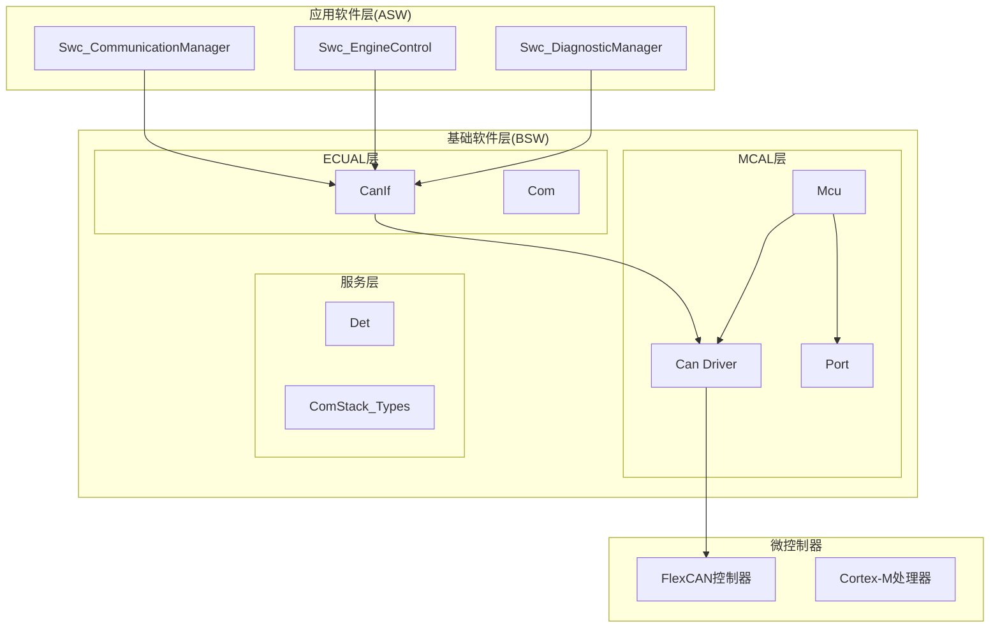
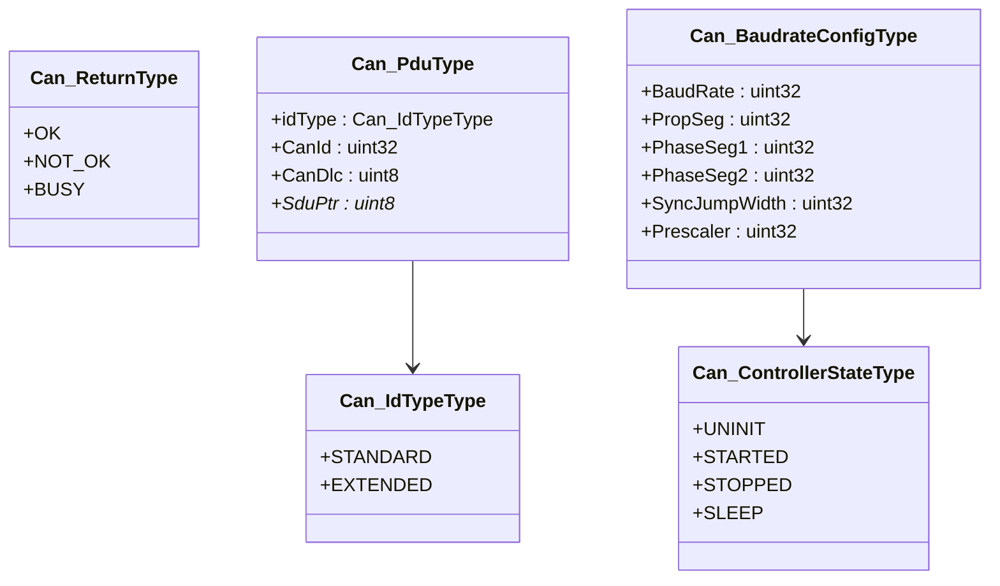
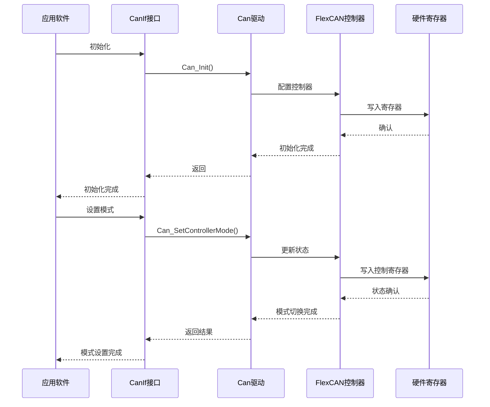
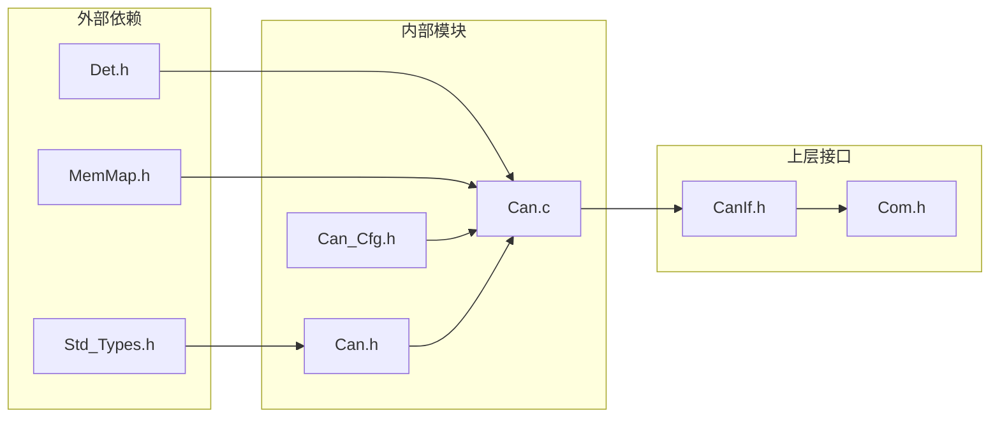
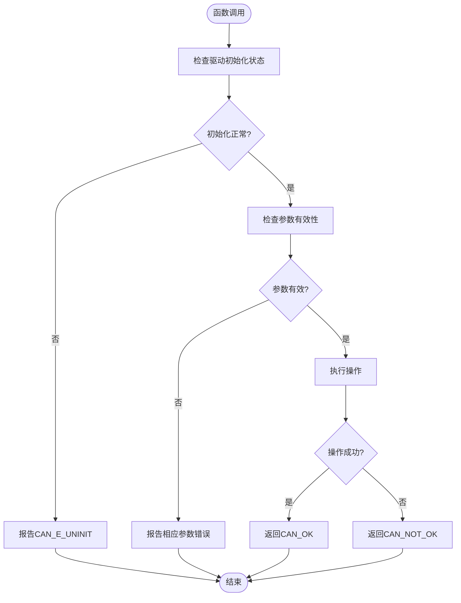

# 控制器局域网(CAN)API

<cite>
**本文档引用的文件**
- [Can.h](file://src/bsw/mcal/can/include/Can.h)
- [Can.c](file://src/bsw/mcal/can/src/Can.c)
- [Can_Cfg.h](file://src/bsw/mcal/can/include/Can_Cfg.h)
- [Std_Types.h](file://src/bsw/os/include/Std_Types.h)
- [Det.h](file://src/bsw/services/det/include/Det.h)
- [CanIf.h](file://src/bsw/ecual/canif/include/CanIf.h)
- [Com.h](file://src/bsw/services/com/include/Com.h)
- [main.c](file://examples/can_demo/main.c)
- [Can_Cfg.h](file://generated/Can_Cfg.h)
- [Can_Cfg.h](file://src/bsw/config/templates/Can_Cfg.h)
- [CanIf_Cfg.h](file://src/bsw/config/templates/CanIf_Cfg.h)
</cite>

## 目录
1. [简介](#简介)
2. [项目结构](#项目结构)
3. [核心组件](#核心组件)
4. [架构概览](#架构概览)
5. [详细组件分析](#详细组件分析)
6. [依赖关系分析](#依赖关系分析)
7. [性能考虑](#性能考虑)
8. [故障排除指南](#故障排除指南)
9. [结论](#结论)
10. [附录](#附录)

## 简介

本文件为控制器局域网(CAN)模块的详细API参考文档。该模块遵循AUTOSAR经典平台4.x标准，实现了MCAL层的CAN驱动程序，支持双控制器架构和灵活的消息缓冲区管理。文档全面记录了CAN控制器配置和通信的所有公共接口，包括初始化、发送、接收、过滤器配置等功能。

该实现基于i.MX8M Mini的FlexCAN控制器，提供了完整的CAN通信解决方案，包括错误检测、中断处理、波特率配置和硬件对象管理等核心功能。

## 项目结构

CAN模块位于BSW(基础软件)层的MCAL子层中，采用AutoSAR分层架构设计：



**图表来源**
- [Can.h:1-269](file://src/bsw/mcal/can/include/Can.h#L1-L269)
- [Can.c:1-463](file://src/bsw/mcal/can/src/Can.c#L1-L463)

**章节来源**
- [Can.h:1-269](file://src/bsw/mcal/can/include/Can.h#L1-L269)
- [Can.c:1-463](file://src/bsw/mcal/can/src/Can.c#L1-L463)

## 核心组件

### CAN驱动接口

CAN驱动提供了完整的AutoSAR MCAL接口，包括以下核心功能：

- **初始化管理**: 配置控制器状态和硬件资源
- **通信控制**: 发送和接收CAN消息
- **状态监控**: 轮询模式下的主函数处理
- **中断管理**: 可选的中断驱动模式
- **错误处理**: 完整的错误检测和报告机制

### 关键数据类型

系统定义了多种关键数据类型来支持CAN通信：



**图表来源**
- [Can.h:76-174](file://src/bsw/mcal/can/include/Can.h#L76-L174)

**章节来源**
- [Can.h:76-174](file://src/bsw/mcal/can/include/Can.h#L76-L174)
- [Std_Types.h:1-117](file://src/bsw/os/include/Std_Types.h#L1-L117)

## 架构概览

CAN模块采用分层架构设计，确保了良好的模块化和可移植性：



**图表来源**
- [Can.c:126-200](file://src/bsw/mcal/can/src/Can.c#L126-L200)
- [CanIf.h:272-297](file://src/bsw/ecual/canif/include/CanIf.h#L272-L297)

## 详细组件分析

### Can_Init函数

Can_Init是CAN驱动的初始化入口点，负责配置所有硬件资源和控制器状态。

**函数原型**
```c
void Can_Init(const Can_ConfigType* Config);
```

**参数说明**
- `Config`: 指向配置结构体的指针，包含所有控制器和硬件对象的配置信息

**返回值**
- 无直接返回值，通过DET进行错误报告

**处理流程**
1. 参数验证和错误检测
2. 初始化控制器状态数组
3. 遍历所有控制器进行配置
4. 启用时钟和进入冻结模式
5. 配置最大消息缓冲区数量
6. 设置位定时参数
7. 初始化消息缓冲区
8. 配置中断掩码（如需要）
9. 设置初始状态为STOPPED

**章节来源**
- [Can.h:193-197](file://src/bsw/mcal/can/include/Can.h#L193-L197)
- [Can.c:126-200](file://src/bsw/mcal/can/src/Can.c#L126-L200)

### Can_Write函数

Can_Write用于向CAN总线发送消息，支持标准和扩展格式的CAN ID。

**函数原型**
```c
Can_ReturnType Can_Write(Can_HwHandleType Hth, const Can_PduType* PduInfo);
```

**参数说明**
- `Hth`: 硬件传输句柄，标识要使用的传输缓冲区
- `PduInfo`: 指向PDU信息结构体的指针，包含消息ID、数据长度和数据内容

**返回值**
- `CAN_OK`: 消息发送成功
- `CAN_NOT_OK`: 发送失败
- `CAN_BUSY`: 缓冲区忙，无法发送

**处理流程**
1. 错误检测和参数验证
2. 计算控制器和消息缓冲区索引
3. 检查消息缓冲区可用性
4. 根据ID类型写入标准或扩展ID
5. 将数据写入消息缓冲区的两个数据字
6. 设置控制状态寄存器（激活传输）
7. 返回操作结果

**章节来源**
- [Can.h:225-231](file://src/bsw/mcal/can/include/Can.h#L225-L231)
- [Can.c:314-368](file://src/bsw/mcal/can/src/Can.c#L314-L368)

### Can_Read函数

系统提供了轮询模式下的接收处理函数，用于检查和处理接收到的消息。

**函数原型**
```c
void Can_MainFunction_Read(void);
```

**处理流程**
1. 遍历所有已启动的控制器
2. 检查中断标志寄存器
3. 对于每个已设置的接收标志：
   - 读取消息缓冲区数据
   - 清除中断标志
   - 调用上层回调函数通知接收完成

**章节来源**
- [Can.h:238-241](file://src/bsw/mcal/can/include/Can.h#L238-L241)
- [Can.c:390-409](file://src/bsw/mcal/can/src/Can.c#L390-L409)

### Can_SetControllerMode函数

用于设置CAN控制器的工作模式。

**函数原型**
```c
Can_ReturnType Can_SetControllerMode(uint8 Controller, Can_ControllerStateType Transition);
```

**支持的模式**
- `CAN_CS_STARTED`: 启动模式，允许发送和接收
- `CAN_CS_STOPPED`: 停止模式，禁用所有通信
- `CAN_CS_SLEEP`: 睡眠模式（当前实现不支持）

**处理流程**
1. 验证驱动初始化状态和控制器参数
2. 根据目标模式执行相应的状态转换
3. 更新控制器状态寄存器
4. 等待状态转换完成
5. 返回操作结果

**章节来源**
- [Can.h:205-211](file://src/bsw/mcal/can/include/Can.h#L205-L211)
- [Can.c:217-271](file://src/bsw/mcal/can/src/Can.c#L217-L271)

### 关键数据类型详解

#### Can_IdTypeType
定义CAN消息ID的类型：
- `CAN_ID_TYPE_STANDARD`: 标准格式(11位ID)
- `CAN_ID_TYPE_EXTENDED`: 扩展格式(29位ID)

#### Can_ReturnType
定义函数调用的返回状态：
- `CAN_OK`: 操作成功
- `CAN_NOT_OK`: 操作失败
- `CAN_BUSY`: 资源忙

#### Can_ControllerStateType
定义控制器的状态：
- `CAN_CS_UNINIT`: 未初始化
- `CAN_CS_STARTED`: 已启动
- `CAN_CS_STOPPED`: 已停止
- `CAN_CS_SLEEP`: 睡眠状态

**章节来源**
- [Can.h:94-106](file://src/bsw/mcal/can/include/Can.h#L94-L106)
- [Can.h:76-81](file://src/bsw/mcal/can/include/Can.h#L76-L81)

## 依赖关系分析

CAN模块的依赖关系体现了AutoSAR分层架构的特点：



**图表来源**
- [Can.c:9-12](file://src/bsw/mcal/can/src/Can.c#L9-L12)
- [Can.h:19-20](file://src/bsw/mcal/can/include/Can.h#L19-L20)

**章节来源**
- [Can.c:9-12](file://src/bsw/mcal/can/src/Can.c#L9-L12)
- [Can.h:19-20](file://src/bsw/mcal/can/include/Can.h#L19-L20)

## 性能考虑

### 硬件配置优化

系统支持多种配置选项以满足不同的性能需求：

- **消息缓冲区数量**: 支持最多16个硬件对象，可根据应用需求调整
- **波特率配置**: 支持多种波特率设置，从125Kbps到1Mbps
- **处理模式**: 支持轮询和中断两种处理模式
- **超时配置**: 提供可配置的超时时间(默认10ms)

### 中断处理优化

对于需要实时响应的应用，可以启用中断驱动模式：

```c
// 启用中断处理
Can_EnableControllerInterrupts(Controller);

// 在中断服务程序中调用
Can_MainFunction_BusOff();
Can_MainFunction_Wakeup();
Can_MainFunction_Mode();
```

### 内存管理

系统使用内存映射技术优化内存访问：

- 使用`MemMap.h`进行内存段管理
- 静态变量存储驱动状态
- 配置数据存储在特定内存段中

**章节来源**
- [Can_Cfg.h:65-70](file://src/bsw/mcal/can/include/Can_Cfg.h#L65-L70)
- [Can.c:72-80](file://src/bsw/mcal/can/src/Can.c#L72-L80)

## 故障排除指南

### 常见错误代码

系统定义了完整的错误检测机制，主要错误代码包括：

- `CAN_E_PARAM_POINTER`: 空指针参数
- `CAN_E_PARAM_HANDLE`: 无效的硬件句柄
- `CAN_E_PARAM_DLC`: 无效的数据长度
- `CAN_E_PARAM_CONTROLLER`: 无效的控制器ID
- `CAN_E_UNINIT`: 驱动未初始化
- `CAN_E_TRANSITION`: 状态转换错误
- `CAN_E_PARAM_BAUDRATE`: 无效的波特率设置

### 错误处理流程



**图表来源**
- [Can.c:128-137](file://src/bsw/mcal/can/src/Can.c#L128-L137)
- [Can.c:316-329](file://src/bsw/mcal/can/src/Can.c#L316-L329)

### 调试建议

1. **启用DET**: 确保开发错误检测功能开启
2. **检查配置**: 验证波特率和硬件对象配置
3. **监控状态**: 使用调试工具监控控制器状态寄存器
4. **验证时序**: 确保主函数调用频率满足要求

**章节来源**
- [Det.h:40-44](file://src/bsw/services/det/include/Det.h#L40-L44)
- [Can.c:128-137](file://src/bsw/mcal/can/src/Can.c#L128-L137)

## 结论

CAN模块提供了完整的AutoSAR兼容的MCAL接口，支持双控制器架构和灵活的配置选项。该实现具有以下特点：

- **完全符合AUTOSAR标准**: 遵循Classic Platform 4.x规范
- **模块化设计**: 清晰的分层架构便于维护和扩展
- **完整的错误处理**: 全面的错误检测和报告机制
- **高性能实现**: 支持轮询和中断两种处理模式
- **可配置性强**: 支持多种硬件配置和运行模式

该模块为上层应用提供了可靠的CAN通信基础，适用于各种汽车电子应用场景。

## 附录

### 实际应用场景示例

#### 基础通信示例

```c
// 初始化CAN驱动
Can_ConfigType canConfig;
Can_Init(&canConfig);

// 设置控制器为启动模式
Can_SetControllerMode(Controller, CAN_CS_STARTED);

// 发送消息
Can_PduType pduInfo;
pduInfo.idType = CAN_ID_TYPE_STANDARD;
pduInfo.CanId = 0x100;
pduInfo.CanDlc = 8;
pduInfo.SduPtr = txData;
Can_Write(Hth, &pduInfo);
```

#### 高级配置示例

```c
// 配置自定义波特率
Can_BaudrateConfigType customBaudrate = {
    .BaudRate = 500000,
    .PropSeg = 2,
    .PhaseSeg1 = 3,
    .PhaseSeg2 = 2,
    .SyncJumpWidth = 1,
    .Prescaler = 4
};
```

**章节来源**
- [main.c:63-118](file://examples/can_demo/main.c#L63-L118)
- [Can.c:167-175](file://src/bsw/mcal/can/src/Can.c#L167-L175)