# 数字I/O驱动(DIO)API

<cite>
**本文引用的文件**
- [Dio.h](file://src/bsw/mcal/dio/include/Dio.h)
- [Dio.c](file://src/bsw/mcal/dio/src/Dio.c)
- [Dio_Cfg.h](file://src/bsw/mcal/dio/include/Dio_Cfg.h)
- [Std_Types.h](file://src/bsw/os/include/Std_Types.h)
- [Det.h](file://src/bsw/services/det/include/Det.h)
- [Det.c](file://src/bsw/services/det/src/Det.c)
- [Port_Cfg.h](file://src/bsw/config/templates/Port_Cfg.h)
- [IoHwAb_Cfg.h](file://src/bsw/config/templates/IoHwAb_Cfg.h)
- [main.c（LED闪烁示例）](file://examples/led_blink/main.c)
</cite>

## 目录
1. [简介](#简介)
2. [项目结构](#项目结构)
3. [核心组件](#核心组件)
4. [架构总览](#架构总览)
5. [详细组件分析](#详细组件分析)
6. [依赖关系分析](#依赖关系分析)
7. [性能考虑](#性能考虑)
8. [故障排查指南](#故障排查指南)
9. [结论](#结论)
10. [附录](#附录)

## 简介
本文件为数字I/O驱动（DIO）模块的详细API参考文档，面向使用AutoSAR经典平台MCAL层的工程师与测试人员。文档覆盖以下内容：
- 数字输入输出操作的全部公共接口：通道级、端口级、通道组级操作
- 关键API函数签名、参数说明、返回值定义与典型用法
- 数据类型定义：Dio_ChannelType、Dio_PortType、Dio_LevelType、Dio_PortLevelType、Dio_ChannelGroupType
- 实际应用场景：数字信号输入输出、端口批量写入、状态检测与翻转
- 配置要点：通道映射、端口配置、通道组配置、错误处理机制

## 项目结构
DIO模块位于MCAL层，遵循AutoSAR标准，主要由头文件声明、实现文件与配置模板组成；同时配合通用类型、错误检测与示例工程使用。

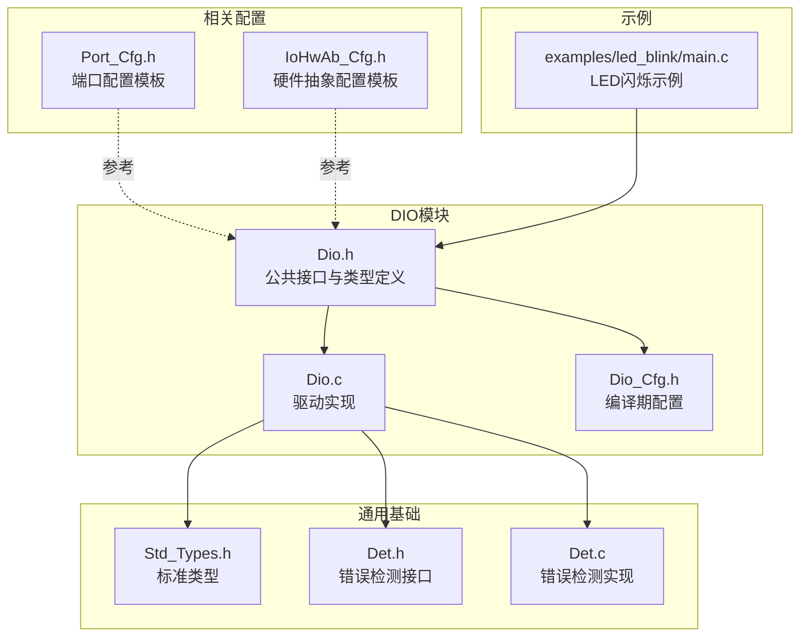

**图表来源**
- [Dio.h:1-195](file://src/bsw/mcal/dio/include/Dio.h#L1-L195)
- [Dio.c:1-266](file://src/bsw/mcal/dio/src/Dio.c#L1-L266)
- [Dio_Cfg.h:1-87](file://src/bsw/mcal/dio/include/Dio_Cfg.h#L1-L87)
- [Std_Types.h:1-117](file://src/bsw/os/include/Std_Types.h#L1-L117)
- [Det.h:1-76](file://src/bsw/services/det/include/Det.h#L1-L76)
- [Det.c:1-88](file://src/bsw/services/det/src/Det.c#L1-L88)
- [Port_Cfg.h:1-80](file://src/bsw/config/templates/Port_Cfg.h#L1-L80)
- [IoHwAb_Cfg.h:1-115](file://src/bsw/config/templates/IoHwAb_Cfg.h#L1-L115)
- [main.c（LED闪烁示例）:1-100](file://examples/led_blink/main.c#L1-L100)

**章节来源**
- [Dio.h:1-195](file://src/bsw/mcal/dio/include/Dio.h#L1-L195)
- [Dio.c:1-266](file://src/bsw/mcal/dio/src/Dio.c#L1-L266)
- [Dio_Cfg.h:1-87](file://src/bsw/mcal/dio/include/Dio_Cfg.h#L1-L87)
- [Std_Types.h:1-117](file://src/bsw/os/include/Std_Types.h#L1-L117)
- [Det.h:1-76](file://src/bsw/services/det/include/Det.h#L1-L76)
- [Det.c:1-88](file://src/bsw/services/det/src/Det.c#L1-L88)
- [Port_Cfg.h:1-80](file://src/bsw/config/templates/Port_Cfg.h#L1-L80)
- [IoHwAb_Cfg.h:1-115](file://src/bsw/config/templates/IoHwAb_Cfg.h#L1-L115)
- [main.c（LED闪烁示例）:1-100](file://examples/led_blink/main.c#L1-L100)

## 核心组件
- 公共接口与类型定义：在头文件中声明所有API与数据类型，包含服务ID、错误码、版本信息开关、功能开关等。
- 驱动实现：在源文件中实现具体逻辑，包含GPIO基地址映射、寄存器读写、通道/端口解析、通道组掩码处理、翻转写入、带掩码端口写入等。
- 编译期配置：定义端口数量、每端口通道数、端口枚举、通道常量、通道组数量等。
- 错误检测：通过DET模块进行运行时错误上报，支持未初始化、参数非法、空指针等场景。
- 示例工程：LED闪烁示例展示如何初始化MCU、端口、DIO与定时器，并周期性切换LED状态。

**章节来源**
- [Dio.h:35-195](file://src/bsw/mcal/dio/include/Dio.h#L35-L195)
- [Dio.c:56-266](file://src/bsw/mcal/dio/src/Dio.c#L56-L266)
- [Dio_Cfg.h:15-87](file://src/bsw/mcal/dio/include/Dio_Cfg.h#L15-L87)
- [Det.h:32-76](file://src/bsw/services/det/include/Det.h#L32-L76)
- [Det.c:47-80](file://src/bsw/services/det/src/Det.c#L47-L80)
- [main.c（LED闪烁示例）:61-99](file://examples/led_blink/main.c#L61-L99)

## 架构总览
DIO模块采用“接口声明 + 实现 + 配置”的分层设计，向上为应用层提供统一的数字I/O抽象，向下直接访问硬件寄存器，错误处理通过DET模块集中管理。

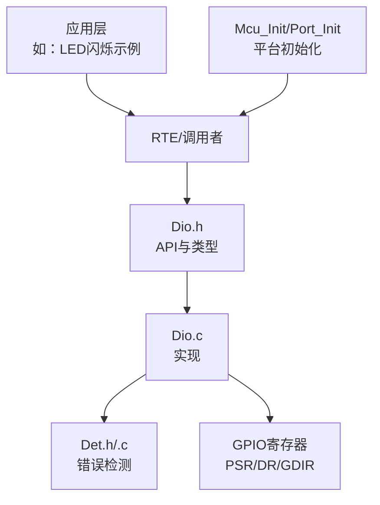

**图表来源**
- [Dio.h:85-195](file://src/bsw/mcal/dio/include/Dio.h#L85-L195)
- [Dio.c:56-266](file://src/bsw/mcal/dio/src/Dio.c#L56-L266)
- [Det.h:47-76](file://src/bsw/services/det/include/Det.h#L47-L76)
- [Det.c:47-80](file://src/bsw/services/det/src/Det.c#L47-L80)
- [main.c（LED闪烁示例）:61-99](file://examples/led_blink/main.c#L61-L99)

## 详细组件分析

### 数据类型与常量
- Dio_ChannelType：通道ID类型，用于唯一标识一个引脚通道。
- Dio_PortType：端口ID类型，用于标识一组32个通道所在的端口。
- Dio_PortLevelType：端口电平类型，用于一次性读取或写入整个端口的32位值。
- Dio_LevelType：通道电平枚举，取值为低电平或高电平。
- Dio_ChannelGroupType：通道组结构体，包含所属端口、偏移、掩码，用于对端口中的连续若干位进行读写。

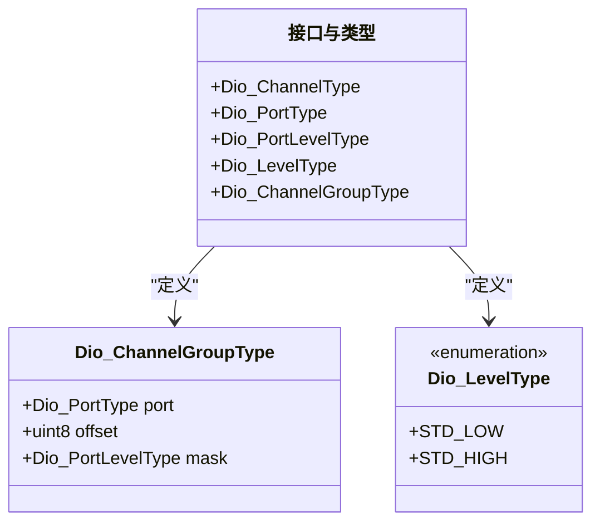

**图表来源**
- [Dio.h:54-74](file://src/bsw/mcal/dio/include/Dio.h#L54-L74)
- [Std_Types.h:44-60](file://src/bsw/os/include/Std_Types.h#L44-L60)

**章节来源**
- [Dio.h:54-74](file://src/bsw/mcal/dio/include/Dio.h#L54-L74)
- [Std_Types.h:44-60](file://src/bsw/os/include/Std_Types.h#L44-L60)

### API概览与行为
- Dio_Init：初始化DIO驱动，启用错误检测时校验配置指针。
- Dio_ReadChannel：读取指定通道的电平。
- Dio_WriteChannel：向指定通道写入电平。
- Dio_ReadPort：读取指定端口的全部32位电平。
- Dio_WritePort：向指定端口写入32位电平。
- Dio_ReadChannelGroup：读取端口上按掩码定义的通道组电平。
- Dio_WriteChannelGroup：向端口上按掩码定义的通道组写入电平。
- Dio_FlipChannel（可选）：翻转指定通道电平并返回新电平。
- Dio_MaskedWritePort（可选）：对端口进行带掩码的写入，仅更新掩码位。
- Dio_GetVersionInfo（可选）：获取模块版本信息。

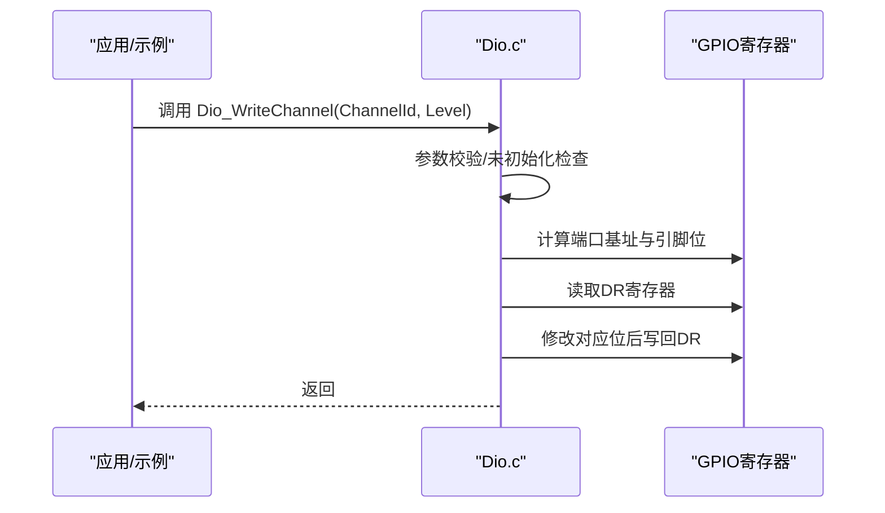

**图表来源**
- [Dio.c:91-115](file://src/bsw/mcal/dio/src/Dio.c#L91-L115)

**章节来源**
- [Dio.h:90-185](file://src/bsw/mcal/dio/include/Dio.h#L90-L185)
- [Dio.c:56-266](file://src/bsw/mcal/dio/src/Dio.c#L56-L266)

### Dio_WriteChannel 与 Dio_ReadChannel
- 函数用途：对单个通道进行读写。
- 参数说明：
  - ChannelId：通道ID，格式为“端口号 << 8 | 引脚号”，端口号与引脚号均来自配置。
  - Level：写入电平，取值为低或高。
- 返回值：读取返回当前电平；写入无返回值。
- 错误处理：未初始化、通道ID越界时通过DET上报错误码。
- 性能特性：直接寄存器访问，延迟极低。

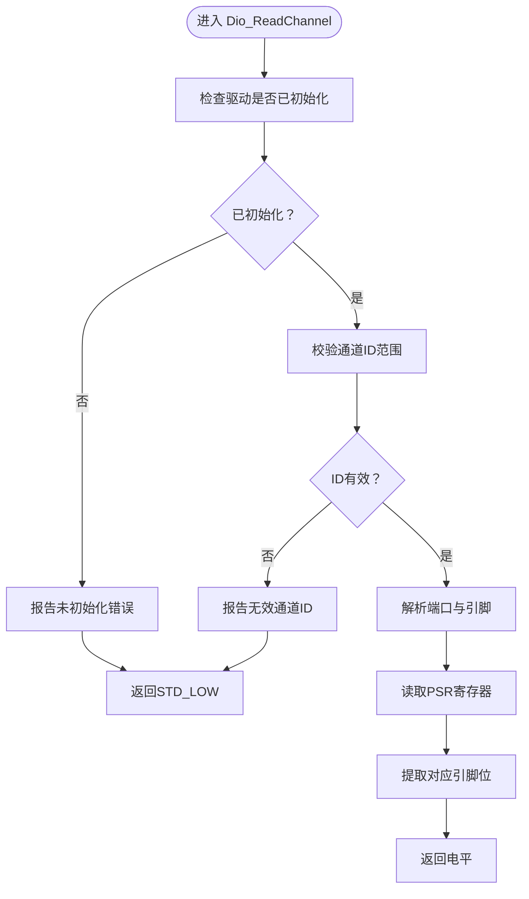

**图表来源**
- [Dio.c:68-89](file://src/bsw/mcal/dio/src/Dio.c#L68-L89)

**章节来源**
- [Dio.c:68-115](file://src/bsw/mcal/dio/src/Dio.c#L68-L115)

### Dio_WritePort 与 Dio_ReadPort
- 函数用途：对整个端口进行读写，一次操作32位。
- 参数说明：
  - PortId：端口ID，取值范围由配置决定。
  - Level：写入的32位端口值。
- 返回值：读取返回端口当前电平值。
- 错误处理：未初始化、端口ID越界时通过DET上报错误码。

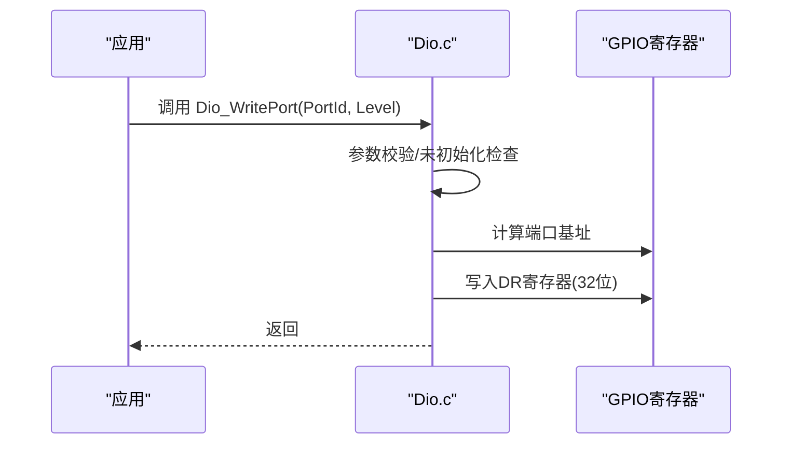

**图表来源**
- [Dio.c:136-151](file://src/bsw/mcal/dio/src/Dio.c#L136-L151)

**章节来源**
- [Dio.c:117-151](file://src/bsw/mcal/dio/src/Dio.c#L117-L151)

### Dio_ReadChannelGroup 与 Dio_WriteChannelGroup
- 函数用途：对端口上的连续若干位（通道组）进行读写。
- 参数说明：
  - ChannelGroupIdPtr：指向通道组结构体，包含端口、偏移、掩码。
  - Level：写入的通道组电平值。
- 返回值：读取返回该通道组的电平值。
- 错误处理：未初始化、指针为空时通过DET上报错误码。

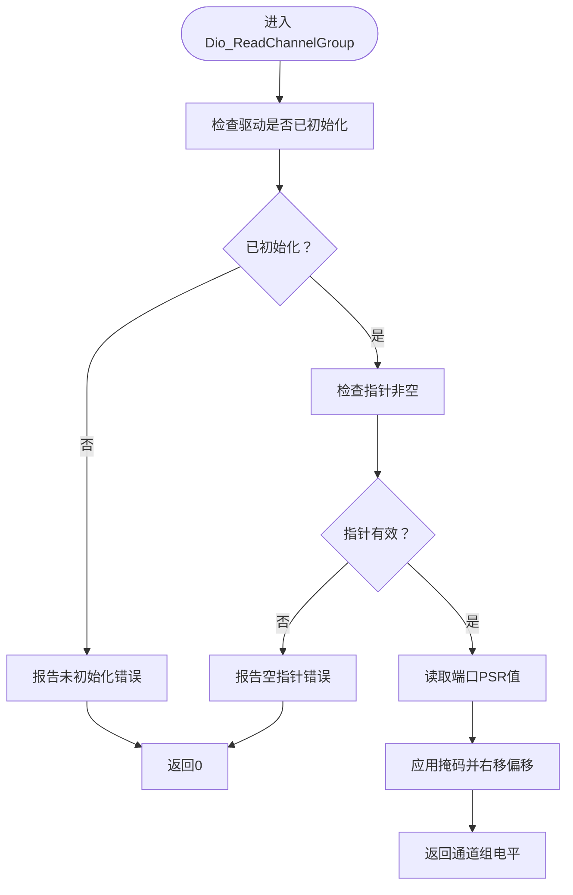

**图表来源**
- [Dio.c:153-171](file://src/bsw/mcal/dio/src/Dio.c#L153-L171)

**章节来源**
- [Dio.c:153-191](file://src/bsw/mcal/dio/src/Dio.c#L153-L191)

### Dio_FlipChannel 与 Dio_MaskedWritePort（可选）
- Dio_FlipChannel：翻转指定通道电平并返回新电平，内部先读取DR，再按位取反后写回。
- Dio_MaskedWritePort：对端口进行带掩码写入，仅修改掩码对应的位，其余保持不变。

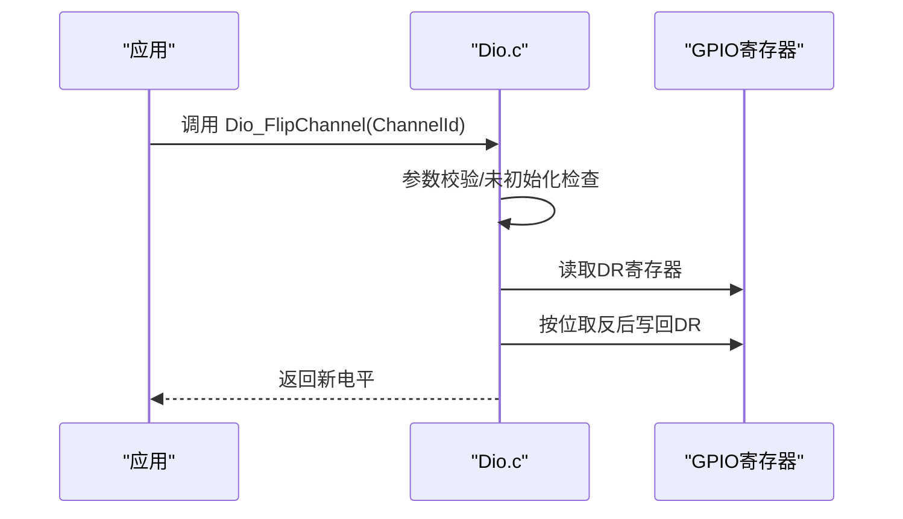

**图表来源**
- [Dio.c:210-240](file://src/bsw/mcal/dio/src/Dio.c#L210-L240)

**章节来源**
- [Dio.c:193-262](file://src/bsw/mcal/dio/src/Dio.c#L193-L262)

### 版本信息与功能开关
- 版本信息接口：在开启版本信息API时可用，返回模块ID、厂商ID及软件版本。
- 功能开关：可通过配置控制是否启用翻转通道、带掩码端口写入、版本信息等。

**章节来源**
- [Dio.h:168-185](file://src/bsw/mcal/dio/include/Dio.h#L168-L185)
- [Dio.c:193-208](file://src/bsw/mcal/dio/src/Dio.c#L193-L208)

### 配置与通道映射
- 端口与通道：
  - 端口数量与每端口通道数由配置定义。
  - 通道ID采用“端口号 << 8 | 引脚号”格式，便于解析端口与引脚。
- 通道组：
  - 定义通道组数量、每个通道组的端口、偏移与掩码，用于对连续位进行批量读写。
- 端口配置模板：
  - 提供端口数量、引脚模式、方向、上下拉、输出速度等配置项，用于端口初始化前的设置。

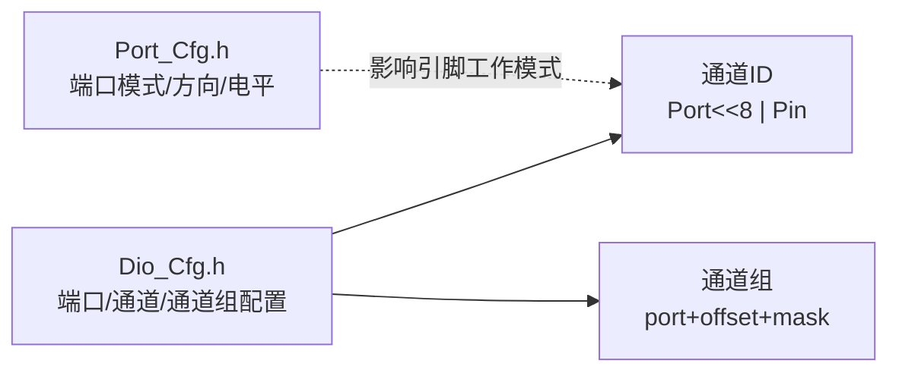

**图表来源**
- [Dio_Cfg.h:23-87](file://src/bsw/mcal/dio/include/Dio_Cfg.h#L23-L87)
- [Port_Cfg.h:28-78](file://src/bsw/config/templates/Port_Cfg.h#L28-L78)

**章节来源**
- [Dio_Cfg.h:23-87](file://src/bsw/mcal/dio/include/Dio_Cfg.h#L23-L87)
- [Port_Cfg.h:28-78](file://src/bsw/config/templates/Port_Cfg.h#L28-L78)

### 实际应用场景与示例
- LED闪烁：示例展示了如何初始化MCU、端口、DIO与定时器，并在回调中周期性切换LED通道电平。
- 端口批量写入：可使用Dio_WritePort或Dio_MaskedWritePort对端口进行一次性配置或部分位修改。
- 状态检测：通过Dio_ReadChannel或Dio_ReadPort读取外部输入状态，结合中断或轮询策略。

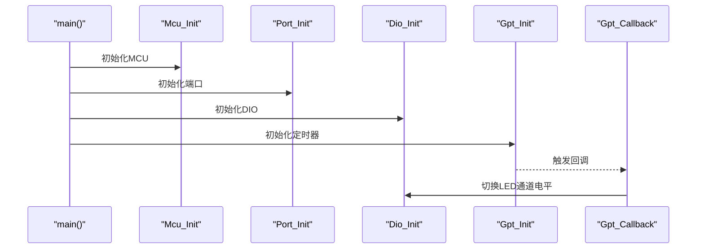

**图表来源**
- [main.c（LED闪烁示例）:61-99](file://examples/led_blink/main.c#L61-L99)

**章节来源**
- [main.c（LED闪烁示例）:37-56](file://examples/led_blink/main.c#L37-L56)
- [main.c（LED闪烁示例）:61-99](file://examples/led_blink/main.c#L61-L99)

## 依赖关系分析
- 头文件依赖：Dio.h依赖标准类型与配置头；实现文件依赖标准类型、配置头与DET模块。
- 错误检测：所有API在启用开发错误检测时都会进行参数校验，并通过DET上报错误码。
- 平台相关：实现中包含GPIO基地址与寄存器偏移定义，适配特定MCAL平台。

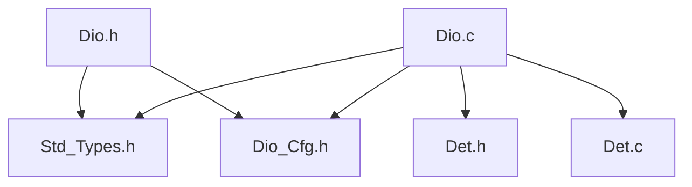

**图表来源**
- [Dio.h:20-21](file://src/bsw/mcal/dio/include/Dio.h#L20-L21)
- [Dio.c:9-11](file://src/bsw/mcal/dio/src/Dio.c#L9-L11)
- [Std_Types.h:17-18](file://src/bsw/os/include/Std_Types.h#L17-L18)
- [Dio_Cfg.h:1-10](file://src/bsw/mcal/dio/include/Dio_Cfg.h#L1-L10)
- [Det.h:17-18](file://src/bsw/services/det/include/Det.h#L17-L18)
- [Det.c:19-20](file://src/bsw/services/det/src/Det.c#L19-L20)

**章节来源**
- [Dio.h:20-21](file://src/bsw/mcal/dio/include/Dio.h#L20-L21)
- [Dio.c:9-11](file://src/bsw/mcal/dio/src/Dio.c#L9-L11)
- [Det.h:17-18](file://src/bsw/services/det/include/Det.h#L17-L18)
- [Det.c:19-20](file://src/bsw/services/det/src/Det.c#L19-L20)

## 性能考虑
- 寄存器直接访问：通道读写、端口读写均为寄存器级操作，延迟低、实时性好。
- 批量操作：端口级读写与通道组读写可减少多次寄存器访问次数，提升吞吐。
- 掩码写入：Dio_MaskedWritePort可在不改变其他位的情况下更新部分位，避免读改写竞争。
- 错误检测成本：启用开发错误检测会增加分支判断与错误上报开销，建议在调试阶段开启，发布版本可关闭以降低开销。

## 故障排查指南
- 常见错误码与触发条件：
  - 未初始化：在未调用Dio_Init或初始化失败后调用API。
  - 无效通道ID：通道ID超出配置范围。
  - 无效端口ID：端口ID超出配置范围。
  - 通道组指针为空：传入空指针。
  - 空指针：版本信息查询或某些API传入空指针。
- 排查步骤：
  - 确认Dio_Init已成功调用且配置指针有效。
  - 核对通道ID格式与配置一致（端口号 << 8 | 引脚号）。
  - 核对端口ID范围与配置一致。
  - 使用DET日志定位具体API与错误码，结合配置文件检查通道/端口/通道组定义。
- 相关配置核对：
  - 端口数量、每端口通道数、通道组数量与定义。
  - 端口模式与方向（若涉及端口初始化），确保引脚处于DIO模式。

**章节来源**
- [Dio.h:45-50](file://src/bsw/mcal/dio/include/Dio.h#L45-L50)
- [Dio.c:58-63](file://src/bsw/mcal/dio/src/Dio.c#L58-L63)
- [Det.h:41-44](file://src/bsw/services/det/include/Det.h#L41-L44)
- [Det.c:47-57](file://src/bsw/services/det/src/Det.c#L47-L57)
- [Dio_Cfg.h:23-41](file://src/bsw/mcal/dio/include/Dio_Cfg.h#L23-L41)
- [Port_Cfg.h:28-78](file://src/bsw/config/templates/Port_Cfg.h#L28-L78)

## 结论
DIO模块提供了完整的数字输入输出能力，涵盖通道级、端口级与通道组级操作，并通过配置与错误检测机制保证了灵活性与可靠性。结合示例工程，开发者可以快速完成LED控制、按键检测、端口批量配置等常见任务。在生产环境中，建议根据实际硬件平台调整配置与寄存器映射，并在调试阶段启用错误检测以尽早发现配置问题。

## 附录

### API清单与要点
- Dio_Init：初始化驱动，启用错误检测时校验配置指针。
- Dio_ReadChannel：读取通道电平，支持未初始化与通道ID越界检查。
- Dio_WriteChannel：写入通道电平，支持未初始化与通道ID越界检查。
- Dio_ReadPort：读取端口电平，支持未初始化与端口ID越界检查。
- Dio_WritePort：写入端口电平，支持未初始化与端口ID越界检查。
- Dio_ReadChannelGroup：读取通道组电平，支持未初始化与空指针检查。
- Dio_WriteChannelGroup：写入通道组电平，支持未初始化与空指针检查。
- Dio_FlipChannel（可选）：翻转通道电平，支持未初始化与通道ID越界检查。
- Dio_MaskedWritePort（可选）：带掩码端口写入，支持未初始化与端口ID越界检查。
- Dio_GetVersionInfo（可选）：获取版本信息，支持空指针检查。

**章节来源**
- [Dio.h:90-185](file://src/bsw/mcal/dio/include/Dio.h#L90-L185)
- [Dio.c:56-266](file://src/bsw/mcal/dio/src/Dio.c#L56-L266)