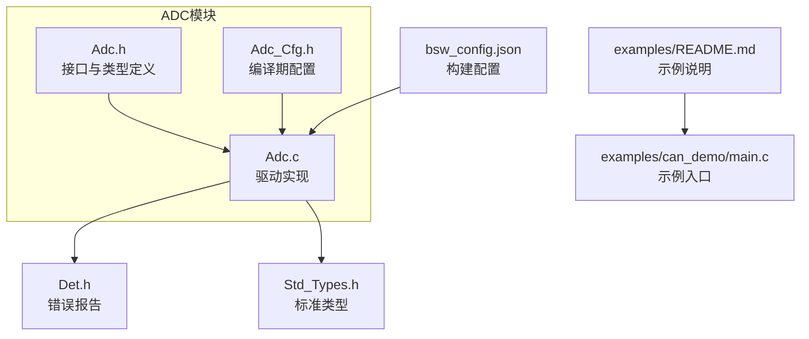
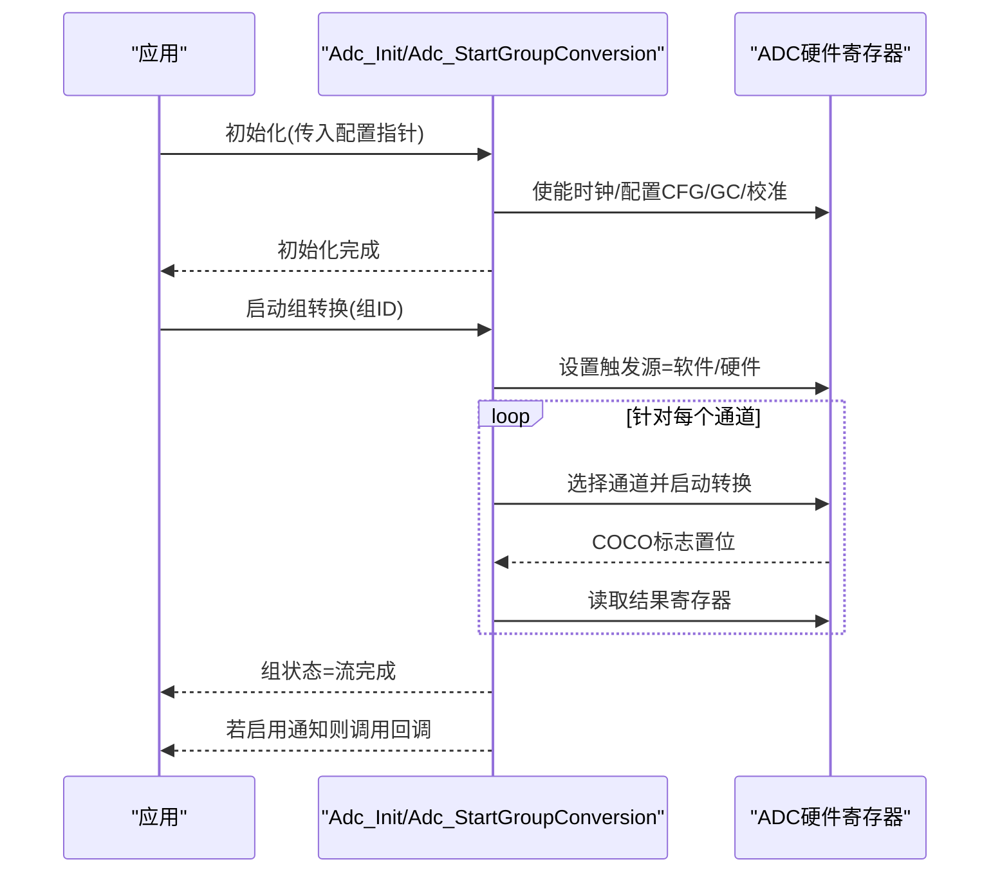
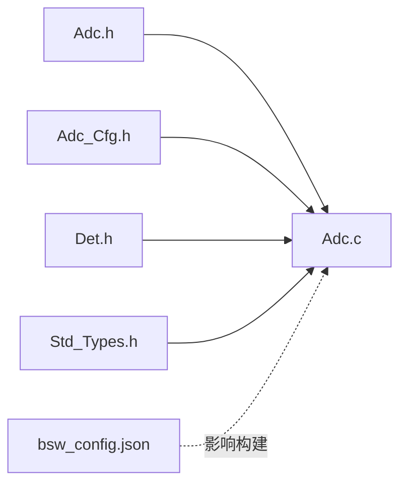

# 模数转换(ADC)API

<cite>
**本文引用的文件**
- [Adc.h](file://src/bsw/mcal/adc/include/Adc.h)
- [Adc_Cfg.h](file://src/bsw/mcal/adc/include/Adc_Cfg.h)
- [Adc.c](file://src/bsw/mcal/adc/src/Adc.c)
- [Det.h](file://src/bsw/common/Det.h)
- [Std_Types.h](file://src/bsw/common/Std_Types.h)
- [bsw_config.json](file://config/bsw_config.json)
- [README.md（示例）](file://examples/README.md)
- [main.c（CAN示例）](file://examples/can_demo/main.c)
</cite>

## 目录
1. [简介](#简介)
2. [项目结构](#项目结构)
3. [核心组件](#核心组件)
4. [架构总览](#架构总览)
5. [详细组件分析](#详细组件分析)
6. [依赖关系分析](#依赖关系分析)
7. [性能考量](#性能考量)
8. [故障排查指南](#故障排查指南)
9. [结论](#结论)
10. [附录](#附录)

## 简介
本文件为模数转换(ADC)模块的详细API参考文档，面向AutoSAR Classic平台MCAL层实现，覆盖初始化、启动/停止转换、读取结果、触发源控制、组通知、状态查询、版本信息、流式缓冲区与功率状态管理等接口。文档同时解释ADC配置参数、采样时间、分辨率、访问模式、缓冲区模式等关键概念，并提供传感器数据采集、多通道扫描、DMA传输等典型应用场景的使用思路与最佳实践。

## 项目结构
ADC模块位于MCAL层，遵循AutoSAR标准，采用头文件声明接口、源文件实现硬件寄存器操作，并通过配置头文件进行编译期配置。关键文件组织如下：
- 接口与类型：src/bsw/mcal/adc/include/Adc.h
- 配置宏：src/bsw/mcal/adc/include/Adc_Cfg.h
- 实现：src/bsw/mcal/adc/src/Adc.c
- 错误检测：src/bsw/common/Det.h
- 标准类型：src/bsw/common/Std_Types.h
- 构建配置：config/bsw_config.json
- 示例工程：examples/

**图表来源**
- [Adc.h:1-384](file://src/bsw/mcal/adc/include/Adc.h#L1-L384)
- [Adc_Cfg.h:1-105](file://src/bsw/mcal/adc/include/Adc_Cfg.h#L1-L105)
- [Adc.c:1-506](file://src/bsw/mcal/adc/src/Adc.c#L1-L506)
- [Det.h:1-76](file://src/bsw/common/Det.h#L1-L76)
- [Std_Types.h:1-117](file://src/bsw/common/Std_Types.h#L1-L117)
- [bsw_config.json:1-21](file://config/bsw_config.json#L1-L21)
- [README.md（示例）:1-165](file://examples/README.md#L1-L165)
- [main.c（CAN示例）:1-119](file://examples/can_demo/main.c#L1-L119)

**章节来源**
- [Adc.h:1-384](file://src/bsw/mcal/adc/include/Adc.h#L1-L384)
- [Adc_Cfg.h:1-105](file://src/bsw/mcal/adc/include/Adc_Cfg.h#L1-L105)
- [Adc.c:1-506](file://src/bsw/mcal/adc/src/Adc.c#L1-L506)
- [Det.h:1-76](file://src/bsw/common/Det.h#L1-L76)
- [Std_Types.h:1-117](file://src/bsw/common/Std_Types.h#L1-L117)
- [bsw_config.json:1-21](file://config/bsw_config.json#L1-L21)
- [README.md（示例）:1-165](file://examples/README.md#L1-L165)
- [main.c（CAN示例）:1-119](file://examples/can_demo/main.c#L1-L119)

## 核心组件
- 类型系统
  - 基础类型：Adc_HWUnitType、Adc_ChannelType、Adc_GroupType、Adc_ValueGroupType、Adc_StreamNumSampleType
  - 状态类型：Adc_StatusType（空闲/忙/流完成）
  - 触发源：Adc_TriggerSourceType（软件/硬件）
  - 转换模式：Adc_ConversionModeType（单次/连续）
  - 流缓冲模式：Adc_StreamBufferModeType（线性/循环）
  - 访问模式：Adc_GroupAccessModeType（单次/流式）
  - 采样时间：Adc_SamplingTimeType（多种周期）
  - 分辨率：Adc_ResolutionType（6/8/10/12位）
  - 功率状态：Adc_PowerStateType（全功率/低功耗）
- 配置结构
  - Adc_ConfigType：包含硬件单元、组、通道数组及功能开关
  - Adc_HWUnitConfigType：硬件单元基础地址、时钟频率、默认分辨率
  - Adc_GroupConfigType：组ID、硬件单元、通道列表、触发源、转换模式、访问模式、缓冲模式、采样数量、分辨率、通知回调
  - Adc_ChannelConfigType：通道ID、采样时间、输入引脚
- 全局配置指针：Adc_Config（外部定义）

**章节来源**
- [Adc.h:84-242](file://src/bsw/mcal/adc/include/Adc.h#L84-L242)
- [Adc_Cfg.h:12-105](file://src/bsw/mcal/adc/include/Adc_Cfg.h#L12-L105)

## 架构总览
ADC驱动通过配置结构在初始化阶段完成硬件单元的时钟使能、寄存器配置与校准；随后按组执行转换流程，支持软件触发与硬件触发两种模式；转换完成后可直接读取结果或通过通知回调上报；同时提供版本信息、组状态查询、流式缓冲区指针获取以及功率状态管理接口（条件编译启用）。

**图表来源**
- [Adc.c:93-136](file://src/bsw/mcal/adc/src/Adc.c#L93-L136)
- [Adc.c:168-223](file://src/bsw/mcal/adc/src/Adc.c#L168-L223)

**章节来源**
- [Adc.c:93-136](file://src/bsw/mcal/adc/src/Adc.c#L93-L136)
- [Adc.c:168-223](file://src/bsw/mcal/adc/src/Adc.c#L168-L223)

## 详细组件分析

### Adc_Init 初始化
- 函数签名路径：[Adc_Init:261-265](file://src/bsw/mcal/adc/include/Adc.h#L261-L265)
- 参数
  - ConfigPtr：指向Adc_ConfigType的常量指针
- 返回值
  - 无
- 行为
  - 开启DEV_ERROR_DETECT时进行参数与初始化状态检查
  - 遍历硬件单元，根据基址写入配置寄存器，使能ADC并执行校准
  - 初始化各组状态为空闲
- 错误码
  - ADC_E_PARAM_CONFIG、ADC_E_ALREADY_INITIALIZED
- 使用示例
  - 在应用中先准备Adc_ConfigType实例，再调用Adc_Init传入该配置指针

**章节来源**
- [Adc.h:261-265](file://src/bsw/mcal/adc/include/Adc.h#L261-L265)
- [Adc.c:93-136](file://src/bsw/mcal/adc/src/Adc.c#L93-L136)
- [Det.h:51-59](file://src/bsw/common/Det.h#L51-L59)

### Adc_StartGroupConversion 启动组转换
- 函数签名路径：[Adc_StartGroupConversion:273-276](file://src/bsw/mcal/adc/include/Adc.h#L273-L276)
- 参数
  - Group：Adc_GroupType类型的组ID
- 返回值
  - 无
- 行为
  - 开启DEV_ERROR_DETECT时进行初始化与参数检查
  - 若组已忙则直接返回
  - 依据组配置选择硬件单元，设置触发源为软件触发
  - 循环对每个通道进行选择、启动、等待完成、读取结果
  - 更新组状态为“流完成”，若启用通知则调用回调
- 错误码
  - ADC_E_UNINIT、ADC_E_PARAM_GROUP、ADC_E_BUSY

**章节来源**
- [Adc.h:273-276](file://src/bsw/mcal/adc/include/Adc.h#L273-L276)
- [Adc.c:168-223](file://src/bsw/mcal/adc/src/Adc.c#L168-L223)
- [Det.h:51-59](file://src/bsw/common/Det.h#L51-L59)

### Adc_ReadGroup 读取组结果
- 函数签名路径：[Adc_ReadGroup:285-290](file://src/bsw/mcal/adc/include/Adc.h#L285-L290)
- 参数
  - Group：Adc_GroupType类型的组ID
  - DataBufferPtr：指向结果缓冲区的指针
- 返回值
  - Std_ReturnType：E_OK/E_NOT_OK
- 行为
  - 开启DEV_ERROR_DETECT时进行初始化、参数与指针检查
  - 将内部缓存的组结果复制到用户提供的缓冲区
- 错误码
  - ADC_E_UNINIT、ADC_E_PARAM_GROUP、ADC_E_PARAM_POINTER

**章节来源**
- [Adc.h:285-290](file://src/bsw/mcal/adc/include/Adc.h#L285-L290)
- [Adc.c:254-278](file://src/bsw/mcal/adc/src/Adc.c#L254-L278)
- [Det.h:51-59](file://src/bsw/common/Det.h#L51-L59)

### Adc_EnableHardwareTrigger/Adc_DisableHardwareTrigger 硬件触发控制
- 函数签名路径
  - [Adc_EnableHardwareTrigger:293-296](file://src/bsw/mcal/adc/include/Adc.h#L293-L296)
  - [Adc_DisableHardwareTrigger:298-302](file://src/bsw/mcal/adc/include/Adc.h#L298-L302)
- 参数
  - Group：Adc_GroupType类型的组ID
- 返回值
  - 无
- 行为
  - 开启DEV_ERROR_DETECT时进行初始化与参数检查
  - 仅当组配置的触发源为硬件时才生效
  - 通过GC寄存器位控制硬件触发使能/禁用
- 错误码
  - ADC_E_UNINIT、ADC_E_PARAM_GROUP

**章节来源**
- [Adc.h:293-302](file://src/bsw/mcal/adc/include/Adc.h#L293-L302)
- [Adc.c:280-328](file://src/bsw/mcal/adc/src/Adc.c#L280-L328)
- [Det.h:51-59](file://src/bsw/common/Det.h#L51-L59)

### Adc_EnableGroupNotification/Adc_DisableGroupNotification 组通知
- 函数签名路径
  - [Adc_EnableGroupNotification:305-308](file://src/bsw/mcal/adc/include/Adc.h#L305-L308)
  - [Adc_DisableGroupNotification:310-314](file://src/bsw/mcal/adc/include/Adc.h#L310-L314)
- 参数
  - Group：Adc_GroupType类型的组ID
- 返回值
  - 无
- 行为
  - 开启DEV_ERROR_DETECT时进行初始化与参数检查
  - 当编译期开启组通知能力时，按需启用/禁用通知（当前实现为占位）
- 错误码
  - ADC_E_UNINIT、ADC_E_PARAM_GROUP

**章节来源**
- [Adc.h:305-314](file://src/bsw/mcal/adc/include/Adc.h#L305-L314)
- [Adc.c:330-360](file://src/bsw/mcal/adc/src/Adc.c#L330-L360)
- [Det.h:51-59](file://src/bsw/common/Det.h#L51-L59)

### Adc_GetGroupStatus 获取组状态
- 函数签名路径：[Adc_GetGroupStatus:317-321](file://src/bsw/mcal/adc/include/Adc.h#L317-L321)
- 参数
  - Group：Adc_GroupType类型的组ID
- 返回值
  - Adc_StatusType：ADC_IDLE/ADC_BUSY/ADC_STREAM_COMPLETED
- 行为
  - 开启DEV_ERROR_DETECT时进行初始化与参数检查
  - 返回对应组的状态
- 错误码
  - ADC_E_UNINIT、ADC_E_PARAM_GROUP

**章节来源**
- [Adc.h:317-321](file://src/bsw/mcal/adc/include/Adc.h#L317-L321)
- [Adc.c:362-375](file://src/bsw/mcal/adc/src/Adc.c#L362-L375)
- [Det.h:51-59](file://src/bsw/common/Det.h#L51-L59)

### Adc_GetVersionInfo 版本信息
- 函数签名路径：[Adc_GetVersionInfo:324-327](file://src/bsw/mcal/adc/include/Adc.h#L324-L327)
- 参数
  - versioninfo：指向Std_VersionInfoType的指针
- 返回值
  - 无
- 行为
  - 开启DEV_ERROR_DETECT时进行指针检查
  - 填充供应商ID、模块ID与软件版本号
- 错误码
  - ADC_E_PARAM_POINTER

**章节来源**
- [Adc.h:324-327](file://src/bsw/mcal/adc/include/Adc.h#L324-L327)
- [Adc.c:377-390](file://src/bsw/mcal/adc/src/Adc.c#L377-L390)
- [Det.h:51-59](file://src/bsw/common/Det.h#L51-L59)

### Adc_GetStreamLastPointer 流式最后指针
- 函数签名路径：[Adc_GetStreamLastPointer:330-335](file://src/bsw/mcal/adc/include/Adc.h#L330-L335)
- 参数
  - Group：Adc_GroupType类型的组ID
  - PtrToSamplePtr：指向样本指针的指针
- 返回值
  - Adc_StreamNumSampleType：有效样本数量
- 行为
  - 开启DEV_ERROR_DETECT时进行初始化、参数与指针检查
  - 返回组结果缓冲区首地址与样本数量
- 错误码
  - ADC_E_UNINIT、ADC_E_PARAM_GROUP、ADC_E_PARAM_POINTER

**章节来源**
- [Adc.h:330-335](file://src/bsw/mcal/adc/include/Adc.h#L330-L335)
- [Adc.c:392-413](file://src/bsw/mcal/adc/src/Adc.c#L392-L413)
- [Det.h:51-59](file://src/bsw/common/Det.h#L51-L59)

### Adc_SetupResultBuffer 结果缓冲区设置
- 函数签名路径：[Adc_SetupResultBuffer:338-343](file://src/bsw/mcal/adc/include/Adc.h#L338-L343)
- 参数
  - Group：Adc_GroupType类型的组ID
  - DataBufferPtr：指向数据缓冲区的指针
- 返回值
  - Std_ReturnType：E_OK/E_NOT_OK
- 行为
  - 开启DEV_ERROR_DETECT时进行初始化、参数与指针检查
  - 当编译期开启队列能力时，用于设置结果缓冲区（当前实现为占位）
- 错误码
  - ADC_E_UNINIT、ADC_E_PARAM_GROUP、ADC_E_PARAM_POINTER

**章节来源**
- [Adc.h:338-343](file://src/bsw/mcal/adc/include/Adc.h#L338-L343)
- [Adc.c:415-436](file://src/bsw/mcal/adc/src/Adc.c#L415-L436)
- [Det.h:51-59](file://src/bsw/common/Det.h#L51-L59)

### 功率状态管理（条件编译）
- 接口
  - Adc_SetPowerState、Adc_GetTargetPowerState、Adc_GetCurrentPowerState、Adc_PreparePowerState
- 行为
  - 当编译期开启功率状态支持时可用；当前实现返回服务接受或默认功率状态
- 错误码
  - ADC_E_UNINIT、ADC_E_PARAM_POINTER、ADC_E_POWER_STATE_NOT_SUPPORTED、ADC_E_TRANSITION_NOT_POSSIBLE

**章节来源**
- [Adc.h:353-378](file://src/bsw/mcal/adc/include/Adc.h#L353-L378)
- [Adc.c:438-502](file://src/bsw/mcal/adc/src/Adc.c#L438-L502)
- [Det.h:51-59](file://src/bsw/common/Det.h#L51-L59)

## 依赖关系分析
- 内部依赖
  - Adc.c依赖Adc.h、Adc_Cfg.h与Det.h进行类型、配置与错误报告
  - 使用标准类型Std_Types.h中的基本类型与版本信息结构
- 外部依赖
  - 平台相关：寄存器读写宏（REG_READ32/REG_WRITE32）、硬件基址（如ADC1_BASE_ADDR）
  - 构建配置：bsw_config.json用于顶层模块配置（非ADC直接依赖，但影响整体构建）
- 编译期特性
  - 通过Adc_Cfg.h中的宏控制API可用性（如DeInit、硬件触发、组通知、流式指针、队列、功率状态）

**图表来源**
- [Adc.h:1-384](file://src/bsw/mcal/adc/include/Adc.h#L1-L384)
- [Adc_Cfg.h:1-105](file://src/bsw/mcal/adc/include/Adc_Cfg.h#L1-L105)
- [Adc.c:1-506](file://src/bsw/mcal/adc/src/Adc.c#L1-L506)
- [Det.h:1-76](file://src/bsw/common/Det.h#L1-L76)
- [Std_Types.h:1-117](file://src/bsw/common/Std_Types.h#L1-L117)
- [bsw_config.json:1-21](file://config/bsw_config.json#L1-L21)

**章节来源**
- [Adc.c:9-12](file://src/bsw/mcal/adc/src/Adc.c#L9-L12)
- [Adc.h:19-20](file://src/bsw/mcal/adc/include/Adc.h#L19-L20)
- [Adc_Cfg.h:15-24](file://src/bsw/mcal/adc/include/Adc_Cfg.h#L15-L24)
- [bsw_config.json:1-21](file://config/bsw_config.json#L1-L21)

## 性能考量
- 分辨率与采样时间
  - 分辨率越高，量化精度越高但转换时间可能增加；采样时间越长，跟踪能力越好但吞吐降低
  - 可通过Adc_GroupConfigType的Resolution与SamplingTime字段配置
- 触发与模式
  - 连续模式适合高吞吐场景；单次模式适合事件驱动
  - 硬件触发可减少CPU占用，提高实时性
- 缓冲与流式
  - 流式线性/循环模式可配合DMA实现零拷贝高效传输
  - SetupResultBuffer与GetStreamLastPointer可用于DMA链表缓冲管理
- 功率状态
  - 在低功耗场景下合理切换功率状态，避免频繁切换带来的延迟与抖动

## 故障排查指南
- 常见错误与定位
  - 未初始化：调用任何API前必须先Adc_Init；否则报ADC_E_UNINIT
  - 参数非法：Group/Channel/Buffer指针无效将触发ADC_E_PARAM_GROUP/ADC_E_PARAM_POINTER
  - 已初始化：重复初始化会触发ADC_E_ALREADY_INITIALIZED
  - 状态异常：Busy/Idle状态不匹配可能导致ADC_E_BUSY/ADC_E_IDLE
  - 能力缺失：未启用的API（如DeInit、硬件触发、组通知、流式指针、队列、功率状态）调用将返回不可用
- 建议排查步骤
  - 确认Adc_ConfigType配置正确且已传入Adc_Init
  - 检查组配置的触发源、分辨率、采样时间是否符合硬件约束
  - 使用Adc_GetGroupStatus确认当前状态
  - 通过Adc_GetVersionInfo核对模块版本
  - 若启用DET，关注Det_ReportError输出的错误码定位问题

**章节来源**
- [Adc.c:95-104](file://src/bsw/mcal/adc/src/Adc.c#L95-L104)
- [Adc.c:170-179](file://src/bsw/mcal/adc/src/Adc.c#L170-L179)
- [Adc.c:256-269](file://src/bsw/mcal/adc/src/Adc.c#L256-L269)
- [Adc.c:364-373](file://src/bsw/mcal/adc/src/Adc.c#L364-L373)
- [Det.h:51-59](file://src/bsw/common/Det.h#L51-L59)

## 结论
ADC模块提供了完整的AutoSAR MCAL接口集合，涵盖初始化、转换控制、结果读取、触发与通知、状态与版本查询以及功率状态管理。通过Adc_Cfg.h可灵活裁剪功能并配置硬件参数。结合DMA与流式缓冲模式，可实现高性能、低开销的传感器数据采集与处理。建议在设计阶段明确分辨率、采样时间与触发策略，并在开发过程中充分利用DET进行早期错误诊断。

## 附录

### 关键概念速览
- 分辨率：6/8/10/12位，影响动态范围与精度
- 采样时间：多种周期配置，平衡精度与吞吐
- 触发源：软件触发适用于事件驱动；硬件触发适用于定时或外设触发
- 访问模式：单次适合一次性测量；流式适合持续采样
- 缓冲模式：线性/循环，配合DMA实现高效数据搬运
- 组通知：通过回调机制异步通知转换完成

### 典型应用场景与示例思路
- 传感器数据采集
  - 配置多个通道组成一个组，设置合适的采样时间与分辨率
  - 使用软件触发或硬件触发启动转换，随后调用Adc_ReadGroup读取结果
- 多通道扫描
  - 在组配置中列出所有通道，启动转换后顺序读取各通道结果
- DMA传输
  - 通过Adc_SetupResultBuffer或GetStreamLastPointer准备DMA缓冲，结合硬件触发实现零拷贝传输
- 噪声抑制与精度优化
  - 提高采样时间以改善跟踪能力
  - 采用多次采样平均（在应用层实现）降低噪声
  - 使用校准流程（驱动初始化中已完成）提升线性度
  - 合理设置分辨率与滤波算法平衡精度与实时性

**章节来源**
- [Adc.h:164-169](file://src/bsw/mcal/adc/include/Adc.h#L164-L169)
- [Adc.h:148-159](file://src/bsw/mcal/adc/include/Adc.h#L148-L159)
- [Adc_Cfg.h:80-92](file://src/bsw/mcal/adc/include/Adc_Cfg.h#L80-L92)
- [Adc.c:108-129](file://src/bsw/mcal/adc/src/Adc.c#L108-L129)
- [Adc.c:415-436](file://src/bsw/mcal/adc/src/Adc.c#L415-L436)
- [Adc.c:392-413](file://src/bsw/mcal/adc/src/Adc.c#L392-L413)