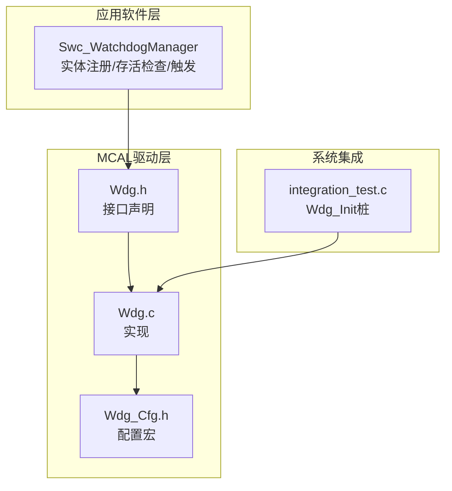
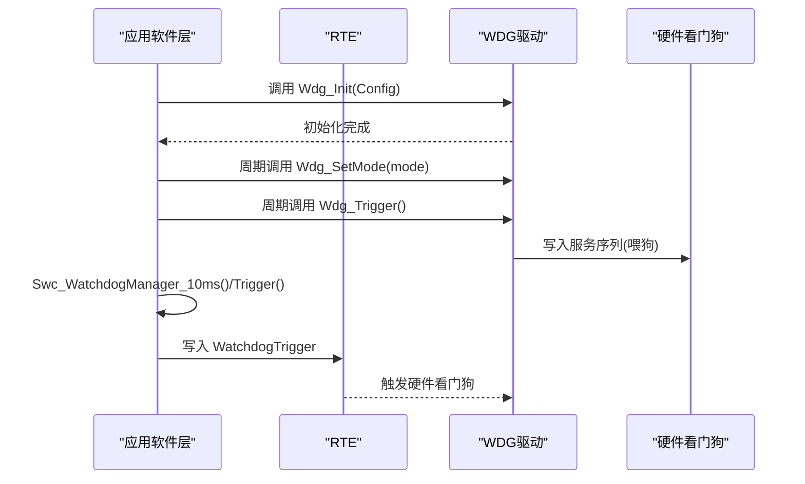
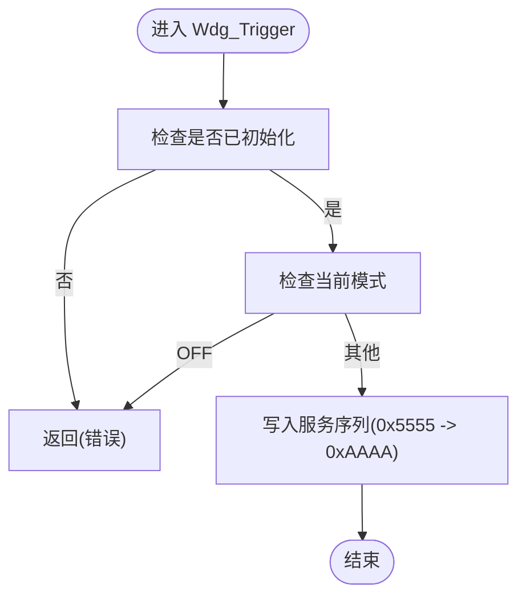
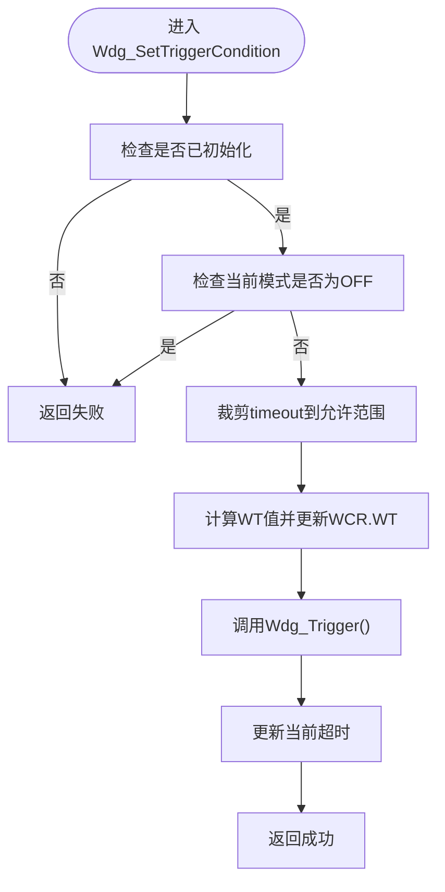
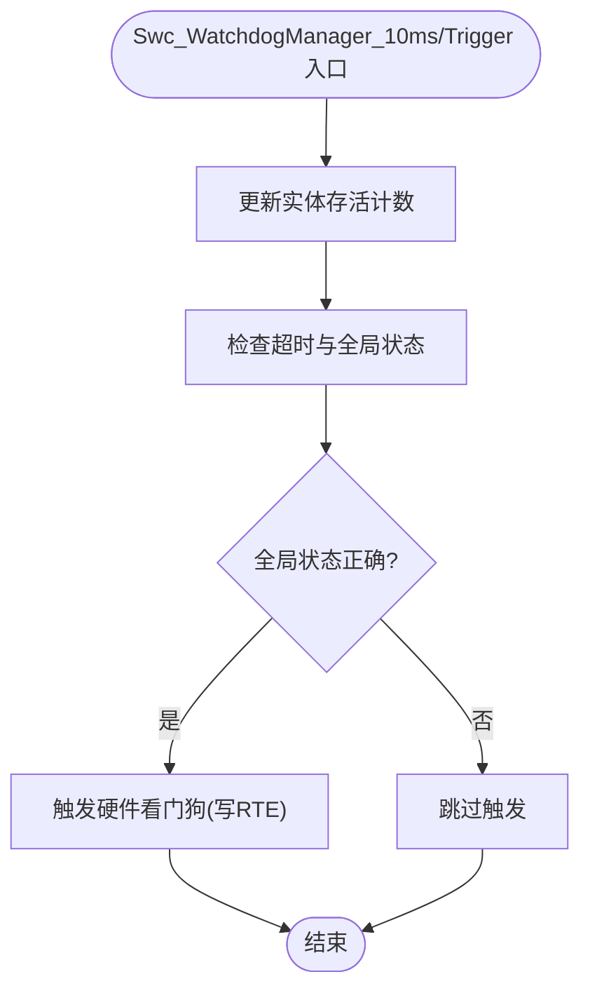
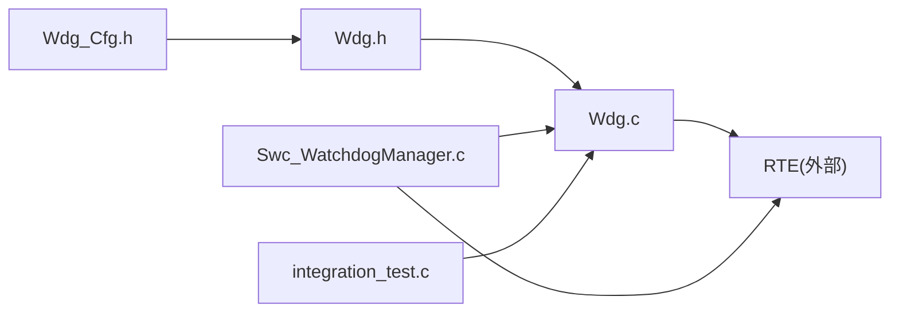

# 看门狗(WDG)API

<cite>
**本文引用的文件**
- [Wdg.h](file://src/bsw/mcal/wdg/include/Wdg.h)
- [Wdg.c](file://src/bsw/mcal/wdg/src/Wdg.c)
- [Wdg_Cfg.h](file://src/bsw/mcal/wdg/include/Wdg_Cfg.h)
- [Swc_WatchdogManager.h](file://src/asw/watchdog_manager/include/Swc_WatchdogManager.h)
- [Swc_WatchdogManager.c](file://src/asw/watchdog_manager/src/Swc_WatchdogManager.c)
- [integration_test.c](file://tests/integration/bsw/integration_test.c)
</cite>

## 目录
1. [简介](#简介)
2. [项目结构](#项目结构)
3. [核心组件](#核心组件)
4. [架构总览](#架构总览)
5. [详细组件分析](#详细组件分析)
6. [依赖关系分析](#依赖关系分析)
7. [性能考量](#性能考量)
8. [故障排查指南](#故障排查指南)
9. [结论](#结论)
10. [附录](#附录)

## 简介
本文件为看门狗(WDG)模块的详细API参考文档，覆盖MCAL驱动层与应用软件层的看门狗接口，重点包括：
- 驱动层：初始化、模式切换、触发、版本信息查询、动态触发条件设置等
- 应用层：实体注册与存活检查、全局状态监督、触发硬件看门狗、过期处理等
- 关键概念：超时设置、窗口模式、中断管理、可靠性保障与错误检测

文档同时提供系统监控、故障恢复、安全应用等场景下的使用建议与流程图示。

## 项目结构
WDG相关代码位于以下位置：
- MCAL驱动层：src/bsw/mcal/wdg/include 与 src/bsw/mcal/wdg/src
- 应用软件层：src/asw/watchdog_manager/include 与 src/asw/watchdog_manager/src
- 集成测试：tests/integration/bsw/integration_test.c（包含对Wdg_Init的调用桩）

**图表来源**
- [Wdg.h:134-163](file://src/bsw/mcal/wdg/include/Wdg.h#L134-L163)
- [Wdg.c:85-143](file://src/bsw/mcal/wdg/src/Wdg.c#L85-L143)
- [Wdg_Cfg.h:15-60](file://src/bsw/mcal/wdg/include/Wdg_Cfg.h#L15-L60)
- [Swc_WatchdogManager.h:110-181](file://src/asw/watchdog_manager/include/Swc_WatchdogManager.h#L110-L181)
- [Swc_WatchdogManager.c:222-307](file://src/asw/watchdog_manager/src/Swc_WatchdogManager.c#L222-L307)
- [integration_test.c:432-432](file://tests/integration/bsw/integration_test.c#L432-L432)

**章节来源**
- [Wdg.h:13-168](file://src/bsw/mcal/wdg/include/Wdg.h#L13-L168)
- [Wdg.c:1-283](file://src/bsw/mcal/wdg/src/Wdg.c#L1-L283)
- [Wdg_Cfg.h:1-62](file://src/bsw/mcal/wdg/include/Wdg_Cfg.h#L1-L62)
- [Swc_WatchdogManager.h:1-202](file://src/asw/watchdog_manager/include/Swc_WatchdogManager.h#L1-L202)
- [Swc_WatchdogManager.c:1-520](file://src/asw/watchdog_manager/src/Swc_WatchdogManager.c#L1-L520)
- [integration_test.c:432-432](file://tests/integration/bsw/integration_test.c#L432-L432)

## 核心组件
- 驱动层(WDG)：提供Wdg_Init、Wdg_SetMode、Wdg_Trigger、Wdg_GetVersionInfo、Wdg_SetTriggerCondition等接口，支持FAST/SLOW/OFF模式、超时配置、可选中断。
- 应用层(Swc_WatchdogManager)：提供实体注册、存活检查、周期性监督、触发硬件看门狗、全局状态判断与过期处理等。

**章节来源**
- [Wdg.h:134-163](file://src/bsw/mcal/wdg/include/Wdg.h#L134-L163)
- [Wdg.c:85-279](file://src/bsw/mcal/wdg/src/Wdg.c#L85-L279)
- [Swc_WatchdogManager.h:110-181](file://src/asw/watchdog_manager/include/Swc_WatchdogManager.h#L110-L181)
- [Swc_WatchdogManager.c:222-516](file://src/asw/watchdog_manager/src/Swc_WatchdogManager.c#L222-L516)

## 架构总览
WDG驱动层通过配置参数控制超时、分频与模式；应用层通过RTE与驱动交互，周期性检查实体存活并决定是否触发硬件看门狗。

**图表来源**
- [Wdg.c:85-143](file://src/bsw/mcal/wdg/src/Wdg.c#L85-L143)
- [Wdg.c:145-207](file://src/bsw/mcal/wdg/src/Wdg.c#L145-L207)
- [Wdg.c:209-227](file://src/bsw/mcal/wdg/src/Wdg.c#L209-L227)
- [Swc_WatchdogManager.c:272-307](file://src/asw/watchdog_manager/src/Swc_WatchdogManager.c#L272-L307)

## 详细组件分析

### 驱动层(WDG)API详解
- Wdg_Init
  - 功能：初始化看门狗，配置初始模式、超时、可选中断，并启用看门狗（非OFF模式）
  - 参数：ConfigPtr 指向配置结构体
  - 返回：无
  - 错误检测：空指针、重复初始化
  - 可能影响：设置当前模式与超时值
  - 参考路径：[Wdg_Init:85-143](file://src/bsw/mcal/wdg/src/Wdg.c#L85-L143)

- Wdg_SetMode
  - 功能：切换看门狗模式（OFF/FAST/SLOW），更新对应超时
  - 参数：Mode 模式枚举
  - 返回：Std_ReturnType 成功/失败
  - 错误检测：未初始化、禁用不允许关闭
  - 参考路径：[Wdg_SetMode:145-207](file://src/bsw/mcal/wdg/src/Wdg.c#L145-L207)

- Wdg_Trigger
  - 功能：执行喂狗操作（写入特定序列）
  - 参数：无
  - 返回：无
  - 错误检测：未初始化、OFF模式不触发
  - 参考路径：[Wdg_Trigger:209-227](file://src/bsw/mcal/wdg/src/Wdg.c#L209-L227)

- Wdg_GetVersionInfo
  - 功能：获取版本信息
  - 参数：versioninfo 指向版本结构
  - 返回：无
  - 错误检测：空指针
  - 参考路径：[Wdg_GetVersionInfo:229-242](file://src/bsw/mcal/wdg/src/Wdg.c#L229-L242)

- Wdg_SetTriggerCondition
  - 功能：动态设置触发条件超时并立即触发
  - 参数：timeout 超时毫秒数
  - 返回：Std_ReturnType
  - 错误检测：未初始化、OFF模式、越界裁剪
  - 参考路径：[Wdg_SetTriggerCondition:244-279](file://src/bsw/mcal/wdg/src/Wdg.c#L244-L279)

- 关键数据类型与配置
  - 模式类型：WdgIf_ModeType（OFF/SLOW/FAST）
  - 超时类型：Wdg_TimeoutType（uint16）
  - 分频类型：Wdg_ClockPrescalerType（1/2/.../128）
  - 模式设置：Wdg_ModeSettingsType（TimeoutPeriod、ClockPrescaler、WindowModeEnabled、WindowStart、WindowEnd、InterruptMode）
  - 配置结构：Wdg_ConfigType（BaseAddress、FastModeSettings、SlowModeSettings、InitialMode、DefaultTimeout、DevErrorDetect、VersionInfoApi、DisableAllowed）
  - 参考路径：[Wdg.h 类型定义:66-115](file://src/bsw/mcal/wdg/include/Wdg.h#L66-L115)

- 配置宏（Wdg_Cfg.h）
  - 开关：WDG_DEV_ERROR_DETECT、WDG_VERSION_INFO_API、WDG_DISABLE_ALLOWED
  - 初始模式与默认超时：WDG_INITIAL_MODE、WDG_DEFAULT_TIMEOUT
  - FAST模式：WDG_FAST_MODE_TIMEOUT、WDG_FAST_MODE_PRESCALER、WDG_FAST_MODE_WINDOW_ENABLED、WDG_FAST_MODE_WINDOW_START、WDG_FAST_MODE_WINDOW_END、WDG_FAST_MODE_INTERRUPT
  - SLOW模式：WDG_SLOW_MODE_TIMEOUT、WDG_SLOW_MODE_PRESCALER、WDG_SLOW_MODE_WINDOW_ENABLED、WDG_SLOW_MODE_WINDOW_START、WDG_SLOW_MODE_WINDOW_END、WDG_SLOW_MODE_INTERRUPT
  - 硬件基地址与时钟：WDG_BASE_ADDRESS、WDG_CLOCK_FREQUENCY_HZ
  - 触发条件范围：WDG_MAX_TIMEOUT、WDG_MIN_TIMEOUT
  - 参考路径：[Wdg_Cfg.h:15-60](file://src/bsw/mcal/wdg/include/Wdg_Cfg.h#L15-L60)

**章节来源**
- [Wdg.h:66-163](file://src/bsw/mcal/wdg/include/Wdg.h#L66-L163)
- [Wdg.c:85-279](file://src/bsw/mcal/wdg/src/Wdg.c#L85-L279)
- [Wdg_Cfg.h:15-60](file://src/bsw/mcal/wdg/include/Wdg_Cfg.h#L15-L60)

### 应用层(Swc_WatchdogManager)API详解
- Swc_WatchdogManager_Init
  - 功能：初始化管理器内部状态、实体表与配置
  - 返回：无
  - 参考路径：[Swc_WatchdogManager_Init:222-267](file://src/asw/watchdog_manager/src/Swc_WatchdogManager.c#L222-L267)

- Swc_WatchdogManager_10ms
  - 功能：周期性更新实体存活计数、检查超时、写入状态
  - 返回：无
  - 参考路径：[Swc_WatchdogManager_10ms:272-286](file://src/asw/watchdog_manager/src/Swc_WatchdogManager.c#L272-L286)

- Swc_WatchdogManager_Trigger
  - 功能：监督实体、递增全局监督周期、满足条件则触发硬件看门狗
  - 返回：无
  - 参考路径：[Swc_WatchdogManager_Trigger:291-307](file://src/asw/watchdog_manager/src/Swc_WatchdogManager.c#L291-L307)

- Swc_WatchdogManager_CheckpointReached
  - 功能：实体到达检查点，增加存活指示并更新时间
  - 参数：entityId 实体ID
  - 返回：Rte_StatusType
  - 参考路径：[Swc_WatchdogManager_CheckpointReached:312-335](file://src/asw/watchdog_manager/src/Swc_WatchdogManager.c#L312-L335)

- Swc_WatchdogManager_RegisterEntity
  - 功能：注册受监督实体
  - 参数：config 指向配置结构
  - 返回：Rte_StatusType
  - 参考路径：[Swc_WatchdogManager_RegisterEntity:340-379](file://src/asw/watchdog_manager/src/Swc_WatchdogManager.c#L340-L379)

- Swc_WatchdogManager_UnregisterEntity
  - 功能：注销实体
  - 参数：entityId 实体ID
  - 返回：Rte_StatusType
  - 参考路径：[Swc_WatchdogManager_UnregisterEntity:384-408](file://src/asw/watchdog_manager/src/Swc_WatchdogManager.c#L384-L408)

- Swc_WatchdogManager_GetEntityStatus
  - 功能：获取实体状态
  - 参数：entityId、status输出指针
  - 返回：Rte_StatusType
  - 参考路径：[Swc_WatchdogManager_GetEntityStatus:413-434](file://src/asw/watchdog_manager/src/Swc_WatchdogManager.c#L413-L434)

- Swc_WatchdogManager_SetEntityActive
  - 功能：设置实体激活/去活
  - 参数：entityId、active
  - 返回：Rte_StatusType
  - 参考路径：[Swc_WatchdogManager_SetEntityActive:439-462](file://src/asw/watchdog_manager/src/Swc_WatchdogManager.c#L439-L462)

- Swc_WatchdogManager_GetStatus
  - 功能：获取管理器状态
  - 参数：status输出指针
  - 返回：Rte_StatusType
  - 参考路径：[Swc_WatchdogManager_GetStatus:467-479](file://src/asw/watchdog_manager/src/Swc_WatchdogManager.c#L467-L479)

- Swc_WatchdogManager_IsGlobalStatusCorrect
  - 功能：判断所有已注册且激活实体状态是否正确
  - 返回：boolean
  - 参考路径：[Swc_WatchdogManager_IsGlobalStatusCorrect:484-498](file://src/asw/watchdog_manager/src/Swc_WatchdogManager.c#L484-L498)

- Swc_WatchdogManager_HandleExpiration
  - 功能：硬件看门狗过期时的处理（更新状态、报告错误、写状态）
  - 返回：无
  - 参考路径：[Swc_WatchdogManager_HandleExpiration:503-516](file://src/asw/watchdog_manager/src/Swc_WatchdogManager.c#L503-L516)

- 数据结构与枚举
  - 状态枚举：Swc_WatchdogStatusType（OK/EXPIRED/STOPPED/FAULT）、Swc_AliveStateType（CORRECT/INCORRECT/EXPIRED/DEACTIVATED）
  - 实体配置/状态：Swc_SupervisedEntityConfigType、Swc_SupervisedEntityStatusType
  - 管理器配置/状态：Swc_WatchdogManagerConfigType、Swc_WatchdogManagerStatusType
  - 参考路径：[Swc_WatchdogManager.h 结构体定义:25-87](file://src/asw/watchdog_manager/include/Swc_WatchdogManager.h#L25-L87)

**章节来源**
- [Swc_WatchdogManager.h:25-181](file://src/asw/watchdog_manager/include/Swc_WatchdogManager.h#L25-L181)
- [Swc_WatchdogManager.c:222-516](file://src/asw/watchdog_manager/src/Swc_WatchdogManager.c#L222-L516)

### 关键流程图

#### 喂狗流程（Wdg_Trigger）

**图表来源**
- [Wdg.c:209-227](file://src/bsw/mcal/wdg/src/Wdg.c#L209-L227)

#### 动态触发条件设置（Wdg_SetTriggerCondition）

**图表来源**
- [Wdg.c:244-279](file://src/bsw/mcal/wdg/src/Wdg.c#L244-L279)

#### 应用层周期监督与触发

**图表来源**
- [Swc_WatchdogManager.c:272-307](file://src/asw/watchdog_manager/src/Swc_WatchdogManager.c#L272-L307)
- [Swc_WatchdogManager.c:204-213](file://src/asw/watchdog_manager/src/Swc_WatchdogManager.c#L204-L213)

## 依赖关系分析
- 驱动层依赖配置头文件Wdg_Cfg.h提供的宏与常量，决定初始模式、超时、中断开关与硬件基地址。
- 应用层通过RTE与驱动交互，周期性调用Swc_WatchdogManager_*接口，最终通过RTE写入WatchdogTrigger触发硬件看门狗。
- 集成测试中对Wdg_Init提供了桩函数，验证跨层调用链路。

**图表来源**
- [Wdg_Cfg.h:15-60](file://src/bsw/mcal/wdg/include/Wdg_Cfg.h#L15-L60)
- [Wdg.h:134-163](file://src/bsw/mcal/wdg/include/Wdg.h#L134-L163)
- [Wdg.c:85-143](file://src/bsw/mcal/wdg/src/Wdg.c#L85-L143)
- [Swc_WatchdogManager.c:204-213](file://src/asw/watchdog_manager/src/Swc_WatchdogManager.c#L204-L213)
- [integration_test.c:432-432](file://tests/integration/bsw/integration_test.c#L432-L432)

**章节来源**
- [Wdg.h:134-163](file://src/bsw/mcal/wdg/include/Wdg.h#L134-L163)
- [Wdg.c:85-143](file://src/bsw/mcal/wdg/src/Wdg.c#L85-L143)
- [Wdg_Cfg.h:15-60](file://src/bsw/mcal/wdg/include/Wdg_Cfg.h#L15-L60)
- [Swc_WatchdogManager.c:204-213](file://src/asw/watchdog_manager/src/Swc_WatchdogManager.c#L204-L213)
- [integration_test.c:432-432](file://tests/integration/bsw/integration_test.c#L432-L432)

## 性能考量
- 超时计算：驱动层根据时钟频率与分频计算WT值，确保超时精度与边界限制。
- 喂狗开销：Wdg_Trigger仅进行寄存器写入，开销极低。
- 应用层监督：每10ms周期扫描所有已注册实体，注意实体数量上限与状态重置逻辑。
- 中断模式：FAST模式可配置中断，需评估中断处理开销与实时性要求。

[本节为通用指导，无需列出“章节来源”]

## 故障排查指南
- 初始化错误
  - 现象：Wdg_Init返回错误或DET报告
  - 排查：确认ConfigPtr非空、未重复初始化、配置宏正确
  - 参考路径：[Wdg_Init DET分支:87-96](file://src/bsw/mcal/wdg/src/Wdg.c#L87-L96)

- 模式切换失败
  - 现象：Wdg_SetMode返回失败
  - 排查：确认已初始化、未尝试关闭且禁用不允许关闭
  - 参考路径：[Wdg_SetMode DET分支:147-159](file://src/bsw/mcal/wdg/src/Wdg.c#L147-L159)

- 喂狗无效
  - 现象：Wdg_Trigger后硬件仍超时
  - 排查：确认当前模式非OFF、已正确初始化、服务序列写入成功
  - 参考路径：[Wdg_Trigger DET与模式检查:211-221](file://src/bsw/mcal/wdg/src/Wdg.c#L211-L221)

- 动态超时设置异常
  - 现象：Wdg_SetTriggerCondition返回失败或超时未生效
  - 排查：确认未处于OFF模式、timeout在允许范围内、已触发一次
  - 参考路径：[Wdg_SetTriggerCondition DET与裁剪:246-264](file://src/bsw/mcal/wdg/src/Wdg.c#L246-L264)

- 应用层触发失败
  - 现象：全局状态不正确导致未触发硬件看门狗
  - 排查：检查实体注册、激活状态、存活计数与超时阈值
  - 参考路径：[IsGlobalStatusCorrect:484-498](file://src/asw/watchdog_manager/src/Swc_WatchdogManager.c#L484-L498)

**章节来源**
- [Wdg.c:87-96](file://src/bsw/mcal/wdg/src/Wdg.c#L87-L96)
- [Wdg.c:147-159](file://src/bsw/mcal/wdg/src/Wdg.c#L147-L159)
- [Wdg.c:211-221](file://src/bsw/mcal/wdg/src/Wdg.c#L211-L221)
- [Wdg.c:246-264](file://src/bsw/mcal/wdg/src/Wdg.c#L246-L264)
- [Swc_WatchdogManager.c:484-498](file://src/asw/watchdog_manager/src/Swc_WatchdogManager.c#L484-L498)

## 结论
WDG模块在MCAL与应用层之间提供了清晰的职责划分：驱动层负责底层硬件配置与喂狗，应用层负责业务层面的实体监督与触发决策。通过配置宏与结构化接口，系统可在不同模式下灵活调整超时与行为，并结合RTE实现可靠的状态传递与触发机制。建议在实际部署中严格遵循错误检测与超时边界约束，确保系统在异常情况下具备可预测的安全行为。

[本节为总结性内容，无需列出“章节来源”]

## 附录

### API速查表
- 驱动层
  - Wdg_Init(ConfigPtr)
  - Wdg_SetMode(Mode)
  - Wdg_Trigger()
  - Wdg_GetVersionInfo(versioninfo)
  - Wdg_SetTriggerCondition(timeout)

- 应用层
  - Swc_WatchdogManager_Init()
  - Swc_WatchdogManager_10ms()
  - Swc_WatchdogManager_Trigger()
  - Swc_WatchdogManager_CheckpointReached(entityId)
  - Swc_WatchdogManager_RegisterEntity(config)
  - Swc_WatchdogManager_UnregisterEntity(entityId)
  - Swc_WatchdogManager_GetEntityStatus(entityId, status)
  - Swc_WatchdogManager_SetEntityActive(entityId, active)
  - Swc_WatchdogManager_GetStatus(status)
  - Swc_WatchdogManager_IsGlobalStatusCorrect()
  - Swc_WatchdogManager_HandleExpiration()

**章节来源**
- [Wdg.h:134-163](file://src/bsw/mcal/wdg/include/Wdg.h#L134-L163)
- [Swc_WatchdogManager.h:110-181](file://src/asw/watchdog_manager/include/Swc_WatchdogManager.h#L110-L181)