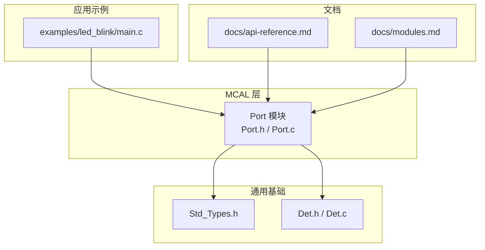
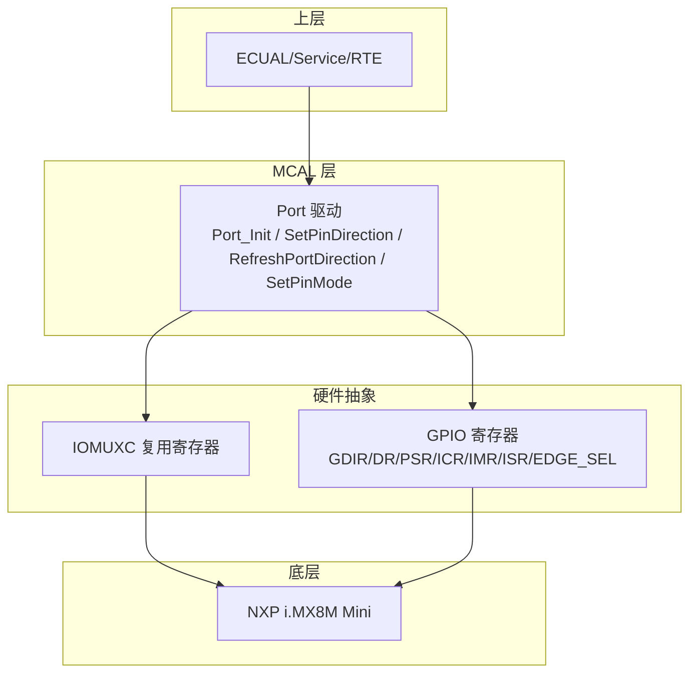
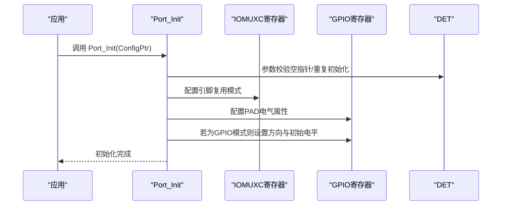
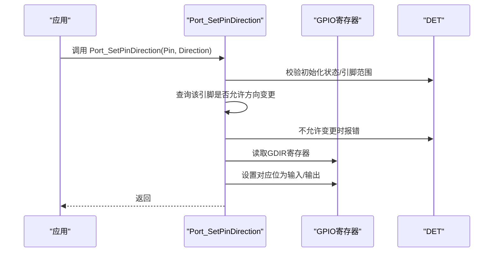
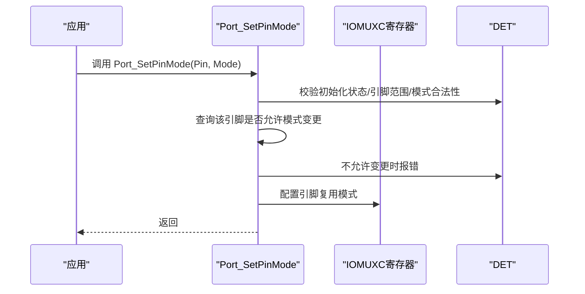
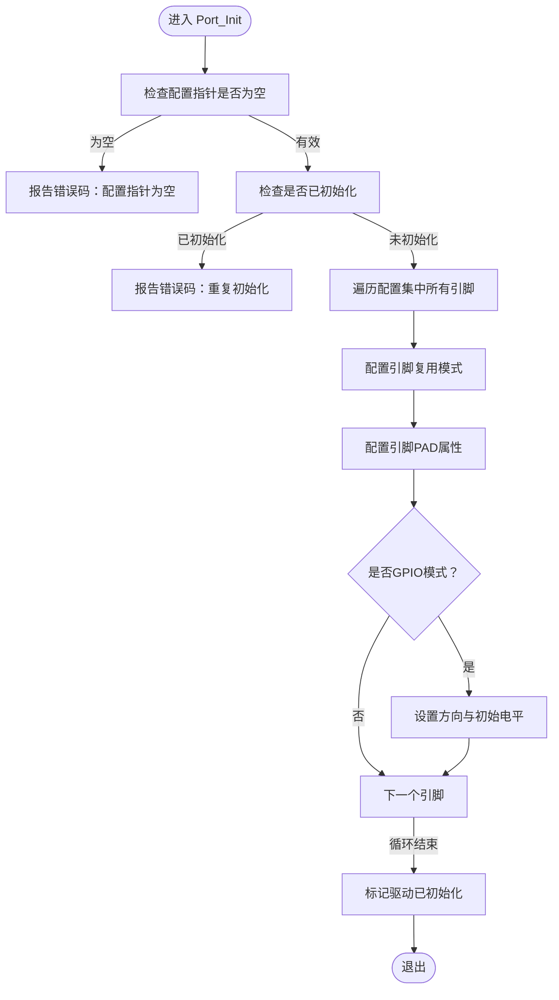
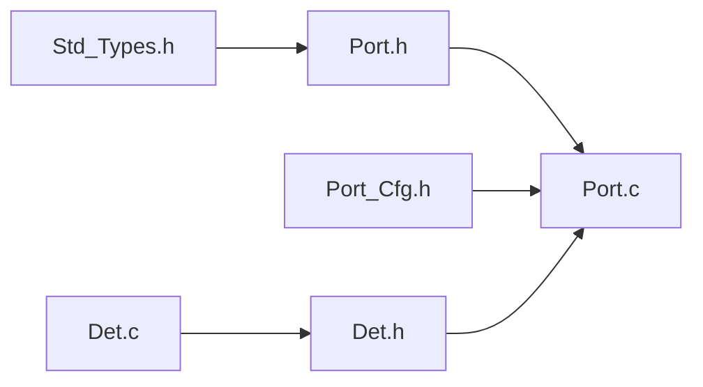

# 端口驱动(PORT)API

<cite>
**本文引用的文件**
- [Port.h](file://src/bsw/mcal/port/include/Port.h)
- [Port_Cfg.h](file://src/bsw/mcal/port/include/Port_Cfg.h)
- [Port.c](file://src/bsw/mcal/port/src/Port.c)
- [Port_Cfg.h（模板）](file://src/bsw/config/templates/Port_Cfg.h)
- [Std_Types.h](file://src/bsw/common/Std_Types.h)
- [Det.h](file://src/bsw/common/Det.h)
- [Det.c](file://src/bsw/common/Det.c)
- [api-reference.md](file://docs/api-reference.md)
- [modules.md](file://docs/modules.md)
- [main.c（LED闪烁示例）](file://examples/led_blink/main.c)
</cite>

## 目录
1. [简介](#简介)
2. [项目结构](#项目结构)
3. [核心组件](#核心组件)
4. [架构总览](#架构总览)
5. [详细组件分析](#详细组件分析)
6. [依赖关系分析](#依赖关系分析)
7. [性能考虑](#性能考虑)
8. [故障排查指南](#故障排查指南)
9. [结论](#结论)
10. [附录](#附录)

## 简介
本文件为端口驱动(PORT)模块的详细API参考文档，覆盖GPIO端口配置与管理的全部公共接口，包括端口初始化、引脚方向配置、引脚模式设置、方向刷新以及版本信息查询等能力。文档同时给出关键数据类型定义、错误码说明、典型应用场景与最佳实践建议，帮助开发者在AutoSAR MCAL层正确使用PORT驱动。

## 项目结构
PORT模块位于MCAL层，遵循AutoSAR标准，提供对微控制器端口引脚的配置与控制能力。其核心文件组织如下：
- 头文件：Port.h（对外API与类型定义）、Port_Cfg.h（编译期配置）
- 实现文件：Port.c（驱动实现）
- 示例与文档：examples/led_blink/main.c（使用PORT的示例）、docs/api-reference.md与docs/modules.md（平台API与模块说明）

图表来源
- [Port.h:1-183](file://src/bsw/mcal/port/include/Port.h#L1-L183)
- [Port.c:1-461](file://src/bsw/mcal/port/src/Port.c#L1-L461)
- [Std_Types.h:1-117](file://src/bsw/common/Std_Types.h#L1-L117)
- [Det.h:1-76](file://src/bsw/common/Det.h#L1-L76)
- [Det.c:1-88](file://src/bsw/common/Det.c#L1-L88)
- [main.c（LED闪烁示例）:1-100](file://examples/led_blink/main.c#L1-L100)
- [api-reference.md:1-609](file://docs/api-reference.md#L1-L609)
- [modules.md:1-639](file://docs/modules.md#L1-L639)

章节来源
- [Port.h:1-183](file://src/bsw/mcal/port/include/Port.h#L1-L183)
- [Port.c:1-461](file://src/bsw/mcal/port/src/Port.c#L1-L461)
- [Port_Cfg.h:1-103](file://src/bsw/mcal/port/include/Port_Cfg.h#L1-L103)
- [Port_Cfg.h（模板）:1-80](file://src/bsw/config/templates/Port_Cfg.h#L1-L80)
- [Std_Types.h:1-117](file://src/bsw/common/Std_Types.h#L1-L117)
- [Det.h:1-76](file://src/bsw/common/Det.h#L1-L76)
- [Det.c:1-88](file://src/bsw/common/Det.c#L1-L88)
- [api-reference.md:1-609](file://docs/api-reference.md#L1-L609)
- [modules.md:1-639](file://docs/modules.md#L1-L639)
- [main.c（LED闪烁示例）:1-100](file://examples/led_blink/main.c#L1-L100)

## 核心组件
- 公共API
  - Port_Init：初始化端口驱动，应用配置集并完成引脚复用、PAD属性与GPIO方向的初始设置
  - Port_SetPinDirection：在允许变更的前提下设置指定引脚的方向（输入/输出）
  - Port_RefreshPortDirection：将所有GPIO模式的引脚方向刷新为配置集中设定的方向
  - Port_GetVersionInfo：获取模块版本信息（可选）
  - Port_SetPinMode：在允许变更的前提下设置引脚模式（如GPIO、CAN、SPI、UART、I2C、PWM、ADC、ETH、USB、FLEXIO等）
- 关键数据类型
  - Port_PinType：引脚编号（16位）
  - Port_PinDirectionType：引脚方向（输入/输出）
  - Port_PinModeType：引脚模式（8位）
  - Port_PinLevelType：引脚电平（高/低）
  - Port_PinConfigType：单引脚配置结构体
  - Port_ConfigType：端口配置结构体（包含引脚数量与配置数组指针）
- 编译期配置
  - PORT_DEV_ERROR_DETECT、PORT_VERSION_INFO_API、PORT_SET_PIN_DIRECTION_API、PORT_SET_PIN_MODE_API
  - 端口数量、每端口引脚数、总引脚数
  - 引脚模式常量集合
  - 引脚编号常量集合（按端口分组）
- 错误码
  - 参数引脚越界、方向不可变、配置指针为空、模式非法、模式不可变、未初始化、参数指针为空等

章节来源
- [Port.h:36-176](file://src/bsw/mcal/port/include/Port.h#L36-L176)
- [Port.h:55-89](file://src/bsw/mcal/port/include/Port.h#L55-L89)
- [Port_Cfg.h:15-52](file://src/bsw/mcal/port/include/Port_Cfg.h#L15-L52)
- [Port_Cfg.h:57-101](file://src/bsw/mcal/port/include/Port_Cfg.h#L57-L101)

## 架构总览
PORT驱动位于MCAL层，向上为ECUAL/Service/RTE层提供端口引脚控制能力，向下直接操作硬件寄存器（IOMUXC复用寄存器、GPIO方向寄存器等）。驱动内部维护一个全局状态结构体，记录初始化状态与当前配置指针，并在启用开发错误检测时通过DET上报错误。

图表来源
- [Port.c:24-64](file://src/bsw/mcal/port/src/Port.c#L24-L64)
- [Port.c:68-82](file://src/bsw/mcal/port/src/Port.c#L68-L82)
- [Port.h:109-173](file://src/bsw/mcal/port/include/Port.h#L109-L173)

## 详细组件分析

### 函数原型与行为说明
- Port_Init(ConfigPtr)
  - 功能：初始化端口驱动，应用配置集，配置引脚复用模式、PAD电气属性，并根据GPIO模式设置引脚方向与初始电平
  - 参数：指向配置集的指针（Port_ConfigType*）
  - 返回值：无
  - 前置条件：无
  - 后置条件：驱动初始化完成，引脚按配置生效
  - 错误处理：当配置指针为空或重复初始化时，通过DET上报错误码
- Port_SetPinDirection(Pin, Direction)
  - 功能：在允许变更的前提下设置指定引脚的方向
  - 参数：引脚编号（Port_PinType），方向（Port_PinDirectionType）
  - 返回值：无
  - 错误处理：未初始化、引脚越界、方向不可变时通过DET上报相应错误码
- Port_RefreshPortDirection()
  - 功能：将所有GPIO模式的引脚方向刷新为配置集中设定的方向
  - 参数：无
  - 返回值：无
  - 错误处理：未初始化时报错
- Port_GetVersionInfo(versioninfo)
  - 功能：获取模块版本信息（可选）
  - 参数：版本信息结构体指针（Std_VersionInfoType*）
  - 返回值：无
  - 错误处理：指针为空时报错
- Port_SetPinMode(Pin, Mode)
  - 功能：在允许变更的前提下设置引脚模式
  - 参数：引脚编号（Port_PinType），模式（Port_PinModeType）
  - 返回值：无
  - 错误处理：未初始化、引脚越界、模式非法、模式不可变时报错

章节来源
- [Port.h:109-173](file://src/bsw/mcal/port/include/Port.h#L109-L173)
- [Port.c:252-306](file://src/bsw/mcal/port/src/Port.c#L252-L306)
- [Port.c:312-357](file://src/bsw/mcal/port/src/Port.c#L312-L357)
- [Port.c:362-392](file://src/bsw/mcal/port/src/Port.c#L362-L392)
- [Port.c:398-413](file://src/bsw/mcal/port/src/Port.c#L398-L413)
- [Port.c:419-457](file://src/bsw/mcal/port/src/Port.c#L419-L457)

### 数据类型与配置
- 引脚编号与方向
  - Port_PinType：引脚编号（16位）
  - Port_PinDirectionType：引脚方向（输入/输出）
  - Port_PinLevelType：引脚电平（高/低）
- 引脚配置结构体
  - Port_PinConfigType：包含引脚编号、方向、模式、方向是否可变、模式是否可变、初始电平、上下拉使能等字段
- 端口配置结构体
  - Port_ConfigType：包含引脚总数与配置数组指针
- 编译期配置
  - PORT_DEV_ERROR_DETECT、PORT_VERSION_INFO_API、PORT_SET_PIN_DIRECTION_API、PORT_SET_PIN_MODE_API
  - 端口数量、每端口引脚数、总引脚数
  - 引脚模式常量集合（GPIO、CAN、SPI、UART、I2C、PWM、ADC、ETH、USB、FLEXIO、禁用等）
  - 引脚编号常量集合（按端口分组）

章节来源
- [Port.h:55-89](file://src/bsw/mcal/port/include/Port.h#L55-L89)
- [Port_Cfg.h:15-52](file://src/bsw/mcal/port/include/Port_Cfg.h#L15-L52)
- [Port_Cfg.h:57-101](file://src/bsw/mcal/port/include/Port_Cfg.h#L57-L101)

### 错误码与开发错误检测
- 错误码
  - 参数引脚越界、方向不可变、配置指针为空、模式非法、模式不可变、未初始化、参数指针为空等
- 开发错误检测（DET）
  - 当PORT_DEV_ERROR_DETECT开启时，各API在前置条件不满足时通过Det_ReportError上报错误码

章节来源
- [Port.h:43-51](file://src/bsw/mcal/port/include/Port.h#L43-L51)
- [Port.c:254-264](file://src/bsw/mcal/port/src/Port.c#L254-L264)
- [Port.c:314-340](file://src/bsw/mcal/port/src/Port.c#L314-L340)
- [Port.c:421-452](file://src/bsw/mcal/port/src/Port.c#L421-L452)
- [Det.h:40-44](file://src/bsw/common/Det.h#L40-L44)

### API调用序列（Port_Init）

图表来源
- [Port.c:252-306](file://src/bsw/mcal/port/src/Port.c#L252-L306)

### API调用序列（Port_SetPinDirection）

图表来源
- [Port.c:312-357](file://src/bsw/mcal/port/src/Port.c#L312-L357)

### API调用序列（Port_SetPinMode）

图表来源
- [Port.c:419-457](file://src/bsw/mcal/port/src/Port.c#L419-L457)

### 端口配置流程（Port_Init）

图表来源
- [Port.c:252-306](file://src/bsw/mcal/port/src/Port.c#L252-L306)

## 依赖关系分析
- 外部依赖
  - 标准类型：Std_Types.h（定义基本数据类型与版本信息结构）
  - 错误检测：Det.h/Det.c（开发错误检测与版本信息）
- 内部依赖
  - Port.c依赖Port.h与Port_Cfg.h进行类型与配置声明
  - Port.c内部使用IOMUXC与GPIO寄存器地址常量进行硬件访问
  - Port.c内部维护全局驱动状态结构体，记录初始化状态与配置指针

图表来源
- [Port.h:1-22](file://src/bsw/mcal/port/include/Port.h#L1-L22)
- [Port.c:17-20](file://src/bsw/mcal/port/src/Port.c#L17-L20)
- [Std_Types.h:1-117](file://src/bsw/common/Std_Types.h#L1-L117)
- [Det.h:1-76](file://src/bsw/common/Det.h#L1-L76)
- [Det.c:1-88](file://src/bsw/common/Det.c#L1-L88)

章节来源
- [Port.h:1-22](file://src/bsw/mcal/port/include/Port.h#L1-L22)
- [Port.c:17-20](file://src/bsw/mcal/port/src/Port.c#L17-L20)
- [Std_Types.h:1-117](file://src/bsw/common/Std_Types.h#L1-L117)
- [Det.h:1-76](file://src/bsw/common/Det.h#L1-L76)
- [Det.c:1-88](file://src/bsw/common/Det.c#L1-L88)

## 性能考虑
- 初始化阶段
  - Port_Init会遍历配置集中所有引脚并执行寄存器写入，引脚数量越多，初始化时间越长
  - 建议在配置集中仅包含实际使用的引脚，避免不必要的初始化开销
- 运行时变更
  - Port_SetPinDirection与Port_SetPinMode在启用开发错误检测时会进行额外的参数校验与查找，频繁调用可能带来额外开销
  - 对于频繁变更的引脚，建议在初始化阶段一次性配置到位，减少运行时变更次数
- 寄存器访问
  - 驱动直接操作硬件寄存器，访问频率应合理控制，避免过度轮询

## 故障排查指南
- 常见错误与定位
  - 未初始化：调用Port_SetPinDirection、Port_RefreshPortDirection、Port_SetPinMode前必须先调用Port_Init
  - 引脚越界：确保传入的引脚编号在配置范围内
  - 方向/模式不可变：若引脚在配置中声明为不可变，则不允许在运行时修改
  - 配置指针为空：Port_Init的配置指针不能为空
  - 模式非法：设置的模式值必须在合法范围内
- 建议排查步骤
  - 确认PORT_DEV_ERROR_DETECT已开启，以便DET上报错误
  - 检查配置集中的DirectionChangeable与ModeChangeable标志位
  - 核对引脚编号常量与实际硬件引脚映射
  - 在Port_Init后立即调用Port_RefreshPortDirection以确保方向一致性

章节来源
- [Port.c:254-264](file://src/bsw/mcal/port/src/Port.c#L254-L264)
- [Port.c:314-340](file://src/bsw/mcal/port/src/Port.c#L314-L340)
- [Port.c:421-452](file://src/bsw/mcal/port/src/Port.c#L421-L452)
- [Det.h:40-44](file://src/bsw/common/Det.h#L40-L44)

## 结论
PORT模块提供了完整的GPIO端口配置与控制能力，涵盖初始化、方向设置、模式切换、方向刷新与版本信息查询等核心功能。通过合理的配置与严格的错误处理，可在AutoSAR MCAL层稳定地管理端口引脚。建议在设计阶段明确引脚用途与变更策略，充分利用配置集的可变性标志位，以获得更好的灵活性与安全性。

## 附录

### API参考速查
- Port_Init(ConfigPtr)
  - 功能：初始化端口驱动
  - 参数：Port_ConfigType*
  - 返回：无
  - 错误码：配置指针为空、重复初始化
- Port_SetPinDirection(Pin, Direction)
  - 功能：设置引脚方向
  - 参数：Port_PinType, Port_PinDirectionType
  - 返回：无
  - 错误码：未初始化、引脚越界、方向不可变
- Port_RefreshPortDirection()
  - 功能：刷新所有引脚方向
  - 参数：无
  - 返回：无
  - 错误码：未初始化
- Port_GetVersionInfo(versioninfo)
  - 功能：获取版本信息
  - 参数：Std_VersionInfoType*
  - 返回：无
  - 错误码：参数指针为空
- Port_SetPinMode(Pin, Mode)
  - 功能：设置引脚模式
  - 参数：Port_PinType, Port_PinModeType
  - 返回：无
  - 错误码：未初始化、引脚越界、模式非法、模式不可变

章节来源
- [Port.h:109-173](file://src/bsw/mcal/port/include/Port.h#L109-L173)
- [Port.c:252-306](file://src/bsw/mcal/port/src/Port.c#L252-L306)
- [Port.c:312-357](file://src/bsw/mcal/port/src/Port.c#L312-L357)
- [Port.c:362-392](file://src/bsw/mcal/port/src/Port.c#L362-L392)
- [Port.c:398-413](file://src/bsw/mcal/port/src/Port.c#L398-L413)
- [Port.c:419-457](file://src/bsw/mcal/port/src/Port.c#L419-L457)

### 配置示例与最佳实践
- 配置示例
  - 参考模板配置文件Port_Cfg.h（模板）中的预编译配置项与引脚模式定义
- 最佳实践
  - 在初始化阶段一次性完成引脚配置，避免运行时频繁变更
  - 对于需要动态切换的引脚，确保在配置集中将其DirectionChangeable与ModeChangeable设为允许
  - 使用DET进行开发错误检测，便于早期发现问题
  - 在示例工程中参考LED闪烁示例，了解如何在主程序中正确调用PORT驱动

章节来源
- [Port_Cfg.h（模板）:15-52](file://src/bsw/config/templates/Port_Cfg.h#L15-L52)
- [Port_Cfg.h（模板）:57-80](file://src/bsw/config/templates/Port_Cfg.h#L57-L80)
- [main.c（LED闪烁示例）:61-96](file://examples/led_blink/main.c#L61-L96)