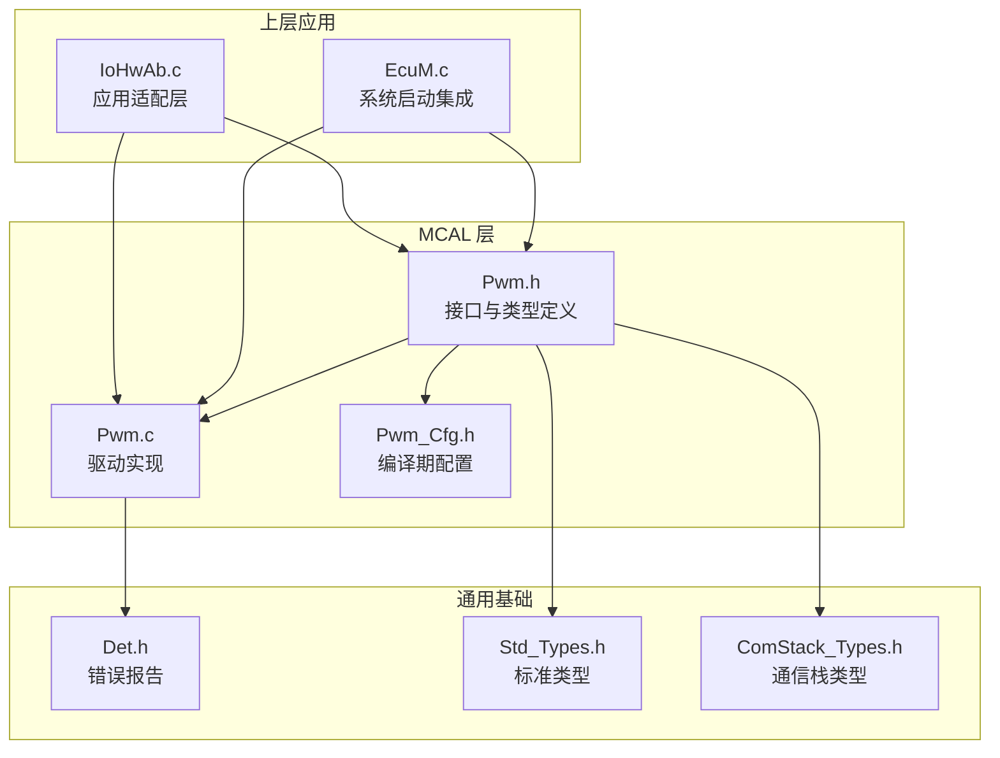
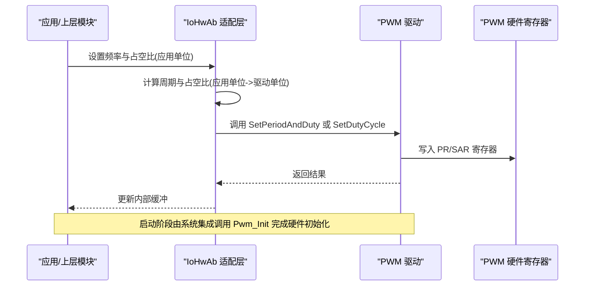
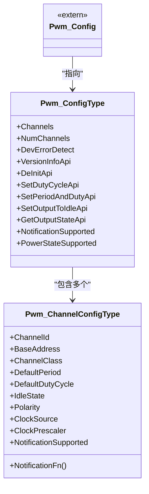
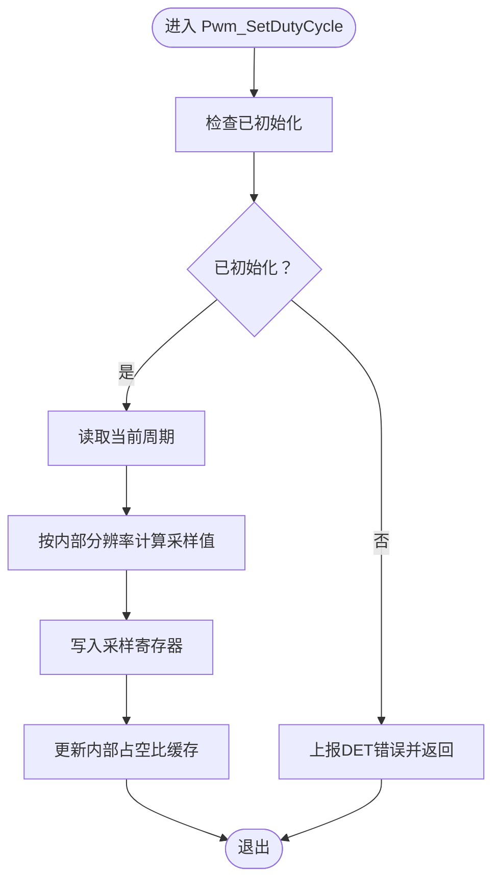
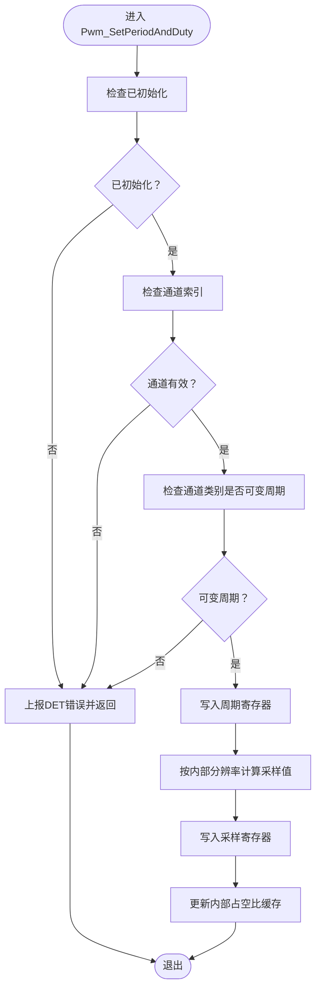
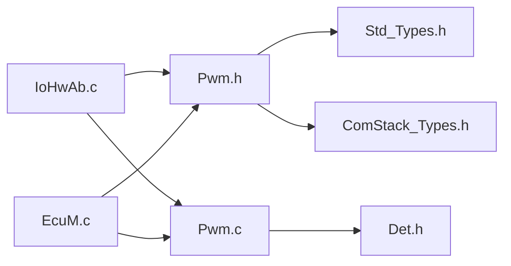

# 脉宽调制(PWM)API

<cite>
**本文引用的文件**
- [Pwm.h](file://src/bsw/mcal/pwm/include/Pwm.h)
- [Pwm.c](file://src/bsw/mcal/pwm/src/Pwm.c)
- [Pwm_Cfg.h](file://src/bsw/mcal/pwm/include/Pwm_Cfg.h)
- [IoHwAb.c](file://src/bsw/ecual/iohwab/src/IoHwAb.c)
- [EcuM.c](file://src/bsw/services/ecum/src/EcuM.c)
- [Det.h](file://src/bsw/services/det/include/Det.h)
- [Std_Types.h](file://src/bsw/os/include/Std_Types.h)
- [ComStack_Types.h](file://src/bsw/ecual/include/ComStack_Types.h)
</cite>

## 目录
1. [简介](#简介)
2. [项目结构](#项目结构)
3. [核心组件](#核心组件)
4. [架构总览](#架构总览)
5. [详细组件分析](#详细组件分析)
6. [依赖关系分析](#依赖关系分析)
7. [性能考虑](#性能考虑)
8. [故障排查指南](#故障排查指南)
9. [结论](#结论)
10. [附录](#附录)

## 简介
本文件为脉宽调制(PWM)模块的详细API参考文档，面向AutoSAR Classic平台MCAL层的PWM驱动实现。内容覆盖初始化、占空比设置、周期与占空比联合设置、输出空闲状态、输出状态查询、通知使能/禁用、版本信息获取以及电源状态管理等公共接口。文档同时解释配置参数、占空比计算、频率选择等关键概念，并提供电机控制、LED调光、音频生成等典型应用场景的使用思路与流程图。

## 项目结构
PWM模块位于MCAL层，遵循AutoSAR标准，提供与硬件无关的抽象接口，并通过配置头文件进行编译期定制。主要文件组织如下：
- 接口头文件：定义数据类型、服务ID、错误码、全局配置指针及所有对外API原型
- 实现源文件：基于寄存器操作完成初始化、占空比/周期更新、状态读取、中断通知与电源状态处理
- 配置头文件：定义编译期开关、通道数量、默认周期/占空比、时钟频率等
- 上层集成示例：在系统启动阶段调用Pwm_Init，在应用层通过IoHwAb间接使用PWM

图表来源
- [Pwm.h:1-299](file://src/bsw/mcal/pwm/include/Pwm.h#L1-L299)
- [Pwm.c:1-383](file://src/bsw/mcal/pwm/src/Pwm.c#L1-L383)
- [Pwm_Cfg.h:1-63](file://src/bsw/mcal/pwm/include/Pwm_Cfg.h#L1-L63)
- [IoHwAb.c:240-296](file://src/bsw/ecual/iohwab/src/IoHwAb.c#L240-L296)
- [EcuM.c:166-167](file://src/bsw/services/ecum/src/EcuM.c#L166-L167)
- [Det.h:1-76](file://src/bsw/services/det/include/Det.h#L1-L76)
- [Std_Types.h:1-117](file://src/bsw/os/include/Std_Types.h#L1-L117)
- [ComStack_Types.h:1-170](file://src/bsw/ecual/include/ComStack_Types.h#L1-L170)

章节来源
- [Pwm.h:1-299](file://src/bsw/mcal/pwm/include/Pwm.h#L1-L299)
- [Pwm.c:1-383](file://src/bsw/mcal/pwm/src/Pwm.c#L1-L383)
- [Pwm_Cfg.h:1-63](file://src/bsw/mcal/pwm/include/Pwm_Cfg.h#L1-L63)
- [IoHwAb.c:240-296](file://src/bsw/ecual/iohwab/src/IoHwAb.c#L240-L296)
- [EcuM.c:166-167](file://src/bsw/services/ecum/src/EcuM.c#L166-L167)
- [Det.h:1-76](file://src/bsw/services/det/include/Det.h#L1-L76)
- [Std_Types.h:1-117](file://src/bsw/os/include/Std_Types.h#L1-L117)
- [ComStack_Types.h:1-170](file://src/bsw/ecual/include/ComStack_Types.h#L1-L170)

## 核心组件
- 数据类型与枚举
  - 通道类型、周期类型、占空比类型、输出状态、边沿通知、电源状态、通道类别、空闲状态、极性、时钟源等
- 配置结构体
  - 通道配置：包含通道ID、基地址、通道类别、默认周期/占空比、空闲状态、极性、时钟源、预分频、是否支持通知、回调函数指针
  - 驱动配置：包含通道数组、通道数量、是否启用DET、各API可用性开关、版本信息API、电源状态支持等
- 全局配置指针
  - 外部声明的全局配置对象，供驱动初始化时使用
- API集合
  - 初始化、反初始化、设置占空比、设置周期与占空比、设置输出为空闲、获取输出状态、禁用/启用通知、获取版本信息、电源状态管理（设置目标/当前/准备过渡）等

章节来源
- [Pwm.h:75-190](file://src/bsw/mcal/pwm/include/Pwm.h#L75-L190)
- [Pwm.h:209-293](file://src/bsw/mcal/pwm/include/Pwm.h#L209-L293)
- [Pwm_Cfg.h:15-61](file://src/bsw/mcal/pwm/include/Pwm_Cfg.h#L15-L61)

## 架构总览
PWM驱动采用“接口头文件 + 实现源文件 + 编译期配置”的分层设计。上层通过统一接口调用，底层根据配置进行寄存器级编程。系统启动时由EcuM负责调用Pwm_Init完成硬件初始化；应用层通过IoHwAb间接使用PWM，实现从应用百分比到驱动内部分辨率的转换。

图表来源
- [IoHwAb.c:263-296](file://src/bsw/ecual/iohwab/src/IoHwAb.c#L263-L296)
- [Pwm.c:176-205](file://src/bsw/mcal/pwm/src/Pwm.c#L176-L205)
- [EcuM.c:166-167](file://src/bsw/services/ecum/src/EcuM.c#L166-L167)

## 详细组件分析

### 初始化与去初始化
- Pwm_Init
  - 功能：完成硬件复位、配置默认周期与占空比、设置时钟源与预分频、使能PWM输出
  - 参数：指向配置结构体的指针
  - 返回：无
  - 关键行为：遍历通道，写入控制寄存器、周期寄存器、采样寄存器；更新内部状态
  - 错误检测：当传入NULL或重复初始化时上报DET错误
- Pwm_DeInit
  - 功能：关闭PWM输出、禁用时钟、恢复默认状态
  - 可选：由编译期开关控制是否启用
  - 错误检测：未初始化时上报DET错误

章节来源
- [Pwm.c:84-127](file://src/bsw/mcal/pwm/src/Pwm.c#L84-L127)
- [Pwm.c:129-151](file://src/bsw/mcal/pwm/src/Pwm.c#L129-L151)
- [Pwm.h:213-218](file://src/bsw/mcal/pwm/include/Pwm.h#L213-L218)

### 占空比设置
- Pwm_SetDutyCycle
  - 功能：仅更新指定通道的占空比
  - 参数：通道ID、占空比值(内部分辨率)
  - 返回：无
  - 关键行为：读取当前周期，按内部分辨率换算后写入采样寄存器
  - 错误检测：未初始化或通道越界时报错

章节来源
- [Pwm.c:153-174](file://src/bsw/mcal/pwm/src/Pwm.c#L153-L174)
- [Pwm.h:225](file://src/bsw/mcal/pwm/include/Pwm.h#L225)

### 周期与占空比联合设置
- Pwm_SetPeriodAndDuty
  - 功能：同时设置周期与占空比
  - 参数：通道ID、周期(时钟周期数)、占空比值
  - 返回：无
  - 关键行为：检查通道类别是否可变周期；写入周期寄存器与采样寄存器
  - 错误检测：未初始化、通道越界、固定周期通道不可变周期时报错

章节来源
- [Pwm.c:177-204](file://src/bsw/mcal/pwm/src/Pwm.c#L177-L204)
- [Pwm.h:233](file://src/bsw/mcal/pwm/include/Pwm.h#L233)

### 输出空闲与状态查询
- Pwm_SetOutputToIdle
  - 功能：将输出设置为空闲(通常为0占空比)
  - 参数：通道ID
  - 返回：无
- Pwm_GetOutputState
  - 功能：读取当前输出电平状态
  - 参数：通道ID
  - 返回：输出状态枚举
  - 关键行为：比较计数器与采样值决定高低电平

章节来源
- [Pwm.c:208-226](file://src/bsw/mcal/pwm/src/Pwm.c#L208-L226)
- [Pwm.c:229-252](file://src/bsw/mcal/pwm/src/Pwm.c#L229-L252)
- [Pwm.h:239-246](file://src/bsw/mcal/pwm/include/Pwm.h#L239-L246)

### 中断通知
- Pwm_DisableNotification / Pwm_EnableNotification
  - 功能：启用/禁用上升沿/下降沿/双边沿中断
  - 参数：通道ID、边沿类型
  - 返回：无
  - 关键行为：写入中断使能寄存器对应位

章节来源
- [Pwm.c:255-298](file://src/bsw/mcal/pwm/src/Pwm.c#L255-L298)
- [Pwm.h:252-259](file://src/bsw/mcal/pwm/include/Pwm.h#L252-L259)

### 版本信息与电源状态
- Pwm_GetVersionInfo
  - 功能：填充版本信息结构体
  - 参数：版本信息指针
  - 返回：无
- 电源状态相关API
  - Pwm_SetPowerState / GetTargetPowerState / GetCurrentPowerState / PreparePowerState
  - 功能：设置目标/获取当前/准备过渡电源状态
  - 返回：结果枚举
  - 可选：由编译期开关控制是否启用

章节来源
- [Pwm.c:300-313](file://src/bsw/mcal/pwm/src/Pwm.c#L300-L313)
- [Pwm.c:316-379](file://src/bsw/mcal/pwm/src/Pwm.c#L316-L379)
- [Pwm.h:265-293](file://src/bsw/mcal/pwm/include/Pwm.h#L265-L293)

### 关键数据结构与复杂度
- 通道配置结构体
  - 字段：通道ID、基地址、通道类别、默认周期、默认占空比、空闲状态、极性、时钟源、预分频、通知支持、回调指针
  - 时间复杂度：初始化遍历O(N)，单次设置O(1)
- 驱动配置结构体
  - 字段：通道数组、通道数量、DET开关、各API可用性、版本信息API、电源状态支持
- 占空比分辨率
  - 内部分辨率：0x8000(100%)，用于将应用侧百分比映射到内部格式

图表来源
- [Pwm.h:161-190](file://src/bsw/mcal/pwm/include/Pwm.h#L161-L190)

章节来源
- [Pwm.h:161-190](file://src/bsw/mcal/pwm/include/Pwm.h#L161-L190)
- [Pwm_Cfg.h:55](file://src/bsw/mcal/pwm/include/Pwm_Cfg.h#L55)

### 使用流程与算法

#### 占空比设置流程

图表来源
- [Pwm.c:153-174](file://src/bsw/mcal/pwm/src/Pwm.c#L153-L174)

#### 周期与占空比联合设置流程

图表来源
- [Pwm.c:177-204](file://src/bsw/mcal/pwm/src/Pwm.c#L177-L204)

## 依赖关系分析
- 组件耦合
  - PWM驱动依赖配置头文件中的编译期开关与常量
  - 上层通过IoHwAb间接调用，避免直接操作硬件细节
  - 错误检测通过DET模块上报
- 外部依赖
  - 标准类型：Std_Types.h
  - 通信栈类型：ComStack_Types.h
  - 系统启动集成：EcuM.c中调用Pwm_Init

图表来源
- [IoHwAb.c:240-296](file://src/bsw/ecual/iohwab/src/IoHwAb.c#L240-L296)
- [Pwm.h:1-299](file://src/bsw/mcal/pwm/include/Pwm.h#L1-L299)
- [Pwm.c:1-383](file://src/bsw/mcal/pwm/src/Pwm.c#L1-L383)
- [Det.h:1-76](file://src/bsw/services/det/include/Det.h#L1-L76)
- [Std_Types.h:1-117](file://src/bsw/os/include/Std_Types.h#L1-L117)
- [ComStack_Types.h:1-170](file://src/bsw/ecual/include/ComStack_Types.h#L1-L170)
- [EcuM.c:166-167](file://src/bsw/services/ecum/src/EcuM.c#L166-L167)

章节来源
- [IoHwAb.c:240-296](file://src/bsw/ecual/iohwab/src/IoHwAb.c#L240-L296)
- [EcuM.c:166-167](file://src/bsw/services/ecum/src/EcuM.c#L166-L167)

## 性能考虑
- 分辨率与精度
  - 内部占空比分辨率为0x8000(100%)，可满足大多数应用的精细调节需求
- 周期与时钟
  - 默认时钟频率为24MHz；周期=时钟频率/频率，建议根据目标频率计算周期
- 中断开销
  - 通知功能可选，默认启用；在高频中断场景下应谨慎启用
- 功耗与电源状态
  - 电源状态相关API可选，默认关闭；在低功耗场景下可结合系统策略使用

## 故障排查指南
- 常见错误码
  - 参数配置无效、未初始化、通道越界、周期不可变、已初始化、指针为空、不支持的电源状态、状态转换不可能、外设未准备
- 建议排查步骤
  - 确认Pwm_Init已成功调用且未重复初始化
  - 检查通道索引与配置数组长度
  - 对于固定周期通道，避免调用设置周期接口
  - 确保传入指针非空
  - 在启用DET时关注错误上报日志

章节来源
- [Pwm.h:62-71](file://src/bsw/mcal/pwm/include/Pwm.h#L62-L71)
- [Pwm.c:86-95](file://src/bsw/mcal/pwm/src/Pwm.c#L86-L95)
- [Pwm.c:179-192](file://src/bsw/mcal/pwm/src/Pwm.c#L179-L192)
- [Det.h:40-44](file://src/bsw/services/det/include/Det.h#L40-L44)

## 结论
PWM模块提供了完整的AutoSAR兼容接口，具备灵活的配置能力与良好的可扩展性。通过编译期配置与上层适配层的配合，可在不同应用场景中高效实现精确的波形生成与控制。建议在高频应用中注意占空比分辨率与中断开销，在低功耗场景中合理使用电源状态管理接口。

## 附录

### API参考速查表
- Pwm_Init(ConfigPtr)
  - 作用：初始化PWM驱动
  - 参数：配置结构体指针
  - 返回：无
- Pwm_DeInit()
  - 作用：去初始化PWM驱动
  - 参数：无
  - 返回：无
- Pwm_SetDutyCycle(Channel, DutyCycle)
  - 作用：设置指定通道占空比
  - 参数：通道ID、占空比(内部分辨率)
  - 返回：无
- Pwm_SetPeriodAndDuty(Channel, Period, DutyCycle)
  - 作用：设置周期与占空比
  - 参数：通道ID、周期、占空比
  - 返回：无
- Pwm_SetOutputToIdle(Channel)
  - 作用：设置输出为空闲
  - 参数：通道ID
  - 返回：无
- Pwm_GetOutputState(Channel)
  - 作用：获取输出状态
  - 参数：通道ID
  - 返回：输出状态枚举
- Pwm_DisableNotification(Channel)
  - 作用：禁用通知
  - 参数：通道ID
  - 返回：无
- Pwm_EnableNotification(Channel, Notification)
  - 作用：启用通知
  - 参数：通道ID、边沿类型
  - 返回：无
- Pwm_GetVersionInfo(versioninfo)
  - 作用：获取版本信息
  - 参数：版本信息结构体指针
  - 返回：无
- Pwm_SetPowerState(PowerState, Result)
  - 作用：设置电源状态
  - 参数：目标状态、结果指针
  - 返回：无
- Pwm_GetTargetPowerState(TargetPowerState, Result)
  - 作用：获取目标电源状态
  - 参数：目标状态指针、结果指针
  - 返回：无
- Pwm_GetCurrentPowerState(CurrentPowerState, Result)
  - 作用：获取当前电源状态
  - 参数：当前状态指针、结果指针
  - 返回：无
- Pwm_PreparePowerState(PowerState, Result)
  - 作用：准备电源状态转换
  - 参数：目标状态、结果指针
  - 返回：无

章节来源
- [Pwm.h:213-293](file://src/bsw/mcal/pwm/include/Pwm.h#L213-L293)

### 应用场景与实现要点
- 电机控制
  - 通过设置占空比实现转速调节；根据负载特性选择合适的频率与死区时间
- LED调光
  - 将应用侧百分比映射到内部分辨率；注意人眼感知非线性，必要时采用指数化映射
- 音频生成
  - 通过改变频率与占空比合成音调与音色；注意采样率与分辨率对音质的影响

### 技术细节与最佳实践
- 占空比计算
  - 应用侧百分比到内部分辨率的换算：占空比(内部) = 百分比 × 0x8000 / 100%
- 频率与周期
  - 周期 = 时钟频率 / 目标频率；默认时钟频率为24MHz
- 死区时间与互补输出
  - 当前实现未直接暴露死区与互补输出配置；如需高级功能，建议在配置层扩展通道类与寄存器映射

章节来源
- [IoHwAb.c:251-252](file://src/bsw/ecual/iohwab/src/IoHwAb.c#L251-L252)
- [IoHwAb.c:282-289](file://src/bsw/ecual/iohwab/src/IoHwAb.c#L282-L289)
- [Pwm_Cfg.h:60](file://src/bsw/mcal/pwm/include/Pwm_Cfg.h#L60)