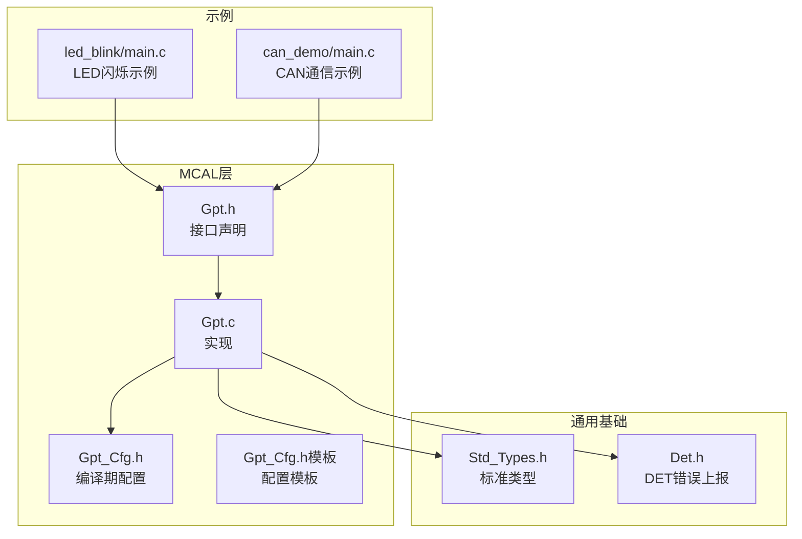
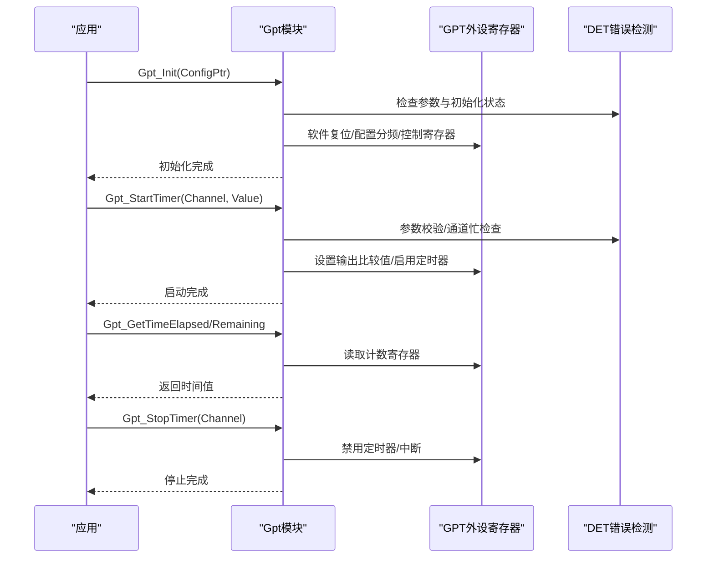
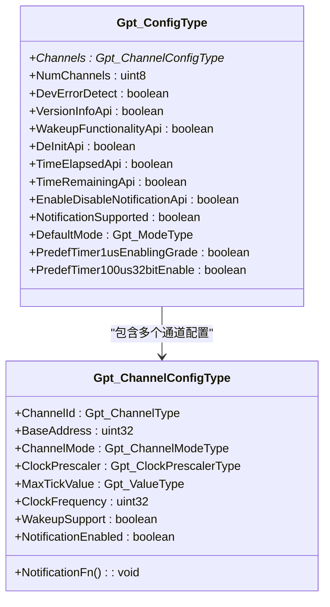
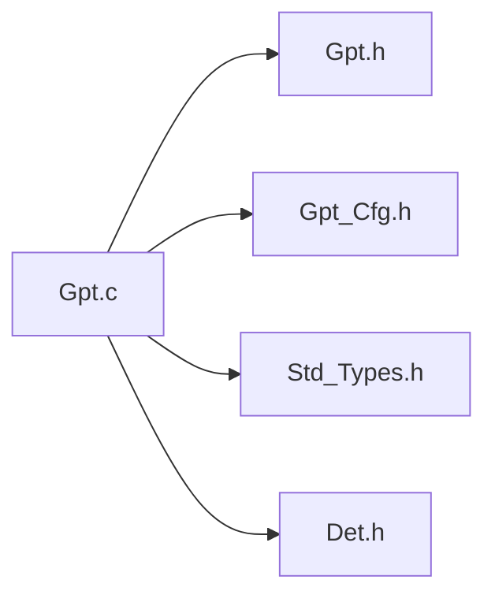

# 通用定时器(GPT)API

<cite>
**本文引用的文件**
- [Gpt.h](file://src/bsw/mcal/gpt/include/Gpt.h)
- [Gpt.c](file://src/bsw/mcal/gpt/src/Gpt.c)
- [Gpt_Cfg.h](file://src/bsw/mcal/gpt/include/Gpt_Cfg.h)
- [Gpt_Cfg.h（模板）](file://src/bsw/config/templates/Gpt_Cfg.h)
- [Std_Types.h](file://src/bsw/common/Std_Types.h)
- [Det.h](file://src/bsw/common/Det.h)
- [main.c（LED闪烁示例）](file://examples/led_blink/main.c)
- [main.c（CAN通信示例）](file://examples/can_demo/main.c)
- [api-reference.md](file://docs/api-reference.md)
</cite>

## 目录
1. [简介](#简介)
2. [项目结构](#项目结构)
3. [核心组件](#核心组件)
4. [架构总览](#架构总览)
5. [详细组件分析](#详细组件分析)
6. [依赖关系分析](#依赖关系分析)
7. [性能考虑](#性能考虑)
8. [故障排查指南](#故障排查指南)
9. [结论](#结论)
10. [附录](#附录)

## 简介
本文件为通用定时器（GPT）模块的详细API参考文档，面向AutoSAR Classic平台MCAL层，基于i.MX8M Mini的GPT外设实现。文档覆盖初始化、启动/停止、时间查询、中断通知、模式切换、唤醒支持以及预定义定时器读取等全部公共接口，并提供定时器配置、周期设置、中断回调等关键概念的说明与实践示例路径，帮助开发者在嵌入式系统中高效使用GPT进行延时、周期任务调度与PWM生成等场景。

## 项目结构
GPT模块位于MCAL层，遵循AutoSAR标准，主要由头文件接口、源文件实现、配置头文件与示例组成：
- 接口头文件：对外暴露API与数据类型定义
- 实现文件：硬件寄存器访问、状态机与错误检测
- 配置头文件：编译期开关、通道数量、时钟频率、预定义定时器能力等
- 示例：LED闪烁与CAN通信示例展示GPT回调与定时器使用

图表来源
- [Gpt.h:174-261](file://src/bsw/mcal/gpt/include/Gpt.h#L174-L261)
- [Gpt.c:9-12](file://src/bsw/mcal/gpt/src/Gpt.c#L9-L12)
- [Gpt_Cfg.h:15-64](file://src/bsw/mcal/gpt/include/Gpt_Cfg.h#L15-L64)
- [Gpt_Cfg.h（模板）:20-76](file://src/bsw/config/templates/Gpt_Cfg.h#L20-L76)
- [Std_Types.h:23-80](file://src/bsw/common/Std_Types.h#L23-L80)
- [Det.h:51-70](file://src/bsw/common/Det.h#L51-L70)
- [main.c（LED闪烁示例）:61-99](file://examples/led_blink/main.c#L61-L99)
- [main.c（CAN通信示例）:63-118](file://examples/can_demo/main.c#L63-L118)

章节来源
- [Gpt.h:1-267](file://src/bsw/mcal/gpt/include/Gpt.h#L1-L267)
- [Gpt.c:1-473](file://src/bsw/mcal/gpt/src/Gpt.c#L1-L473)
- [Gpt_Cfg.h:1-66](file://src/bsw/mcal/gpt/include/Gpt_Cfg.h#L1-L66)
- [Gpt_Cfg.h（模板）:1-77](file://src/bsw/config/templates/Gpt_Cfg.h#L1-L77)
- [Std_Types.h:1-117](file://src/bsw/common/Std_Types.h#L1-L117)
- [Det.h:1-76](file://src/bsw/common/Det.h#L1-L76)
- [main.c（LED闪烁示例）:1-100](file://examples/led_blink/main.c#L1-L100)
- [main.c（CAN通信示例）:1-119](file://examples/can_demo/main.c#L1-L119)

## 核心组件
- 公共接口函数族
  - 初始化与去初始化：Gpt_Init、Gpt_DeInit
  - 时间查询：Gpt_GetTimeElapsed、Gpt_GetTimeRemaining
  - 定时器控制：Gpt_StartTimer、Gpt_StopTimer
  - 中断通知：Gpt_EnableNotification、Gpt_DisableNotification
  - 模式与唤醒：Gpt_SetMode、Gpt_EnableWakeup、Gpt_DisableWakeup、Gpt_CheckWakeup
  - 版本信息：Gpt_GetVersionInfo
  - 预定义定时器：Gpt_GetPredefTimerValue
- 关键数据类型
  - 通道类型、数值类型、模式类型、预定义定时器类型、通道模式类型、时钟分频类型
  - 通道配置结构体、全局配置结构体
- 配置开关
  - 编译期开关控制各API可用性、错误检测、唤醒功能、预定义定时器能力等
- 错误码与DET集成
  - DET错误码与服务ID，统一错误上报

章节来源
- [Gpt.h:174-261](file://src/bsw/mcal/gpt/include/Gpt.h#L174-L261)
- [Gpt.c:113-469](file://src/bsw/mcal/gpt/src/Gpt.c#L113-L469)
- [Gpt_Cfg.h:15-64](file://src/bsw/mcal/gpt/include/Gpt_Cfg.h#L15-L64)
- [Det.h:40-70](file://src/bsw/common/Det.h#L40-L70)

## 架构总览
GPT驱动通过直接寄存器访问控制GPT外设，内部维护每个通道的目标值、已耗时、运行状态；支持中断通知回调；根据配置决定API可用性与功能特性。

图表来源
- [Gpt.c:113-314](file://src/bsw/mcal/gpt/src/Gpt.c#L113-L314)
- [Gpt.h:174-222](file://src/bsw/mcal/gpt/include/Gpt.h#L174-L222)
- [Det.h:51-59](file://src/bsw/common/Det.h#L51-L59)

## 详细组件分析

### Gpt_Init 初始化
- 函数签名与作用
  - Gpt_Init(const Gpt_ConfigType* ConfigPtr)
  - 初始化GPT驱动，配置各通道的时钟分频、控制寄存器、中断屏蔽与状态变量
- 参数说明
  - ConfigPtr：指向全局配置结构体的指针，包含通道数组、数量、功能开关、默认模式等
- 返回值定义
  - 无返回值；若启用DET且参数非法或重复初始化，将通过DET上报错误
- 使用要点
  - 必须在调用任何其他GPT API前调用
  - 若配置为空指针或驱动已初始化，将触发错误上报
- 示例路径
  - [LED闪烁示例中的初始化流程:82-85](file://examples/led_blink/main.c#L82-L85)

章节来源
- [Gpt.h:174-178](file://src/bsw/mcal/gpt/include/Gpt.h#L174-L178)
- [Gpt.c:113-162](file://src/bsw/mcal/gpt/src/Gpt.c#L113-L162)
- [Det.h:51-59](file://src/bsw/common/Det.h#L51-L59)
- [main.c（LED闪烁示例）:82-85](file://examples/led_blink/main.c#L82-L85)

### Gpt_StartTimer 启动定时器
- 函数签名与作用
  - Gpt_StartTimer(Gpt_ChannelType Channel, Gpt_ValueType Value)
  - 启动指定通道的定时器，设置目标值并可启用中断通知
- 参数说明
  - Channel：通道编号（0~GPT_NUM_CHANNELS-1）
  - Value：超时值（ticks），需大于0且不超过通道最大tick值
- 返回值定义
  - 无返回值；若参数非法或通道忙，将触发错误上报
- 使用要点
  - 启动前确保通道未处于运行状态
  - 若通道配置了通知回调，启动时会自动启用对应中断位
- 示例路径
  - [LED闪烁示例中的启动与使能通知:87-89](file://examples/led_blink/main.c#L87-L89)

章节来源
- [Gpt.h:200-204](file://src/bsw/mcal/gpt/include/Gpt.h#L200-L204)
- [Gpt.c:245-286](file://src/bsw/mcal/gpt/src/Gpt.c#L245-L286)
- [Det.h:51-59](file://src/bsw/common/Det.h#L51-L59)
- [main.c（LED闪烁示例）:87-89](file://examples/led_blink/main.c#L87-L89)

### Gpt_StopTimer 停止定时器
- 函数签名与作用
  - Gpt_StopTimer(Gpt_ChannelType Channel)
  - 停止指定通道的定时器，禁用中断并清除运行状态
- 参数说明
  - Channel：通道编号
- 返回值定义
  - 无返回值；若未初始化或通道越界，将触发错误上报
- 使用要点
  - 停止后通道不再计时，可用于资源回收或重新配置

章节来源
- [Gpt.h:206-210](file://src/bsw/mcal/gpt/include/Gpt.h#L206-L210)
- [Gpt.c:288-314](file://src/bsw/mcal/gpt/src/Gpt.c#L288-L314)
- [Det.h:51-59](file://src/bsw/common/Det.h#L51-L59)

### Gpt_GetTimeElapsed/Gpt_GetTimeRemaining 时间查询
- 函数签名与作用
  - Gpt_GetTimeElapsed(Gpt_ChannelType Channel)：返回自定时器启动以来的累计ticks
  - Gpt_GetTimeRemaining(Gpt_ChannelType Channel)：返回当前通道剩余ticks（仅在运行中有效）
- 参数说明
  - Channel：通道编号
- 返回值定义
  - 返回ticks值；若未初始化或通道越界，将触发错误上报
- 使用要点
  - 仅在启用相应API时可用（由配置开关控制）

章节来源
- [Gpt.h:185-197](file://src/bsw/mcal/gpt/include/Gpt.h#L185-L197)
- [Gpt.c:197-243](file://src/bsw/mcal/gpt/src/Gpt.c#L197-L243)
- [Det.h:51-59](file://src/bsw/common/Det.h#L51-L59)

### Gpt_EnableNotification/Gpt_DisableNotification 中断通知
- 函数签名与作用
  - Gpt_EnableNotification(Gpt_ChannelType Channel)：启用通道中断
  - Gpt_DisableNotification(Gpt_ChannelType Channel)：禁用通道中断
- 参数说明
  - Channel：通道编号
- 返回值定义
  - 无返回值；若未初始化或通道越界，将触发错误上报
- 使用要点
  - 通常与Gpt_StartTimer配合使用；通道配置中可设置NotificationEnabled以影响启动时的默认行为

章节来源
- [Gpt.h:212-222](file://src/bsw/mcal/gpt/include/Gpt.h#L212-L222)
- [Gpt.c:317-360](file://src/bsw/mcal/gpt/src/Gpt.c#L317-L360)
- [Det.h:51-59](file://src/bsw/common/Det.h#L51-L59)

### Gpt_SetMode 模式设置
- 函数签名与作用
  - Gpt_SetMode(Gpt_ModeType Mode)：设置驱动模式（正常/睡眠）
- 参数说明
  - Mode：模式枚举（GPT_MODE_NORMAL/GPT_MODE_SLEEP）
- 返回值定义
  - 无返回值；若未初始化，将触发错误上报
- 使用要点
  - 设置为睡眠模式时，会停止所有正在运行的通道

章节来源
- [Gpt.h:230-234](file://src/bsw/mcal/gpt/include/Gpt.h#L230-L234)
- [Gpt.c:377-396](file://src/bsw/mcal/gpt/src/Gpt.c#L377-L396)
- [Det.h:51-59](file://src/bsw/common/Det.h#L51-L59)

### Gpt_GetVersionInfo 版本信息
- 函数签名与作用
  - Gpt_GetVersionInfo(Std_VersionInfoType* versioninfo)
  - 获取模块版本信息（供应商ID、模块ID、主/次/补丁版本）
- 参数说明
  - versioninfo：版本信息结构体指针
- 返回值定义
  - 无返回值；若指针为空，将触发错误上报
- 使用要点
  - 由配置开关控制是否启用该API

章节来源
- [Gpt.h:224-228](file://src/bsw/mcal/gpt/include/Gpt.h#L224-L228)
- [Gpt.c:362-375](file://src/bsw/mcal/gpt/src/Gpt.c#L362-L375)
- [Det.h:51-59](file://src/bsw/common/Det.h#L51-L59)

### Gpt_GetPredefTimerValue 预定义定时器
- 函数签名与作用
  - Gpt_GetPredefTimerValue(Gpt_PredefTimerType PredefTimer, uint32* TimeValuePtr)
  - 读取预定义定时器的当前值（如1μs/100μs计数器）
- 参数说明
  - PredefTimer：预定义定时器类型
  - TimeValuePtr：用于存储读取到的时间值
- 返回值定义
  - 返回标准返回类型；若未初始化或指针为空，将触发错误上报
- 使用要点
  - 由配置开关控制不同精度的预定义定时器能力

章节来源
- [Gpt.h:255-261](file://src/bsw/mcal/gpt/include/Gpt.h#L255-L261)
- [Gpt.c:450-469](file://src/bsw/mcal/gpt/src/Gpt.c#L450-L469)
- [Det.h:51-59](file://src/bsw/common/Det.h#L51-L59)

### 配置与数据模型
- 通道配置结构体
  - 包含通道ID、基地址、通道模式（连续/单次）、时钟分频、最大tick值、时钟频率、唤醒支持、通知使能与回调函数指针
- 全局配置结构体
  - 包含通道数组、数量、功能开关（错误检测、版本信息、去初始化、时间查询、通知、唤醒）、默认模式、预定义定时器能力等
- 配置开关
  - 通过Gpt_Cfg.h控制各API可用性与功能特性

图表来源
- [Gpt.h:126-155](file://src/bsw/mcal/gpt/include/Gpt.h#L126-L155)
- [Gpt_Cfg.h:15-64](file://src/bsw/mcal/gpt/include/Gpt_Cfg.h#L15-L64)

章节来源
- [Gpt.h:126-155](file://src/bsw/mcal/gpt/include/Gpt.h#L126-L155)
- [Gpt_Cfg.h:15-64](file://src/bsw/mcal/gpt/include/Gpt_Cfg.h#L15-L64)

### 关键概念与技术细节
- 定时器配置
  - 通道模式：连续模式与单次模式
  - 时钟分频：支持1/2/4/8/16/32/64/128分频
  - 最大tick值：受硬件计数宽度限制
- 周期设置
  - 通过设置输出比较寄存器实现周期控制
  - 启动时写入OCR寄存器并启用定时器
- 中断回调
  - 通道配置中可设置通知回调函数指针
  - 启动时根据配置自动启用对应中断位
- 计数器模式与时钟源
  - 驱动实现采用自由运行模式（Free-Run），计数器从0递增
  - 时钟源选择与分频由配置决定
- 精度优化
  - 通过合适的时钟分频与预定义定时器能力提升精度
  - 预定义定时器支持1μs/100μs等高精度计数

章节来源
- [Gpt.h:86-121](file://src/bsw/mcal/gpt/include/Gpt.h#L86-L121)
- [Gpt.c:139-157](file://src/bsw/mcal/gpt/src/Gpt.c#L139-L157)
- [Gpt_Cfg.h:53-58](file://src/bsw/mcal/gpt/include/Gpt_Cfg.h#L53-L58)

### 实际应用场景
- 延时功能
  - 使用Gpt_StartTimer与Gpt_GetTimeElapsed/Remaining实现毫秒级或微秒级延时
  - 示例路径：[LED闪烁示例:37-56](file://examples/led_blink/main.c#L37-L56)
- 定时任务调度
  - 在中断回调中执行周期性任务，结合Gpt_GetTimeElapsed进行节拍统计
  - 示例路径：[LED闪烁示例主循环:92-96](file://examples/led_blink/main.c#L92-L96)
- PWM生成（间接）
  - GPT通道可作为PWM输出的计数基准，结合PWM模块实现精确占空比控制
  - PWM模块接口参考：[Pwm.h:213-233](file://src/bsw/mcal/pwm/include/Pwm.h#L213-L233)

章节来源
- [main.c（LED闪烁示例）:37-56](file://examples/led_blink/main.c#L37-L56)
- [main.c（LED闪烁示例）:92-96](file://examples/led_blink/main.c#L92-L96)
- [Pwm.h:213-233](file://src/bsw/mcal/pwm/include/Pwm.h#L213-L233)

## 依赖关系分析
- 外部依赖
  - 标准类型：Std_Types.h（返回类型、布尔、版本信息结构）
  - 错误检测：Det.h（错误上报与版本信息）
- 内部耦合
  - Gpt.c依赖Gpt.h与Gpt_Cfg.h提供的类型与配置
  - 驱动内部维护静态状态数组（通道目标值、已耗时、运行状态）
- 配置与实现解耦
  - 通过配置头文件控制API可用性与功能特性，便于裁剪与移植

图表来源
- [Gpt.c:9-12](file://src/bsw/mcal/gpt/src/Gpt.c#L9-L12)
- [Gpt.h:19-20](file://src/bsw/mcal/gpt/include/Gpt.h#L19-L20)
- [Gpt_Cfg.h:15-26](file://src/bsw/mcal/gpt/include/Gpt_Cfg.h#L15-L26)
- [Std_Types.h:23-80](file://src/bsw/common/Std_Types.h#L23-L80)
- [Det.h:51-70](file://src/bsw/common/Det.h#L51-L70)

章节来源
- [Gpt.c:9-12](file://src/bsw/mcal/gpt/src/Gpt.c#L9-L12)
- [Gpt.h:19-20](file://src/bsw/mcal/gpt/include/Gpt.h#L19-L20)
- [Gpt_Cfg.h:15-26](file://src/bsw/mcal/gpt/include/Gpt_Cfg.h#L15-L26)
- [Std_Types.h:23-80](file://src/bsw/common/Std_Types.h#L23-L80)
- [Det.h:51-70](file://src/bsw/common/Det.h#L51-L70)

## 性能考虑
- 时钟分频与精度
  - 合理选择时钟分频可在精度与计数范围之间取得平衡
  - 预定义定时器能力可减少软件计算开销
- 中断开销
  - 仅在需要时启用通知，避免不必要的中断处理
- 状态查询
  - Gpt_GetTimeElapsed/Remaining为轻量级寄存器读取，适合高频调用
- 去初始化约束
  - 去初始化前需确保所有通道均停止，避免硬件状态不一致

## 故障排查指南
- 常见错误码与定位
  - 参数错误：指针为空、通道越界、值非法、模式非法
  - 状态错误：重复初始化、未初始化、通道忙、初始化失败
  - 唤醒与通知：功能未启用或通道不支持
- 排查步骤
  - 确认Gpt_Init已正确调用且配置有效
  - 检查通道是否已在运行（避免重复启动）
  - 核对Value范围与MaxTickValue配置
  - 验证通知回调与中断使能设置
- 相关DET错误码
  - GPT_E_PARAM_POINTER、GPT_E_PARAM_CHANNEL、GPT_E_PARAM_VALUE、GPT_E_PARAM_MODE、GPT_E_ALREADY_INITIALIZED、GPT_E_CHANNEL_BUSY、GPT_E_UNINIT、GPT_E_INIT_FAILED、GPT_E_PARAM_CONFIG

章节来源
- [Gpt.h:62-71](file://src/bsw/mcal/gpt/include/Gpt.h#L62-L71)
- [Gpt.c:115-124](file://src/bsw/mcal/gpt/src/Gpt.c#L115-L124)
- [Det.h:40-70](file://src/bsw/common/Det.h#L40-L70)

## 结论
GPT模块提供了完整的MCAL定时器接口，具备灵活的配置能力与完善的错误检测机制。通过合理的配置与使用，可满足从毫秒级延时到微秒级高精度计数的应用需求，并为上层模块（如PWM、OS）提供稳定的时间基准。建议在项目初期明确时钟分频与预定义定时器能力，结合示例工程快速落地。

## 附录

### API一览表
- 初始化与去初始化
  - Gpt_Init、Gpt_DeInit
- 时间查询
  - Gpt_GetTimeElapsed、Gpt_GetTimeRemaining
- 定时器控制
  - Gpt_StartTimer、Gpt_StopTimer
- 中断通知
  - Gpt_EnableNotification、Gpt_DisableNotification
- 模式与唤醒
  - Gpt_SetMode、Gpt_EnableWakeup、Gpt_DisableWakeup、Gpt_CheckWakeup
- 版本信息
  - Gpt_GetVersionInfo
- 预定义定时器
  - Gpt_GetPredefTimerValue

章节来源
- [Gpt.h:174-261](file://src/bsw/mcal/gpt/include/Gpt.h#L174-L261)

### 配置开关对照
- GPT_DEV_ERROR_DETECT：开发错误检测
- GPT_VERSION_INFO_API：版本信息API
- GPT_DEINIT_API：去初始化API
- GPT_TIME_ELAPSED_API：时间已过查询
- GPT_TIME_REMAINING_API：剩余时间查询
- GPT_ENABLE_DISABLE_NOTIFICATION_API：通知启停
- GPT_WAKEUP_FUNCTIONALITY_API：唤醒功能
- GPT_REPORT_WAKEUP_SOURCE：唤醒源上报
- GPT_PREDEF_TIMER_1US_16BIT_ENABLE：1μs 16位预定义定时器
- GPT_PREDEF_TIMER_1US_24BIT_ENABLE：1μs 24位预定义定时器
- GPT_PREDEF_TIMER_1US_32BIT_ENABLE：1μs 32位预定义定时器
- GPT_PREDEF_TIMER_100US_32BIT_ENABLE：100μs 32位预定义定时器

章节来源
- [Gpt_Cfg.h:15-26](file://src/bsw/mcal/gpt/include/Gpt_Cfg.h#L15-L26)
- [Gpt_Cfg.h（模板）:20-30](file://src/bsw/config/templates/Gpt_Cfg.h#L20-L30)