# 应用软件层(ASW)API

<cite>
**本文档引用的文件**
- [asw_interfaces.h](file://src/asw/asw_interfaces.h)
- [Swc_EngineControl.h](file://src/asw/engine_control/include/Swc_EngineControl.h)
- [Swc_EngineControl.c](file://src/asw/engine_control/src/Swc_EngineControl.c)
- [Swc_CommunicationManager.h](file://src/asw/communication_manager/include/Swc_CommunicationManager.h)
- [Swc_CommunicationManager.c](file://src/asw/communication_manager/src/Swc_CommunicationManager.c)
- [Swc_DiagnosticManager.h](file://src/asw/diagnostic_manager/include/Swc_DiagnosticManager.h)
- [Swc_DiagnosticManager.c](file://src/asw/diagnostic_manager/src/Swc_DiagnosticManager.c)
- [Swc_IOControl.h](file://src/asw/io_control/include/Swc_IOControl.h)
- [Swc_IOControl.c](file://src/asw/io_control/src/Swc_IOControl.c)
- [Swc_ModeManager.h](file://src/asw/mode_manager/include/Swc_ModeManager.h)
- [Swc_ModeManager.c](file://src/asw/mode_manager/src/Swc_ModeManager.c)
- [Swc_StorageManager.h](file://src/asw/storage_manager/include/Swc_StorageManager.h)
- [Swc_StorageManager.c](file://src/asw/storage_manager/src/Swc_StorageManager.c)
- [Swc_VehicleDynamics.h](file://src/asw/vehicle_dynamics/include/Swc_VehicleDynamics.h)
- [Swc_VehicleDynamics.c](file://src/asw/vehicle_dynamics/src/Swc_VehicleDynamics.c)
- [Swc_WatchdogManager.h](file://src/asw/watchdog_manager/include/Swc_WatchdogManager.h)
- [Swc_WatchdogManager.c](file://src/asw/watchdog_manager/src/Swc_WatchdogManager.c)
</cite>

## 目录
1. [简介](#简介)
2. [项目结构](#项目结构)
3. [核心组件](#核心组件)
4. [架构概览](#架构概览)
5. [详细组件分析](#详细组件分析)
6. [依赖分析](#依赖分析)
7. [性能考虑](#性能考虑)
8. [故障排除指南](#故障排除指南)
9. [结论](#结论)

## 简介

本文件为应用软件层(ASW)的完整API参考文档，涵盖8个核心组件的详细接口规范。这些组件基于AUTOSAR Classic Platform 4.x标准设计，采用模块化架构，通过RTE(Run-Time Environment)进行组件间通信。

ASW层负责车辆系统的应用级功能实现，包括引擎控制、通信管理、诊断服务、输入输出控制、模式管理、存储管理、车辆动力学控制和看门狗监控等功能。每个组件都实现了标准化的API接口，支持实时运行和错误处理机制。

## 项目结构

ASW项目采用分层模块化架构，每个组件独立封装，具有清晰的职责边界：

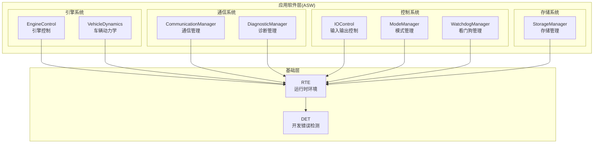

**图表来源**
- [asw_interfaces.h:1-314](file://src/asw/asw_interfaces.h#L1-L314)
- [Swc_EngineControl.h:1-183](file://src/asw/engine_control/include/Swc_EngineControl.h#L1-L183)
- [Swc_CommunicationManager.h:1-222](file://src/asw/communication_manager/include/Swc_CommunicationManager.h#L1-L222)

**章节来源**
- [asw_interfaces.h:1-314](file://src/asw/asw_interfaces.h#L1-L314)

## 核心组件

ASW层包含8个核心组件，每个组件都有明确的功能职责和标准化接口：

### 引擎控制组件 (EngineControl)
- **职责**: 发动机状态管理、燃料喷射计算、点火时机控制
- **关键特性**: 多模式控制(正常、经济、运动、故障保护)
- **数据类型**: 引擎状态、参数、控制输出

### 车辆动力学组件 (VehicleDynamics)
- **职责**: 车辆稳定性控制、防抱死制动、牵引力控制
- **关键特性**: VDC(车辆动态控制)系统、滑移率计算
- **数据类型**: 车辆运动状态、控制输出

### 通信管理组件 (CommunicationManager)
- **职责**: 车载网络通信、信号路由、PDU处理
- **关键特性**: 多总线支持(CAN、LIN、FlexRay、以太网)
- **数据类型**: 信号值、PDU信息、通信统计

### 诊断管理组件 (DiagnosticManager)
- **职责**: OBD诊断服务、DTC管理、安全访问
- **关键特性**: 多会话支持、安全级别管理
- **数据类型**: 诊断请求/响应、DTC状态

### 输入输出控制组件 (IOControl)
- **职责**: 数字/模拟/PWM信号处理
- **关键特性**: 去抖动、多通道支持
- **数据类型**: 数字/模拟/PWM值

### 模式管理组件 (ModeManager)
- **职责**: 系统模式协调、组件状态同步
- **关键特性**: 模式转换验证、超时处理
- **数据类型**: 系统模式、组件通知

### 存储管理组件 (StorageManager)
- **职责**: 非易失性存储管理、数据持久化
- **关键特性**: CRC校验、写保护、磨损均衡
- **数据类型**: 存储块状态、统计信息

### 看门狗管理组件 (WatchdogManager)
- **职责**: 系统监控、实体存活指示、硬件看门狗触发
- **关键特性**: 多实体监督、窗口模式
- **数据类型**: 监督实体状态、看门狗状态

**章节来源**
- [Swc_EngineControl.h:25-67](file://src/asw/engine_control/include/Swc_EngineControl.h#L25-L67)
- [Swc_VehicleDynamics.h:25-71](file://src/asw/vehicle_dynamics/include/Swc_VehicleDynamics.h#L25-L71)
- [Swc_CommunicationManager.h:25-101](file://src/asw/communication_manager/include/Swc_CommunicationManager.h#L25-L101)
- [Swc_DiagnosticManager.h:25-87](file://src/asw/diagnostic_manager/include/Swc_DiagnosticManager.h#L25-L87)
- [Swc_IOControl.h:25-104](file://src/asw/io_control/include/Swc_IOControl.h#L25-L104)
- [Swc_ModeManager.h:25-83](file://src/asw/mode_manager/include/Swc_ModeManager.h#L25-L83)
- [Swc_StorageManager.h:25-84](file://src/asw/storage_manager/include/Swc_StorageManager.h#L25-L84)
- [Swc_WatchdogManager.h:25-87](file://src/asw/watchdog_manager/include/Swc_WatchdogManager.h#L25-L87)

## 架构概览

ASW组件采用分层架构设计，通过标准化接口实现松耦合集成：

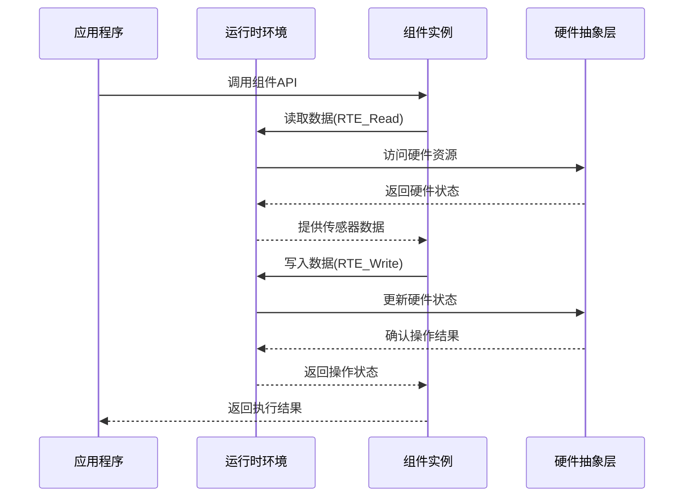

**图表来源**
- [Swc_EngineControl.c:360-394](file://src/asw/engine_control/src/Swc_EngineControl.c#L360-L394)
- [Swc_CommunicationManager.c:295-340](file://src/asw/communication_manager/src/Swc_CommunicationManager.c#L295-L340)

### 数据流架构

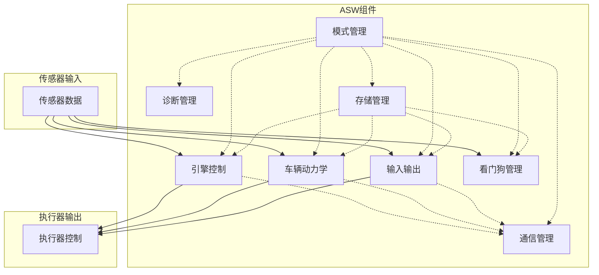

**图表来源**
- [asw_interfaces.h:25-314](file://src/asw/asw_interfaces.h#L25-L314)

## 详细组件分析

### 引擎控制组件 (EngineControl)

#### 功能职责
引擎控制组件负责发动机的全生命周期管理，包括启动、运行、停止和故障保护状态转换。

#### 核心数据结构
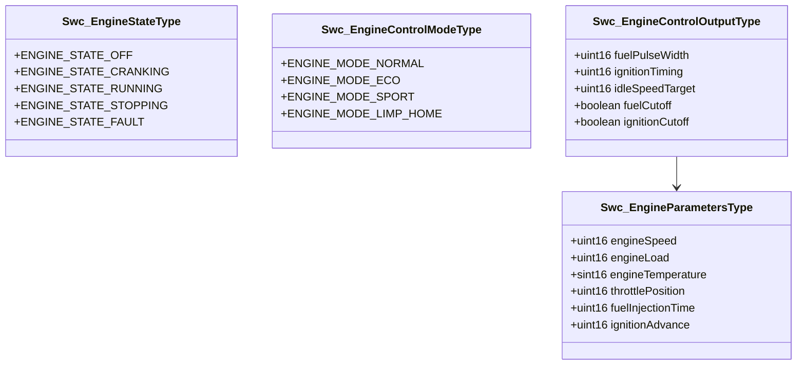

**图表来源**
- [Swc_EngineControl.h:28-67](file://src/asw/engine_control/include/Swc_EngineControl.h#L28-L67)

#### 关键API接口
- **初始化函数**: `Swc_EngineControl_Init()` - 组件初始化和状态重置
- **周期性函数**: 
  - `Swc_EngineControl_10ms()` - 快速控制循环(10ms)
  - `Swc_EngineControl_100ms()` - 慢速控制循环(100ms)
  - `Swc_EngineControl_StateMachine()` - 状态机更新
- **查询函数**:
  - `Swc_EngineControl_GetEngineState()` - 获取当前引擎状态
  - `Swc_EngineControl_GetEngineParameters()` - 获取引擎参数
  - `Swc_EngineControl_SetControlMode()` - 设置控制模式

#### 实际应用场景
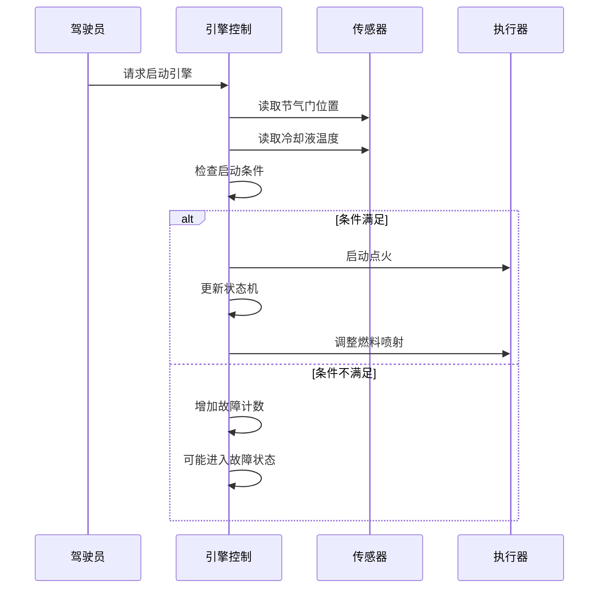

**图表来源**
- [Swc_EngineControl.c:152-202](file://src/asw/engine_control/src/Swc_EngineControl.c#L152-L202)

**章节来源**
- [Swc_EngineControl.h:93-151](file://src/asw/engine_control/include/Swc_EngineControl.h#L93-L151)
- [Swc_EngineControl.c:318-407](file://src/asw/engine_control/src/Swc_EngineControl.c#L318-L407)

### 车辆动力学组件 (VehicleDynamics)

#### 功能职责
车辆动力学组件实现VDC(车辆动态控制)系统，提供稳定性控制、防抱死制动和牵引力控制功能。

#### 核心数据结构
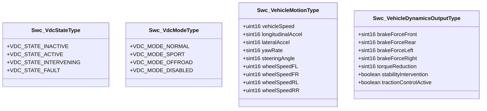

**图表来源**
- [Swc_VehicleDynamics.h:25-71](file://src/asw/vehicle_dynamics/include/Swc_VehicleDynamics.h#L25-L71)

#### 关键算法实现
组件实现了复杂的车辆动力学算法：

1. **滑移率计算**: `(轮速 - 车速) / 车速 * 100`
2. **稳定性判断**: 基于偏航率误差和横向加速度阈值
3. **制动力分配**: 根据转向意图和稳定性需求分配前后轮制动力

#### 实际应用场景
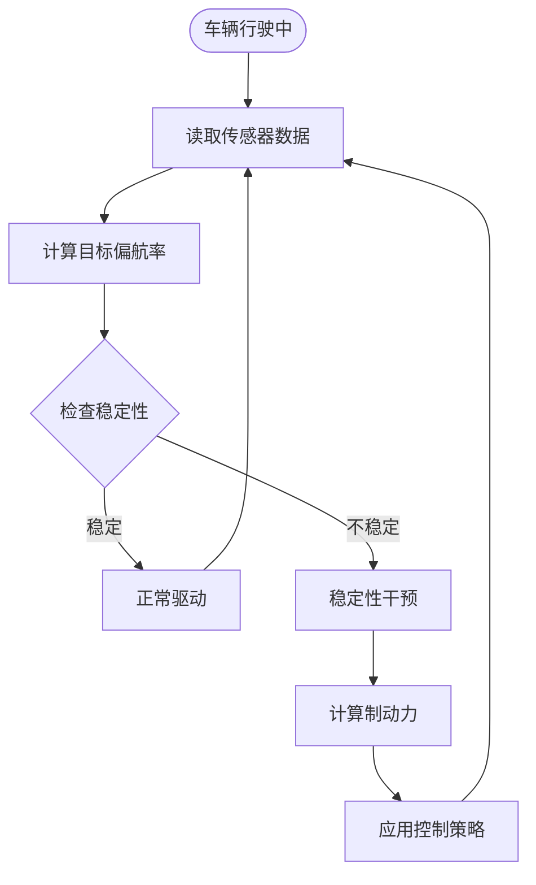

**图表来源**
- [Swc_VehicleDynamics.c:149-182](file://src/asw/vehicle_dynamics/src/Swc_VehicleDynamics.c#L149-L182)

**章节来源**
- [Swc_VehicleDynamics.h:112-149](file://src/asw/vehicle_dynamics/include/Swc_VehicleDynamics.h#L112-L149)
- [Swc_VehicleDynamics.c:289-371](file://src/asw/vehicle_dynamics/src/Swc_VehicleDynamics.c#L289-L371)

### 通信管理组件 (CommunicationManager)

#### 功能职责
通信管理组件负责车载网络通信，实现信号路由、PDU处理和通信统计功能。

#### 核心数据结构
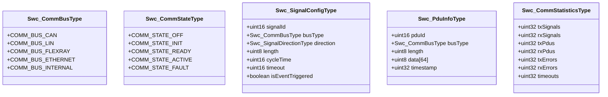

**图表来源**
- [Swc_CommunicationManager.h:25-101](file://src/asw/communication_manager/include/Swc_CommunicationManager.h#L25-L101)

#### 关键API接口
- **初始化**: `Swc_CommunicationManager_Init()` - 初始化通信栈
- **周期性处理**:
  - `Swc_CommunicationManager_10ms()` - 超时检查和状态更新
  - `Swc_CommunicationManager_RxProcess()` - 接收处理
  - `Swc_CommunicationManager_TxProcess()` - 发送处理
- **通信操作**:
  - `Swc_CommunicationManager_SendSignal()` - 发送信号
  - `Swc_CommunicationManager_ReceiveSignal()` - 接收信号
  - `Swc_CommunicationManager_SendPdu()` - 发送PDU
  - `Swc_CommunicationManager_GetStatistics()` - 获取统计信息

#### 实际应用场景
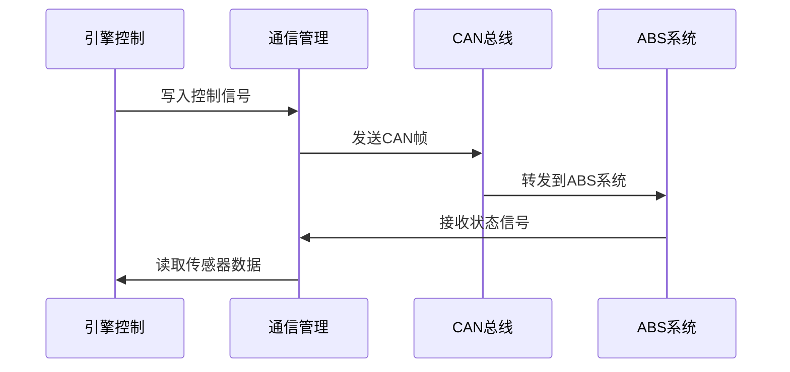

**图表来源**
- [Swc_CommunicationManager.c:311-340](file://src/asw/communication_manager/src/Swc_CommunicationManager.c#L311-L340)

**章节来源**
- [Swc_CommunicationManager.h:125-201](file://src/asw/communication_manager/include/Swc_CommunicationManager.h#L125-L201)
- [Swc_CommunicationManager.c:245-552](file://src/asw/communication_manager/src/Swc_CommunicationManager.c#L245-L552)

### 诊断管理组件 (DiagnosticManager)

#### 功能职责
诊断管理组件实现OBD诊断服务，支持多种诊断会话和安全访问控制。

#### 核心数据结构
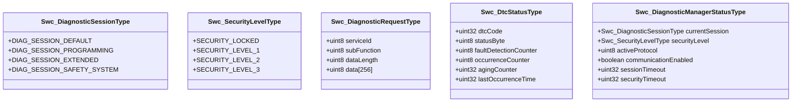

**图表来源**
- [Swc_DiagnosticManager.h:25-87](file://src/asw/diagnostic_manager/include/Swc_DiagnosticManager.h#L25-L87)

#### 支持的诊断服务
- **会话控制**: `SID_DIAGNOSTIC_SESSION_CONTROL` - 会话切换
- **安全访问**: `SID_SECURITY_ACCESS` - 安全级别解锁
- **DTC管理**: `SID_READ_DTC_INFORMATION` - 读取故障码
- **清除DTC**: `SID_CLEAR_DIAGNOSTIC_INFORMATION` - 清除故障码
- **ECU复位**: `SID_ECU_RESET` - ECU重启

#### 实际应用场景
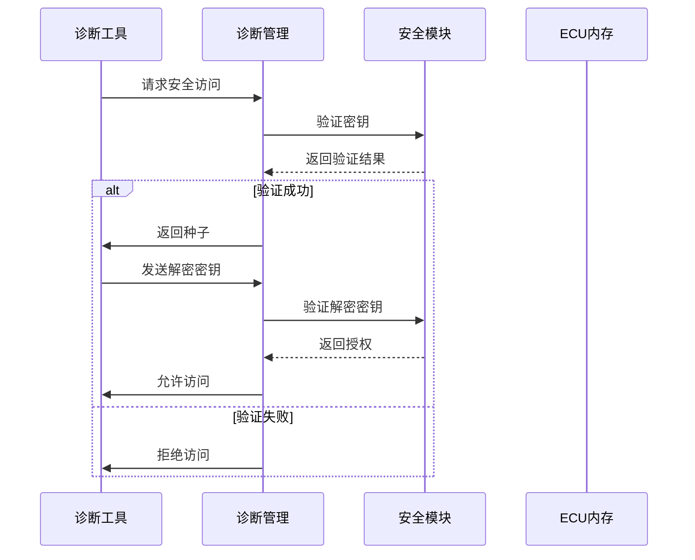

**图表来源**
- [Swc_DiagnosticManager.c:206-259](file://src/asw/diagnostic_manager/src/Swc_DiagnosticManager.c#L206-L259)

**章节来源**
- [Swc_DiagnosticManager.h:111-187](file://src/asw/diagnostic_manager/include/Swc_DiagnosticManager.h#L111-L187)
- [Swc_DiagnosticManager.c:418-682](file://src/asw/diagnostic_manager/src/Swc_DiagnosticManager.c#L418-L682)

### 输入输出控制组件 (IOControl)

#### 功能职责
输入输出控制组件管理数字、模拟和PWM信号的读写操作，提供去抖动和多通道支持。

#### 核心数据结构
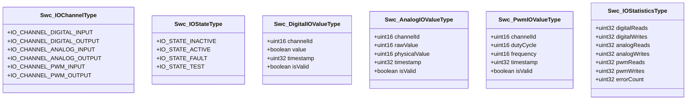

**图表来源**
- [Swc_IOControl.h:25-104](file://src/asw/io_control/include/Swc_IOControl.h#L25-L104)

#### 关键API接口
- **初始化**: `Swc_IOControl_Init()` - IO通道初始化
- **周期性处理**:
  - `Swc_IOControl_10ms()` - 数字信号处理(含去抖动)
  - `Swc_IOControl_50ms()` - 模拟和PWM信号处理
- **IO操作**:
  - `Swc_IOControl_ReadDigitalInput()` - 读取数字输入
  - `Swc_IOControl_WriteDigitalOutput()` - 写入数字输出
  - `Swc_IOControl_ReadAnalogInput()` - 读取模拟输入
  - `Swc_IOControl_WriteAnalogOutput()` - 写入模拟输出
  - `Swc_IOControl_ReadPwmInput()` - 读取PWM输入
  - `Swc_IOControl_WritePwmOutput()` - 写入PWM输出

#### 实际应用场景
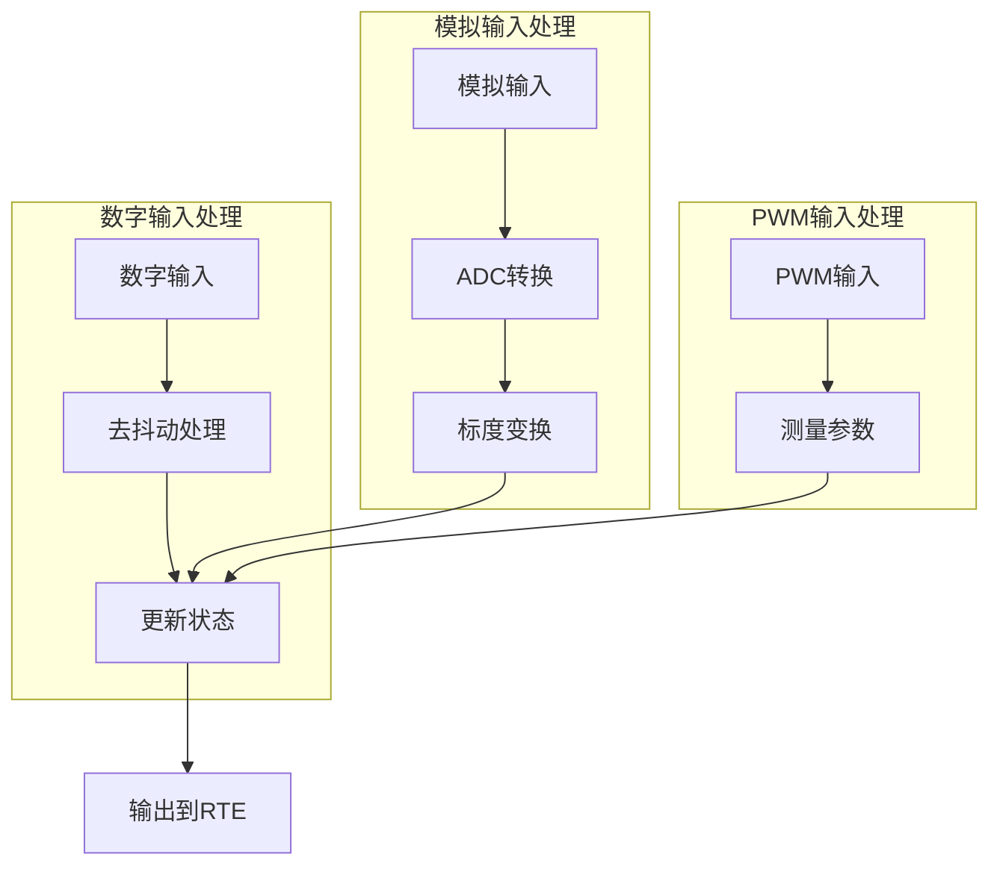

**图表来源**
- [Swc_IOControl.c:205-273](file://src/asw/io_control/src/Swc_IOControl.c#L205-L273)

**章节来源**
- [Swc_IOControl.h:130-228](file://src/asw/io_control/include/Swc_IOControl.h#L130-L228)
- [Swc_IOControl.c:282-718](file://src/asw/io_control/src/Swc_IOControl.c#L282-L718)

### 模式管理组件 (ModeManager)

#### 功能职责
模式管理组件协调系统各组件的状态转换，确保一致的系统模式管理。

#### 核心数据结构
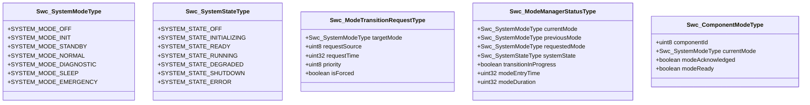

**图表来源**
- [Swc_ModeManager.h:25-93](file://src/asw/mode_manager/include/Swc_ModeManager.h#L25-L93)

#### 模式转换验证规则
组件实现了严格的模式转换验证机制：

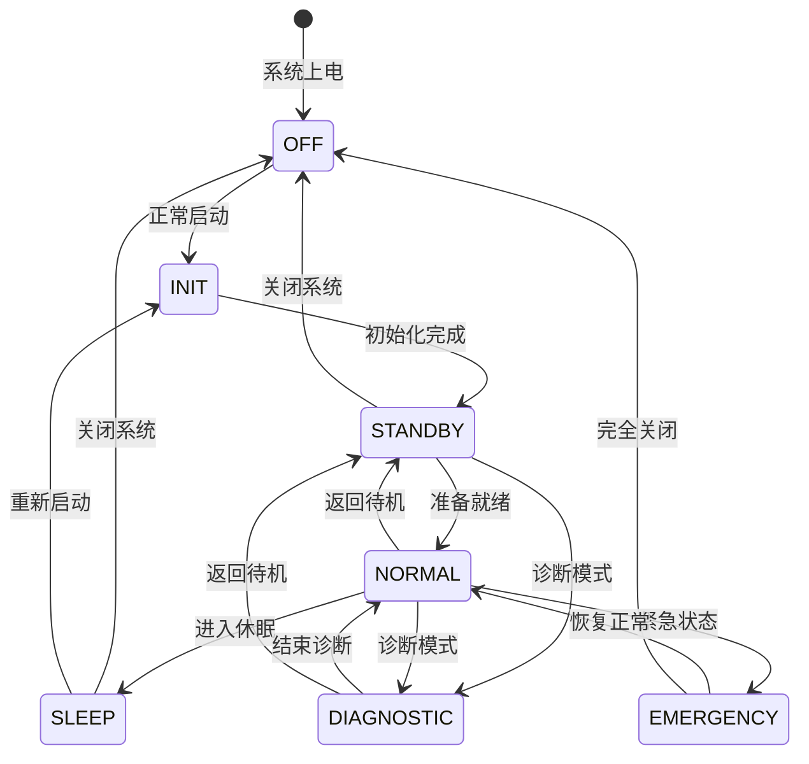

**图表来源**
- [Swc_ModeManager.c:208-246](file://src/asw/mode_manager/src/Swc_ModeManager.c#L208-L246)

#### 关键API接口
- **初始化**: `Swc_ModeManager_Init()` - 模式管理器初始化
- **周期性处理**: `Swc_ModeManager_50ms()` - 模式检查和状态更新
- **模式操作**:
  - `Swc_ModeManager_RequestModeTransition()` - 请求模式转换
  - `Swc_ModeManager_GetCurrentMode()` - 获取当前模式
  - `Swc_ModeManager_GetStatus()` - 获取状态信息
  - `Swc_ModeManager_ForceModeTransition()` - 强制模式转换

#### 实际应用场景
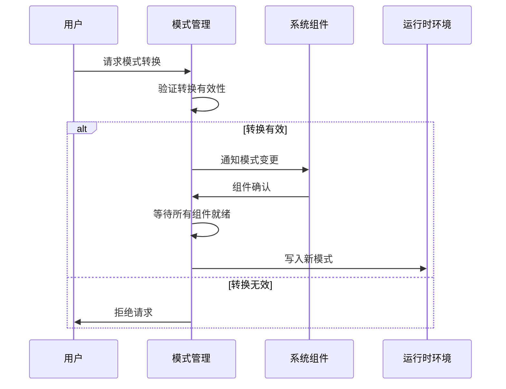

**图表来源**
- [Swc_ModeManager.c:89-120](file://src/asw/mode_manager/src/Swc_ModeManager.c#L89-L120)

**章节来源**
- [Swc_ModeManager.h:116-196](file://src/asw/mode_manager/include/Swc_ModeManager.h#L116-L196)
- [Swc_ModeManager.c:274-562](file://src/asw/mode_manager/src/Swc_ModeManager.c#L274-L562)

### 存储管理组件 (StorageManager)

#### 功能职责
存储管理组件提供非易失性存储管理，支持数据持久化、CRC校验和磨损均衡。

#### 核心数据结构
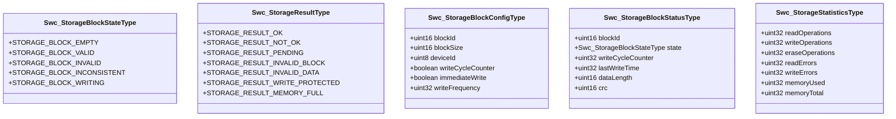

**图表来源**
- [Swc_StorageManager.h:25-84](file://src/asw/storage_manager/include/Swc_StorageManager.h#L25-L84)

#### 关键API接口
- **初始化**: `Swc_StorageManager_Init()` - 存储管理器初始化
- **周期性处理**: `Swc_StorageManager_100ms()` - 统计信息更新
- **存储操作**:
  - `Swc_StorageManager_ReadBlock()` - 读取存储块
  - `Swc_StorageManager_WriteBlock()` - 写入存储块
  - `Swc_StorageManager_GetBlockStatus()` - 获取块状态
  - `Swc_StorageManager_EraseBlock()` - 擦除存储块
  - `Swc_StorageManager_GetStatistics()` - 获取统计信息

#### 实际应用场景
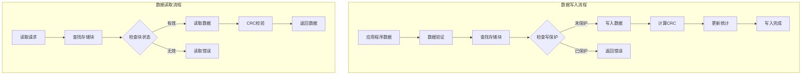

**图表来源**
- [Swc_StorageManager.c:279-339](file://src/asw/storage_manager/src/Swc_StorageManager.c#L279-L339)

**章节来源**
- [Swc_StorageManager.h:107-184](file://src/asw/storage_manager/include/Swc_StorageManager.h#L107-L184)
- [Swc_StorageManager.c:161-476](file://src/asw/storage_manager/src/Swc_StorageManager.c#L161-L476)

### 看门狗管理组件 (WatchdogManager)

#### 功能职责
看门狗管理组件提供系统监控功能，确保各组件按时提供存活指示。

#### 核心数据结构
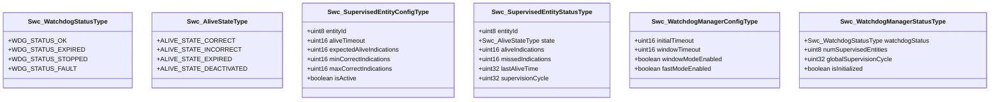

**图表来源**
- [Swc_WatchdogManager.h:25-87](file://src/asw/watchdog_manager/include/Swc_WatchdogManager.h#L25-L87)

#### 关键API接口
- **初始化**: `Swc_WatchdogManager_Init()` - 看门狗管理器初始化
- **周期性处理**: `Swc_WatchdogManager_10ms()` - 实体监督和超时检查
- **看门狗操作**:
  - `Swc_WatchdogManager_CheckpointReached()` - 实体存活指示
  - `Swc_WatchdogManager_RegisterEntity()` - 注册监督实体
  - `Swc_WatchdogManager_GetStatus()` - 获取看门狗状态
  - `Swc_WatchdogManager_HandleExpiration()` - 处理看门狗过期

#### 实际应用场景
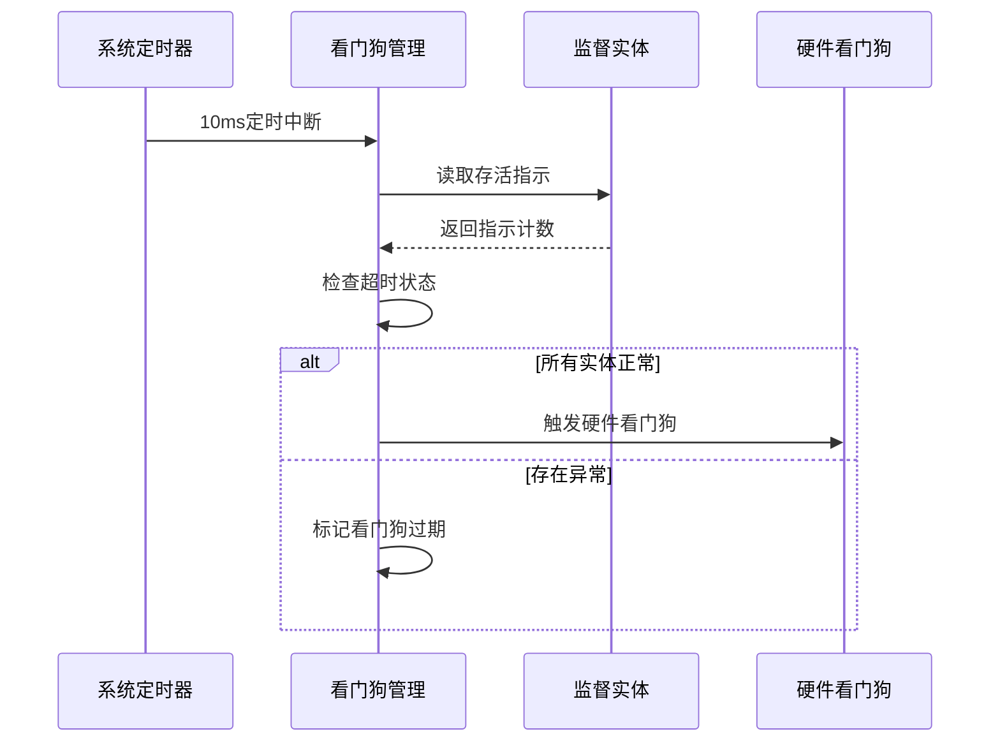

**图表来源**
- [Swc_WatchdogManager.c:272-307](file://src/asw/watchdog_manager/src/Swc_WatchdogManager.c#L272-L307)

**章节来源**
- [Swc_WatchdogManager.h:110-182](file://src/asw/watchdog_manager/include/Swc_WatchdogManager.h#L110-L182)
- [Swc_WatchdogManager.c:222-520](file://src/asw/watchdog_manager/src/Swc_WatchdogManager.c#L222-L520)

## 依赖分析

ASW组件间的依赖关系体现了层次化的架构设计：

```mermaid
graph TB
subgraph "顶层协调"
MM[模式管理器]
end
subgraph "核心功能"
EC[引擎控制]
VD[车辆动力学]
IO[输入输出控制]
WD[看门狗管理]
end
subgraph "支持功能"
CM[通信管理]
DM[诊断管理]
SM[存储管理]
end
subgraph "硬件抽象"
RTE[RTE]
DET[DET]
end
MM --> EC
MM --> VD
MM --> IO
MM --> WD
EC --> CM
VD --> CM
IO --> CM
SM --> CM
EC --> DM
VD --> DM
EC --> SM
IO --> SM
EC --> WD
VD --> WD
IO --> WD
EC --> RTE
VD --> RTE
CM --> RTE
DM --> RTE
IO --> RTE
MM --> RTE
SM --> RTE
WD --> RTE
RTE --> DET
```

**图表来源**
- [asw_interfaces.h:1-314](file://src/asw/asw_interfaces.h#L1-L314)

### 组件间通信模式

1. **直接调用**: 同一层级组件间的直接API调用
2. **RTE通信**: 通过运行时环境进行异步数据交换
3. **事件驱动**: 基于状态变化的事件通知机制

**章节来源**
- [Swc_ModeManager.c:251-265](file://src/asw/mode_manager/src/Swc_ModeManager.c#L251-L265)

## 性能考虑

### 实时性要求
- **高优先级任务**: 引擎控制(10ms)、车辆动力学(10ms)
- **中优先级任务**: 通信管理(10ms)、IO控制(10ms/50ms)
- **低优先级任务**: 存储管理(100ms)、诊断管理(50ms)

### 内存管理
- **静态分配**: 关键数据结构采用静态内存，避免运行时分配
- **内存池**: 使用预分配的内存池管理动态数据
- **对齐要求**: 所有数据结构按4字节对齐优化访问性能

### 优化建议
1. **算法优化**: 在计算密集型函数中使用查表法减少浮点运算
2. **缓存利用**: 利用CPU缓存局部性原理优化数据访问模式
3. **中断处理**: 最小化中断处理时间，避免长时间阻塞
4. **内存屏障**: 在多核环境下正确使用内存屏障保证数据一致性

## 故障排除指南

### 常见错误类型
1. **初始化错误**: 组件未正确初始化导致的运行时错误
2. **超时错误**: 通信或处理超时导致的功能异常
3. **状态不一致**: 组件状态与预期不符导致的行为异常
4. **资源不足**: 内存或资源耗尽导致的操作失败

### 错误处理机制
组件采用统一的错误处理框架：

```mermaid
flowchart TD
Error[发生错误] --> CheckInit{检查初始化}
CheckInit --> |未初始化| InitError[初始化错误]
CheckInit --> |已初始化| CheckType{检查错误类型}
CheckType --> |超时错误| Timeout[超时处理]
CheckType --> |状态错误| StateError[状态恢复]
CheckType --> |资源错误| ResourceError[资源释放]
CheckType --> |其他错误| GenericError[通用处理]
InitError --> Report[报告DET]
Timeout --> Report
StateError --> Report
ResourceError --> Report
GenericError --> Report
Report --> Recovery[系统恢复]
Recovery --> Continue[继续执行]
```

**图表来源**
- [Swc_EngineControl.c:352-355](file://src/asw/engine_control/src/Swc_EngineControl.c#L352-L355)

### 调试技巧
1. **状态监控**: 定期检查组件状态寄存器
2. **日志记录**: 使用DET记录关键事件和错误信息
3. **性能分析**: 监控执行时间和资源使用情况
4. **单元测试**: 为关键函数编写单元测试确保正确性

**章节来源**
- [Swc_EngineControl.c:352-355](file://src/asw/engine_control/src/Swc_EngineControl.c#L352-L355)
- [Swc_DiagnosticManager.c:451-453](file://src/asw/diagnostic_manager/src/Swc_DiagnosticManager.c#L451-L453)

## 结论

ASW层的8个核心组件构成了完整的车辆应用软件架构，具有以下特点：

1. **模块化设计**: 每个组件职责明确，接口标准化
2. **实时性保障**: 采用分层调度确保关键任务及时执行
3. **可靠性设计**: 完善的错误处理和故障恢复机制
4. **可扩展性**: 支持功能扩展和配置定制
5. **可维护性**: 清晰的代码结构和详细的文档

通过遵循本API参考文档，开发者可以有效地集成和扩展ASW组件，构建可靠的车辆控制系统。建议在实际开发中重点关注组件间的协作关系、错误处理策略和性能优化方案。