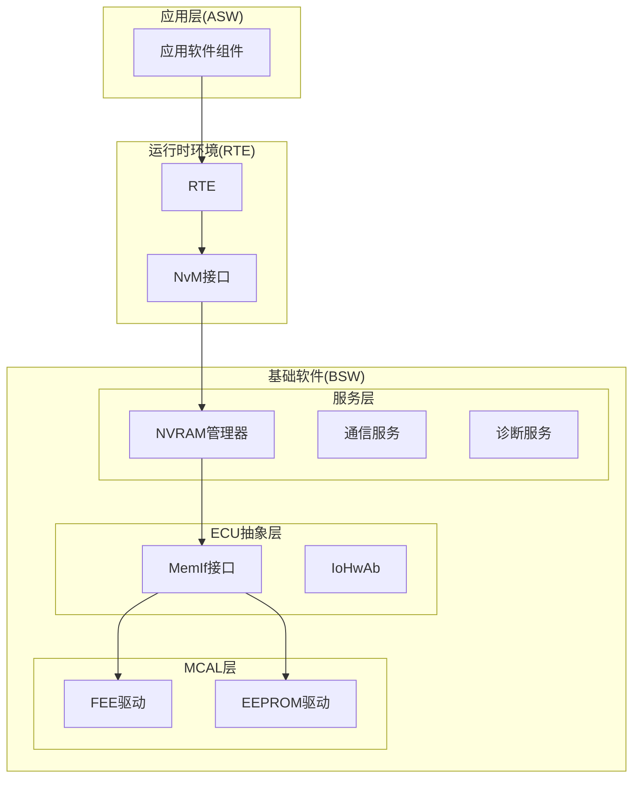
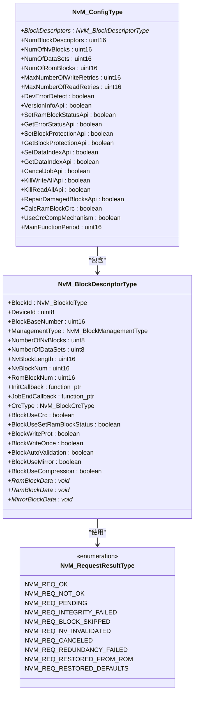
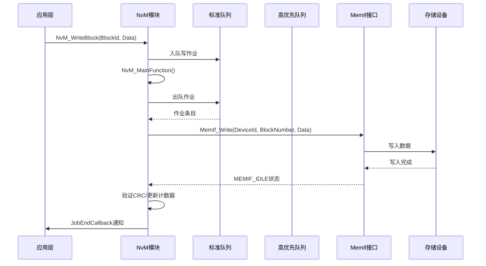
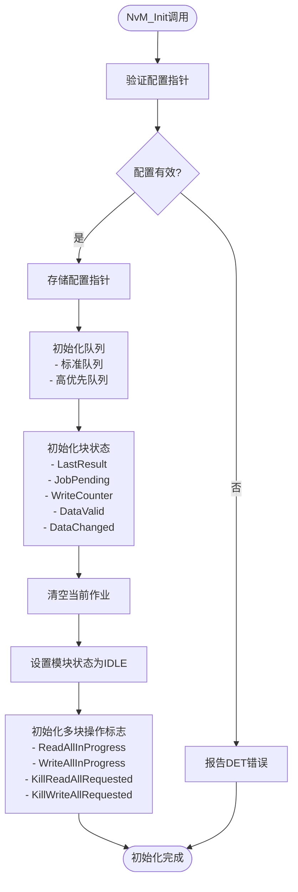
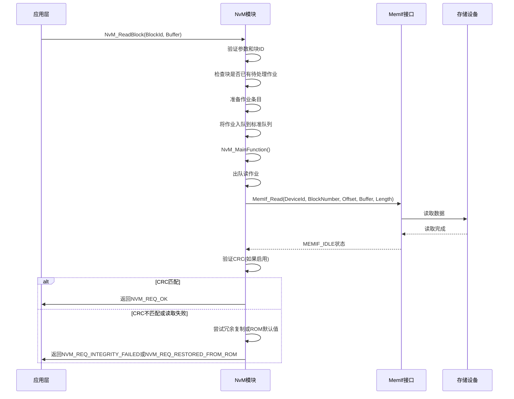
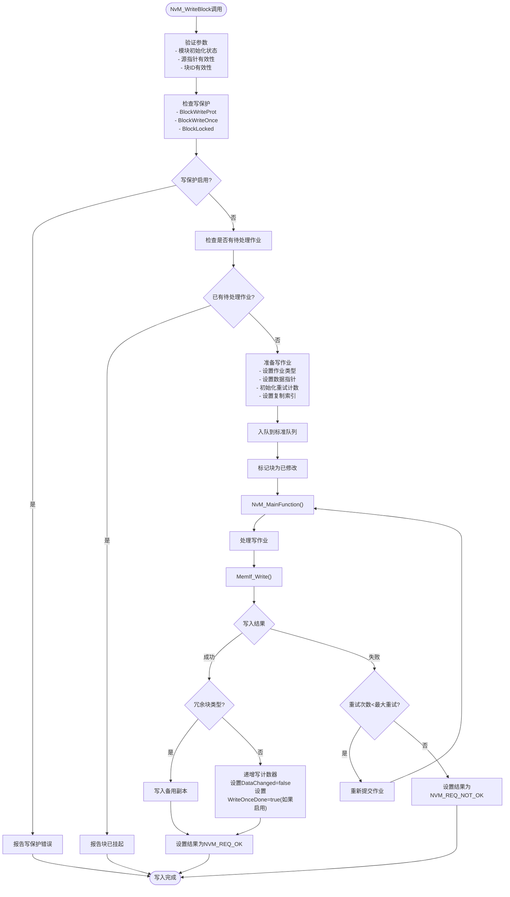
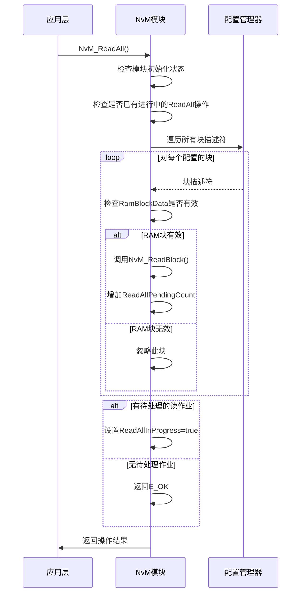
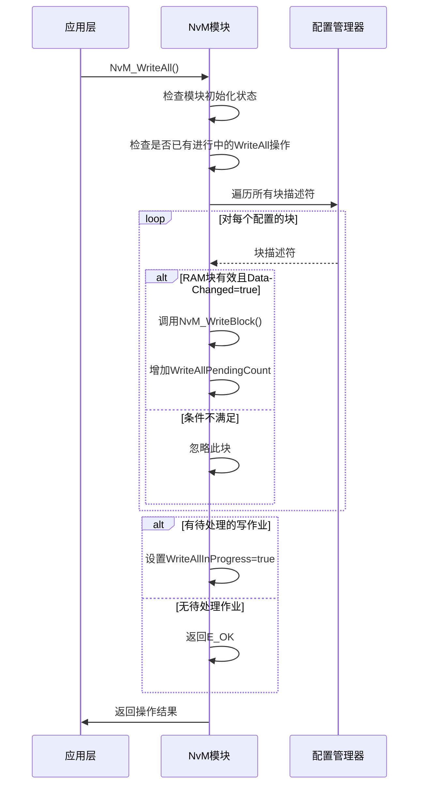
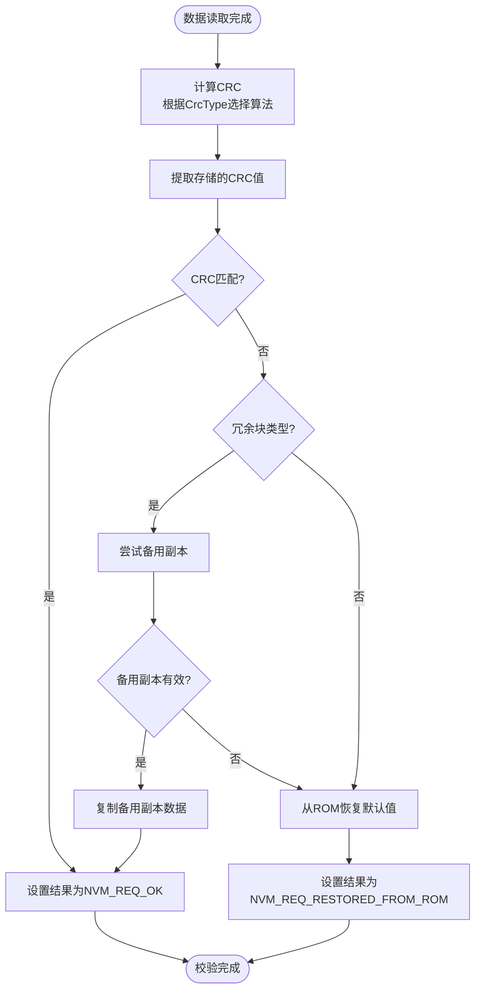
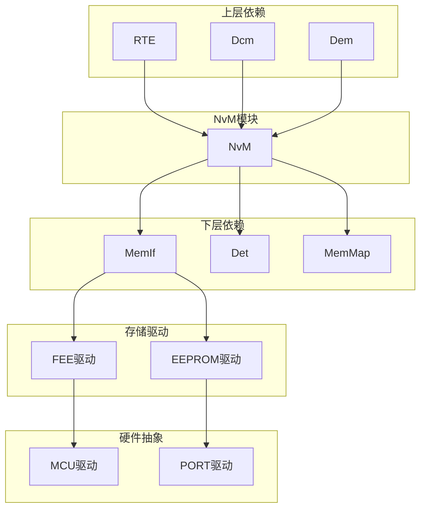

# NVRAM管理器(NvM)API

<cite>
**本文档引用的文件**
- [NvM.h](file://src/bsw/services/nvm/include/NvM.h)
- [NvM.c](file://src/bsw/services/nvm/src/NvM.c)
- [NvM_Cfg.h](file://src/bsw/services/nvm/include/NvM_Cfg.h)
- [NvM_Cfg.h](file://src/bsw/config/templates/NvM_Cfg.h)
- [NvM_test.c](file://src/bsw/services/nvm/src/NvM_test.c)
- [NvM_spec.md](file://openspec/changes/dev-nvm-enhancement/specs/NvM_spec.md)
- [api-reference.md](file://docs/api-reference.md)
- [spec.md](file://openspec/specs/bsw/spec.md)
</cite>

## 目录
1. [简介](#简介)
2. [项目结构](#项目结构)
3. [核心组件](#核心组件)
4. [架构概览](#架构概览)
5. [详细组件分析](#详细组件分析)
6. [依赖关系分析](#依赖关系分析)
7. [性能考虑](#性能考虑)
8. [故障排除指南](#故障排除指南)
9. [结论](#结论)

## 简介

NVRAM管理器(NvM)是YuleTech AutoSAR BSW平台的核心服务层模块，遵循AutoSAR Classic Platform 4.x标准。该模块负责非易失性内存数据管理，提供异步读写服务、块管理、数据一致性保护和强大的错误恢复机制。

NvM通过Memory Abstraction Interface(MemIf)抽象底层存储硬件(Flash/EEPROM)，向上层模块(如Dcm、Dem)和RTE提供统一的持久化数据存储接口。它支持多种块类型、数据完整性校验、冗余管理和批量操作等功能。

## 项目结构

NvM模块位于基础软件(BSW)的服务层，采用标准的AutoSAR分层架构设计：

**图表来源**
- [spec.md:13-47](file://openspec/specs/bsw/spec.md#L13-L47)

**章节来源**
- [spec.md:13-47](file://openspec/specs/bsw/spec.md#L13-L47)

## 核心组件

### 主要数据类型

NvM模块定义了完整的数据类型体系，包括配置类型、块描述符和请求结果类型：

**图表来源**
- [NvM.h:149-172](file://src/bsw/services/nvm/include/NvM.h#L149-L172)
- [NvM.h:121-144](file://src/bsw/services/nvm/include/NvM.h#L121-L144)
- [NvM.h:81-92](file://src/bsw/services/nvm/include/NvM.h#L81-L92)

### 块管理类型

NvM支持三种主要的块管理类型：

| 块类型 | 描述 | 使用场景 | 特点 |
|--------|------|----------|------|
| Native | 单一NV块映射到单一RAM镜像 | 一般配置数据、运行时持久变量 | 最简单、高效、开销最小 |
| Redundant | 两个NV块(主备)存储相同数据 | 安全关键数据需要高可靠性 | 自动故障转移、透明恢复 |
| Dataset | 多个NV数据集(最多NVM_NUM_OF_DATASETS)共享单一RAM块 | 校准参数集(A/B面)、多车辆配置 | 基于索引选择、共享RAM |

**章节来源**
- [NvM.h:97-101](file://src/bsw/services/nvm/include/NvM.h#L97-L101)
- [NvM_spec.md:28-50](file://openspec/changes/dev-nvm-enhancement/specs/NvM_spec.md#L28-L50)

## 架构概览

NvM采用异步作业队列架构，支持标准和高优先级队列：

**图表来源**
- [NvM.c:1687-2125](file://src/bsw/services/nvm/src/NvM.c#L1687-L2125)

### 优先级管理策略

NvM实现了两级作业队列系统：

1. **高优先队列(Immediate Queue)**: 用于紧急操作如ROM默认值恢复
2. **标准队列(Standard Queue)**: 用于常规读写操作

队列容量配置：
- 标准队列大小: NVM_SIZE_STANDARD_JOB_QUEUE (默认16)
- 高优先队列大小: NVM_SIZE_IMMEDIATE_JOB_QUEUE (默认4)

**章节来源**
- [NvM.c:103-129](file://src/bsw/services/nvm/src/NvM.c#L103-L129)
- [NvM_Cfg.h:79-86](file://src/bsw/services/nvm/include/NvM_Cfg.h#L79-L86)

## 详细组件分析

### 初始化流程

NvM初始化过程包括配置验证、内部状态初始化和资源分配：

**图表来源**
- [NvM.c:918-968](file://src/bsw/services/nvm/src/NvM.c#L918-L968)

**章节来源**
- [NvM.c:918-968](file://src/bsw/services/nvm/src/NvM.c#L918-L968)

### 数据读取流程

NvM读取操作支持多种块类型和错误恢复机制：

**图表来源**
- [NvM.c:507-568](file://src/bsw/services/nvm/src/NvM.c#L507-L568)
- [NvM.c:1863-1972](file://src/bsw/services/nvm/src/NvM.c#L1863-L1972)

**章节来源**
- [NvM.c:507-568](file://src/bsw/services/nvm/src/NvM.c#L507-L568)
- [NvM.c:1863-1972](file://src/bsw/services/nvm/src/NvM.c#L1863-L1972)

### 数据写入流程

NvM写入操作支持写保护、冗余写入和写一次保护：

**图表来源**
- [NvM.c:1040-1116](file://src/bsw/services/nvm/src/NvM.c#L1040-L1116)
- [NvM.c:649-731](file://src/bsw/services/nvm/src/NvM.c#L649-L731)

**章节来源**
- [NvM.c:1040-1116](file://src/bsw/services/nvm/src/NvM.c#L1040-L1116)
- [NvM.c:649-731](file://src/bsw/services/nvm/src/NvM.c#L649-L731)

### 批量操作API

NvM提供了高效的批量操作API，支持ECU启动和关闭时的数据同步：

#### ReadAll操作

**图表来源**
- [NvM.c:2131-2173](file://src/bsw/services/nvm/src/NvM.c#L2131-L2173)

#### WriteAll操作

**图表来源**
- [NvM.c:2179-2222](file://src/bsw/services/nvm/src/NvM.c#L2179-L2222)

**章节来源**
- [NvM.c:2131-2173](file://src/bsw/services/nvm/src/NvM.c#L2131-L2173)
- [NvM.c:2179-2222](file://src/bsw/services/nvm/src/NvM.c#L2179-L2222)

### 数据完整性校验

NvM支持多种CRC算法进行数据完整性校验：

| CRC类型 | 位宽 | 多项式 | 用途 |
|---------|------|--------|------|
| NVM_CRC_NONE | 0 | 无 | 禁用CRC校验 |
| NVM_CRC_8 | 8 | 0x1D | 低开销校验，适合小数据块 |
| NVM_CRC_16 | 16 | 0x1021 | 标准校验，平衡性能和安全性 |
| NVM_CRC_32 | 32 | 0x04C11DB7 | 高安全性校验，适合关键数据 |

CRC校验流程：

**图表来源**
- [NvM.c:1863-1972](file://src/bsw/services/nvm/src/NvM.c#L1863-L1972)

**章节来源**
- [NvM.c:1863-1972](file://src/bsw/services/nvm/src/NvM.c#L1863-L1972)

## 依赖关系分析

### 外部依赖

NvM模块依赖于多个底层模块：

**图表来源**
- [NvM_spec.md:366-381](file://openspec/changes/dev-nvm-enhancement/specs/NvM_spec.md#L366-L381)

### 关键依赖关系

1. **MemIf接口**: 抽象底层存储硬件，支持Flash和EEPROM
2. **Det模块**: 开发错误追踪，提供调试和错误报告
3. **标准类型**: 使用Std_Types.h定义的标准数据类型

**章节来源**
- [NvM_spec.md:366-381](file://openspec/changes/dev-nvm-enhancement/specs/NvM_spec.md#L366-L381)

## 性能考虑

### 队列管理

- **队列大小**: 标准队列16个作业，高优先队列4个作业
- **重试机制**: 读取和写入操作分别支持3次重试
- **批处理**: ReadAll和WriteAll操作提高批量数据处理效率

### 内存使用

- **静态内存**: 内部状态结构体占用固定内存空间
- **动态内存**: 通过MemMap.h管理内存段，避免动态分配
- **缓存策略**: 支持RAM块缓存减少重复读取

### 实时性能

- **主函数周期**: 默认10ms执行周期，可根据需求调整
- **异步处理**: 所有I/O操作异步执行，不影响实时任务
- **优先级调度**: 高优先队列确保紧急操作及时处理

## 故障排除指南

### 常见错误代码

| 错误代码 | 值 | 描述 | 可能原因 | 解决方案 |
|----------|----|------|----------|----------|
| NVM_E_NOT_INITIALIZED | 0x14U | 模块未初始化 | 未调用NvM_Init | 确保在使用前调用初始化 |
| NVM_E_BLOCK_PENDING | 0x15U | 块已有待处理作业 | 同一块重复请求 | 等待当前作业完成或取消 |
| NVM_E_BLOCK_CONFIG | 0x16U | 块配置无效 | 块描述符配置错误 | 检查块配置参数 |
| NVM_E_PARAM_BLOCK_ID | 0x0AU | 块ID无效 | 块ID超出范围 | 验证块ID定义 |
| NVM_E_PARAM_POINTER | 0x0EU | 空指针参数 | 传入NULL指针 | 检查参数有效性 |
| NVM_E_WRITE_PROTECTED | 0x12U | 块写保护 | BlockWriteProt启用 | 检查写保护配置 |

### 调试技巧

1. **启用DET**: 在开发阶段启用NVM_DEV_ERROR_DETECT获取详细错误信息
2. **监控队列状态**: 使用NvM_GetErrorStatus监控块状态
3. **日志记录**: 在JobEndCallback中添加调试信息
4. **重试分析**: 监控重试次数判断存储可靠性

**章节来源**
- [NvM_spec.md:208-232](file://openspec/changes/dev-nvm-enhancement/specs/NvM_spec.md#L208-L232)

## 结论

NVRAM管理器(NvM)是一个功能完整、设计精良的AutoSAR服务层模块。它提供了：

1. **完整的API集合**: 支持单块操作、批量操作和状态控制
2. **灵活的块管理**: 支持Native、Redundant和Dataset三种块类型
3. **强大的错误处理**: 包含CRC校验、冗余恢复和ROM默认值恢复
4. **高效的异步架构**: 基于作业队列的非阻塞I/O操作
5. **完善的配置系统**: 支持编译时配置和运行时参数调整

NvM模块的设计充分考虑了汽车电子系统的可靠性要求，通过冗余设计、CRC校验和错误恢复机制确保数据的完整性和系统的稳定性。其异步架构设计使得应用程序可以非阻塞地进行数据持久化操作，提高了系统的实时性能。

对于开发者而言，正确理解和使用NvM的API是构建可靠汽车应用的基础。建议在项目初期就制定详细的存储策略，合理选择块类型和保护机制，并建立完善的错误处理和监控机制。