# PDU路由器(PduR)API

<cite>
**本文档引用的文件**
- [PduR.h](file://src/bsw/services/pdur/include/PduR.h)
- [PduR_Cfg.h](file://src/bsw/services/pdur/include/PduR_Cfg.h)
- [PduR.c](file://src/bsw/services/pdur/src/PduR.c)
- [PduR_Lcfg.c](file://src/bsw/services/pdur/src/PduR_Lcfg.c)
- [PduR_test.c](file://src/bsw/services/pdur/src/PduR_test.c)
- [PduR_spec.md](file://openspec/changes/dev-pdu-router/specs/PduR_spec.md)
- [pdur_verification.md](file://verification/pdur_verification.md)
- [main.c](file://examples/can_demo/main.c)
</cite>

## 目录
1. [简介](#简介)
2. [项目结构](#项目结构)
3. [核心组件](#核心组件)
4. [架构概览](#架构概览)
5. [详细组件分析](#详细组件分析)
6. [依赖关系分析](#依赖关系分析)
7. [性能考虑](#性能考虑)
8. [故障排除指南](#故障排除指南)
9. [结论](#结论)
10. [附录](#附录)

## 简介

PDU路由器(PduR)是AutoSAR经典平台4.x标准的基础软件服务层模块，负责在上层模块(如Com、Dcm)和下层通信接口模块(如CanIf、LinIf、EthIf)之间路由I-PDUs(交互层协议数据单元)。

PduR的核心职责包括：
- 将上层模块的传输请求从上层路由到下层
- 将下层模块的接收指示从下层路由到上层
- 将下层模块的传输确认从下层路由回上层
- 支持多播(一个源到多个目标)
- 支持基于FIFO的延迟路由
- 支持路由路径组的启用/禁用

## 项目结构

PduR模块位于基础软件服务层，采用AutoSAR标准的分层架构设计：

```mermaid
graph TB
subgraph "应用层(ASW)"
ASW[应用层软件]
end
subgraph "运行时环境(RTE)"
RTE[RTE]
end
subgraph "基础软件(BSW)"
subgraph "服务层(Service Layer)"
PduR[PduR - PDU路由器]
Com[Com - 通信服务]
Dcm[Dcm - 诊断通信]
end
subgraph "ECU抽象层(ECU Abstraction)"
CanIf[CanIf - CAN接口]
LinIf[LinIf - LIN接口]
EthIf[EthIf - 以太网接口]
end
subgraph "MCAL"
MCAL[微控制器驱动]
end
end
ASW --> RTE
RTE --> PduR
PduR --> Com
PduR --> Dcm
PduR --> CanIf
PduR --> LinIf
PduR --> EthIf
CanIf --> MCAL
LinIf --> MCAL
EthIf --> MCAL
```

**图表来源**
- [PduR_spec.md:11-25](file://openspec/changes/dev-pdu-router/specs/PduR_spec.md#L11-L25)

**章节来源**
- [PduR_spec.md:11-25](file://openspec/changes/dev-pdu-router/specs/PduR_spec.md#L11-L25)

## 核心组件

### 数据类型定义

PduR模块定义了完整的数据类型体系，用于描述路由配置和状态管理：

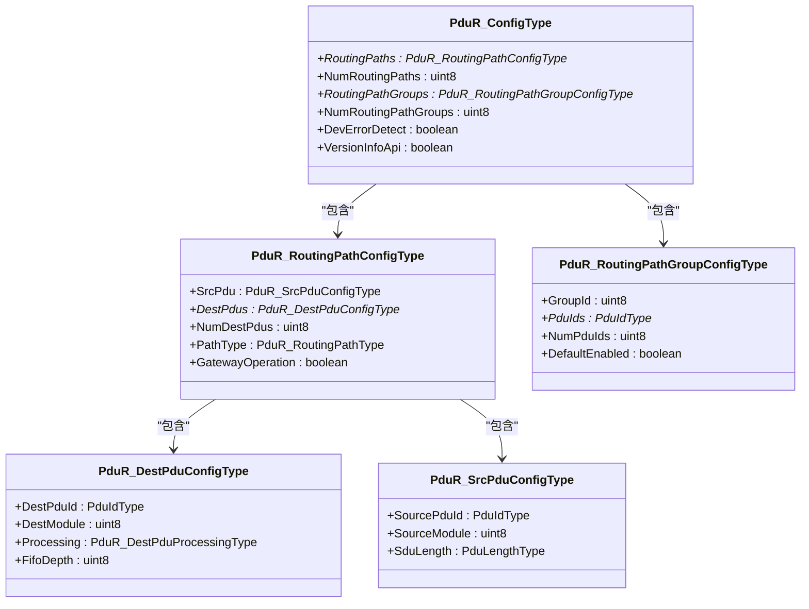

**图表来源**
- [PduR.h:101-149](file://src/bsw/services/pdur/include/PduR.h#L101-L149)

### 错误处理机制

PduR实现了完整的开发错误检测(DET)机制，支持多种错误类型的报告：

| 错误代码 | 值 | 描述 |
|----------|-----|------|
| PDUR_E_PARAM_POINTER | 0x01U | 传递了空指针 |
| PDUR_E_PARAM_CONFIG | 0x02U | 无效配置 |
| PDUR_E_INVALID_REQUEST | 0x03U | 无效请求 |
| PDUR_E_PDU_ID_INVALID | 0x04U | 无效PDU ID |
| PDUR_E_ROUTING_PATH_GROUP_INVALID | 0x05U | 无效路由路径组 |
| PDUR_E_PARAM_INVALID | 0x06U | 无效参数 |
| PDUR_E_UNINIT | 0x07U | 模块未初始化 |
| PDUR_E_INVALID_BUFFER_LENGTH | 0x08U | 无效缓冲区长度 |
| PDUR_E_BUFFER_REQUEST_SDU_FAILED | 0x09U | 缓冲区请求失败 |
| PDUR_E_BUFFER_REQUEST_SDU_AVAILABLE | 0x0AU | 缓冲区请求可用 |

**章节来源**
- [PduR.h:53-71](file://src/bsw/services/pdur/include/PduR.h#L53-L71)
- [PduR_spec.md:154-180](file://openspec/changes/dev-pdu-router/specs/PduR_spec.md#L154-L180)

## 架构概览

### 模块状态管理

PduR模块采用简单的状态机管理：

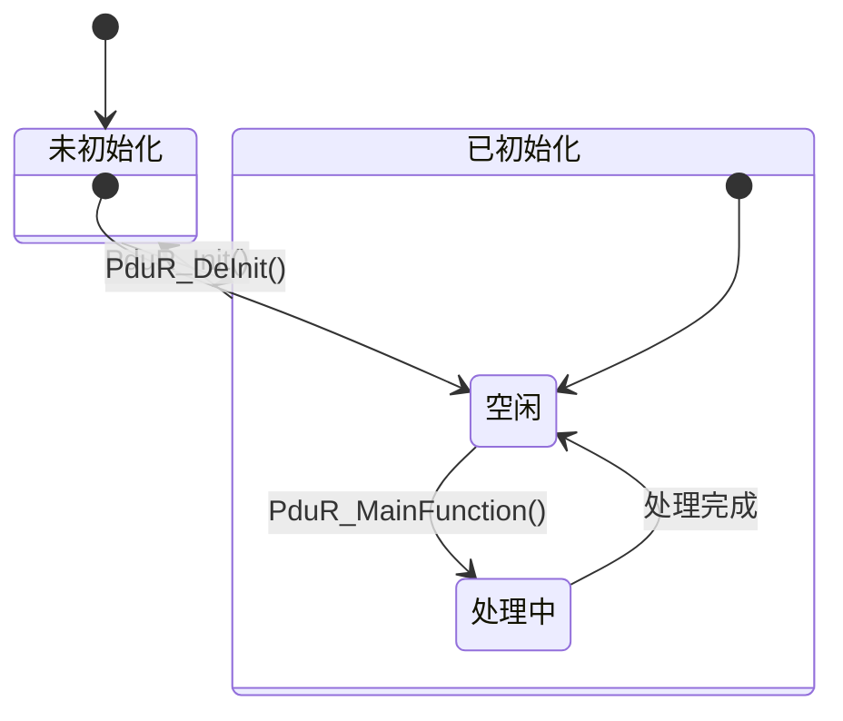

**图表来源**
- [PduR.h:75-80](file://src/bsw/services/pdur/include/PduR.h#L75-L80)
- [PduR.c:48-50](file://src/bsw/services/pdur/src/PduR.c#L48-L50)

### 路由路径类型

PduR支持三种路由路径类型：

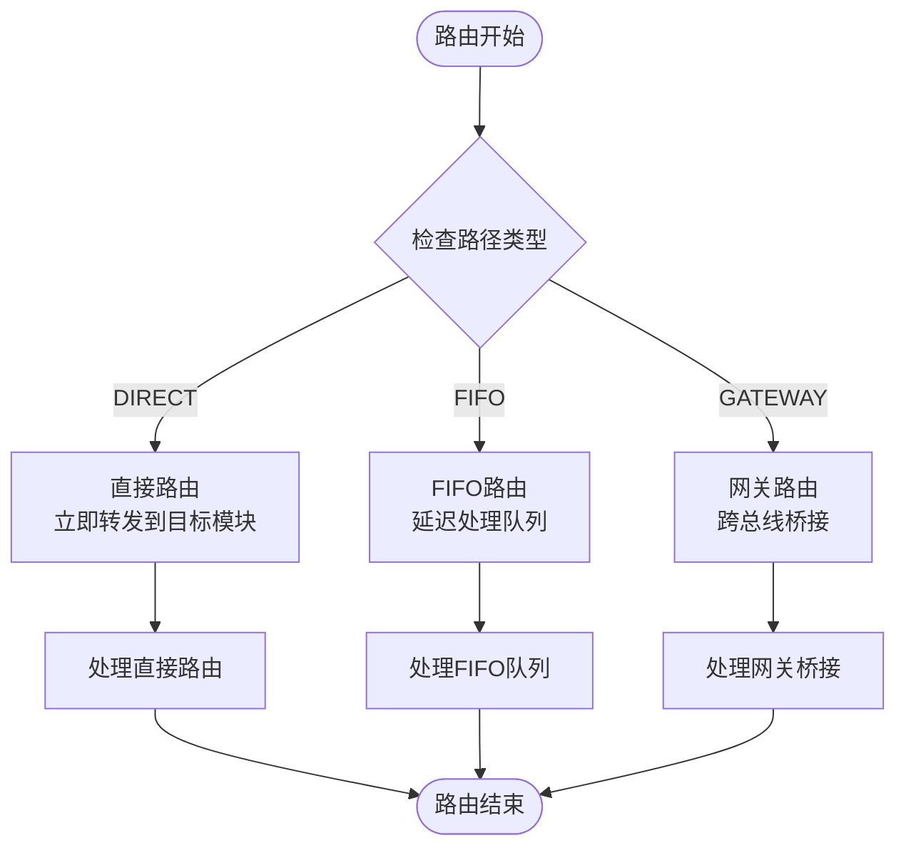

**图表来源**
- [PduR.h:85-89](file://src/bsw/services/pdur/include/PduR.h#L85-L89)

**章节来源**
- [PduR.h:85-89](file://src/bsw/services/pdur/include/PduR.h#L85-L89)

## 详细组件分析

### 初始化与配置管理

#### PduR_Init函数

PduR_Init是模块的唯一入口点，负责：

1. **配置验证**：检查配置指针的有效性
2. **状态初始化**：设置模块为已初始化状态
3. **路由路径状态**：初始化所有路由路径的状态
4. **FIFO队列**：为每个路由路径初始化FIFO队列

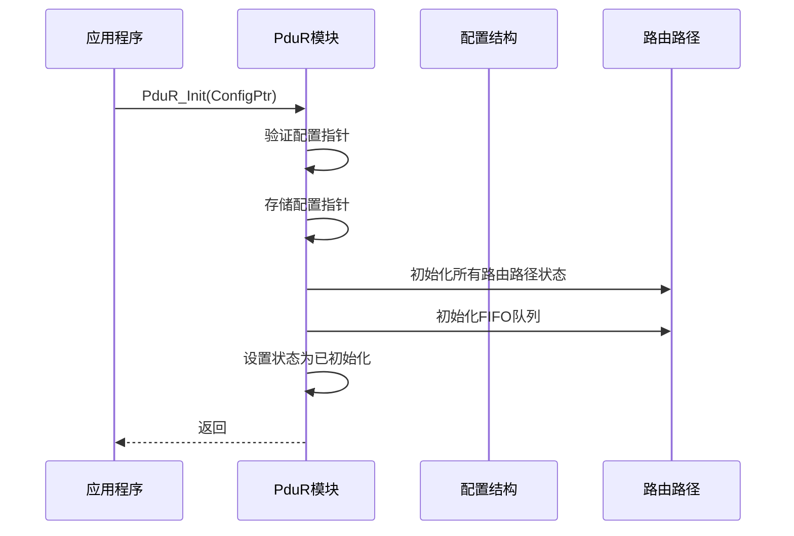

**图表来源**
- [PduR.c:374-398](file://src/bsw/services/pdur/src/PduR.c#L374-L398)

#### 配置结构详解

PduR的配置结构包含以下关键组件：

| 组件 | 类型 | 描述 |
|------|------|------|
| RoutingPaths | PduR_RoutingPathConfigType* | 路由路径数组 |
| NumRoutingPaths | uint8 | 路由路径数量 |
| RoutingPathGroups | PduR_RoutingPathGroupConfigType* | 路由路径组 |
| NumRoutingPathGroups | uint8 | 路由路径组数量 |
| DevErrorDetect | boolean | 开发错误检测开关 |
| VersionInfoApi | boolean | 版本信息API开关 |

**章节来源**
- [PduR.h:142-149](file://src/bsw/services/pdur/include/PduR.h#L142-L149)
- [PduR_Lcfg.c:246-253](file://src/bsw/services/pdur/src/PduR_Lcfg.c#L246-L253)

### 传输路由处理

#### PduR_Transmit函数

PduR_Transmit处理来自上层模块的传输请求：

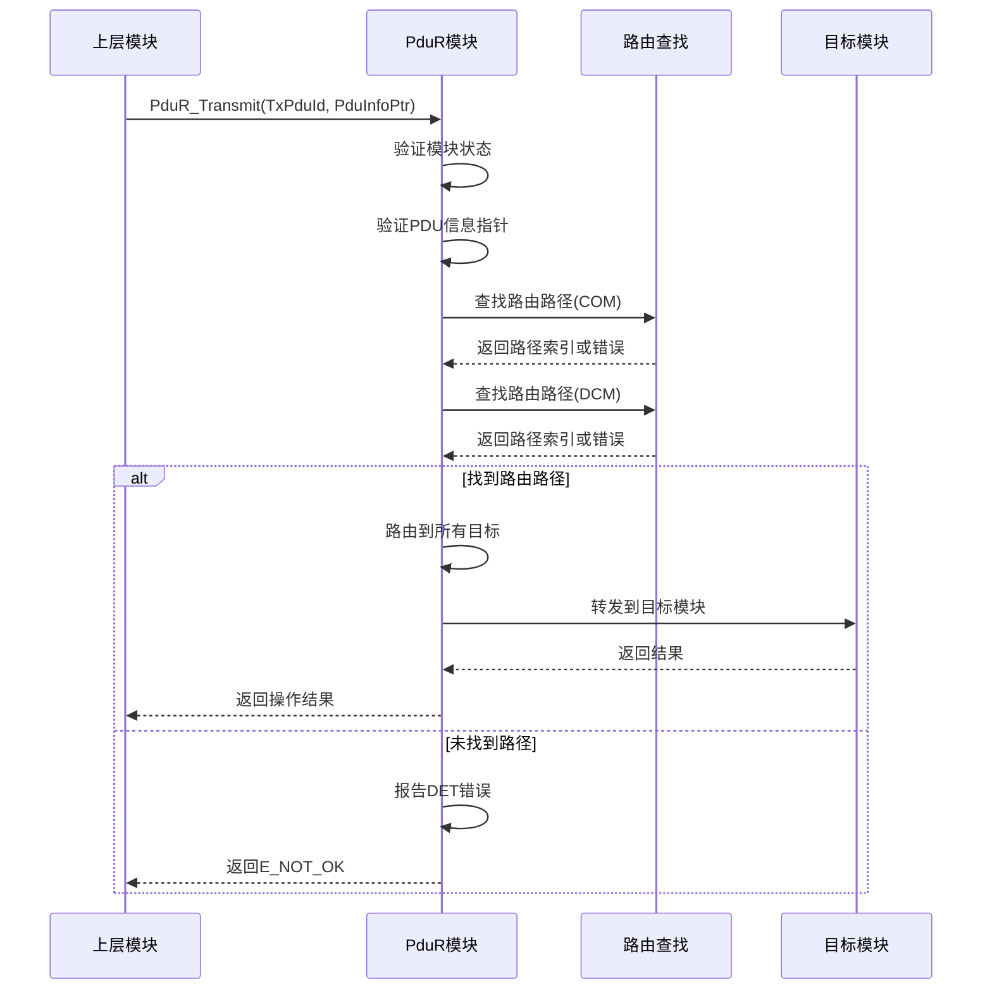

**图表来源**
- [PduR.c:428-466](file://src/bsw/services/pdur/src/PduR.c#L428-L466)

#### 路由查找算法

PduR使用线性搜索算法查找路由路径：

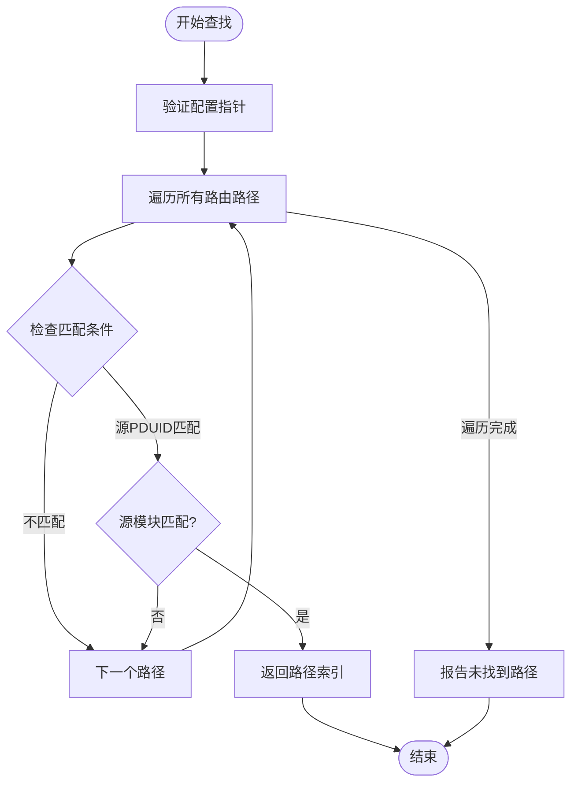

**图表来源**
- [PduR.c:132-154](file://src/bsw/services/pdur/src/PduR.c#L132-L154)

**章节来源**
- [PduR.c:428-466](file://src/bsw/services/pdur/src/PduR.c#L428-L466)
- [PduR.c:132-154](file://src/bsw/services/pdur/src/PduR.c#L132-L154)

### 接收指示处理

#### PduR_RxIndication函数

PduR_RxIndication处理来自下层模块的接收指示：

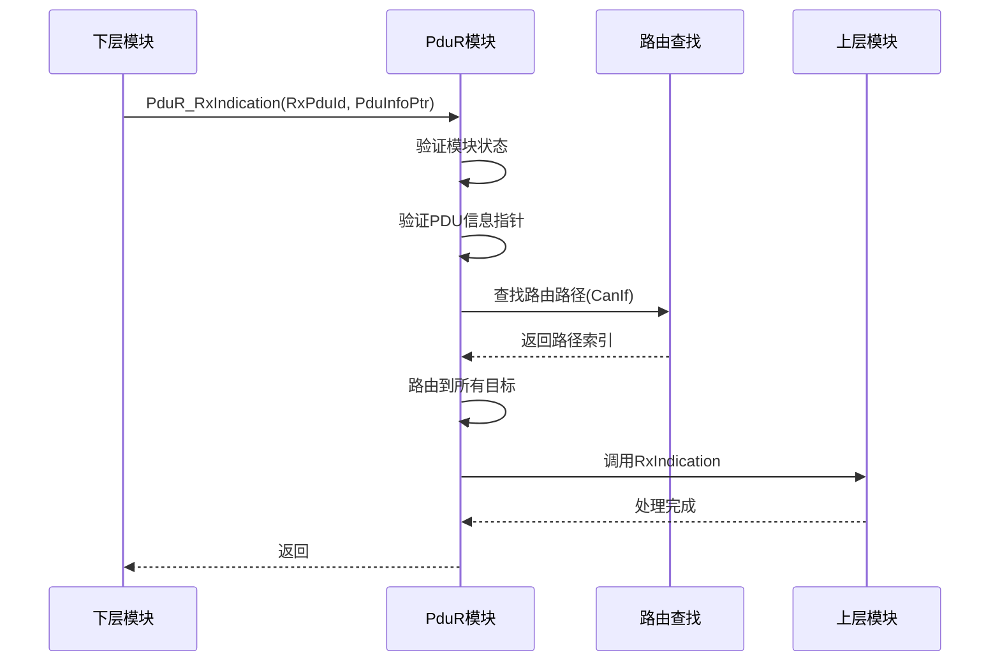

**图表来源**
- [PduR.c:474-504](file://src/bsw/services/pdur/src/PduR.c#L474-L504)

### 传输确认处理

#### PduR_TxConfirmation函数

PduR_TxConfirmation处理来自下层模块的传输确认：

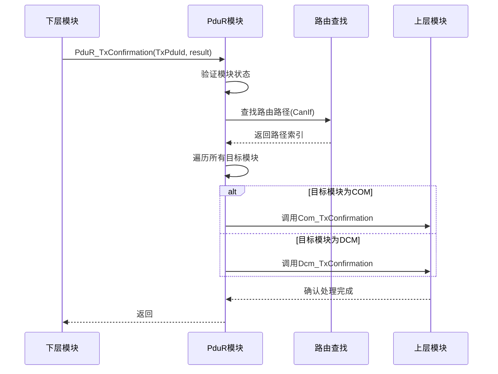

**图表来源**
- [PduR.c:512-571](file://src/bsw/services/pdur/src/PduR.c#L512-L571)

**章节来源**
- [PduR.c:474-504](file://src/bsw/services/pdur/src/PduR.c#L474-L504)
- [PduR.c:512-571](file://src/bsw/services/pdur/src/PduR.c#L512-L571)

### FIFO队列管理

#### FIFO队列结构

PduR实现了基于环形缓冲区的FIFO队列：

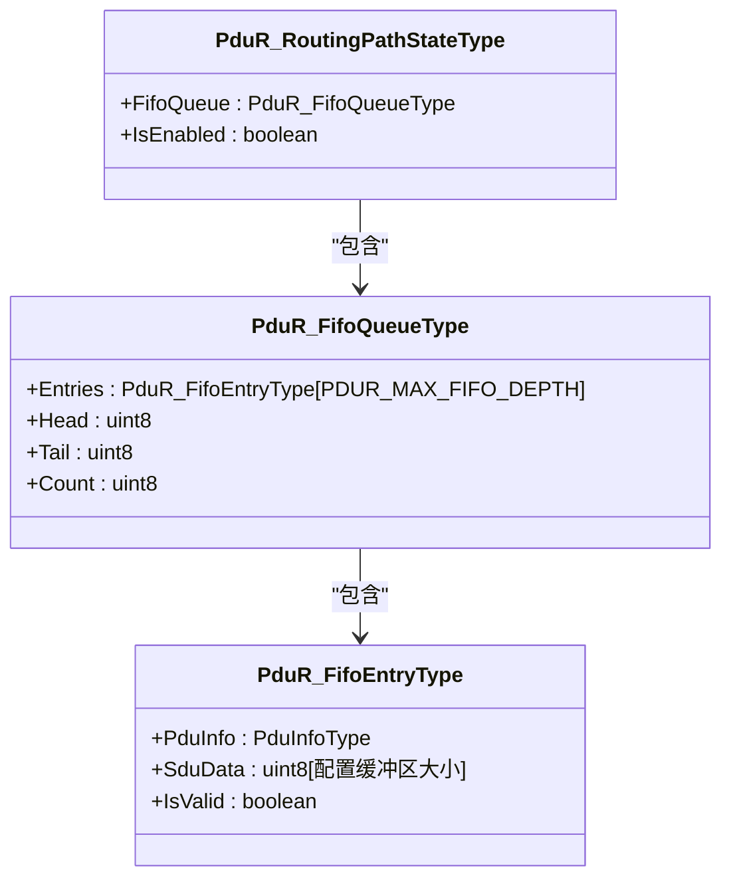

**图表来源**
- [PduR.c:65-86](file://src/bsw/services/pdur/src/PduR.c#L65-L86)

#### FIFO操作流程

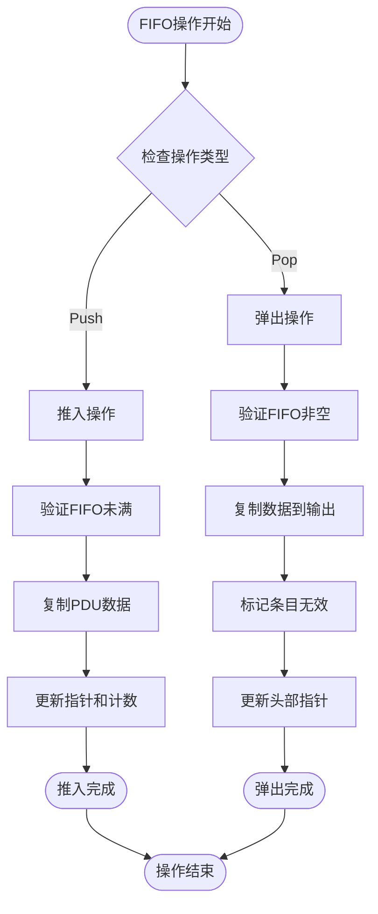

**图表来源**
- [PduR.c:253-329](file://src/bsw/services/pdur/src/PduR.c#L253-L329)

**章节来源**
- [PduR.c:253-329](file://src/bsw/services/pdur/src/PduR.c#L253-L329)

### 主函数处理

#### PduR_MainFunction

PduR_MainFunction是模块的周期性处理函数：

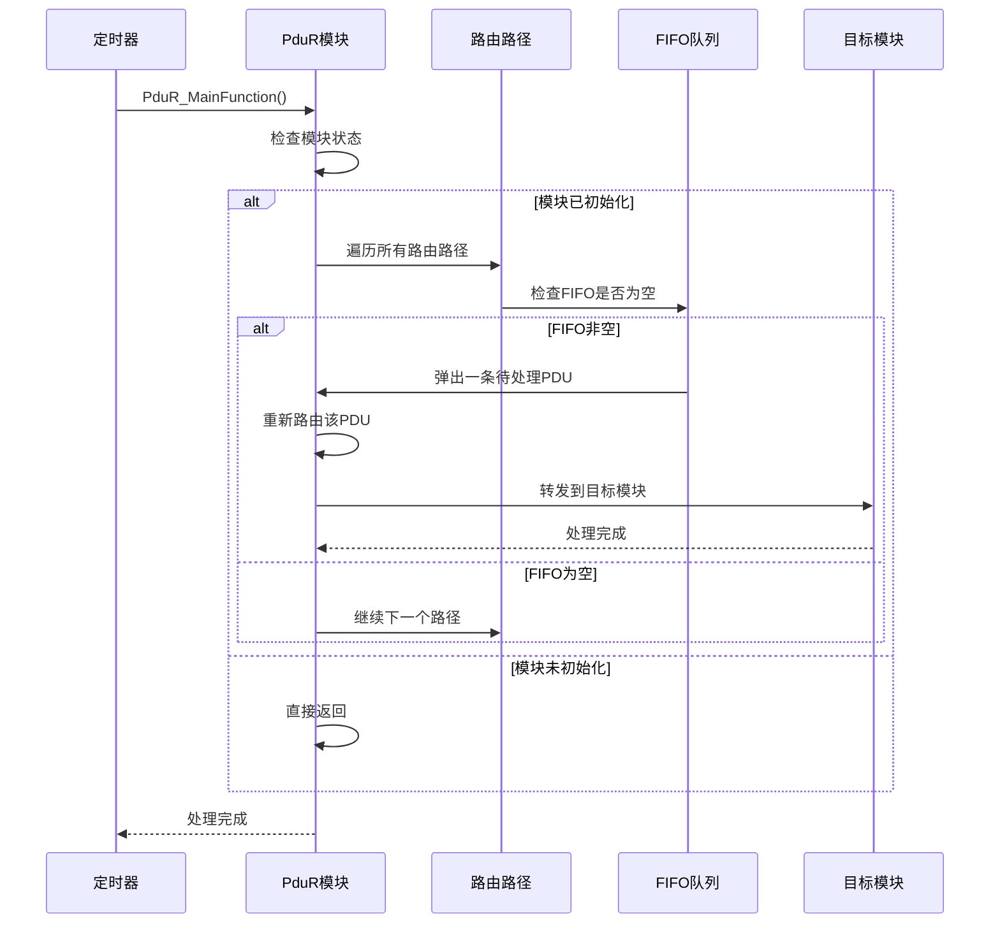

**图表来源**
- [PduR.c:746-772](file://src/bsw/services/pdur/src/PduR.c#L746-L772)

**章节来源**
- [PduR.c:746-772](file://src/bsw/services/pdur/src/PduR.c#L746-L772)

## 依赖关系分析

### 模块间依赖

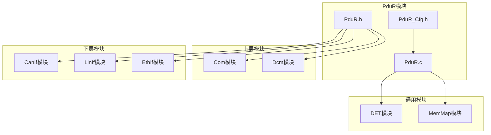

**图表来源**
- [PduR_spec.md:261-275](file://openspec/changes/dev-pdu-router/specs/PduR_spec.md#L261-L275)

### 外部接口依赖

PduR模块依赖以下外部接口：

| 接口模块 | 函数名称 | 用途 |
|----------|----------|------|
| Com | Com_RxIndication | 上行接收指示 |
| Com | Com_TxConfirmation | 传输确认 |
| Com | Com_TriggerTransmit | 触发传输 |
| Dcm | Dcm_RxIndication | 上行接收指示 |
| Dcm | Dcm_TxConfirmation | 传输确认 |
| Dcm | Dcm_TriggerTransmit | 触发传输 |
| CanIf | CanIf_Transmit | 下行传输 |
| CanIf | CanIf_CancelTransmit | 取消传输 |
| CanIf | CanIf_RxIndication | 上行接收指示 |
| CanIf | CanIf_TxConfirmation | 传输确认 |
| CanIf | CanIf_TriggerTransmit | 触发传输 |

**章节来源**
- [PduR.c:28-35](file://src/bsw/services/pdur/src/PduR.c#L28-L35)

## 性能考虑

### 时间复杂度分析

| 操作 | 时间复杂度 | 说明 |
|------|------------|------|
| 路由查找 | O(n) | n为路由路径数量，线性搜索 |
| FIFO操作 | O(1) | 队列入队出队操作 |
| 主函数处理 | O(m×k) | m为路由路径数量，k为每路径目标数量 |
| 内存分配 | O(1) | 静态内存分配，无动态分配 |

### 空间复杂度分析

| 组件 | 空间复杂度 | 说明 |
|------|------------|------|
| 配置结构 | O(p) | p为路由路径数量 |
| FIFO缓冲区 | O(f×b) | f为最大FIFO深度，b为每个条目缓冲区大小 |
| 路径状态 | O(p) | p为路由路径数量 |
| 内部状态 | O(1) | 固定大小的内部状态结构 |

### 性能优化建议

1. **路由路径缓存**：考虑添加路由路径哈希表以优化查找性能
2. **批量处理**：在主函数中实现批量处理以减少上下文切换
3. **内存池**：使用内存池管理FIFO条目以减少碎片
4. **中断处理**：优化中断处理路径以减少延迟

**章节来源**
- [pdur_verification.md:103-112](file://verification/pdur_verification.md#L103-L112)

## 故障排除指南

### 常见错误诊断

#### 初始化相关错误

| 错误代码 | 触发条件 | 解决方案 |
|----------|----------|----------|
| PDUR_E_UNINIT | 在模块未初始化状态下调用API | 确保先调用PduR_Init |
| PDUR_E_PARAM_POINTER | 传递NULL指针 | 检查传入的配置指针和PDU信息指针 |
| PDUR_E_PARAM_CONFIG | 配置无效 | 验证配置结构的完整性 |

#### 路由相关错误

| 错误代码 | 触发条件 | 解决方案 |
|----------|----------|----------|
| PDUR_E_ROUTING_PATH_NOT_FOUND | 未找到匹配的路由路径 | 检查PDU ID和模块类型配置 |
| PDUR_E_INVALID_PDU_ID | PDU ID无效 | 验证PDU ID在配置范围内 |
| PDUR_E_FIFO_FULL | FIFO队列已满 | 增加FIFO深度或优化处理频率 |

#### 单元测试验证

PduR模块提供了完整的单元测试覆盖：

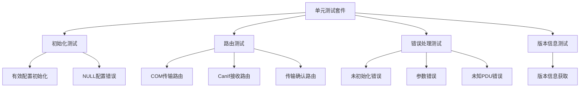

**图表来源**
- [PduR_test.c:136-325](file://src/bsw/services/pdur/src/PduR_test.c#L136-L325)

**章节来源**
- [PduR_test.c:136-325](file://src/bsw/services/pdur/src/PduR_test.c#L136-L325)

### 调试技巧

1. **启用DET**：确保PDUR_DEV_ERROR_DETECT设置为STD_ON以捕获开发错误
2. **日志记录**：在关键路径添加调试输出
3. **配置验证**：使用静态分析工具验证配置结构
4. **边界测试**：测试FIFO队列满/空状态

## 结论

PduR模块是一个功能完整、设计合理的AutoSAR服务层模块，具有以下特点：

**优势**：
- 符合AutoSAR 4.x标准，接口规范明确
- 实现了完整的路由功能，支持多播和延迟处理
- 提供了完善的错误检测和处理机制
- 代码结构清晰，易于维护和扩展

**应用场景**：
- CAN总线通信系统的PDU路由
- 多模块间的信号交换
- 诊断通信的数据传输
- 跨总线的网关功能

**改进建议**：
- 考虑添加路由路径缓存以提升性能
- 支持更多路由算法和优先级机制
- 增强对LIN和以太网总线的支持
- 添加更多的监控和诊断功能

## 附录

### API参考表

#### 核心生命周期API

| API名称 | 函数原型 | 描述 |
|---------|----------|------|
| PduR_Init | void PduR_Init(const PduR_ConfigType* ConfigPtr) | 初始化PduR模块 |
| PduR_DeInit | void PduR_DeInit(void) | 反初始化PduR模块 |
| PduR_GetVersionInfo | void PduR_GetVersionInfo(Std_VersionInfoType* versioninfo) | 获取版本信息 |

#### 传输相关API

| API名称 | 函数原型 | 描述 |
|---------|----------|------|
| PduR_Transmit | Std_ReturnType PduR_Transmit(PduIdType TxPduId, const PduInfoType* PduInfoPtr) | 通用传输处理 |
| PduR_ComTransmit | Std_ReturnType PduR_ComTransmit(PduIdType TxPduId, const PduInfoType* PduInfoPtr) | COM传输映射 |
| PduR_DcmTransmit | Std_ReturnType PduR_DcmTransmit(PduIdType TxPduId, const PduInfoType* PduInfoPtr) | DCM传输映射 |
| PduR_CancelTransmitRequest | Std_ReturnType PduR_CancelTransmitRequest(PduIdType TxPduId) | 取消传输请求 |
| PduR_CancelReceiveRequest | Std_ReturnType PduR_CancelReceiveRequest(PduIdType RxPduId) | 取消接收请求 |

#### 回调处理API

| API名称 | 函数原型 | 描述 |
|---------|----------|------|
| PduR_RxIndication | void PduR_RxIndication(PduIdType RxPduId, const PduInfoType* PduInfoPtr) | 通用接收指示处理 |
| PduR_TxConfirmation | void PduR_TxConfirmation(PduIdType TxPduId, Std_ReturnType result) | 通用传输确认处理 |
| PduR_TriggerTransmit | Std_ReturnType PduR_TriggerTransmit(PduIdType TxPduId, PduInfoType* PduInfoPtr) | 通用触发传输处理 |

#### 路由管理API

| API名称 | 函数原型 | 描述 |
|---------|----------|------|
| PduR_EnableRouting | void PduR_EnableRouting(uint8 id) | 启用路由路径组 |
| PduR_DisableRouting | void PduR_DisableRouting(uint8 id) | 禁用路由路径组 |
| PduR_MainFunction | void PduR_MainFunction(void) | 周期性主函数 |

### 配置参数说明

#### 编译时配置

| 参数名称 | 默认值 | 描述 |
|----------|--------|------|
| PDUR_DEV_ERROR_DETECT | STD_ON | 开发错误检测开关 |
| PDUR_VERSION_INFO_API | STD_ON | 版本信息API开关 |
| PDUR_NUMBER_OF_ROUTING_PATHS | 16U | 路由路径最大数量 |
| PDUR_NUMBER_OF_ROUTING_PATH_GROUPS | 4U | 路由路径组最大数量 |
| PDUR_MAX_DESTINATIONS_PER_PATH | 4U | 每路径最大目标数量 |
| PDUR_FIFO_DEPTH | 8U | FIFO队列深度 |
| PDUR_MAIN_FUNCTION_PERIOD_MS | 10U | 主函数执行周期 |

### 实际应用示例

#### CAN总线PDU路由配置

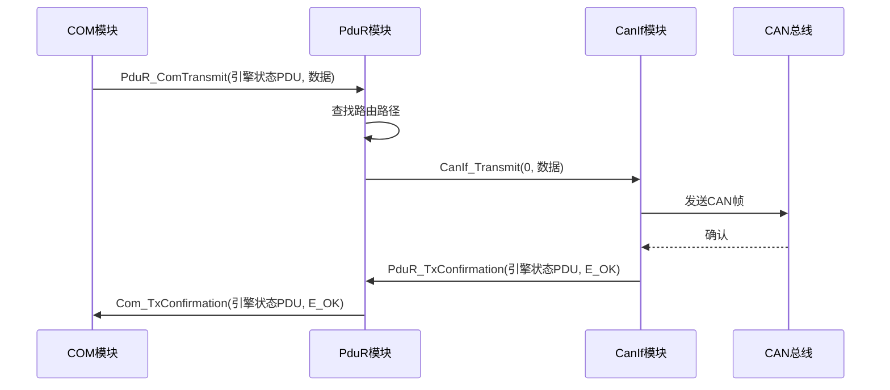

**图表来源**
- [PduR_Lcfg.c:114-199](file://src/bsw/services/pdur/src/PduR_Lcfg.c#L114-L199)

**章节来源**
- [PduR_Lcfg.c:114-199](file://src/bsw/services/pdur/src/PduR_Lcfg.c#L114-L199)