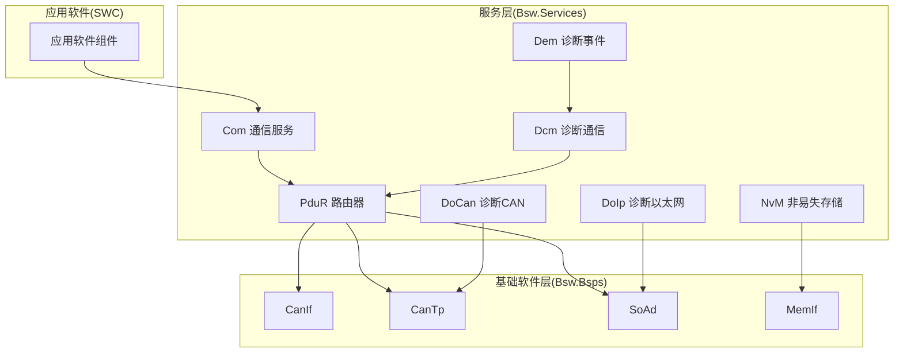
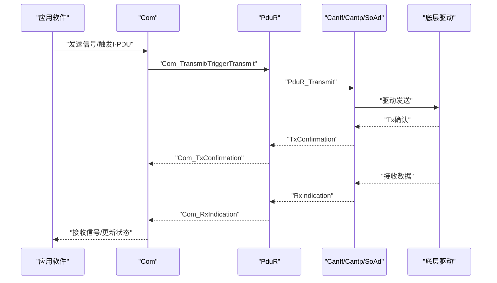
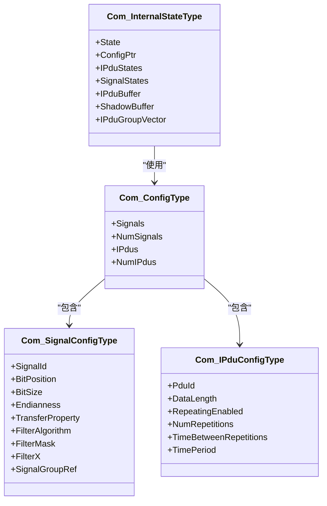
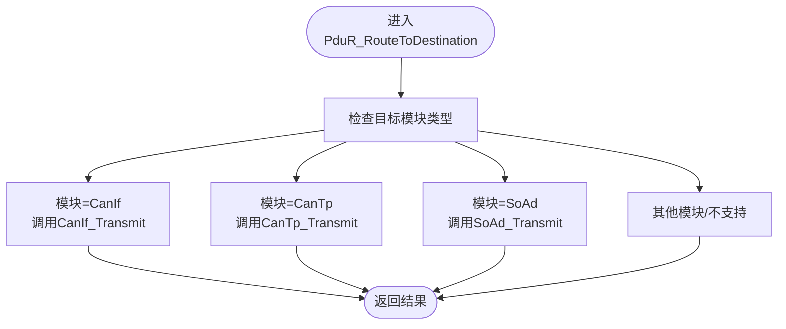
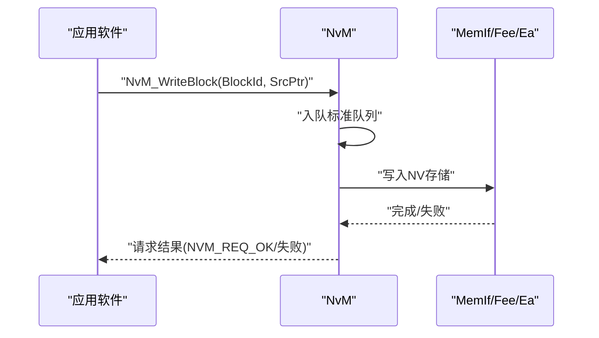
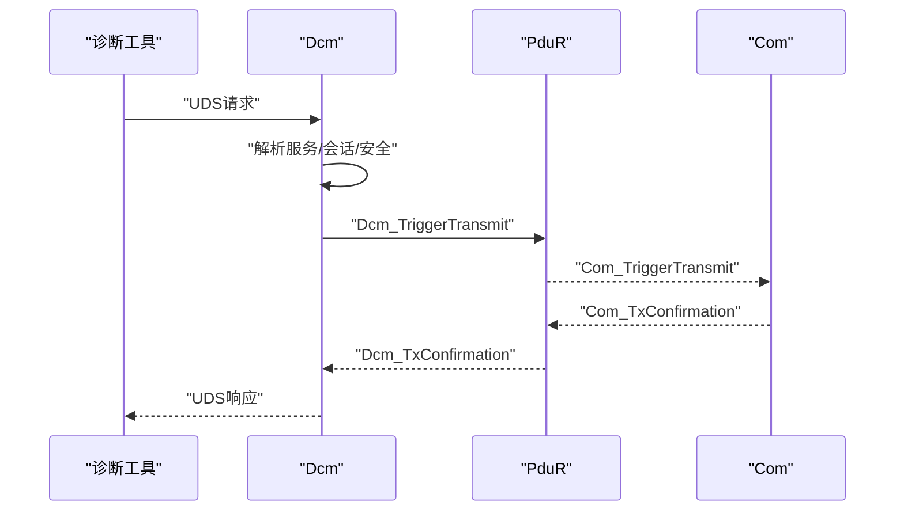
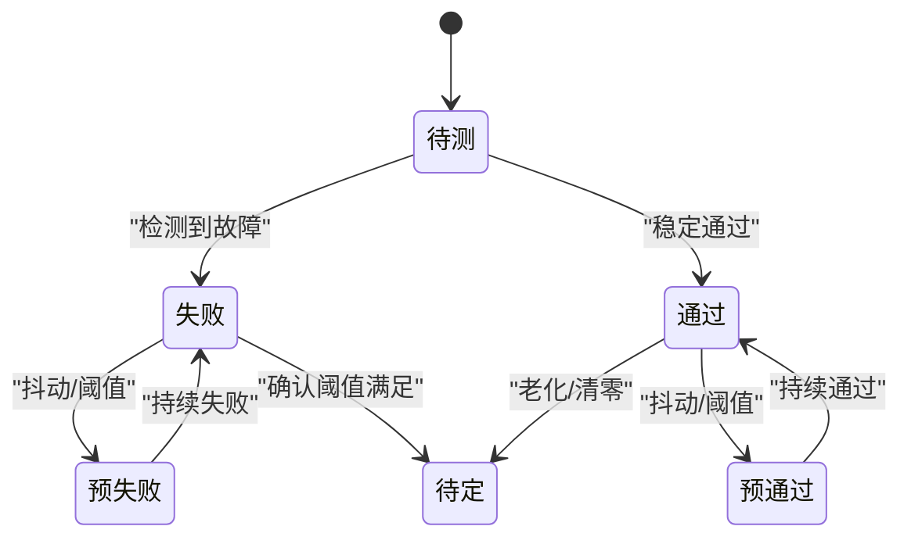
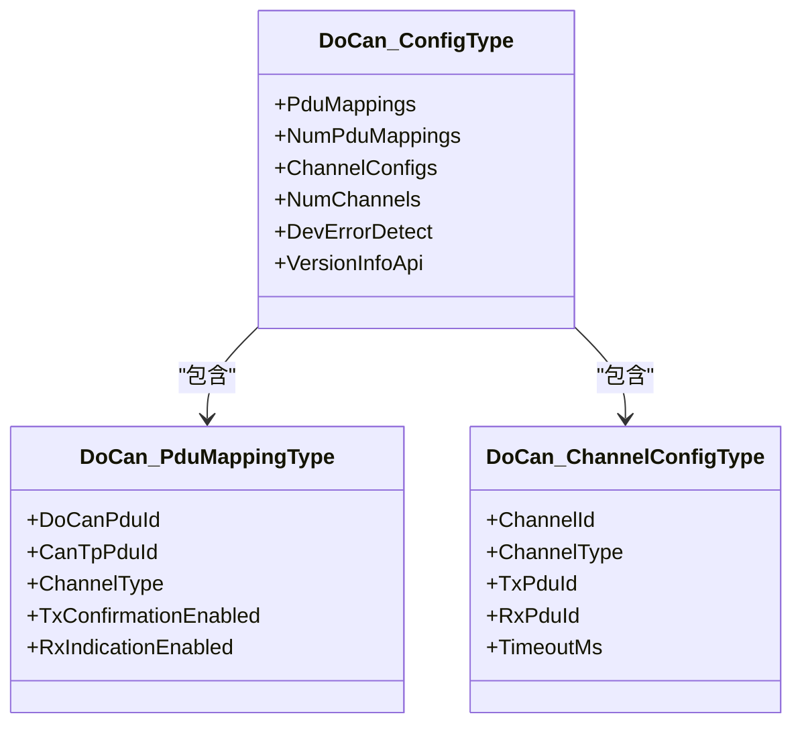
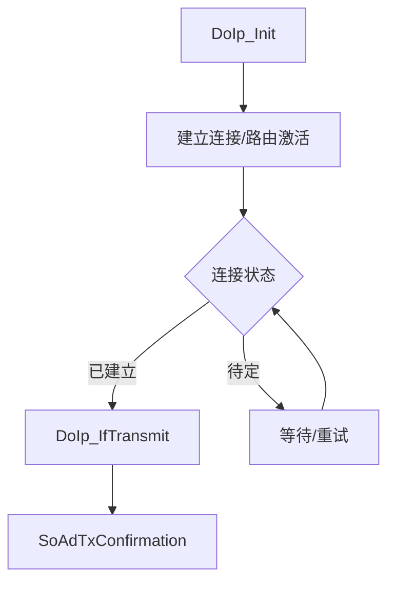
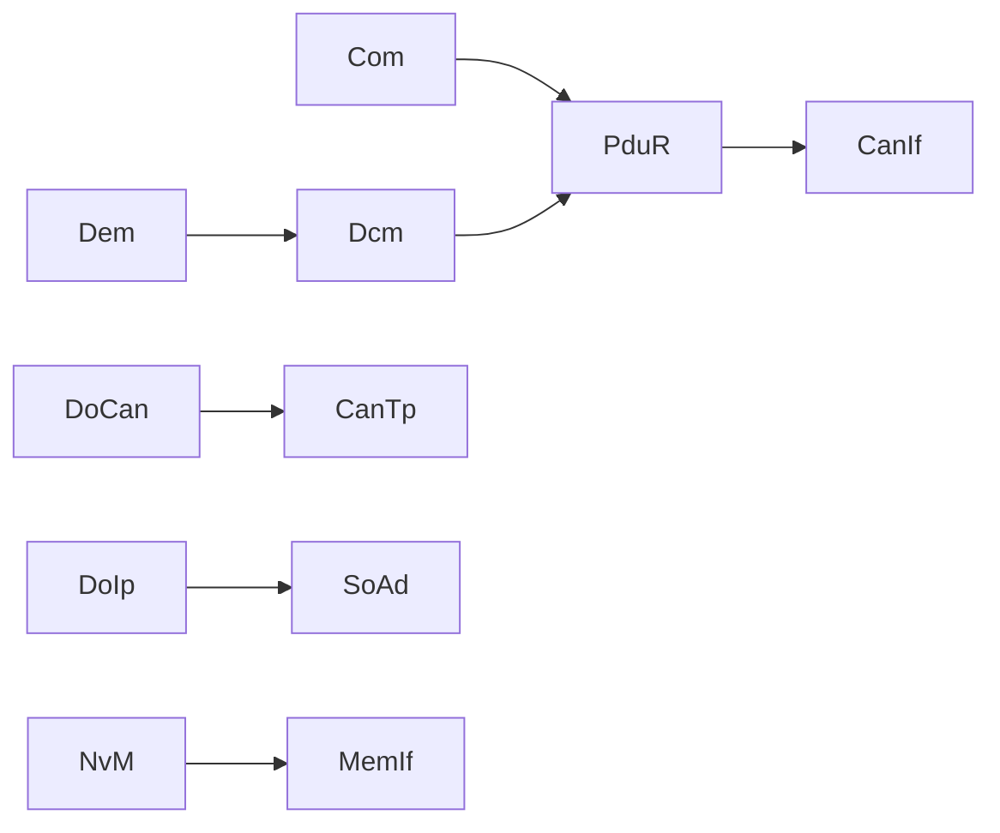

# 服务层API

<cite>
**本文引用的文件**
- [Com.h](file://src/bsw/services/com/include/Com.h)
- [Com_Cfg.h](file://src/bsw/services/com/include/Com_Cfg.h)
- [Com.c](file://src/bsw/services/com/src/Com.c)
- [PduR.h](file://src/bsw/services/pdur/include/PduR.h)
- [PduR_Cfg.h](file://src/bsw/services/pdur/include/PduR_Cfg.h)
- [PduR.c](file://src/bsw/services/pdur/src/PduR.c)
- [NvM.h](file://src/bsw/services/nvm/include/NvM.h)
- [NvM_Cfg.h](file://src/bsw/services/nvm/include/NvM_Cfg.h)
- [NvM.c](file://src/bsw/services/nvm/src/NvM.c)
- [Dcm.h](file://src/bsw/services/dcm/include/Dcm.h)
- [Dcm_Cfg.h](file://src/bsw/services/dcm/include/Dcm_Cfg.h)
- [Dem.h](file://src/bsw/services/dem/include/Dem.h)
- [Dem_Cfg.h](file://src/bsw/services/dem/include/Dem_Cfg.h)
- [DoCan.h](file://src/bsw/services/docan/include/DoCan.h)
- [DoCan_Cfg.h](file://src/bsw/services/docan/include/DoCan_Cfg.h)
- [DoIp.h](file://src/bsw/services/doip/include/DoIp.h)
- [DoIp_Cfg.h](file://src/bsw/services/doip/include/DoIp_Cfg.h)
- [main.c](file://examples/can_demo/main.c)
</cite>

## 目录
1. [简介](#简介)
2. [项目结构](#项目结构)
3. [核心组件](#核心组件)
4. [架构总览](#架构总览)
5. [详细组件分析](#详细组件分析)
6. [依赖分析](#依赖分析)
7. [性能考虑](#性能考虑)
8. [故障排查指南](#故障排查指南)
9. [结论](#结论)
10. [附录](#附录)

## 简介
本文件为服务层API参考文档，覆盖以下AUTOSAR Classic平台服务模块：
- 通信服务：Com（信号与I-PDU收发、路由、周期/触发传输）
- PDU路由器：PduR（上层模块与下层驱动之间的PDU路由、转发、回调桥接）
- NVRAM管理器：NvM（非易失存储块读写、CRC校验、镜像冗余、多块操作）
- 诊断通信管理器：Dcm（UDS/OBD协议栈入口，会话/安全/事件响应）
- 诊断事件管理器：Dem（DTC状态机、冻结帧、事件计数、指示灯）
- 诊断CAN：DoCan（基于CanTp的诊断报文封装与传输）
- 诊断以太网：DoIp（基于SoAd的诊断报文封装与传输）

文档内容包括各模块的公共接口、数据类型、配置参数、回调机制、初始化流程、主函数调度、错误码与处理策略，并通过图示展示模块间协作关系与典型工作流。

## 项目结构
服务层位于src/bsw/services目录下，按模块划分头文件include与源文件src，配置头文件include对应模块的Cfg.h。示例工程examples展示了CanIf/Can/Com/PduR的协同使用。

图表来源
- [Com.h:238-501](file://src/bsw/services/com/include/Com.h#L238-L501)
- [PduR.h:163-279](file://src/bsw/services/pdur/include/PduR.h#L163-L279)
- [NvM.h:186-352](file://src/bsw/services/nvm/include/NvM.h#L186-L352)
- [Dcm.h:277-376](file://src/bsw/services/dcm/include/Dcm.h#L277-L376)
- [Dem.h:314-538](file://src/bsw/services/dem/include/Dem.h#L314-L538)
- [DoCan.h:127-178](file://src/bsw/services/docan/include/DoCan.h#L127-L178)
- [DoIp.h:164-230](file://src/bsw/services/doip/include/DoIp.h#L164-L230)

章节来源
- [Com.h:1-508](file://src/bsw/services/com/include/Com.h#L1-L508)
- [PduR.h:1-282](file://src/bsw/services/pdur/include/PduR.h#L1-L282)
- [NvM.h:1-355](file://src/bsw/services/nvm/include/NvM.h#L1-L355)
- [Dcm.h:1-379](file://src/bsw/services/dcm/include/Dcm.h#L1-L379)
- [Dem.h:1-541](file://src/bsw/services/dem/include/Dem.h#L1-L541)
- [DoCan.h:1-180](file://src/bsw/services/docan/include/DoCan.h#L1-L180)
- [DoIp.h:1-233](file://src/bsw/services/doip/include/DoIp.h#L1-L233)

## 核心组件
本节概述各服务模块的核心职责与关键API能力。

- 通信服务 Com
  - 功能：信号打包/解包、I-PDU周期/触发发送、信号组聚合、Deadline监控、回调桥接（Rx/Tx确认/TriggerTransmit）
  - 关键API：初始化、状态查询、信号/组收发、I-PDU控制、主函数
  - 数据类型：信号/组/IPDU ID、传输模式、信号配置、IPDU配置、状态返回码
  - 错误码：参数、未初始化、无效ID、传输忙等

- PDU路由器 PduR
  - 功能：路由路径配置与查找、目标模块分发、FIFO队列、延迟/直传/网关模式、回调桥接
  - 关键API：初始化/去初始化、版本信息、Transmit/Cancel、Enable/DisableRouting、主函数
  - 数据类型：路由路径、目的PDU、路径组、返回类型
  - 错误码：指针/配置/请求非法、PDU ID无效、缓冲区长度等

- NVRAM管理器 NvM
  - 功能：块读写/擦除/失效、默认值恢复、CRC校验、镜像冗余、多块读写、作业队列
  - 关键API：初始化、SetDataIndex/GetErrorStatus、Read/Write/Erase/Invalidate、ReadAll/WriteAll、主函数
  - 数据类型：块描述符、块管理类型、CRC类型、请求结果类型
  - 错误码：未初始化、块挂起、块配置、参数、锁定/写保护

- 诊断通信管理器 Dcm
  - 功能：会话/安全/服务解析、消息上下文、回调桥接、主函数
  - 关键API：初始化/启动/停止/去初始化、版本信息、安全级别/会话控制、触发事件、Tx/Rx确认/TriggerTransmit、主函数
  - 数据类型：会话类型、安全等级、协议类型、负响应码、DID/RID配置、消息上下文
  - 错误码：接口超时/返回值/溢出、未初始化、参数、无效值

- 诊断事件管理器 Dem
  - 功能：事件状态机、DTC状态掩码、冻结帧/扩展数据、指示灯、操作循环、主函数
  - 关键API：初始化/关闭、事件状态设置/重置、DTC清除/查询、冻结帧获取、主函数
  - 数据类型：事件状态、DTC格式/严重度/来源、事件参数、DTC参数、记录类型
  - 错误码：参数配置/数据/指针、未初始化、无可用数据、条件错误、配置错误

- 诊断CAN DoCan
  - 功能：物理/功能通道映射、CanTp传输、超时控制、状态机
  - 关键API：初始化/去初始化、版本信息、Transmit/RxIndication/TxConfirmation、主函数
  - 数据类型：通道类型/状态、PDU映射、通道配置
  - 错误码：参数/配置/未初始化/无效PDU/通道/传输失败

- 诊断以太网 DoIp
  - 功能：连接状态管理、路由激活、Alive检查、SoAd桥接
  - 关键API：初始化/去初始化、版本信息、IfTransmit/IfRxIndication、ActivateRouting/CloseConnection、SoAdTxConfirmation、主函数
  - 数据类型：状态/连接状态/路由激活类型、通用头部、连接配置、路由激活配置
  - 错误码：参数/配置/未初始化/无效PDU/连接/路由激活参数

章节来源
- [Com.h:238-501](file://src/bsw/services/com/include/Com.h#L238-L501)
- [PduR.h:163-279](file://src/bsw/services/pdur/include/PduR.h#L163-L279)
- [NvM.h:186-352](file://src/bsw/services/nvm/include/NvM.h#L186-L352)
- [Dcm.h:277-376](file://src/bsw/services/dcm/include/Dcm.h#L277-L376)
- [Dem.h:314-538](file://src/bsw/services/dem/include/Dem.h#L314-L538)
- [DoCan.h:127-178](file://src/bsw/services/docan/include/DoCan.h#L127-L178)
- [DoIp.h:164-230](file://src/bsw/services/doip/include/DoIp.h#L164-L230)

## 架构总览
服务层在AUTOSAR Classic平台中处于BSW高层，向上对接RTE/ASW，向下对接各BSP驱动。Com负责信号与I-PDU的编解码与调度；PduR作为路由中枢，将上层请求分发到具体驱动；NvM提供非易失存储抽象；Dcm/Dem统一处理诊断相关业务；DoCan/DoIp分别承载CAN与以太网诊断链路。

图表来源
- [Com.h:431-463](file://src/bsw/services/com/include/Com.h#L431-L463)
- [PduR.h:256-276](file://src/bsw/services/pdur/include/PduR.h#L256-L276)
- [DoCan.h:155-169](file://src/bsw/services/docan/include/DoCan.h#L155-L169)
- [DoIp.h:192-222](file://src/bsw/services/doip/include/DoIp.h#L192-L222)

## 详细组件分析

### 通信服务 Com
- 初始化与状态
  - 初始化：加载配置结构，建立信号/IPDU/组向量映射，清空内部状态
  - 状态查询：模块状态、配置ID、版本信息（可选）
- 信号与I-PDU
  - 发送/接收单个信号与信号组，支持无效化
  - 触发I-PDU发送、切换传输模式、查询状态与计数
- 回调桥接
  - 上行：Com_TriggerTransmit、Com_RxIndication、Com_TxConfirmation
  - 下行：通过PduR转发至CanIf/Cantp/SoAd
- 主函数
  - 接收主函数：处理Deadline监控、过滤与更新
  - 发送主函数：周期调度、重复次数、时间片推进
  - 信号路由主函数：将已更新信号打包进对应I-PDU缓冲

图表来源
- [Com.h:221-227](file://src/bsw/services/com/include/Com.h#L221-L227)
- [Com.h:198-219](file://src/bsw/services/com/include/Com.h#L198-L219)
- [Com.h:89-99](file://src/bsw/services/com/include/Com.h#L89-L99)
- [Com.h:99-131](file://src/bsw/services/com/include/Com.h#L99-L131)

章节来源
- [Com.h:243-498](file://src/bsw/services/com/include/Com.h#L243-L498)
- [Com_Cfg.h:1-124](file://src/bsw/services/com/include/Com_Cfg.h#L1-L124)
- [Com.c:1-200](file://src/bsw/services/com/src/Com.c#L1-L200)

### PDU路由器 PduR
- 路由路径与分发
  - 源PDU定位、目标模块分发、直传/FIFO/网关三种路径类型
  - 支持路由路径组启用/禁用
- 缓冲与队列
  - FIFO队列深度可配，入队/出队与满/空判定
- 回调桥接
  - 上行：PduR_TxConfirmation、PduR_RxIndication、PduR_TriggerTransmit
  - 下行：对CanIf/Cantp/SoAd等模块的Transmit/Cancel/Indication映射
- 主函数
  - 周期性处理队列与状态机推进

图表来源
- [PduR.c:191-200](file://src/bsw/services/pdur/src/PduR.c#L191-L200)

章节来源
- [PduR.h:168-279](file://src/bsw/services/pdur/include/PduR.h#L168-L279)
- [PduR_Cfg.h:1-67](file://src/bsw/services/pdur/include/PduR_Cfg.h#L1-L67)
- [PduR.c:125-200](file://src/bsw/services/pdur/src/PduR.c#L125-L200)

### NVRAM管理器 NvM
- 块管理
  - 原生/冗余/数据集三类管理模式，支持镜像与压缩
  - CRC类型可选，支持CRC一致性校验与压缩机制
- 作业队列
  - 标准队列与即时队列，支持多块读写、取消作业、Kill操作
- 关键操作
  - 单块读写/擦除/失效、默认值恢复、多块ReadAll/WriteAll
  - 数据索引设置、错误状态查询、块保护/锁定、写一次保护
- 主函数
  - 周期性推进当前作业、重试与回调

图表来源
- [NvM.h:229-235](file://src/bsw/services/nvm/include/NvM.h#L229-L235)
- [NvM.h:349-349](file://src/bsw/services/nvm/include/NvM.h#L349-L349)

章节来源
- [NvM.h:186-352](file://src/bsw/services/nvm/include/NvM.h#L186-L352)
- [NvM_Cfg.h:1-88](file://src/bsw/services/nvm/include/NvM_Cfg.h#L1-L88)
- [NvM.c:174-200](file://src/bsw/services/nvm/src/NvM.c#L174-L200)

### 诊断通信管理器 Dcm
- 协议与会话
  - 支持OBD/UDS在CAN/FlexRay/IP上的协议族
  - 会话类型：默认/编程/扩展/安全系统
  - 安全等级与尝试限制
- 服务与数据
  - DID/RID配置、请求/响应缓冲区、消息上下文
  - 事件触发、代理信息设置/获取
- 回调桥接
  - Com/Dcm桥接：Tx/Rx确认、TriggerTransmit
- 主函数
  - 周期性处理会话/安全/定时器

图表来源
- [Dcm.h:363-368](file://src/bsw/services/dcm/include/Dcm.h#L363-L368)
- [Com.h:441-441](file://src/bsw/services/com/include/Com.h#L441-L441)

章节来源
- [Dcm.h:277-376](file://src/bsw/services/dcm/include/Dcm.h#L277-L376)
- [Dcm_Cfg.h:1-132](file://src/bsw/services/dcm/include/Dcm_Cfg.h#L1-L132)

### 诊断事件管理器 Dem
- 事件与DTC
  - 事件状态机：通过/失败/预通过/预失败/FDC阈值
  - DTC状态掩码：测试失败/本次运行/待定/确认/上次清零后/指示灯请求
  - 冻结帧与扩展数据记录
- 操作循环与老化
  - 电源/点火/暖机/OBD日循环/其他循环
  - 老化计数与阈值
- 主函数
  - 周期性推进事件状态、计数器与老化

图表来源
- [Dem.h:104-110](file://src/bsw/services/dem/include/Dem.h#L104-L110)
- [Dem.h:218-228](file://src/bsw/services/dem/include/Dem.h#L218-L228)

章节来源
- [Dem.h:314-538](file://src/bsw/services/dem/include/Dem.h#L314-L538)
- [Dem_Cfg.h:1-158](file://src/bsw/services/dem/include/Dem_Cfg.h#L1-L158)

### 诊断CAN DoCan
- 通道与映射
  - 物理/功能通道，PDU映射表，超时控制
- 传输与回调
  - 通过CanTp进行诊断报文传输，支持RxIndication/TxConfirmation
- 主函数
  - 周期性推进通道状态机与超时

图表来源
- [DoCan.h:105-113](file://src/bsw/services/docan/include/DoCan.h#L105-L113)
- [DoCan.h:84-101](file://src/bsw/services/docan/include/DoCan.h#L84-L101)

章节来源
- [DoCan.h:127-178](file://src/bsw/services/docan/include/DoCan.h#L127-L178)
- [DoCan_Cfg.h:1-54](file://src/bsw/services/docan/include/DoCan_Cfg.h#L1-L54)

### 诊断以太网 DoIp
- 连接与路由
  - 连接状态：关闭/待定/已建立/已注册
  - 路由激活类型：默认/WWH-OBD/中央安全
- 传输与回调
  - 通过SoAd进行诊断报文传输，支持IfRxIndication/SoAdTxConfirmation
- 主函数
  - 周期性推进连接状态与Alive检查

图表来源
- [DoIp.h:173-227](file://src/bsw/services/doip/include/DoIp.h#L173-L227)

章节来源
- [DoIp.h:164-230](file://src/bsw/services/doip/include/DoIp.h#L164-L230)
- [DoIp_Cfg.h:1-64](file://src/bsw/services/doip/include/DoIp_Cfg.h#L1-L64)

## 依赖分析
- 组件耦合
  - Com依赖PduR进行下行转发，依赖Det进行错误上报
  - PduR依赖多个上层模块（Com/Dcm）与下层模块（CanIf/Cantp/SoAd）
  - NvM依赖MemIf/Fee/Ea等存储抽象
  - Dcm依赖PduR与Com桥接，Dem依赖Dcm
  - DoCan/DoIp分别依赖Cantp/SoAd
- 可能的循环依赖
  - 当前设计通过回调接口避免直接循环依赖
- 外部集成点
  - Com与PduR之间通过回调接口解耦
  - Dcm与PduR之间通过回调接口解耦

图表来源
- [Com.h:431-463](file://src/bsw/services/com/include/Com.h#L431-L463)
- [PduR.h:256-276](file://src/bsw/services/pdur/include/PduR.h#L256-L276)
- [Dcm.h:353-368](file://src/bsw/services/dcm/include/Dcm.h#L353-L368)
- [DoCan.h:155-169](file://src/bsw/services/docan/include/DoCan.h#L155-L169)
- [DoIp.h:192-222](file://src/bsw/services/doip/include/DoIp.h#L192-L222)

章节来源
- [PduR.c:28-36](file://src/bsw/services/pdur/src/PduR.c#L28-L36)

## 性能考虑
- 主函数周期
  - Com/PduR/NvM/Dcm/Dem/DoCan/DoIp均提供主函数周期配置，建议根据实时性需求调整
- FIFO与队列
  - PduR/FIFO深度与NvM队列大小需结合负载评估，避免拥塞
- 传输模式
  - Com支持Direct/Periodic/Mixed/None，合理选择可降低总线负载
- CRC与冗余
  - NvM启用CRC与镜像会增加CPU与存储开销，需权衡可靠性与成本
- 回调链路
  - 减少回调中的阻塞操作，避免影响主函数时序

## 故障排查指南
- 通信服务 Com
  - 常见错误：未初始化、参数非法、无效信号/IPDU ID、传输忙
  - 排查要点：确认初始化顺序、检查信号配置与端序、观察I-PDU状态
- PDU路由器 PduR
  - 常见错误：PDU ID无效、路由路径未找到、FIFO满、请求非法
  - 排查要点：核对路由路径配置、检查目的模块映射、关注队列深度
- NVRAM管理器 NvM
  - 常见错误：未初始化、块挂起、块配置错误、参数/指针错误、锁定/写保护
  - 排查要点：确认块描述符、CRC与镜像配置、作业队列状态
- 诊断通信管理器 Dcm
  - 常见错误：接口超时/返回值/溢出、未初始化、参数、无效值
  - 排查要点：检查协议/会话/安全配置、缓冲区大小、定时参数
- 诊断事件管理器 Dem
  - 常见错误：参数配置/数据/指针、未初始化、无可用数据、条件错误、配置错误
  - 排查要点：事件阈值与去抖配置、DTC状态掩码、冻结帧大小
- 诊断CAN DoCan
  - 常见错误：参数/配置/未初始化/无效PDU/通道/传输失败
  - 排查要点：通道映射、超时参数、CanTp链路状态
- 诊断以太网 DoIp
  - 常见错误：参数/配置/未初始化/无效PDU/连接/路由激活参数
  - 排查要点：逻辑地址、路由激活类型、Alive检查

章节来源
- [Com.h:89-103](file://src/bsw/services/com/include/Com.h#L89-L103)
- [PduR.h:52-71](file://src/bsw/services/pdur/include/PduR.h#L52-L71)
- [NvM.h:66-77](file://src/bsw/services/nvm/include/NvM.h#L66-L77)
- [Dcm.h:66-76](file://src/bsw/services/dcm/include/Dcm.h#L66-L76)
- [Dem.h:87-97](file://src/bsw/services/dem/include/Dem.h#L87-L97)
- [DoCan.h:47-55](file://src/bsw/services/docan/include/DoCan.h#L47-L55)
- [DoIp.h:48-58](file://src/bsw/services/doip/include/DoIp.h#L48-L58)

## 结论
服务层API围绕AUTOSAR Classic平台的标准模块职责构建，通过清晰的接口与回调机制实现上层应用与底层驱动的解耦。配置头文件提供了灵活的参数化能力，主函数调度确保了实时性与稳定性。在实际工程中，应结合系统负载与实时性要求，合理配置周期、队列与传输模式，并完善错误处理与诊断事件管理，以获得可靠的诊断与通信能力。

## 附录
- 实际应用场景示例
  - CAN通信演示：展示了Can/CanIf/Com/PduR的协同使用，包括回调与主函数处理
  - 参考路径：[main.c:63-118](file://examples/can_demo/main.c#L63-L118)

章节来源
- [main.c:1-119](file://examples/can_demo/main.c#L1-L119)