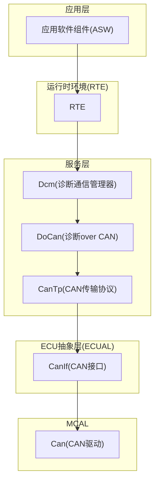
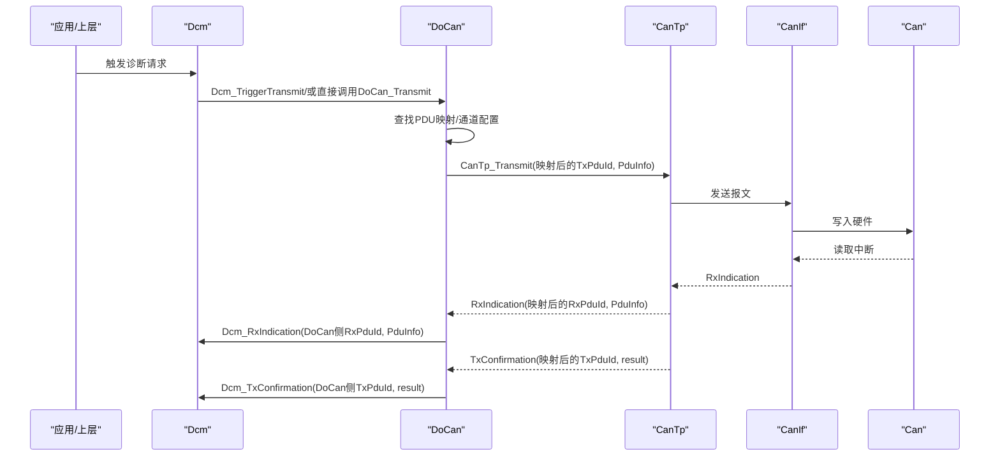
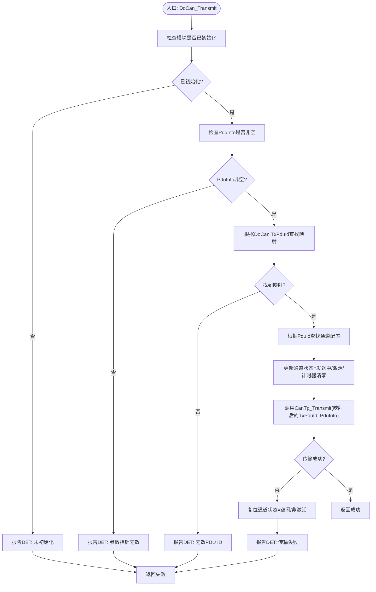
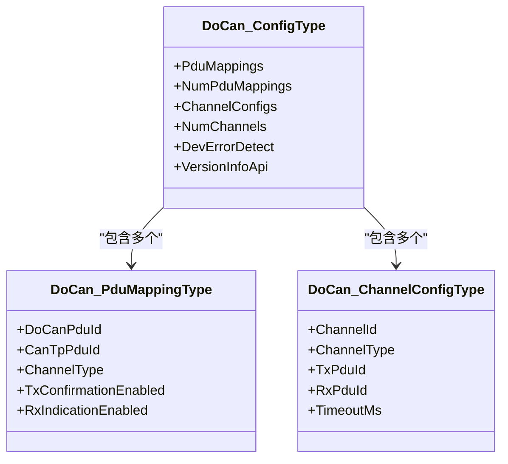
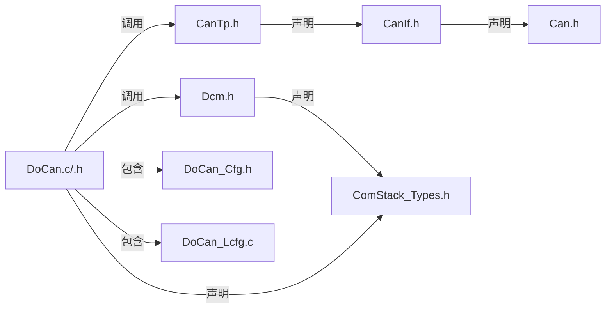

# 诊断CAN(DoCan)API

<cite>
**本文引用的文件**
- [DoCan.h](file://src/bsw/services/docan/include/DoCan.h)
- [DoCan.c](file://src/bsw/services/docan/src/DoCan.c)
- [DoCan_Cfg.h](file://src/bsw/services/docan/include/DoCan_Cfg.h)
- [DoCan_Lcfg.c](file://src/bsw/services/docan/src/DoCan_Lcfg.c)
- [DoCan_test.c](file://src/bsw/services/docan/src/DoCan_test.c)
- [CanTp.h](file://src/bsw/ecual/cantp/include/CanTp.h)
- [Dcm.h](file://src/bsw/services/dcm/include/Dcm.h)
- [Can.h](file://src/bsw/mcal/can/include/Can.h)
- [CanIf.h](file://src/bsw/ecual/canif/include/CanIf.h)
- [integration_test_cfg.h](file://src/bsw/integration/tests/integration_test_cfg.h)
- [spec.md](file://openspec/specs/bsw/spec.md)
</cite>

## 目录
1. [简介](#简介)
2. [项目结构](#项目结构)
3. [核心组件](#核心组件)
4. [架构总览](#架构总览)
5. [详细组件分析](#详细组件分析)
6. [依赖关系分析](#依赖关系分析)
7. [性能考虑](#性能考虑)
8. [故障排查指南](#故障排查指南)
9. [结论](#结论)
10. [附录](#附录)

## 简介
本文件为诊断CAN（DoCan）模块的详细API参考文档，面向AutoSAR Classic Platform 4.x标准，聚焦于通过CAN总线承载UDS诊断服务的实现。文档涵盖DoCan初始化、CAN诊断通信、UDS诊断服务处理等核心API，并结合实际配置与测试用例，说明DoCan与底层CAN接口层（Can、CanIf）及上层协议栈（CanTp、Dcm）的集成机制、错误处理策略以及典型应用场景。

## 项目结构
DoCan位于服务层（Service Layer），作为诊断通信的适配层，向上对接Dcm（诊断通信管理器），向下对接CanTp（CAN传输协议），并通过CanIf/Can完成物理总线收发。其配置采用链接期配置（Link-Time Configuration），便于在编译阶段固化映射关系与通道参数。

图示来源
- [DoCan.c:18-30](file4/services/docan/src/DoCan.c#L18-L30)
- [CanTp.h:250-330](file://src/bsw/ecual/cantp/include/CanTp.h#L250-L330)
- [Dcm.h:282-379](file://src/bsw/services/dcm/include/Dcm.h#L282-L379)
- [CanIf.h:272-403](file://src/bsw/ecual/canif/include/CanIf.h#L272-L403)
- [Can.h:193-269](file://src/bsw/mcal/can/include/Can.h#L193-L269)

章节来源
- [DoCan.h:13-180](file://src/bsw/services/docan/include/DoCan.h#L13-L180)
- [DoCan_Cfg.h:1-54](file://src/bsw/services/docan/include/DoCan_Cfg.h#L1-L54)
- [DoCan_Lcfg.c:1-138](file://src/bsw/services/docan/src/DoCan_Lcfg.c#L1-L138)

## 核心组件
- DoCan模块：负责将Dcm侧的诊断PDU映射到CanTp侧的传输PDU，维护通道状态与超时，向上提供初始化、传输、接收指示、发送确认、主函数等接口；向下转发至CanTp，并在必要时回调Dcm。
- CanTp模块：实现ISO 15765-2（即ISO 14229 UDS）的传输层协议，提供传输、取消、参数变更、版本信息、主函数等接口。
- Dcm模块：实现UDS协议与服务处理，提供初始化、启动/停止、触发传输、接收指示、发送确认、主函数等接口。
- CanIf/Can：ECUAL层的CAN接口与驱动，提供控制器模式设置、PDU收发、波特率设置、主函数等接口。

章节来源
- [DoCan.c:187-446](file://src/bsw/services/docan/src/DoCan.c#L187-L446)
- [CanTp.h:250-330](file://src/bsw/ecual/cantp/include/CanTp.h#L250-L330)
- [Dcm.h:282-379](file://src/bsw/services/dcm/include/Dcm.h#L282-L379)
- [CanIf.h:272-403](file://src/bsw/ecual/canif/include/CanIf.h#L272-L403)
- [Can.h:193-269](file://src/bsw/mcal/can/include/Can.h#L193-L269)

## 架构总览
DoCan在诊断通信链路中的职责是“桥接”Dcm与CanTp，确保UDS请求/响应通过CanTp正确封装并在CAN总线上可靠传输。其内部维护通道状态机，配合主函数周期性检查超时，保证通信不会无限阻塞。

图示来源
- [DoCan.c:242-409](file://src/bsw/services/docan/src/DoCan.c#L242-L409)
- [DoCan.c:416-446](file://src/bsw/services/docan/src/DoCan.c#L416-L446)
- [CanTp.h:268-324](file://src/bsw/ecual/cantp/include/CanTp.h#L268-L324)
- [Dcm.h:352-373](file://src/bsw/services/dcm/include/Dcm.h#L352-L373)

## 详细组件分析

### 初始化与去初始化
- DoCan_Init：校验配置指针后保存配置，初始化所有通道状态为空闲、非激活、计时器清零，模块状态置为已初始化。
- DoCan_DeInit：若未初始化则报告DET错误；否则清除配置指针并将模块状态置为未初始化。

章节来源
- [DoCan.c:187-234](file://src/bsw/services/docan/src/DoCan.c#L187-L234)
- [DoCan.h:132-141](file://src/bsw/services/docan/include/DoCan.h#L132-L141)

### 诊断消息传输（DoCan_Transmit）
- 功能：将来自Dcm的诊断PDU经DoCan映射后转发给CanTp进行传输。
- 关键步骤：
  - 参数校验（初始化状态、PduInfo非空）。
  - 通过DoCan内部查找表定位PDU映射与对应通道。
  - 更新通道状态为“发送中”，并调用CanTp_Transmit。
  - 若传输失败，复位通道状态并按配置上报DET错误码。

图示来源
- [DoCan.c:242-303](file://src/bsw/services/docan/src/DoCan.c#L242-L303)

章节来源
- [DoCan.c:242-303](file://src/bsw/services/docan/src/DoCan.c#L242-L303)
- [DoCan.h:149-155](file://src/bsw/services/docan/include/DoCan.h#L149-L155)

### 接收指示（DoCan_RxIndication）
- 功能：当CanTp收到对端诊断响应时，DoCan根据CanTp RxPduId查找映射，更新通道状态为“接收中”，并调用Dcm_RxIndication将数据转交给Dcm。
- 关键点：仅在映射启用RxIndication时才转发；未初始化或PduInfo为空将报告DET错误。

章节来源
- [DoCan.c:311-359](file://src/bsw/services/docan/src/DoCan.c#L311-L359)
- [DoCan.h:157-162](file://src/bsw/services/docan/include/DoCan.h#L157-L162)

### 发送确认（DoCan_TxConfirmation）
- 功能：当CanTp完成一次发送后回调DoCan_TxConfirmation，DoCan根据CanTp TxPduId查找映射，更新通道状态为空闲并调用Dcm_TxConfirmation通知Dcm。
- 关键点：仅在映射启用TxConfirmation时才转发；未初始化将报告DET错误。

章节来源
- [DoCan.c:367-409](file://src/bsw/services/docan/src/DoCan.c#L367-L409)
- [DoCan.h:164-169](file://src/bsw/services/docan/include/DoCan.h#L164-L169)

### 主函数（DoCan_MainFunction）
- 功能：周期性扫描所有通道，递增各通道超时计数器；若超过配置的超时时间，则复位通道状态，避免死锁。
- 周期：由配置项DOCAN_MAIN_FUNCTION_PERIOD_MS决定，默认10ms。

章节来源
- [DoCan.c:416-446](file://src/bsw/services/docan/src/DoCan.c#L416-L446)
- [DoCan_Cfg.h:27](file://src/bsw/services/docan/include/DoCan_Cfg.h#L27)

### 版本信息（DoCan_GetVersionInfo）
- 功能：在开启版本信息API时，返回供应商ID、模块ID与软件版本号。
- 注意：未开启时该接口不生成代码。

章节来源
- [DoCan.c:453-473](file://src/bsw/services/docan/src/DoCan.c#L453-L473)
- [DoCan.h:143-147](file://src/bsw/services/docan/include/DoCan.h#L143-L147)

### 数据模型与配置
- PDU映射：将Dcm侧的诊断PDU与CanTp侧的传输PDU进行一一映射，同时指定通道类型（物理/功能）与是否启用Rx/Tx回调。
- 通道配置：定义每个通道的ID、类型、对应的Tx/Rx PDU以及超时时间（毫秒）。
- 全局配置：包含映射数组、通道数组、错误检测开关、版本信息API开关等。

图示来源
- [DoCan.h:84-113](file://src/bsw/services/docan/include/DoCan.h#L84-L113)
- [DoCan_Lcfg.c:26-130](file://src/bsw/services/docan/src/DoCan_Lcfg.c#L26-L130)

章节来源
- [DoCan.h:84-113](file://src/bsw/services/docan/include/DoCan.h#L84-L113)
- [DoCan_Lcfg.c:26-130](file://src/bsw/services/docan/src/DoCan_Lcfg.c#L26-L130)

### 与底层CAN接口的集成
- CanIf_SetControllerMode：在系统启动阶段设置控制器模式（例如启动），确保CanIf处于可收发状态。
- CanIf_Transmit：通过CanIf向总线发送诊断或普通报文。
- Can/MainFunction_*：底层驱动的主函数周期性执行读写、总线状态处理等。

章节来源
- [CanIf.h:289](file://src/bsw/ecual/canif/include/CanIf.h#L289)
- [CanIf.h:305](file://src/bsw/ecual/canif/include/CanIf.h#L305)
- [Can.h:211](file://src/bsw/mcal/can/include/Can.h#L211)
- [Can.h:236-256](file://src/bsw/mcal/can/include/Can.h#L236-L256)

### 实际应用示例：UDS诊断通过CAN总线
- 场景描述：应用通过Dcm发起UDS请求（如读取数据标识符），DoCan将其映射到CanTp传输PDU并发送；对端ECU回复后，DoCan将响应转发给Dcm处理。
- 关键路径：Dcm_TriggerTransmit → DoCan_Transmit → CanTp_Transmit → CanIf → Can；接收路径相反。
- 示例参考：单元测试中对DoCan_Transmit/DoCan_RxIndication/DoCan_TxConfirmation的断言，展示了典型交互流程。

章节来源
- [DoCan_test.c:135-192](file://src/bsw/services/docan/src/DoCan_test.c#L135-L192)
- [Dcm.h:368](file://src/bsw/services/dcm/include/Dcm.h#L368)
- [CanTp.h:268](file://src/bsw/ecual/cantp/include/CanTp.h#L268)

## 依赖关系分析
DoCan对外部模块的依赖主要体现在接口声明与调用关系上，内部通过查找表完成解耦。

图示来源
- [DoCan.c:27-30](file://src/bsw/services/docan/src/DoCan.c#L27-L30)
- [DoCan.h:19-22](file://src/bsw/services/docan/include/DoCan.h#L19-L22)
- [CanTp.h:20-23](file://src/bsw/ecual/cantp/include/CanTp.h#L20-L23)
- [Dcm.h:20-23](file://src/bsw/services/dcm/include/Dcm.h#L20-L23)
- [CanIf.h:19-22](file://src/bsw/ecual/canif/include/CanIf.h#L19-L22)
- [Can.h:19-21](file://src/bsw/mcal/can/include/Can.h#L19-L21)

章节来源
- [DoCan.c:27-30](file://src/bsw/services/docan/src/DoCan.c#L27-L30)
- [DoCan.h:19-22](file://src/bsw/services/docan/include/DoCan.h#L19-L22)

## 性能考虑
- 主函数周期：默认10ms，影响超时检测精度与资源占用。可根据系统实时性需求调整。
- 通道数量与映射：最大通道数与PDU映射数受编译期配置限制，过多映射会增加查找开销。
- 传输路径：DoCan仅做映射与状态管理，关键吞吐由CanTp/CanIf/Can承担，应关注底层驱动的中断处理与缓冲区管理。

## 故障排查指南
- 常见DET错误码
  - 未初始化：DoCan_Init前调用传输/接收/确认接口。
  - 参数指针无效：传入NULL的PduInfo。
  - 无效PDU ID：找不到对应映射或通道配置。
  - 传输失败：CanTp_Transmit返回失败时DoCan会复位通道并上报。
- 排查步骤
  - 确认DoCan_Init已成功调用且配置有效。
  - 检查DoCan_Config中的PDU映射与通道配置是否覆盖目标诊断ID。
  - 在DoCan_MainFunction周期内观察通道状态变化与超时日志。
  - 使用单元测试中的断言场景对照当前行为，定位问题环节。

章节来源
- [DoCan.c:43-48](file://src/bsw/services/docan/src/DoCan.c#L43-L48)
- [DoCan.c:191-200](file://src/bsw/services/docan/src/DoCan.c#L191-L200)
- [DoCan_test.c:121-133](file://src/bsw/services/docan/src/DoCan_test.c#L121-L133)

## 结论
DoCan作为诊断通信的桥梁，通过明确的PDU映射与通道状态机，实现了Dcm与CanTp之间的稳定对接。其设计遵循AutoSAR分层架构，具备良好的可配置性与可测试性。结合CanIf/Can的底层支持，可满足UDS诊断在CAN总线上的可靠传输需求。

## 附录

### API一览与使用要点
- DoCan_Init(ConfigPtr)
  - 用途：初始化模块，保存配置并重置通道状态。
  - 注意：ConfigPtr不可为NULL。
- DoCan_DeInit()
  - 用途：去初始化，释放配置并置未初始化状态。
- DoCan_Transmit(TxPduId, PduInfoPtr)
  - 用途：发起诊断传输，返回E_OK/E_NOT_OK。
  - 注意：需确保映射存在且模块已初始化。
- DoCan_RxIndication(RxPduId, PduInfoPtr)
  - 用途：接收对端诊断响应，转发给Dcm。
- DoCan_TxConfirmation(TxPduId, result)
  - 用途：发送完成回调，通知Dcm。
- DoCan_MainFunction()
  - 用途：周期性检查通道超时并复位。
- DoCan_GetVersionInfo(versioninfo)
  - 用途：查询版本信息（需开启版本信息API）。

章节来源
- [DoCan.h:132-177](file://src/bsw/services/docan/include/DoCan.h#L132-L177)
- [DoCan.c:187-446](file://src/bsw/services/docan/src/DoCan.c#L187-L446)

### CAN波特率与帧格式配置
- 波特率配置：通过CanIf/Can配置（示例参考集成测试配置），DoCan本身不直接配置波特率。
- 帧格式：Can接口支持标准帧与扩展帧，具体由CanIf配置决定。
- 实践建议：在系统启动阶段先完成Can/CanIf初始化与波特率设置，再初始化DoCan与上层模块。

章节来源
- [integration_test_cfg.h:35-41](file://src/bsw/integration/tests/integration_test_cfg.h#L35-L41)
- [CanIf.h:389-397](file://src/bsw/ecual/canif/include/CanIf.h#L389-L397)
- [Can.h:139-164](file://src/bsw/mcal/can/include/Can.h#L139-L164)

### 错误处理策略
- DET错误上报：在开发配置开启时，DoCan会在非法调用、参数错误、未初始化等情况下上报DET错误码。
- 传输失败处理：DoCan在CanTp传输失败时复位通道状态，避免状态悬挂。
- 超时管理：DoCan_MainFunction周期性检查通道超时，超时后自动复位通道，防止死锁。

章节来源
- [DoCan.c:43-48](file://src/bsw/services/docan/src/DoCan.c#L43-L48)
- [DoCan.c:281-292](file://src/bsw/services/docan/src/DoCan.c#L281-L292)
- [DoCan.c:433-442](file://src/bsw/services/docan/src/DoCan.c#L433-L442)