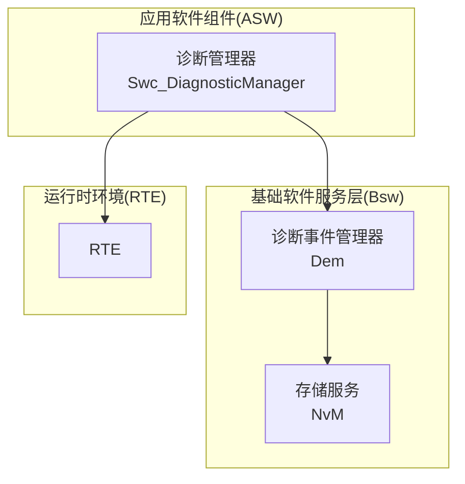
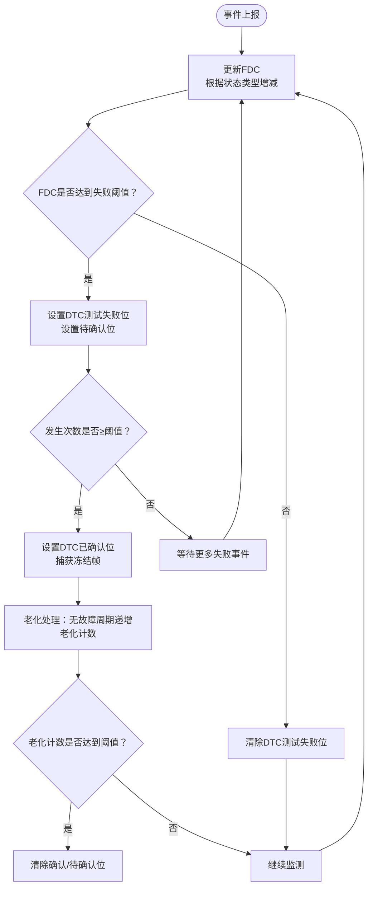
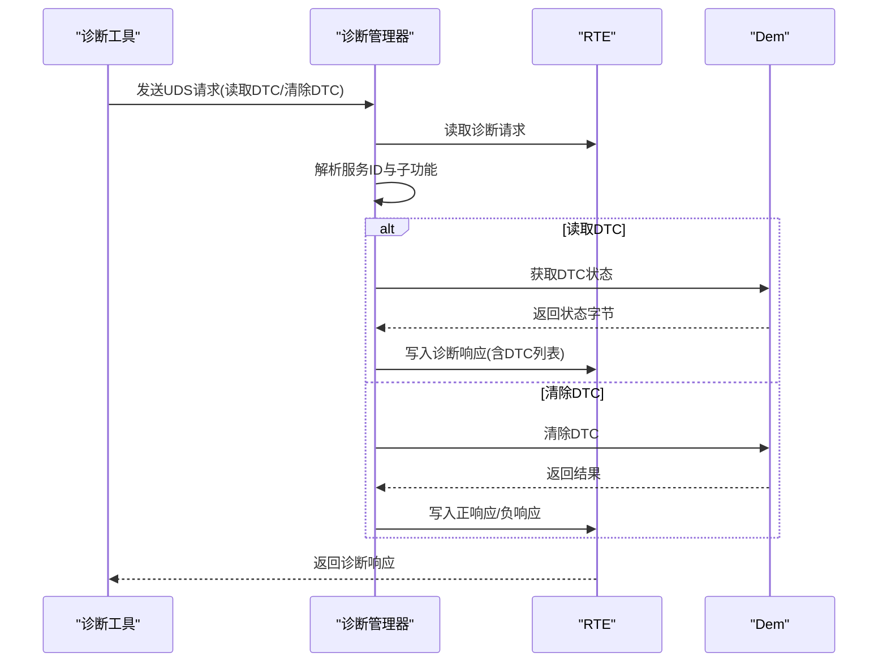
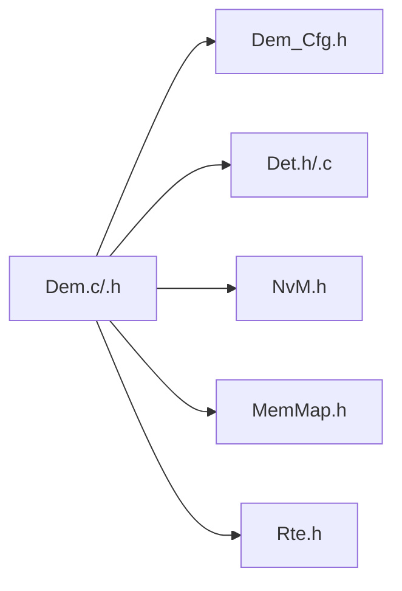

# 诊断事件管理器(Dem)API

<cite>
**本文引用的文件**
- [Dem.h](file://src/bsw/services/dem/include/Dem.h)
- [Dem.c](file://src/bsw/services/dem/src/Dem.c)
- [Dem_Cfg.h](file://src/bsw/services/dem/include/Dem_Cfg.h)
- [Dem_test.c](file://src/bsw/services/dem/src/Dem_test.c)
- [Swc_DiagnosticManager.h](file://src/asw/diagnostic_manager/include/Swc_DiagnosticManager.h)
- [Swc_DiagnosticManager.c](file://src/asw/diagnostic_manager/src/Swc_DiagnosticManager.c)
- [Rte.h](file://src/bsw/rte/include/Rte.h)
</cite>

## 目录
1. [简介](#简介)
2. [项目结构](#项目结构)
3. [核心组件](#核心组件)
4. [架构总览](#架构总览)
5. [详细组件分析](#详细组件分析)
6. [依赖关系分析](#依赖关系分析)
7. [性能考量](#性能考量)
8. [故障排查指南](#故障排查指南)
9. [结论](#结论)
10. [附录](#附录)

## 简介
本文件为诊断事件管理器(Dem)的详细API参考文档，覆盖Dem初始化、故障事件处理、事件缓冲区管理、DTC状态管理、冻结帧数据管理、老化机制、操作周期管理等核心能力。重点说明以下API的使用方法与行为：
- Dem_SetEventStatus：设置事件状态（通过事件ID上报“通过/失败/预通过/预失败”）
- Dem_GetEventStatus：获取事件状态
- Dem_GetEventFailed：判断事件是否已达到“失败”阈值
- Dem_GetEventTested：查询事件在当前操作周期是否已完成测试
- Dem_GetFaultDetectionCounter：获取故障检测计数器（FDC）值
- Dem_ClearDTC：清除指定DTC或全部DTC
- Dem_GetDTCStatus：获取DTC状态字节
- Dem_PrestoreFreezeFrame / Dem_ClearPrestoredFreezeFrame：预存/清除冻结帧数据
- Dem_SetOperationCycleState / Dem_RestartOperationCycle：操作周期状态切换与重启
- Dem_MainFunction：周期性处理入口（当前为空实现）

此外，文档还提供典型故障事件（传感器故障、执行器故障）的处理示例思路，并解释Dem与诊断通信管理器之间的数据交换机制。

## 项目结构
Dem位于基础软件服务层，遵循AutoSAR Classic Platform 4.x标准；其上层由应用软件组件（ASW）中的诊断管理器进行调用，底层依赖NvM进行持久化存储。

图表来源
- [Swc_DiagnosticManager.c:418-453](file://src/asw/diagnostic_manager/src/Swc_DiagnosticManager.c#L418-L453)
- [Dem.c:390-471](file://src/bsw/services/dem/src/Dem.c#L390-L471)
- [Rte.h:76-106](file://src/bsw/rte/include/Rte.h#L76-L106)

章节来源
- [Dem.h:1-541](file://src/bsw/services/dem/include/Dem.h#L1-L541)
- [Dem.c:1-1145](file://src/bsw/services/dem/src/Dem.c#L1-L1145)
- [Dem_Cfg.h:1-158](file://src/bsw/services/dem/include/Dem_Cfg.h#L1-L158)
- [Swc_DiagnosticManager.h:1-211](file://src/asw/diagnostic_manager/include/Swc_DiagnosticManager.h#L1-L211)
- [Swc_DiagnosticManager.c:1-686](file://src/asw/diagnostic_manager/src/Swc_DiagnosticManager.c#L1-L686)
- [Rte.h:1-200](file://src/bsw/rte/include/Rte.h#L1-L200)

## 核心组件
- Dem模块内部状态
  - 模块状态：未初始化/已初始化
  - 事件状态数组：每个事件包含最近上报状态、DTC状态位、故障检测计数器、去抖计数器、当前周期测试完成标志、发生次数、老化计数、是否已老化等
  - DTC条目数组：每个DTC包含DTC码、状态字节、发生次数、老化计数、是否已老化、是否抑制
  - 冻结帧缓存：按DTC索引存储冻结帧数据
  - 操作周期状态数组：记录各类型操作周期的起止状态
  - 条件开关：启用条件、存储条件、DTC记录更新开关、DTC设置开关、选中DTC
- 配置参数
  - 事件数量、DTC数量、冻结帧记录数量、扩展数据记录数量
  - 操作周期类型、老化阈值、去抖阈值与步长
  - 冻结帧最大长度、扩展数据最大长度
  - 是否启用DET、版本信息API、清除DTC支持等

章节来源
- [Dem.c:74-88](file://src/bsw/services/dem/src/Dem.c#L74-L88)
- [Dem_Cfg.h:26-158](file://src/bsw/services/dem/include/Dem_Cfg.h#L26-L158)

## 架构总览
Dem采用事件-状态-阈值驱动的故障检测模型：
- 事件上报：通过事件ID上报“通过/失败/预通过/预失败”
- 去抖算法：根据阈值与步长调整故障检测计数器（FDC），决定是否进入“失败”状态
- DTC状态：基于事件状态与去抖结果更新DTC状态字节（测试失败、待确认、已确认、老化等）
- 冻结帧：在DTC首次确认时捕获冻结帧数据
- 老化：在无故障状态下经过若干操作周期后，将已确认DTC降级为非确认状态
- 操作周期：通过Set/Restart操作周期触发测试完成标志复位与老化处理

图表来源
- [Dem.c:198-248](file://src/bsw/services/dem/src/Dem.c#L198-L248)
- [Dem.c:278-348](file://src/bsw/services/dem/src/Dem.c#L278-L348)
- [Dem.c:353-381](file://src/bsw/services/dem/src/Dem.c#L353-L381)

## 详细组件分析

### 初始化与生命周期
- 初始化
  - 参数：配置指针（包含事件参数、DTC参数、冻结帧/扩展数据记录、功能开关等）
  - 行为：校验配置指针有效性；初始化事件状态、DTC条目、操作周期状态、条件开关、冻结帧缓存；设置模块状态为已初始化
- 去初始化
  - 清空配置指针，设置模块状态为未初始化
- 主函数
  - 当前为空实现，周期性处理逻辑在操作周期状态变化时触发

章节来源
- [Dem.c:390-471](file://src/bsw/services/dem/src/Dem.c#L390-L471)
- [Dem.c:937-940](file://src/bsw/services/dem/src/Dem.c#L937-L940)

### 事件状态管理API
- Dem_SetEventStatus
  - 输入：事件ID、事件状态（通过/失败/预通过/预失败）
  - 行为：更新事件状态、更新去抖计数器（FDC）、标记当前周期测试完成、更新DTC状态
  - 返回：E_OK/E_NOT_OK
- Dem_ResetEventStatus
  - 输入：事件ID
  - 行为：重置去抖计数器与测试完成标志
  - 返回：E_OK/E_NOT_OK
- Dem_GetEventStatus
  - 输入：事件ID、输出指针
  - 行为：返回最近一次上报的状态
  - 返回：E_OK/E_NOT_OK
- Dem_GetEventFailed
  - 输入：事件ID、输出指针
  - 行为：判断FDC是否达到失败阈值
  - 返回：E_OK/E_NOT_OK
- Dem_GetEventTested
  - 输入：事件ID、输出指针
  - 行为：返回当前操作周期是否已完成测试
  - 返回：E_OK/E_NOT_OK

章节来源
- [Dem.c:496-535](file://src/bsw/services/dem/src/Dem.c#L496-L535)
- [Dem.c:540-573](file://src/bsw/services/dem/src/Dem.c#L540-L573)
- [Dem.c:578-609](file://src/bsw/services/dem/src/Dem.c#L578-L609)
- [Dem.c:614-646](file://src/bsw/services/dem/src/Dem.c#L614-L646)
- [Dem.c:651-682](file://src/bsw/services/dem/src/Dem.c#L651-L682)

### 故障检测计数器(FDC)
- Dem_GetFaultDetectionCounter
  - 输入：事件ID、输出指针
  - 行为：返回当前FDC值（反映故障趋势）
  - 返回：E_OK/E_NOT_OK
- 去抖算法要点
  - 预失败：FDC递增至失败阈值
  - 预通过：FDC递减至通过阈值
  - 失败：直接设为失败阈值
  - 通过：直接设为通过阈值

章节来源
- [Dem.c:687-718](file://src/bsw/services/dem/src/Dem.c#L687-L718)
- [Dem.c:198-248](file://src/bsw/services/dem/src/Dem.c#L198-L248)
- [Dem_Cfg.h:112-130](file://src/bsw/services/dem/include/Dem_Cfg.h#L112-L130)

### DTC状态与清除
- Dem_GetDTCStatus
  - 输入：DTC、DTC来源、输出指针
  - 行为：返回DTC状态字节（测试失败、待确认、已确认、老化等位）
  - 返回：E_OK/E_NOT_OK
- Dem_ClearDTC
  - 输入：DTC（0xFFFFFF表示全部）、DTC格式、DTC来源
  - 行为：清除指定DTC或全部DTC的状态与计数
  - 返回：E_OK/E_NOT_OK

章节来源
- [Dem.c:723-753](file://src/bsw/services/dem/src/Dem.c#L723-L753)
- [Dem.c:758-805](file://src/bsw/services/dem/src/Dem.c#L758-L805)

### 冻结帧数据管理
- Dem_PrestoreFreezeFrame
  - 输入：事件ID
  - 行为：为对应DTC预存冻结帧数据
  - 返回：E_OK/E_NOT_OK
- Dem_ClearPrestoredFreezeFrame
  - 输入：事件ID
  - 行为：清除对应DTC的预存冻结帧
  - 返回：E_OK/E_NOT_OK
- Dem_GetFreezeFrameDataByDTC
  - 输入：DTC、来源、记录号、目标缓冲区、缓冲区大小
  - 行为：拷贝冻结帧数据到用户缓冲区
  - 返回：E_OK/E_NOT_OK

章节来源
- [Dem.c:970-1002](file://src/bsw/services/dem/src/Dem.c#L970-L1002)
- [Dem.c:1007-1039](file://src/bsw/services/dem/src/Dem.c#L1007-L1039)
- [Dem.c:1084-1116](file://src/bsw/services/dem/src/Dem.c#L1084-L1116)

### 操作周期与老化
- Dem_SetOperationCycleState
  - 输入：操作周期类型、开始/结束状态
  - 行为：切换周期状态；周期结束时复位测试完成标志并触发老化处理
  - 返回：E_OK/E_NOT_OK
- Dem_RestartOperationCycle
  - 输入：操作周期类型
  - 行为：重启该类型周期（当前实现为直接返回）
  - 返回：E_OK/E_NOT_OK
- Dem_GetOperationCycleState
  - 输入：周期ID、输出指针
  - 行为：返回当前周期状态
  - 返回：E_OK/E_NOT_OK
- Dem_MainFunction
  - 当前为空实现，周期性处理逻辑在周期状态变化时触发

章节来源
- [Dem.c:876-916](file://src/bsw/services/dem/src/Dem.c#L876-L916)
- [Dem.c:921-932](file://src/bsw/services/dem/src/Dem.c#L921-L932)
- [Dem.c:937-940](file://src/bsw/services/dem/src/Dem.c#L937-L940)

### Dem与诊断通信管理器的数据交换
- 应用层接口
  - 诊断管理器提供会话控制、安全访问、读取DTC信息、清除DTC、测试者存在等服务
  - 通过RTE端口读取诊断请求、写入诊断响应
- 数据映射
  - 诊断管理器从RTE读取请求，调用Dem相关API获取DTC状态、冻结帧数据，再通过RTE写回响应
- 关键流程
  - 读取DTC信息：遍历DTC列表，填充响应数据
  - 清除DTC：调用Dem_ClearDTC，清空对应DTC状态
  - 冻结帧：调用Dem_GetFreezeFrameDataByDTC获取冻结帧数据

图表来源
- [Swc_DiagnosticManager.c:471-531](file://src/asw/diagnostic_manager/src/Swc_DiagnosticManager.c#L471-L531)
- [Swc_DiagnosticManager.c:264-341](file://src/asw/diagnostic_manager/src/Swc_DiagnosticManager.c#L264-L341)
- [Dem.c:758-805](file://src/bsw/services/dem/src/Dem.c#L758-L805)

章节来源
- [Swc_DiagnosticManager.h:108-190](file://src/asw/diagnostic_manager/include/Swc_DiagnosticManager.h#L108-L190)
- [Swc_DiagnosticManager.c:418-686](file://src/asw/diagnostic_manager/src/Swc_DiagnosticManager.c#L418-L686)
- [Rte.h:76-116](file://src/bsw/rte/include/Rte.h#L76-L116)

### 典型故障事件处理示例（思路）
- 传感器故障（如温度传感器异常）
  - 步骤：周期性读取传感器值，若低于/高于阈值，连续N次上报“预失败”，直至FDC达到失败阈值，Dem自动设置DTC测试失败位并待确认；再次失败后进入确认状态并捕获冻结帧
  - 清除：通过诊断管理器发送清除DTC请求，Dem清除对应DTC状态与计数
- 执行器故障（如电机无法动作）
  - 步骤：执行器动作后检测反馈信号，若超时/反馈异常，上报“预失败”；若持续失败，Dem设置DTC并确认；恢复后上报“预通过”，FDC逐步下降，最终清除失败位

注：以上为流程示例，具体阈值与去抖参数以配置为准。

## 依赖关系分析
- Dem对外部依赖
  - DET：错误检测与报告
  - NvM：DTC持久化（Dem内部使用NvM头文件，实际存储逻辑在Dem.c中以占位实现）
  - MemMap：内存段宏定义
- Dem对上层依赖
  - 应用层通过RTE调用Dem，Dem不直接依赖RTE头文件
- 配置依赖
  - Dem_Cfg.h定义了事件数量、DTC数量、去抖阈值、老化阈值、冻结帧大小等关键参数

图表来源
- [Dem.c:19-24](file://src/bsw/services/dem/src/Dem.c#L19-L24)
- [Dem.h:20-21](file://src/bsw/services/dem/include/Dem.h#L20-L21)
- [Dem_Cfg.h:1-158](file://src/bsw/services/dem/include/Dem_Cfg.h#L1-L158)

章节来源
- [Dem.c:19-24](file://src/bsw/services/dem/src/Dem.c#L19-L24)
- [Dem.h:20-21](file://src/bsw/services/dem/include/Dem.h#L20-L21)

## 性能考量
- 去抖算法复杂度
  - 每次事件上报仅进行常数时间的FDC更新与状态判定，时间复杂度O(1)
- DTC状态更新
  - 基于事件状态与FDC阈值更新DTC状态字节，常数时间O(1)
- 老化处理
  - 周期性扫描所有DTC，时间复杂度O(DTC数量)，建议在周期结束时触发
- 冻结帧存储
  - 冻结帧按DTC索引存储，访问为O(1)，注意冻结帧最大长度与数量限制

[本节为通用指导，无需特定文件来源]

## 故障排查指南
- 常见错误码
  - DEM_E_UNINIT：模块未初始化即调用API
  - DEM_E_PARAM_POINTER/DEM_E_PARAM_DATA：传入空指针或无效参数
  - DEM_E_PARAM_EVENT_ID：事件ID越界
- 单元测试覆盖点
  - 初始化与NULL配置检测
  - 事件状态设置与获取
  - 去抖计数器递增/递减行为
  - DTC状态确认与清除
  - 版本信息获取
- 建议排查步骤
  - 确认Dem_Init已成功调用且配置有效
  - 检查事件ID范围与指针有效性
  - 观察FDC变化趋势，确认去抖阈值与步长配置
  - 确认操作周期状态切换正确，周期结束时老化处理被触发

章节来源
- [Dem.h:88-100](file://src/bsw/services/dem/include/Dem.h#L88-L100)
- [Dem_test.c:88-327](file://src/bsw/services/dem/src/Dem_test.c#L88-L327)

## 结论
Dem提供了完整的事件-状态-阈值故障检测框架，具备完善的DTC状态管理、冻结帧捕获、老化机制与操作周期支持。通过Dem_SetEventStatus等核心API，上层应用可灵活上报事件状态并获得精确的故障检测计数器与DTC状态。结合诊断管理器与RTE，Dem实现了与诊断通信管理器的高效数据交换，满足AUTOSAR诊断需求。

[本节为总结，无需特定文件来源]

## 附录

### API一览与使用要点
- Dem_Init
  - 用途：初始化Dem模块
  - 注意：必须先调用，且配置指针有效
- Dem_SetEventStatus
  - 用途：上报事件状态（通过/失败/预通过/预失败）
  - 影响：更新FDC、测试完成标志、DTC状态
- Dem_GetEventStatus / Dem_GetEventFailed / Dem_GetEventTested
  - 用途：查询事件状态、失败标志、测试完成标志
- Dem_GetFaultDetectionCounter
  - 用途：获取FDC值，用于故障趋势分析
- Dem_GetDTCStatus / Dem_ClearDTC
  - 用途：查询与清除DTC状态
- Dem_PrestoreFreezeFrame / Dem_ClearPrestoredFreezeFrame / Dem_GetFreezeFrameDataByDTC
  - 用途：冻结帧预存、清除与读取
- Dem_SetOperationCycleState / Dem_RestartOperationCycle / Dem_GetOperationCycleState
  - 用途：操作周期状态管理与重启
- Dem_MainFunction
  - 用途：周期性处理入口（当前为空实现）

章节来源
- [Dem.h:319-538](file://src/bsw/services/dem/include/Dem.h#L319-L538)
- [Dem.c:390-1145](file://src/bsw/services/dem/src/Dem.c#L390-L1145)