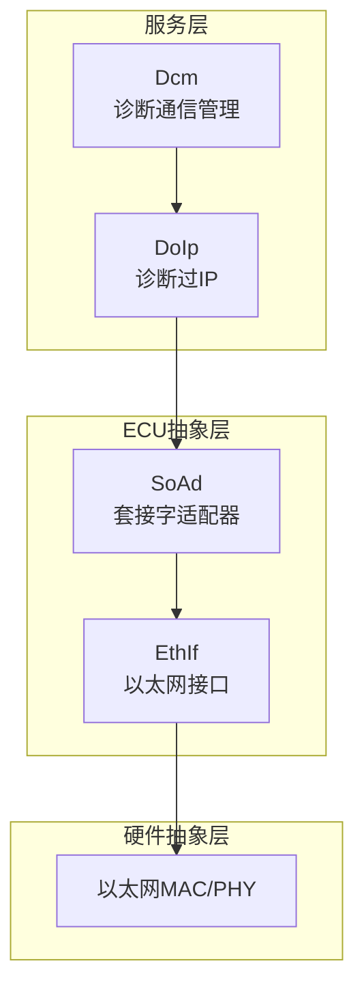
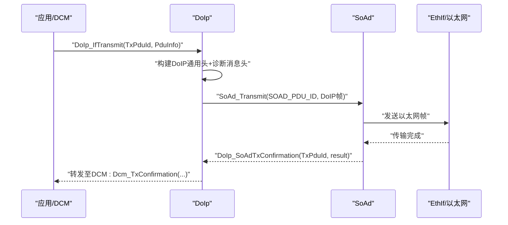
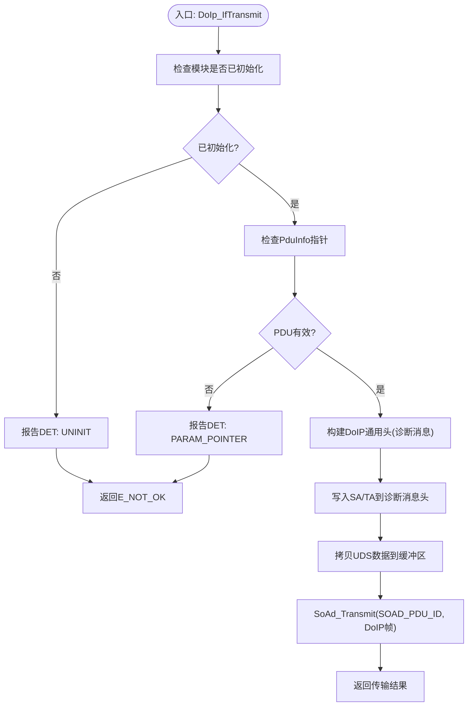
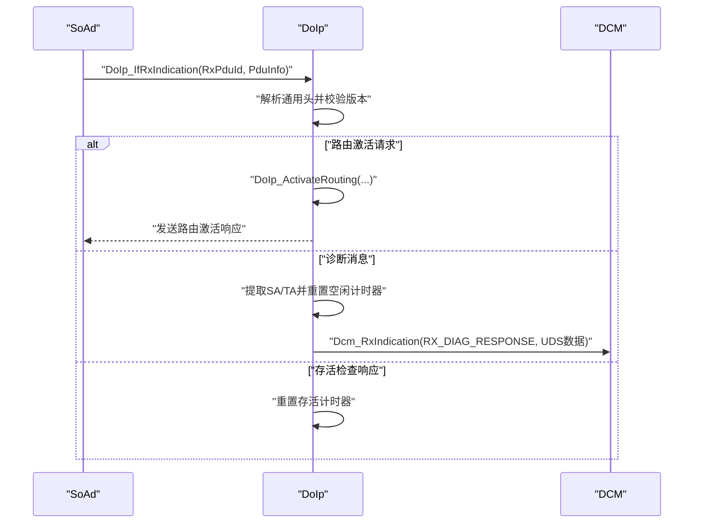
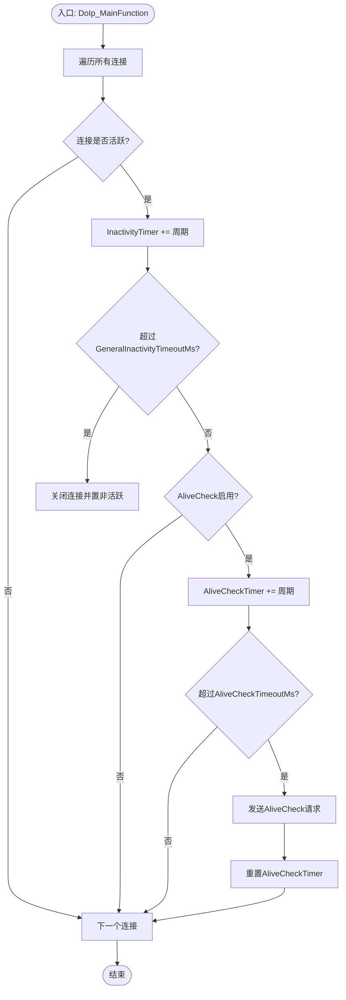
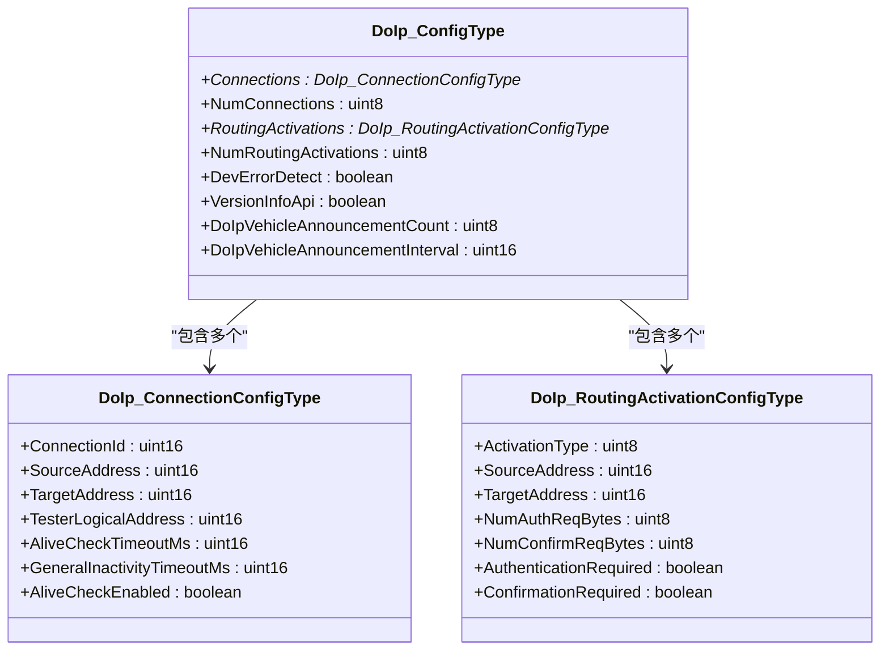
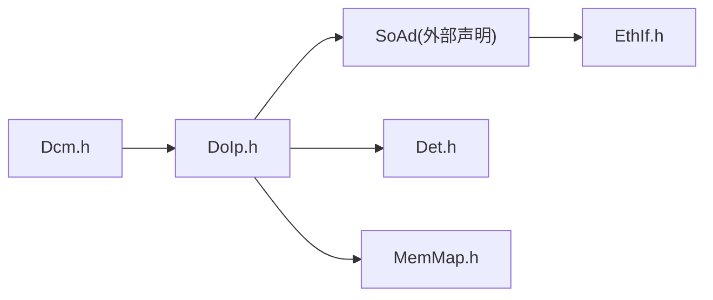
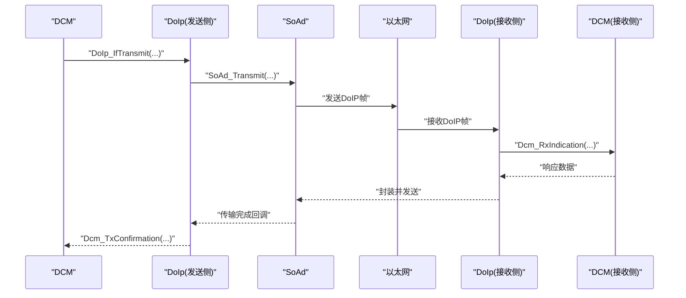

# 诊断以太网(DoIp)API

<cite>
**本文引用的文件**
- [DoIp.h](file://src/bsw/services/doip/include/DoIp.h)
- [DoIp.c](file://src/bsw/services/doip/src/DoIp.c)
- [DoIp_Cfg.h](file://src/bsw/services/doip/include/DoIp_Cfg.h)
- [DoIp_Lcfg.c](file://src/bsw/services/doip/src/DoIp_Lcfg.c)
- [DoIp_test.c](file://src/bsw/services/doip/src/DoIp_test.c)
- [DoIp_spec.md](file://openspec/changes/dev-doip-docan-module/specs/DoIp_spec.md)
- [EthIf.h](file://src/bsw/ecual/ethif/include/EthIf.h)
- [EthIf.c](file://src/bsw/ecual/ethif/src/EthIf.c)
- [Dcm.h](file://src/bsw/services/dcm/include/Dcm.h)
- [Dcm_Cfg.h](file://src/bsw/services/dcm/include/Dcm_Cfg.h)
- [spec.md](file://openspec/specs/bsw/spec.md)
</cite>

## 目录
1. [简介](#简介)
2. [项目结构](#项目结构)
3. [核心组件](#核心组件)
4. [架构总览](#架构总览)
5. [详细组件分析](#详细组件分析)
6. [依赖关系分析](#依赖关系分析)
7. [性能考虑](#性能考虑)
8. [故障排查指南](#故障排查指南)
9. [结论](#结论)
10. [附录](#附录)

## 简介
本文件为诊断以太网(DoIp)模块的详细API参考文档，面向需要在以太网上实现UDS诊断通信的开发者。文档覆盖DoIp初始化、以太网诊断通信、UDS诊断服务处理等核心API，并重点说明DoIp_SetRoutingActivation（对应DoIp_ActivateRouting）、DoIp_SetVehicleIdentification（对应内部路由激活处理）、DoIp_RxIndication（对应DoIp_IfRxIndication）等以太网通信API的使用方法。同时提供UDS通过以太网传输的实际应用示例，涵盖IPv4地址配置、UDS over IP协议处理、网络超时管理以及DoIp与底层以太网接口层的集成机制。

## 项目结构
DoIp位于服务层，作为DCM与SoAd之间的传输适配器，负责将UDS诊断请求封装为DoIP帧并通过以太网传输。其主要文件组织如下：
- 头文件：DoIp.h（对外API与数据类型声明）
- 实现：DoIp.c（DoIp协议处理、连接管理、定时器与超时）
- 配置：DoIp_Cfg.h（编译期配置）、DoIp_Lcfg.c（运行期配置表）
- 测试：DoIp_test.c（单元测试，验证API行为）
- 规范：DoIp_spec.md（模块规范与协议格式）

图表来源
- [DoIp_spec.md: 22-31:22-31](file://openspec/changes/dev-doip-docan-module/specs/DoIp_spec.md#L22-L31)
- [spec.md: 13-47:13-47](file://openspec/specs/bsw/spec.md#L13-L47)

章节来源
- [DoIp.h: 169-232:169-232](file://src/bsw/services/doip/include/DoIp.h#L169-L232)
- [DoIp.c: 369-420:369-420](file://src/bsw/services/doip/src/DoIp.c#L369-L420)
- [DoIp_Cfg.h: 15-64:15-64](file://src/bsw/services/doip/include/DoIp_Cfg.h#L15-L64)
- [DoIp_Lcfg.c: 25-151:25-151](file://src/bsw/services/doip/src/DoIp_Lcfg.c#L25-L151)
- [DoIp_spec.md: 35-66:35-66](file://openspec/changes/dev-doip-docan-module/specs/DoIp_spec.md#L35-L66)

## 核心组件
- 模块状态机：UNINIT → INIT → ACTIVE
- 连接状态机：CLOSED → PENDING → ESTABLISHED → REGISTERED
- 关键API：
  - 初始化/去初始化：DoIp_Init、DoIp_DeInit
  - 诊断传输：DoIp_IfTransmit（上层调用）、DoIp_SoAdTxConfirmation（下层回调）
  - 接收指示：DoIp_IfRxIndication（下层调用）
  - 路由激活：DoIp_ActivateRouting
  - 连接关闭：DoIp_CloseConnection
  - 主函数：DoIp_MainFunction（周期性维护）
- 数据类型：DoIp_ConfigType、DoIp_ConnectionConfigType、DoIp_RoutingActivationConfigType、DoIp_GenericHeaderType等

章节来源
- [DoIp.h: 62-150:62-150](file://src/bsw/services/doip/include/DoIp.h#L62-L150)
- [DoIp.c: 369-420:369-420](file://src/bsw/services/doip/src/DoIp.c#L369-L420)
- [DoIp.c: 428-557:428-557](file://src/bsw/services/doip/src/DoIp.c#L428-L557)
- [DoIp.c: 566-645:566-645](file://src/bsw/services/doip/src/DoIp.c#L566-L645)
- [DoIp.c: 674-723:674-723](file://src/bsw/services/doip/src/DoIp.c#L674-L723)

## 架构总览
DoIp在AutoSAR分层中处于服务层，向上对接DCM，向下对接SoAd/EthIf，实现UDS over IP的完整链路。

图表来源
- [DoIp.c: 428-487:428-487](file://src/bsw/services/doip/src/DoIp.c#L428-L487)
- [DoIp.c: 653-667:653-667](file://src/bsw/services/doip/src/DoIp.c#L653-L667)
- [DoIp_spec.md: 49-59:49-59](file://openspec/changes/dev-doip-docan-module/specs/DoIp_spec.md#L49-L59)

章节来源
- [DoIp_spec.md: 22-31:22-31](file://openspec/changes/dev-doip-docan-module/specs/DoIp_spec.md#L22-L31)
- [DoIp.c: 28-31:28-31](file://src/bsw/services/doip/src/DoIp.c#L28-L31)

## 详细组件分析

### API参考：DoIp_Init/DeInit/GetVersionInfo
- DoIp_Init：初始化模块，保存配置指针，清零连接状态
- DoIp_DeInit：清除配置指针，回到未初始化状态
- DoIp_GetVersionInfo：返回模块版本信息（当开启版本信息API时）

章节来源
- [DoIp.c: 369-420:369-420](file://src/bsw/services/doip/src/DoIp.c#L369-L420)
- [DoIp.h: 173](file://src/bsw/services/doip/include/DoIp.h#L173)
- [DoIp.h: 178](file://src/bsw/services/doip/include/DoIp.h#L178)
- [DoIp.h: 184](file://src/bsw/services/doip/include/DoIp.h#L184)

### API参考：DoIp_IfTransmit（UDS诊断请求发送）
- 功能：将UDS诊断请求封装为DoIP帧并提交给SoAd发送
- 处理流程：
  - 参数校验（初始化状态、PDU指针）
  - 使用配置中的源/目标逻辑地址
  - 构建DoIP通用头（协议版本、负载类型=诊断消息、负载长度=SA+TA+UDS数据）
  - 在缓冲区前部写入诊断消息头（SA、TA），再拷贝UDS数据
  - 调用SoAd_Transmit发送
- 返回值：E_OK/E_NOT_OK

图表来源
- [DoIp.c: 428-487:428-487](file://src/bsw/services/doip/src/DoIp.c#L428-L487)

章节来源
- [DoIp.c: 428-487:428-487](file://src/bsw/services/doip/src/DoIp.c#L428-L487)
- [DoIp_test.c: 151-171:151-171](file://src/bsw/services/doip/src/DoIp_test.c#L151-L171)

### API参考：DoIp_IfRxIndication（UDS诊断响应接收）
- 功能：接收来自SoAd的原始DoIP帧，解析后转发给DCM
- 处理流程：
  - 参数校验（初始化状态、PDU指针）
  - 解析DoIP通用头（协议版本校验）
  - 根据负载类型分派：
    - 路由激活请求：内部调用DoIp_ActivateRouting并发送响应
    - 诊断消息：提取SA/TA，重置空闲计时器，转发UDS数据给DCM
    - 存活检查响应：重置存活计时器
- 注意：默认使用连接索引0处理接收消息

图表来源
- [DoIp.c: 495-557:495-557](file://src/bsw/services/doip/src/DoIp.c#L495-L557)
- [DoIp.c: 227-259:227-259](file://src/bsw/services/doip/src/DoIp.c#L227-L259)
- [DoIp.c: 267-288:267-288](file://src/bsw/services/doip/src/DoIp.c#L267-L288)

章节来源
- [DoIp.c: 495-557:495-557](file://src/bsw/services/doip/src/DoIp.c#L495-L557)
- [DoIp_test.c: 173-201:173-201](file://src/bsw/services/doip/src/DoIp_test.c#L173-L201)

### API参考：DoIp_ActivateRouting（路由激活）
- 功能：显式激活诊断路由路径（替代接收请求自动激活）
- 处理流程：
  - 查找匹配的连接与路由激活项
  - 更新连接状态为REGISTERED，设置源/目标地址与活跃标志
- 返回值：E_OK/E_NOT_OK（失败时可能上报无效路由类型或无效连接）

章节来源
- [DoIp.c: 566-610:566-610](file://src/bsw/services/doip/src/DoIp.c#L566-L610)
- [DoIp_test.c: 135-149:135-149](file://src/bsw/services/doip/src/DoIp_test.c#L135-L149)

### API参考：DoIp_CloseConnection（关闭连接）
- 功能：关闭指定连接，重置状态与计时器
- 返回值：E_OK/E_NOT_OK（越界或未初始化时报DET）

章节来源
- [DoIp.c: 617-645:617-645](file://src/bsw/services/doip/src/DoIp.c#L617-L645)
- [DoIp_test.c: 226-239:226-239](file://src/bsw/services/doip/src/DoIp_test.c#L226-L239)

### API参考：DoIp_SoAdTxConfirmation（传输确认）
- 功能：接收SoAd传输完成回调，转发给DCM
- 返回值：无

章节来源
- [DoIp.c: 653-667:653-667](file://src/bsw/services/doip/src/DoIp.c#L653-L667)
- [DoIp_test.c: 241-252:241-252](file://src/bsw/services/doip/src/DoIp_test.c#L241-L252)

### API参考：DoIp_MainFunction（周期性维护）
- 功能：处理空闲超时、存活检查、连接状态维护
- 处理流程：
  - 遍历所有连接，递增空闲计时器
  - 超过GeneralInactivityTimeoutMs则关闭连接
  - 若启用AliveCheck且超过AliveCheckTimeoutMs，则发送存活检查请求

图表来源
- [DoIp.c: 674-723:674-723](file://src/bsw/services/doip/src/DoIp.c#L674-L723)

章节来源
- [DoIp.c: 674-723:674-723](file://src/bsw/services/doip/src/DoIp.c#L674-L723)

### 数据模型与配置
- DoIp_ConfigType：包含连接数组、路由激活数组、错误检测开关、版本信息API开关、车辆公告参数等
- DoIp_ConnectionConfigType：每条连接的源/目标逻辑地址、测试仪逻辑地址、存活/空闲超时、是否启用存活检查
- DoIp_RoutingActivationConfigType：路由激活类型、源/目标地址、认证/确认需求等
- 编译期配置（DoIp_Cfg.h）：最大连接数、最大路由激活数、诊断请求/响应最大长度、主函数周期、PDU ID、逻辑地址、路由激活ID等

图表来源
- [DoIp.h: 139-150:139-150](file://src/bsw/services/doip/include/DoIp.h#L139-L150)
- [DoIp.h: 115-136:115-136](file://src/bsw/services/doip/include/DoIp.h#L115-L136)
- [DoIp.h: 128-136:128-136](file://src/bsw/services/doip/include/DoIp.h#L128-L136)
- [DoIp_Lcfg.c: 25-151:25-151](file://src/bsw/services/doip/src/DoIp_Lcfg.c#L25-L151)

章节来源
- [DoIp.h: 139-150:139-150](file://src/bsw/services/doip/include/DoIp.h#L139-L150)
- [DoIp.h: 115-136:115-136](file://src/bsw/services/doip/include/DoIp.h#L115-L136)
- [DoIp.h: 128-136:128-136](file://src/bsw/services/doip/include/DoIp.h#L128-L136)
- [DoIp_Lcfg.c: 25-151:25-151](file://src/bsw/services/doip/src/DoIp_Lcfg.c#L25-L151)
- [DoIp_Cfg.h: 15-64:15-64](file://src/bsw/services/doip/include/DoIp_Cfg.h#L15-L64)

## 依赖关系分析
- 上层依赖：DCM（UDS协议处理）
- 下层依赖：SoAd（TCP/UDP套接字适配）、EthIf（以太网控制器接口）
- 公共依赖：DET（开发错误检测）、MemMap（内存段映射）

图表来源
- [DoIp.c: 28-31:28-31](file://src/bsw/services/doip/src/DoIp.c#L28-L31)
- [DoIp_spec.md: 318-329:318-329](file://openspec/changes/dev-doip-docan-module/specs/DoIp_spec.md#L318-L329)

章节来源
- [DoIp.c: 28-31:28-31](file://src/bsw/services/doip/src/DoIp.c#L28-L31)
- [DoIp_spec.md: 318-329:318-329](file://openspec/changes/dev-doip-docan-module/specs/DoIp_spec.md#L318-L329)

## 性能考虑
- 主函数周期：10ms（可配置），用于空闲超时与存活检查
- 最大诊断报文长度：4096字节（请求/响应）
- 连接数量上限：4条（可配置）
- 建议：
  - 合理设置AliveCheckTimeoutMs与GeneralInactivityTimeoutMs，避免频繁重连
  - 将UDS请求长度控制在最大限制内，减少内存拷贝与传输时间
  - 在高负载场景下，确保SoAd/TcpIp层具备足够的缓冲与并发能力

章节来源
- [DoIp_Cfg.h: 33](file://src/bsw/services/doip/include/DoIp_Cfg.h#L33)
- [DoIp_Cfg.h: 27-28:27-28](file://src/bsw/services/doip/include/DoIp_Cfg.h#L27-L28)
- [DoIp_Cfg.h: 21-22:21-22](file://src/bsw/services/doip/include/DoIp_Cfg.h#L21-L22)

## 故障排查指南
- 常见错误码（DET）：
  - 参数为空指针：DoIp_Init/IfTransmit/IfRxIndication
  - 未初始化：IfTransmit/IfRxIndication/ActivateRouting/CloseConnection/SendTxConfirmation
  - 无效连接/路由类型：ActivateRouting/CloseConnection
- 建议排查步骤：
  - 确认DoIp_Init已成功调用且配置指针有效
  - 检查PduInfo指针与长度是否正确
  - 核对逻辑地址配置（源/目标地址、测试仪地址）
  - 检查SoAd是否正常回调传输确认
  - 关注MainFunction是否按周期执行，是否存在超时导致连接被关闭

章节来源
- [DoIp.h: 51-57:51-57](file://src/bsw/services/doip/include/DoIp.h#L51-L57)
- [DoIp.c: 440-451:440-451](file://src/bsw/services/doip/src/DoIp.c#L440-L451)
- [DoIp.c: 572-607:572-607](file://src/bsw/services/doip/src/DoIp.c#L572-L607)
- [DoIp_test.c: 121-133:121-133](file://src/bsw/services/doip/src/DoIp_test.c#L121-L133)

## 结论
DoIp模块提供了完整的UDS over IP传输能力，通过标准化的API与严格的错误检测机制，实现了与DCM、SoAd、EthIf的稳定协作。合理配置逻辑地址与超时参数，结合周期性主函数维护，可满足车载以太网诊断的可靠性与实时性要求。

## 附录

### UDS over IP 实际应用示例（流程）
- 场景：DCM向ECU发送Read DTC Information请求
- 步骤：
  1) DCM准备UDS请求数据
  2) DCM调用DoIp_IfTransmit提交请求
  3) DoIp构建DoIP帧并交由SoAd发送
  4) 以太网链路传输到达ECU侧DoIp
  5) ECU侧DoIp解析后转发给DCM
  6) DCM处理响应并返回给上层应用

图表来源
- [DoIp_spec.md: 263-281:263-281](file://openspec/changes/dev-doip-docan-module/specs/DoIp_spec.md#L263-L281)
- [DoIp.c: 428-487:428-487](file://src/bsw/services/doip/src/DoIp.c#L428-L487)
- [DoIp.c: 495-557:495-557](file://src/bsw/services/doip/src/DoIp.c#L495-L557)
- [DoIp.c: 653-667:653-667](file://src/bsw/services/doip/src/DoIp.c#L653-L667)

### IPv4地址配置与网络拓扑管理
- 逻辑地址配置：
  - ECU逻辑地址：0x0001
  - 测试仪逻辑地址：0x0E00
  - 支持多连接配置，每条连接独立设置源/目标地址与超时
- 网络拓扑：
  - 以太网控制器初始化与模式设置由EthIf负责
  - DoIp通过SoAd进行TCP/UDP通信（具体取决于SoAd配置）
- 建议：
  - 在系统启动阶段先初始化EthIf，再初始化DoIp
  - 根据网络环境调整AliveCheck与空闲超时，避免误判连接异常

章节来源
- [DoIp_Lcfg.c: 26-63:26-63](file://src/bsw/services/doip/src/DoIp_Lcfg.c#L26-L63)
- [DoIp_Cfg.h: 54-55:54-55](file://src/bsw/services/doip/include/DoIp_Cfg.h#L54-L55)
- [EthIf.h: 238-288:238-288](file://src/bsw/ecual/ethif/include/EthIf.h#L238-L288)
- [EthIf.c: 29-59:29-59](file://src/bsw/ecual/ethif/src/EthIf.c#L29-L59)