# 诊断通信管理器(Dcm)API

<cite>
**本文档引用的文件**
- [Dcm.h](file://src/bsw/services/dcm/include/Dcm.h)
- [Dcm.c](file://src/bsw/services/dcm/src/Dcm.c)
- [Dcm_Cfg.h](file://src/bsw/services/dcm/include/Dcm_Cfg.h)
- [Dcm_test.c](file://src/bsw/services/dcm/src/Dcm_test.c)
- [Swc_DiagnosticManager.h](file://src/asw/diagnostic_manager/include/Swc_DiagnosticManager.h)
- [Swc_DiagnosticManager.c](file://src/asw/diagnostic_manager/src/Swc_DiagnosticManager.c)
- [Dcm_spec.md](file://openspec/changes/dev-dcm-dem-module/specs/Dcm_spec.md)
- [api-reference.md](file://docs/api-reference.md)
- [Std_Types.h](file://src/bsw/common/Std_Types.h)
- [ComStack_Types.h](file://src/bsw/common/ComStack_Types.h)
</cite>

## 目录
1. [简介](#简介)
2. [项目结构](#项目结构)
3. [核心组件](#核心组件)
4. [架构概览](#架构概览)
5. [详细组件分析](#详细组件分析)
6. [依赖关系分析](#依赖关系分析)
7. [性能考虑](#性能考虑)
8. [故障排除指南](#故障排除指南)
9. [结论](#结论)

## 简介

诊断通信管理器(Diagnostic Communication Manager, DCM)是YuleTech AutoSAR BSW平台中的关键服务层模块，遵循AutoSAR Classic Platform 4.x标准。该模块实现了UDS(Unified Diagnostic Services, ISO 14229-1)和OBD-II诊断协议，作为诊断测试仪(外部工具)与ECU内部软件组件之间的接口。

DCM模块的主要职责包括：
- **UDS协议处理**：接收、解析和响应UDS诊断请求
- **诊断会话管理**：管理诊断会话(默认、扩展、编程、安全系统)
- **安全访问控制**：实现种子/密钥机制保护敏感服务
- **诊断服务分发**：将服务请求路由到适当的内部处理器
- **DID/RID管理**：处理按标识符读取/写入数据和程序控制服务
- **DTC信息访问**：与DEM接口读取和清除故障代码
- **数据传输**：支持通过请求下载/传输数据/传输退出进行软件下载

## 项目结构

YuleTech AutoSAR BSW平台采用分层架构设计，DCM模块位于服务层(Service Layer)，与上层应用软件组件和下层硬件抽象层协同工作：

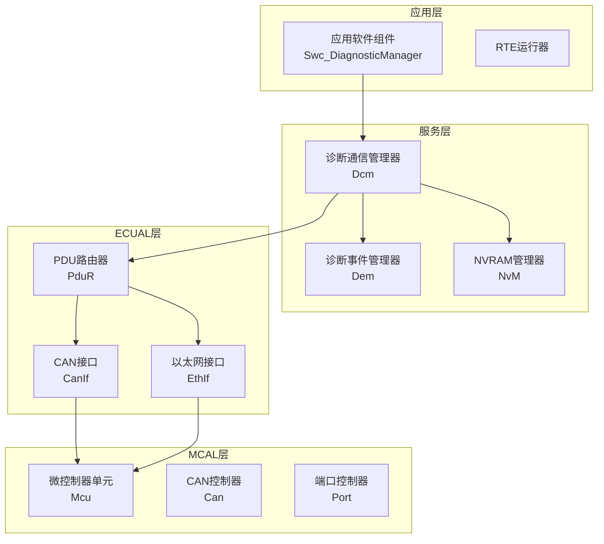

**图表来源**
- [Dcm_spec.md:11-283](file://openspec/changes/dev-dcm-dem-module/specs/Dcm_spec.md#L11-L283)

**章节来源**
- [Dcm_spec.md:11-283](file://openspec/changes/dev-dcm-dem-module/specs/Dcm_spec.md#L11-L283)

## 核心组件

### DCM模块配置

DCM模块通过预编译配置头文件进行配置，支持灵活的参数定制：

| 配置项 | 默认值 | 描述 |
|--------|--------|------|
| DCM_DEV_ERROR_DETECT | STD_ON | 开发错误检测开关 |
| DCM_VERSION_INFO_API | STD_ON | 版本信息API可用性 |
| DCM_NUM_PROTOCOLS | 2U | 协议数量 |
| DCM_NUM_SESSIONS | 4U | 会话数量 |
| DCM_NUM_SECURITY_LEVELS | 3U | 安全级别数量 |
| DCM_BUFFER_SIZE | 4095U | 缓冲区大小 |
| DCM_P2SERVER_MAX | 50U | 最大P2定时器 |
| DCM_S3SERVER | 5000U | S3服务器定时器 |

### 数据类型定义

DCM模块定义了丰富的数据类型来支持诊断通信：

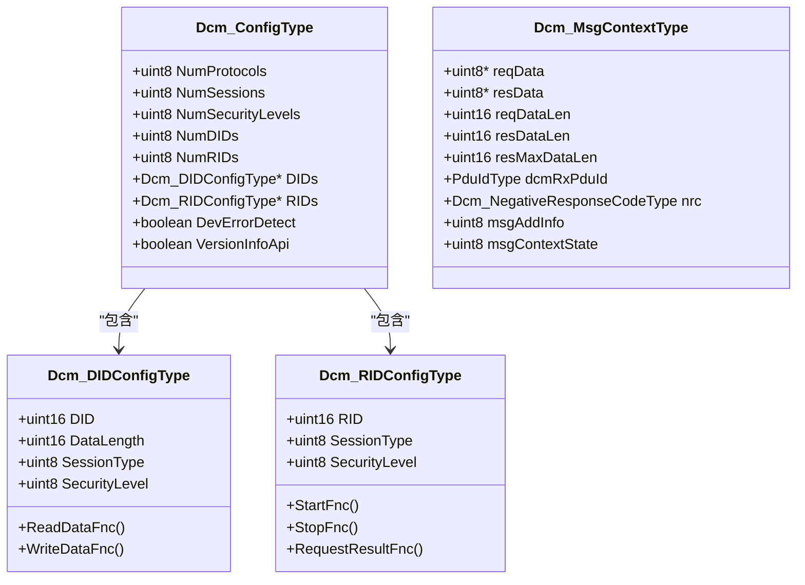

**图表来源**
- [Dcm.h:205-263](file://src/bsw/services/dcm/include/Dcm.h#L205-L263)

### 服务ID定义

DCM模块支持多种UDS服务，每个服务都有对应的SID：

| 服务ID | SID | 服务名称 | 功能描述 |
|--------|-----|----------|----------|
| DCM_SID_INIT | 0x01 | 初始化 | 模块初始化 |
| DCM_SID_START | 0x02 | 启动 | 模块启动 |
| DCM_SID_STOP | 0x03 | 停止 | 模块停止 |
| DCM_SID_GETVERSIONINFO | 0x04 | 获取版本信息 | 返回模块版本 |
| DCM_SID_MAINFUNCTION | 0x05 | 主函数 | 周期性处理 |
| DCM_UDS_SID_DIAGNOSTIC_SESSION_CONTROL | 0x10 | 诊断会话控制 | 切换诊断会话 |
| DCM_UDS_SID_ECU_RESET | 0x11 | ECU复位 | 执行硬/软复位 |
| DCM_UDS_SID_SECURITY_ACCESS | 0x27 | 安全访问 | 种子/密钥机制 |
| DCM_UDS_SID_READ_DATA_BY_IDENTIFIER | 0x22 | 按标识符读取数据 | 读取ECU数据 |
| DCM_UDS_SID_WRITE_DATA_BY_IDENTIFIER | 0x2E | 按标识符写入数据 | 写入ECU数据 |
| DCM_UDS_SID_READ_DTC_INFORMATION | 0x19 | 读取DTC信息 | 查询故障码 |
| DCM_UDS_SID_CLEAR_DIAGNOSTIC_INFORMATION | 0x14 | 清除DTC信息 | 清除故障码 |
| DCM_UDS_SID_ROUTINE_CONTROL | 0x31 | 程序控制 | 程序启动/停止 |

**章节来源**
- [Dcm.h:36-128](file://src/bsw/services/dcm/include/Dcm.h#L36-L128)

## 架构概览

### 系统架构图

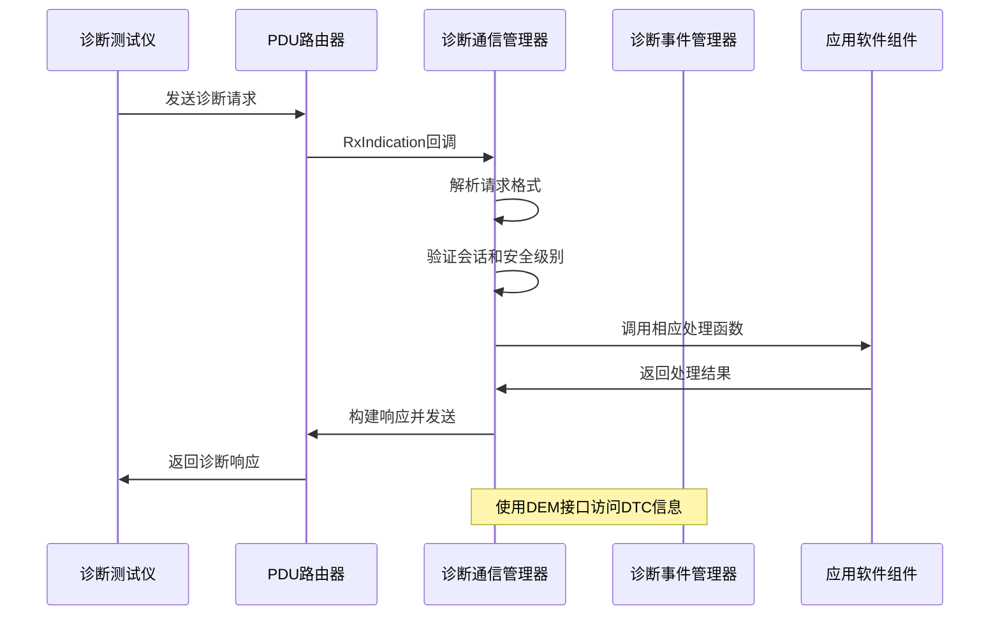

**图表来源**
- [Dcm.c:1044-1111](file://src/bsw/services/dcm/src/Dcm.c#L1044-L1111)

### 状态管理流程

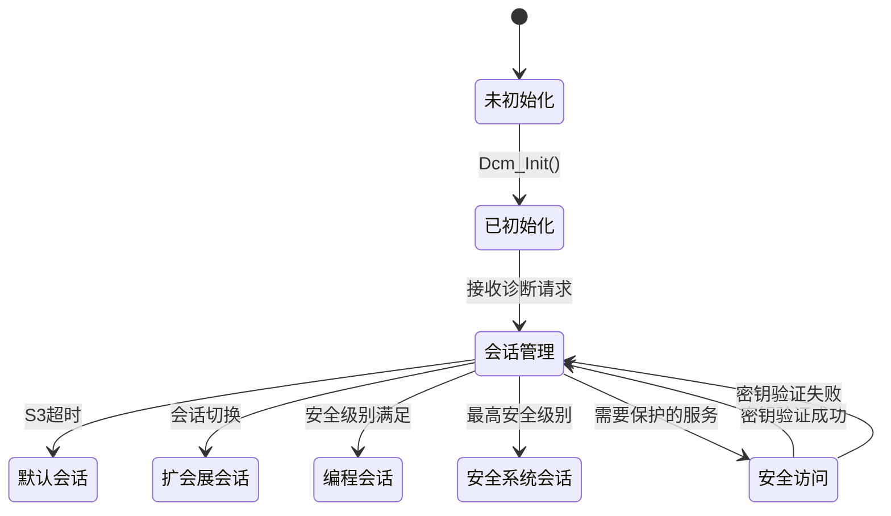

**图表来源**
- [Dcm.c:1192-1245](file://src/bsw/services/dcm/src/Dcm.c#L1192-L1245)

**章节来源**
- [Dcm.c:1117-1245](file://src/bsw/services/dcm/src/Dcm.c#L1117-L1245)

## 详细组件分析

### DCM初始化流程

DCM模块的初始化过程涉及多个步骤，确保所有内部状态正确设置：

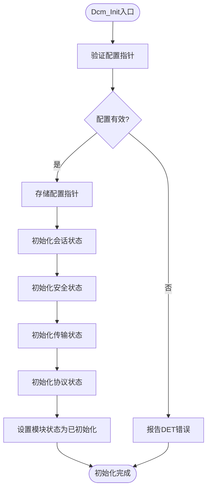

**图表来源**
- [Dcm.c:1120-1163](file://src/bsw/services/dcm/src/Dcm.c#L1120-L1163)

#### 初始化参数验证

在初始化过程中，DCM模块执行严格的参数验证：

- **空指针检查**：如果传入的配置指针为空，报告`DCM_E_PARAM_POINTER`错误
- **配置完整性**：验证必需的配置参数是否存在
- **内存分配**：为内部状态变量分配内存空间

#### 内部状态初始化

初始化过程设置以下关键状态：

| 状态类型 | 默认值 | 描述 |
|----------|--------|------|
| 当前会话 | DCM_DEFAULT_SESSION | 默认诊断会话 |
| 当前安全级别 | DCM_SEC_LEV_LOCKED | 锁定的安全级别 |
| 安全尝试次数 | 0U | 当前安全尝试计数 |
| 传输地址 | 0U | 下载传输的内存地址 |
| 传输大小 | 0U | 下载传输的数据大小 |

**章节来源**
- [Dcm.c:1120-1163](file://src/bsw/services/dcm/src/Dcm.c#L1120-L1163)

### 诊断请求处理流程

DCM模块采用统一的请求处理框架，支持所有UDS服务：

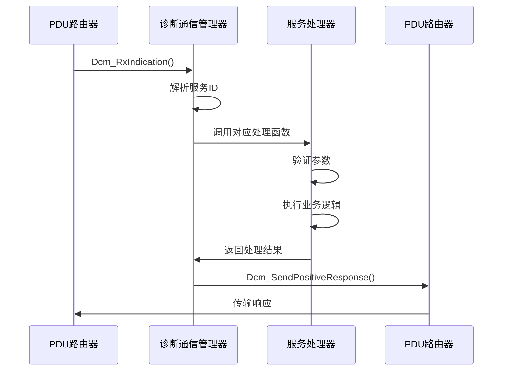

**图表来源**
- [Dcm.c:1046-1111](file://src/bsw/services/dcm/src/Dcm.c#L1046-L1111)

#### 会话控制服务处理

会话控制服务允许诊断测试仪在不同诊断会话之间切换：

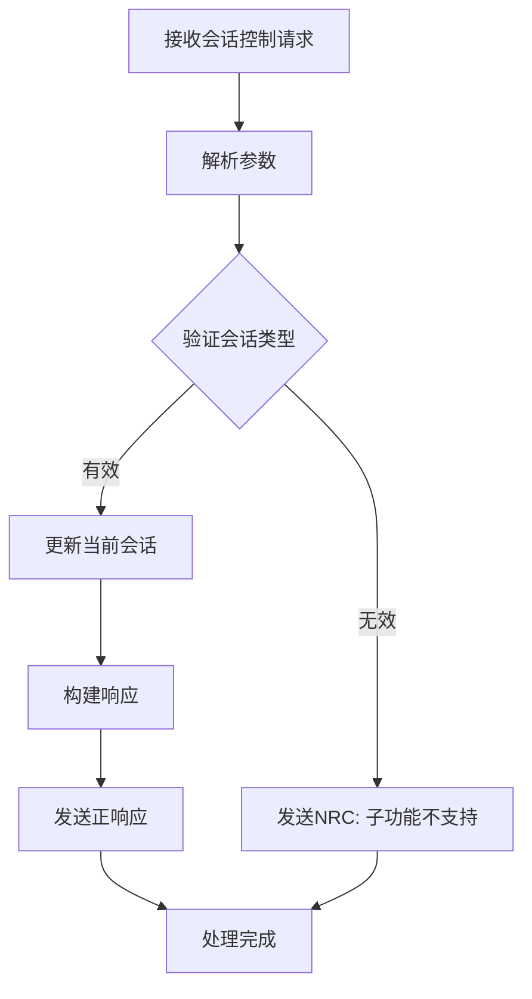

**图表来源**
- [Dcm.c:238-280](file://src/bsw/services/dcm/src/Dcm.c#L238-L280)

#### 安全访问服务处理

安全访问服务实现种子/密钥机制，保护敏感诊断服务：

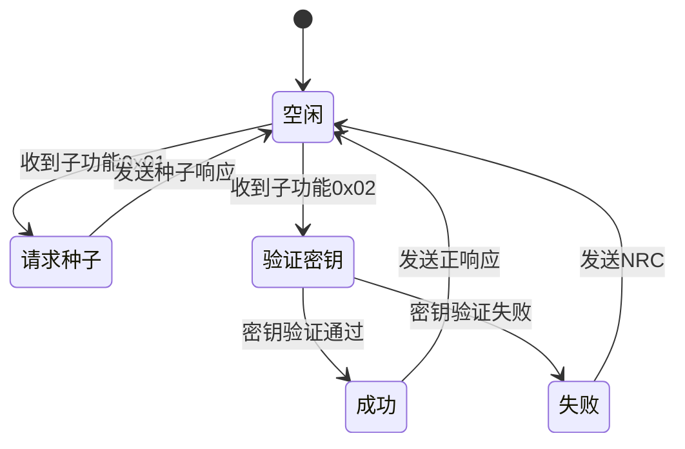

**图表来源**
- [Dcm.c:329-413](file://src/bsw/services/dcm/src/Dcm.c#L329-L413)

**章节来源**
- [Dcm.c:238-413](file://src/bsw/services/dcm/src/Dcm.c#L238-L413)

### DID和RID管理

DCM模块支持动态配置的DID和RID，提供灵活的数据访问机制：

#### DID配置结构

| 字段 | 类型 | 描述 |
|------|------|------|
| DID | uint16 | 数据标识符 |
| DataLength | uint16 | 数据长度 |
| SessionType | uint8 | 允许的会话类型 |
| SecurityLevel | uint8 | 安全级别要求 |
| ReadDataFnc | 函数指针 | 读取数据函数 |
| WriteDataFnc | 函数指针 | 写入数据函数 |

#### RID配置结构

| 字段 | 类型 | 描述 |
|------|------|------|
| RID | uint16 | 程序标识符 |
| SessionType | uint8 | 允许的会话类型 |
| SecurityLevel | uint8 | 安全级别要求 |
| StartFnc | 函数指针 | 启动程序函数 |
| StopFnc | 函数指针 | 停止程序函数 |
| RequestResultFnc | 函数指针 | 请求结果函数 |

**章节来源**
- [Dcm.h:208-227](file://src/bsw/services/dcm/include/Dcm.h#L208-L227)

### 数据传输处理

DCM模块支持软件下载/上传功能，通过一系列数据传输服务实现：

#### 请求下载服务

请求下载服务初始化软件下载会话：

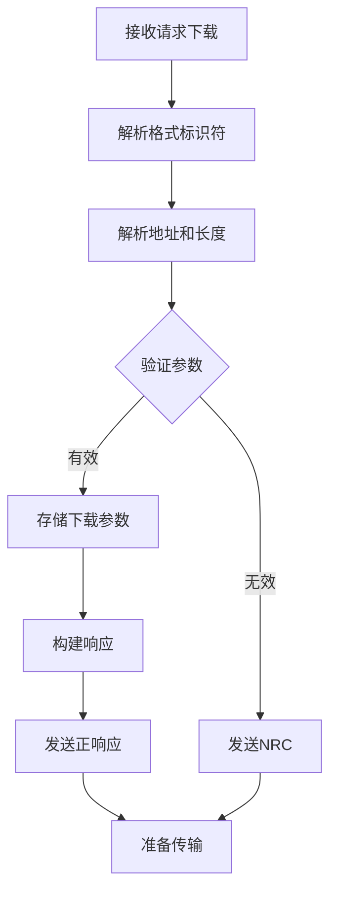

**图表来源**
- [Dcm.c:905-967](file://src/bsw/services/dcm/src/Dcm.c#L905-L967)

#### 传输数据服务

传输数据服务处理分块数据传输：

| 参数 | 类型 | 描述 |
|------|------|------|
| BlockSequenceCounter | uint8 | 块序列计数器 |
| Data | uint8[] | 数据负载 |
| DataLength | uint16 | 数据长度 |

**章节来源**
- [Dcm.c:905-1041](file://src/bsw/services/dcm/src/Dcm.c#L905-L1041)

## 依赖关系分析

### 外部依赖

DCM模块依赖于多个AutoSAR标准模块：

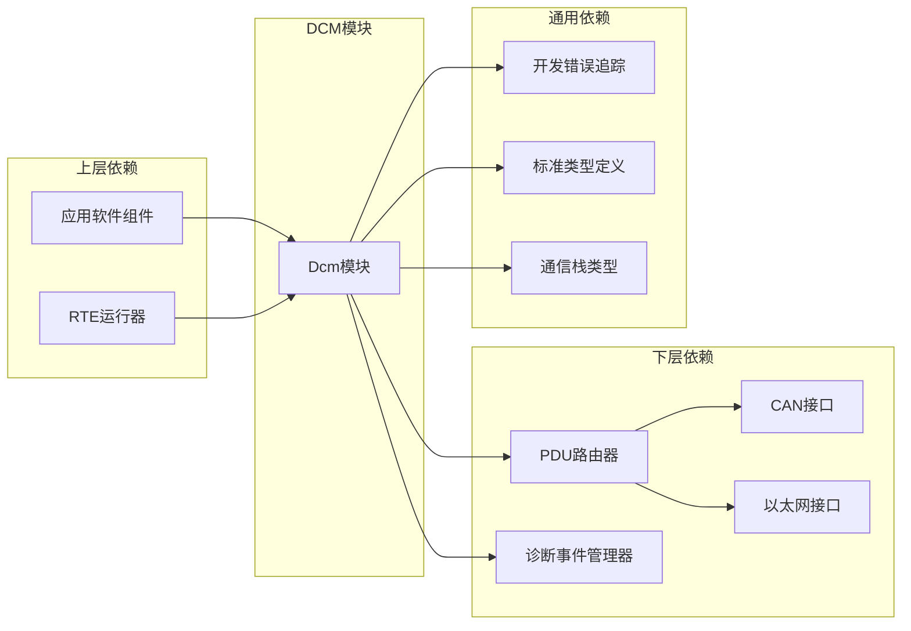

**图表来源**
- [Dcm.c:19-25](file://src/bsw/services/dcm/src/Dcm.c#L19-L25)

### 内部模块交互

DCM模块内部的组件交互关系：

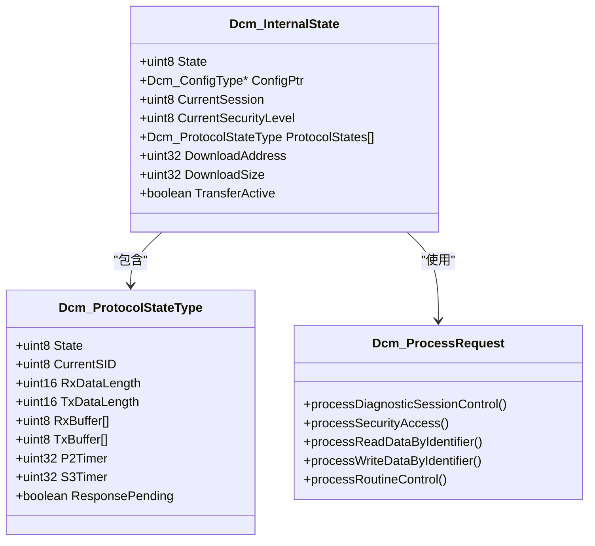

**图表来源**
- [Dcm.c:75-125](file://src/bsw/services/dcm/src/Dcm.c#L75-L125)

**章节来源**
- [Dcm.c:75-125](file://src/bsw/services/dcm/src/Dcm.c#L75-L125)

## 性能考虑

### 内存管理

DCM模块采用静态内存分配策略，确保实时性能：

- **缓冲区大小**：RX/TX缓冲区均为256字节，支持最大4095字节的请求/响应
- **协议状态数组**：为每个协议维护独立的状态结构
- **配置指针**：只存储配置指针，不复制配置数据

### 时间复杂度分析

| 操作 | 时间复杂度 | 空间复杂度 | 说明 |
|------|------------|------------|------|
| DID查找 | O(n) | O(1) | 线性搜索DID配置表 |
| RID查找 | O(m) | O(1) | 线性搜索RID配置表 |
| 请求处理 | O(k) | O(1) | k为请求数据长度 |
| 安全访问 | O(1) | O(1) | 固定时间复杂度 |

### 实时性能优化

- **主函数周期**：10ms周期处理定时器和超时
- **非阻塞设计**：所有操作都是非阻塞的
- **错误快速返回**：检测到错误立即返回

## 故障排除指南

### 常见错误代码

DCM模块支持多种错误代码，用于诊断和调试：

| 错误代码 | 数值 | 描述 | 处理建议 |
|----------|------|------|----------|
| DCM_E_UNINIT | 0x05U | 模块未初始化 | 确保先调用Dcm_Init() |
| DCM_E_PARAM_POINTER | 0x07U | 空指针参数 | 检查传入的指针参数 |
| DCM_E_INTERFACE_TIMEOUT | 0x01U | 接口超时 | 检查底层通信接口 |
| DCM_E_INTERFACE_BUFFER_OVERFLOW | 0x03U | 缓冲区溢出 | 增加缓冲区大小或减少数据量 |
| DCM_E_INVALID_KEY | 0x35U | 无效密钥 | 检查种子/密钥算法实现 |

### 调试技巧

#### 启用DET报告

```c
// 在配置中启用开发错误检测
#define DCM_DEV_ERROR_DETECT STD_ON
```

#### 日志记录

建议在关键路径添加日志记录：

```c
// 请求处理开始
Det_ReportError(DCM_MODULE_ID, 0, DCM_SERVICE_ID_RXINDICATION, 0);

// 请求处理完成
Det_ReportError(DCM_MODULE_ID, 0, DCM_SERVICE_ID_RXINDICATION, E_OK);
```

#### 单元测试

DCM模块包含完整的单元测试套件：

| 测试用例 | 功能 | 验证内容 |
|----------|------|----------|
| test_dcm_init_valid_config | 初始化测试 | 验证正常初始化 |
| test_dcm_init_null_config | 错误处理测试 | 验证空配置错误 |
| test_dcm_uds_session_control_extended | 会话控制测试 | 验证扩展会话切换 |
| test_dcm_uds_read_did | DID读取测试 | 验证数据读取功能 |
| test_dcm_uds_tester_present | 会话保持测试 | 验证会话超时处理 |

**章节来源**
- [Dcm_test.c:135-274](file://src/bsw/services/dcm/src/Dcm_test.c#L135-L274)

## 结论

诊断通信管理器(DCM)模块是YuleTech AutoSAR BSW平台的核心组件，提供了完整的UDS诊断协议实现。通过模块化的架构设计和严格的AutoSAR标准遵循，DCM模块能够：

- **可靠地处理各种诊断服务**：支持从基本的会话控制到复杂的软件下载
- **提供灵活的安全机制**：通过种子/密钥机制保护敏感诊断操作
- **确保实时性能**：采用静态内存分配和非阻塞设计
- **便于集成和测试**：提供清晰的API接口和完整的测试套件

DCM模块的成功实现为整个诊断系统的稳定性和可靠性奠定了坚实基础，同时为未来的功能扩展预留了充足的空间。