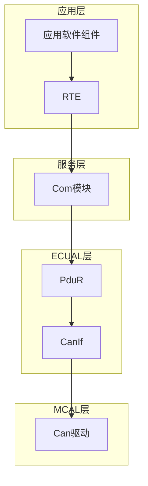
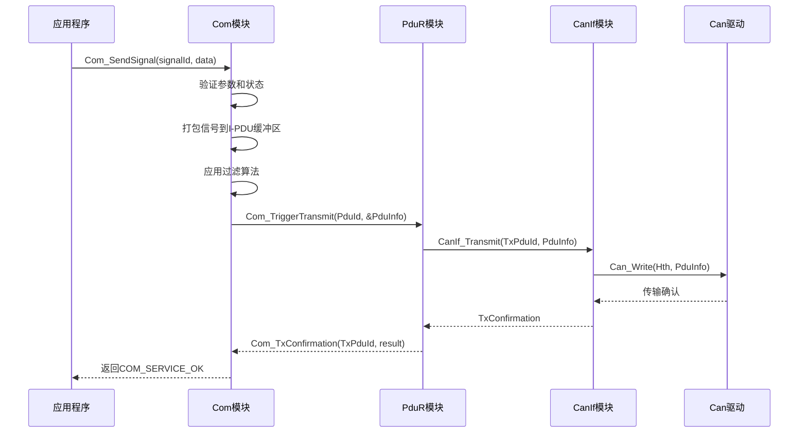
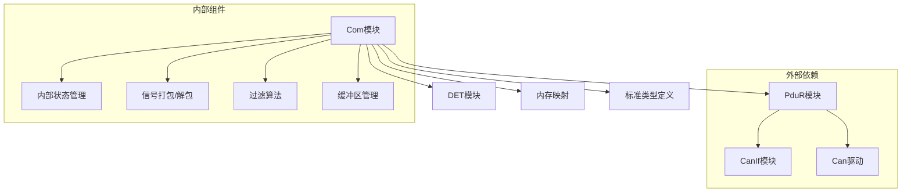
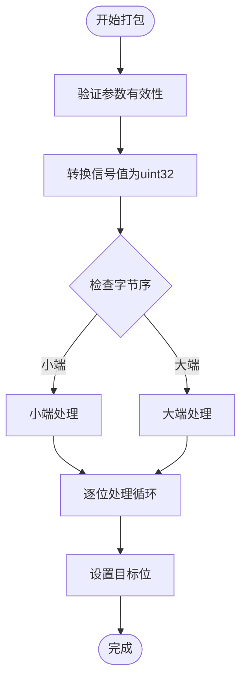
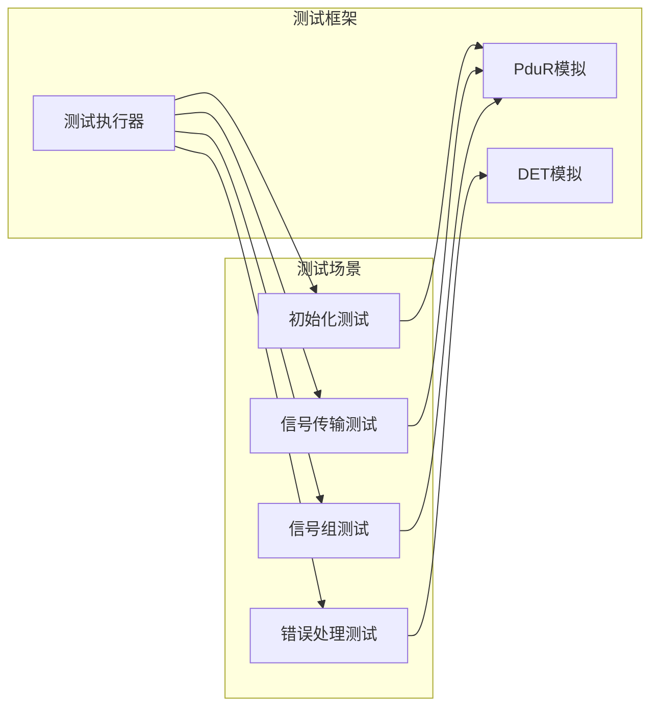

# 通信服务(Com)API

<cite>
**本文档引用的文件**
- [Com.h](file://src/bsw/services/com/include/Com.h)
- [Com_Cfg.h](file://src/bsw/services/com/include/Com_Cfg.h)
- [Com.c](file://src/bsw/services/com/src/Com.c)
- [Com_test.c](file://src/bsw/services/com/src/Com_test.c)
- [Com_spec.md](file://openspec/changes/dev-com-module/specs/Com_spec.md)
- [api-reference.md](file://docs/api-reference.md)
- [main.c](file://examples/can_demo/main.c)
</cite>

## 目录
1. [简介](#简介)
2. [项目结构](#项目结构)
3. [核心组件](#核心组件)
4. [架构概览](#架构概览)
5. [详细组件分析](#详细组件分析)
6. [依赖关系分析](#依赖关系分析)
7. [性能考虑](#性能考虑)
8. [故障排除指南](#故障排除指南)
9. [结论](#结论)

## 简介

通信服务(Com)是YuleTech AutoSAR BSW平台中的核心服务层模块，提供基于信号的通信服务。该模块将底层PDU通信抽象为信号接口，为应用软件组件提供便捷的通信方式。

Com模块的主要职责包括：
- 将信号打包/解包到I-PDU中，支持可配置的位位置和大小
- 支持信号和信号组的发送与接收
- 支持多种传输模式：DIRECT、PERIODIC、MIXED、NONE
- 支持信号过滤算法优化传输
- 支持字节序转换（LITTLE_ENDIAN、BIG_ENDIAN、OPAQUE）
- 支持I-PDU组控制和截止时间监控
- 提供通知回调机制处理信号和I-PDU事件

## 项目结构

Com模块位于服务层，采用AutoSAR标准架构设计：



**图表来源**
- [Com.h:1-508](file://src/bsw/services/com/include/Com.h#L1-L508)
- [Com.c:1-1184](file://src/bsw/services/com/src/Com.c#L1-L1184)

**章节来源**
- [Com.h:14-508](file://src/bsw/services/com/include/Com.h#L14-L508)
- [Com_Cfg.h:1-124](file://src/bsw/services/com/include/Com_Cfg.h#L1-L124)

## 核心组件

### API服务ID定义

Com模块为每个API函数定义了唯一的服务ID，用于错误检测和调试：

| API名称 | 服务ID | 功能描述 |
|---------|--------|----------|
| Com_Init | 0x01 | 初始化COM模块 |
| Com_DeInit | 0x02 | 反初始化COM模块 |
| Com_IpduGroupControl | 0x03 | I-PDU组控制 |
| Com_ReceptionDMControl | 0x04 | 接收截止时间监控控制 |
| Com_GetStatus | 0x05 | 获取模块状态 |
| Com_GetConfigurationId | 0x06 | 获取配置ID |
| Com_GetVersionInfo | 0x07 | 获取版本信息 |
| Com_SendSignal | 0x08 | 发送信号 |
| Com_ReceiveSignal | 0x09 | 接收信号 |
| Com_SendSignalGroup | 0x0A | 发送信号组 |
| Com_ReceiveSignalGroup | 0x0B | 接收信号组 |
| Com_TriggerIPDUSend | 0x13 | 触发I-PDU发送 |
| Com_MainFunctionRx | 0x1E | 接收主函数 |
| Com_MainFunctionTx | 0x1F | 发送主函数 |

### 错误代码定义

Com模块实现了完整的错误检测机制：

| 错误代码 | 值 | 描述 |
|----------|----|------|
| COM_E_PARAM | 0x01 | 通用参数错误 |
| COM_E_UNINIT | 0x02 | 模块未初始化 |
| COM_E_PARAM_POINTER | 0x03 | 空指针参数 |
| COM_E_PARAM_INIT | 0x04 | 初始化参数无效 |
| COM_E_INIT_FAILED | 0x05 | 初始化失败 |
| COM_E_INVALID_SIGNAL_ID | 0x06 | 信号ID无效 |
| COM_E_INVALID_SIGNAL_GROUP_ID | 0x07 | 信号组ID无效 |
| COM_E_INVALID_IPDU_ID | 0x08 | I-PDU ID无效 |

**章节来源**
- [Com.h:43-103](file://src/bsw/services/com/include/Com.h#L43-L103)
- [Com_spec.md:182-192](file://openspec/changes/dev-com-module/specs/Com_spec.md#L182-L192)

## 架构概览

Com模块采用分层架构设计，通过回调机制与上层和下层模块交互：



**图表来源**
- [Com.c:478-546](file://src/bsw/services/com/src/Com.c#L478-L546)
- [Com.c:728-761](file://src/bsw/services/com/src/Com.c#L728-L761)
- [Com.c:792-826](file://src/bsw/services/com/src/Com.c#L792-L826)

## 详细组件分析

### 核心API函数详解

#### Com_Init - 模块初始化

**函数原型**
```c
void Com_Init(const Com_ConfigType* config);
```

**功能描述**
初始化COM模块，设置内部状态和缓冲区。

**参数说明**
- `config`: 指向COM配置结构体的指针

**预条件**
- config指针非空

**后置条件**
- 模块状态设置为已初始化
- I-PDU状态和缓冲区初始化
- 信号状态初始化

**章节来源**
- [Com.c:405-453](file://src/bsw/services/com/src/Com.c#L405-L453)
- [Com.h:251](file://src/bsw/services/com/include/Com.h#L251)

#### Com_DeInit - 模块反初始化

**函数原型**
```c
void Com_DeInit(void);
```

**功能描述**
反初始化COM模块，清理内部状态。

**预条件**
- 模块必须处于已初始化状态

**后置条件**
- 模块状态设置为未初始化
- 配置指针清空

**章节来源**
- [Com.c:458-473](file://src/bsw/services/com/src/Com.c#L458-L473)
- [Com.h:259](file://src/bsw/services/com/include/Com.h#L259)

#### Com_SendSignal - 发送信号

**函数原型**
```c
uint8 Com_SendSignal(Com_SignalIdType SignalId, const void* SignalDataPtr);
```

**功能描述**
发送指定信号，将其打包到关联的I-PDU中。

**参数说明**
- `SignalId`: 要发送的信号ID
- `SignalDataPtr`: 指向信号数据的指针

**返回值**
- `COM_SERVICE_OK`: 服务接受
- `COM_SERVICE_NOT_OK`: 服务不可用或失败

**预条件**
- 模块已初始化
- SignalDataPtr指针非空
- SignalId有效

**处理流程**
1. 验证模块状态和参数
2. 查找信号配置
3. 转换信号值为uint32
4. 应用过滤算法
5. 打包信号到I-PDU缓冲区
6. 标记I-PDU为已更新
7. 根据传输属性触发传输

**章节来源**
- [Com.c:478-546](file://src/bsw/services/com/src/Com.c#L478-L546)
- [Com.h:343](file://src/bsw/services/com/include/Com.h#L343)

#### Com_ReceiveSignal - 接收信号

**函数原型**
```c
uint8 Com_ReceiveSignal(Com_SignalIdType SignalId, void* SignalDataPtr);
```

**功能描述**
从关联的I-PDU中接收并解包指定信号。

**参数说明**
- `SignalId`: 要接收的信号ID
- `SignalDataPtr`: 指向信号数据缓冲区的指针

**返回值**
- `COM_SERVICE_OK`: 服务接受
- `COM_SERVICE_NOT_OK`: 服务不可用或失败

**预条件**
- 模块已初始化
- SignalDataPtr指针非空
- SignalId有效

**处理流程**
1. 验证模块状态和参数
2. 查找信号配置
3. 从I-PDU缓冲区解包信号
4. 转换值到正确信号类型
5. 清除信号更新标志

**章节来源**
- [Com.c:551-590](file://src/bsw/services/com/src/Com.c#L551-L590)
- [Com.h:358](file://src/bsw/services/com/include/Com.h#L358)

#### Com_SendSignalGroup - 发送信号组

**函数原型**
```c
uint8 Com_SendSignalGroup(Com_SignalGroupIdType SignalGroupId);
```

**功能描述**
发送信号组，将影子缓冲区内容复制到I-PDU缓冲区并触发传输。

**参数说明**
- `SignalGroupId`: 要发送的信号组ID

**返回值**
- `COM_SERVICE_OK`: 服务接受
- `COM_SERVICE_NOT_OK`: 服务不可用或失败

**预条件**
- 模块已初始化
- SignalGroupId有效

**处理流程**
1. 验证模块状态和参数
2. 复制影子缓冲区到I-PDU缓冲区
3. 标记I-PDU为已更新
4. 触发I-PDU传输

**章节来源**
- [Com.c:595-626](file://src/bsw/services/com/src/Com.c#L595-L626)
- [Com.h:373](file://src/bsw/services/com/include/Com.h#L373)

#### Com_ReceiveSignalGroup - 接收信号组

**函数原型**
```c
uint8 Com_ReceiveSignalGroup(Com_SignalGroupIdType SignalGroupId);
```

**功能描述**
接收信号组，将I-PDU缓冲区内容复制到影子缓冲区。

**参数说明**
- `SignalGroupId`: 要接收的信号组ID

**返回值**
- `COM_SERVICE_OK`: 服务接受
- `COM_SERVICE_NOT_OK`: 服务不可用或失败

**预条件**
- 模块已初始化
- SignalGroupId有效

**处理流程**
1. 验证模块状态和参数
2. 复制I-PDU缓冲区到影子缓冲区

**章节来源**
- [Com.c:631-655](file://src/bsw/services/com/src/Com.c#L631-L655)
- [Com.h:387](file://src/bsw/services/com/include/Com.h#L387)

#### Com_TriggerIPDUSend - 触发I-PDU发送

**函数原型**
```c
Std_ReturnType Com_TriggerIPDUSend(PduIdType PduId);
```

**功能描述**
触发指定I-PDU的立即传输。

**参数说明**
- `PduId`: 要传输的I-PDU ID

**返回值**
- `E_OK`: 传输已触发
- `E_NOT_OK`: 传输未触发

**预条件**
- 模块已初始化
- PduId有效

**处理流程**
1. 验证模块状态和参数
2. 调用内部传输函数
3. 返回传输结果

**章节来源**
- [Com.c:766-787](file://src/bsw/services/com/src/Com.c#L766-L787)
- [Com.h:429](file://src/bsw/services/com/include/Com.h#L429)

### 数据类型和配置

#### 信号配置结构

Com_SignalConfigType定义了单个信号的配置：

| 字段名 | 类型 | 描述 |
|--------|------|------|
| SignalId | Com_SignalIdType | 信号唯一标识符 |
| BitPosition | uint16 | I-PDU内的起始位位置 |
| BitSize | uint8 | 信号大小（位） |
| Endianness | uint8 | 字节序：LITTLE_ENDIAN/BIG_ENDIAN/OPAQUE |
| TransferProperty | uint8 | 传输属性：TRIGGERED/PENDING等 |
| FilterAlgorithm | uint8 | 过滤算法 |
| FilterMask | uint32 | 过滤掩码 |
| FilterX | uint32 | 过滤参数X |
| SignalGroupRef | uint16 | 父I-PDU/信号组引用 |

**章节来源**
- [Com.h:199-209](file://src/bsw/services/com/include/Com.h#L199-L209)
- [Com_Cfg.h:38-46](file://src/bsw/services/com/include/Com_Cfg.h#L38-L46)

#### I-PDU配置结构

Com_IPduConfigType定义了单个I-PDU的配置：

| 字段名 | 类型 | 描述 |
|--------|------|------|
| PduId | PduIdType | I-PDU唯一标识符 |
| DataLength | uint16 | I-PDU数据长度（字节） |
| RepeatingEnabled | boolean | 是否启用重复传输 |
| NumRepetitions | uint8 | 重复次数 |
| TimeBetweenRepetitions | uint16 | 重复间隔时间 |
| TimePeriod | uint16 | 传输周期 |

**章节来源**
- [Com.h:212-219](file://src/bsw/services/com/include/Com.h#L212-L219)
- [Com_Cfg.h:50-54](file://src/bsw/services/com/include/Com_Cfg.h#L50-L54)

### 传输模式

Com模块支持多种传输模式：

| 模式 | 值 | 描述 |
|------|----|------|
| COM_DIRECT | 0x00 | 直接传输，立即发送 |
| COM_MIXED | 0x01 | 混合模式，周期+事件触发 |
| COM_NONE | 0x02 | 禁用传输 |
| COM_PERIODIC | 0x03 | 周期性传输 |

**章节来源**
- [Com.h:134-137](file://src/bsw/services/com/include/Com.h#L134-L137)
- [Com_Cfg.h:67-70](file://src/bsw/services/com/include/Com_Cfg.h#L67-L70)

## 依赖关系分析

Com模块的依赖关系如下：



**图表来源**
- [Com.c:19-24](file://src/bsw/services/com/src/Com.c#L19-L24)
- [Com.h:20-22](file://src/bsw/services/com/include/Com.h#L20-L22)

### 关键依赖关系

1. **PduR集成**: Com模块通过PduR进行I-PDU的传输和接收
2. **错误检测**: 使用DET模块报告开发错误
3. **内存管理**: 使用MemMap进行内存段管理
4. **标准类型**: 依赖Std_Types.h提供的标准数据类型

**章节来源**
- [Com.c:19-24](file://src/bsw/services/com/src/Com.c#L19-L24)
- [Com.h:20-22](file://src/bsw/services/com/include/Com.h#L20-L22)

## 性能考虑

### 缓冲区管理

Com模块使用静态缓冲区来存储I-PDU数据和信号状态：

- **I-PDU缓冲区**: 每个I-PDU最多64字节
- **信号状态数组**: 支持最多64个信号的状态跟踪
- **影子缓冲区**: 支持信号组的原子传输

### 信号打包算法

信号打包和解包采用高效的位操作算法：



**图表来源**
- [Com.c:134-190](file://src/bsw/services/com/src/Com.c#L134-L190)

### 主函数调度

Com模块提供三个主要的主函数用于不同类型的处理：

1. **Com_MainFunctionRx**: 处理接收和截止时间监控
2. **Com_MainFunctionTx**: 处理周期性和混合模式的传输
3. **Com_MainFunctionRouteSignals**: 处理信号网关路由

**章节来源**
- [Com.c:866-960](file://src/bsw/services/com/src/Com.c#L866-L960)

## 故障排除指南

### 常见错误和解决方案

#### 初始化相关错误

| 错误代码 | 触发条件 | 解决方案 |
|----------|----------|----------|
| COM_E_PARAM_POINTER | Com_Init传入NULL配置指针 | 提供有效的配置结构体指针 |
| COM_E_UNINIT | 在未初始化状态下调用API | 先调用Com_Init初始化模块 |
| COM_E_INIT_FAILED | 初始化过程中发生错误 | 检查配置参数和硬件状态 |

#### 参数验证错误

| 错误代码 | 触发条件 | 解决方案 |
|----------|----------|----------|
| COM_E_PARAM_POINTER | 信号API传入NULL数据指针 | 确保传递有效的数据缓冲区 |
| COM_E_INVALID_SIGNAL_ID | 使用无效的信号ID | 检查信号ID范围和配置 |
| COM_E_INVALID_IPDU_ID | 使用无效的I-PDU ID | 验证I-PDU ID的有效性 |

#### 单元测试验证

Com模块包含完整的单元测试覆盖：



**图表来源**
- [Com_test.c:112-394](file://src/bsw/services/com/src/Com_test.c#L112-L394)

**章节来源**
- [Com_test.c:112-394](file://src/bsw/services/com/src/Com_test.c#L112-L394)

### 调试技巧

1. **启用DET**: 在Com_Cfg.h中设置COM_DEV_ERROR_DETECT为STD_ON
2. **检查缓冲区**: 验证I-PDU缓冲区是否正确填充
3. **监控状态**: 使用Com_GetStatus()检查模块状态
4. **验证配置**: 确保信号配置与硬件规格匹配

## 结论

Com模块提供了完整的AutoSAR通信服务，具有以下特点：

1. **标准化接口**: 符合AutoSAR标准，提供清晰的API接口
2. **灵活配置**: 支持多种传输模式和信号过滤算法
3. **高效实现**: 采用优化的数据结构和算法
4. **完整测试**: 包含全面的单元测试覆盖
5. **错误处理**: 实现完整的错误检测和报告机制

Com模块为应用软件组件提供了简单易用的信号通信接口，同时保持了对底层PDU通信的完全控制。通过合理的配置和使用，可以实现高效可靠的车载网络通信。