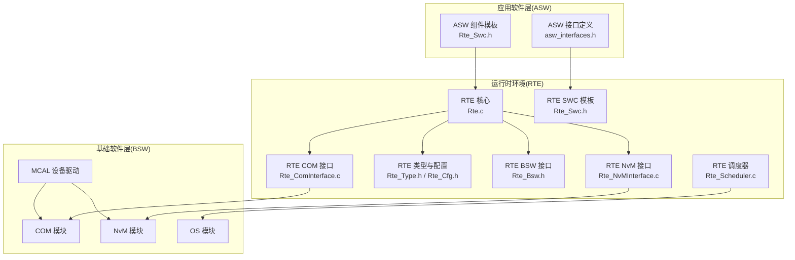
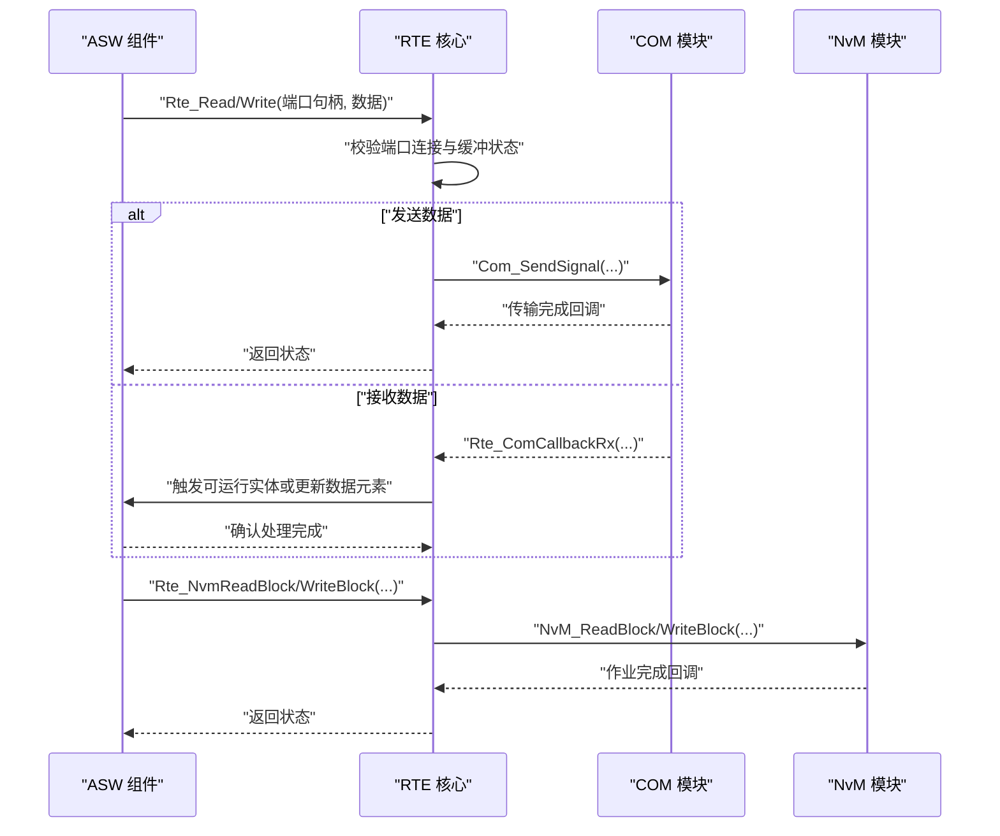
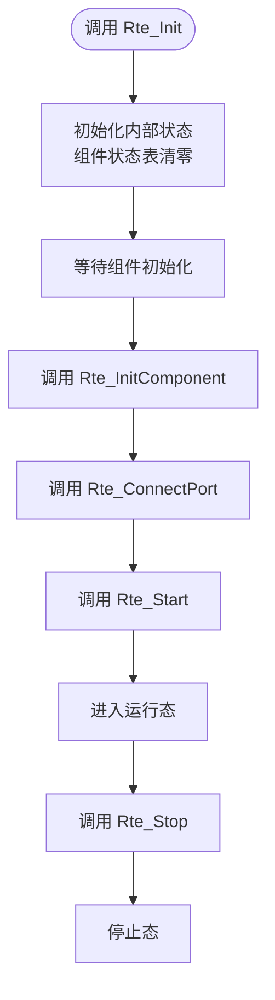
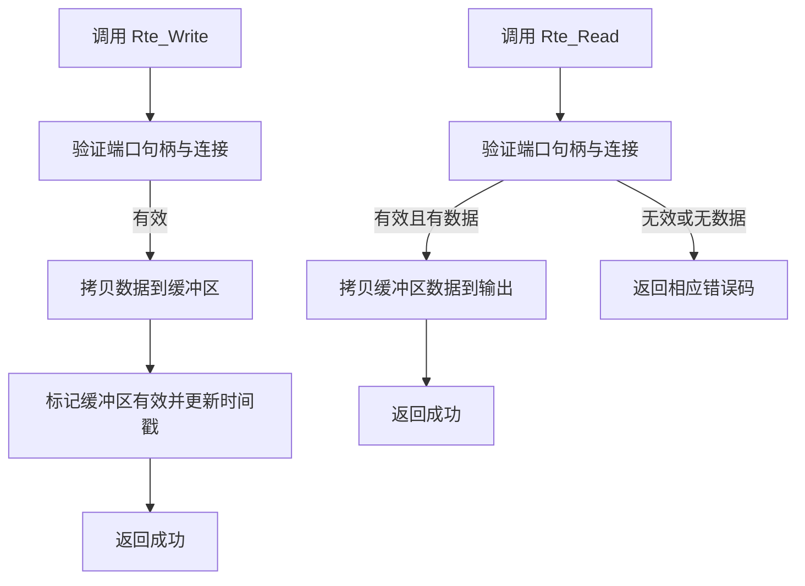
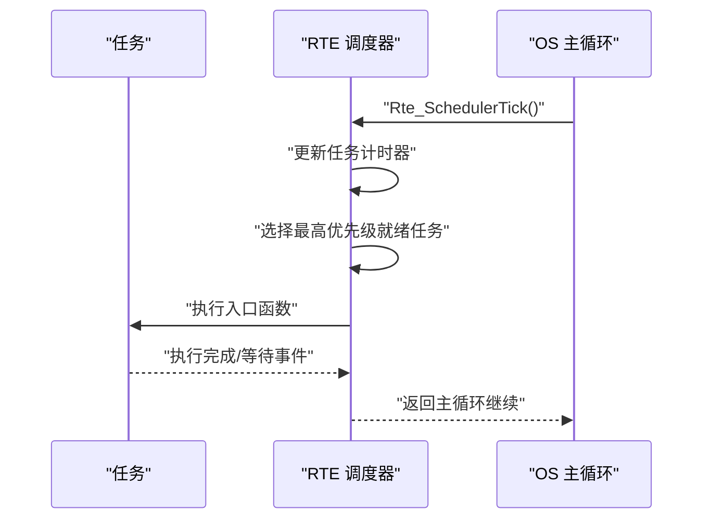
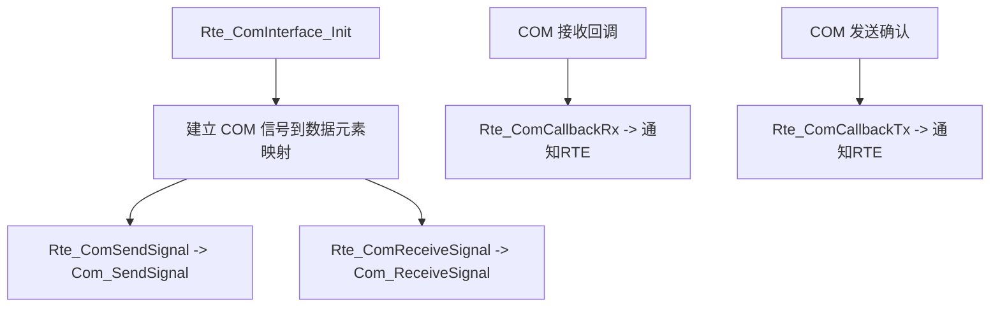
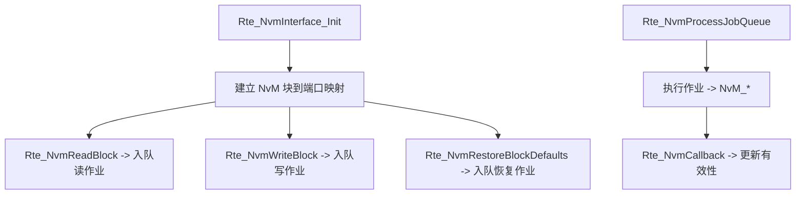
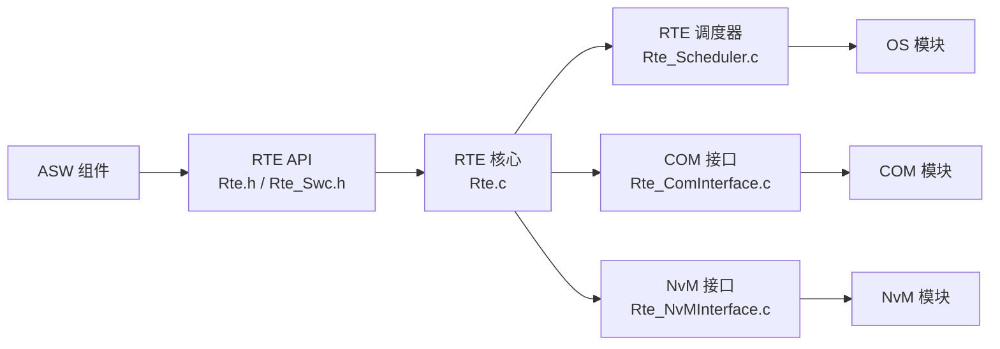

# 运行时环境(RTE)API

<cite>
**本文档引用的文件**
- [Rte.h](file://src/bsw/rte/include/Rte.h)
- [Rte_Type.h](file://src/bsw/rte/include/Rte_Type.h)
- [Rte_Cfg.h](file://src/bsw/rte/include/Rte_Cfg.h)
- [Rte.c](file://src/bsw/rte/src/Rte.c)
- [Rte_Scheduler.c](file://src/bsw/rte/src/Rte_Scheduler.c)
- [Rte_Bsw.h](file://src/bsw/rte/include/Rte_Bsw.h)
- [Rte_Swc.h](file://src/bsw/rte/include/Rte_Swc.h)
- [Rte_ComInterface.c](file://src/bsw/rte/src/Rte_ComInterface.c)
- [Rte_NvMInterface.c](file://src/bsw/rte/src/Rte_NvMInterface.c)
- [asw_interfaces.h](file://src/asw/asw_interfaces.h)
- [main.c](file://examples/can_demo/main.c)
- [main.c](file://examples/led_blink/main.c)
</cite>

## 目录
1. [简介](#简介)
2. [项目结构](#项目结构)
3. [核心组件](#核心组件)
4. [架构总览](#架构总览)
5. [详细组件分析](#详细组件分析)
6. [依赖关系分析](#依赖关系分析)
7. [性能考虑](#性能考虑)
8. [故障排除指南](#故障排除指南)
9. [结论](#结论)
10. [附录](#附录)

## 简介
本文件为运行时环境（RTE）的全面API参考文档，面向应用软件（ASW）与基础软件（BSW）之间的解耦与数据交换需求。RTE遵循AutoSAR Classic Platform 4.x标准，提供组件接口管理、数据类型定义、调度机制与通信接口，支撑ASW组件与BSW模块之间的松耦合协作。文档涵盖：
- 核心API：初始化、启动/停止、版本查询、端口连接、数据读写、事件与模式管理、主函数周期处理
- 数据类型：状态码、事件掩码、缓冲区、字符串与数组、时间戳、通信规格等
- 调度机制：基于优先级的任务调度、事件等待与触发、定时器推进
- 通信接口：与COM、NvM等BSW模块的桥接接口
- 配置参数：组件数量、端口数量、数据元素、内存与缓冲区限制、OS任务与超时设置
- 错误处理：DET错误码、超时、未连接、范围越界等错误场景
- 实际应用场景：组件接口调用、数据读写、事件触发、回调通知等

## 项目结构
RTE位于BSW层，提供ASW与BSW之间的抽象接口，并通过桥接模块与具体BSW服务（如COM、NvM）交互。关键目录与文件如下：
- include：RTE公共头文件（Rte.h、Rte_Type.h、Rte_Cfg.h、Rte_Bsw.h、Rte_Swc.h）
- src：RTE核心实现与桥接接口（Rte.c、Rte_Scheduler.c、Rte_ComInterface.c、Rte_NvMInterface.c）
- asw：ASW组件接口定义（asw_interfaces.h）
- examples：使用示例（CAN通信演示、LED闪烁）

**图表来源**
- [Rte.h:1-441](file://src/bsw/rte/include/Rte.h#L1-L441)
- [Rte_Type.h:1-361](file://src/bsw/rte/include/Rte_Type.h#L1-L361)
- [Rte_Cfg.h:1-280](file://src/bsw/rte/include/Rte_Cfg.h#L1-L280)
- [Rte.c:1-792](file://src/bsw/rte/src/Rte.c#L1-L792)
- [Rte_Scheduler.c:1-590](file://src/bsw/rte/src/Rte_Scheduler.c#L1-L590)
- [Rte_Bsw.h:1-351](file://src/bsw/rte/include/Rte_Bsw.h#L1-L351)
- [Rte_Swc.h:1-406](file://src/bsw/rte/include/Rte_Swc.h#L1-L406)
- [Rte_ComInterface.c:1-283](file://src/bsw/rte/src/Rte_ComInterface.c#L1-L283)
- [Rte_NvMInterface.c:1-429](file://src/bsw/rte/src/Rte_NvMInterface.c#L1-L429)

**章节来源**
- [Rte.h:1-441](file://src/bsw/rte/include/Rte.h#L1-L441)
- [Rte_Type.h:1-361](file://src/bsw/rte/include/Rte_Type.h#L1-L361)
- [Rte_Cfg.h:1-280](file://src/bsw/rte/include/Rte_Cfg.h#L1-L280)

## 核心组件
本节概述RTE提供的核心能力与接口族，便于快速定位功能与使用方法。

- 核心生命周期与版本
  - 初始化/启动/停止：Rte_Init、Rte_Start、Rte_Stop
  - 版本信息：Rte_GetVersionInfo
- 组件与端口管理
  - 组件初始化：Rte_InitComponent
  - 端口连接：Rte_ConnectPort
- 数据读写与缓冲
  - 发送-接收端口读写：Rte_Read、Rte_Write
  - 缓冲区类型：Rte_BufferType
- 事件与模式
  - 事件：Rte_WaitForEvent、Rte_SetEvent、Rte_ClearEvent
  - 模式：Rte_Switch、Rte_Mode、Rte_SwitchAck
- 内存与参数
  - IRV（跨可运行实体变量）：Rte_IrvRead、Rte_IrvWrite
  - PIM（实例内共享内存）：Rte_PimRead、Rte_PimWrite、Rte_PimAddr
  - 参数：Rte_CalPrmRead、Rte_CalPrmAddr
  - 测量：Rte_MeasurementRead、Rte_MeasurementWrite
- 回调与主函数
  - COM回调：Rte_ComCbk、Rte_ComCbkTout、Rte_ComCbkInv、Rte_ComCbkSwitchAck
  - 主函数：Rte_MainFunction
- 宏与便捷接口
  - 组件API宏：RTE_COMPONENT_API
  - 接口读写宏：RTE_SR_READ、RTE_SR_WRITE、RTE_CS_CALL
  - 触发与模式宏：RTE_TRIGGER、RTE_MODE_SWITCH
  - 内存与参数宏：RTE_PIM_*、RTE_CALPRM_*

**章节来源**
- [Rte.h:70-441](file://src/bsw/rte/include/Rte.h#L70-L441)

## 架构总览
RTE在系统中的角色是“中间层”，向上为ASW组件提供统一的抽象接口，向下与各BSW模块（COM、NvM、OS等）对接。其核心职责包括：
- 组件生命周期管理：初始化、启动、停止、状态查询
- 端口连接与数据路由：维护端口状态、缓冲区与有效性标记
- 事件与调度：支持任务级事件等待与触发，推进周期性可运行实体
- 通信桥接：将COM信号映射到RTE数据元素，将NvM块映射到RTE端口
- 错误检测与报告：通过DET上报错误码，保障系统稳定性

**图表来源**
- [Rte.c:425-517](file://src/bsw/rte/src/Rte.c#L425-L517)
- [Rte_ComInterface.c:155-197](file://src/bsw/rte/src/Rte_ComInterface.c#L155-L197)
- [Rte_NvMInterface.c:259-317](file://src/bsw/rte/src/Rte_NvMInterface.c#L259-L317)

## 详细组件分析

### 组件接口与生命周期管理
- 组件初始化：Rte_InitComponent(componentId, numPorts)
  - 功能：为指定组件分配端口空间并标记为已初始化
  - 返回：RTE状态码（含错误码）
- 端口连接：Rte_ConnectPort(portHandle, direction, dataLength)
  - 功能：建立端口连接，设置方向与缓冲长度
  - 注意：需在RTE启动后执行
- 生命周期控制：Rte_Init、Rte_Start、Rte_Stop
  - Init：清零内部状态、初始化组件与端口表
  - Start：进入启动状态，允许调度与处理
  - Stop：停止调度与处理，回到停止状态

**图表来源**
- [Rte.c:208-382](file://src/bsw/rte/src/Rte.c#L208-L382)

**章节来源**
- [Rte.c:208-382](file://src/bsw/rte/src/Rte.c#L208-L382)

### 数据读写与缓冲管理
- 发送端口写入：Rte_Write(portHandle, data)
  - 功能：将数据复制到端口缓冲区，标记有效并记录时间戳
  - 边界：不超出最大缓冲区大小
- 接收端口读取：Rte_Read(portHandle, data)
  - 功能：从缓冲区拷贝数据至目标指针
  - 结果：无数据时返回特定状态码
- 缓冲区结构：Rte_BufferType
  - 字段：数据指针、当前长度、最大长度、有效性标志、时间戳

**图表来源**
- [Rte.c:425-465](file://src/bsw/rte/src/Rte.c#L425-L465)
- [Rte.c:470-517](file://src/bsw/rte/src/Rte.c#L470-L517)

**章节来源**
- [Rte.c:425-517](file://src/bsw/rte/src/Rte.c#L425-L517)
- [Rte_Type.h:169-173](file://src/bsw/rte/include/Rte_Type.h#L169-L173)

### 事件与调度机制
- 事件管理：Rte_WaitForEvent、Rte_SetEvent、Rte_ClearEvent
  - 支持任务级事件等待与触发，具备超时机制
- 调度器：Rte_SchedulerTick、Rte_Scheduler_MainFunction
  - 基于优先级的任务选择与抢占
  - 定时器推进与周期性任务激活
- 可运行实体：Rte_RunnableActivate、Rte_RunnableTerminate
  - 可运行实体的激活与终止接口预留

**图表来源**
- [Rte_Scheduler.c:530-558](file://src/bsw/rte/src/Rte_Scheduler.c#L530-L558)

**章节来源**
- [Rte_Scheduler.c:378-525](file://src/bsw/rte/src/Rte_Scheduler.c#L378-L525)

### 通信接口（COM桥接）
- 信号映射：Rte_ComInterface_Init
  - 默认映射常见信号到数据元素（如引擎转速、车速等）
- 信号发送/接收：Rte_ComSendSignal、Rte_ComReceiveSignal
  - 通过COM模块完成实际传输
- 回调处理：Rte_ComCallbackRx、Rte_ComCallbackTx
  - 将底层回调转换为RTE内部通知

**图表来源**
- [Rte_ComInterface.c:124-150](file://src/bsw/rte/src/Rte_ComInterface.c#L124-L150)
- [Rte_ComInterface.c:155-197](file://src/bsw/rte/src/Rte_ComInterface.c#L155-L197)
- [Rte_ComInterface.c:202-236](file://src/bsw/rte/src/Rte_ComInterface.c#L202-L236)

**章节来源**
- [Rte_ComInterface.c:124-275](file://src/bsw/rte/src/Rte_ComInterface.c#L124-L275)

### 存储接口（NvM桥接）
- 块映射：Rte_NvmInterface_Init
  - 默认映射典型NvM块到端口（里程表、VIN、错误日志等）
- 作业队列：Rte_NvmReadBlock、Rte_NvmWriteBlock、Rte_NvmRestoreBlockDefaults
  - 异步作业排队与处理
- 回调处理：Rte_NvmCallback
  - 更新块有效性并通知RTE

**图表来源**
- [Rte_NvMInterface.c:219-254](file://src/bsw/rte/src/Rte_NvMInterface.c#L219-L254)
- [Rte_NvMInterface.c:259-317](file://src/bsw/rte/src/Rte_NvMInterface.c#L259-L317)
- [Rte_NvMInterface.c:337-356](file://src/bsw/rte/src/Rte_NvMInterface.c#L337-L356)

**章节来源**
- [Rte_NvMInterface.c:219-371](file://src/bsw/rte/src/Rte_NvMInterface.c#L219-L371)

### 数据类型与配置
- 状态类型：Rte_StatusType
  - 包含成功、超时、无数据、COM停止/重启、序列化错误、范围越界等
- 事件类型与掩码：Rte_EventType、RTE_EVENT_*常量
- 缓冲区与数组：Rte_BufferType、Rte_ArrayType、Rte_ByteArrayType
- 时间类型：Rte_TimeType、Rte_TimestampType、Rte_DateAndTimeType
- 通信规格：Rte_ComSpecType、Rte_PR/PV端口规格
- 配置参数：Rte_Cfg.h中定义的组件、端口、数据元素、内存、缓冲、OS、超时等上限

**章节来源**
- [Rte_Type.h:38-67](file://src/bsw/rte/include/Rte_Type.h#L38-L67)
- [Rte_Type.h:125-139](file://src/bsw/rte/include/Rte_Type.h#L125-L139)
- [Rte_Type.h:169-286](file://src/bsw/rte/include/Rte_Type.h#L169-L286)
- [Rte_Cfg.h:14-111](file://src/bsw/rte/include/Rte_Cfg.h#L14-L111)

### BSW接口与宏
- BSW接口：Rte_Bsw.h提供ECUM、诊断、通信、存储、IO、模式管理、看门狗等接口
- 宏封装：RTE_BSW_CALL、RTE_BSW_MODE_SWITCH、RTE_BSW_WDG_*等
- 作用：为ASW访问BSW模块提供统一入口，隐藏底层差异

**章节来源**
- [Rte_Bsw.h:24-351](file://src/bsw/rte/include/Rte_Bsw.h#L24-L351)

### SWC模板与宏
- SWC模板：Rte_Swc.h定义组件类型、可运行实体、端口类型与连接信息
- 宏工具：SWC_DECLARE_*、SWC_DEFINE_RUNNABLE、SWC_PIM/IRV访问宏
- 作用：帮助ASW开发者以标准化方式声明组件与端口，简化接口使用

**章节来源**
- [Rte_Swc.h:23-406](file://src/bsw/rte/include/Rte_Swc.h#L23-L406)

## 依赖关系分析
RTE与各层的依赖关系如下：
- 向上（ASW）：通过Rte.h、Rte_Swc.h暴露统一接口；ASW通过宏与RTE进行数据读写与事件管理
- 向下（BSW）：通过Rte_Bsw.h与Rte_ComInterface.c、Rte_NvMInterface.c桥接到COM、NvM等模块
- 内部：Rte.c维护内部状态、端口与缓冲；Rte_Scheduler.c负责任务调度与事件

**图表来源**
- [Rte.h:70-441](file://src/bsw/rte/include/Rte.h#L70-L441)
- [Rte.c:19-26](file://src/bsw/rte/src/Rte.c#L19-L26)
- [Rte_Scheduler.c:18-22](file://src/bsw/rte/src/Rte_Scheduler.c#L18-L22)
- [Rte_ComInterface.c:18-23](file://src/bsw/rte/src/Rte_ComInterface.c#L18-L23)
- [Rte_NvMInterface.c:18-23](file://src/bsw/rte/src/Rte_NvMInterface.c#L18-L23)

**章节来源**
- [Rte.c:19-26](file://src/bsw/rte/src/Rte.c#L19-L26)
- [Rte_Scheduler.c:18-22](file://src/bsw/rte/src/Rte_Scheduler.c#L18-L22)
- [Rte_ComInterface.c:18-23](file://src/bsw/rte/src/Rte_ComInterface.c#L18-L23)
- [Rte_NvMInterface.c:18-23](file://src/bsw/rte/src/Rte_NvMInterface.c#L18-L23)

## 性能考虑
- 缓冲区与队列：合理设置RTE_MAX_BUFFER_SIZE、RTE_MAX_QUEUE_LENGTH，避免频繁拷贝与溢出
- 事件与调度：优先级设计应结合实时性要求；事件等待超时需平衡响应与资源占用
- 通信路径：COM信号映射应尽量减少不必要的转换；批量发送/接收可降低开销
- 内存管理：PIM、IRV、参数与测量值的访问应避免竞争，必要时配合独占区域（RTE提供占位实现）
- OS集成：RTE主函数周期与OS任务周期需协调，确保调度器tick与RTE_MainFunction同步

## 故障排除指南
- 常见错误码（节选）
  - 未初始化：RTE_E_UNINIT
  - 参数越界：RTE_E_OUT_OF_RANGE
  - 未连接：RTE_E_UNCONNECTED
  - 超时：RTE_E_TIMEOUT
  - 无数据：RTE_E_NO_DATA
  - 序列化错误：RTE_E_SERIALIZATION_ERROR
  - COM停止/重启：RTE_E_COM_STOPPED、RTE_E_COM_RESTARTED
- 排查步骤
  - 确认RTE已初始化并启动
  - 检查端口是否正确连接（方向与长度）
  - 校验数据指针非空与长度合法
  - 关注事件等待超时与回调时机
  - 查看COM/NvM回调是否正确触发

**章节来源**
- [Rte.h:54-68](file://src/bsw/rte/include/Rte.h#L54-L68)
- [Rte.c:431-465](file://src/bsw/rte/src/Rte.c#L431-L465)
- [Rte_Scheduler.c:386-444](file://src/bsw/rte/src/Rte_Scheduler.c#L386-L444)

## 结论
RTE通过标准化的API与严格的配置约束，实现了ASW与BSW之间的高效解耦与稳定通信。其核心优势在于：
- 明确的生命周期与状态机，便于调试与维护
- 灵活的事件与调度机制，满足实时性需求
- 清晰的桥接接口，降低对底层模块的耦合
- 完整的数据类型与配置体系，保障数据一致性与安全性

建议在项目中：
- 严格遵守RTE配置上限与错误码约定
- 使用宏与模板简化接口声明与调用
- 在集成阶段重点验证COM与NvM桥接路径
- 结合OS与MCAL特性优化调度与中断处理

## 附录

### 实际应用场景与示例路径
- CAN通信演示：展示CanIf与Com的配合使用，体现RTE在通信链路中的位置
  - 示例路径：[examples/can_demo/main.c:1-119](file://examples/can_demo/main.c#L1-L119)
- LED闪烁示例：展示Gpt与Dio的配合使用，体现RTE与OS的协作
  - 示例路径：[examples/led_blink/main.c:1-100](file://examples/led_blink/main.c#L1-L100)
- ASW接口定义：展示ASW侧的数据元素与状态枚举
  - 示例路径：[src/asw/asw_interfaces.h:1-314](file://src/asw/asw_interfaces.h#L1-L314)

**章节来源**
- [main.c:63-118](file://examples/can_demo/main.c#L63-L118)
- [main.c:61-99](file://examples/led_blink/main.c#L61-L99)
- [asw_interfaces.h:22-314](file://src/asw/asw_interfaces.h#L22-L314)