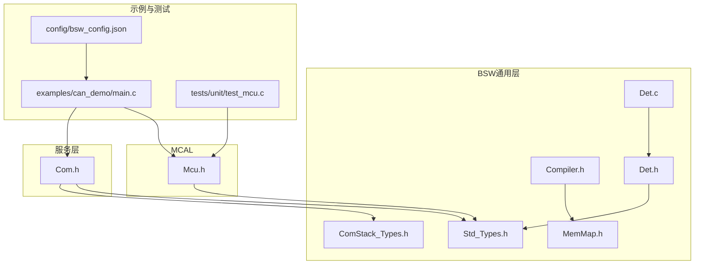
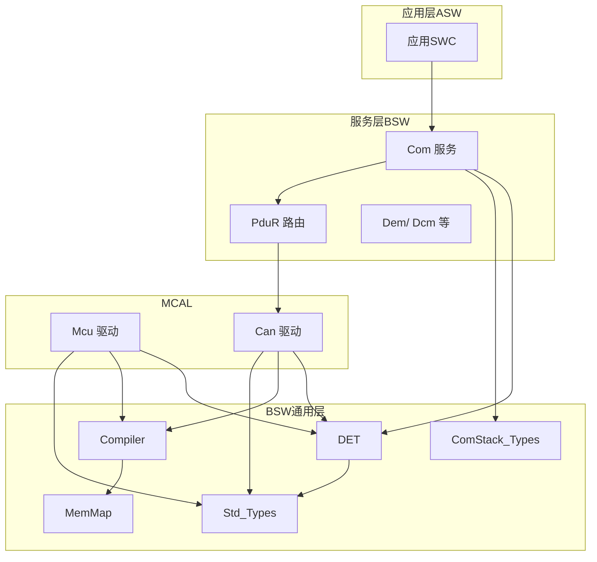
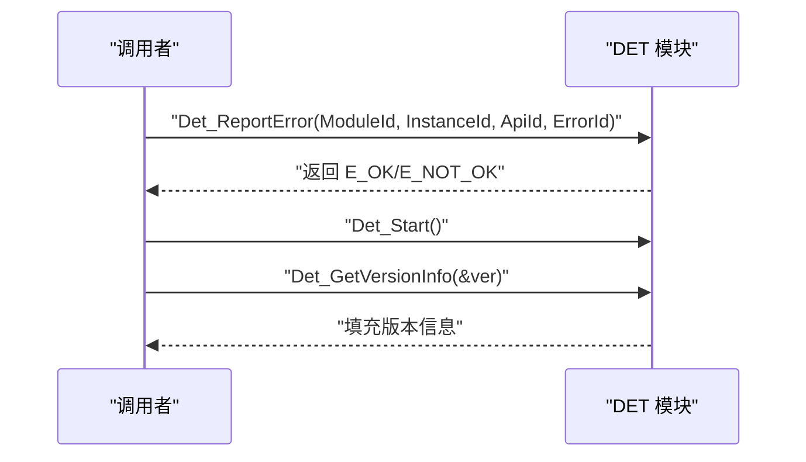
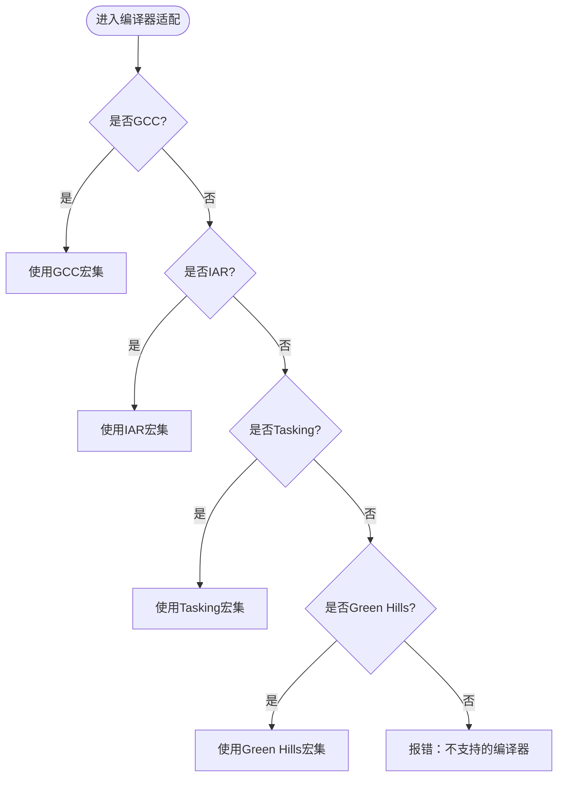
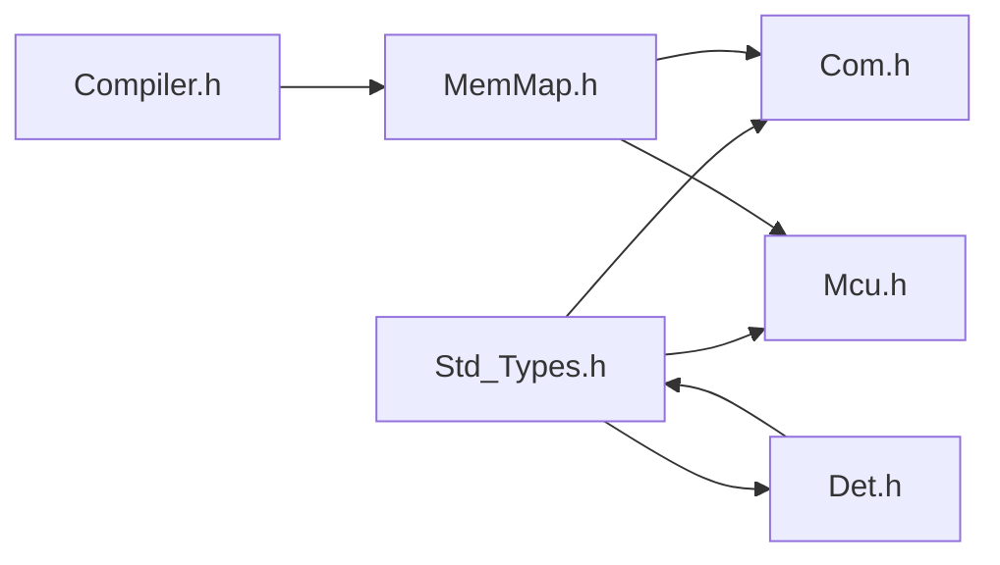

# 通用API和工具

<cite>
**本文引用的文件**   
- [Std_Types.h](file://src/bsw/os/include/Std_Types.h)
- [Det.h](file://src/bsw/services/det/include/Det.h)
- [Det.c](file://src/bsw/services/det/src/Det.c)
- [Compiler.h](file://include/autosar/Compiler.h)
- [ComStack_Types.h](file://src/bsw/ecual/include/ComStack_Types.h)
- [MemMap.h](file://src/bsw/general/inc/MemMap.h)
- [Mcu.h](file://src/bsw/mcal/mcu/include/Mcu.h)
- [Com.h](file://src/bsw/services/com/include/Com.h)
- [main.c](file://examples/can_demo/main.c)
- [test_mcu.c](file://tests/unit/test_mcu.c)
- [bsw_config.json](file://config/bsw_config.json)
</cite>

## 目录
1. [简介](#简介)
2. [项目结构](#项目结构)
3. [核心组件](#核心组件)
4. [架构总览](#架构总览)
5. [详细组件分析](#详细组件分析)
6. [依赖关系分析](#依赖关系分析)
7. [性能考量](#性能考量)
8. [故障排查指南](#故障排查指南)
9. [结论](#结论)
10. [附录](#附录)

## 简介
本文件为AutoSAR Classic平台通用API与工具的参考文档，覆盖以下基础接口与抽象层：
- 标准类型定义（Std_Types）
- 开发错误检测（DET）
- 编译器抽象（Compiler）
- 通信栈类型（ComStack_Types）
- 内存映射（MemMap）

这些通用接口是AutoSAR BSW（底层软件）与上层服务模块之间的契约，确保跨模块、跨编译器的一致性与可移植性。文档将解释各模块的作用、数据结构、错误码、编译器特性宏以及在典型通信场景中的使用方式，并提供最佳实践与排错建议。

## 项目结构
通用API与工具位于BSW公共目录，被MCAL、BSW集成层、服务层广泛复用。下图展示与本文件相关的核心文件及其位置关系：

**图表来源**
- [Std_Types.h:1-117](file://src/bsw/os/include/Std_Types.h#L1-L117)
- [Compiler.h:1-187](file://include/autosar/Compiler.h#L1-L187)
- [MemMap.h:1-796](file://src/bsw/general/inc/MemMap.h#L1-L796)
- [Det.h:1-76](file://src/bsw/services/det/include/Det.h#L1-L76)
- [Det.c:1-88](file://src/bsw/services/det/src/Det.c#L1-L88)
- [ComStack_Types.h:1-170](file://src/bsw/ecual/include/ComStack_Types.h#L1-L170)
- [Mcu.h:1-239](file://src/bsw/mcal/mcu/include/Mcu.h#L1-L239)
- [Com.h:1-508](file://src/bsw/services/com/include/Com.h#L1-L508)
- [main.c:1-119](file://examples/can_demo/main.c#L1-L119)
- [test_mcu.c:1-209](file://tests/unit/test_mcu.c#L1-L209)
- [bsw_config.json:1-21](file://config/bsw_config.json#L1-L21)

**章节来源**
- [Std_Types.h:1-117](file://src/bsw/os/include/Std_Types.h#L1-L117)
- [Compiler.h:1-187](file://include/autosar/Compiler.h#L1-L187)
- [MemMap.h:1-796](file://src/bsw/general/inc/MemMap.h#L1-L796)
- [Det.h:1-76](file://src/bsw/services/det/include/Det.h#L1-L76)
- [Det.c:1-88](file://src/bsw/services/det/src/Det.c#L1-L88)
- [ComStack_Types.h:1-170](file://src/bsw/ecual/include/ComStack_Types.h#L1-L170)
- [Mcu.h:1-239](file://src/bsw/mcal/mcu/include/Mcu.h#L1-L239)
- [Com.h:1-508](file://src/bsw/services/com/include/Com.h#L1-L508)
- [main.c:1-119](file://examples/can_demo/main.c#L1-L119)
- [test_mcu.c:1-209](file://tests/unit/test_mcu.c#L1-L209)
- [bsw_config.json:1-21](file://config/bsw_config.json#L1-L21)

## 核心组件
本节概述四个通用接口模块的功能定位与职责边界：
- 标准类型定义（Std_Types）：统一返回类型、布尔、整型、浮点、版本信息结构等，作为所有模块的“数据契约”。
- 开发错误检测（DET）：提供错误上报、启动与版本查询接口，便于开发阶段快速定位问题。
- 编译器抽象（Compiler）：屏蔽GCC/IAR/Tasking/Green Hills等编译器差异，提供统一的内联、中断、打包、对齐、断言等宏。
- 通信栈类型（ComStack_Types）：定义PDU、CAN ID、缓冲区请求返回值、通信模式等通信相关类型，支撑Com/PduR/CAN等模块。

**章节来源**
- [Std_Types.h:23-80](file://src/bsw/os/include/Std_Types.h#L23-L80)
- [Det.h:34-70](file://src/bsw/services/det/include/Det.h#L34-L70)
- [Compiler.h:28-121](file://include/autosar/Compiler.h#L28-L121)
- [ComStack_Types.h:36-167](file://src/bsw/ecual/include/ComStack_Types.h#L36-L167)

## 架构总览
下图展示通用API在AutoSAR分层中的角色与交互关系。MCAL通过Std_Types与Compiler进行类型与编译器无关的实现；服务层（如Com）依赖Std_Types与ComStack_Types完成信号与PDU处理；DET贯穿各模块，提供统一的错误上报能力。

**图表来源**
- [Std_Types.h:1-117](file://src/bsw/os/include/Std_Types.h#L1-L117)
- [Compiler.h:1-187](file://include/autosar/Compiler.h#L1-L187)
- [MemMap.h:1-796](file://src/bsw/general/inc/MemMap.h#L1-L796)
- [Det.h:1-76](file://src/bsw/services/det/include/Det.h#L1-L76)
- [ComStack_Types.h:1-170](file://src/bsw/ecual/include/ComStack_Types.h#L1-L170)
- [Mcu.h:1-239](file://src/bsw/mcal/mcu/include/Mcu.h#L1-L239)
- [Com.h:1-508](file://src/bsw/services/com/include/Com.h#L1-L508)

## 详细组件分析

### 标准类型定义（Std_Types）
- 返回类型与错误码
  - E_OK、E_NOT_OK、E_BUSY：统一返回值约定，便于模块间一致处理成功、失败与忙状态。
  - NULL_PTR：空指针安全检查的基础。
- 基本数据类型族
  - 无符号/有符号整型：uint8/16/32/64、sint8/16/32/64。
  - 浮点：float32、float64。
  - 布尔：boolean，配合TRUE/FALSE。
- 版本信息结构
  - Std_VersionInfoType：包含vendorID、moduleID与主/次/补丁版本字段，用于模块版本查询。
- 使用要点
  - 所有模块返回值应使用Std_ReturnType，避免直接使用底层整型字面量。
  - 版本查询统一通过GetVersionInfo填充Std_VersionInfoType。

**章节来源**
- [Std_Types.h:23-80](file://src/bsw/os/include/Std_Types.h#L23-L80)

### 开发错误检测（DET）
- 功能接口
  - Det_ReportError：上报错误，参数包括模块ID、实例ID、API ID与错误ID，返回Std_ReturnType。
  - Det_Start：启动DET模块。
  - Det_GetVersionInfo：获取DET版本信息。
- 错误码与服务ID
  - 错误码：DET_E_NO_ERROR、DET_E_PARAM_POINTER、DET_E_UNAVAILABLE等。
  - 服务ID：DET_SID_REPORTERROR、DET_SID_START、DET_SID_GETVERSIONINFO。
- 实现要点
  - 在模块初始化、API入口处调用Det_ReportError进行参数校验与非法状态上报。
  - 通过Det_Start确保DET可用后再进行错误上报。
  - 版本查询接口遵循Std_VersionInfoType规范。

**图表来源**
- [Det.h:48-73](file://src/bsw/services/det/include/Det.h#L48-L73)
- [Det.c:47-80](file://src/bsw/services/det/src/Det.c#L47-L80)

**章节来源**
- [Det.h:34-70](file://src/bsw/services/det/include/Det.h#L34-L70)
- [Det.c:47-80](file://src/bsw/services/det/src/Det.c#L47-L80)

### 编译器抽象（Compiler）
- 编译器适配
  - 针对GCC、IAR、Tasking、Green Hills提供统一的内联、中断、打包、对齐、弱符号等宏。
  - 通过条件编译选择对应编译器的特性宏集。
- 内存段与调试
  - 提供VAR/CONST/STATIC/EXTERN等内存限定符别名。
  - 提供ASSERT断言宏（DEBUG模式下生效）。
- 工具宏
  - ARRAY_SIZE、OFFSET_OF、SIZE_OF、MIN/MAX/ABS/CLAMP等常用工具宏。
- 使用建议
  - 在需要跨编译器兼容的代码中，统一使用Compiler提供的宏，避免直接使用编译器特定关键字。
  - 利用PACKED/ALIGN等宏保证数据结构的紧凑与对齐，满足硬件或协议要求。

**图表来源**
- [Compiler.h:28-121](file://include/autosar/Compiler.h#L28-L121)

**章节来源**
- [Compiler.h:28-187](file://include/autosar/Compiler.h#L28-L187)

### 通信栈类型（ComStack_Types）
- PDU与ID类型
  - PduIdType、PduLengthType：PDU标识与长度类型。
  - Can_IdType、CanIf_CanIdTypeType：CAN ID与标准/扩展帧类型枚举。
- PDU信息与重传状态
  - PduInfoType：封装SDU数据指针、元数据指针与长度。
  - RetryInfoType/TpDataStateType：传输状态与已发送计数。
- 参数与缓冲区返回值
  - TPParameterType：STMIN/BS/BC等参数类型。
  - BufReq_ReturnType：BUFREQ_OK/E_NOT_OK/E_BUSY/E_OVFL。
- 通信模式与网络相关
  - ComM_ModeType：COMM_NO/SILENT/FULL。
  - NetworkHandleType、NetworkModeType、RemoteType等网络与远程状态类型。
- 使用建议
  - 在Com/PduR/CAN_TP等模块中，严格使用上述类型，确保跨模块一致性。
  - 对于PduInfoType，务必同时维护SduDataPtr与SduLength，避免越界访问。

**章节来源**
- [ComStack_Types.h:36-167](file://src/bsw/ecual/include/ComStack_Types.h#L36-L167)

### 内存映射（MemMap）
- 作用
  - 与Compiler配合，提供跨编译器的内存段起止宏（START/STOP），用于将代码、常量、配置、变量放置到指定段。
- 使用方式
  - 在模块头文件中以“模块名_START_SEC_CODE/CONST/VAR...”开始，包含MemMap.h后编写代码，再以“模块名_STOP_SEC_...”结束。
- 影响
  - 保证不同编译器生成的二进制布局一致，便于链接与调试。

**章节来源**
- [MemMap.h:37-793](file://src/bsw/general/inc/MemMap.h#L37-L793)

## 依赖关系分析
- 类型依赖
  - Com.h、Mcu.h、Det.h等均依赖Std_Types，确保返回值、布尔、版本信息等类型一致。
- 编译器与内存映射
  - Compiler.h被MemMap.h包含，MemMap.h在各模块头文件中被反复使用，形成“编译器抽象 → 内存映射”的基础设施链路。
- DET集成
  - DET接口在MCAL与服务层均有调用点，统一错误上报路径。

**图表来源**
- [Std_Types.h:1-117](file://src/bsw/os/include/Std_Types.h#L1-L117)
- [Com.h:1-508](file://src/bsw/services/com/include/Com.h#L1-L508)
- [Mcu.h:1-239](file://src/bsw/mcal/mcu/include/Mcu.h#L1-L239)
- [Det.h:1-76](file://src/bsw/services/det/include/Det.h#L1-L76)
- [Compiler.h:1-187](file://include/autosar/Compiler.h#L1-L187)
- [MemMap.h:1-796](file://src/bsw/general/inc/MemMap.h#L1-L796)

**章节来源**
- [Std_Types.h:1-117](file://src/bsw/os/include/Std_Types.h#L1-L117)
- [Com.h:1-508](file://src/bsw/services/com/include/Com.h#L1-L508)
- [Mcu.h:1-239](file://src/bsw/mcal/mcu/include/Mcu.h#L1-L239)
- [Det.h:1-76](file://src/bsw/services/det/include/Det.h#L1-L76)
- [Compiler.h:1-187](file://include/autosar/Compiler.h#L1-L187)
- [MemMap.h:1-796](file://src/bsw/general/inc/MemMap.h#L1-L796)

## 性能考量
- 类型与宏开销
  - Compiler.h中的工具宏（MIN/MAX/ABS/CLAMP）为纯编译期计算，运行时几乎无额外开销。
- 内存段管理
  - 合理使用MemMap的START/STOP宏，避免不必要的段切换与碎片化。
- 错误上报成本
  - DET在开发阶段启用有助于早期发现错误，但需注意在Release版本中关闭或降级日志输出，减少运行时开销。

## 故障排查指南
- 返回值与错误码
  - 统一使用Std_ReturnType与E_OK/E_NOT_OK/E_BUSY，避免混用底层整型字面量导致逻辑歧义。
- DET错误上报
  - 在API入口与关键分支调用Det_ReportError，结合服务ID与错误ID定位问题。
  - 若Det_GetVersionInfo返回异常，检查版本宏与编译器适配是否正确。
- 单元测试与示例
  - test_mcu.c展示了对NULL指针、未初始化状态、无效参数等情况的健壮性验证思路。
  - examples/can_demo/main.c演示了回调函数、主循环与模块初始化流程，可对照检查回调注册与主函数调用顺序。

**章节来源**
- [Det.h:34-70](file://src/bsw/services/det/include/Det.h#L34-L70)
- [Det.c:47-80](file://src/bsw/services/det/src/Det.c#L47-L80)
- [test_mcu.c:19-208](file://tests/unit/test_mcu.c#L19-L208)
- [main.c:63-118](file://examples/can_demo/main.c#L63-L118)

## 结论
Std_Types、DET、Compiler与ComStack_Types构成了AutoSAR BSW的通用基石。它们通过标准化的数据类型、一致的错误上报机制、编译器无关的抽象与通信栈类型定义，确保了模块间的互操作性与可移植性。在实际开发中，应严格遵循这些通用接口的契约，结合MemMap与Compiler宏，提升代码质量与可维护性。

## 附录

### 使用示例与最佳实践
- 示例：CAN通信主循环与回调
  - 参考路径：[examples/can_demo/main.c:63-118](file://examples/can_demo/main.c#L63-L118)
  - 关键点：初始化MCU/PORT/CAN/CANIF，设置控制器模式，周期性触发发送与接收主函数。
- 单元测试：MCU模块健壮性
  - 参考路径：[tests/unit/test_mcu.c:19-208](file://tests/unit/test_mcu.c#L19-L208)
  - 关键点：验证NULL配置、未初始化状态、无效参数等边界情况下的行为。
- 配置：BSW模块参数
  - 参考路径：[config/bsw_config.json:1-21](file://config/bsw_config.json#L1-L21)
  - 关键点：模块启停、时钟频率、波特率等参数集中管理，便于构建与部署。

**章节来源**
- [main.c:63-118](file://examples/can_demo/main.c#L63-L118)
- [test_mcu.c:19-208](file://tests/unit/test_mcu.c#L19-L208)
- [bsw_config.json:1-21](file://config/bsw_config.json#L1-L21)