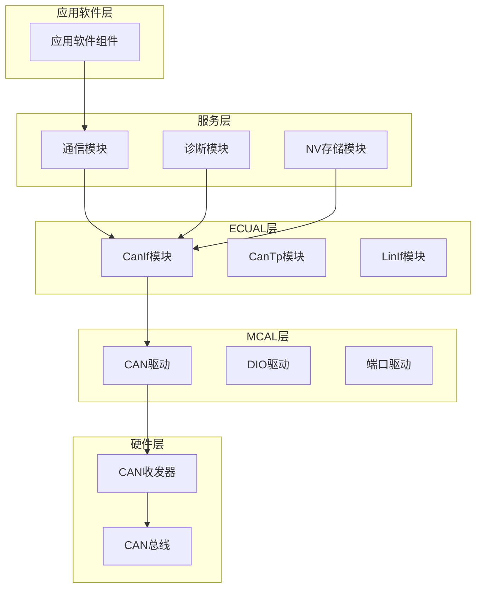
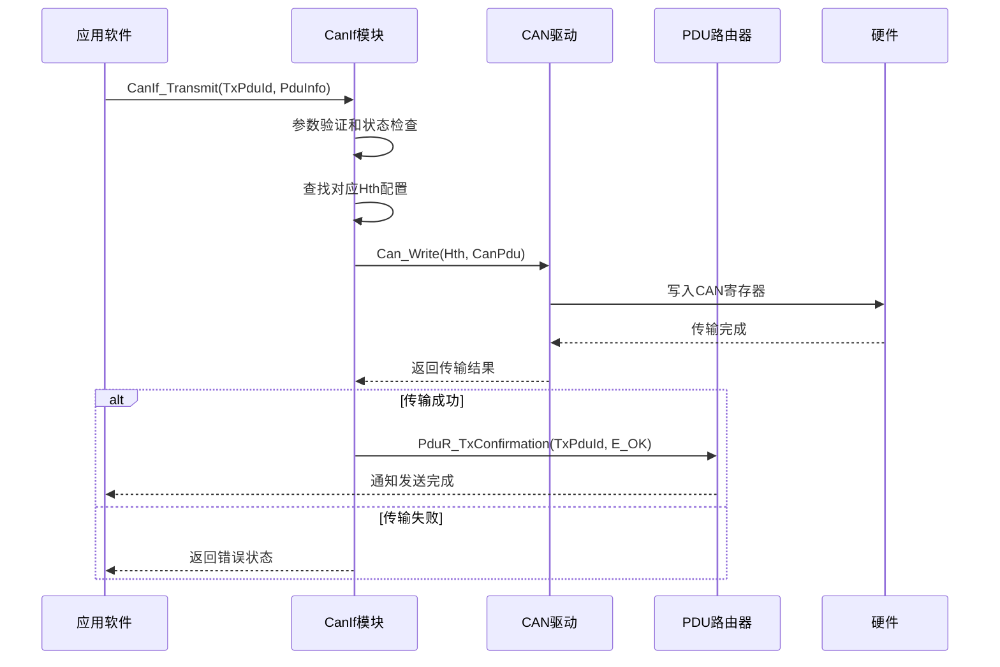
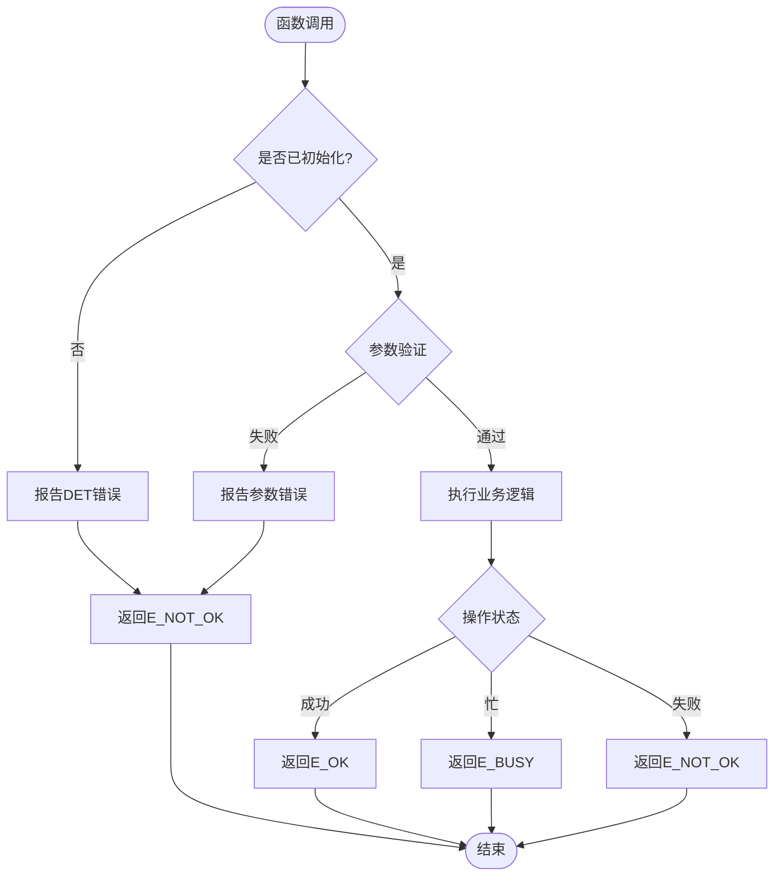
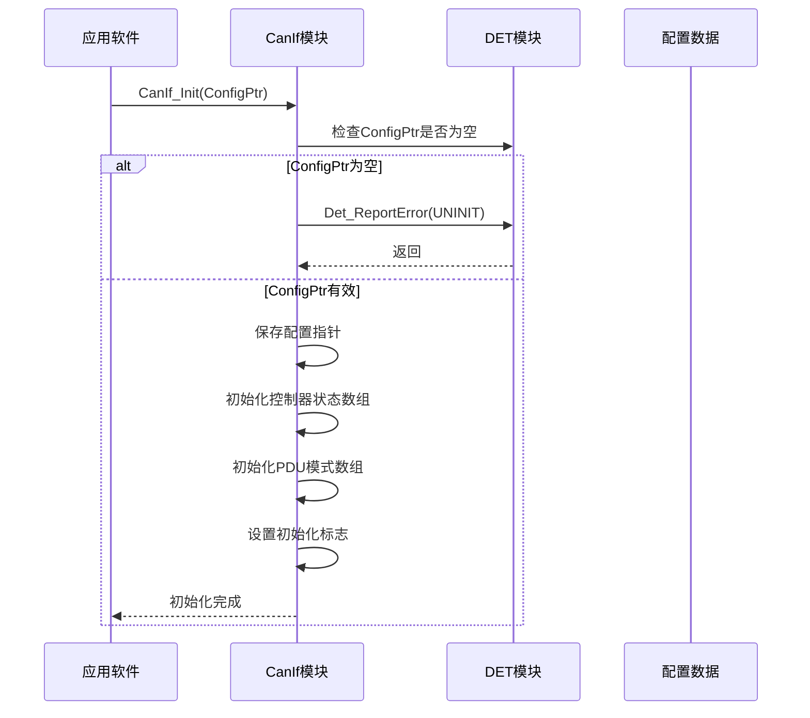
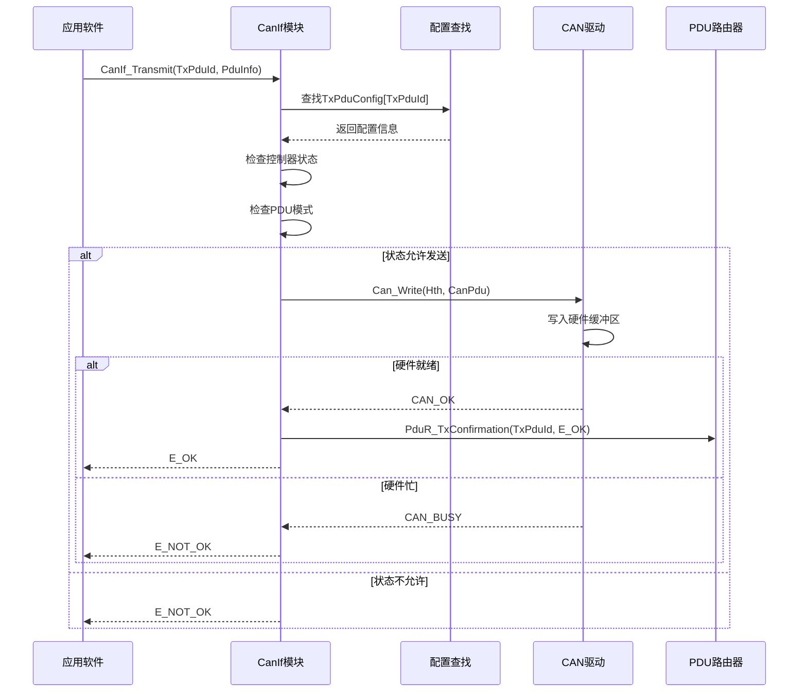
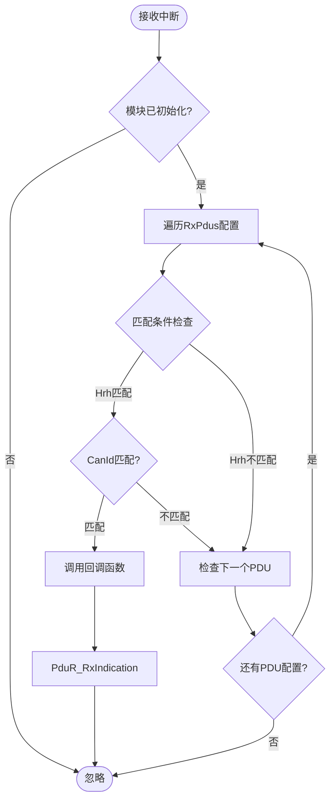
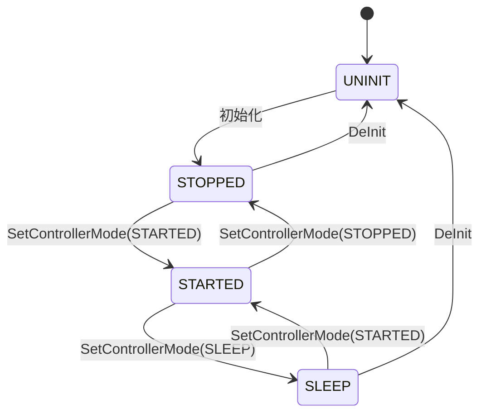
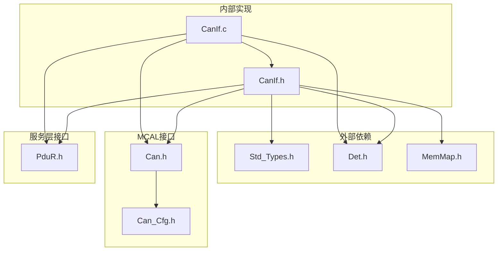

# CanIf CAN接口模块

<cite>
**本文档引用的文件**
- [CanIf.h](file://src/bsw/ecual/canif/include/CanIf.h)
- [CanIf_Cfg.h](file://src/bsw/ecual/canif/include/CanIf_Cfg.h)
- [CanIf.c](file://src/bsw/ecual/canif/src/CanIf.c)
- [Can.h](file://src/bsw/mcal/can/include/Can.h)
- [PduR.h](file://src/bsw/services/pdur/include/PduR.h)
- [Std_Types.h](file://src/bsw/common/Std_Types.h)
- [Det.h](file://src/bsw/common/Det.h)
- [MemMap.h](file://src/bsw/general/inc/MemMap.h)
- [Can_Cfg.h](file://generated/Can_Cfg.h)
- [main.c](file://examples/can_demo/main.c)
</cite>

## 目录
1. [简介](#简介)
2. [项目结构](#项目结构)
3. [核心组件](#核心组件)
4. [架构概览](#架构概览)
5. [详细组件分析](#详细组件分析)
6. [依赖关系分析](#依赖关系分析)
7. [性能考虑](#性能考虑)
8. [故障排除指南](#故障排除指南)
9. [结论](#结论)

## 简介

CanIf（Controller Area Network Interface）是AUTOSAR经典平台中的ECUAL（ECU抽象层）模块，位于MCAL（微控制器抽象层）之上，为上层应用软件提供统一的CAN通信抽象。该模块通过标准化的接口屏蔽了不同MCAL实现的差异，向上层应用提供一致的CAN通信服务。

CanIf模块的核心功能包括：
- 控制器模式管理：启动、停止、睡眠等模式控制
- PDU传输：标准化的数据单元传输接口
- 接收处理：数据接收和路由到上层模块
- 错误状态监控：错误检测和通知机制
- 动态ID设置：运行时修改发送消息ID
- 波特率配置：控制器波特率参数设置
- 收发器模式管理：物理层收发器状态控制

## 项目结构

CanIf模块位于BSW（基础软件）层次结构中，采用分层设计：



**图表来源**
- [CanIf.h:1-403](file://src/bsw/ecual/canif/include/CanIf.h#L1-L403)
- [Can.h:1-269](file://src/bsw/mcal/can/include/Can.h#L1-L269)

**章节来源**
- [CanIf.h:13-403](file://src/bsw/ecual/canif/include/CanIf.h#L13-L403)
- [CanIf_Cfg.h:1-84](file://src/bsw/ecual/canif/include/CanIf_Cfg.h#L1-L84)

## 核心组件

### 数据结构定义

CanIf模块定义了完整的配置和运行时数据结构：

#### 配置类型结构
- **CanIf_ConfigType**: 主配置结构，包含所有控制器、HRH/HTH、TX/RX PDU配置
- **CanIf_ControllerConfigType**: 控制器配置，包含波特率、默认模式、中断配置等
- **CanIf_TxPduConfigType**: 发送PDU配置，映射逻辑PDU到硬件资源
- **CanIf_RxPduConfigType**: 接收PDU配置，定义过滤规则和处理方式

#### 运行时状态结构
- **CanIf_ControllerModeType**: 控制器状态枚举（未初始化、睡眠、启动、停止）
- **CanIf_PduModeType**: PDU模式枚举（离线、仅发送离线、发送离线激活、在线）
- **CanIf_TransceiverModeType**: 收发器模式枚举（正常、待机、睡眠）

#### 回调函数类型
- **CanIf_TxConfirmationFncType**: 发送确认回调
- **CanIf_RxIndicationFncType**: 接收回调
- **CanIf_ControllerBusOffFncType**: 总线关闭回调
- **CanIf_ControllerModeIndicationFncType**: 模式变化回调

**章节来源**
- [CanIf.h:165-245](file://src/bsw/ecual/canif/include/CanIf.h#L165-L245)
- [CanIf.h:105-163](file://src/bsw/ecual/canif/include/CanIf.h#L105-L163)

### API函数接口

CanIf提供完整的AUTOSAR兼容API：

#### 初始化和配置
- `CanIf_Init()`: 初始化模块和配置
- `CanIf_DeInit()`: 反初始化模块
- `CanIf_GetVersionInfo()`: 获取版本信息

#### 控制器管理
- `CanIf_SetControllerMode()`: 设置控制器模式
- `CanIf_GetControllerMode()`: 获取控制器模式
- `CanIf_CheckWakeup()`: 检查唤醒事件

#### PDU传输管理
- `CanIf_Transmit()`: 发送PDU数据
- `CanIf_CancelTransmit()`: 取消发送请求
- `CanIf_SetPduMode()`: 设置PDU模式
- `CanIf_GetPduMode()`: 获取PDU模式

#### 动态配置
- `CanIf_SetDynamicTxId()`: 设置动态发送ID
- `CanIf_SetBaudrate()`: 设置波特率
- `CanIf_GetBaudrate()`: 获取波特率

#### 收发器管理
- `CanIf_SetTrcvMode()`: 设置收发器模式
- `CanIf_GetTrcvMode()`: 获取收发器模式
- `CanIf_GetTrcvWakeupReason()`: 获取唤醒原因
- `CanIf_SetTrcvWakeupMode()`: 设置唤醒模式

**章节来源**
- [CanIf.h:268-398](file://src/bsw/ecual/canif/include/CanIf.h#L268-L398)

## 架构概览

CanIf模块采用分层架构设计，实现了严格的职责分离：



**图表来源**
- [CanIf.c:142-185](file://src/bsw/ecual/canif/src/CanIf.c#L142-L185)
- [Can.h:231](file://src/bsw/mcal/can/include/Can.h#L231)

### 错误处理机制

CanIf实现了完整的错误检测和处理机制：



**图表来源**
- [CanIf.c:29-50](file://src/bsw/ecual/canif/src/CanIf.c#L29-L50)
- [Det.h:51-70](file://src/bsw/common/Det.h#L51-L70)

**章节来源**
- [CanIf.c:29-487](file://src/bsw/ecual/canif/src/CanIf.c#L29-L487)
- [Det.h:1-76](file://src/bsw/common/Det.h#L1-L76)

## 详细组件分析

### 初始化流程

CanIf的初始化过程确保了模块的正确配置和状态管理：



**图表来源**
- [CanIf.c:29-50](file://src/bsw/ecual/canif/src/CanIf.c#L29-L50)

#### 关键特性
- **参数验证**: 空指针检查和重复初始化保护
- **状态重置**: 所有控制器重置为停止状态
- **配置持久化**: 配置指针保存以便后续使用

**章节来源**
- [CanIf.c:29-50](file://src/bsw/ecual/canif/src/CanIf.c#L29-L50)

### 发送流程

CanIf的发送流程实现了完整的数据传输管道：



**图表来源**
- [CanIf.c:142-185](file://src/bsw/ecual/canif/src/CanIf.c#L142-L185)
- [PduR.h:261](file://src/bsw/services/pdur/include/PduR.h#L261)

#### 发送流程特点
- **配置映射**: 通过TxPduId查找对应的硬件资源配置
- **状态检查**: 确保控制器处于启动状态且PDU模式允许发送
- **硬件抽象**: 通过Can_Write接口与底层硬件交互
- **回调通知**: 发送完成后通过PDU路由器通知上层

**章节来源**
- [CanIf.c:142-185](file://src/bsw/ecual/canif/src/CanIf.c#L142-L185)

### 接收处理流程

CanIf的接收处理实现了智能的数据路由：



**图表来源**
- [CanIf.c:273-297](file://src/bsw/ecual/canif/src/CanIf.c#L273-L297)

#### 接收处理特性
- **智能匹配**: 基于硬件对象句柄和CAN ID进行精确匹配
- **回调机制**: 支持用户自定义接收回调函数
- **PDU路由**: 自动将接收到的数据路由到相应的上层模块

**章节来源**
- [CanIf.c:273-297](file://src/bsw/ecual/canif/src/CanIf.c#L273-L297)

### 控制器模式管理

CanIf提供了完整的控制器生命周期管理：



**图表来源**
- [CanIf.c:69-119](file://src/bsw/ecual/canif/src/CanIf.c#L69-L119)

#### 模式转换规则
- **UNINIT**: 模块未初始化状态
- **STOPPED**: 控制器停止状态，不参与总线通信
- **STARTED**: 控制器启动状态，正常参与总线通信
- **SLEEP**: 控制器睡眠状态，最低功耗模式

**章节来源**
- [CanIf.c:69-119](file://src/bsw/ecual/canif/src/CanIf.c#L69-L119)

### 配置结构详解

CanIf的配置系统支持灵活的运行时定制：

#### 预编译配置
- **CANIF_DEV_ERROR_DETECT**: 启用/禁用错误检测
- **CANIF_VERSION_INFO_API**: 版本信息API可用性
- **CANIF_DLC_CHECK**: 数据长度检查
- **CANIF_SOFTWARE_FILTER**: 软件过滤支持

#### 运行时配置
- **CANIF_NUM_CONTROLLERS**: 控制器数量
- **CANIF_NUM_TX_PDUS/CANIF_NUM_RX_PDUS**: PDU数量
- **CANIF_NUM_HRH/CANIF_NUM_HTH**: 硬件接收/发送句柄数量

#### 标识符定义
- **CANIF_CONTROLLER_0/1**: 控制器标识符
- **CANIF_TXPDU_* / CANIF_RXPDU_***: PDU标识符
- **CANIF_CANID_***: 标准/扩展CAN ID定义

**章节来源**
- [CanIf_Cfg.h:15-84](file://src/bsw/ecual/canif/include/CanIf_Cfg.h#L15-L84)

## 依赖关系分析

CanIf模块的依赖关系体现了AUTOSAR分层架构的设计原则：



**图表来源**
- [CanIf.h:18-22](file://src/bsw/ecual/canif/include/CanIf.h#L18-L22)
- [CanIf.c:9-14](file://src/bsw/ecual/canif/src/CanIf.c#L9-L14)

### 关键依赖关系

#### 标准类型依赖
- **Std_Types.h**: 提供基本数据类型定义
- **标准返回类型**: E_OK、E_NOT_OK、E_BUSY

#### 错误检测依赖
- **Det.h**: 开发错误追踪模块
- **错误码定义**: 完整的错误码枚举

#### MCAL接口依赖
- **Can.h**: CAN驱动接口
- **硬件抽象**: 通过Can_Write、Can_SetControllerMode等函数

#### 服务层依赖
- **PduR.h**: PDU路由器接口
- **回调机制**: 通过PduR_TxConfirmation、PduR_RxIndication

**章节来源**
- [CanIf.h:18-22](file://src/bsw/ecual/canif/include/CanIf.h#L18-L22)
- [CanIf.c:9-14](file://src/bsw/ecual/canif/src/CanIf.c#L9-L14)

## 性能考虑

### 内存使用优化

CanIf模块采用了多种内存优化技术：

#### 静态配置存储
- **配置常量**: 使用#define宏定义减少运行时内存占用
- **全局配置指针**: 避免重复复制配置数据

#### 运行时状态管理
- **状态数组**: 预分配固定大小的状态数组
- **索引访问**: 通过PDU ID直接访问配置，避免查找开销

#### 缓冲区管理
- **零拷贝设计**: 在可能的情况下避免数据复制
- **DMA支持**: 通过MCAL层支持直接内存访问

### 实时性能特性

#### 中断处理
- **快速路径**: 关键路径使用最小化的分支判断
- **延迟最小化**: 避免不必要的函数调用和内存访问

#### 调度考虑
- **周期性任务**: 支持主函数周期性调用
- **优先级处理**: 通过状态机避免阻塞操作

## 故障排除指南

### 常见错误诊断

#### 初始化相关错误
- **CANIF_E_UNINIT**: 在模块未初始化时调用API
- **CANIF_E_ALREADY_INITIALIZED**: 重复初始化尝试
- **CANIF_E_PARAM_POINTER**: 传入空配置指针

#### 参数验证错误
- **CANIF_E_PARAM_CONTROLLER**: 控制器ID超出范围
- **CANIF_E_PARAM_DLC**: 数据长度参数无效
- **CANIF_E_PARAM_POINTER**: 指针参数为空

#### 传输相关错误
- **CANIF_E_INVALID_TXPDUID**: 无效的发送PDU ID
- **CANIF_E_STOPPED**: 控制器处于停止状态
- **CANIF_E_NOT_SLEEP**: 控制器不在睡眠状态

### 调试建议

#### 启用错误检测
```c
// 在配置中启用开发错误检测
#define CANIF_DEV_ERROR_DETECT (STD_ON)
```

#### 日志记录
- **关键API调用**: 记录所有CanIf API调用及其参数
- **状态变化**: 跟踪控制器模式和PDU模式的变化
- **错误发生**: 记录所有错误检测事件

#### 调试工具
- **断点设置**: 在关键API入口和出口设置断点
- **变量监视**: 监视关键状态变量如CanIf_DriverInitialized
- **内存检查**: 验证配置指针的有效性和完整性

**章节来源**
- [CanIf.h:60-91](file://src/bsw/ecual/canif/include/CanIf.h#L60-L91)
- [CanIf.c:29-67](file://src/bsw/ecual/canif/src/CanIf.c#L29-L67)

## 结论

CanIf模块作为AUTOSAR经典平台中的重要组件，成功实现了MCAL之上的统一CAN通信抽象。通过标准化的接口设计、完善的错误处理机制和灵活的配置选项，该模块为上层应用提供了可靠、高效的CAN通信服务。

### 主要优势

1. **标准化接口**: 完全符合AUTOSAR规范，确保跨厂商兼容性
2. **模块化设计**: 清晰的职责分离，便于维护和扩展
3. **错误处理**: 全面的错误检测和处理机制
4. **性能优化**: 高效的内存使用和实时性能
5. **配置灵活性**: 支持多种配置变体和运行时调整

### 应用场景

CanIf模块适用于各种汽车电子应用场景：
- **发动机管理系统**: 实时发送和接收引擎状态数据
- **车身控制系统**: 车门、车窗、座椅等设备控制
- **诊断系统**: OBD-II诊断和故障码读取
- **网关应用**: 不同网络间的协议转换和数据路由

该模块为构建可靠的汽车电子系统奠定了坚实的基础，通过其标准化的设计和完善的实现，确保了系统的可维护性和可扩展性。