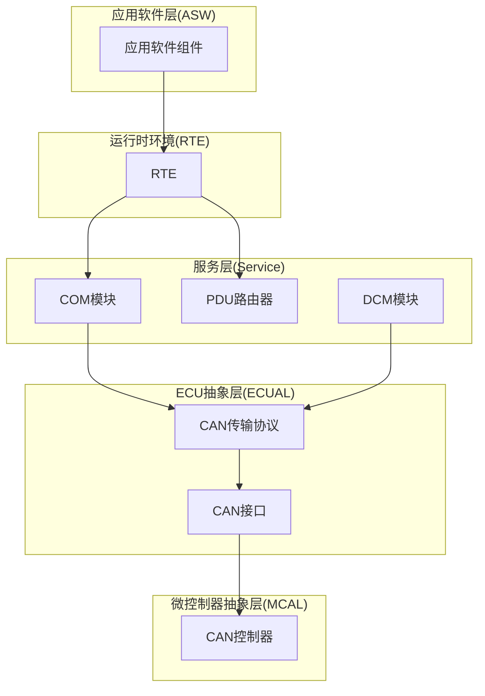
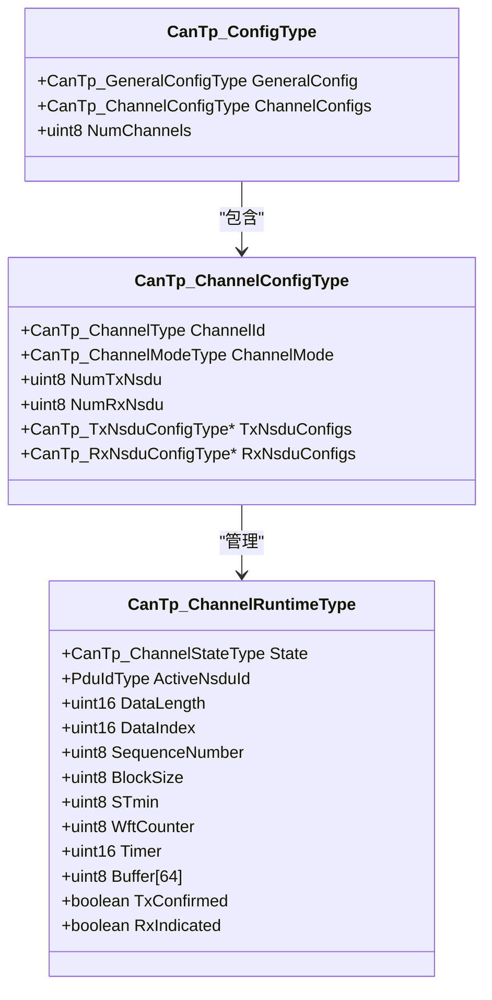
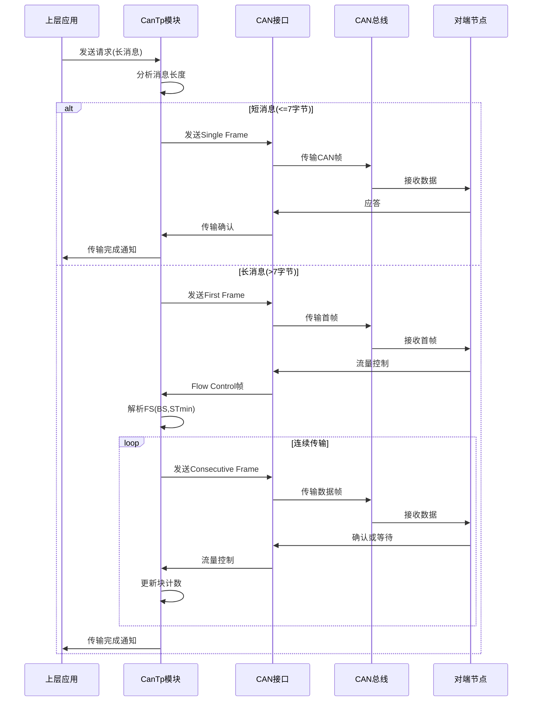
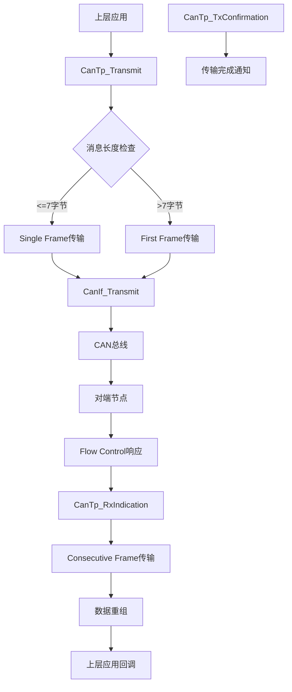
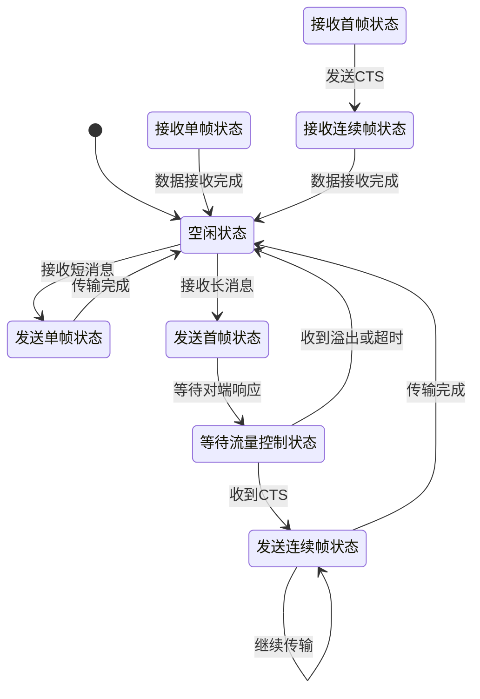
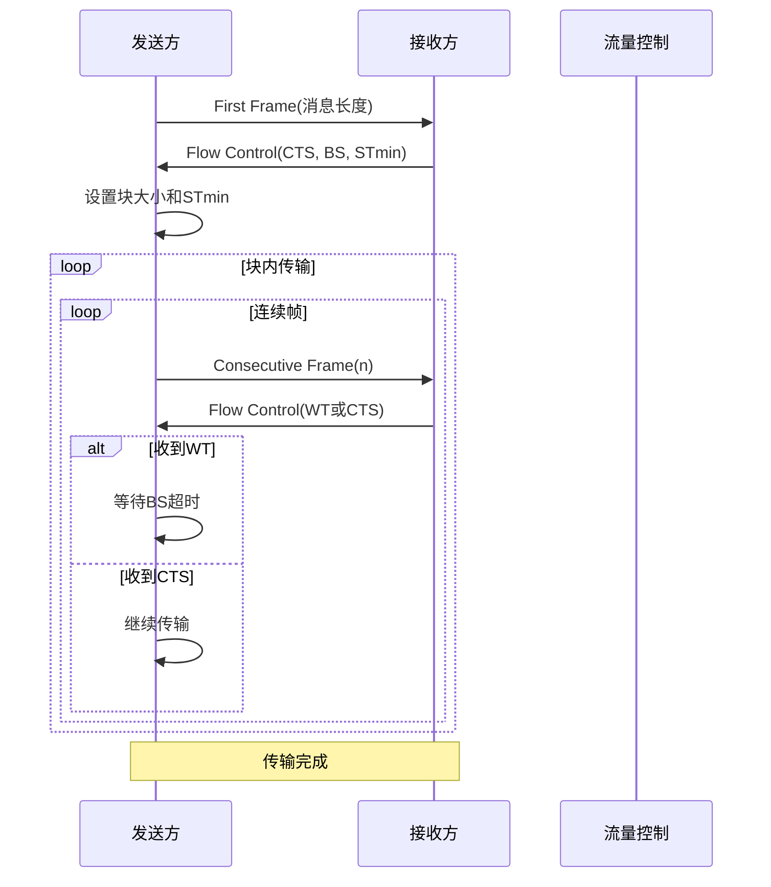
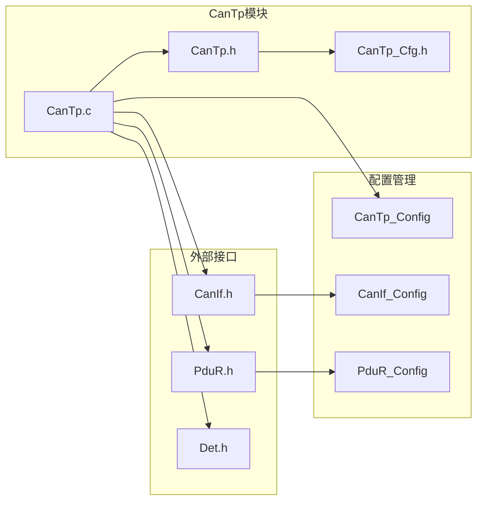

# CanTp CAN传输协议模块

<cite>
**本文档引用的文件**
- [CanTp.h](file://src/bsw/ecual/cantp/include/CanTp.h)
- [CanTp_Cfg.h](file://src/bsw/ecual/cantp/include/CanTp_Cfg.h)
- [CanTp.c](file://src/bsw/ecual/cantp/src/CanTp.c)
- [CanIf.h](file://src/bsw/ecual/canif/include/CanIf.h)
- [PduR.h](file://src/bsw/services/pdur/include/PduR.h)
- [integration_test.c](file://src/bsw/integration/tests/integration_test.c)
- [bsw_integration_verification.md](file://verification/bsw_integration_verification.md)
- [main.c](file://examples/can_demo/main.c)
</cite>

## 目录
1. [简介](#简介)
2. [项目结构](#项目结构)
3. [核心组件](#核心组件)
4. [架构概览](#架构概览)
5. [详细组件分析](#详细组件分析)
6. [依赖关系分析](#依赖关系分析)
7. [性能考虑](#性能考虑)
8. [故障排除指南](#故障排除指南)
9. [结论](#结论)
10. [附录](#附录)

## 简介

CanTp是基于AutoSAR Classic Platform 4.x标准实现的CAN传输协议模块，遵循ISO 15765-2标准，专门用于诊断和大数据传输。该模块提供了完整的长消息分段传输和重组功能，包括连接管理、流量控制和错误恢复机制。

CanTp模块位于ECU抽象层(ECUAL)，作为CAN接口层和上层服务之间的桥梁，实现了以下核心功能：

- **长消息传输**：支持最大4095字节的消息传输
- **多帧传输**：自动处理Single Frame、First Frame、Consecutive Frame和Flow Control Frame
- **流量控制**：实现基于块大小(Block Size)和最小分离时间(STmin)的流量控制
- **错误处理**：提供全面的错误检测和恢复机制
- **超时管理**：实现N_As、N_Bs、N_Cs、N_Ar、N_Br、N_Cr等超时机制

## 项目结构

CanTp模块在AutoSAR分层架构中的位置如下：



**图表来源**
- [CanTp.h:1-330](file://src/bsw/ecual/cantp/include/CanTp.h#L1-L330)
- [CanIf.h:1-403](file://src/bsw/ecual/canif/include/CanIf.h#L1-L403)
- [PduR.h:1-282](file://src/bsw/services/pdur/include/PduR.h#L1-L282)

**章节来源**
- [CanTp.h:1-330](file://src/bsw/ecual/cantp/include/CanTp.h#L1-L330)
- [CanTp_Cfg.h:1-95](file://src/bsw/ecual/cantp/include/CanTp_Cfg.h#L1-L95)

## 核心组件

### 数据结构设计

CanTp模块的核心数据结构包括通道运行时状态和配置结构：



**图表来源**
- [CanTp.h:32-232](file://src/bsw/ecual/cantp/include/CanTp.h#L32-L232)
- [CanTp.c:32-49](file://src/bsw/ecual/cantp/src/CanTp.c#L32-L49)

### 帧格式定义

CanTp实现了ISO 15765-2标准的四种帧类型：

| 帧类型 | PCI类型 | 数据载荷 | 最大长度 |
|--------|---------|----------|----------|
| Single Frame(SF) | 0x00 | 0-7字节 | 7字节 |
| First Frame(FF) | 0x10 | 0-6字节 | 6字节 |
| Consecutive Frame(CF) | 0x20 | 0-7字节 | 7字节 |
| Flow Control(FC) | 0x30 | 3字节 | 3字节 |

**章节来源**
- [CanTp.h:98-105](file://src/bsw/ecual/cantp/include/CanTp.h#L98-L105)
- [CanTp.c:51-63](file://src/bsw/ecual/cantp/src/CanTp.c#L51-L63)

## 架构概览

### 协议栈实现

CanTp模块采用分层架构设计，实现了完整的ISO 15765-2协议栈：



**图表来源**
- [CanTp.c:232-284](file://src/bsw/ecual/cantp/src/CanTp.c#L232-L284)
- [CanTp.c:417-569](file://src/bsw/ecual/cantp/src/CanTp.c#L417-L569)

### 数据流向

CanTp模块与上层组件的数据交互流程：



**图表来源**
- [CanTp.c:417-603](file://src/bsw/ecual/cantp/src/CanTp.c#L417-L603)

**章节来源**
- [CanTp.c:195-230](file://src/bsw/ecual/cantp/src/CanTp.c#L195-L230)
- [CanTp.c:417-603](file://src/bsw/ecual/cantp/src/CanTp.c#L417-L603)

## 详细组件分析

### 传输状态机

CanTp实现了完整的传输状态机，管理不同传输场景的状态转换：



**图表来源**
- [CanTp.c:19-29](file://src/bsw/ecual/cantp/src/CanTp.c#L19-L29)

### 超时处理机制

CanTp实现了六种不同的超时机制，确保协议的可靠性和实时性：

| 超时类型 | 触发条件 | 默认值(ms) | 处理动作 |
|----------|----------|------------|----------|
| N_As | 单帧传输确认超时 | 25 | 重置通道，报告超时错误 |
| N_Bs | 首帧发送后等待流量控制超时 | 75 | 重置通道，报告超时错误 |
| N_Cs | 连续帧发送间隔超时 | 25 | 重新发送当前连续帧 |
| N_Ar | 接收单帧超时 | 25 | 重置通道，报告超时错误 |
| N_Br | 首帧接收后等待数据超时 | 75 | 重置通道，报告超时错误 |
| N_Cr | 连续帧接收间隔超时 | 150 | 重置通道，报告超时错误 |

**章节来源**
- [CanTp_Cfg.h:52-59](file://src/bsw/ecual/cantp/include/CanTp_Cfg.h#L52-L59)
- [CanTp.c:624-652](file://src/bsw/ecual/cantp/src/CanTp.c#L624-L652)

### 流量控制实现

CanTp的流量控制机制基于ISO 15765-2标准，实现了完整的流量控制循环：



**图表来源**
- [CanTp.c:530-561](file://src/bsw/ecual/cantp/src/CanTp.c#L530-L561)

**章节来源**
- [CanTp.h:108-114](file://src/bsw/ecual/cantp/include/CanTp.h#L108-L114)
- [CanTp.c:95-115](file://src/bsw/ecual/cantp/src/CanTp.c#L95-L115)

### 错误处理机制

CanTp实现了全面的错误检测和处理机制，包括：

| 错误类型 | 错误码 | 触发条件 | 处理策略 |
|----------|--------|----------|----------|
| 参数错误 | CANTP_E_PARAM_* | 配置或参数无效 | DET报告错误，返回失败 |
| 初始化错误 | CANTP_E_UNINIT | 未初始化调用 | DET报告错误，返回失败 |
| 超时错误 | CANTP_E_*_TIMEOUT_* | 超时事件 | 重置通道，报告超时错误 |
| 协议错误 | CANTP_E_RX_* | 协议违规 | 重置通道，报告协议错误 |
| 帧格式错误 | CANTP_E_FRAME | 帧格式不正确 | 重置通道，报告帧错误 |

**章节来源**
- [CanTp.h:52-96](file://src/bsw/ecual/cantp/include/CanTp.h#L52-L96)
- [CanTp.c:197-202](file://src/bsw/ecual/cantp/src/CanTp.c#L197-L202)

## 依赖关系分析

### 组件耦合度

CanTp模块与其他组件的依赖关系：



**图表来源**
- [CanTp.c:9-13](file://src/bsw/ecual/cantp/src/CanTp.c#L9-L13)
- [CanTp.h:18-22](file://src/bsw/ecual/cantp/include/CanTp.h#L18-L22)

### 集成点分析

CanTp模块的关键集成点包括：

1. **CanIf接口**：负责底层CAN通信
2. **PduR接口**：负责上层PDU路由
3. **DET接口**：负责错误检测和报告
4. **配置接口**：支持动态参数修改

**章节来源**
- [CanTp.c:195-230](file://src/bsw/ecual/cantp/src/CanTp.c#L195-L230)
- [CanTp.h:248-327](file://src/bsw/ecual/cantp/include/CanTp.h#L248-L327)

## 性能考虑

### 缓冲区管理

CanTp模块采用了高效的缓冲区管理策略：

- **内部缓冲区**：每个通道维护64字节的临时缓冲区
- **动态分配**：支持运行时通道分配和释放
- **内存优化**：使用紧凑的数据结构减少内存占用

### 性能调优选项

| 参数 | 默认值 | 调优建议 | 影响范围 |
|------|--------|----------|----------|
| 主函数周期 | 5ms | 根据系统负载调整 | 超时精度和响应时间 |
| 块大小(BS) | 8 | 根据网络状况调整 | 传输吞吐量 |
| 最小分离时间(STmin) | 20ms | 根据总线负载调整 | 传输效率 |
| 等待帧超时(WFT_MAX) | 8 | 根据可靠性要求调整 | 错误恢复能力 |

### 并发处理

CanTp模块支持多通道并发处理，每个通道独立管理自己的状态和定时器，避免了通道间的相互影响。

## 故障排除指南

### 常见问题诊断

1. **传输超时问题**
   - 检查网络延迟和带宽
   - 调整超时参数设置
   - 验证对端设备响应

2. **流量控制异常**
   - 确认块大小设置合理
   - 检查STmin参数配置
   - 验证对端设备支持情况

3. **内存不足问题**
   - 检查通道数量配置
   - 优化缓冲区大小
   - 监控内存使用情况

### 调试建议

- 启用DET错误检测获取详细错误信息
- 使用集成测试验证功能完整性
- 监控通道状态变化
- 记录超时事件和错误日志

**章节来源**
- [CanTp.c:624-652](file://src/bsw/ecual/cantp/src/CanTp.c#L624-L652)
- [integration_test.c:631-695](file://src/bsw/integration/tests/integration_test.c#L631-L695)

## 结论

CanTp模块是一个功能完整、实现严谨的CAN传输协议实现，完全符合ISO 15765-2和AutoSAR标准要求。该模块具有以下特点：

1. **标准兼容性**：严格遵循ISO 15765-2和AutoSAR Classic Platform 4.x标准
2. **功能完整性**：实现了所有核心协议功能，包括长消息传输、流量控制、错误处理
3. **可配置性**：提供了丰富的配置选项，适应不同的应用场景
4. **可靠性**：实现了完善的错误检测和恢复机制
5. **性能优化**：采用了高效的内存管理和并发处理策略

该模块为上层应用提供了可靠的CAN传输服务，支持从简单诊断到复杂数据传输的各种应用场景。

## 附录

### 配置参数参考

| 参数类别 | 参数名称 | 默认值 | 说明 |
|----------|----------|--------|------|
| 通用配置 | DevErrorDetect | STD_ON | 错误检测开关 |
| 通用配置 | VersionInfoApi | STD_ON | 版本信息API |
| 通用配置 | CanTpPaddingByte | STD_ON | 填充字节开关 |
| 通用配置 | CanTpPaddingByteValue | 0xCC | 填充字节值 |
| 通用配置 | ChangeParameterApi | STD_ON | 参数修改API |
| 通用配置 | ReadParameterApi | STD_ON | 参数读取API |
| 通道配置 | MaxChannelCnt | 4 | 最大通道数 |
| 通道配置 | NumChannels | 2 | 实际通道数 |
| 超时配置 | NAS_DEFAULT | 25ms | N_As默认值 |
| 超时配置 | NBS_DEFAULT | 75ms | N_Bs默认值 |
| 超时配置 | NCS_DEFAULT | 25ms | N_Cs默认值 |
| 超时配置 | NAR_DEFAULT | 25ms | N_Ar默认值 |
| 超时配置 | NBR_DEFAULT | 75ms | N_Br默认值 |
| 超时配置 | NCR_DEFAULT | 150ms | N_Cr默认值 |
| 流量控制 | BS_DEFAULT | 8 | 默认块大小 |
| 流量控制 | STMIN_DEFAULT | 20ms | 默认STmin |
| 流量控制 | WFT_MAX_DEFAULT | 8 | 默认等待帧数 |
| 消息长度 | MaxMessageLength | 4095字节 | 最大消息长度 |

### 使用示例

以下是一个完整的使用示例，展示了如何建立连接、发送长消息和处理传输完成事件：

```c
// 初始化CanTp模块
void initialize_can_tp(void) {
    // 配置CanTp参数
    CanTp_Init(&CanTp_Config);
}

// 发送长消息
Std_ReturnType send_long_message(uint8* data, uint16 length) {
    PduInfoType pduInfo;
    pduInfo.SduDataPtr = data;
    pduInfo.SduLength = length;
    
    return CanTp_Transmit(CANTP_TX_DIAG_PHYSICAL, &pduInfo);
}

// 处理传输完成
void handle_transmission_complete(PduIdType pduId, Std_ReturnType result) {
    if (result == E_OK) {
        // 传输成功处理
    } else {
        // 传输失败处理
    }
}
```

**章节来源**
- [integration_test.c:631-695](file://src/bsw/integration/tests/integration_test.c#L631-L695)
- [bsw_integration_verification.md:1-193](file://verification/bsw_integration_verification.md#L1-L193)