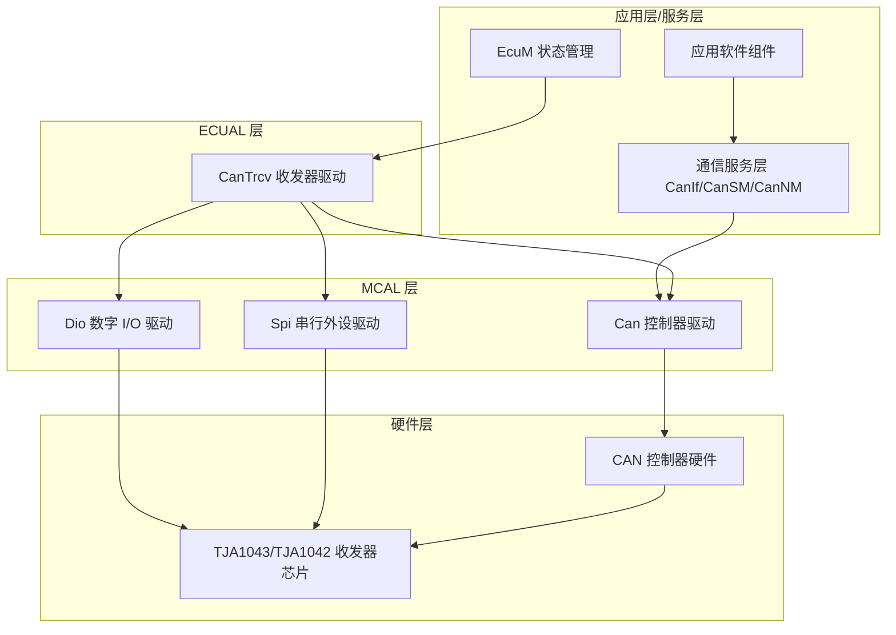
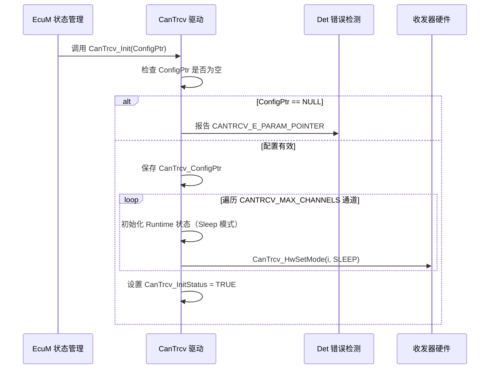
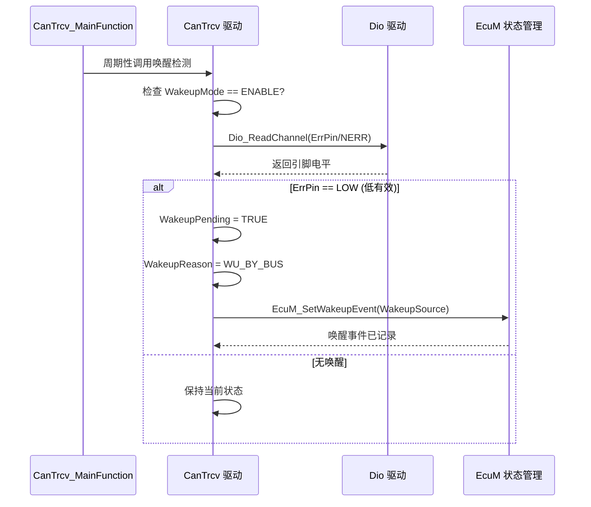

# CanTrcv（CAN收发器模块）

<cite>
**本文档引用的文件**
- [CanTrcv.h](file://src/bsw/ecual/cantrcv/include/CanTrcv.h)
- [CanTrcv_Cfg.h](file://src/bsw/ecual/cantrcv/include/CanTrcv_Cfg.h)
- [CanTrcv.c](file://src/bsw/ecual/cantrcv/src/CanTrcv.c)
- [CanTrcv_Lcfg.c](file://src/bsw/ecual/cantrcv/src/CanTrcv_Lcfg.c)
- [Det.h](file://src/bsw/services/det/include/Det.h)
- [Dio.h](file://src/bsw/mcal/dio/include/Dio.h)
- [EcuM.h](file://src/bsw/services/ecum/include/EcuM.h)
- [Std_Types.h](file://src/bsw/os/include/Std_Types.h)
</cite>

## 目录
1. [简介](#简介)
2. [项目结构](#项目结构)
3. [核心组件](#核心组件)
4. [架构概览](#架构概览)
5. [详细组件分析](#详细组件分析)
6. [依赖关系分析](#依赖关系分析)
7. [性能考虑](#性能考虑)
8. [故障排除指南](#故障排除指南)
9. [结论](#结论)
10. [附录](#附录)

## 简介

CanTrcv（CAN Transceiver Driver）是基于 AUTOSAR 4.4.0 标准开发的 ECU 抽象层（ECUAL）收发器驱动模块，负责管理 CAN 总线上物理层收发器的运行模式、唤醒检测和错误监控。该模块位于 MCAL 的 Can 控制器驱动之上、通信服务层（CanIf/CanSM/CanNM）之下，是连接 CAN 控制器与物理总线收发器芯片之间的软件桥梁。

本模块针对 NXP i.MX8M Mini 平台的典型车载收发器硬件（TJA1043、TJA1042、TLE6250、UJA1168 及通用收发器）实现，通过 DIO 引脚或 SPI 序列控制收发器的 Normal / Standby / Sleep 三种运行模式，并支持总线唤醒（Wakeup by Bus）和引脚唤醒（Wakeup by Pin）检测，向 EcuM 上报唤醒事件。

**章节来源**
- [CanTrcv.h:1-572](file://src/bsw/ecual/cantrcv/include/CanTrcv.h#L1-L572)
- [CanTrcv_Cfg.h:1-134](file://src/bsw/ecual/cantrcv/include/CanTrcv_Cfg.h#L1-L134)

## 项目结构

CanTrcv 模块源码位于 `src/bsw/ecual/cantrcv/`，由头文件、配置文件和实现文件三部分组成：

```
src/bsw/ecual/cantrcv/
├── include/
│   ├── CanTrcv.h              # 公共 API 与类型定义（AUTOSAR 4.4.0）
│   └── CanTrcv_Cfg.h          # 预编译配置（由 yuleASR Configurator 生成）
└── src/
    ├── CanTrcv.c              # 驱动实现（模式控制/唤醒检测/主函数）
    └── CanTrcv_Lcfg.c         # 链接时配置（通道配置表实例）
```



**图表来源**
- [CanTrcv.h:16-24](file://src/bsw/ecual/cantrcv/include/CanTrcv.h#L16-L24)
- [CanTrcv.c:8-16](file://src/bsw/ecual/cantrcv/src/CanTrcv.c#L8-L16)

**章节来源**
- [CanTrcv.h:1-30](file://src/bsw/ecual/cantrcv/include/CanTrcv.h#L1-L30)
- [CanTrcv_Cfg.h:1-40](file://src/bsw/ecual/cantrcv/include/CanTrcv_Cfg.h#L1-L40)

## 核心组件

CanTrcv 模块的核心组件包括以下关键部分：

### 数据类型定义
- **CanTrcv_TrcvModeType**: 收发器运行模式枚举，包含 Normal（全通信）、Standby（低功耗可唤醒）、Sleep（最低功耗可唤醒）三种模式
- **CanTrcv_TrcvWakeupReasonType**: 唤醒原因枚举，包括总线唤醒（WU_BY_BUS）、引脚唤醒（WU_BY_PIN）、内部唤醒（WU_INTERNALLY）、上电唤醒（WU_POWER_ON）等 8 种原因
- **CanTrcv_TrcvWakeupModeType**: 唤醒模式控制枚举，支持 Disable / Enable / Clear 三种设置
- **CanTrcv_HwType**: 收发器硬件类型枚举，支持 TJA1043、TJA1042、TLE6250、UJA1168 及通用类型
- **CanTrcv_PinType**: 控制引脚类型枚举，包括 STB、EN、NERR、WAK、INH 引脚
- **CanTrcv_TrcvStateType**: 通道运行时状态结构，跟踪当前模式、唤醒原因、模式转换定时器等

### 配置参数（CanTrcv_Cfg.h）
- **CANTRCV_NUM_CHANNELS**: 2 个收发器通道
- **CANTRCV_MAX_TRANSCEIVERS**: 最多支持 2 个收发器
- **CANTRCV_HARDWARE_TYPE**: 默认硬件类型 TJA1043
- **CANTRCV_MODE_TRANSITION_TIMEOUT_MS**: 模式转换超时 100ms
- **CANTRCV_MAIN_FUNCTION_PERIOD_MS**: 主函数周期 10ms
- **CANTRCV_CH0_STB_PIN / EN_PIN / NERR_PIN / WAK_PIN**: 通道 0 控制引脚 DIO_CHANNEL_10~13
- **CANTRCV_CH1_STB_PIN / EN_PIN / NERR_PIN / WAK_PIN**: 通道 1 控制引脚 DIO_CHANNEL_20~23
- **CANTRCV_CH0_WAKEUP_SOURCE**: ECUM_WKSOURCE_CAN，通道 1 为 ECUM_WKSOURCE_CAN1

### 功能特性
- 完整的 AUTOSAR CanTrcv 接口实现（10 个服务 ID）
- 多收发器通道独立管理
- DIO/SPI 双控制路径（SPI 默认关闭）
- 总线/引脚唤醒检测与 EcuM 集成
- 唤醒/错误通知回调机制

**章节来源**
- [CanTrcv.h:84-300](file://src/bsw/ecual/cantrcv/include/CanTrcv.h#L84-L300)
- [CanTrcv_Cfg.h:24-120](file://src/bsw/ecual/cantrcv/include/CanTrcv_Cfg.h#L24-L120)

## 架构概览

CanTrcv 采用"API 层 → 运行时管理层 → 硬件控制层"的分层实现架构：

```mermaid
graph TB
subgraph "公共 API 层"
INIT[CanTrcv_Init/DeInit]
OPMODE[CanTrcv_SetOpMode/GetOpMode]
WAKEUP[CanTrcv_SetWakeupMode/GetBusWuReason]
MAIN[CanTrcv_MainFunction]
CHECK[CanTrcv_CheckWakeup/CheckWakeupByTransceiver]
VER[CanTrcv_GetVersionInfo]
end
subgraph "运行时管理层"
RUNTIME[CanTrcv_Runtime 状态数组]
MODETRANS[模式转换跟踪]
WAKEUPPROC[唤醒事件处理]
end
subgraph "硬件控制层"
HWSET[CanTrcv_HwSetMode]
HWGET[CanTrcv_HwGetMode]
WUCHECK[CanTrcv_CheckWakeupInternal]
end
subgraph "硬件接口"
DIOIF[Dio_WriteChannel/Dio_ReadChannel]
ECUMIF[EcuM_SetWakeupEvent]
END
INIT --> RUNTIME
OPMODE --> MODETRANS
MODETRANS --> HWSET
HWSET --> DIOIF
HWGET --> DIOIF
WAKEUP --> WAKEUPPROC
WUCHECK --> ECUMIF
CHECK --> WUCHECK
MAIN --> WUCHECK
MAIN --> MODETRANS
```

**图表来源**
- [CanTrcv.c:27-121](file://src/bsw/ecual/cantrcv/src/CanTrcv.c#L27-L121)
- [CanTrcv.h:231-242](file://src/bsw/ecual/cantrcv/include/CanTrcv.h#L231-L242)

## 详细组件分析

### 初始化组件分析

CanTrcv_Init() 函数负责收发器驱动的整体初始化：



**图表来源**
- [CanTrcv.c:155-185](file://src/bsw/ecual/cantrcv/src/CanTrcv.c#L155-L185)

#### 初始化流程详解

1. **参数验证**: 检查配置指针有效性，无效则通过 Det_ReportError 报告 `CANTRCV_E_PARAM_POINTER`
2. **状态初始化**: 所有通道 Runtime 初始化为 Sleep 模式、唤醒模式 Enable、唤醒原因 NOT_SUPPORTED
3. **硬件就位**: 调用 `CanTrcv_HwSetMode()` 将所有收发器硬件置于 Sleep 模式，确保低功耗安全状态
4. **完成标记**: 设置模块初始化状态标志

**章节来源**
- [CanTrcv.c:155-185](file://src/bsw/ecual/cantrcv/src/CanTrcv.c#L155-L185)

### 模式控制组件分析

CanTrcv_SetOpMode() 实现收发器运行模式切换，通过 DIO 引脚组合控制：

```mermaid
flowchart TD
Start([CanTrcv_SetOpMode]) --> CheckInit{已初始化?}
CheckInit --> |否| Err1[报告 CANTRCV_E_UNINIT]
CheckInit --> |是| CheckCh{通道索引有效?}
CheckCh --> |否| Err2[报告 CANTRCV_E_INVALID_CHANNEL]
CheckCh --> |是| CheckMode{OpMode 合法?}
CheckMode --> |否| Err3[报告 CANTRCV_E_PARAM_TRCV_OPMODE]
CheckMode --> |是| HwSet[CanTrcv_HwSetMode 写 DIO 引脚]
HwSet --> Normal{目标模式?}
Normal --> |NORMAL| STB_H[STB 引脚置高/低(按反相), EN 置高]
Normal --> |STANDBY| STB_L[STB 置低/高, EN 保持高]
Normal --> |SLEEP| STB_L2[STB 置低/高, EN 置低]
STB_H --> Update[更新 Runtime.CurrentMode]
STB_L --> Update
STB_L2 --> Update
Update --> CheckNormal2{进入 NORMAL?}
CheckNormal2 --> |是| ClearWU[清除 WakeupPending/WakeupReason]
CheckNormal2 --> |否| Ret([返回 E_OK])
ClearWU --> Ret
```

**图表来源**
- [CanTrcv.c:123-151](file://src/bsw/ecual/cantrcv/src/CanTrcv.c#L123-L151)
- [CanTrcv.c:196-231](file://src/bsw/ecual/cantrcv/src/CanTrcv.c#L196-L231)

#### 模式控制特性

- **引脚组合控制**: 依据收发器硬件类型选择 DIO 或 SPI 控制路径
- **反相逻辑支持**: `StbPinInverted` 配置适配 TJA1043 等低有效 STB 引脚
- **无效引脚保护**: 通过 `DIO_INVALID_CHANNEL` 判断跳过未配置引脚
- **模式切换清唤醒**: 进入 Normal 模式时自动清除挂起唤醒事件

**章节来源**
- [CanTrcv.c:123-151](file://src/bsw/ecual/cantrcv/src/CanTrcv.c#L123-L151)
- [CanTrcv.c:196-231](file://src/bsw/ecual/cantrcv/src/CanTrcv.c#L196-L231)

### 唤醒检测组件分析

CanTrcv_CheckWakeupInternal() 实现总线唤醒检测，并通过 EcuM 上报：



**图表来源**
- [CanTrcv.c:109-122](file://src/bsw/ecual/cantrcv/src/CanTrcv.c#L109-L122)
- [CanTrcv.h:300-330](file://src/bsw/ecual/cantrcv/include/CanTrcv.h#L300-L330)

#### 唤醒检测特性

- **多源支持**: 总线唤醒（ERR 引脚电平检测）与引脚唤醒（WAK 引脚）双路径
- **EcuM 集成**: 通过 `EcuM_SetWakeupEvent()` 通知上层唤醒源
- **唤醒原因查询**: `CanTrcv_GetBusWuReason()` 供 EcuM/CanSM 查询唤醒原因
- **唤醒模式控制**: `CanTrcv_SetWakeupMode(CLEAR)` 可清除已检测唤醒事件

**章节来源**
- [CanTrcv.c:109-122](file://src/bsw/ecual/cantrcv/src/CanTrcv.c#L109-L122)
- [CanTrcv.h:118-130](file://src/bsw/ecual/cantrcv/include/CanTrcv.h#L118-L130)

### 主函数周期处理组件分析

CanTrcv_MainFunction() 提供周期性的维护处理：

- **唤醒轮询**: 在 WakeupByPolling 配置下周期检测总线唤醒
- **模式转换监控**: 跟踪模式转换是否超时（CANTRCV_MODE_TRANSITION_TIMEOUT_MS）
- **错误通知**: 检测到收发器错误时调用 `CanTrcv_ErrorNotification()`
- **通知回调**: 唤醒事件触发 `CanTrcv_WakeupNotification()` 回调

**章节来源**
- [CanTrcv_Cfg.h:30-34](file://src/bsw/ecual/cantrcv/include/CanTrcv_Cfg.h#L30-L34)
- [CanTrcv_Cfg.h:115-125](file://src/bsw/ecual/cantrcv/include/CanTrcv_Cfg.h#L115-L125)

## 依赖关系分析

CanTrcv 模块的依赖关系体现了 ECUAL 层对 MCAL 驱动的复用：

```mermaid
graph TB
subgraph "CanTrcv 内部"
CT_H[CanTrcv.h]
CT_CFG[CanTrcv_Cfg.h]
CT_C[CanTrcv.c]
CT_LCFG[CanTrcv_Lcfg.c]
end
subgraph "基础依赖"
STD[Std_Types.h]
DET[Det.h]
COMSTACK[ComStack_Types.h]
END
subgraph "硬件驱动依赖"
DIO[Dio.h / Dio 驱动]
SPI[Spi.h / Spi 驱动]
END
subgraph "上层集成"
ECUM[EcuM.h]
CANIF[CanIf / CanSM 上层]
END
CT_H --> STD
CT_H --> CT_CFG
CT_H --> COMSTACK
CT_H --> DIO
CT_C --> CT_H
CT_C --> DET
CT_C --> DIO
CT_C --> SPI
CT_LCFG --> CT_CFG
CT_CFG --> ECUM
CANIF --> CT_H
ECUM --> CT_H
```

**图表来源**
- [CanTrcv.c:8-16](file://src/bsw/ecual/cantrcv/src/CanTrcv.c#L8-L16)
- [CanTrcv.h:19-24](file://src/bsw/ecual/cantrcv/include/CanTrcv.h#L19-L24)

### 关键依赖关系

1. **标准类型依赖**: 依赖 Std_Types.h 提供的标准数据类型
2. **错误检测依赖**: 依赖 Det.h 实现开发期错误上报（DET）
3. **硬件控制依赖**: 依赖 Dio 驱动控制 STB/EN/NERR 引脚，Spi 驱动用于 SPI 收发器（默认关闭）
4. **唤醒集成依赖**: CANTRCV_WAKEUP_BY_BUS_USED 开启时依赖 EcuM.h 的唤醒源定义

**章节来源**
- [CanTrcv.c:8-16](file://src/bsw/ecual/cantrcv/src/CanTrcv.c#L8-L16)
- [CanTrcv.h:19-24](file://src/bsw/ecual/cantrcv/include/CanTrcv.h#L19-L24)

## 性能考虑

### 模式切换时序

收发器模式切换受硬件时序约束：

| 模式转换 | 延迟配置 | 说明 |
|---------|---------|------|
| Normal → Sleep | CANTRCV_SLEEP_MODE_DELAY_MS (5ms) | 需等待收发器进入低功耗 |
| Normal → Standby | CANTRCV_STANDBY_MODE_DELAY_MS (2ms) | 快速进入待机 |
| Standby → Normal | CANTRCV_NORMAL_MODE_DELAY_MS (2ms) | 恢复通信 |
| TJA1043 STB/EN 切换 | CANTRCV_TJA1043_STB_EN_DELAY_US (10us) | 引脚组合间隔 |

### 唤醒响应延迟

- **轮询模式**: 唤醒检测延迟取决于 `CANTRCV_MAIN_FUNCTION_PERIOD_MS`（默认 10ms）
- **中断模式**: 由 WAK 引脚中断驱动，响应更快但占用中断资源
- **去抖处理**: `DebounceCount` 配置用于抑制总线噪声误唤醒

### 资源占用

- 运行时状态数组：每通道 8 字节 × 2 通道
- 无动态内存分配，全部静态配置
- DIO 控制路径开销极低（引脚读写）

**章节来源**
- [CanTrcv_Cfg.h:35-45](file://src/bsw/ecual/cantrcv/include/CanTrcv_Cfg.h#L35-L45)
- [CanTrcv_Cfg.h:52-60](file://src/bsw/ecual/cantrcv/include/CanTrcv_Cfg.h#L52-L60)

## 故障排除指南

### 常见错误代码

CanTrcv 模块通过 DET 上报以下错误：

| 错误代码 | 错误含义 | 可能原因 | 解决方案 |
|---------|---------|---------|---------|
| CANTRCV_E_INVALID_TRANSCEIVER (0x01) | 收发器参数无效 | 通道号越界 | 检查 CANTRCV_MAX_TRANSCEIVERS 配置 |
| CANTRCV_E_PARAM_POINTER (0x02) | 指针参数无效 | 空指针传入 API | 检查调用参数 |
| CANTRCV_E_INVALID_TRCVMODE (0x03) | 模式参数无效 | OpMode 超出枚举范围 | 验证模式枚举值 |
| CANTRCV_E_INVALID_TRCV_WAKEUP_MODE (0x04) | 唤醒模式无效 | WakeupMode 非法 | 使用 WUMODE 枚举 |
| CANTRCV_E_INIT_FAILED (0x05) | 初始化失败 | 硬件配置错误 | 检查引脚/时钟配置 |
| CANTRCV_E_UNINIT (0x11) | 未初始化 | API 在 Init 前调用 | 检查初始化时序 |
| CANTRCV_E_INVALID_CONFIGURATION (0x07) | 配置无效 | 配置结构不完整 | 检查 Lcfg 配置表 |

### 调试建议

1. **引脚电平检查**: 使用示波器验证 STB/EN 引脚电平是否符合预期模式
2. **唤醒事件跟踪**: 检查 EcuM_SetWakeupEvent 是否被正确调用
3. **模式切换时序**: 确认模式切换延迟是否满足收发器数据手册要求
4. **DET 日志**: 开启 CANTRCV_DEV_ERROR_DETECT 后检查 Det_ReportError 输出

**章节来源**
- [CanTrcv.h:66-85](file://src/bsw/ecual/cantrcv/include/CanTrcv.h#L66-L85)
- [CanTrcv_Cfg.h:100-115](file://src/bsw/ecual/cantrcv/include/CanTrcv_Cfg.h#L100-L115)

## 结论

CanTrcv CAN收发器驱动模块是一个符合 AUTOSAR 4.4.0 标准、功能完整的 ECUAL 收发器抽象实现。它提供：

1. **完整的 AUTOSAR 接口**: 覆盖初始化、模式控制、唤醒管理、版本信息等 10 个服务
2. **多硬件适配**: 支持 TJA1043/TJA1042/TLE6250/UJA1168 等主流收发器芯片
3. **灵活的引脚控制**: DIO 引脚组合 + SPI 序列双路径，适配不同硬件拓扑
4. **完善的唤醒管理**: 总线/引脚唤醒检测与 EcuM 深度集成
5. **可配置性**: 预编译宏（yuleASR Configurator 生成）提供高度可裁剪配置

该模块为上层 CanIf/CanSM 提供了透明的收发器抽象，是 CAN 网络低功耗管理和唤醒机制的关键 ECUAL 组件。

## 附录

### 典型配置示例

以下为 CanTrcv_Lcfg.c 中的通道配置示例：

```c
/* 通道 0 配置：TJA1043，DIO 控制，总线唤醒 */
const CanTrcv_ChannelConfigType CanTrcv_Channels[CANTRCV_NUM_CHANNELS] = {
    {
        .ChannelId = 0U,
        .TransceiverType = CANTRCV_TJA1043,
        .PinConfig = {
            .StbPin = DIO_CHANNEL_10,
            .EnPin  = DIO_CHANNEL_11,
            .ErrPin = DIO_CHANNEL_12,
            .StbPinInverted = TRUE   /* TJA1043 STB 低有效 */
        },
        .UsesSpi = FALSE,
        .WakeupByBus = TRUE,
        .WakeupByPin = TRUE,
        .WakeupSource = ECUM_WKSOURCE_CAN,
        .ModeTransitionDelay = 2U,
        .DebounceCount = 3U
    },
    /* 通道 1 配置略 */
};

const CanTrcv_GeneralConfigType CanTrcv_GeneralConfig = {
    .MaxChannels = CANTRCV_MAX_CHANNELS,
    .DevErrorDetect = STD_ON,
    .VersionInfoApi = STD_ON,
    .WakeupByPolling = TRUE,
    .MainFunctionPeriod = CANTRCV_MAIN_FUNCTION_PERIOD_MS
};

const CanTrcv_ConfigType CanTrcv_Lcfg = {
    .GeneralConfig = &CanTrcv_GeneralConfig,
    .ChannelConfig = CanTrcv_Channels,
    .numChannels = CANTRCV_NUM_CHANNELS
};
```

### 与 CanSM 的协作流程

1. CanSM 通过 `CanTrcv_SetOpMode()` 在通信开启/关闭时切换收发器模式
2. 总线休眠时 CanSM 请求 Sleep 模式，收发器进入最低功耗
3. 总线活动触发唤醒，`CanTrcv_MainFunction()` 检测后经 EcuM 唤醒源上报
4. 唤醒确认后 CanSM 恢复 Normal 模式，通信重新建立

**章节来源**
- [CanTrcv_Lcfg.c:1-261](file://src/bsw/ecual/cantrcv/src/CanTrcv_Lcfg.c#L1-L261)
- [CanTrcv.h:250-310](file://src/bsw/ecual/cantrcv/include/CanTrcv.h#L250-L310)
