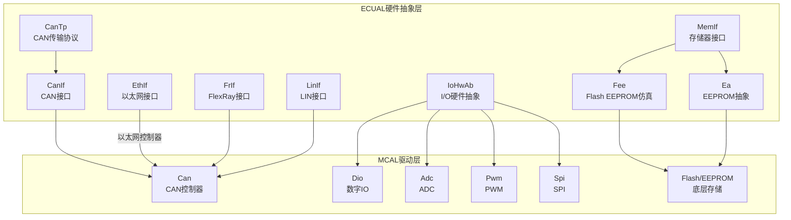
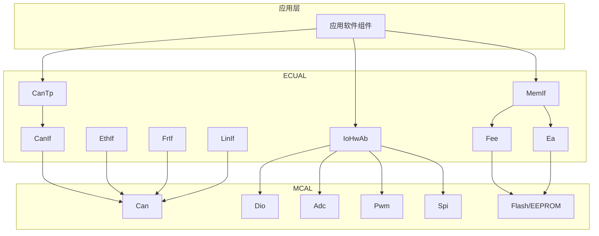
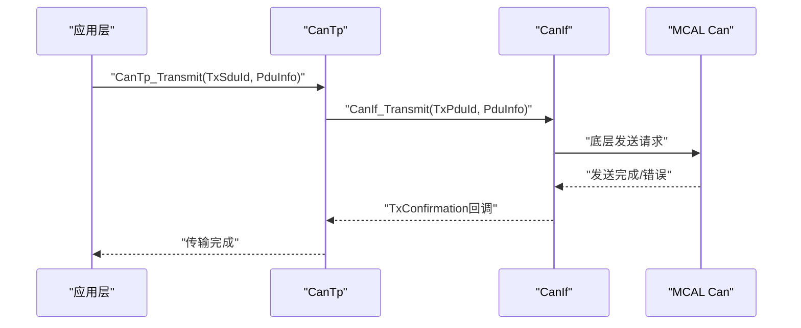
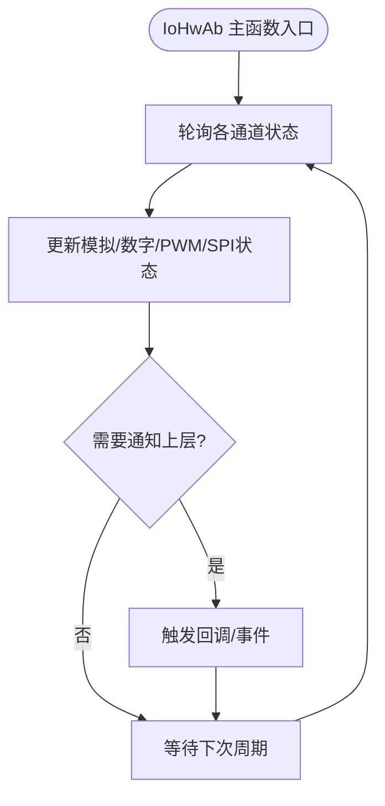
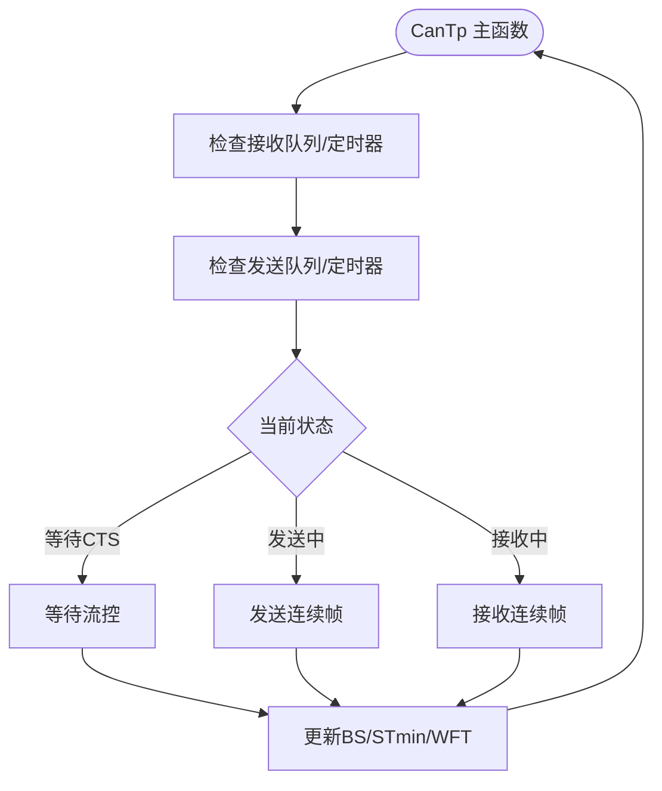
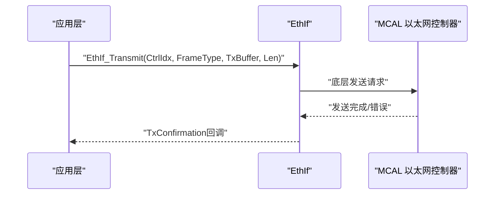
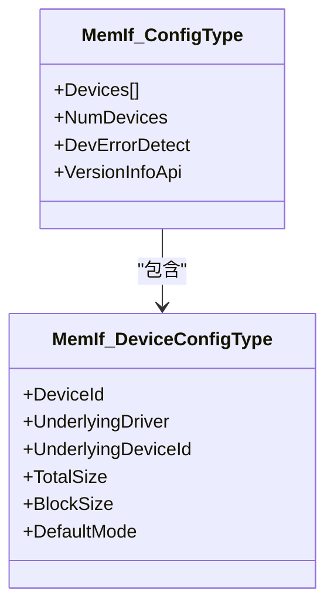
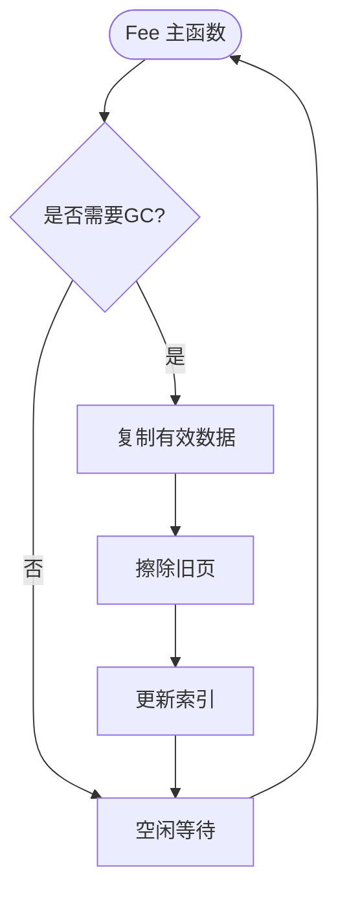
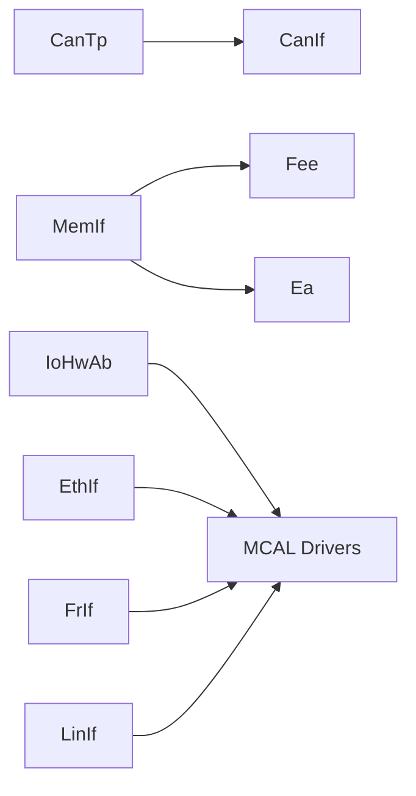

# ECUAL硬件抽象接口层

<cite>
**本文档引用的文件**
- [CanIf.h](file://src/bsw/ecual/canif/include/CanIf.h)
- [CanIf_Cfg.h](file://src/bsw/ecual/canif/include/CanIf_Cfg.h)
- [IoHwAb.h](file://src/bsw/ecual/iohwab/include/IoHwAb.h)
- [IoHwAb_Cfg.h](file://src/bsw/ecual/iohwab/include/IoHwAb_Cfg.h)
- [CanTp.h](file://src/bsw/ecual/cantp/include/CanTp.h)
- [CanTp_Cfg.h](file://src/bsw/ecual/cantp/include/CanTp_Cfg.h)
- [EthIf.h](file://src/bsw/ecual/ethif/include/EthIf.h)
- [EthIf_Cfg.h](file://src/bsw/ecual/ethif/include/EthIf_Cfg.h)
- [MemIf.h](file://src/bsw/ecual/memif/include/MemIf.h)
- [MemIf_Cfg.h](file://src/bsw/ecual/memif/include/MemIf_Cfg.h)
- [Fee.h](file://src/bsw/ecual/fee/include/Fee.h)
- [Fee_Cfg.h](file://src/bsw/ecual/fee/include/Fee_Cfg.h)
- [Ea.h](file://src/bsw/ecual/ea/include/Ea.h)
- [Ea_Cfg.h](file://src/bsw/ecual/ea/include/Ea_Cfg.h)
- [FrIf.h](file://src/bsw/ecual/frif/include/FrIf.h)
- [FrIf_Cfg.h](file://src/bsw/ecual/frif/include/FrIf_Cfg.h)
- [LinIf.h](file://src/bsw/ecual/linif/include/LinIf.h)
- [LinIf_Cfg.h](file://src/bsw/ecual/linif/include/LinIf_Cfg.h)
</cite>

## 目录
1. [引言](#引言)
2. [项目结构](#项目结构)
3. [核心组件](#核心组件)
4. [架构总览](#架构总览)
5. [详细组件分析](#详细组件分析)
6. [依赖关系分析](#依赖关系分析)
7. [性能考虑](#性能考虑)
8. [故障排除指南](#故障排除指南)
9. [结论](#结论)

## 引言
本文件面向ECUAL（ECU抽象层）硬件抽象接口层，系统化阐述9个关键模块如何在MCAL之上提供统一的硬件抽象接口，屏蔽底层差异，简化上层软件开发并提升系统可移植性。内容覆盖以下模块：
- CanIf：CAN接口
- IoHwAb：I/O硬件抽象
- CanTp：CAN传输协议（ISO 15765-2）
- EthIf：以太网接口
- MemIf：存储器接口
- Fee：Flash EEPROM仿真
- Ea：EEPROM抽象
- FrIf：FlexRay接口
- LinIf：LIN接口

文档从架构设计、数据流与处理逻辑、配置管理、缓冲区与协议处理机制、接口契约与回调、错误处理策略等维度进行深入解析，并通过图示帮助读者建立整体认知。

## 项目结构
ECUAL位于src/bsw/ecual目录下，按功能域划分子模块，每个模块包含公共头文件与实现源码，遵循AutoSAR Classic Platform 4.x标准。各模块均提供独立的配置头文件，用于编译期参数控制与运行时配置指针。

**图表来源**
- [CanIf.h:13-403](file://src/bsw/ecual/canif/include/CanIf.h#L13-L403)
- [IoHwAb.h:13-263](file://src/bsw/ecual/iohwab/include/IoHwAb.h#L13-L263)
- [CanTp.h:14-330](file://src/bsw/ecual/cantp/include/CanTp.h#L14-L330)
- [EthIf.h:13-367](file://src/bsw/ecual/ethif/include/EthIf.h#L13-L367)
- [MemIf.h:14-232](file://src/bsw/ecual/memif/include/MemIf.h#L14-L232)
- [Fee.h:14-273](file://src/bsw/ecual/fee/include/Fee.h#L14-L273)
- [Ea.h:14-242](file://src/bsw/ecual/ea/include/Ea.h#L14-L242)
- [FrIf.h:13-367](file://src/bsw/ecual/frif/include/FrIf.h#L13-L367)
- [LinIf.h:13-305](file://src/bsw/ecual/linif/include/LinIf.h#L13-L305)

**章节来源**
- [CanIf.h:13-403](file://src/bsw/ecual/canif/include/CanIf.h#L13-L403)
- [IoHwAb.h:13-263](file://src/bsw/ecual/iohwab/include/IoHwAb.h#L13-L263)
- [CanTp.h:14-330](file://src/bsw/ecual/cantp/include/CanTp.h#L14-L330)
- [EthIf.h:13-367](file://src/bsw/ecual/ethif/include/EthIf.h#L13-L367)
- [MemIf.h:14-232](file://src/bsw/ecual/memif/include/MemIf.h#L14-L232)
- [Fee.h:14-273](file://src/bsw/ecual/fee/include/Fee.h#L14-L273)
- [Ea.h:14-242](file://src/bsw/ecual/ea/include/Ea.h#L14-L242)
- [FrIf.h:13-367](file://src/bsw/ecual/frif/include/FrIf.h#L13-L367)
- [LinIf.h:13-305](file://src/bsw/ecual/linif/include/LinIf.h#L13-L305)

## 核心组件
本节概述9个ECUAL模块的核心职责、主要数据结构与对外接口要点，便于快速定位与理解。

- CanIf（CAN接口）
  - 职责：向上层提供统一的CAN通信接口，支持控制器模式、收发PDU、动态ID设置、收发器模式与唤醒管理。
  - 关键类型：控制器模式、PDU模式、收发器模式、唤醒原因等；配置包含控制器、HRH/HTH映射、收发PDU定义。
  - 接口：初始化、设置/获取控制器模式、发送/取消发送、设置/获取PDU模式、动态ID设置、收发器控制、波特率设置等。
  
  **章节来源**
  - [CanIf.h:95-245](file://src/bsw/ecual/canif/include/CanIf.h#L95-L245)
  - [CanIf_Cfg.h:14-84](file://src/bsw/ecual/canif/include/CanIf_Cfg.h#L14-L84)

- IoHwAb（I/O硬件抽象）
  - 职责：统一模拟量、数字量、PWM、SPI等I/O通道访问，屏蔽底层MCAL差异。
  - 关键类型：模拟/数字/PWM/SPI通道配置；返回值类型；主函数周期。
  - 接口：初始化/去初始化、模拟读写、数字读写、PWM设置、SPI传输、版本信息、主函数。

  **章节来源**
  - [IoHwAb.h:68-171](file://src/bsw/ecual/iohwab/include/IoHwAb.h#L68-L171)
  - [IoHwAb_Cfg.h:14-102](file://src/bsw/ecual/iohwab/include/IoHwAb_Cfg.h#L14-L102)

- CanTp（CAN传输协议）
  - 职责：实现ISO 15765-2诊断与大数据传输，提供分段/流控、超时与错误处理。
  - 关键类型：帧类型、流控状态、寻址格式、TA类型、通道模式；NSDU配置、通道配置、通用配置。
  - 接口：初始化/关闭、发送/取消发送/接收、参数变更/读取、版本信息、主函数、Rx/Tx回调。

  **章节来源**
  - [CanTp.h:98-232](file://src/bsw/ecual/cantp/include/CanTp.h#L98-L232)
  - [CanTp_Cfg.h:14-95](file://src/bsw/ecual/cantp/include/CanTp_Cfg.h#L14-L95)

- EthIf（以太网接口）
  - 职责：提供以太网控制器、物理地址、VLAN、时间戳、端口组模式等抽象。
  - 关键类型：MAC地址、速度/双工、链路状态、时间戳质量、收发器唤醒模式；控制器/VLAN/帧所有者配置。
  - 接口：初始化/控制器初始化、设置/获取控制器模式、物理地址读写、帧发送、时间戳获取、版本信息、主函数、Rx/Tx回调。

  **章节来源**
  - [EthIf.h:93-215](file://src/bsw/ecual/ethif/include/EthIf.h#L93-L215)
  - [EthIf_Cfg.h:14-92](file://src/bsw/ecual/ethif/include/EthIf_Cfg.h#L14-L92)

- MemIf（存储器接口）
  - 职责：统一抽象EEPROM/Flash设备，向上层屏蔽底层差异，提供块级读写与擦除。
  - 关键类型：设备配置（含底层驱动选择）、状态/作业结果、模式、地址/长度类型。
  - 接口：初始化、读/写/取消、状态/作业结果查询、块失效/立即擦除、版本信息、设置模式。

  **章节来源**
  - [MemIf.h:58-126](file://src/bsw/ecual/memif/include/MemIf.h#L58-L126)
  - [MemIf_Cfg.h:14-61](file://src/bsw/ecual/memif/include/MemIf_Cfg.h#L14-L61)

- Fee（Flash EEPROM仿真）
  - 职责：使用Flash实现EEPROM语义，提供垃圾回收、CRC校验、写周期计数等。
  - 关键类型：块配置、状态/作业结果、模式；配置包含扇区、虚拟页、最大GC/擦除/写周期等。
  - 接口：初始化、设置模式、读/写/取消、状态/作业结果、块失效/立即擦除、作业完成/错误通知、版本信息、周期计数、主函数。

  **章节来源**
  - [Fee.h:79-147](file://src/bsw/ecual/fee/include/Fee.h#L79-L147)
  - [Fee_Cfg.h:14-82](file://src/bsw/ecual/fee/include/Fee_Cfg.h#L14-L82)

- Ea（EEPROM抽象）
  - 职责：抽象底层EEPROM驱动，提供块级读写、CRC校验、擦除周期统计。
  - 关键类型：块配置、状态/作业结果、模式；配置包含扇区、索引大小、写周期等。
  - 接口：初始化、设置模式、读/写/取消、状态/作业结果、块失效/立即擦除、作业完成/错误通知、版本信息、擦除周期、主函数。

  **章节来源**
  - [Ea.h:68-128](file://src/bsw/ecual/ea/include/Ea.h#L68-L128)
  - [Ea_Cfg.h:14-77](file://src/bsw/ecual/ea/include/Ea_Cfg.h#L14-L77)

- FrIf（FlexRay接口）
  - 职责：提供FlexRay控制器、通道、唤醒、冷启动、全局时间等抽象。
  - 关键类型：控制器模式、收发器模式、唤醒模式/原因、POC状态、全局时间；LPDU配置。
  - 接口：初始化/控制器初始化、绝对/相对定时器设置/取消、发送、POC状态/全局时间、允许冷启动/停止通信、发送唤醒、版本信息、主函数。

  **章节来源**
  - [FrIf.h:97-217](file://src/bsw/ecual/frif/include/FrIf.h#L97-L217)
  - [FrIf_Cfg.h:14-93](file://src/bsw/ecual/frif/include/FrIf_Cfg.h#L14-L93)

- LinIf（LIN接口）
  - 职责：提供LIN总线通道、调度表、唤醒、收发器模式等抽象。
  - 关键类型：状态/通道状态、收发器模式、调度类型；通道/PDU/调度配置。
  - 接口：初始化/通道初始化、发送、调度请求、睡眠/唤醒、收发器模式设置/获取、唤醒检查/启用/禁用、取消发送、版本信息、主函数、唤醒确认回调。

  **章节来源**
  - [LinIf.h:80-178](file://src/bsw/ecual/linif/include/LinIf.h#L80-L178)
  - [LinIf_Cfg.h:14-105](file://src/bsw/ecual/linif/include/LinIf_Cfg.h#L14-L105)

## 架构总览
ECUAL通过“统一接口 + 配置驱动”的方式，在MCAL之上构建稳定抽象层。各模块间存在如下典型交互：
- CanTp依赖CanIf进行底层CAN收发；
- MemIf作为上层存储抽象，内部可桥接Fee或Ea；
- IoHwAb聚合多个MCAL外设（Dio/Adc/Pwm/Spi）；
- EthIf/FrIf/LinIf分别对接不同物理总线控制器。

**图表来源**
- [CanTp.h:246-324](file://src/bsw/ecual/cantp/include/CanTp.h#L246-L324)
- [CanIf.h:268-400](file://src/bsw/ecual/canif/include/CanIf.h#L268-L400)
- [IoHwAb.h:173-260](file://src/bsw/ecual/iohwab/include/IoHwAb.h#L173-L260)
- [MemIf.h:139-229](file://src/bsw/ecual/memif/include/MemIf.h#L139-L229)
- [Fee.h:161-270](file://src/bsw/ecual/fee/include/Fee.h#L161-L270)
- [Ea.h:141-239](file://src/bsw/ecual/ea/include/Ea.h#L141-L239)
- [EthIf.h:228-364](file://src/bsw/ecual/ethif/include/EthIf.h#L228-L364)
- [FrIf.h:231-364](file://src/bsw/ecual/frif/include/FrIf.h#L231-L364)
- [LinIf.h:191-303](file://src/bsw/ecual/linif/include/LinIf.h#L191-L303)

## 详细组件分析

### CanIf（CAN接口）分析
- 配置管理
  - 支持编译期开关：错误检测、版本信息API、DLC检查、软件过滤等。
  - 运行时配置：控制器数量、HRH/HTH数量、收发PDU数量、收发器数量、默认波特率、主函数周期。
- 缓冲区与协议处理
  - 通过HRH/HTH句柄映射到具体控制器，结合PDU配置实现灵活的收发路径。
  - 支持动态TX ID设置、PDU模式（离线/在线）、收发器模式与唤醒管理。
- 接口契约与回调
  - 对外提供初始化、控制器/收发器模式控制、发送/取消发送、PDU模式、动态ID、波特率、唤醒检查等。
  - 回调包括控制器总线断开、控制器模式指示、收发确认等。
- 错误处理
  - DET错误码覆盖参数、未初始化、停止状态、无效ID、数据长度不匹配等场景。

**图表来源**
- [CanTp.h:267-324](file://src/bsw/ecual/cantp/include/CanTp.h#L267-L324)
- [CanIf.h:304-312](file://src/bsw/ecual/canif/include/CanIf.h#L304-L312)

**章节来源**
- [CanIf.h:168-245](file://src/bsw/ecual/canif/include/CanIf.h#L168-L245)
- [CanIf_Cfg.h:14-84](file://src/bsw/ecual/canif/include/CanIf_Cfg.h#L14-L84)

### IoHwAb（I/O硬件抽象）分析
- 配置管理
  - 统一通道定义：模拟量、数字量、PWM、SPI设备数量与映射。
  - ADC分辨率、PWM占空比缩放、主函数周期等参数。
- 缓冲区与协议处理
  - 模拟通道提供标度因子与偏移，数字通道支持反相配置，PWM支持默认周期与占空比。
  - SPI设备配置包含序列、片选引脚与波特率。
- 接口契约与回调
  - 提供模拟/数字读写、PWM设置、SPI传输、版本信息、主函数等接口。
- 错误处理
  - DET错误码覆盖指针、通道、数值、未初始化、忙、超时等。

**图表来源**
- [IoHwAb.h:254-257](file://src/bsw/ecual/iohwab/include/IoHwAb.h#L254-L257)

**章节来源**
- [IoHwAb.h:87-171](file://src/bsw/ecual/iohwab/include/IoHwAb.h#L87-L171)
- [IoHwAb_Cfg.h:14-102](file://src/bsw/ecual/iohwab/include/IoHwAb_Cfg.h#L14-L102)

### CanTp（CAN传输协议）分析
- 配置管理
  - 通道数量、NSDU数量、动态通道分配、填充字节、参数读写API等。
  - 默认超时（N_As/N_Bs/N_Cs/N_Ar/N_Br/N_Cr）、流控参数（BS、STmin、WFT_MAX）、最大消息长度。
- 缓冲区与协议处理
  - 单帧/首帧/连续帧/流控帧状态机，支持填充字节与校验。
  - 支持物理/功能寻址、混合寻址等。
- 接口契约与回调
  - 发送/取消发送/接收、参数变更/读取、版本信息、主函数、Rx/Tx回调。
- 错误处理
  - 运行时错误码覆盖COM、超时、SN/FS非法、溢出、填充异常、帧错误等。

**图表来源**
- [CanTp.h:308-311](file://src/bsw/ecual/cantp/include/CanTp.h#L308-L311)
- [CanTp_Cfg.h:52-84](file://src/bsw/ecual/cantp/include/CanTp_Cfg.h#L52-L84)

**章节来源**
- [CanTp.h:161-232](file://src/bsw/ecual/cantp/include/CanTp.h#L161-L232)
- [CanTp_Cfg.h:14-95](file://src/bsw/ecual/cantp/include/CanTp_Cfg.h#L14-L95)

### EthIf（以太网接口）分析
- 配置管理
  - 控制器数量、帧所有者数量、VLAN数量、默认MAC地址、MTU、时间同步与TSN支持。
- 缓冲区与协议处理
  - 支持多控制器、多VLAN、多帧类型（IPv4/IPv6/ARP/VLAN/SOME/IP/TSN）。
  - 时间戳获取（入站/出站），端口组模式切换。
- 接口契约与回调
  - 控制器初始化/模式、物理地址读写、帧发送、时间戳获取、版本信息、主函数、Rx/Tx回调。
- 错误处理
  - 参数合法性、控制器/收发器索引、模式、MAC地址、帧类型/ID、优先级等错误码。

**图表来源**
- [EthIf.h:284-361](file://src/bsw/ecual/ethif/include/EthIf.h#L284-L361)

**章节来源**
- [EthIf.h:164-215](file://src/bsw/ecual/ethif/include/EthIf.h#L164-L215)
- [EthIf_Cfg.h:14-92](file://src/bsw/ecual/ethif/include/EthIf_Cfg.h#L14-L92)

### MemIf（存储器接口）分析
- 配置管理
  - 设备数量、底层驱动类型（EEPROM/FEE/EA）、设备容量与块大小、默认模式。
- 缓冲区与协议处理
  - 块级读写、取消、失效、立即擦除；作业结果与状态查询。
- 接口契约与回调
  - 初始化、读/写/取消、状态/作业结果、块失效/擦除、版本信息、设置模式。
- 错误处理
  - 参数合法性、未初始化、忙等。

**图表来源**
- [MemIf.h:118-126](file://src/bsw/ecual/memif/include/MemIf.h#L118-L126)

**章节来源**
- [MemIf.h:107-126](file://src/bsw/ecual/memif/include/MemIf.h#L107-L126)
- [MemIf_Cfg.h:14-61](file://src/bsw/ecual/memif/include/MemIf_Cfg.h#L14-L61)

### Fee（Flash EEPROM仿真）分析
- 配置管理
  - 块数量与大小、扇区/虚拟页、最大GC/擦除/写周期、阻塞时间、CRC类型。
- 缓冲区与协议处理
  - 垃圾回收、块索引、CRC校验、写周期统计、擦除挂起支持（可选）。
- 接口契约与回调
  - 初始化、设置模式、读/写/取消、状态/作业结果、块失效/擦除、作业完成/错误通知、版本信息、周期统计、主函数。
- 错误处理
  - 参数、忙、GC相关、挂起/恢复、模式等。

**图表来源**
- [Fee.h:265-267](file://src/bsw/ecual/fee/include/Fee.h#L265-L267)
- [Fee_Cfg.h:57-81](file://src/bsw/ecual/fee/include/Fee_Cfg.h#L57-L81)

**章节来源**
- [Fee.h:114-147](file://src/bsw/ecual/fee/include/Fee.h#L114-L147)
- [Fee_Cfg.h:14-82](file://src/bsw/ecual/fee/include/Fee_Cfg.h#L14-L82)

### Ea（EEPROM抽象）分析
- 配置管理
  - 块数量与大小、扇区/索引大小、设备索引、写周期、CRC。
- 缓冲区与协议处理
  - 索引结构、块级读写、CRC校验、擦除周期统计。
- 接口契约与回调
  - 初始化、设置模式、读/写/取消、状态/作业结果、块失效/擦除、作业完成/错误通知、版本信息、擦除周期、主函数。
- 错误处理
  - 参数、忙、模式、配置等。

**章节来源**
- [Ea.h:102-128](file://src/bsw/ecual/ea/include/Ea.h#L102-L128)
- [Ea_Cfg.h:14-77](file://src/bsw/ecual/ea/include/Ea_Cfg.h#L14-L77)

### FrIf（FlexRay接口）分析
- 配置管理
  - 控制器数量、LPDU数量、集群配置（周期、宏tick、静态/最小槽）、通道、负载长度。
- 缓冲区与协议处理
  - 绝对/相对定时器、冷启动、通信停止/中止、全局时间、POC状态。
- 接口契约与回调
  - 初始化/控制器初始化、定时器设置/取消、发送、POC状态/全局时间、冷启动/通信控制、发送唤醒、版本信息、主函数。

**章节来源**
- [FrIf.h:176-217](file://src/bsw/ecual/frif/include/FrIf.h#L176-L217)
- [FrIf_Cfg.h:14-93](file://src/bsw/ecual/frif/include/FrIf_Cfg.h#L14-L93)

### LinIf（LIN接口）分析
- 配置管理
  - 通道数量、PDU数量、调度数量、LIN通道映射、调度类型、PDU方向/类型、校验类型、波特率。
- 缓冲区与协议处理
  - 调度请求队列、唤醒延迟、收发器模式、睡眠/唤醒。
- 接口契约与回调
  - 初始化/通道初始化、发送、调度请求、睡眠/唤醒、收发器模式、唤醒检查/启用/禁用、取消发送、版本信息、主函数、唤醒确认回调。

**章节来源**
- [LinIf.h:116-178](file://src/bsw/ecual/linif/include/LinIf.h#L116-L178)
- [LinIf_Cfg.h:14-105](file://src/bsw/ecual/linif/include/LinIf_Cfg.h#L14-L105)

## 依赖关系分析
- 模块内聚与耦合
  - 各模块在ECUAL层保持高内聚、低耦合：CanIf/Cantp/EthIf/FrIf/LinIf直接依赖MCAL；IoHwAb聚合多个MCAL；MemIf桥接Fee/Ea。
- 外部依赖与集成点
  - 所有模块均依赖Std_Types与ComStack_Types，部分模块依赖Det与Os（由上层集成）。
- 可能的循环依赖
  - 当前结构清晰，无明显循环依赖风险。

**图表来源**
- [CanTp.h:246-324](file://src/bsw/ecual/cantp/include/CanTp.h#L246-L324)
- [MemIf.h:139-229](file://src/bsw/ecual/memif/include/MemIf.h#L139-L229)
- [IoHwAb.h:173-260](file://src/bsw/ecual/iohwab/include/IoHwAb.h#L173-L260)

**章节来源**
- [CanTp.h:246-324](file://src/bsw/ecual/cantp/include/CanTp.h#L246-L324)
- [MemIf.h:139-229](file://src/bsw/ecual/memif/include/MemIf.h#L139-L229)
- [IoHwAb.h:173-260](file://src/bsw/ecual/iohwab/include/IoHwAb.h#L173-L260)

## 性能考虑
- 周期性主函数
  - 各模块均提供主函数接口，建议根据任务需求设置合理周期（如CanIf 10ms、IoHwAb 10ms、CanTp 5ms、EthIf 5ms、FrIf 1ms、LinIf 5ms、MemIf/Fee/Ea按需配置）。
- 缓冲区与DMA
  - EthIf/CanIf建议配合DMA减少CPU占用；IoHwAb的ADC/PWM/SPI应结合硬件特性优化采样与传输。
- 写操作与擦除
  - Fee/Ea的写/擦除操作应避免频繁触发，采用批处理与后台GC策略降低中断影响。
- 错误与超时
  - 设置合理的超时阈值与重试次数，避免长时间阻塞；对不可恢复错误及时上报DET。

## 故障排除指南
- 常见错误码定位
  - CanIf：参数无效、未初始化、停止状态、数据长度不匹配、波特率参数等。
  - IoHwAb：参数指针、通道、数值、未初始化、忙、超时。
  - CanTp：参数配置、ID无效、缓冲区无效、长度无效、运行时通信错误等。
  - EthIf：控制器/收发器索引、模式、MAC地址、帧类型/ID、时间戳类型等。
  - MemIf/Fee/Ea：设备/块/指针/长度无效、未初始化、忙等。
- 排查步骤
  - 确认配置头文件参数与实际硬件一致；检查主函数周期是否过短导致资源竞争。
  - 使用DET日志定位首次错误发生位置；对CanTp/FrIf/LinIf等协议模块，检查帧类型/ID映射与调度配置。
  - 存储类问题优先检查CRC与块索引一致性，必要时执行块失效/擦除后重试。
- 回调验证
  - 确保回调注册正确且上下文安全；对EthIf/FrIf/LinIf的唤醒/模式回调进行功能性测试。

**章节来源**
- [CanIf.h:62-91](file://src/bsw/ecual/canif/include/CanIf.h#L62-L91)
- [IoHwAb.h:54-64](file://src/bsw/ecual/iohwab/include/IoHwAb.h#L54-L64)
- [CanTp.h:52-96](file://src/bsw/ecual/cantp/include/CanTp.h#L52-L96)
- [EthIf.h:63-91](file://src/bsw/ecual/ethif/include/EthIf.h#L63-L91)
- [MemIf.h:48-56](file://src/bsw/ecual/memif/include/MemIf.h#L48-L56)
- [Fee.h:57-77](file://src/bsw/ecual/fee/include/Fee.h#L57-L77)
- [Ea.h:54-66](file://src/bsw/ecual/ea/include/Ea.h#L54-L66)

## 结论
ECUAL硬件抽象接口层通过标准化的接口契约、完善的配置管理与健壮的错误处理机制，有效屏蔽了MCAL差异，显著降低了上层软件的开发复杂度与移植成本。各模块职责清晰、边界明确，既保证了功能完整性，又兼顾了性能与时序要求。建议在实际项目中严格遵循配置规范、合理设置主函数周期，并完善错误监控与日志记录，以确保系统的稳定性与可维护性。