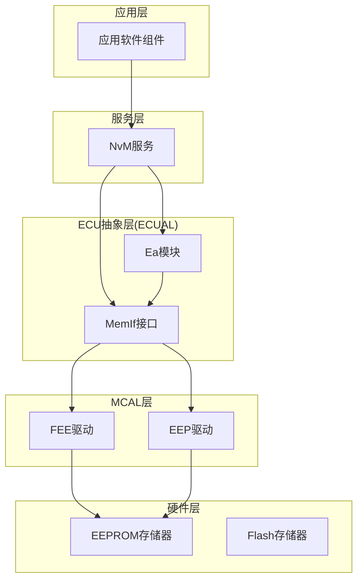
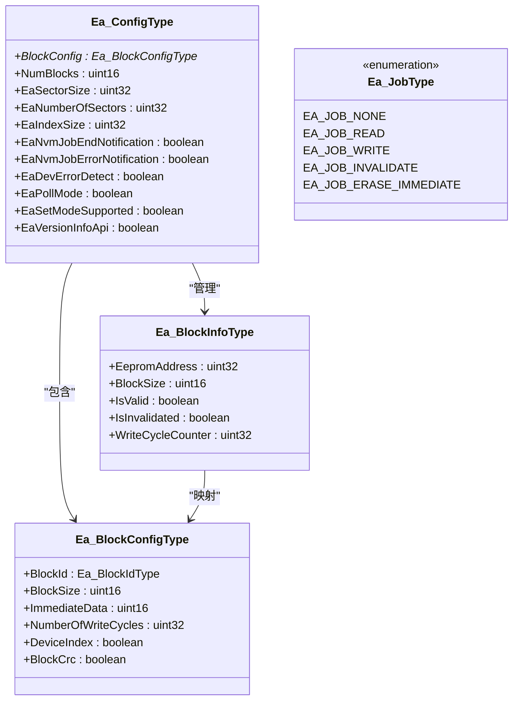
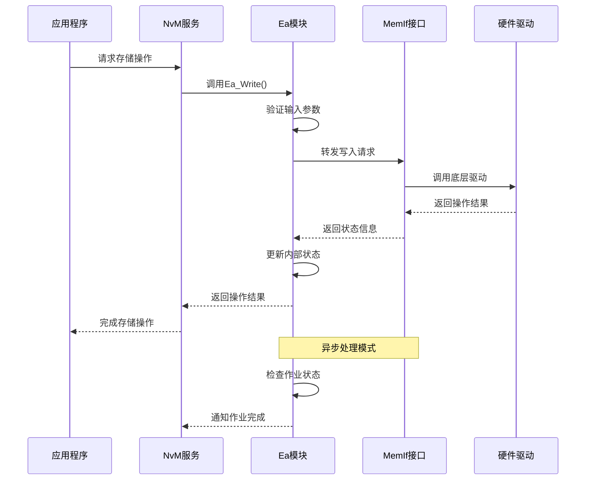
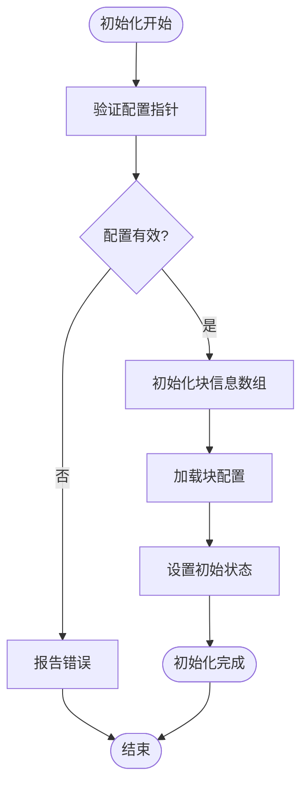
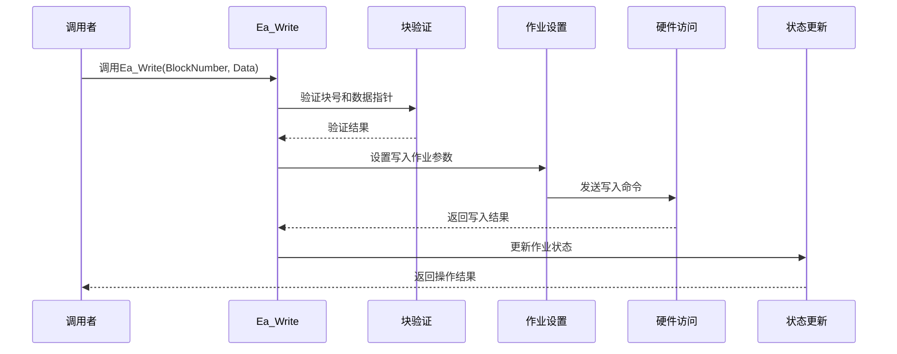
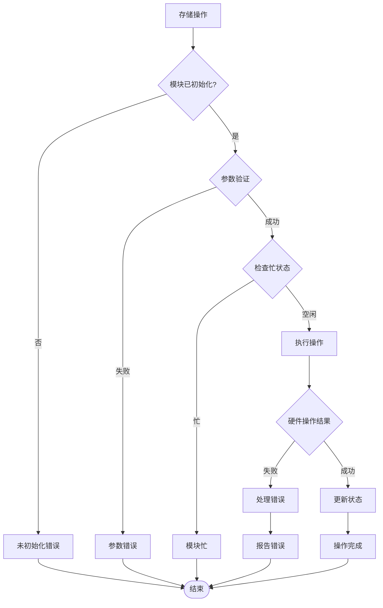
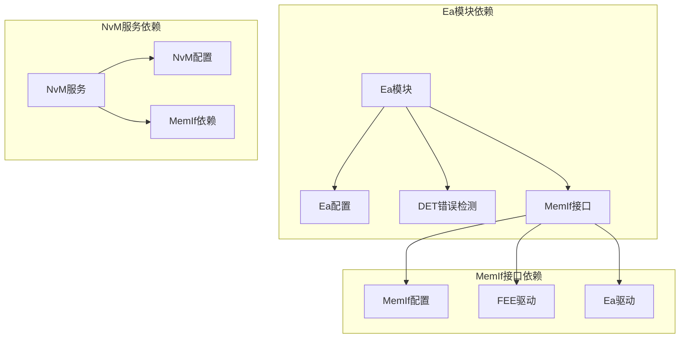

# Ea EEPROM抽象模块

<cite>
**本文档引用的文件**
- [Ea.h](file://src/bsw/ecual/ea/include/Ea.h)
- [Ea_Cfg.h](file://src/bsw/ecual/ea/include/Ea_Cfg.h)
- [Ea.c](file://src/bsw/ecual/ea/src/Ea.c)
- [NvM.h](file://src/bsw/services/nvm/include/NvM.h)
- [NvM_Cfg.h](file://src/bsw/services/nvm/include/NvM_Cfg.h)
- [NvM.c](file://src/bsw/services/nvm/src/NvM.c)
- [MemIf.h](file://src/bsw/ecual/memif/include/MemIf.h)
- [MemIf_Cfg.h](file://src/bsw/ecual/memif/include/MemIf_Cfg.h)
- [MemIf.c](file://src/bsw/ecual/memif/src/MemIf.c)
- [Det.h](file://src/bsw/services/det/include/Det.h)
- [Det.c](file://src/bsw/services/det/src/Det.c)
- [bsw_config.json](file://config/bsw_config.json)
</cite>

## 目录
1. [简介](#简介)
2. [项目结构](#项目结构)
3. [核心组件](#核心组件)
4. [架构概览](#架构概览)
5. [详细组件分析](#详细组件分析)
6. [依赖关系分析](#依赖关系分析)
7. [性能考虑](#性能考虑)
8. [故障排除指南](#故障排除指南)
9. [结论](#结论)
10. [附录](#附录)

## 简介

Ea EEPROM抽象模块是基于AUTOSAR经典平台4.x标准开发的EEPROM存储抽象层，为上层应用提供了统一的非易失性存储接口。该模块实现了逻辑块管理、数据加密和完整性校验功能，通过标准化的API接口简化了不同存储设备的访问方式。

本模块的核心特性包括：
- **标准化接口**：提供符合AUTOSAR标准的EEPROM抽象接口
- **逻辑块管理**：支持多块存储和块地址映射
- **数据完整性**：内置CRC校验机制确保数据完整性
- **错误检测**：完整的错误报告和处理机制
- **异步操作**：支持非阻塞的存储操作模式
- **灵活配置**：可配置的块大小、数量和存储参数

## 项目结构

Ea模块在AUTOSAR分层架构中的位置如下：



**图表来源**
- [Ea.h:1-242](file://src/bsw/ecual/ea/include/Ea.h#L1-L242)
- [NvM.h:1-355](file://src/bsw/services/nvm/include/NvM.h#L1-L355)
- [MemIf.h:1-232](file://src/bsw/ecual/memif/include/MemIf.h#L1-L232)

**章节来源**
- [Ea.h:14-242](file://src/bsw/ecual/ea/include/Ea.h#L14-L242)
- [NvM.h:1-355](file://src/bsw/services/nvm/include/NvM.h#L1-L355)
- [MemIf.h:1-232](file://src/bsw/ecual/memif/include/MemIf.h#L1-L232)

## 核心组件

### Ea模块核心数据结构

Ea模块定义了以下关键数据结构来管理存储操作：



**图表来源**
- [Ea.h:104-128](file://src/bsw/ecual/ea/include/Ea.h#L104-L128)
- [Ea.h:104-111](file://src/bsw/ecual/ea/include/Ea.h#L104-L111)
- [Ea.c:32-38](file://src/bsw/ecual/ea/src/Ea.c#L32-L38)

### 配置参数详解

Ea模块提供了丰富的配置选项：

| 配置项 | 默认值 | 描述 |
|--------|--------|------|
| EA_DEV_ERROR_DETECT | STD_ON | 启用运行时错误检测 |
| EA_VERSION_INFO_API | STD_ON | 启用版本信息查询API |
| EA_SET_MODE_SUPPORTED | STD_ON | 支持设置操作模式 |
| EA_POLL_MODE | STD_ON | 启用轮询模式 |
| EA_NUM_BLOCKS | 32 | 最大块数量 |
| EA_MAX_BLOCK_SIZE | 256 | 块最大尺寸(字节) |
| EA_SECTOR_SIZE | 4KB | 扇区大小 |
| EA_NUMBER_OF_SECTORS | 8 | 扇区数量 |
| EA_INDEX_SIZE | 16字节 | 索引区域大小 |

**章节来源**
- [Ea_Cfg.h:15-77](file://src/bsw/ecual/ea/include/Ea_Cfg.h#L15-L77)

## 架构概览

Ea模块采用分层架构设计，实现了从应用层到硬件层的完整抽象：



**图表来源**
- [Ea.c:200-248](file://src/bsw/ecual/ea/src/Ea.c#L200-L248)
- [MemIf.c:122-171](file://src/bsw/ecual/memif/src/MemIf.c#L122-L171)

**章节来源**
- [Ea.c:417-479](file://src/bsw/ecual/ea/src/Ea.c#L417-L479)
- [MemIf.c:44-63](file://src/bsw/ecual/memif/src/MemIf.c#L44-L63)

## 详细组件分析

### Ea模块实现机制

#### 初始化流程

Ea模块的初始化过程包括配置验证、块信息初始化和状态设置：



**图表来源**
- [Ea.c:70-107](file://src/bsw/ecual/ea/src/Ea.c#L70-L107)

#### 数据写入流程

Ea模块的写入操作实现了完整的数据保护机制：



**图表来源**
- [Ea.c:200-248](file://src/bsw/ecual/ea/src/Ea.c#L200-L248)

**章节来源**
- [Ea.c:133-198](file://src/bsw/ecual/ea/src/Ea.c#L133-L198)
- [Ea.c:200-248](file://src/bsw/ecual/ea/src/Ea.c#L200-L248)

### 块映射和地址计算

Ea模块实现了灵活的块地址映射机制：

| 块类型 | 地址计算公式 | 特殊属性 |
|--------|-------------|----------|
| 配置块 | BlockNumber × 64字节 | 固定64字节大小 |
| 校准块 | BlockNumber × 128字节 | 固定128字节大小 |
| 故障记忆块 | BlockNumber × 256字节 | 固定256字节大小 |
| VIN码块 | BlockNumber × 17字节 | 固定17字节大小 |
| 里程表块 | BlockNumber × 8字节 | 固定8字节大小 |

**章节来源**
- [Ea_Cfg.h:41-46](file://src/bsw/ecual/ea/include/Ea_Cfg.h#L41-L46)
- [Ea.c:495-500](file://src/bsw/ecual/ea/src/Ea.c#L495-L500)

### 错误恢复机制

Ea模块实现了多层次的错误检测和恢复机制：



**图表来源**
- [Ea.c:138-159](file://src/bsw/ecual/ea/src/Ea.c#L138-L159)
- [Ea.c:429-479](file://src/bsw/ecual/ea/src/Ea.c#L429-L479)

**章节来源**
- [Ea.c:250-266](file://src/bsw/ecual/ea/src/Ea.c#L250-L266)
- [Ea.c:429-479](file://src/bsw/ecual/ea/src/Ea.c#L429-L479)

## 依赖关系分析

### 组件间依赖关系



**图表来源**
- [Ea.c:9-12](file://src/bsw/ecual/ea/src/Ea.c#L9-L12)
- [NvM.c:19-22](file://src/bsw/services/nvm/src/NvM.c#L19-L22)
- [MemIf.c:9-11](file://src/bsw/ecual/memif/src/MemIf.c#L9-L11)

### 配置选项对比分析

| 功能特性 | Ea模块 | NvM模块 | 差异说明 |
|----------|--------|---------|----------|
| 错误检测 | 可配置 | 可配置 | 两者都支持运行时错误检测 |
| 版本信息 | 可配置 | 可配置 | 提供版本查询API |
| 主函数周期 | 10ms | 10ms | 相同的主函数调度周期 |
| 块数量 | 32个 | 32个 | 相同的块管理能力 |
| CRC校验 | 可配置 | 可配置 | 支持多种CRC算法 |
| 重试机制 | 无 | 内置重试 | NvM支持读写重试 |

**章节来源**
- [Ea_Cfg.h:63-75](file://src/bsw/ecual/ea/include/Ea_Cfg.h#L63-L75)
- [NvM_Cfg.h:74-86](file://src/bsw/services/nvm/include/NvM_Cfg.h#L74-L86)

## 性能考虑

### 存储性能优化

Ea模块在设计时充分考虑了性能优化：

1. **异步操作模式**：支持非阻塞的存储操作，避免系统阻塞
2. **批处理支持**：通过NvM服务实现批量存储操作
3. **缓存机制**：利用块索引减少地址计算开销
4. **错误快速检测**：及时发现并处理存储错误

### 内存使用优化

| 组件 | 内存占用 | 优化策略 |
|------|----------|----------|
| 块信息数组 | 32 × 16字节 = 512字节 | 固定大小，内存效率高 |
| 作业状态 | 12字节 | 精简的状态管理 |
| 配置指针 | 4字节 | 指针引用，节省内存 |
| CRC缓冲区 | 可选 | 按需启用 |

**章节来源**
- [Ea.c:32-60](file://src/bsw/ecual/ea/src/Ea.c#L32-L60)
- [Ea.h:116-128](file://src/bsw/ecual/ea/include/Ea.h#L116-L128)

## 故障排除指南

### 常见错误代码及处理

| 错误代码 | 错误描述 | 可能原因 | 解决方案 |
|----------|----------|----------|----------|
| EA_E_UNINIT | 模块未初始化 | 未调用Ea_Init | 确保先初始化模块 |
| EA_E_INVALID_BLOCK_NO | 块号无效 | 超出范围或未配置 | 检查块ID配置 |
| EA_E_INVALID_DATA_PTR | 数据指针为空 | 参数传递错误 | 验证数据指针有效性 |
| EA_E_BUSY | 模块正忙 | 并发操作冲突 | 等待当前操作完成 |
| EA_E_INVALID_MODE | 模式设置无效 | 不支持的操作模式 | 使用支持的模式 |

### 调试建议

1. **启用DET错误检测**：在开发阶段启用详细的错误报告
2. **监控作业状态**：定期检查Ea_GetStatus()返回值
3. **验证配置参数**：确保块配置与硬件规格匹配
4. **检查硬件连接**：确认存储器连接正确

**章节来源**
- [Ea.h:56-65](file://src/bsw/ecual/ea/include/Ea.h#L56-L65)
- [Det.h:40-44](file://src/bsw/services/det/include/Det.h#L40-L44)

## 结论

Ea EEPROM抽象模块为AUTOSAR系统提供了一个功能完整、性能优良的存储抽象层。通过标准化的接口设计、灵活的配置选项和完善的错误处理机制，该模块能够满足各种嵌入式存储应用的需求。

主要优势包括：
- **标准化接口**：符合AUTOSAR标准，便于集成和维护
- **灵活配置**：支持多种存储设备和配置参数
- **高性能设计**：异步操作和优化的内存使用
- **完整错误处理**：全面的错误检测和恢复机制

该模块为上层应用提供了可靠的非易失性存储解决方案，是AUTOSAR BSW架构中不可或缺的重要组成部分。

## 附录

### 使用示例

#### 基本配置步骤

1. **初始化Ea模块**：
   ```c
   // 调用Ea_Init()进行模块初始化
   Ea_Init(&Ea_Config);
   ```

2. **执行数据写入**：
   ```c
   // 准备要写入的数据
   uint8 data[64];
   // 执行写入操作
   Std_ReturnType result = Ea_Write(EA_BLOCK_ID_CONFIG, data);
   ```

3. **读取存储数据**：
   ```c
   // 准备接收缓冲区
   uint8 readData[64];
   // 执行读取操作
   Std_ReturnType result = Ea_Read(EA_BLOCK_ID_CONFIG, 0, readData, 64);
   ```

#### 高级功能使用

1. **块失效操作**：
   ```c
   // 标记块为失效状态
   Std_ReturnType result = Ea_InvalidateBlock(EA_BLOCK_ID_CONFIG);
   ```

2. **立即擦除操作**：
   ```c
   // 立即擦除指定块
   Std_ReturnType result = Ea_EraseImmediateBlock(EA_BLOCK_ID_CONFIG);
   ```

3. **状态监控**：
   ```c
   // 获取当前模块状态
   Ea_StatusType status = Ea_GetStatus();
   // 获取作业结果
   Ea_JobResultType result = Ea_GetJobResult();
   ```

**章节来源**
- [Ea.h:151-236](file://src/bsw/ecual/ea/include/Ea.h#L151-L236)
- [Ea_Cfg.h:29-36](file://src/bsw/ecual/ea/include/Ea_Cfg.h#L29-L36)

### 配置参考

#### 系统配置参数

| 参数名称 | 值 | 描述 |
|----------|----|------|
| 模块版本 | 1.0.0 | 当前版本号 |
| 供应商ID | 0x01 | 上海鱼乐电子科技有限公司 |
| 模块ID | 0x31 | EA模块标识符 |
| AR版本 | 4.4.0 | AUTOSAR规范版本 |

#### 存储配置参数

| 参数名称 | 值 | 单位 | 描述 |
|----------|----|------|------|
| 扇区大小 | 4KB | 字节 | EEPROM扇区大小 |
| 扇区数量 | 8 | 个 | 总扇区数量 |
| 索引大小 | 16 | 字节 | 块索引区域大小 |
| 最大块大小 | 256 | 字节 | 单个块最大容量 |
| 块数量 | 32 | 个 | 支持的块总数 |

**章节来源**
- [Ea_Cfg.h:25-58](file://src/bsw/ecual/ea/include/Ea_Cfg.h#L25-L58)
- [bsw_config.json:1-21](file://config/bsw_config.json#L1-L21)