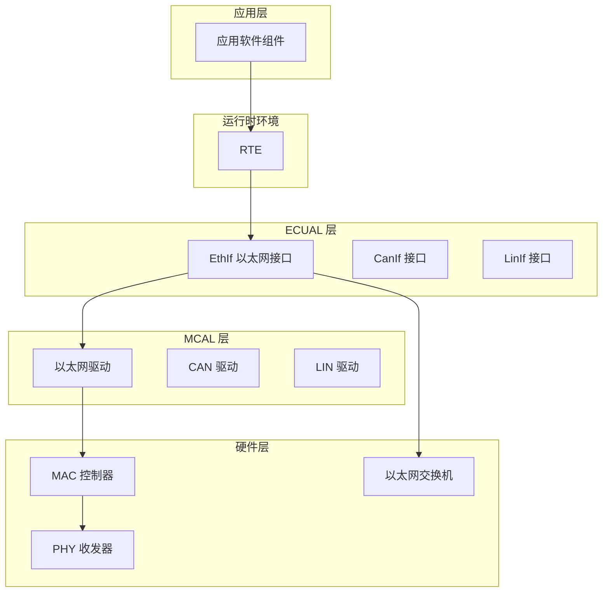
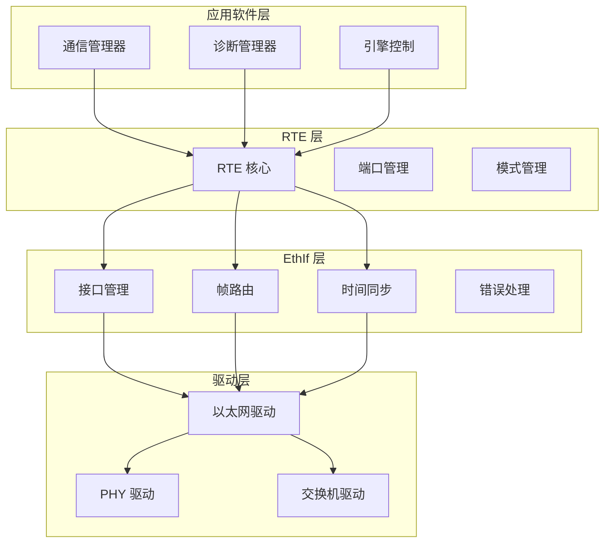
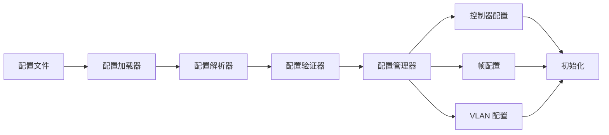
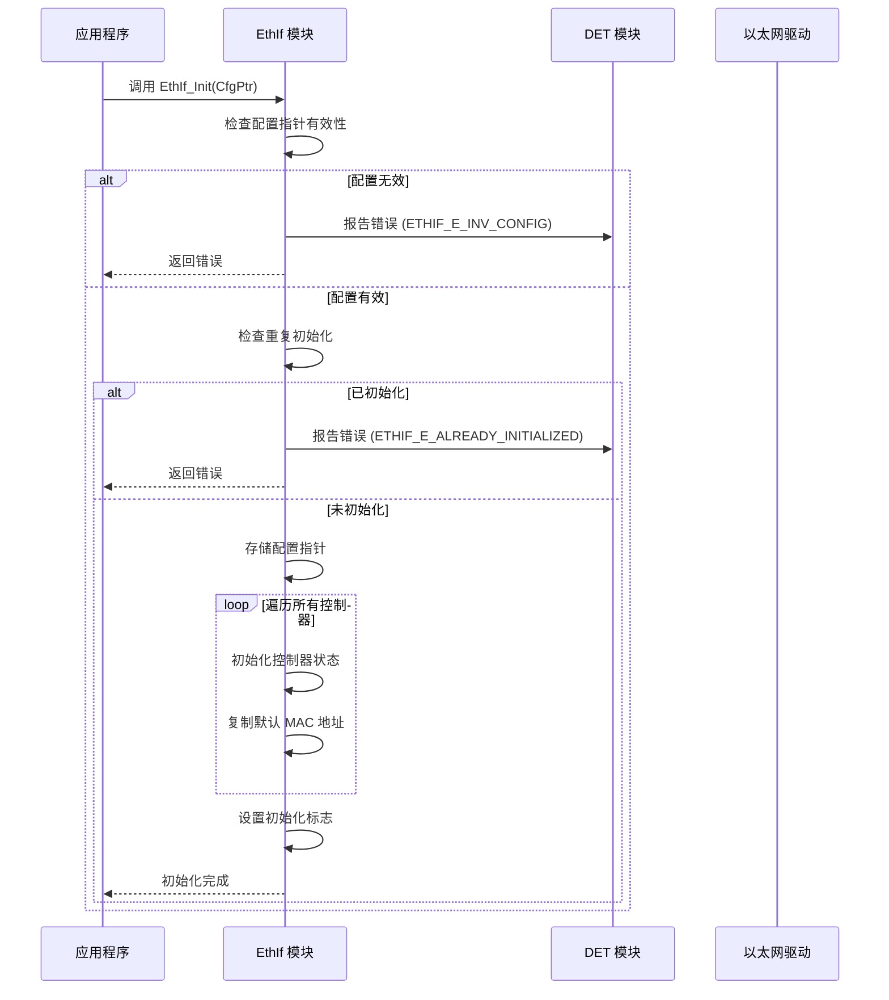
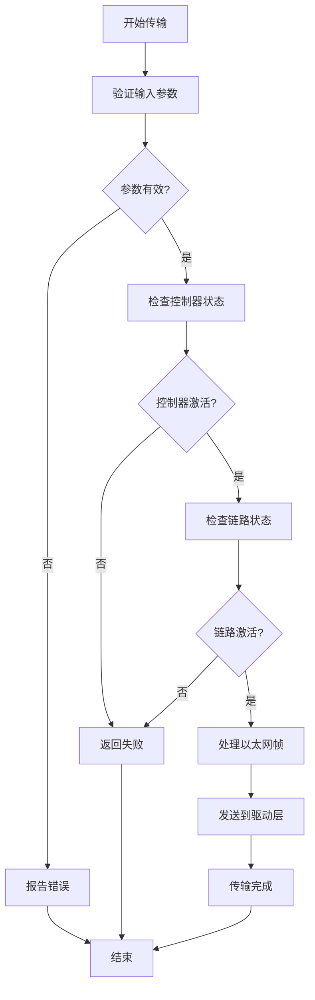
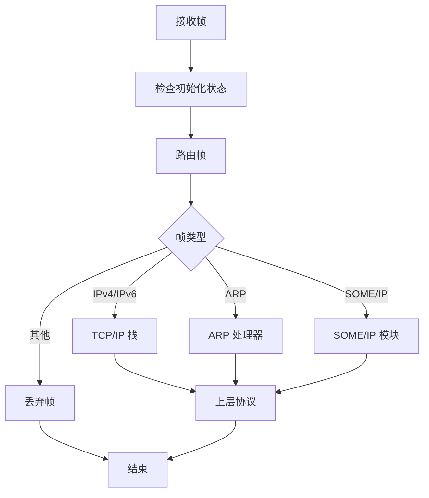
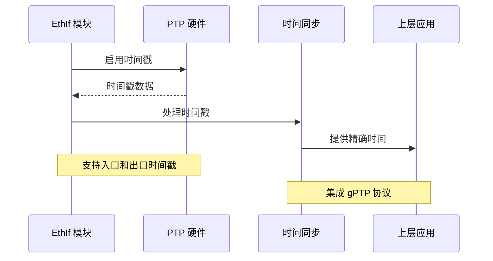
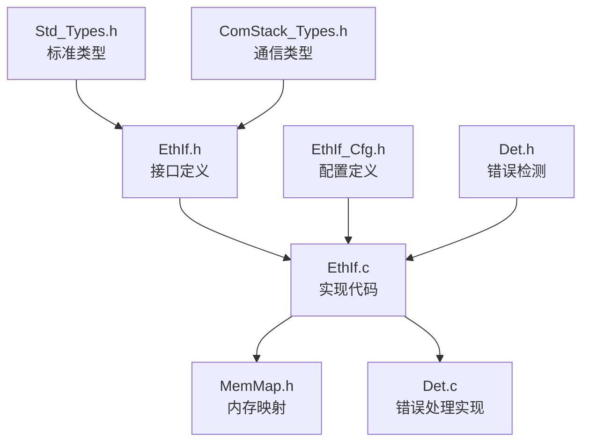
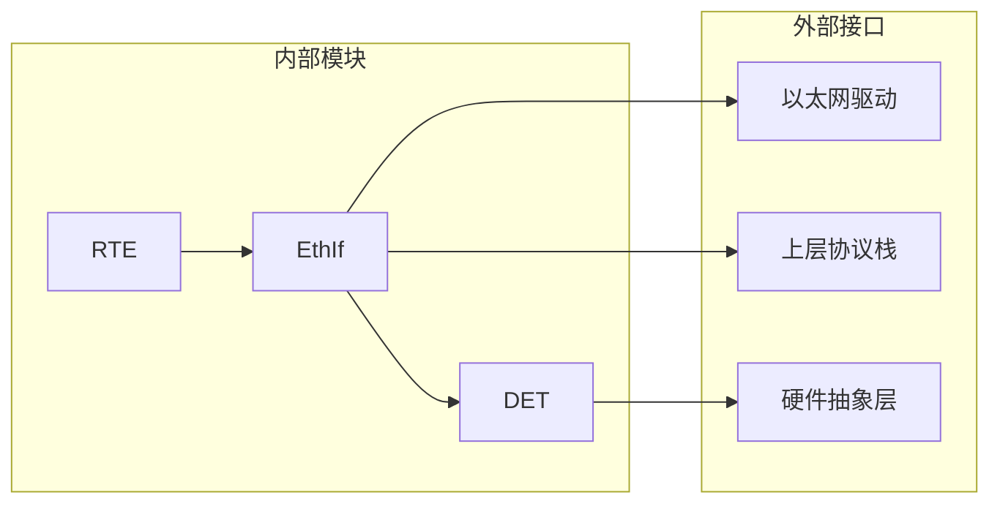

# EthIf 以太网接口模块

<cite>
**本文档引用的文件**
- [EthIf.h](file://src/bsw/ecual/ethif/include/EthIf.h)
- [EthIf_Cfg.h](file://src/bsw/ecual/ethif/include/EthIf_Cfg.h)
- [EthIf.c](file://src/bsw/ecual/ethif/src/EthIf.c)
- [Det.h](file://src/bsw/services/det/include/Det.h)
- [Det.c](file://src/bsw/services/det/src/Det.c)
- [Rte.h](file://src/bsw/rte/include/Rte.h)
- [bsw_config.json](file://config/bsw_config.json)
</cite>

## 目录
1. [简介](#简介)
2. [项目结构](#项目结构)
3. [核心组件](#核心组件)
4. [架构概览](#架构概览)
5. [详细组件分析](#详细组件分析)
6. [依赖关系分析](#依赖关系分析)
7. [性能考虑](#性能考虑)
8. [故障排除指南](#故障排除指南)
9. [结论](#结论)
10. [附录](#附录)

## 简介
EthIf 是遵循 AutoSAR 经典平台 4.x 标准的以太网接口模块，位于 ECU 抽象层（ECUAL）。该模块提供了标准化的网络通信抽象，实现以下关键功能：

- **MAC 地址管理**：支持静态和动态 MAC 地址配置，提供获取和设置接口
- **帧处理**：支持多种以太网帧类型（IPv4、IPv6、ARP、VLAN、SOME/IP、TSN）
- **多播支持**：通过 VLAN 配置支持多播流量隔离
- **时间同步**：集成 gPTP 时间同步功能
- **缓冲区管理**：支持多个控制器和 VLAN 的缓冲区分配
- **中断处理**：提供 Rx/Tx 回调接口用于异步数据传输

## 项目结构
EthIf 模块采用 AutoSAR 标准的分层架构设计：



**图表来源**
- [EthIf.h:1-367](file://src/bsw/ecual/ethif/include/EthIf.h#L1-L367)
- [Rte.h:1-200](file://src/bsw/rte/include/Rte.h#L1-L200)

**章节来源**
- [EthIf.h:1-367](file://src/bsw/ecual/ethif/include/EthIf.h#L1-L367)
- [EthIf_Cfg.h:1-92](file://src/bsw/ecual/ethif/include/EthIf_Cfg.h#L1-L92)

## 核心组件
EthIf 模块包含以下核心组件：

### 数据类型定义
模块定义了完整的数据类型体系，包括：

- **控制器模式类型**：ETHIF_MODE_DOWN 和 ETHIF_MODE_ACTIVE
- **速度类型**：支持 10Mbps、100Mbps、1Gbps、2.5Gbps、10Gbps
- **双工类型**：半双工和全双工模式
- **链接状态类型**：链接激活和断开状态
- **时间戳类型**：包含秒和纳秒字段

### 配置结构体
- **控制器配置**：包含控制器索引、物理地址、MTU 等参数
- **帧所有者配置**：定义帧类型和所属模块映射
- **VLAN 配置**：支持多个 VLAN 实例和优先级设置

### 功能接口
模块提供完整的 AutoSAR 接口集，包括：
- 初始化和配置管理
- 控制器模式控制
- 帧传输和接收
- 时间戳功能
- 错误检测和报告

**章节来源**
- [EthIf.h:95-215](file://src/bsw/ecual/ethif/include/EthIf.h#L95-L215)
- [EthIf_Cfg.h:15-92](file://src/bsw/ecual/ethif/include/EthIf_Cfg.h#L15-L92)

## 架构概览
EthIf 采用分层架构设计，确保模块间的松耦合和高内聚：



**图表来源**
- [EthIf.c:29-59](file://src/bsw/ecual/ethif/src/EthIf.c#L29-L59)
- [Rte.h:76-106](file://src/bsw/rte/include/Rte.h#L76-L106)

### 配置管理架构


**图表来源**
- [EthIf_Cfg.h:28-33](file://src/bsw/ecual/ethif/include/EthIf_Cfg.h#L28-L33)
- [EthIf.h:197-215](file://src/bsw/ecual/ethif/include/EthIf.h#L197-L215)

## 详细组件分析

### 初始化流程
EthIf 的初始化过程遵循严格的错误检查和状态管理：



**图表来源**
- [EthIf.c:29-59](file://src/bsw/ecual/ethif/src/EthIf.c#L29-L59)
- [Det.h:47-59](file://src/bsw/services/det/include/Det.h#L47-L59)

### 帧传输处理
EthIf 提供完整的帧传输处理机制：



**图表来源**
- [EthIf.c:184-226](file://src/bsw/ecual/ethif/src/EthIf.c#L184-L226)

### 帧路由机制
EthIf 根据帧类型将数据包路由到相应的上层模块：



**图表来源**
- [EthIf.c:381-420](file://src/bsw/ecual/ethif/src/EthIf.c#L381-L420)

**章节来源**
- [EthIf.c:29-115](file://src/bsw/ecual/ethif/src/EthIf.c#L29-L115)
- [EthIf.c:184-226](file://src/bsw/ecual/ethif/src/EthIf.c#L184-L226)
- [EthIf.c:381-420](file://src/bsw/ecual/ethif/src/EthIf.c#L381-L420)

### 时间同步功能
EthIf 集成了 gPTP（通用精确时间协议）支持：



**图表来源**
- [EthIf_Cfg.h:72-73](file://src/bsw/ecual/ethif/include/EthIf_Cfg.h#L72-L73)
- [EthIf.c:244-270](file://src/bsw/ecual/ethif/src/EthIf.c#L244-L270)

**章节来源**
- [EthIf_Cfg.h:72-73](file://src/bsw/ecual/ethif/include/EthIf_Cfg.h#L72-L73)
- [EthIf.c:244-326](file://src/bsw/ecual/ethif/src/EthIf.c#L244-L326)

## 依赖关系分析

### 内部依赖关系


**图表来源**
- [EthIf.h:19-21](file://src/bsw/ecual/ethif/include/EthIf.h#L19-L21)
- [EthIf.c:9-11](file://src/bsw/ecual/ethif/src/EthIf.c#L9-L11)

### 外部集成点
EthIf 与以下系统组件集成：



**图表来源**
- [Rte.h:76-106](file://src/bsw/rte/include/Rte.h#L76-L106)
- [Det.h:47-59](file://src/bsw/services/det/include/Det.h#L47-L59)

**章节来源**
- [EthIf.h:19-21](file://src/bsw/ecual/ethif/include/EthIf.h#L19-L21)
- [EthIf.c:9-11](file://src/bsw/ecual/ethif/src/EthIf.c#L9-L11)

## 性能考虑
EthIf 在设计时充分考虑了实时性和性能要求：

### 缓冲区管理
- **多控制器支持**：最多支持 2 个控制器并发操作
- **VLAN 隔离**：每个 VLAN 独立的缓冲区管理
- **帧类型优化**：针对不同帧类型的专用处理路径

### 中断处理
- **非阻塞设计**：Rx/Tx 操作采用回调机制
- **优先级处理**：支持高优先级帧的快速处理
- **批量处理**：支持多个帧的批量传输优化

### 时间同步性能
- **硬件加速**：利用硬件时间戳功能
- **低延迟**：gPTP 协议的最小化延迟设计
- **精度保证**：纳秒级时间戳精度

## 故障排除指南

### 常见错误代码
EthIf 定义了完整的错误代码体系：

| 错误代码 | 描述 | 可能原因 |
|---------|------|----------|
| ETHIF_E_UNINIT | 未初始化 | 未调用初始化函数 |
| ETHIF_E_INV_CTRL_IDX | 控制器索引无效 | 超出控制器数量范围 |
| ETHIF_E_INV_PARAM_POINTER | 参数指针无效 | 传入空指针 |
| ETHIF_E_INV_MTU | MTU 值无效 | 超过最大传输单元限制 |
| ETHIF_E_ALREADY_INITIALIZED | 已初始化 | 重复初始化调用 |

### 调试建议
1. **初始化检查**：确保在调用任何功能前完成初始化
2. **参数验证**：严格验证所有输入参数的有效性
3. **状态监控**：定期检查控制器和链路状态
4. **错误日志**：启用 DET 模块记录详细的错误信息

**章节来源**
- [EthIf.h:65-91](file://src/bsw/ecual/ethif/include/EthIf.h#L65-L91)
- [Det.c:47-57](file://src/bsw/services/det/src/Det.c#L47-L57)

## 结论
EthIf 以太网接口模块是一个功能完整、设计规范的 AutoSAR 兼容模块。其主要特点包括：

- **标准化接口**：完全符合 AutoSAR 经典平台 4.x 标准
- **灵活配置**：支持多控制器、多 VLAN 的灵活配置
- **实时性能**：优化的中断处理和时间同步功能
- **错误处理**：完善的错误检测和报告机制
- **可扩展性**：模块化的架构设计便于功能扩展

该模块为上层应用提供了可靠的网络通信基础，支持从简单的 TCP/IP 连接到复杂的 TSN 实时网络应用。

## 附录

### 配置示例
以下是一个典型的 EthIf 配置示例：

```json
{
  "controllers": [
    {
      "CtrlIdx": 0,
      "EthCtrlIdx": 0,
      "EthTrcvIdx": 0,
      "PhysAddr": [0x00, 0x1A, 0x2B, 0x3C, 0x4D, 0x5E],
      "Mtu": 1500,
      "CtrlEnableWakeup": true,
      "CtrlIdxApiActive": true
    }
  ],
  "frameOwners": [
    {
      "FrameType": 0x0800,
      "OwnerIdx": 1,
      "HeaderByteOffsetApi": false
    }
  ],
  "vlans": [
    {
      "VlanId": 1,
      "CtrlIdx": 0,
      "Priority": 0
    }
  ]
}
```

### 使用模式
1. **初始化阶段**：调用 `EthIf_Init()` 完成基本初始化
2. **控制器配置**：使用 `EthIf_ControllerInit()` 配置具体控制器
3. **运行阶段**：定期调用 `EthIf_MainFunction()` 处理后台任务
4. **数据传输**：通过 `EthIf_Transmit()` 发送帧，通过回调接收帧

### 集成指南
EthIf 与 RTE 的集成通过标准的端口连接实现，支持：
- **发送端口**：用于发送网络数据
- **接收端口**：用于接收网络数据
- **模式管理**：支持运行模式的切换
- **互 runnable 变量**：用于跨组件的数据共享

**章节来源**
- [EthIf_Cfg.h:28-33](file://src/bsw/ecual/ethif/include/EthIf_Cfg.h#L28-L33)
- [Rte.h:106-115](file://src/bsw/rte/include/Rte.h#L106-L115)