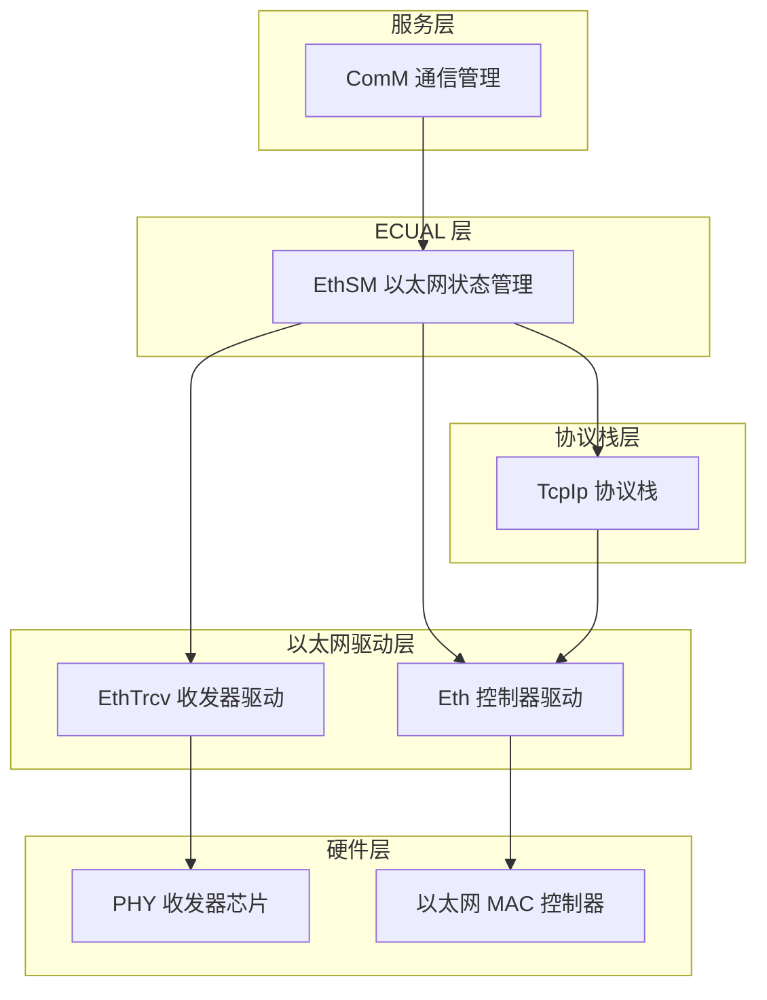
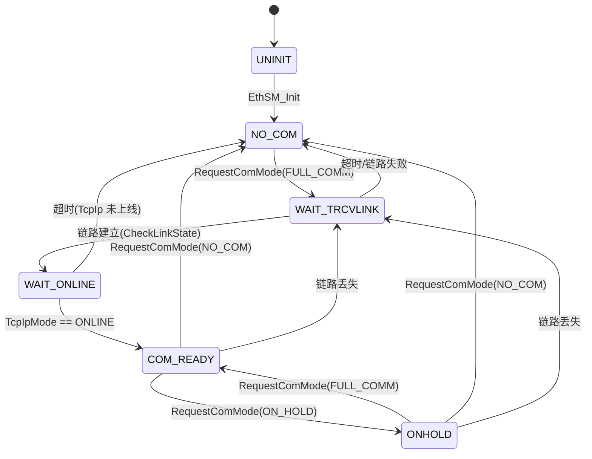
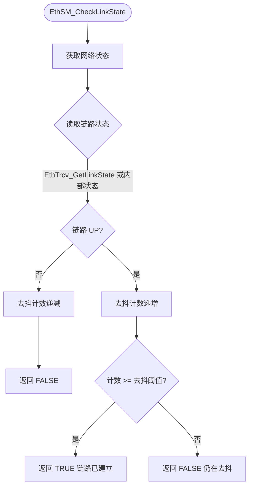

# EthSM（以太网状态管理模块）

<cite>
**本文档引用的文件**
- [EthSM.h](file://src/bsw/ecual/ethSm/include/EthSM.h)
- [EthSM_Cfg.h](file://src/bsw/ecual/ethSm/include/EthSM_Cfg.h)
- [EthSM.c](file://src/bsw/ecual/ethSm/src/EthSM.c)
- [EthSM_Lcfg.c](file://src/bsw/ecual/ethSm/src/EthSM_Lcfg.c)
- [ComM.h](file://src/bsw/services/comM/include/ComM.h)
- [ComStack_Types.h](file://src/bsw/ecual/include/ComStack_Types.h)
- [Std_Types.h](file://src/bsw/os/include/Std_Types.h)
</cite>

## 目录
1. [简介](#简介)
2. [项目结构](#项目结构)
3. [核心组件](#核心组件)
4. [架构概览](#架构概览)
5. [详细组件分析](#详细组件分析)
6. [依赖关系分析](#依赖关系分析)
7. [性能考虑](#性能考虑)
8. [故障排除指南](#故障排除指南)
9. [结论](#结论)
10. [附录](#附录)

## 简介

EthSM（Ethernet State Manager，以太网状态管理器）是基于 AUTOSAR 4.4.0 标准开发的 ECUAL 层通信状态管理模块，负责管理以太网网络的通信状态机。该模块实现了 NO_COM、WAIT_TRCVLINK、WAIT_ONLINE、ONHOLD 和 COM_READY 五种状态之间的转换，协调 EthTrcv（收发器）、Eth（控制器）与 TcpIp（协议栈）之间的协作。

EthSM 作为 ComM（通信管理）与以太网底层驱动之间的桥梁，接收 ComM 的通信模式请求，监控收发器链路状态和 TcpIp 协议栈状态，最终向 ComM 上报当前通信模式，实现以太网网络的按需通信管理。

**章节来源**
- [EthSM.h:16-40](file://src/bsw/ecual/ethSm/include/EthSM.h#L16-L40)
- [EthSM.h:44-70](file://src/bsw/ecual/ethSm/include/EthSM.h#L44-L70)

## 项目结构

EthSM 模块源码位于 `src/bsw/ecual/ethSm/`：

```
src/bsw/ecual/ethSm/
├── include/
│   ├── EthSM.h              # 公共 API 与类型定义
│   └── EthSM_Cfg.h          # 预编译配置（yuleASR Configurator 生成）
└── src/
    ├── EthSM.c              # 状态机实现（845 行）
    └── EthSM_Lcfg.c         # 链接时网络配置表
```



**图表来源**
- [EthSM.h:24-28](file://src/bsw/ecual/ethSm/include/EthSM.h#L24-L28)
- [EthSM.c:8-14](file://src/bsw/ecual/ethSm/src/EthSM.c#L8-L14)

**章节来源**
- [EthSM.h:1-30](file://src/bsw/ecual/ethSm/include/EthSM.h#L1-L30)
- [EthSM_Cfg.h:1-73](file://src/bsw/ecual/ethSm/include/EthSM_Cfg.h#L1-L73)

## 核心组件

EthSM 模块的核心组件包括：

### 状态机定义
- **EthSM_StateType**: 内部状态枚举，包含 UNINIT、NO_COM、WAIT_TRCVLINK、WAIT_ONLINE、ONHOLD、COM_READY 六个状态
- **EthSM_NetworkModeType**: 对外通信模式枚举，映射 ComM 模式（NO_COM → COM_READY）
- **TcpIp_StateType**: TcpIp 协议栈状态（OFFLINE/STARTUP/ONLINE/ONHOLD），由 TcpIp 上报

### 配置结构
- **EthSM_NetworkConfigType**: 网络配置，绑定控制器索引、收发器索引、TcpIp 控制器索引、ComM 通道句柄及超时参数
- **EthSM_TcpIpMappingType**: TcpIp 控制器映射，包含 DHCP 使能、静态 IP/子网掩码/网关配置
- **EthSM_TrcvConfigType**: 收发器配置（唤醒模式、自协商、速率、双工）
- **EthSM_CtrlConfigType**: 控制器配置（MAC 地址、MTU、VLAN 支持）
- **EthSM_NetworkStateType**: 网络运行时状态（EthSM.c 内部），跟踪当前状态、请求模式、TcpIp 状态和超时定时器

### 配置参数（EthSM_Cfg.h）
- **ETHSM_MAX_NETWORKS**: 2 个以太网网络
- **ETHSM_TIMEOUT_WAIT_TRCVLINK**: 等待链路建立超时 100ms
- **ETHSM_TIMEOUT_WAIT_ONLINE**: 等待 TcpIp 上线超时 5000ms
- **ETHSM_MAIN_FUNCTION_CYCLE_MS**: 主函数周期 10ms
- **ETHSM_LINK_DEBOUNCE_TIME**: 链路去抖时间 20ms
- **ETHSM_MAX_RETRIES**: 最大重试次数 3 次
- **ETHSM_WAKEUP_SUPPORT / ETHSM_TRCVLINK_CHANGE_NOTIFICATION / ETHSM_STATE_CHANGE_CALLBACK**: 功能开关

**章节来源**
- [EthSM.h:96-146](file://src/bsw/ecual/ethSm/include/EthSM.h#L96-L146)
- [EthSM.h:150-195](file://src/bsw/ecual/ethSm/include/EthSM.h#L150-L195)
- [EthSM_Cfg.h:20-73](file://src/bsw/ecual/ethSm/include/EthSM_Cfg.h#L20-L73)

## 架构概览

EthSM 的核心是每个网络独立运行的通信状态机：



**图表来源**
- [EthSM.c:238-533](file://src/bsw/ecual/ethSm/src/EthSM.c#L238-L533)
- [EthSM.h:96-104](file://src/bsw/ecual/ethSm/include/EthSM.h#L96-L104)

## 详细组件分析

### 状态机处理组件分析

EthSM_MainFunction() 周期性驱动每个网络的状态机处理：

```mermaid
sequenceDiagram
participant Sched as 调度器
participant SM as EthSM_MainFunction
participant NET as 网络状态机
participant LINK as EthSM_CheckLinkState
participant COMM as ComM
Sched->>SM : 每 10ms 调用
loop 遍历 ETHSM_MAX_NETWORKS 网络
SM->>NET : 分发到 ProcessState_X 处理函数
NET->>LINK : 检查链路状态(去抖)
LINK-->>NET : 链路 UP/DOWN
alt 状态转换条件满足
NET->>SM : EthSM_TransitionToState
SM->>SM : 映射 ComM 模式
SM->>COMM : ComM_BusSM_ModeIndication(Channel, Mode)
COMM-->>SM : 模式已上报
else 无转换
NET->>NET : 更新超时定时器
end
end
```

**图表来源**
- [EthSM.c:81-95](file://src/bsw/ecual/ethSm/src/EthSM.c#L81-L95)
- [EthSM.c:546-580](file://src/bsw/ecual/ethSm/src/EthSM.c#L546-L580)

#### 各状态处理逻辑

1. **NO_COM 状态**: 等待 ComM 请求；收到 FULL_COMM 请求后进入 WAIT_TRCVLINK（EthSM_ProcessState_NO_COM）
2. **WAIT_TRCVLINK 状态**: 周期性调用 EthSM_CheckLinkState() 检查收发器链路；链路建立（含去抖）后进入 WAIT_ONLINE；超时或链路失败回到 NO_COM
3. **WAIT_ONLINE 状态**: 等待 TcpIp 通过 EthSM_TcpIpModeIndication() 上报 ONLINE；收到 ONLINE 进入 COM_READY；超时（ETHSM_TIMEOUT_WAIT_ONLINE）则回退
4. **ONHOLD 状态**: 通信挂起，链路丢失则回 NO_COM 或 WAIT_TRCVLINK
5. **COM_READY 状态**: 全通信模式；链路丢失回到 WAIT_TRCVLINK；收到 NO_COM/ON_HOLD 请求相应转换

**章节来源**
- [EthSM.c:238-533](file://src/bsw/ecual/ethSm/src/EthSM.c#L238-L533)

### 链路状态检查组件分析

EthSM_CheckLinkState() 实现链路状态的去抖检测：



**图表来源**
- [EthSM.c:126-163](file://src/bsw/ecual/ethSm/src/EthSM.c#L126-L163)
- [EthSM_Cfg.h:40-42](file://src/bsw/ecual/ethSm/include/EthSM_Cfg.h#L40-L42)

#### 链路检查特性

- **去抖机制**: ETHSM_LINK_DEBOUNCE_TIME（20ms）防止链路抖动导致状态振荡
- **状态回调**: ETHSM_TRCVLINK_CHANGE_NOTIFICATION 开启时支持收发器链路变化通知
- **唤醒集成**: ETHSM_WAKEUP_SUPPORT 开启时支持网络唤醒源处理

**章节来源**
- [EthSM.c:126-163](file://src/bsw/ecual/ethSm/src/EthSM.c#L126-L163)

### 模式请求组件分析

EthSM_RequestComMode() 与 EthSM_GetCurrentComMode() 构成 ComM 接口：

- **EthSM_RequestComMode(NetworkHandle, ComMode)**: 校验网络句柄后记录请求模式，由主函数异步执行状态转换
- **EthSM_GetCurrentComMode(NetworkHandle, ComMode)**: 返回当前状态机映射的 ComM 模式
- **EthSM_TcpIpModeIndication(NetworkHandle, TcpIpMode)**: TcpIp 协议栈回调，更新 TcpIp 状态并驱动 WAIT_ONLINE → COM_READY 转换
- **EthSM_GetInternalState()**: 诊断用途，返回详细内部状态

**章节来源**
- [EthSM.h:200-280](file://src/bsw/ecual/ethSm/include/EthSM.h#L200-L280)
- [EthSM.c:184-232](file://src/bsw/ecual/ethSm/src/EthSM.c#L184-L232)

## 依赖关系分析

EthSM 处于通信管理的中间层，依赖关系如下：

```mermaid
graph TB
subgraph "EthSM 内部"
ES_H[EthSM.h]
ES_CFG[EthSM_Cfg.h]
ES_C[EthSM.c]
ES_LCFG[EthSM_Lcfg.c]
end
subgraph "基础依赖"
STD[Std_Types.h]
COMSTACK[ComStack_Types.h]
COMM[ComM.h]
END
subgraph "下游驱动"
ETHTRCV[EthTrcv 收发器驱动]
ETH[Eth 控制器驱动]
END
subgraph "协议栈"
TCPIP[TcpIp 协议栈]
END
ES_H --> STD
ES_H --> COMSTACK
ES_H --> COMM
ES_C --> ES_H
ES_C --> ES_CFG
ES_LCFG --> ES_CFG
COMM --> ES_H
ETHTRCV --> ES_C
ETH --> ES_C
TCPIP --> ES_C
```

**图表来源**
- [EthSM.h:30-36](file://src/bsw/ecual/ethSm/include/EthSM.h#L30-L36)
- [EthSM.c:8-14](file://src/bsw/ecual/ethSm/src/EthSM.c#L8-L14)

### 关键依赖关系

1. **ComM 依赖**: 通过 `ComM_BusSM_ModeIndication()` 上报模式，接收 ComM_ModeType 请求
2. **EthTrcv/Eth 依赖**: 链路状态查询与收发器唤醒控制（通过网络配置引用）
3. **TcpIp 依赖**: 接收 TcpIp_StateType 状态上报
4. **配置依赖**: EthSM_Cfg.h 提供编译期网络数量、超时等参数

**章节来源**
- [EthSM.h:30-36](file://src/bsw/ecual/ethSm/include/EthSM.h#L30-L36)
- [EthSM.c:165-174](file://src/bsw/ecual/ethSm/src/EthSM.c#L165-L174)

## 性能考虑

### 超时参数

| 参数 | 默认值 | 说明 |
|------|--------|------|
| ETHSM_TIMEOUT_WAIT_TRCVLINK | 100ms | 等待链路建立超时 |
| ETHSM_TIMEOUT_WAIT_ONLINE | 5000ms | 等待 TcpIp 上线超时（需考虑 DHCP 协商时间） |
| ETHSM_TIMEOUT_TRCV_WAKEUP | 50ms | 收发器唤醒超时 |
| ETHSM_MAIN_FUNCTION_CYCLE_MS | 10ms | 状态机处理周期 |
| ETHSM_LINK_DEBOUNCE_TIME | 20ms | 链路去抖时间 |
| ETHSM_MAX_RETRIES | 3次 | 链路失败重试次数 |

### 实时性分析

- **状态转换延迟**: 最坏情况下一个状态转换需 1-2 个主函数周期（10-20ms）
- **链路检测延迟**: 链路建立到 WAIT_ONLINE 约需 20ms 去抖 + 1 个周期
- **TcpIp 上线等待**: 若启用 DHCP，WAIT_ONLINE 阶段可能长达数秒（受 5s 超时保护）

### 资源占用

- 网络运行时状态：每个网络约 24 字节
- 无动态内存分配
- 状态处理函数均为短小函数，栈占用低

**章节来源**
- [EthSM_Cfg.h:28-38](file://src/bsw/ecual/ethSm/include/EthSM_Cfg.h#L28-L38)
- [EthSM.h:72-78](file://src/bsw/ecual/ethSm/include/EthSM.h#L72-L78)

## 故障排除指南

### 常见错误代码

| 错误代码 | 错误含义 | 可能原因 | 解决方案 |
|---------|---------|---------|---------|
| ETHSM_E_NOT_INITIALIZED (0x01) | 未初始化 | API 在 Init 前调用 | 检查初始化时序 |
| ETHSM_E_INVALID_NETWORK_HANDLE (0x02) | 网络句柄无效 | 句柄超出配置范围 | 检查 ETHSM_MAX_NETWORKS |
| ETHSM_E_INVALID_POINTER (0x03) | 指针无效 | 空指针传出参数 | 检查调用参数 |
| ETHSM_E_INVALID_PARAMETER (0x04) | 参数无效 | ComMode 非法 | 使用 ComM_ModeType 枚举 |
| ETHSM_E_ALREADY_INITIALIZED (0x05) | 重复初始化 | 多次调用 Init | 检查初始化逻辑 |
| ETHSM_E_TCPIP_MODE_FAILED (0x07) | TcpIp 模式失败 | TcpIp 未正常启动 | 检查 TcpIp 配置 |
| ETHSM_E_TRANSCEIVER_ERROR (0x08) | 收发器错误 | 链路检测失败 | 检查 PHY 硬件 |

### 调试建议

1. **状态跟踪**: 使用 EthSM_GetInternalState() 观察状态机内部状态
2. **链路确认**: 检查 EthTrcv_GetLinkState() 返回值与 PHY 实际链路状态
3. **TcpIp 状态**: 确认 TcpIp 是否正确调用 EthSM_TcpIpModeIndication()
4. **时序验证**: 用逻辑分析仪验证链路建立到 COM_READY 的完整时间线

**章节来源**
- [EthSM.h:52-70](file://src/bsw/ecual/ethSm/include/EthSM.h#L52-L70)
- [EthSM.c:66-90](file://src/bsw/ecual/ethSm/src/EthSM.c#L66-L90)

## 结论

EthSM 以太网状态管理模块是一个设计规范、状态机清晰的 AUTOSAR 4.4.0 ECUAL 组件。它提供：

1. **完整的状态机**: 覆盖 NO_COM → WAIT_TRCVLINK → WAIT_ONLINE → COM_READY 全生命周期
2. **ComM 深度集成**: 通过 ComM_BusSM_ModeIndication 无缝接入通信管理框架
3. **多网络支持**: 独立管理最多 2 个以太网网络
4. **健壮的超时保护**: 所有状态转换均有超时兜底，防止网络卡死
5. **可配置性**: 超时、去抖、重试等参数均可由 Configurator 调整

该模块是车载以太网通信按需管理的关键组件，确保以太网仅在必要时全速运行，兼顾通信可用性与功耗优化。

## 附录

### 典型网络配置示例

```c
/* EthSM_Lcfg.c 网络配置示例 */
const EthSM_NetworkConfigType EthSM_Networks[ETHSM_MAX_NETWORKS] = {
    {
        .networkHandle = ETHSM_NETWORK_0,
        .ctrlIdx = ETHSM_CTRL_IDX_NETWORK_0,
        .trcvIdx = ETHSM_TRCV_IDX_NETWORK_0,
        .tcpIpCtrlIdx = ETHSM_TCPIP_CTRL_IDX_NETWORK_0,
        .comMChannel = 0U,
        .timeoutWaitTrcvLink = ETHSM_TIMEOUT_WAIT_TRCVLINK,
        .timeoutWaitOnline = ETHSM_TIMEOUT_WAIT_ONLINE,
        .wakeUpSupport = TRUE,
        .wakeUpSource = ETHSM_WAKEUP_SOURCE_NETWORK_0,
        .wakeUpByBus = ETHSM_WAKEUP_BY_BUS_NETWORK_0
    },
    /* 网络 1 配置略 */
};

const EthSM_TcpIpMappingType EthSM_TcpIpMappings[] = {
    {
        .networkHandle = ETHSM_NETWORK_0,
        .tcpIpCtrlIdx = 0U,
        .dhcpEnabled = TRUE,
        .staticIpAddress = 0U,
        .subnetMask = 0U,
        .gatewayAddress = 0U
    }
};
```

### 与 ComM 的协作流程

1. ComM 请求 FULL_COMM → EthSM 进入 WAIT_TRCVLINK
2. 链路建立（去抖 20ms）→ WAIT_ONLINE
3. TcpIp 上线（DHCP/静态 IP 配置完成）→ COM_READY
4. ComM 请求 NO_COM → 直接回 NO_COM 状态
5. 链路丢失时自动降级，防止通信悬挂

**章节来源**
- [EthSM_Lcfg.c:1-385](file://src/bsw/ecual/ethSm/src/EthSM_Lcfg.c#L1-L385)
- [EthSM.h:150-195](file://src/bsw/ecual/ethSm/include/EthSM.h#L150-L195)
