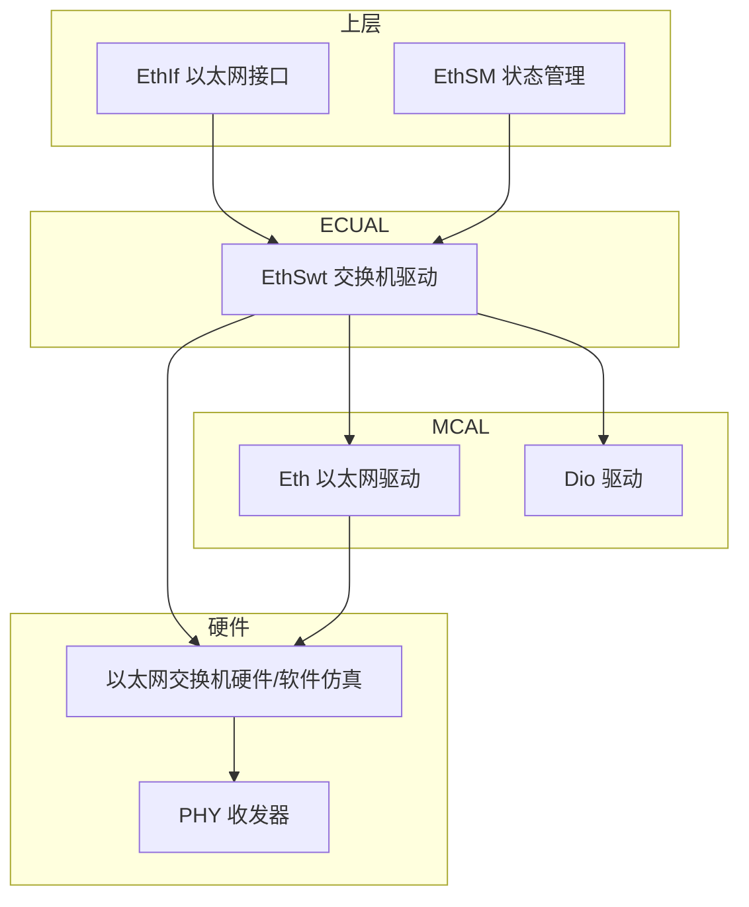
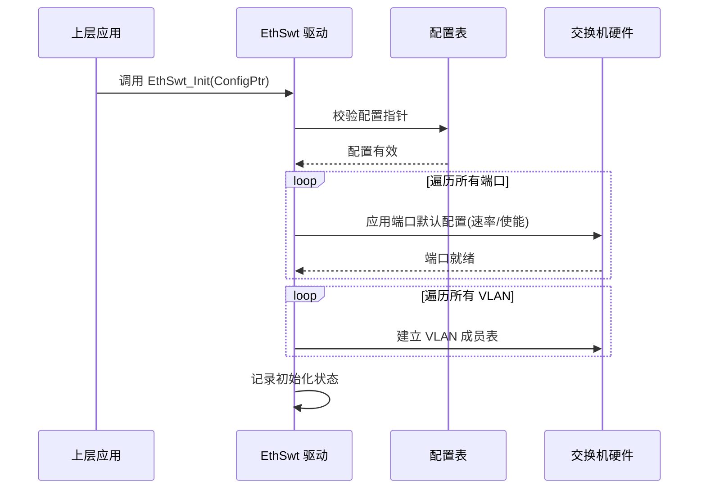
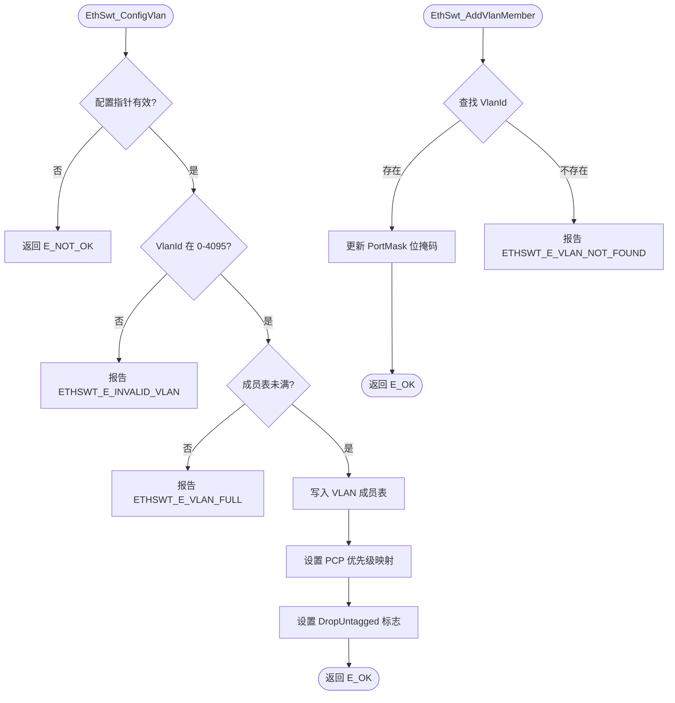
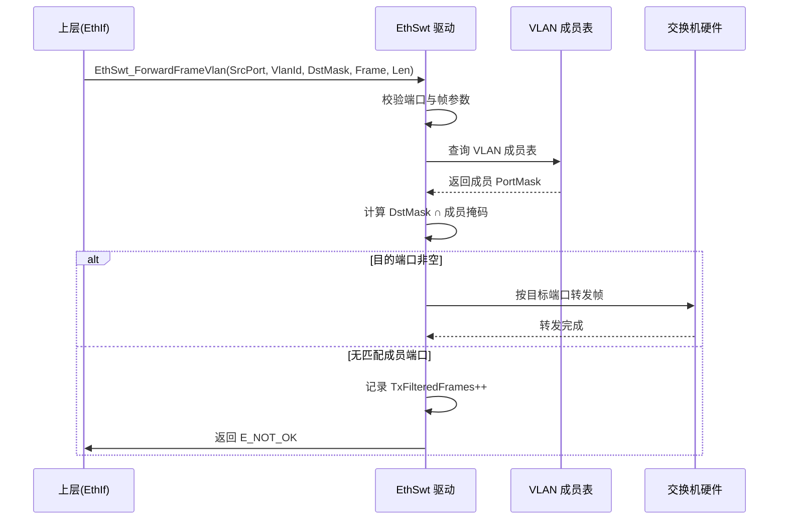
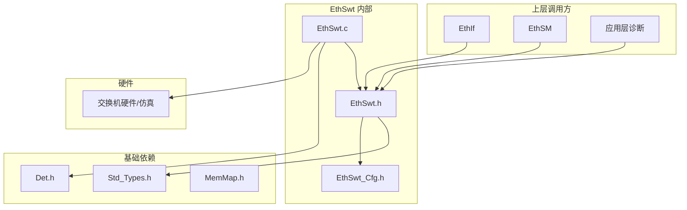

# EthSwt（以太网交换机模块）

<cite>
**本文档引用的文件**
- [EthSwt.h](file://src/bsw/ecual/ethswt/include/EthSwt.h)
- [EthSwt_Cfg.h](file://src/bsw/ecual/ethswt/include/EthSwt_Cfg.h)
- [EthSwt.c](file://src/bsw/ecual/ethswt/src/EthSwt.c)
- [Std_Types.h](file://src/bsw/os/include/Std_Types.h)
- [Det.h](file://src/bsw/services/det/include/Det.h)
</cite>

## 目录
1. [简介](#简介)
2. [项目结构](#项目结构)
3. [核心组件](#核心组件)
4. [架构概览](#架构概览)
5. [详细组件分析](#详细组件分析)
6. [依赖关系分析](#依赖关系分析)
7. [性能考虑](#性能考虑)
8. [故障排除指南](#故障排除指南)
9. [结论](#结论)
10. [附录](#附录)

## 简介

EthSwt（Ethernet Switch Driver，以太网交换机驱动）是 ECUAL 层以太网交换机管理模块，负责管理以太网交换机的端口使能、速率配置、VLAN 管理、MAC 过滤、流控（Pause 帧）和端口镜像等二层交换功能。该模块针对 NXP i.MX8M Mini 平台的以太网交换机硬件（或软件仿真）实现，为上层 EthIf/EthSM 提供统一的交换机配置接口。

本模块实现了完整的 AUTOSAR 风格交换机 API 集合，包括 30+ 服务 ID，覆盖端口管理、VLAN 配置、帧转发、统计信息和故障管理，支持硬件寄存器操作与软件仿真（BaseAddr = 0）双模式。

**章节来源**
- [EthSwt.h:24-100](file://src/bsw/ecual/ethswt/include/EthSwt.h#L24-L100)
- [EthSwt.h:30-45](file://src/bsw/ecual/ethswt/include/EthSwt.h#L30-L45)

## 项目结构

EthSwt 模块源码位于 `src/bsw/ecual/ethswt/`：

```
src/bsw/ecual/ethswt/
├── include/
│   ├── EthSwt.h              # 公共 API 与类型定义（318 行）
│   └── EthSwt_Cfg.h          # 预编译配置（61 行）
└── src/
    └── EthSwt.c              # 交换机驱动实现（1380 行）
```



**图表来源**
- [EthSwt.h:8-20](file://src/bsw/ecual/ethswt/include/EthSwt.h#L8-L20)
- [EthSwt.c:12-20](file://src/bsw/ecual/ethswt/src/EthSwt.c#L12-L20)

**章节来源**
- [EthSwt.h:1-30](file://src/bsw/ecual/ethswt/include/EthSwt.h#L1-L30)
- [EthSwt_Cfg.h:1-61](file://src/bsw/ecual/ethswt/include/EthSwt_Cfg.h#L1-L61)

## 核心组件

EthSwt 模块的核心组件包括：

### 数据类型定义
- **EthSwt_PortIdType**: 端口 ID 类型（uint8）
- **EthSwt_PortEnableType**: 端口使能状态（DISABLED/ENABLED）
- **EthSwt_LinkStateType**: 链路状态（LINK_DOWN/LINK_UP）
- **EthSwt_SpeedType**: 端口速率（AUTO/10M/100M/1000M）
- **EthSwt_DuplexType**: 双工模式（HALF/FULL）
- **EthSwt_MacAddrType**: MAC 地址结构（6 字节）
- **EthSwt_VlanConfigType**: VLAN 配置（VlanId、成员端口位掩码、Tagged 标志、PCP 优先级、DropUntagged）
- **EthSwt_FlowControlConfigType**: 流控配置（TxPauseEnable、RxPauseEnable、高低水位、PauseTime）
- **EthSwt_MirrorConfigType**: 端口镜像配置（源端口掩码、目的端口、使能标志）
- **EthSwt_PortStatsType**: 端口统计（15 项计数器：帧数、字节数、错误、VLAN 帧、过滤帧等）
- **EthSwt_PortConfigType**: 端口配置（速率、双工、使能、MAC、PVID）
- **EthSwt_ConfigType**: 全局配置（端口/VLAN/流控/镜像配置指针）
- **EthSwt_HwConfigType**: 硬件抽象（MMIO 基地址、物理端口数、MTU）

### 配置参数
- 支持多端口交换机，端口配置表由 Lcfg 提供
- VLAN 成员表按 VlanId 组织，支持 0-4095 范围
- 流控高低水位控制 Pause 帧触发

**章节来源**
- [EthSwt.h:107-230](file://src/bsw/ecual/ethswt/include/EthSwt.h#L107-L230)
- [EthSwt.h:230-260](file://src/bsw/ecual/ethswt/include/EthSwt.h#L230-L260)

## 架构概览

EthSwt 采用"端口管理层 → VLAN 管理层 → 转发层 → 硬件抽象层"的分层架构：

```mermaid
graph TB
subgraph "端口管理层"
PORT_EN[EthSwt_SetPortEnable/GetPortEnable]
PORT_SPEED[EthSwt_SetSpeed/GetSpeed]
PORT_LINK[EthSwt_GetLinkState]
PORT_STATS[EthSwt_GetPortStats/ResetStatistics]
end
subgraph "VLAN 管理层"
VLAN_CFG[EthSwt_ConfigVlan/SetVlanConfig/GetVlanConfig]
VLAN_MEMBER[EthSwt_AddVlanMember/RemoveVlanMember]
VLAN_PVID[EthSwt_SetPvid/GetPvid]
VLAN_PCP[EthSwt_SetVidPcpMap/GetVidPcpMap]
end
subgraph "转发与过滤层"
FWD[EthSwt_ForwardFrame/ForwardFrameVlan]
MACF[EthSwt_SetMacFilter/GetMacFilter]
end
subgraph "流控与镜像层"
FC[EthSwt_SetFlowControl/GetFlowControl/SetPauseTime]
MIRROR[EthSwt_SetPortMirroring/GetPortMirroring]
end
subgraph "硬件抽象层"
HW[寄存器操作/软件仿真]
end
PORT_EN --> HW
PORT_SPEED --> HW
VLAN_CFG --> HW
VLAN_MEMBER --> HW
FWD --> HW
MACF --> HW
FC --> HW
MIRROR --> HW
PORT_STATS --> HW
```



**图表来源**
- [EthSwt.c:338-1380](file://src/bsw/ecual/ethswt/src/EthSwt.c#L338-L1380)
- [EthSwt.h:262-318](file://src/bsw/ecual/ethswt/include/EthSwt.h#L262-L318)

## 详细组件分析

### 初始化组件分析

EthSwt_Init() 负责交换机驱动的整体初始化：



**图表来源**
- [EthSwt.c:338-365](file://src/bsw/ecual/ethswt/src/EthSwt.c#L338-L365)

#### 初始化流程详解

1. **参数验证**: 检查配置指针及端口/VLAN 数量合法性
2. **端口配置**: 将 EthSwt_PortConfigType 表中每个端口的速率、双工、使能状态应用到硬件
3. **VLAN 表建立**: 将 EthSwt_VlanConfigType 表中的 VLAN 条目写入成员表
4. **辅助功能**: 应用流控与镜像配置（若提供）

**章节来源**
- [EthSwt.c:338-365](file://src/bsw/ecual/ethswt/src/EthSwt.c#L338-L365)

### VLAN 管理组件分析

VLAN 配置 API 构成交换机二层隔离的核心：



**图表来源**
- [EthSwt.c:558-720](file://src/bsw/ecual/ethswt/src/EthSwt.c#L558-L720)

#### VLAN 管理特性

- **完整生命周期**: ConfigVlan（新增）→ AddVlanMember/RemoveVlanMember（成员维护）→ GetVlanConfig（查询）
- **PVID 管理**: 每个端口独立的 Port VLAN ID，用于无标签帧的分类
- **802.1p 优先级**: VID-PCP 映射支持 0-7 级优先级
- **双模式转发**: ForwardFrame（无 VLAN）与 ForwardFrameVlan（带成员过滤）并行

**章节来源**
- [EthSwt.c:558-720](file://src/bsw/ecual/ethswt/src/EthSwt.c#L558-L720)

### 帧转发组件分析

EthSwt_ForwardFrameVlan() 实现带 VLAN 成员过滤的帧转发：



**图表来源**
- [EthSwt.c:831-974](file://src/bsw/ecual/ethswt/src/EthSwt.c#L831-L974)

#### 转发特性

- **成员过滤**: 只向 VLAN 成员端口转发，实现二层隔离
- **入站过滤**: 非成员端口收到的帧被丢弃并计入 RxFilteredFrames
- **统计跟踪**: 转发、过滤、镜像帧均计入端口统计

**章节来源**
- [EthSwt.c:831-974](file://src/bsw/ecual/ethswt/src/EthSwt.c#L831-L974)

### 统计与监控组件分析

EthSwt_GetPortStats()/EthSwt_GetStatistics() 提供端口级计数器：

| 计数器 | 说明 |
|--------|------|
| TxFrames / RxFrames | 发送/接收帧数 |
| TxBytes / RxBytes | 发送/接收字节数 |
| TxErrors / RxErrors | 收发错误数 |
| Collisions | 冲突计数 |
| DroppedFrames | 丢弃帧数 |
| RxPauseFrames / TxPauseFrames | 流控 Pause 帧收发数 |
| RxVlanFrames / TxVlanFrames | VLAN 帧收发数 |
| RxFilteredFrames / TxFilteredFrames | 入/出站过滤丢弃数 |
| MirroredFrames | 镜像拷贝帧数 |

**章节来源**
- [EthSwt.h:168-190](file://src/bsw/ecual/ethswt/include/EthSwt.h#L168-L190)
- [EthSwt.c:976-1030](file://src/bsw/ecual/ethswt/src/EthSwt.c#L976-L1030)

## 依赖关系分析

EthSwt 的依赖关系：



**图表来源**
- [EthSwt.h:26-28](file://src/bsw/ecual/ethswt/include/EthSwt.h#L26-L28)
- [EthSwt.c:8-16](file://src/bsw/ecual/ethswt/src/EthSwt.c#L8-L16)

### 关键依赖关系

1. **标准类型依赖**: Std_Types.h 提供基础类型
2. **错误检测依赖**: Det.h 提供 DET 错误上报
3. **上层依赖**: EthIf 使用转发/端口 API，EthSM 使用链路状态 API
4. **硬件抽象**: BaseAddr=0 时软件仿真，非零时寄存器操作

**章节来源**
- [EthSwt.h:26-28](file://src/bsw/ecual/ethswt/include/EthSwt.h#L26-L28)
- [EthSwt.h:232-240](file://src/bsw/ecual/ethswt/include/EthSwt.h#L232-L240)

## 性能考虑

### 转发性能

- **软件仿真模式**: 帧转发为内存拷贝操作，性能取决于 CPU 主频与帧长
- **硬件模式**: 转发由交换机硬件完成，EthSwt 仅做配置与统计
- **帧长限制**: 默认 MTU 1522 字节（含 VLAN 标签），超大帧被拒绝

### 流控机制

- **TxPauseEnable**: TX 队列超过 HighWatermark 时发送 Pause 帧
- **RxPauseEnable**: 收到 Pause 帧后暂停 TX
- **PauseTime**: 以 512-bit 时间单位表示的暂停时长

### 资源占用

- 端口统计结构：15 × 8 字节 = 120 字节/端口
- VLAN 成员表：按配置条目数线性增长
- 镜像功能仅复制帧头，开销可控

**章节来源**
- [EthSwt.h:140-150](file://src/bsw/ecual/ethswt/include/EthSwt.h#L140-L150)
- [EthSwt.h:112-118](file://src/bsw/ecual/ethswt/include/EthSwt.h#L112-L118)

## 故障排除指南

### 常见错误代码

| 错误代码 | 错误含义 | 可能原因 | 解决方案 |
|---------|---------|---------|---------|
| ETHSWT_E_PARAM_POINTER (0x01) | 指针无效 | 空指针参数 | 检查调用参数 |
| ETHSWT_E_PARAM_CONFIG (0x02) | 配置无效 | 配置结构错误 | 检查 Lcfg 表 |
| ETHSWT_E_UNINIT (0x03) | 未初始化 | Init 前调用 API | 检查初始化时序 |
| ETHSWT_E_INVALID_PORT (0x05) | 端口无效 | 端口号越界 | 检查端口数量配置 |
| ETHSWT_E_INVALID_SPEED (0x06) | 速率无效 | 速率枚举非法 | 使用 SpeedType 枚举 |
| ETHSWT_E_INVALID_VLAN (0x07) | VLAN 无效 | VlanId 超范围 | 检查 0-4095 |
| ETHSWT_E_VLAN_NOT_FOUND (0x0E) | VLAN 不存在 | 查询未配置 VLAN | 先 ConfigVlan |
| ETHSWT_E_VLAN_FULL (0x0F) | VLAN 表满 | 条目数超限 | 扩大配置 |
| ETHSWT_E_BUFFER_FULL (0x0A) | 缓冲区满 | 转发队列已满 | 稍后重试 |
| ETHSWT_E_PORT_DISABLED (0x09) | 端口禁用 | 在禁用端口上操作 | 先使能端口 |

### 调试建议

1. **端口状态验证**: GetPortEnable/GetLinkState 确认端口工作状态
2. **统计排查**: 观察 FilteredFrames 计数器定位 VLAN 过滤问题
3. **镜像抓包**: 使用 SetPortMirroring 将问题端口流量镜像到调试端口
4. **流控验证**: 检查 Pause 帧计数器确认流控生效

**章节来源**
- [EthSwt.h:83-100](file://src/bsw/ecual/ethswt/include/EthSwt.h#L83-L100)
- [EthSwt.c:20-40](file://src/bsw/ecual/ethswt/src/EthSwt.c#L20-L40)

## 结论

EthSwt 以太网交换机模块是功能全面、设计规范的 ECUAL 交换机管理组件。它提供：

1. **完整的交换机 API**: 30+ 服务覆盖端口、VLAN、转发、流控、镜像全功能
2. **标准 VLAN 支持**: 802.1Q 成员表、PVID、802.1p 优先级完整实现
3. **丰富的统计信息**: 15 项端口计数器支撑网络诊断
4. **硬件/仿真双模式**: 便于开发调试与硬件适配
5. **流控与镜像**: 支撑网络质量保障与故障定位

该模块为车载以太网的多网段隔离、流量管控和网络诊断提供了坚实的 ECUAL 基础。

## 附录

### 典型配置示例

```c
/* 端口配置 */
const EthSwt_PortConfigType EthSwt_Ports[] = {
    {
        .PortId = 0U,
        .Speed = ETHSWT_SPEED_1000MBPS,
        .Duplex = ETHSWT_DUPLEX_FULL,
        .Enable = ETHSWT_PORT_ENABLED,
        .Pvid = 1U
    },
    /* 更多端口 */
};

/* VLAN 配置 */
const EthSwt_VlanConfigType EthSwt_Vlans[] = {
    {
        .VlanId = 1U,
        .PortMask = 0x03U,       /* 端口 0,1 成员 */
        .Tagged = FALSE,
        .VlanPriority = 0U,
        .DropUntagged = FALSE
    }
};

/* 全局配置 */
const EthSwt_ConfigType EthSwt_Config = {
    .NumPorts = 2U,
    .PortConfigs = EthSwt_Ports,
    .NumVlans = 1U,
    .VlanConfigs = EthSwt_Vlans,
    .DevErrorDetect = STD_ON,
    .VersionInfoApi = STD_ON,
    .FlowControlConfigs = NULL_PTR,
    .MirrorConfig = NULL_PTR
};
```

### VLAN 隔离使用流程

1. 通过 ConfigVlan/AddVlanMember 建立 VLAN 成员表
2. 为每个端口设置 PVID（SetPvid）标识无标签帧归属
3. 上层通过 ForwardFrameVlan 带 VLAN ID 转发，交换机自动过滤非成员端口
4. 通过 GetPortStats 监控各 VLAN 流量与过滤计数

**章节来源**
- [EthSwt.h:190-230](file://src/bsw/ecual/ethswt/include/EthSwt.h#L190-L230)
- [EthSwt.c:558-600](file://src/bsw/ecual/ethswt/src/EthSwt.c#L558-L600)
