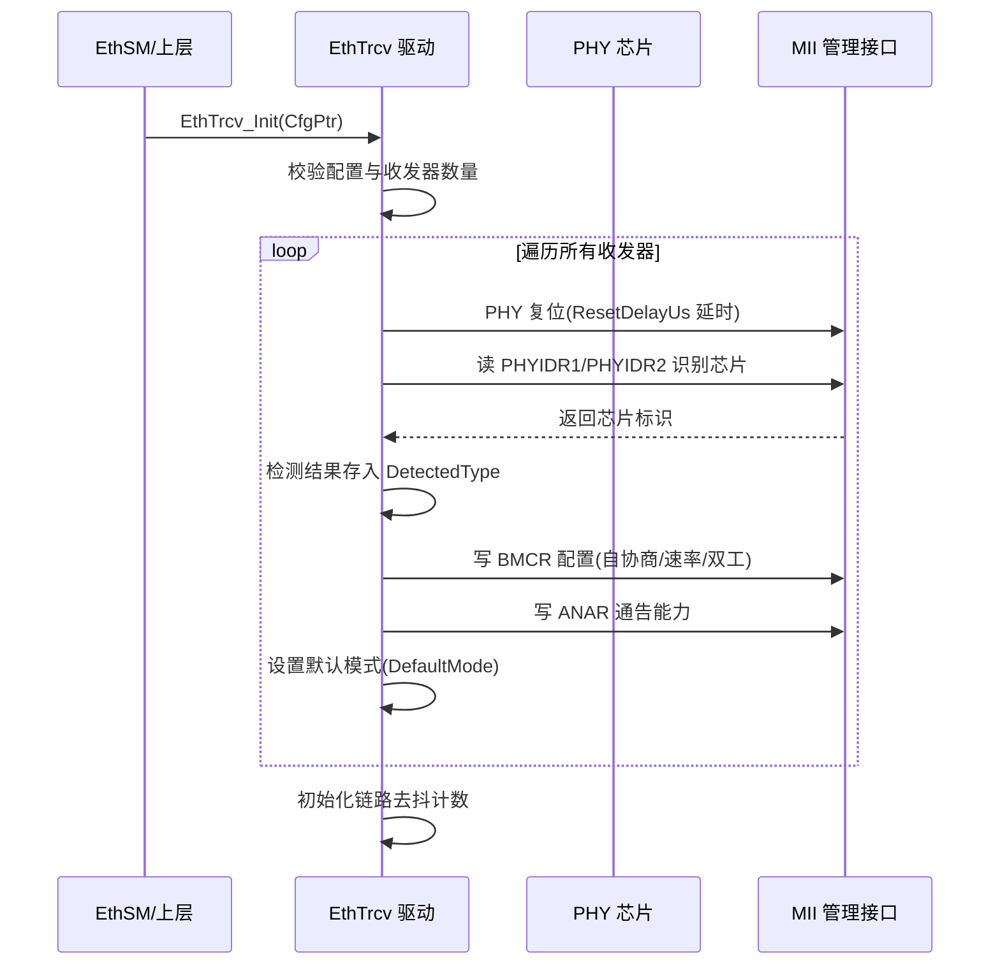
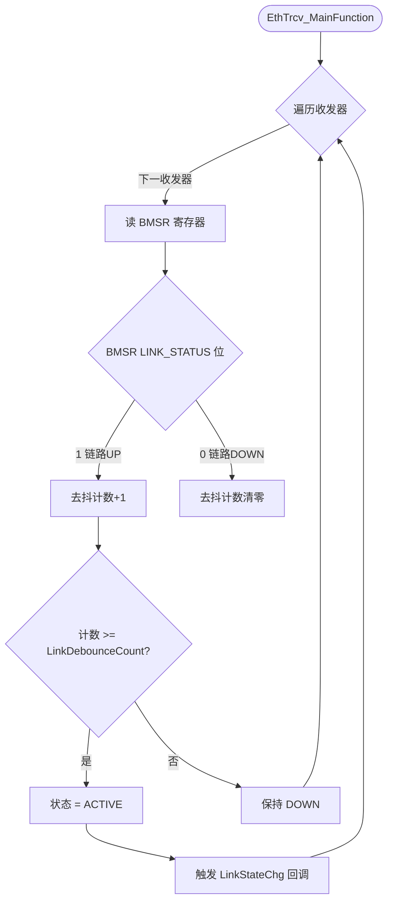
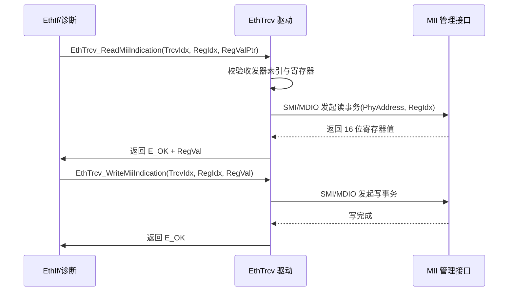

# EthTrcv（以太网收发器模块）

<cite>
**本文档引用的文件**
- [EthTrcv.h](file://src/bsw/ecual/ethtrcv/include/EthTrcv.h)
- [EthTrcv_Cfg.h](file://src/bsw/ecual/ethtrcv/include/EthTrcv_Cfg.h)
- [EthTrcv_MemMap.h](file://src/bsw/ecual/ethtrcv/include/EthTrcv_MemMap.h)
- [EthTrcv.c](file://src/bsw/ecual/ethtrcv/src/EthTrcv.c)
- [EthTrcv_Lcfg.c](file://src/bsw/ecual/ethtrcv/src/EthTrcv_Lcfg.c)
- [Std_Types.h](file://src/bsw/os/include/Std_Types.h)
</cite>

## 目录
1. [简介](#简介)
2. [项目结构](#项目结构)
3. [核心组件](#核心组件)
4. [架构概览](#架构概览)
5. [详细组件分析](#详细组件分析)
6. [依赖关系分析](#依赖关系分析)
7. [性能考虑](#性能考虑)
8. [故障排除指南](#故障排除指南)
9. [结论](#结论)
10. [附录](#附录)

## 简介

EthTrcv（Ethernet Transceiver Driver，以太网收发器驱动）是基于 AUTOSAR 4.4.0 标准开发的 ECUAL 层以太网 PHY 收发器驱动模块，负责管理以太网物理层收发器芯片（PHY）的工作模式、链路状态、PHY 寄存器访问以及唤醒管理。

本模块针对 i.MX8M Mini 平台适配了 10 种主流 PHY 芯片（TJA1100、TJA1101、RTL8211、KSZ8081、KSZ9031、LAN8720、DP83848 等），支持 MII/RMII/RGMII/SGMII 接口，提供收发器模式控制、链路监控、PHY 寄存器读写（MII 管理接口）、信号质量检测和线缆诊断等高级功能。

**章节来源**
- [EthTrcv.h:40-130](file://src/bsw/ecual/ethtrcv/include/EthTrcv.h#L40-L130)
- [EthTrcv.h:16-24](file://src/bsw/ecual/ethtrcv/include/EthTrcv.h#L16-L24)

## 项目结构

EthTrcv 模块源码位于 `src/bsw/ecual/ethtrcv/`：

```
src/bsw/ecual/ethtrcv/
├── include/
│   ├── EthTrcv.h              # 公共 API 与类型定义（491 行）
│   ├── EthTrcv_Cfg.h          # 预编译配置（162 行）
│   └── EthTrcv_MemMap.h       # 内存段映射
└── src/
    ├── EthTrcv.c              # 驱动实现（1094 行）
    └── EthTrcv_Lcfg.c         # 链接时收发器配置
```

```mermaid
graph TB
subgraph "上层"
ETHSM[EthSM 状态管理]
ETHIF[EthIf 接口模块]
end
subgraph "ECUAL"
ETHTRCV[EthTrcv 收发器驱动]
end
subgraph "MCAL"
ETH[Eth 以太网驱动(含 MII 管理)]
DIO[Dio 驱动]
end
subgraph "硬件"
PHY[TJA1100/KSZ8081 等 PHY 芯片]
MAC[以太网 MAC]
end
ETHSM --> ETHTRCV
ETHIF --> ETHTRCV
ETHTRCV --> ETH
ETHTRCV --> DIO
ETHTRCV --> PHY
ETH --> MAC
ETH --> PHY
```

**图表来源**
- [EthTrcv.h:29-36](file://src/bsw/ecual/ethtrcv/include/EthTrcv.h#L29-L36)
- [EthTrcv.c:8-16](file://src/bsw/ecual/ethtrcv/src/EthTrcv.c#L8-L16)

**章节来源**
- [EthTrcv.h:1-40](file://src/bsw/ecual/ethtrcv/include/EthTrcv.h#L1-L40)
- [EthTrcv_Cfg.h:1-162](file://src/bsw/ecual/ethtrcv/include/EthTrcv_Cfg.h#L1-L162)

## 核心组件

EthTrcv 模块的核心组件包括：

### 类型与常量定义
- **EthTrcv_ModeType**: 收发器模式（DOWN/ACTIVE/STANDBY/SLEEP）
- **EthTrcv_LinkStateType**: 链路状态（DOWN/ACTIVE）
- **EthTrcv_BaudRateType**: 速率（10M/100M/1000M）
- **EthTrcv_DuplexModeType**: 双工模式（HALF/FULL）
- **EthTrcv_TypeType**: 收发器类型（10 种 PHY 芯片 + GENERIC）
- **EthTrcv_InterfaceType**: 接口类型（MII/RMII/RGMII/GMII/SGMII/SMI）
- **EthTrcv_WakeupReasonType**: 唤醒原因（POWER_ON/RESET/PIN/SYSERR/WAKEUP/LINK_STATE_CHANGED）
- **EthTrcv_SignalQualityType**: 信号质量（EXCELLENT/GOOD/WEAK/POOR/ERROR 等 7 级）
- **EthTrcv_CableDiagnosticsResultType**: 线缆诊断结果（OK/FAILED/SHORT/OPEN/WRONG_PAIR）

### PHY 寄存器定义
- **BMCR (0x00)**: 基本模式控制寄存器，含 RESET/LOOPBACK/SPEED100/ANEG_ENABLE/POWER_DOWN/ISOLATE/RESTART_ANEG/DUPLEX_FULL/SPEED1000 位定义
- **BMSR (0x01)**: 基本模式状态寄存器，含 100BASETX_FULL/HALF、ANEG_COMPLETE、LINK_STATUS 等位定义
- **PHYIDR1/PHYIDR2**: PHY 标识寄存器
- **ANAR/ANLPAR/ANER**: 自协商寄存器组
- **MMD_ACCESS/MMD_DATA**: MMD 访问寄存器（0x0D/0x0E）

### 配置结构
- **EthTrcv_TrcvConfigType**: 收发器配置（索引、PHY 地址、类型、接口、默认模式、自协商、唤醒、线缆诊断等）
- **EthTrcv_InterfaceConfigType**: 接口配置（接口类型、最大帧长、时钟门控与分频）
- **EthTrcv_ConfigType**: 全局配置（收发器数量、主函数周期、PHY 访问超时、链路去抖计数）

### 回调类型
- **EthTrcv_PhyRegReadCbkType / PhyRegWriteCbkType**: PHY 寄存器读写回调
- **EthTrcv_WakeupIndicationCbkType**: 唤醒指示回调
- **EthTrcv_LinkStateChgCbkType**: 链路状态变化回调

**章节来源**
- [EthTrcv.h:101-240](file://src/bsw/ecual/ethtrcv/include/EthTrcv.h#L101-L240)
- [EthTrcv.h:240-330](file://src/bsw/ecual/ethtrcv/include/EthTrcv.h#L240-L330)

## 架构概览

EthTrcv 采用"API 层 → 收发器管理层 → PHY 寄存器访问层 → 硬件接口层"的分层架构：

```mermaid
graph TB
subgraph "公共 API 层"
INIT[EthTrcv_Init/DeInit]
MODE[EthTrcv_SetTransceiverMode/GetTransceiverMode]
LINK[EthTrcv_GetLinkState/GetBaudRate/GetDuplexMode]
MII[EthTrcv_ReadMiiIndication/WriteMiiIndication]
WAKE[EthTrcv_CheckWakeup]
DIAG[EthTrcv_GetSignalQuality/GetCableDiagnosticsResult]
MAIN[EthTrcv_MainFunction]
VER[EthTrcv_GetVersionInfo]
end
subgraph "收发器管理层"
CFG[收发器配置表]
LINKDB[链路去抖计数]
MODETRACK[模式跟踪]
end
subgraph "PHY 访问层"
PHYREAD[PHY 寄存器读]
PHYWRITE[PHY 寄存器写]
PHYRESET[PHY 复位时序]
end
subgraph "硬件接口"
MIIIF[MII/SMI 管理接口]
INTF[接口时钟配置]
END
INIT --> CFG
MODE --> MODETRACK
MODETRACK --> PHYWRITE
LINK --> LINKDB
LINKDB --> PHYREAD
MII --> PHYREAD
MII --> PHYWRITE
DIAG --> PHYREAD
MAIN --> LINKDB
PHYREAD --> MIIIF
PHYWRITE --> MIIIF
PHYRESET --> MIIIF
```

**图表来源**
- [EthTrcv.c:598-1094](file://src/bsw/ecual/ethtrcv/src/EthTrcv.c#L598-L1094)
- [EthTrcv.h:356-491](file://src/bsw/ecual/ethtrcv/include/EthTrcv.h#L356-L491)

## 详细组件分析

### 初始化组件分析

EthTrcv_Init() 完成 PHY 硬件初始化和自协商配置：



**图表来源**
- [EthTrcv.c:598-625](file://src/bsw/ecual/ethtrcv/src/EthTrcv.c#L598-L625)

#### 初始化流程详解

1. **参数验证**: 检查配置指针与收发器数量合法性
2. **PHY 复位**: 按 ResetDelayUs 执行复位时序
3. **芯片识别**: 读取 PHYIDR 寄存器检测实际芯片类型（DetectedType）
4. **模式配置**: 根据 AutoNegotiationEnable 写入 BMCR/ANAR，或设置固定速率双工
5. **状态就绪**: 链路去抖计数器按 LinkDebounceCount 初始化

**章节来源**
- [EthTrcv.c:598-625](file://src/bsw/ecual/ethtrcv/src/EthTrcv.c#L598-L625)

### 链路状态监控组件分析

EthTrcv_GetLinkState() 与主函数中的链路去抖逻辑：



**图表来源**
- [EthTrcv.c:721-798](file://src/bsw/ecual/ethtrcv/src/EthTrcv.c#L721-L798)
- [EthTrcv_Cfg.h:25-30](file://src/bsw/ecual/ethtrcv/include/EthTrcv_Cfg.h#L25-L30)

#### 链路监控特性

- **去抖保护**: ETHTRCV_LINK_DEBOUNCE_COUNT（3 次）防止链路抖动误判
- **状态回调**: 链路变化时触发 EthTrcv_LinkStateChgCbkType 回调
- **速率/双工查询**: GetBaudRate/GetDuplexMode 从 BMSR/ANLPAR 解析协商结果

**章节来源**
- [EthTrcv.c:721-798](file://src/bsw/ecual/ethtrcv/src/EthTrcv.c#L721-L798)

### PHY 寄存器访问组件分析

EthTrcv_ReadMiiIndication()/WriteMiiIndication() 提供 PHY 寄存器访问：



**图表来源**
- [EthTrcv.c:897-939](file://src/bsw/ecual/ethtrcv/src/EthTrcv.c#L897-L939)

#### 寄存器访问特性

- **标准 PHY 寄存器**: BMCR/BMSR/PHYIDR/ANAR/ANLPAR/ANER/MMD 全套定义
- **MMD 支持**: 通过 MMD_ACCESS/MMD_DATA 间接访问扩展寄存器
- **超时保护**: PHY_ACCESS_TIMEOUT_MS（100ms）防止总线挂死
- **寄存器回调**: PhyRegReadCbkType/PhyRegWriteCbkType 供上层监控

**章节来源**
- [EthTrcv.c:897-939](file://src/bsw/ecual/ethtrcv/src/EthTrcv.c#L897-L939)
- [EthTrcv.h:141-176](file://src/bsw/ecual/ethtrcv/include/EthTrcv.h#L141-L176)

### 高级诊断组件分析

EthTrcv_GetSignalQuality() 与 EthTrcv_GetCableDiagnosticsResult() 提供物理层诊断：

- **信号质量**: 通过 PHY 扩展寄存器（如 TJA1100 符号错误计数器）评估链路质量，输出 7 级枚举
- **线缆诊断**: 调用 PHY 的 TDR（时域反射）功能检测短路、断路、线对错误
- **适用芯片**: TJA1100 系列与支持 TDR 的 PHY（配置 CableDiagnosticsSupport）

**章节来源**
- [EthTrcv.c:940-1094](file://src/bsw/ecual/ethtrcv/src/EthTrcv.c#L940-L1094)
- [EthTrcv.h:330-356](file://src/bsw/ecual/ethtrcv/include/EthTrcv.h#L330-L356)

## 依赖关系分析

EthTrcv 的依赖关系：

```mermaid
graph TB
subgraph "EthTrcv 内部"
ET_H[EthTrcv.h]
ET_CFG[EthTrcv_Cfg.h]
ET_MM[EthTrcv_MemMap.h]
ET_C[EthTrcv.c]
ET_LCFG[EthTrcv_Lcfg.c]
end
subgraph "基础依赖"
STD[Std_Types.h]
END
subgraph "上层调用方"
ETHSM[EthSM]
ETHIF[EthIf]
ETH[Eth MCAL 驱动]
END
subgraph "硬件"
PHY[PHY 芯片]
END
ET_H --> STD
ET_H --> ET_CFG
ET_C --> ET_H
ET_C --> ET_MM
ET_LCFG --> ET_CFG
ETHSM --> ET_H
ETHIF --> ET_H
ETH --> ET_C
ET_C --> PHY
```

**图表来源**
- [EthTrcv.h:29-36](file://src/bsw/ecual/ethtrcv/include/EthTrcv.h#L29-L36)
- [EthTrcv.c:8-16](file://src/bsw/ecual/ethtrcv/src/EthTrcv.c#L8-L16)

### 关键依赖关系

1. **Eth 驱动依赖**: MII 管理接口访问复用 Eth 驱动的 MDIO 通道
2. **EthSM 依赖**: 上层通过 EthTrcv_GetLinkState 驱动状态机
3. **MemMap 依赖**: 使用 EthTrcv_MemMap.h 管理代码/数据内存段
4. **配置依赖**: EthTrcv_Cfg.h 定义收发器类型、接口、超时等

**章节来源**
- [EthTrcv.h:29-36](file://src/bsw/ecual/ethtrcv/include/EthTrcv.h#L29-L36)
- [EthTrcv_Cfg.h:50-70](file://src/bsw/ecual/ethtrcv/include/EthTrcv_Cfg.h#L50-L70)

## 性能考虑

### PHY 访问时序

| 参数 | 默认值 | 说明 |
|------|--------|------|
| ETHTRCV_PHY_ACCESS_TIMEOUT_MS | 100ms | MII 访问超时保护 |
| ETHTRCV_MAIN_FUNCTION_PERIOD_MS | 10ms | 链路轮询周期 |
| ETHTRCV_LINK_DEBOUNCE_COUNT | 3 次 | 链路去抖计数 |
| ResetDelayUs | 配置值 | PHY 复位保持时间 |
| LinkUpDelayMs | 配置值 | 链路建立后延迟 |

### 时钟配置

- **MII 接口**: TX/RX 时钟分频（ETHTRCV_MII_TX_CLK_DIV/RX_CLK_DIV）
- **RGMII 接口**: TX/RX 时钟延迟（ETHTRCV_RGMII_TX_CLK_DELAY_NS 2ns）
- **TJA1100 模式**: COMM_TX_MODE (32) / COMM_RX_MODE (16) 硬件句柄

### 唤醒响应

- WAKEUP_SUPPORT 开启时，总线活动通过 PHY 中断或轮询检测
- 唤醒原因（WUR）在唤醒后通过 GetTransceiverMode 链路恢复流程上报

**章节来源**
- [EthTrcv_Cfg.h:28-48](file://src/bsw/ecual/ethtrcv/include/EthTrcv_Cfg.h#L28-L48)

## 故障排除指南

### 常见错误代码

| 错误代码 | 错误含义 | 可能原因 | 解决方案 |
|---------|---------|---------|---------|
| ETHTRCV_E_NOT_INITIALIZED (0x01) | 未初始化 | Init 前调用 API | 检查初始化时序 |
| ETHTRCV_E_INV_TRCV_IDX (0x02) | 收发器索引无效 | 索引超范围 | 检查 ETHTRCV_NUMBER_OF_TRCVS |
| ETHTRCV_E_INV_TRCV_MODE (0x03) | 模式无效 | 模式枚举非法 | 使用 ModeType 枚举 |
| ETHTRCV_E_INV_POINTER (0x04) | 指针无效 | 空指针传出参数 | 检查调用参数 |
| ETHTRCV_E_INVALID_PHY_ADDR (0x05) | PHY 地址无效 | 地址超 0-31 | 检查 PhyAddress 配置 |
| ETHTRCV_E_INVALID_REG_IDX (0x06) | 寄存器无效 | 寄存器索引非法 | 使用标准寄存器宏 |
| ETHTRCV_E_TIMEOUT (0x08) | 访问超时 | MII 总线挂死 | 检查 PHY 供电/复位 |
| ETHTRCV_E_INIT_FAILED (0x09) | 初始化失败 | PHY 识别失败 | 检查芯片类型配置 |

### 调试建议

1. **芯片识别验证**: 读取 PHYIDR1/PHYIDR2 确认 DetectedType 与配置一致
2. **寄存器排查**: 使用 ReadMiiIndication 检查 BMSR 自协商完成位
3. **链路跟踪**: 观察 LinkStateChg 回调触发是否与物理插拔一致
4. **信号质量**: 链路弱时使用 GetSignalQuality 评估物理层状况

**章节来源**
- [EthTrcv.h:88-99](file://src/bsw/ecual/ethtrcv/include/EthTrcv.h#L88-L99)
- [EthTrcv.c:20-40](file://src/bsw/ecual/ethtrcv/src/EthTrcv.c#L20-L40)

## 结论

EthTrcv 以太网收发器驱动模块是功能完备、硬件适配广泛的 ECUAL PHY 管理组件。它提供：

1. **多芯片支持**: 10 种主流 PHY 芯片自动识别与适配
2. **完整模式管理**: DOWN/ACTIVE/STANDBY/SLEEP 四模式控制
3. **PHY 寄存器访问**: MII 管理接口读写 + MMD 扩展支持
4. **物理层诊断**: 信号质量评估与线缆 TDR 诊断
5. **唤醒管理**: 与 EthSM 集成的唤醒检测与上报

该模块是车载以太网物理层管理的核心 ECUAL 组件，为 EthSM 状态机提供链路信息，为诊断提供物理层视图。

## 附录

### 典型配置示例

```c
/* EthTrcv_Lcfg.c 收发器配置 */
const EthTrcv_TrcvConfigType EthTrcv_TrcvConfigs[ETHTRCV_NUMBER_OF_TRCVS] = {
    {
        .TrcvIdx = 0U,
        .CtrlIdx = 0U,
        .PhyAddress = ETHTRCV_TRCV0_PHY_ADDRESS,   /* 0 */
        .TrcvType = ETHTRCV_TRCV0_TYPE,            /* TJA1100 */
        .InterfaceType = ETHTRCV_TRCV0_INTERFACE,  /* RMII */
        .AccessInterface = ETHTRCV_ACCESS_MII,
        .DefaultMode = ETHTRCV_TRCV0_DEFAULT_MODE, /* ACTIVE */
        .AutoNegotiationEnable = ETHTRCV_TRCV0_AUTO_NEG_ENABLE,
        .FixedSpeed = ETHTRCV_TRCV0_FIXED_SPEED,   /* 100MBIT */
        .FixedDuplexMode = ETHTRCV_TRCV0_FIXED_DUPLEX,
        .WakeupSupport = ETHTRCV_TRCV0_WAKEUP_SUPPORT,
        .WakeupMode = ETHTRCV_TRCV0_WAKEUP_MODE,
        .CableDiagnosticsSupport = ETHTRCV_TRCV0_CABLE_DIAG_ENABLE,
        .SignalQualitySupport = TRUE,
        .ResetDelayUs = 1000U,
        .LinkUpDelayMs = 100U,
        .VendorSpecificConfig = NULL_PTR
    }
};

const EthTrcv_ConfigType EthTrcv_Config = {
    .NumberOfTransceivers = ETHTRCV_NUMBER_OF_TRCVS,
    .TransceiverConfig = EthTrcv_TrcvConfigs,
    .InterfaceConfig = NULL_PTR,
    .MainFunctionPeriodMs = ETHTRCV_MAIN_FUNCTION_PERIOD_MS,
    .PhyAccessTimeoutMs = ETHTRCV_PHY_ACCESS_TIMEOUT_MS,
    .LinkDebounceCount = ETHTRCV_LINK_DEBOUNCE_COUNT,
    .DevErrorDetect = STD_ON,
    .VersionInfoApi = STD_ON,
    .WakeupSupport = STD_ON,
    .CableDiagnosticsSupport = STD_ON,
    .SignalQualitySupport = STD_ON
};
```

### 与 EthSM 的协作流程

1. EthSM 进入 WAIT_TRCVLINK 后周期调用 GetLinkState
2. 链路建立（去抖后 ACTIVE）→ EthSM 进入 WAIT_ONLINE
3. 链路丢失触发回调 → EthSM 降级回 WAIT_TRCVLINK
4. 网络休眠时 SetTransceiverMode(SLEEP) 降低 PHY 功耗

**章节来源**
- [EthTrcv_Lcfg.c:1-162](file://src/bsw/ecual/ethtrcv/src/EthTrcv_Lcfg.c#L1-L162)
- [EthTrcv.h:250-330](file://src/bsw/ecual/ethtrcv/include/EthTrcv.h#L250-L330)
