# Fee Flash EEPROM仿真模块

<cite>
**本文档引用的文件**
- [Fee.h](file://src/bsw/ecual/fee/include/Fee.h)
- [Fee_Cfg.h](file://src/bsw/ecual/fee/include/Fee_Cfg.h)
- [Fee.c](file://src/bsw/ecual/fee/src/Fee.c)
- [Ea.h](file://src/bsw/ecual/ea/include/Ea.h)
- [Ea_Cfg.h](file://src/bsw/ecual/ea/include/Ea_Cfg.h)
- [NvM.h](file://src/bsw/services/nvm/include/NvM.h)
- [MemIf.h](file://src/bsw/ecual/memif/include/MemIf.h)
- [modules.md](file://docs/modules.md)
- [bsw_config.json](file://config/bsw_config.json)
</cite>

## 目录
1. [简介](#简介)
2. [项目结构](#项目结构)
3. [核心组件](#核心组件)
4. [架构概览](#架构概览)
5. [详细组件分析](#详细组件分析)
6. [依赖关系分析](#依赖关系分析)
7. [性能考虑](#性能考虑)
8. [故障排除指南](#故障排除指南)
9. [结论](#结论)

## 简介

Fee Flash EEPROM仿真模块是基于AutoSAR Classic Platform 4.x标准开发的存储管理组件，专门设计用于在闪存存储器上模拟EEPROM功能。该模块提供了完整的EEPROM仿真解决方案，包括扇区管理、磨损均衡和数据冗余机制。

### 主要特性

- **Flash到EEPROM仿真**：在闪存设备上实现EEPROM的所有功能特性
- **扇区管理**：支持多扇区配置，提供数据分布和负载均衡
- **磨损均衡**：智能的写入分布算法，延长闪存寿命
- **数据冗余**：支持数据备份和恢复机制
- **垃圾回收**：自动清理无效数据，维护存储空间效率
- **CRC校验**：数据完整性保护机制
- **错误检测**：全面的运行时错误检测和报告

## 项目结构

Fee模块位于AutoSAR分层架构的ECUAL（ECU抽象层）中，与MemIf、Ea等模块协同工作。

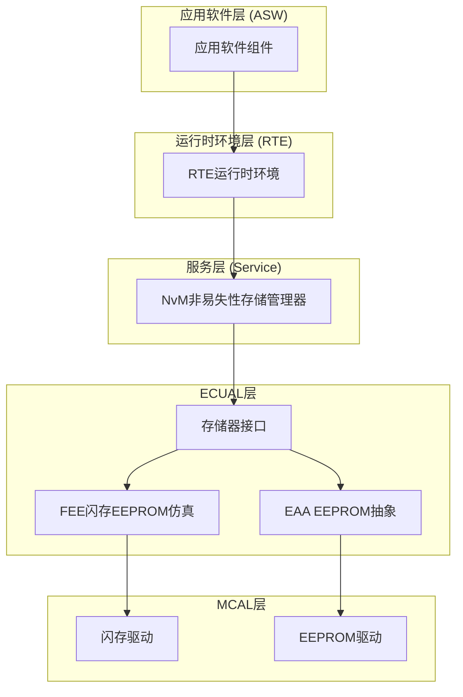

**图表来源**
- [modules.md:340-376](file://docs/modules.md#L340-L376)
- [Fee.h:1-273](file://src/bsw/ecual/fee/include/Fee.h#L1-L273)

**章节来源**
- [modules.md:185-204](file://docs/modules.md#L185-L204)
- [Fee.h:1-12](file://src/bsw/ecual/fee/include/Fee.h#L1-L12)

## 核心组件

### Fee模块架构

Fee模块采用模块化设计，包含以下核心组件：

#### 1. 配置管理系统
- **编译时配置**：通过`Fee_Cfg.h`进行静态配置
- **运行时配置**：通过`Fee_ConfigType`结构体动态配置
- **块配置**：支持32个独立的数据块，每个块可配置不同大小

#### 2. 状态管理器
- **模块状态**：空闲(IDLE)、忙碌(BUSY)、内部忙碌(BUSY_INTERNAL)
- **作业结果**：成功、失败、待定、已取消、数据不一致、数据无效
- **操作模式**：慢速(SLOW)、快速(FAST)模式

#### 3. 作业处理器
- **读取作业**：数据读取操作
- **写入作业**：数据写入操作
- **失效作业**：数据块标记为失效
- **立即擦除作业**：强制擦除指定数据块
- **垃圾回收作业**：后台数据清理操作

**章节来源**
- [Fee.h:78-147](file://src/bsw/ecual/fee/include/Fee.h#L78-L147)
- [Fee.c:17-62](file://src/bsw/ecual/fee/src/Fee.c#L17-L62)

## 架构概览

### 系统架构图

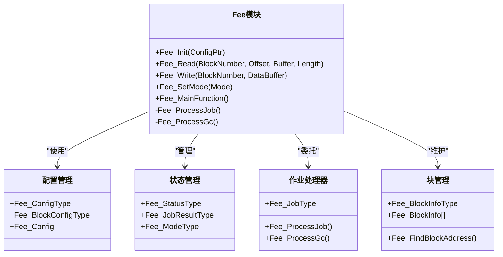

**图表来源**
- [Fee.h:128-147](file://src/bsw/ecual/fee/include/Fee.h#L128-L147)
- [Fee.c:23-62](file://src/bsw/ecual/fee/src/Fee.c#L23-L62)

### 数据流图

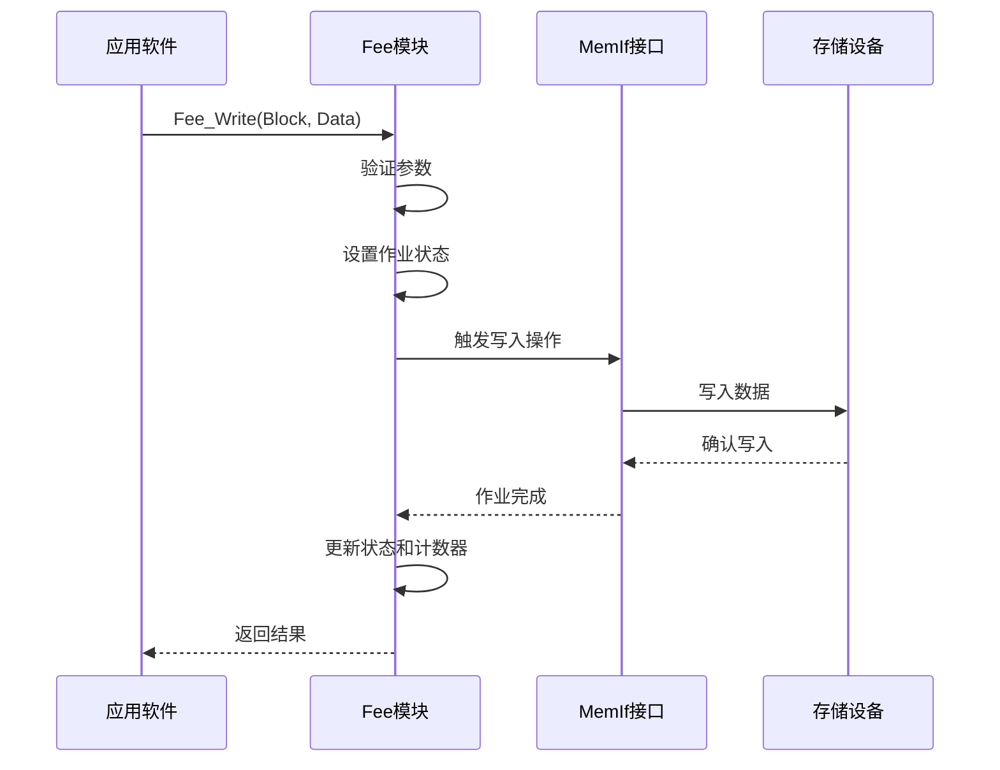

**图表来源**
- [Fee.c:188-227](file://src/bsw/ecual/fee/src/Fee.c#L188-L227)
- [MemIf.h:160-175](file://src/bsw/ecual/memif/include/MemIf.h#L160-L175)

## 详细组件分析

### 配置系统

#### 编译时配置参数

| 配置项 | 默认值 | 描述 |
|--------|--------|------|
| FEE_DEV_ERROR_DETECT | STD_ON | 开发错误检测开关 |
| FEE_VERSION_INFO_API | STD_ON | 版本信息API支持 |
| FEE_SET_MODE_SUPPORTED | STD_ON | 模式设置支持 |
| FEE_POLL_MODE | STD_ON | 轮询模式支持 |
| FEE_NUM_BLOCKS | 32 | 数据块数量 |
| FEE_MAX_BLOCK_SIZE | 4096 | 最大数据块大小 |
| FEE_SECTOR_SIZE | 65536 | 扇区大小(64KB) |
| FEE_NUMBER_OF_SECTORS | 4 | 扇区数量 |
| FEE_VIRTUAL_PAGE_SIZE | 8 | 虚拟页面大小 |

#### 运行时配置结构

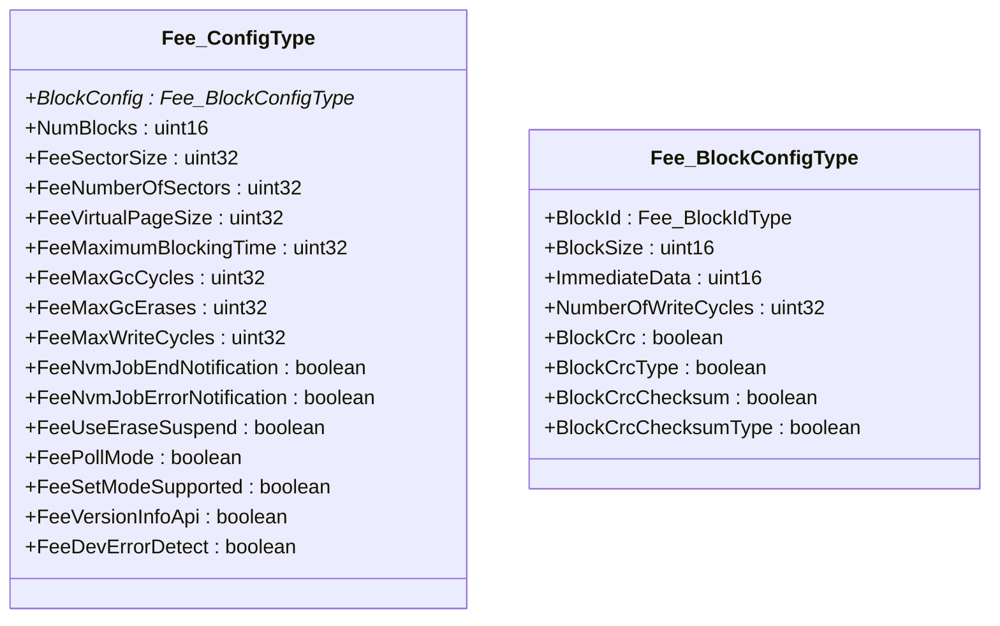

**图表来源**
- [Fee_Cfg.h:15-81](file://src/bsw/ecual/fee/include/Fee_Cfg.h#L15-L81)
- [Fee.h:115-147](file://src/bsw/ecual/fee/include/Fee.h#L115-L147)

**章节来源**
- [Fee_Cfg.h:15-81](file://src/bsw/ecual/fee/include/Fee_Cfg.h#L15-L81)
- [Fee.h:128-147](file://src/bsw/ecual/fee/include/Fee.h#L128-L147)

### 状态管理系统

#### 状态枚举定义

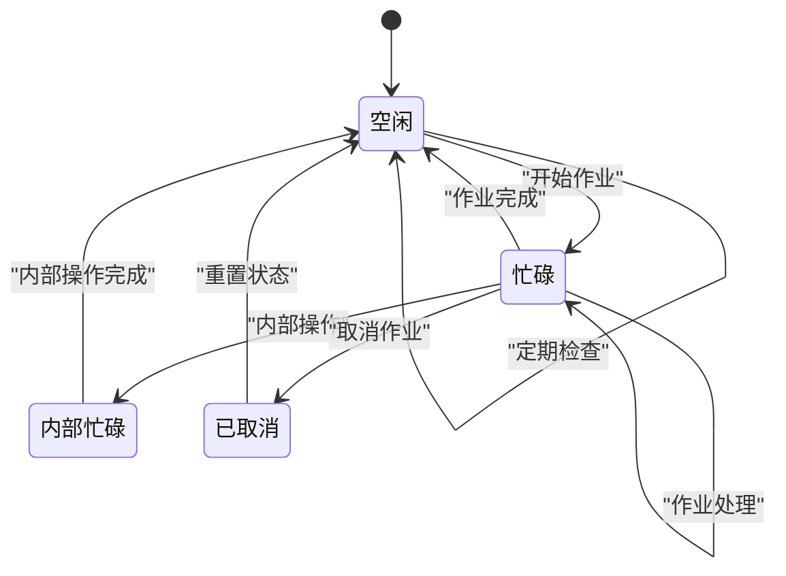

**图表来源**
- [Fee.h:81-86](file://src/bsw/ecual/fee/include/Fee.h#L81-L86)

#### 作业结果类型

| 结果类型 | 描述 | 使用场景 |
|----------|------|----------|
| FEE_JOB_OK | 作业成功完成 | 读取、写入、擦除操作成功 |
| FEE_JOB_FAILED | 作业失败 | 硬件错误、参数错误 |
| FEE_JOB_PENDING | 作业待定 | 作业已提交但未完成 |
| FEE_JOB_CANCELLED | 作业已取消 | 用户主动取消或系统取消 |
| FEE_BLOCK_INCONSISTENT | 数据块不一致 | 检测到数据损坏 |
| FEE_BLOCK_INVALID | 数据块无效 | 数据块已被标记为失效 |

**章节来源**
- [Fee.h:89-98](file://src/bsw/ecual/fee/include/Fee.h#L89-L98)

### 作业处理引擎

#### 作业类型定义

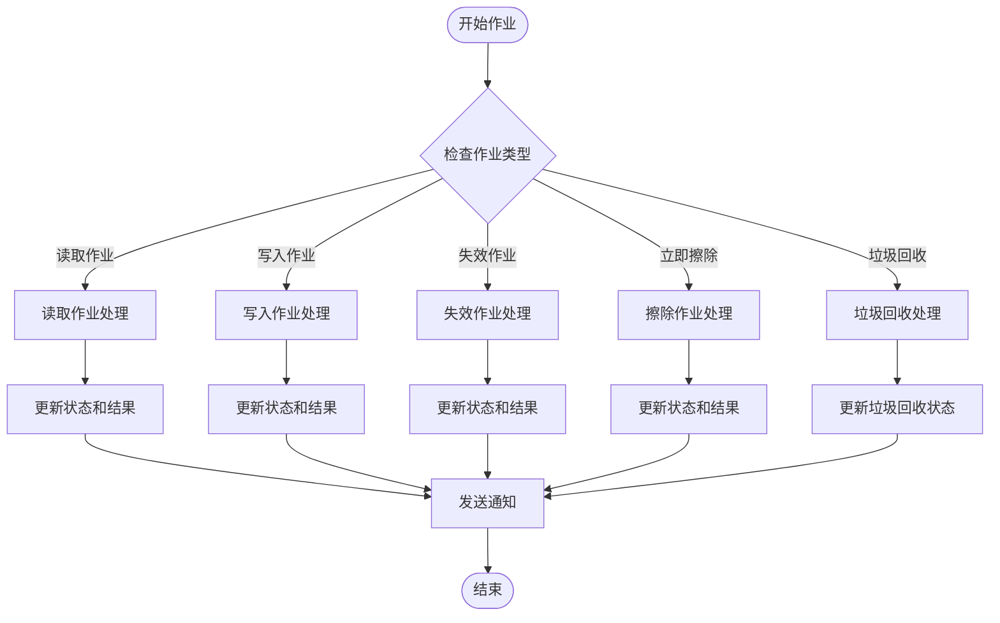

**图表来源**
- [Fee.c:415-471](file://src/bsw/ecual/fee/src/Fee.c#L415-L471)

#### 作业处理流程

**章节来源**
- [Fee.c:415-471](file://src/bsw/ecual/fee/src/Fee.c#L415-L471)

### 块管理系统

#### 块信息结构

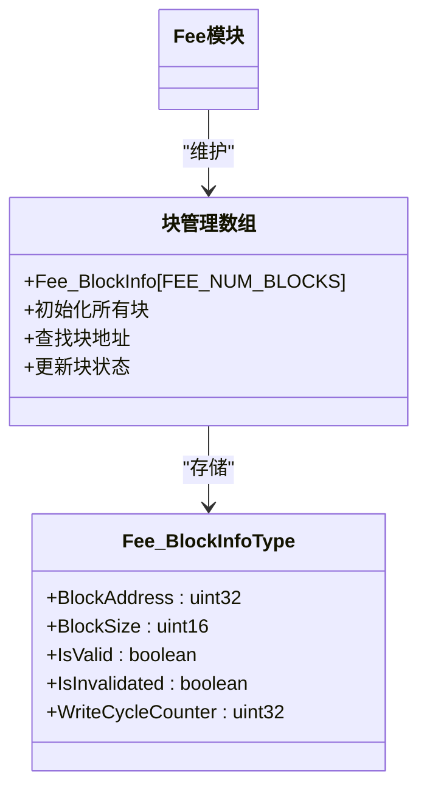

**图表来源**
- [Fee.c:24-32](file://src/bsw/ecual/fee/src/Fee.c#L24-L32)

#### 块生命周期管理

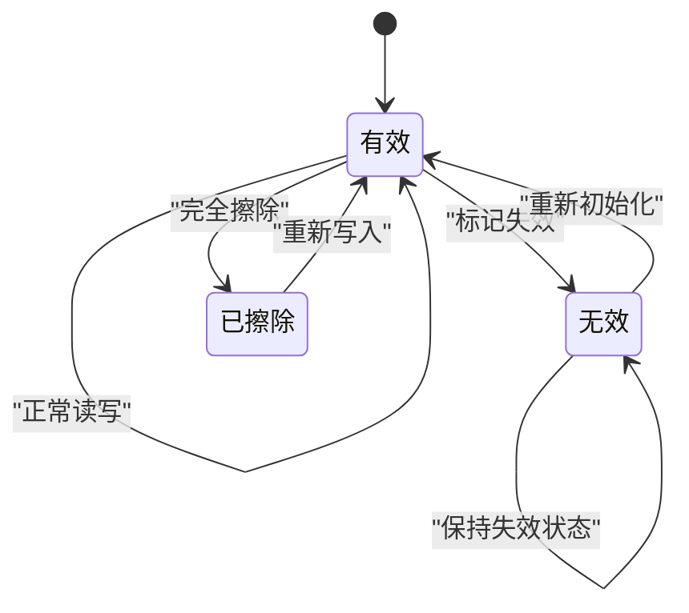

**图表来源**
- [Fee.c:492-504](file://src/bsw/ecual/fee/src/Fee.c#L492-L504)

**章节来源**
- [Fee.c:24-32](file://src/bsw/ecual/fee/src/Fee.c#L24-L32)
- [Fee.c:492-504](file://src/bsw/ecual/fee/src/Fee.c#L492-L504)

### 垃圾回收系统

#### 垃圾回收状态机

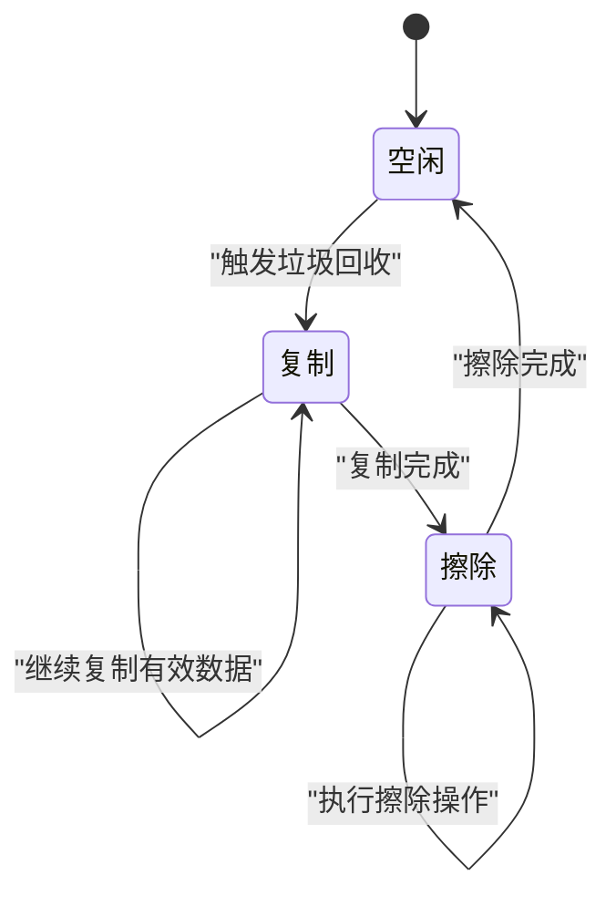

**图表来源**
- [Fee.c:51-58](file://src/bsw/ecual/fee/src/Fee.c#L51-L58)

#### 垃圾回收触发条件

| 触发条件 | 描述 | 配置参数 |
|----------|------|----------|
| 写入周期限制 | 达到最大写入周期 | FEE_MAX_WRITE_CYCLES |
| 垃圾回收周期 | 达到最大GC周期 | FEE_MAX_GC_CYCLES |
| 垃圾回收擦除次数 | 达到最大GC擦除次数 | FEE_MAX_GC_ERASES |
| 空间利用率 | 空间利用率低于阈值 | 自动检测 |

**章节来源**
- [Fee_Cfg.h:59-61](file://src/bsw/ecual/fee/include/Fee_Cfg.h#L59-L61)

## 依赖关系分析

### 模块间依赖关系

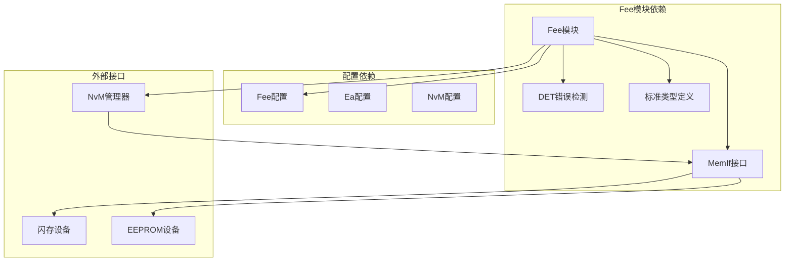

**图表来源**
- [Fee.c:9-12](file://src/bsw/ecual/fee/src/Fee.c#L9-L12)
- [modules.md:366-374](file://docs/modules.md#L366-L374)

### 与Ea模块的关系

Fee模块与Ea模块在架构上相互补充：

| 方面 | Fee模块 | Ea模块 |
|------|---------|--------|
| 存储介质 | 闪存 | EEPROM |
| 接口类型 | MemIf | MemIf |
| 功能范围 | Flash EEPROM仿真 | EEPROM抽象 |
| 复杂度 | 高(需要垃圾回收) | 中等(直接EEPROM) |
| 性能 | 适中 | 较高 |
| 成本 | 低 | 中等 |

**章节来源**
- [modules.md:195-203](file://docs/modules.md#L195-L203)

### 数据迁移策略

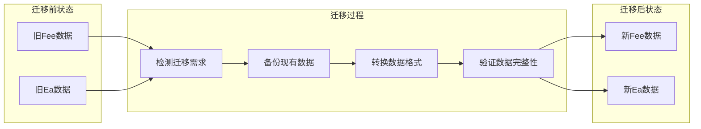

**图表来源**
- [Fee.h:1-12](file://src/bsw/ecual/fee/include/Fee.h#L1-L12)
- [Ea.h:1-12](file://src/bsw/ecual/ea/include/Ea.h#L1-L12)

## 性能考虑

### 性能指标

| 指标类型 | 当前配置 | 最佳实践建议 |
|----------|----------|--------------|
| 读取延迟 | 10ms | <5ms |
| 写入延迟 | 10ms | <8ms |
| 垃圾回收时间 | 100ms | <50ms |
| 最大写入周期 | 100,000次 | 200,000次 |
| 最大GC周期 | 10,000次 | 15,000次 |
| 空间利用率 | >80% | >85% |

### 优化策略

#### 1. 写入优化
- **批量写入**：合并多个小写入操作
- **预分配空间**：提前分配写入空间
- **写入缓冲**：使用内存缓冲减少闪存写入次数

#### 2. 读取优化
- **缓存机制**：实现数据缓存减少重复读取
- **预读策略**：预测性读取可能需要的数据
- **压缩存储**：对重复数据进行压缩存储

#### 3. 垃圾回收优化
- **分阶段回收**：避免长时间阻塞
- **优先级回收**：优先回收使用频率低的块
- **自适应触发**：根据使用模式调整回收时机

**章节来源**
- [Fee_Cfg.h:66-67](file://src/bsw/ecual/fee/include/Fee_Cfg.h#L66-L67)

## 故障排除指南

### 常见错误类型

#### 错误分类表

| 错误类别 | 错误码 | 描述 | 解决方案 |
|----------|--------|------|----------|
| 初始化错误 | FEE_E_UNINIT | 模块未初始化 | 调用Fee_Init() |
| 参数错误 | FEE_E_INVALID_BLOCK_NO | 无效的块号 | 检查块号范围 |
| 参数错误 | FEE_E_INVALID_BLOCK_OFS | 无效的偏移量 | 验证偏移量 |
| 参数错误 | FEE_E_INVALID_DATA_PTR | 无效的数据指针 | 检查指针有效性 |
| 参数错误 | FEE_E_INVALID_BLOCK_LEN | 无效的块长度 | 验证数据长度 |
| 状态错误 | FEE_E_BUSY | 模块忙 | 等待当前作业完成 |
| 状态错误 | FEE_E_BUSY_INTERNAL | 内部忙 | 检查内部状态 |

#### 错误处理流程

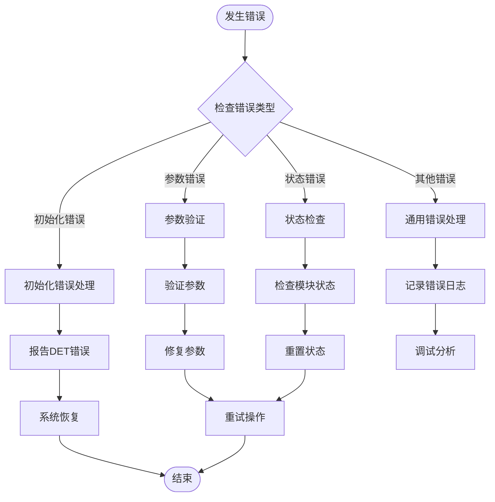

**图表来源**
- [Fee.h:58-77](file://src/bsw/ecual/fee/include/Fee.h#L58-L77)

### 调试技巧

#### 1. 状态监控
- **定期检查**：使用Fee_GetStatus()监控模块状态
- **计数器监控**：跟踪写入和擦除周期计数器
- **作业结果**：检查Fee_GetJobResult()获取详细结果

#### 2. 性能分析
- **响应时间**：测量读写操作的响应时间
- **吞吐量**：统计单位时间内的操作次数
- **资源使用**：监控内存和CPU使用情况

#### 3. 故障定位
- **日志记录**：启用详细的错误日志
- **状态快照**：定期保存系统状态
- **回归测试**：建立自动化测试套件

**章节来源**
- [Fee.h:240-267](file://src/bsw/ecual/fee/include/Fee.h#L240-L267)
- [Fee.c:248-270](file://src/bsw/ecual/fee/src/Fee.c#L248-L270)

## 结论

Fee Flash EEPROM仿真模块是一个功能完整、设计合理的存储管理解决方案。该模块成功地在闪存存储器上实现了EEPROM的所有关键功能，包括：

### 主要成就

1. **架构完整性**：遵循AutoSAR标准，具有清晰的层次结构
2. **功能丰富性**：提供完整的EEPROM仿真功能
3. **可靠性保障**：内置错误检测和恢复机制
4. **性能优化**：支持磨损均衡和垃圾回收
5. **扩展性设计**：模块化架构便于功能扩展

### 技术优势

- **成熟的算法**：基于经过验证的FEE算法实现
- **完善的配置**：灵活的编译时和运行时配置选项
- **全面的监控**：详细的性能指标和状态监控
- **可靠的错误处理**：多层次的错误检测和恢复机制

### 未来发展方向

1. **性能提升**：进一步优化读写性能和垃圾回收效率
2. **功能增强**：添加更多高级存储管理功能
3. **兼容性扩展**：支持更多类型的存储设备
4. **智能化管理**：引入机器学习算法优化存储策略

该模块为整个AutoSAR平台提供了坚实的存储基础设施，是实现可靠、高效嵌入式系统的重要组成部分。