# FrIf FlexRay接口模块

<cite>
**本文档引用的文件**
- [FrIf.h](file://src/bsw/ecual/frif/include/FrIf.h)
- [FrIf.c](file://src/bsw/ecual/frif/src/FrIf.c)
- [FrIf_Cfg.h](file://src/bsw/ecual/frif/include/FrIf_Cfg.h)
- [modules.md](file://docs/modules.md)
- [api-reference.md](file://docs/api-reference.md)
- [Os.h](file://src/bsw/os/include/Os.h)
- [bsw_config.json](file://config/bsw_config.json)
</cite>

## 目录
1. [简介](#简介)
2. [项目结构](#项目结构)
3. [核心组件](#核心组件)
4. [架构概览](#架构概览)
5. [详细组件分析](#详细组件分析)
6. [依赖关系分析](#依赖关系分析)
7. [性能考虑](#性能考虑)
8. [故障排除指南](#故障排除指南)
9. [结论](#结论)
10. [附录](#附录)

## 简介

FrIf FlexRay接口模块是YuleTech AutoSAR BSW平台中的关键组件，遵循AutoSAR Classic Platform 4.x标准实现FlexRay总线通信接口。该模块提供了完整的FlexRay协议栈抽象，包括节点管理、时间槽分配和多播通信支持。

FlexRay作为一种高性能车载网络协议，专为汽车电子系统设计，支持确定性通信和高可靠性要求。FrIf模块通过ECU抽象层(ECUAL)为上层应用提供标准化的接口，屏蔽底层硬件差异。

## 项目结构

FrIf模块位于BSW(基础软件)层的ECUAL层中，采用标准的AutoSAR分层架构：

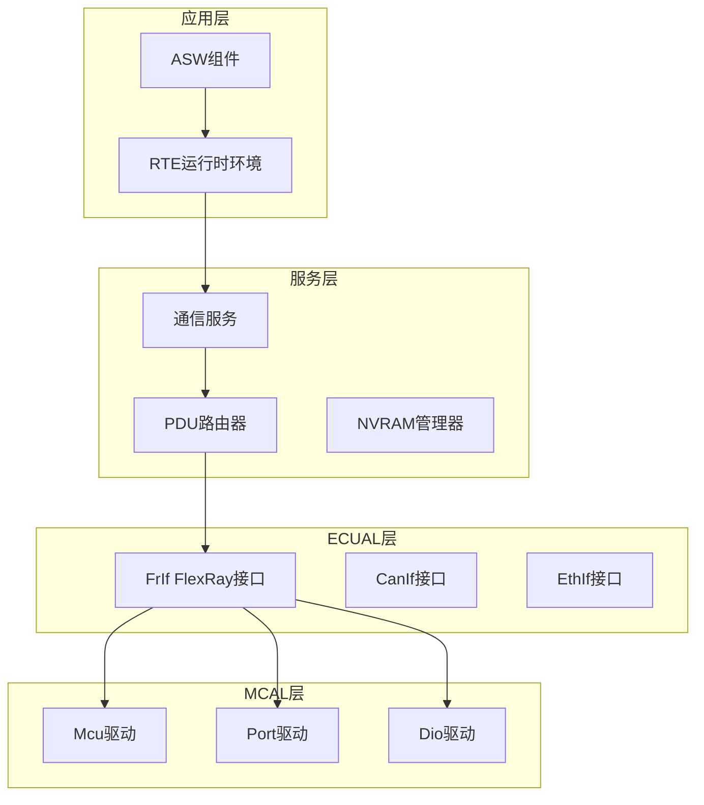

**图表来源**
- [modules.md:558-623](file://docs/modules.md#L558-L623)

**章节来源**
- [modules.md:205-213](file://docs/modules.md#L205-L213)

## 核心组件

FrIf模块的核心组件包括：

### 1. 接口定义组件
- **FrIf.h**: 主要头文件，定义所有公共接口、数据类型和常量
- **FrIf_Cfg.h**: 配置头文件，包含编译时常量和运行时配置参数

### 2. 实现组件
- **FrIf.c**: 主要实现文件，包含所有FlexRay接口函数的具体实现

### 3. 配置组件
- **FrIf_Config**: 全局配置结构体，定义系统级FlexRay配置
- **FrIf_LpduConfigType**: LPDU(本地协议数据单元)配置结构体
- **FrIf_ControllerConfigType**: 控制器配置结构体

**章节来源**
- [FrIf.h:176-217](file://src/bsw/ecual/frif/include/FrIf.h#L176-L217)
- [FrIf_Cfg.h:1-93](file://src/bsw/ecual/frif/include/FrIf_Cfg.h#L1-L93)

## 架构概览

FrIf模块采用分层架构设计，确保了良好的模块化和可维护性：

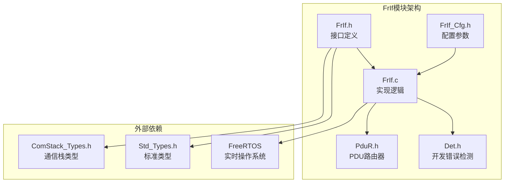

**图表来源**
- [FrIf.h:16-22](file://src/bsw/ecual/frif/include/FrIf.h#L16-L22)
- [FrIf.c:9-12](file://src/bsw/ecual/frif/src/FrIf.c#L9-L12)

### 协议栈层次结构

FlexRay协议栈在FrIf模块中按层次组织：

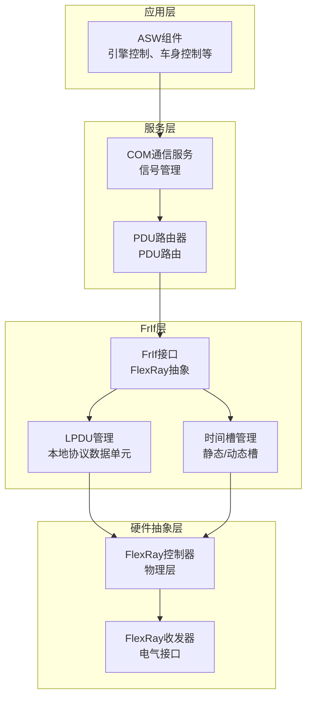

**图表来源**
- [FrIf.h:205-217](file://src/bsw/ecual/frif/include/FrIf.h#L205-L217)
- [FrIf_Cfg.h:38-45](file://src/bsw/ecual/frif/include/FrIf_Cfg.h#L38-L45)

## 详细组件分析

### 1. 节点管理系统

FrIf模块实现了完整的节点管理功能，支持多控制器配置：

#### 控制器状态管理
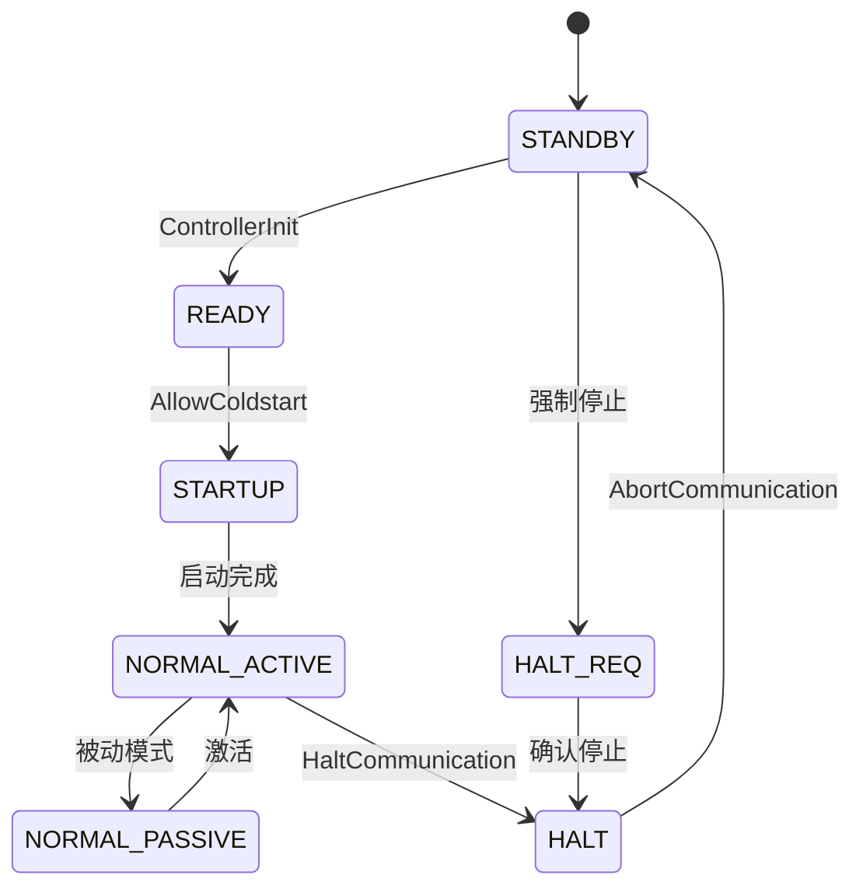

**图表来源**
- [FrIf.h:109-122](file://src/bsw/ecual/frif/include/FrIf.h#L109-L122)
- [FrIf.c:320-385](file://src/bsw/ecual/frif/src/FrIf.c#L320-L385)

#### 节点配置结构
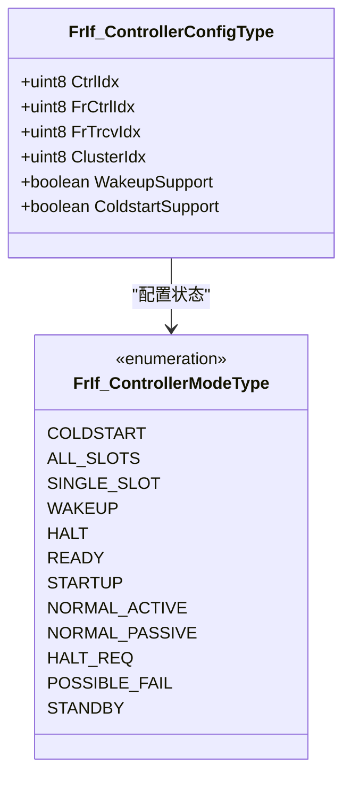

**图表来源**
- [FrIf.h:178-185](file://src/bsw/ecual/frif/include/FrIf.h#L178-L185)
- [FrIf.h:109-122](file://src/bsw/ecual/frif/include/FrIf.h#L109-L122)

**章节来源**
- [FrIf.c:106-125](file://src/bsw/ecual/frif/src/FrIf.c#L106-L125)
- [FrIf.h:178-185](file://src/bsw/ecual/frif/include/FrIf.h#L178-L185)

### 2. 时间槽分配系统

FrIf模块实现了灵活的时间槽分配机制，支持静态和动态槽配置：

#### 时间槽配置结构
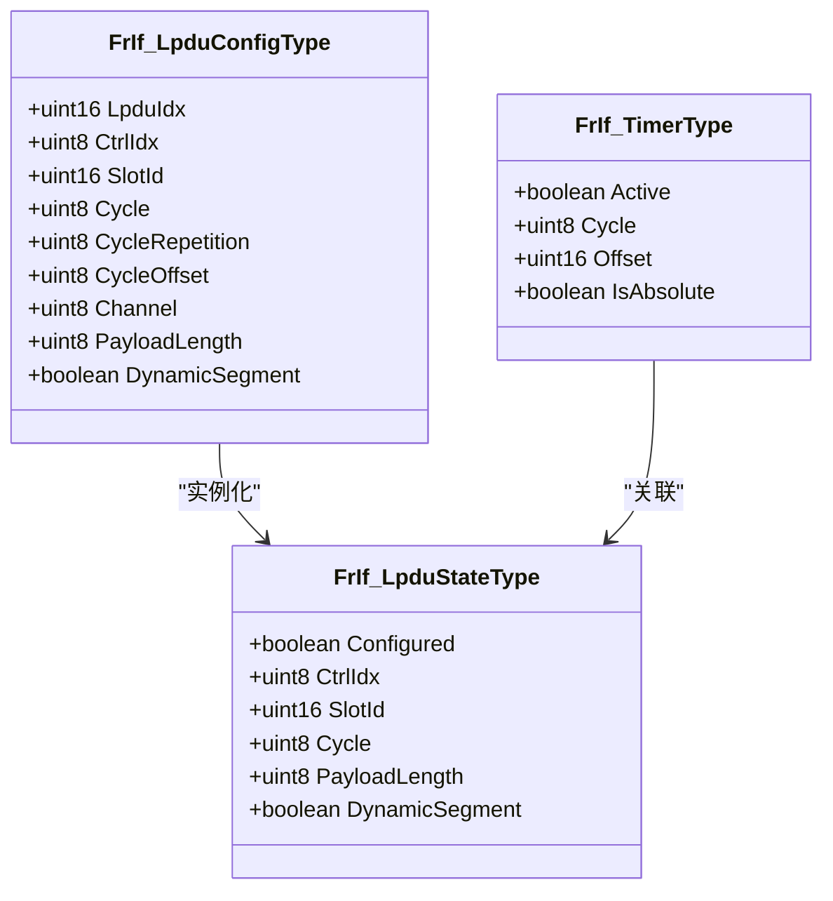

**图表来源**
- [FrIf.h:190-200](file://src/bsw/ecual/frif/include/FrIf.h#L190-L200)
- [FrIf.c:23-43](file://src/bsw/ecual/frif/src/FrIf.c#L23-L43)

#### 时间槽管理流程
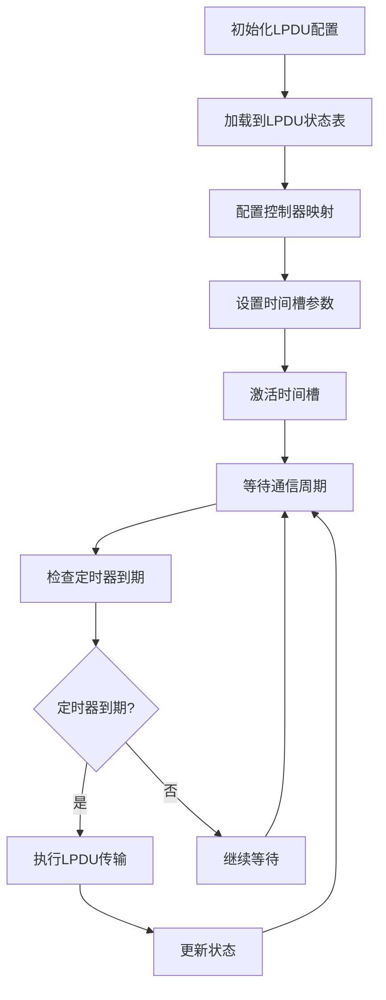

**图表来源**
- [FrIf.c:88-101](file://src/bsw/ecual/frif/src/FrIf.c#L88-L101)
- [FrIf.c:464-474](file://src/bsw/ecual/frif/src/FrIf.c#L464-L474)

**章节来源**
- [FrIf.h:190-200](file://src/bsw/ecual/frif/include/FrIf.h#L190-L200)
- [FrIf_Cfg.h:38-45](file://src/bsw/ecual/frif/include/FrIf_Cfg.h#L38-L45)

### 3. 多播通信支持

FrIf模块支持FlexRay的多播通信特性，通过通道配置实现：

#### 通道配置
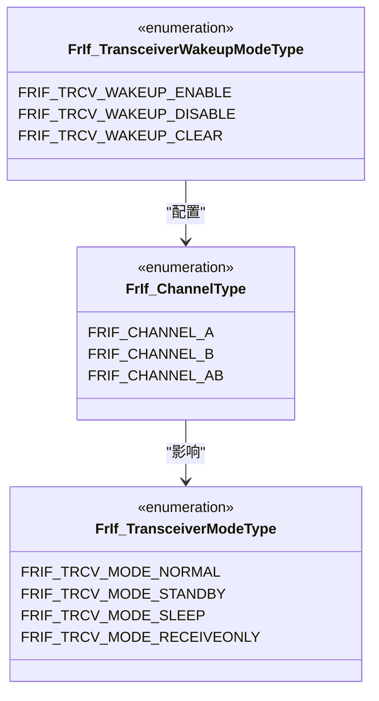

**图表来源**
- [FrIf.h:100-104](file://src/bsw/ecual/frif/include/FrIf.h#L100-L104)
- [FrIf.h:127-132](file://src/bsw/ecual/frif/include/FrIf.h#L127-L132)

**章节来源**
- [FrIf.h:100-155](file://src/bsw/ecual/frif/include/FrIf.h#L100-L155)

### 4. 协议栈实现原理

#### 帧格式处理
FlexRay帧格式在FrIf模块中通过LPDU配置进行管理：

| 字段 | 大小 | 描述 | 配置参数 |
|------|------|------|----------|
| Frame ID | 10位 | 帧标识符 | LpduIdx |
| Cycle | 8位 | 通信周期 | Cycle |
| Slot ID | 10位 | 时间槽标识 | SlotId |
| Payload | 0-254字节 | 数据载荷 | PayloadLength |
| Channel | 1位 | 通信通道 | Channel |

#### 时钟同步机制
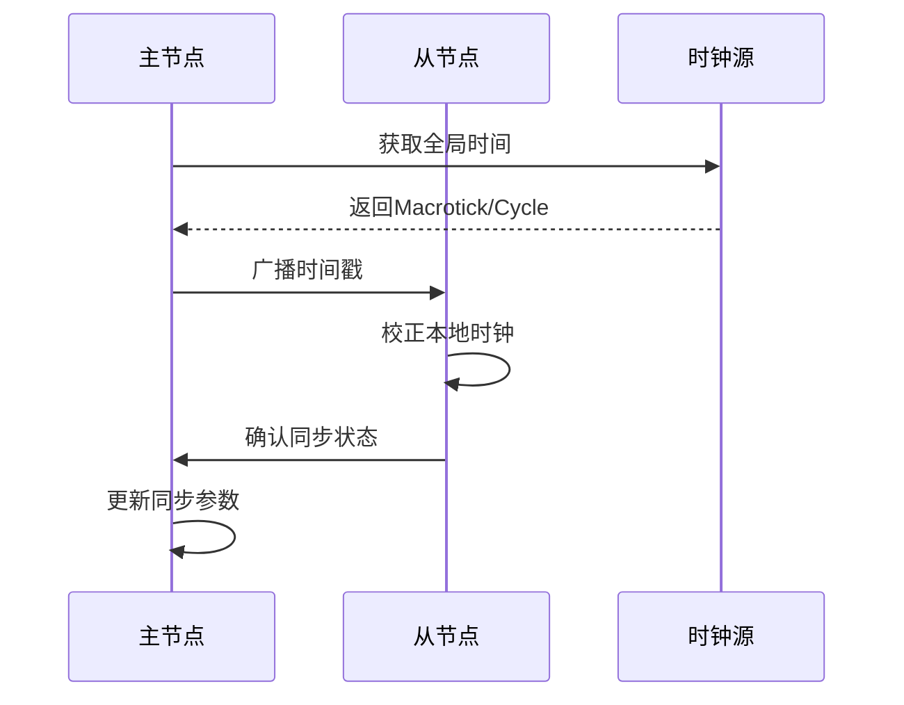

**图表来源**
- [FrIf.c:294-318](file://src/bsw/ecual/frif/src/FrIf.c#L294-L318)

**章节来源**
- [FrIf.h:170-173](file://src/bsw/ecual/frif/include/FrIf.h#L170-L173)
- [FrIf_Cfg.h:39-45](file://src/bsw/ecual/frif/include/FrIf_Cfg.h#L39-L45)

### 5. 错误处理机制

FrIf模块实现了完整的错误检测和处理机制：

#### 错误代码分类
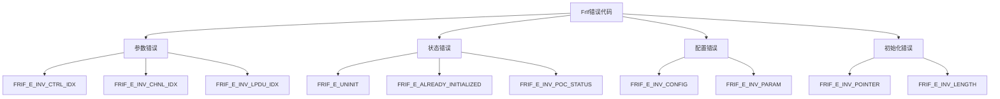

**图表来源**
- [FrIf.h:73-96](file://src/bsw/ecual/frif/include/FrIf.h#L73-L96)

**章节来源**
- [FrIf.h:73-96](file://src/bsw/ecual/frif/include/FrIf.h#L73-L96)

## 依赖关系分析

### 1. 内部依赖关系

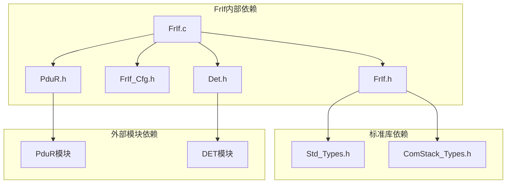

**图表来源**
- [FrIf.c:9-12](file://src/bsw/ecual/frif/src/FrIf.c#L9-L12)

### 2. 外部系统集成

#### OS集成
FrIf模块与实时操作系统集成，通过主函数机制实现周期性处理：

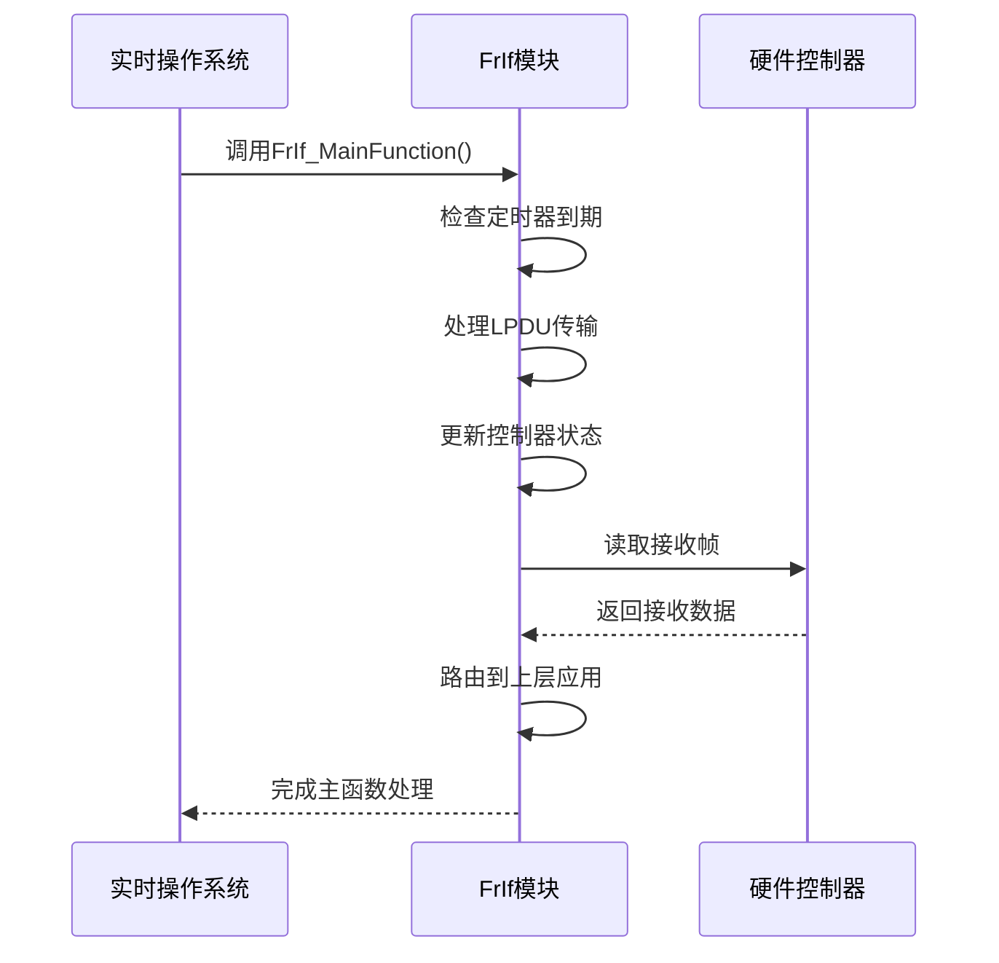

**图表来源**
- [FrIf.c:456-502](file://src/bsw/ecual/frif/src/FrIf.c#L456-L502)
- [Os.h:158-165](file://src/bsw/os/include/Os.h#L158-L165)

**章节来源**
- [FrIf.c:456-502](file://src/bsw/ecual/frif/src/FrIf.c#L456-L502)
- [Os.h:158-165](file://src/bsw/os/include/Os.h#L158-L165)

### 3. 配置参数依赖

FrIf模块的配置参数直接影响其行为和性能：

| 配置参数 | 默认值 | 描述 | 影响范围 |
|----------|--------|------|----------|
| FRIF_NUM_CONTROLLERS | 1 | 控制器数量 | 内存分配、状态数组大小 |
| FRIF_NUM_LPDUS | 64 | LPDU数量 | 内存分配、配置表大小 |
| FRIF_DEV_ERROR_DETECT | STD_ON | 错误检测开关 | 代码体积、运行时开销 |
| FRIF_WAKEUP_SUPPORT | STD_ON | 唤醒功能支持 | 功能可用性、内存占用 |
| FRIF_COLDSTART_SUPPORT | STD_ON | 冷启动支持 | 功能可用性、处理复杂度 |

**章节来源**
- [FrIf_Cfg.h:15-91](file://src/bsw/ecual/frif/include/FrIf_Cfg.h#L15-L91)

## 性能考虑

### 1. 实时性保证

FrIf模块通过以下机制确保实时性：

#### 周期性处理
- **主函数周期**: 1ms周期，确保及时响应
- **定时器精度**: 支持绝对和相对定时器
- **状态机处理**: 简化的状态转换逻辑

#### 内存管理
- **静态分配**: 关键数据结构静态分配，避免运行时内存分配
- **内存映射**: 使用标准的内存映射机制
- **缓存优化**: 合理的数据结构布局

### 2. 通信性能优化

#### 传输优化
- **直接缓冲**: 支持直接数据缓冲传输
- **批量处理**: 批量处理多个LPDU
- **优先级管理**: 支持不同优先级的LPDU

#### 同步机制
- **全局时间**: 提供全局时间基准
- **时钟校正**: 支持时钟校正功能
- **同步帧**: 支持同步帧列表获取

## 故障排除指南

### 1. 常见问题诊断

#### 初始化问题
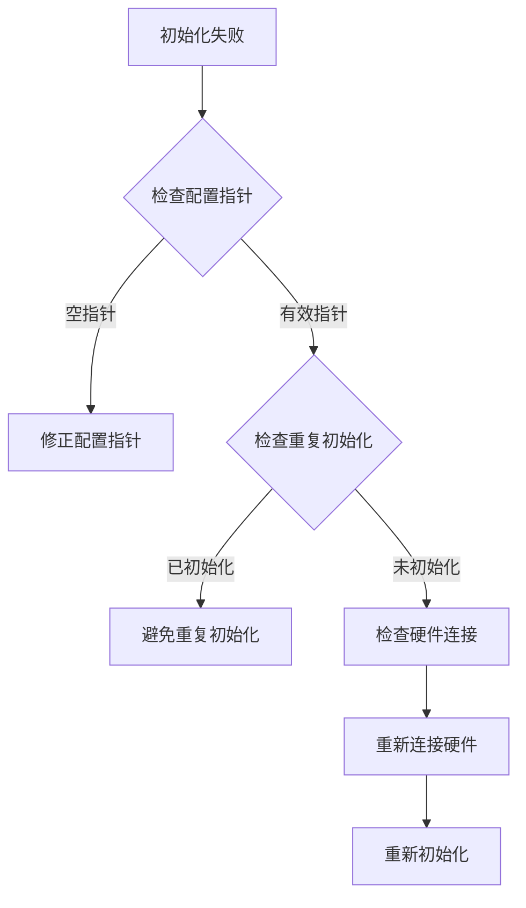

#### 通信问题
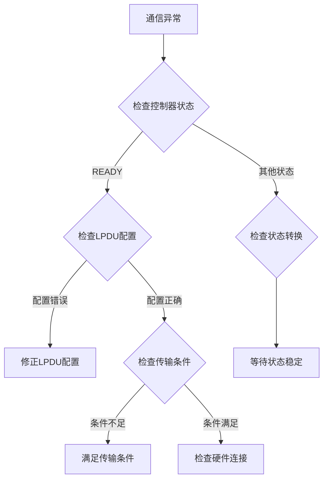

**图表来源**
- [FrIf.c:53-62](file://src/bsw/ecual/frif/src/FrIf.c#L53-L62)
- [FrIf.c:229-247](file://src/bsw/ecual/frif/src/FrIf.c#L229-L247)

### 2. 调试技巧

#### 日志记录
- 启用开发错误检测(Det_ReportError)
- 记录关键状态变化
- 监控定时器到期情况

#### 性能监控
- 监控主函数执行时间
- 检查LPDU传输延迟
- 分析内存使用情况

**章节来源**
- [FrIf.h:73-96](file://src/bsw/ecual/frif/include/FrIf.h#L73-L96)
- [FrIf.c:53-62](file://src/bsw/ecual/frif/src/FrIf.c#L53-L62)

## 结论

FrIf FlexRay接口模块是一个功能完整、设计合理的AutoSAR模块，具有以下特点：

### 主要优势
1. **标准化接口**: 完全符合AutoSAR标准，提供清晰的API
2. **灵活配置**: 支持多种配置选项，适应不同应用场景
3. **实时性保证**: 通过主函数机制确保实时响应
4. **错误处理**: 完善的错误检测和处理机制
5. **可扩展性**: 模块化设计便于功能扩展

### 应用场景
- 高性能车载网络通信
- 实时控制系统
- 多节点分布式系统
- 需要确定性通信的应用

### 发展建议
1. **硬件抽象**: 完善对具体FlexRay控制器的抽象
2. **性能优化**: 进一步优化内存使用和处理效率
3. **功能增强**: 扩展更多FlexRay特性支持
4. **测试覆盖**: 增加更多的单元测试和集成测试

FrIf模块为YuleTech AutoSAR平台提供了坚实的FlexRay通信基础，为上层应用开发奠定了良好的技术基础。

## 附录

### 1. 配置示例

#### 基本配置示例
```c
// FrIf配置结构体定义
const FrIf_ConfigType FrIf_Config = {
    .Controllers = g_FrIfControllers,
    .NumControllers = FRIF_NUM_CONTROLLERS,
    .Lpdus = g_FrIfLpdus,
    .NumLpdus = FRIF_NUM_LPDUS,
    .DevErrorDetect = FRIF_DEV_ERROR_DETECT,
    .VersionInfoApi = FRIF_VERSION_INFO_API,
    .ClstStartupActive = FRIF_CLST_STARTUP_ACTIVE,
    .ClstWakeupActive = FRIF_CLST_WAKEUP_ACTIVE,
    .FrIfGetWupRxStatusSupport = FRIF_GET_WUP_RX_STATUS_SUPPORT,
    .FrIfGetSyncFrameListSupport = FRIF_GET_SYNC_FRAME_LIST_SUPPORT,
    .FrIfGetClockCorrectionSupport = FRIF_GET_CLOCK_CORRECTION_SUPPORT
};
```

#### LPDU配置示例
```c
// LPDU配置数组
const FrIf_LpduConfigType g_FrIfLpdus[] = {
    {
        .LpduIdx = FRIF_LPDU_ENGINE_STATUS,
        .CtrlIdx = FRIF_CONTROLLER_0,
        .SlotId = FRIF_SLOT_ID_1,
        .Cycle = 1,
        .CycleRepetition = 1,
        .CycleOffset = 0,
        .Channel = FRIF_CHANNEL_A,
        .PayloadLength = FRIF_PAYLOAD_LENGTH_DEFAULT,
        .DynamicSegment = FALSE
    },
    // 更多LPDU配置...
};
```

### 2. 使用模式

#### 初始化流程
```c
// 1. 系统启动时初始化
FrIf_Init(&FrIf_Config);

// 2. 初始化控制器
FrIf_ControllerInit(FRIF_CONTROLLER_0);

// 3. 设置时间槽
FrIf_SetAbsoluteTimer(
    FRIF_CONTROLLER_0,
    0,
    1,
    1000
);

// 4. 启动主循环
while(1) {
    FrIf_MainFunction();
    // 其他任务...
}
```

#### 通信流程
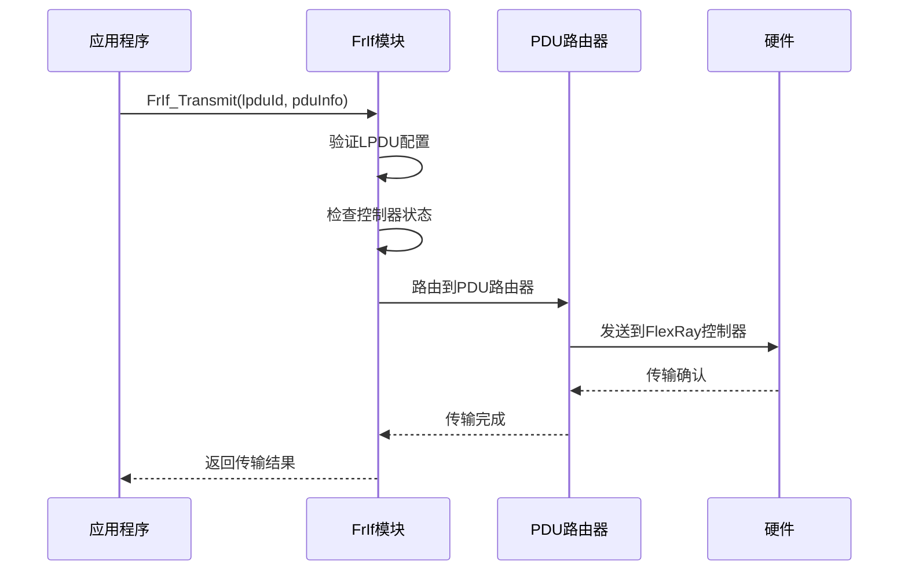

**图表来源**
- [FrIf.c:227-266](file://src/bsw/ecual/frif/src/FrIf.c#L227-L266)

### 3. 集成指南

#### 与RTOS集成
```c
// 在OS任务中调用FrIf主函数
void FrIfTask(void* pvParameters) {
    while(1) {
        FrIf_MainFunction();
        vTaskDelay(FRIF_MAIN_FUNCTION_PERIOD_MS);
    }
}
```

#### 与上层应用集成
```c
// 在ASW组件中使用FrIf
void EngineControl_Init(void) {
    FrIf_Init(&FrIf_Config);
    FrIf_ControllerInit(FRIF_CONTROLLER_0);
    // 注册LPDU接收回调
}
```

**章节来源**
- [FrIf_Cfg.h:78-79](file://src/bsw/ecual/frif/include/FrIf_Cfg.h#L78-L79)
- [api-reference.md:1-609](file://docs/api-reference.md#L1-L609)