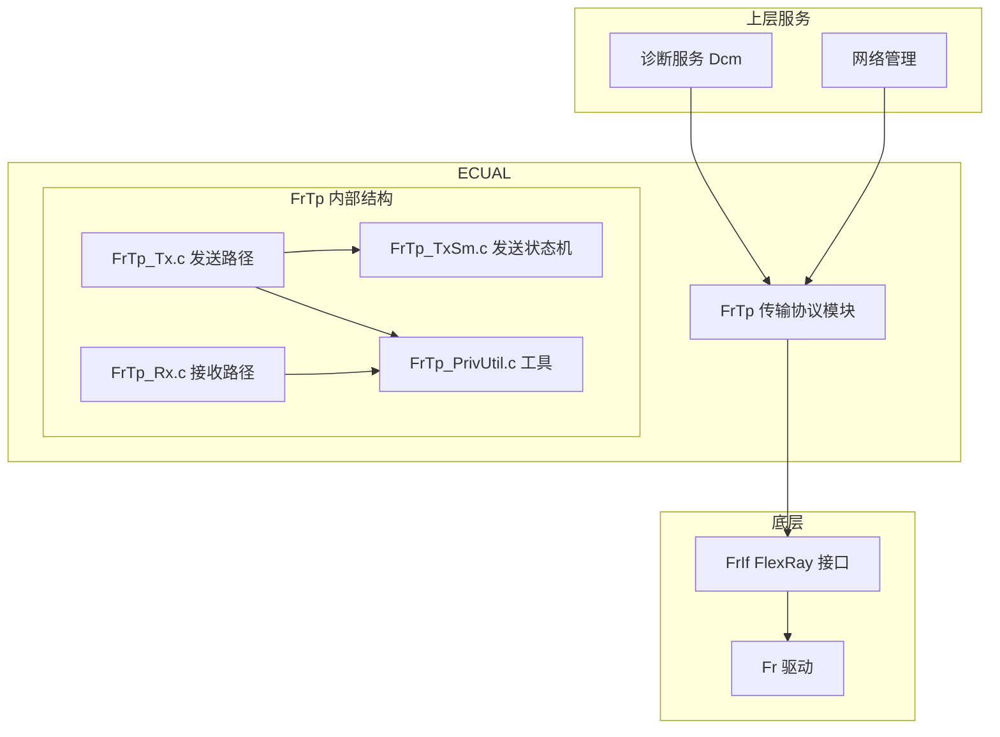
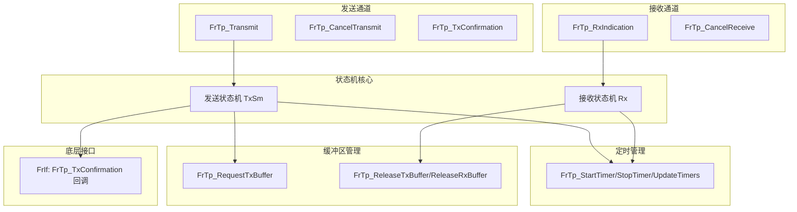
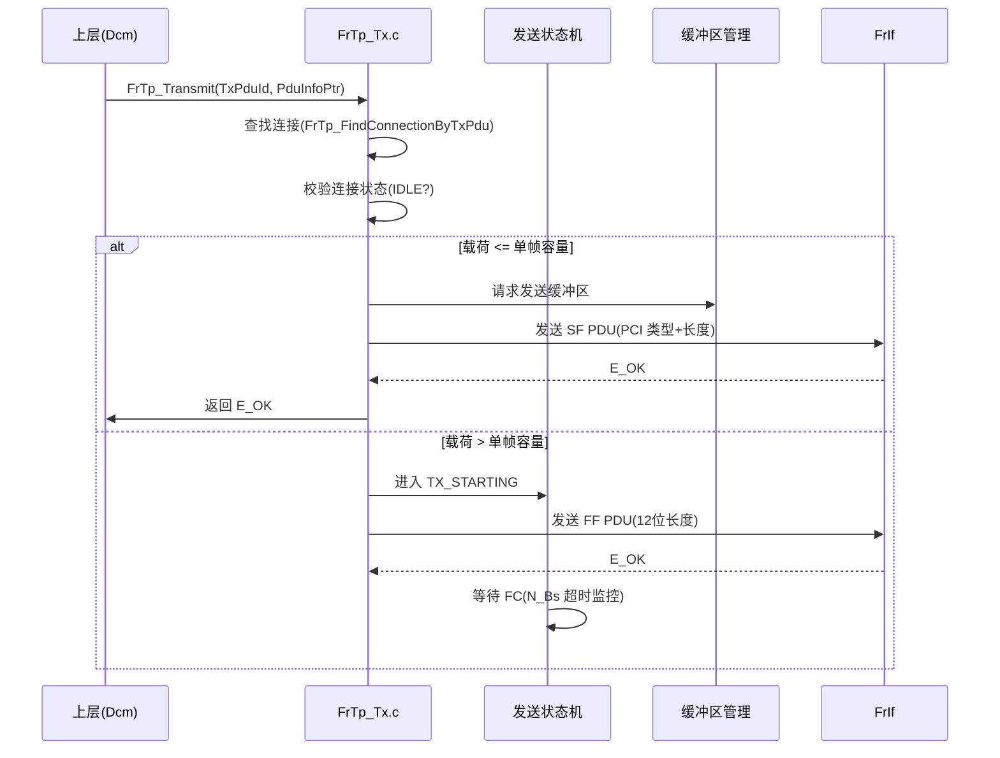
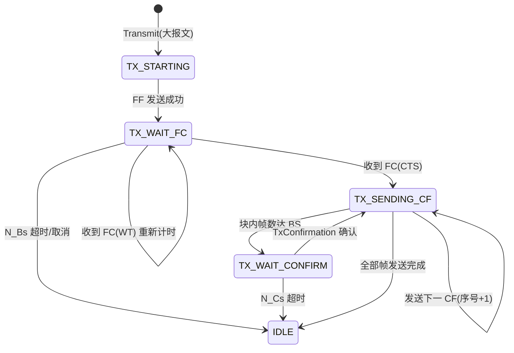
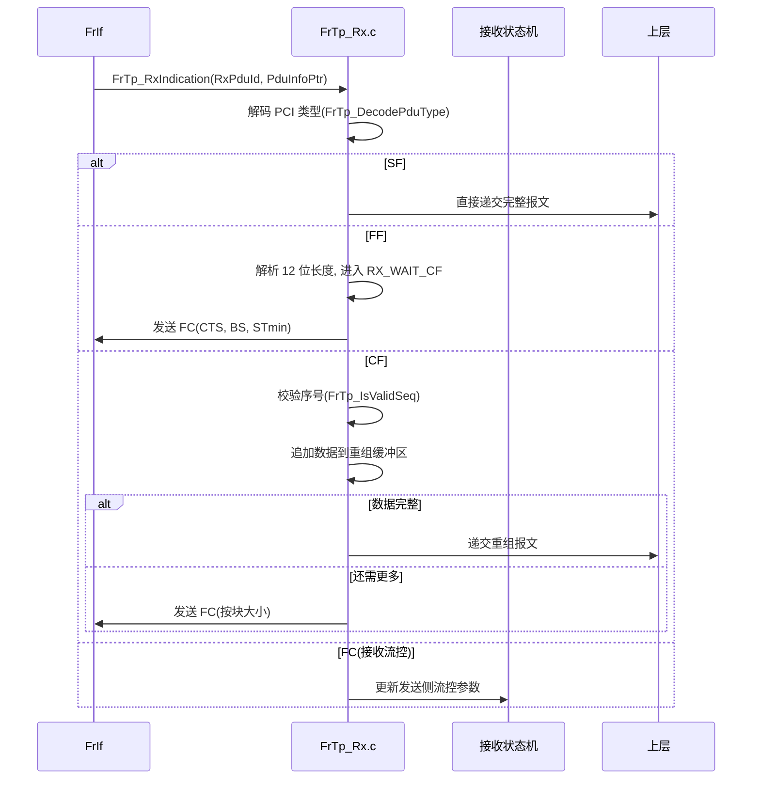

# FrTp（FlexRay传输模块）

<cite>
**本文档引用的文件**
- [FrTp.h](file://src/bsw/ecual/frtp/include/FrTp.h)
- [FrTp_Cfg.h](file://src/bsw/ecual/frtp/include/FrTp_Cfg.h)
- [FrTp_Lcfg.h](file://src/bsw/ecual/frtp/include/FrTp_Lcfg.h)
- [FrTp_Private.h](file://src/bsw/ecual/frtp/include/FrTp_Private.h)
- [FrTp.c](file://src/bsw/ecual/frtp/src/FrTp.c)
- [FrTp_Rx.c](file://src/bsw/ecual/frtp/src/FrTp_Rx.c)
- [FrTp_Tx.c](file://src/bsw/ecual/frtp/src/FrTp_Tx.c)
- [FrTp_TxSm.c](file://src/bsw/ecual/frtp/src/FrTp_TxSm.c)
- [FrTp_PrivUtil.c](file://src/bsw/ecual/frtp/src/FrTp_PrivUtil.c)
- [FrTp_Lcfg.c](file://src/bsw/ecual/frtp/src/FrTp_Lcfg.c)
</cite>

## 目录
1. [简介](#简介)
2. [项目结构](#项目结构)
3. [核心组件](#核心组件)
4. [架构概览](#架构概览)
5. [详细组件分析](#详细组件分析)
6. [依赖关系分析](#依赖关系分析)
7. [性能考虑](#性能考虑)
8. [故障排除指南](#故障排除指南)
9. [结论](#结论)
10. [附录](#附录)

## 简介

FrTp（FlexRay Transport Protocol，FlexRay 传输协议模块）是基于 AUTOSAR 4.4.0 标准开发的 ECUAL 层传输协议模块，实现 FlexRay 总线上的报文分段与重组（Segmentation and Reassembly）功能。该模块遵循 ISO 10681-2 传输协议，支持 Single Frame（SF）、First Frame（FF）、Consecutive Frame（CF）和 Flow Control（FC）四种 PDU 类型，以及完整的状态机管理。

FrTp 位于 FrIf（FlexRay 接口模块）之上，为上层应用（诊断、NM 等）提供大报文的分段传输服务，支持最多 4095 字节的报文通过 254 字节以内的 FlexRay 帧载荷进行传输。

**章节来源**
- [FrTp.h:24-80](file://src/bsw/ecual/frtp/include/FrTp.h#L24-L80)
- [FrTp.h:16-22](file://src/bsw/ecual/frtp/include/FrTp.h#L16-L22)

## 项目结构

FrTp 模块源码位于 `src/bsw/ecual/frtp/`，采用多文件分离设计：

```
src/bsw/ecual/frtp/
├── include/
│   ├── FrTp.h               # 公共 API 与类型定义
│   ├── FrTp_Cfg.h           # 预编译配置
│   ├── FrTp_Lcfg.h          # 链接时配置声明
│   └── FrTp_Private.h       # 私有宏与内部函数声明（PCI 编解码）
└── src/
    ├── FrTp.c               # 生命周期与主函数（382 行）
    ├── FrTp_Rx.c            # 接收路径状态机（630 行）
    ├── FrTp_Tx.c            # 发送路径实现（462 行）
    ├── FrTp_TxSm.c          # 发送状态机（366 行）
    ├── FrTp_PrivUtil.c      # 私有工具函数（494 行）
    └── FrTp_Lcfg.c          # 连接配置表
```



**图表来源**
- [FrTp.h:24-30](file://src/bsw/ecual/frtp/include/FrTp.h#L24-L30)
- [FrTp.c:8-16](file://src/bsw/ecual/frtp/src/FrTp.c#L8-L16)

**章节来源**
- [FrTp.h:1-80](file://src/bsw/ecual/frtp/include/FrTp.h#L1-L80)
- [FrTp_Cfg.h:1-100](file://src/bsw/ecual/frtp/include/FrTp_Cfg.h#L1-L100)

## 核心组件

FrTp 模块的核心组件包括：

### PCI 协议控制信息
- **FrTp_PduType**: PDU 类型枚举（SF/FF/CF/FC）
- **PCI 编解码宏**（FrTp_Private.h）:
  - `FrTp_GetPduType(pci)` / `FrTp_SetPduType(pci, type)`: 获取/设置 PCI 类型
  - `FrTp_GetSfLength(pci)` / `FrTp_SetSfLength(len)`: 单帧长度编解码
  - `FrTp_GetFfLength(pci0, pci1)` / `FrTp_SetFfLengthHigh/Low`: 首帧 12 位长度编解码
  - `FrTp_GetCfSeq(pci)` / `FrTp_SetCfSeq(seq)`: 连续帧序号编解码
  - `FrTp_GetFcStatus(pci)` / `FrTp_SetFcStatus(status)`: 流控状态（CTS/WT/OVFL）
  - `FrTp_IsValidSeq(current, expected)`: 序号校验
  - `FrTp_IncSeq(seq)`: 序号递增（4 位循环）

### 连接状态机
- **FrTp_ConnectionStateType**: 8 状态枚举：
  - IDLE（空闲）、TX_STARTING（发送启动）、TX_WAIT_FC（等待流控）、TX_SENDING_CF（发送连续帧）、TX_WAIT_CONFIRM（等待确认）
  - RX_WAIT_FF（等待首帧）、RX_WAIT_CF（等待连续帧）、RX_SEND_FC（发送流控）
- 状态辅助宏：`FrTp_IsTxState()` / `FrTp_IsRxState()` 区分收发方向

### 配置结构
- **FrTp_ConnectionConfigType**: 连接配置（TX/RX PDU ID、最大载荷、重试次数、6 个超时参数 N_As/N_Bs/N_Cs/N_Ar/N_Br/N_Cr、流控参数）
- **FrTp_ConfigType**: 全局配置（连接数组、数量、DET/版本开关）

### 超时参数（FrTp_Cfg.h）
- **FRTP_DEFAULT_NAS_TIMEOUT / NBS / NCS**: 发送侧超时（各 100ms）
- **FRTP_DEFAULT_NAR_TIMEOUT / NBR / NCR**: 接收侧超时（各 100ms）
- **FRTP_MAX_RETRY_COUNT**: 最大重试 3 次

**章节来源**
- [FrTp_Private.h:82-160](file://src/bsw/ecual/frtp/include/FrTp_Private.h#L82-L160)
- [FrTp.h:83-175](file://src/bsw/ecual/frtp/include/FrTp.h#L83-L175)

## 架构概览

FrTp 的收发双通道架构与状态机模型：



**图表来源**
- [FrTp.c:85-260](file://src/bsw/ecual/frtp/src/FrTp.c#L85-L260)
- [FrTp_TxSm.c:1-366](file://src/bsw/ecual/frtp/src/FrTp_TxSm.c#L1-L366)
- [FrTp_Rx.c:54-630](file://src/bsw/ecual/frtp/src/FrTp_Rx.c#L54-L630)

## 详细组件分析

### 发送路径组件分析

FrTp_Transmit() 实现发送请求的分段处理：



**图表来源**
- [FrTp_Tx.c:55-146](file://src/bsw/ecual/frtp/src/FrTp_Tx.c#L55-L146)

#### 发送状态机详解（FrTp_TxSm.c）



**图表来源**
- [FrTp_TxSm.c:1-366](file://src/bsw/ecual/frtp/src/FrTp_TxSm.c#L1-L366)
- [FrTp_Private.h:116-122](file://src/bsw/ecual/frtp/include/FrTp_Private.h#L116-L122)

### 接收路径组件分析

FrTp_RxIndication() 驱动接收状态机：



**图表来源**
- [FrTp_Rx.c:54-163](file://src/bsw/ecual/frtp/src/FrTp_Rx.c#L54-L163)
- [FrTp_Rx.c:278-523](file://src/bsw/ecual/frtp/src/FrTp_Rx.c#L278-L523)

#### 接收特性

- **序号校验**: CF 序号必须与预期一致，失序帧触发错误处理
- **流控发送**: FrTp_SendFlowControl() 支持 CTS/Wait/Overflow 状态
- **超时保护**: N_Ar（等待 FF）、N_Cr（等待 CF）超时中断接收
- **取消支持**: FrTp_CancelReceive() 中止接收并释放缓冲区

**章节来源**
- [FrTp_Rx.c:164-277](file://src/bsw/ecual/frtp/src/FrTp_Rx.c#L164-L277)
- [FrTp_Rx.c:427-630](file://src/bsw/ecual/frtp/src/FrTp_Rx.c#L427-L630)

### 定时与工具组件分析

FrTp_PrivUtil.c 提供定时器与连接管理工具：

- **FrTp_StartTimer/StopTimer**: 按连接启动/停止超时定时器
- **FrTp_IsTimerExpired**: 超时查询（MainFunction 中轮询）
- **FrTp_UpdateTimers**: 主函数中统一递减所有活动连接定时器
- **FrTp_FindConnectionByTxPdu/ByRxPdu**: PDU ID → 连接索引映射
- **FrTp_SetConnectionState/ResetConnection**: 状态迁移与复位
- **FrTp_IsConnectionIdle**: 空闲检测（防重复启动）

**章节来源**
- [FrTp_PrivUtil.c:1-494](file://src/bsw/ecual/frtp/src/FrTp_PrivUtil.c#L1-L494)
- [FrTp_Private.h:129-159](file://src/bsw/ecual/frtp/include/FrTp_Private.h#L129-L159)

## 依赖关系分析

FrTp 的依赖关系：

```mermaid
graph TB
subgraph "FrTp 内部"
FT_H[FrTp.h]
FT_P[FrTp_Private.h]
FT_CFG[FrTp_Cfg.h]
FT_LCFG[FrTp_Lcfg.h]
FT_C[FrTp.c]
FT_RX[FrTp_Rx.c]
FT_TX[FrTp_Tx.c]
FT_SM[FrTp_TxSm.c]
FT_U[FrTp_PrivUtil.c]
end
subgraph "基础依赖"
STD[Std_Types.h]
COMSTACK[ComStack_Types.h]
MEMMAP[MemMap.h]
END
subgraph "上层"
DCM[诊断服务]
PDUR[PDU Router]
END
subgraph "底层"
FRIF[FrIf 接口]
END
FT_H --> STD
FT_H --> COMSTACK
FT_P --> FT_CFG
FT_P --> FT_LCFG
FT_C --> FT_H
FT_C --> FT_P
FT_RX --> FT_P
FT_TX --> FT_P
FT_SM --> FT_P
FT_U --> FT_P
DCM --> FT_H
PDUR --> FT_H
FT_C --> FRIF
FT_TX --> FRIF
FT_RX --> FRIF
```

**图表来源**
- [FrTp.h:24-30](file://src/bsw/ecual/frtp/include/FrTp.h#L24-L30)
- [FrTp_Private.h:30-40](file://src/bsw/ecual/frtp/include/FrTp_Private.h#L30-L40)

### 关键依赖关系

1. **FrIf 依赖**: 通过 FrIf 发送帧（FrTp_Transmit 间接）并接收 FrIf 的 RxIndication/TxConfirmation 回调
2. **ComStack 依赖**: PduInfoType/PduIdType 来自 ComStack_Types.h
3. **上层服务依赖**: Dcm（诊断）与 PduR 通过 PDU ID 绑定连接
4. **配置依赖**: FrTp_Lcfg.c 提供连接配置表（含 6 超时参数）

**章节来源**
- [FrTp.h:24-30](file://src/bsw/ecual/frtp/include/FrTp.h#L24-L30)
- [FrTp_Private.h:129-159](file://src/bsw/ecual/frtp/include/FrTp_Private.h#L129-L159)

## 性能考虑

### 吞吐量分析

| 参数 | 说明 |
|------|------|
| 单帧最大载荷 | FrTp_ConnectionConfigType.maxPayload（≤254 字节） |
| 最大报文长度 | 4095 字节（12 位 FF 长度字段） |
| 连续帧序号 | 4 位（0-15 循环） |
| 块大小（BS） | defaultBlockSize 配置 |
| 帧间隔（STmin） | defaultSTmin 配置 |

### 超时与实时性

| 超时 | 含义 | 默认值 |
|------|------|--------|
| N_As | TX SF/FF/CF 发送确认超时 | 100ms |
| N_Bs | TX 等待 FC 超时 | 100ms |
| N_Cs | TX 等待确认超时 | 100ms |
| N_Ar | RX 等待 FF 超时 | 100ms |
| N_Br | RX 等待缓冲区超时 | 100ms |
| N_Cr | RX 等待 CF 超时 | 100ms |

### 资源占用

- 每个活动连接需独立重组/分段缓冲区
- 定时器状态与连接运行时结构常驻内存
- 工具函数集中复用，代码体积可控

**章节来源**
- [FrTp_Cfg.h:20-100](file://src/bsw/ecual/frtp/include/FrTp_Cfg.h#L20-L100)
- [FrTp.h:115-135](file://src/bsw/ecual/frtp/include/FrTp.h#L115-L135)

## 故障排除指南

### 常见错误代码

| 错误代码 | 错误含义 | 可能原因 | 解决方案 |
|---------|---------|---------|---------|
| FRTP_E_PARAM_POINTER (0x01) | 指针无效 | 空指针 PDU 参数 | 检查调用参数 |
| FRTP_E_PARAM_CONFIG (0x02) | 配置无效 | 连接配置错误 | 检查 Lcfg 表 |
| FRTP_E_INVALID_PDU_SDU_ID (0x03) | PDU ID 无效 | 未找到对应连接 | 检查 PDU 映射 |
| FRTP_E_NOT_INIT (0x04) | 未初始化 | Init 前调用 | 检查初始化时序 |
| FRTP_E_SEG_ERROR (0x06) | 分段错误 | 序号失序/长度异常 | 检查对端实现 |
| FRTP_E_NO_CONNECTION (0x07) | 无连接 | 连接未配置 | 检查连接表 |
| FRTP_E_TIMEOUT (0x32) | 超时 | N_* 超时触发 | 检查总线负载/对端响应 |
| FRTP_E_OVERFLOW (0x04) | 溢出 | 重组缓冲区不足 | 增大缓冲区 |

### 调试建议

1. **PCI 解码验证**: 使用 FrTp_DecodePduType 确认帧类型解析正确
2. **超时参数调整**: 高负载总线适当增大 N_Cs/N_Cr
3. **序号跟踪**: 检查 CF 序号连续性定位丢帧
4. **流控观察**: 确认 FC 帧 BS/STmin 与对端协商一致

**章节来源**
- [FrTp.h:55-78](file://src/bsw/ecual/frtp/include/FrTp.h#L55-L78)
- [FrTp_Private.h:82-127](file://src/bsw/ecual/frtp/include/FrTp_Private.h#L82-L127)

## 结论

FrTp FlexRay 传输协议模块是一个实现完整、符合 ISO 10681-2 规范的 AUTOSAR TP 组件。它提供：

1. **完整 PCI 支持**: SF/FF/CF/FC 四种 PDU 的编解码
2. **健壮的状态机**: 发送 5 状态 + 接收 3 状态的完整转换管理
3. **超时保护**: 6 个标准超时参数（N_As~N_Cr）全覆盖
4. **流控机制**: 支持 BS 块大小与 STmin 帧间隔协商
5. **多连接支持**: 通过连接配置表支持多条并行传输

该模块为 FlexRay 网络上的诊断刷写、网络管理等多帧应用提供了可靠的传输保障。

## 附录

### 连接配置示例

```c
/* FrTp_Lcfg.c 连接配置 */
const FrTp_ConnectionConfigType FrTp_ConnectionConfigs[FRTP_MAX_CONNECTIONS] = {
    {
        .connIdx = 0U,
        .txPduId = 0x100U,
        .rxPduId = 0x200U,
        .maxPayload = 254U,
        .maxRetries = FRTP_MAX_RETRY_COUNT,
        .timeoutAs = FRTP_DEFAULT_NAS_TIMEOUT,
        .timeoutBs = FRTP_DEFAULT_NBS_TIMEOUT,
        .timeoutCs = FRTP_DEFAULT_NCS_TIMEOUT,
        .timeoutAr = FRTP_DEFAULT_NAR_TIMEOUT,
        .timeoutBr = FRTP_DEFAULT_NBR_TIMEOUT,
        .timeoutCr = FRTP_DEFAULT_NCR_TIMEOUT,
        .flowControlEnabled = TRUE,
        .defaultBlockSize = 16U,
        .defaultSTmin = 10U
    }
};

const FrTp_ConfigType FrTp_Config = {
    .connections = FrTp_ConnectionConfigs,
    .numConnections = 1U,
    .devErrorDetect = FRTP_DEV_ERROR_DETECT,
    .versionInfoApi = FRTP_VERSION_INFO_API
};
```

### PCI 编解码示例

```c
/* 发送单帧：PCI 字节编码 */
uint8 pci = FrTp_SetSfLength(dataLength);   /* SF 类型 + 长度 */

/* 发送首帧：12 位长度编解码 */
uint8 pci0 = FrTp_SetFfLengthHigh(totalLength);
uint8 pci1 = FrTp_SetFfLengthLow(totalLength);

/* 接收解析 */
FrTp_PduType type = FrTp_DecodePduType(buffer);
uint16 ffLength = FrTp_GetFfLength(buffer[0], buffer[1]);
uint8 seq = FrTp_GetCfSeq(buffer[0]);
```

**章节来源**
- [FrTp_Lcfg.c:1-260](file://src/bsw/ecual/frtp/src/FrTp_Lcfg.c#L1-L260)
- [FrTp_Private.h:82-127](file://src/bsw/ecual/frtp/include/FrTp_Private.h#L82-L127)
