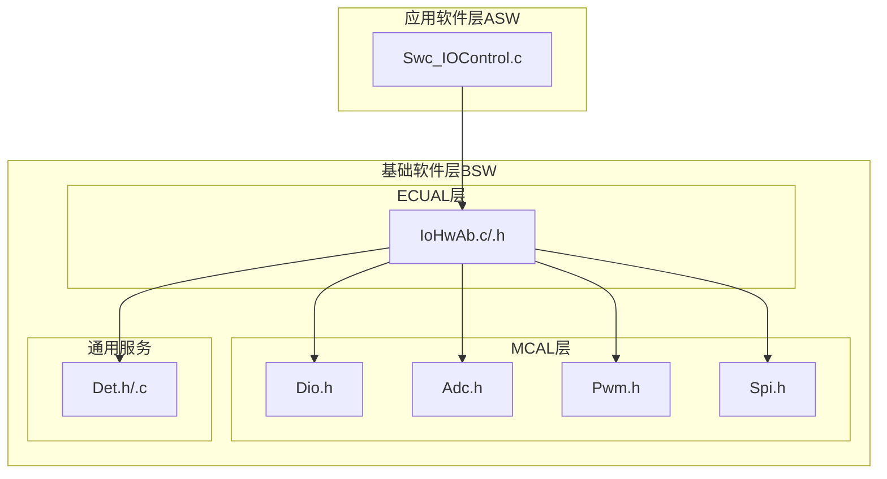
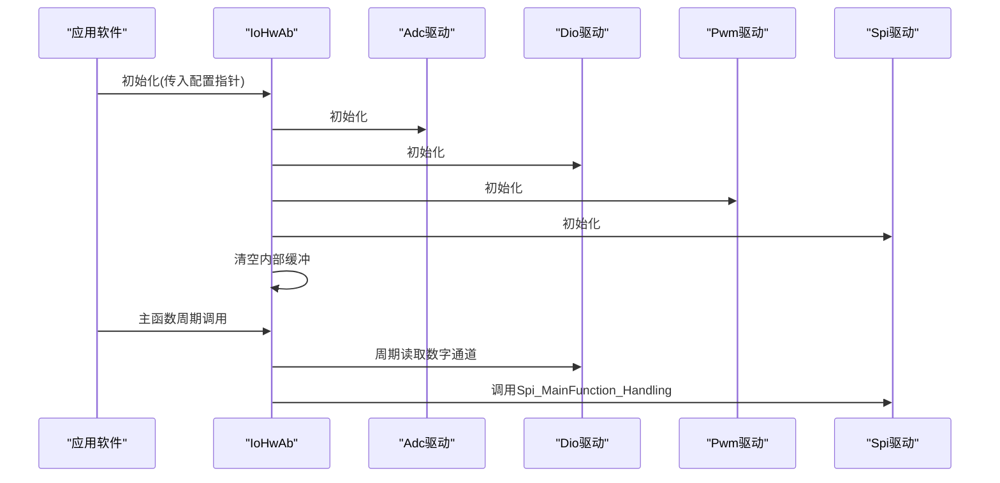
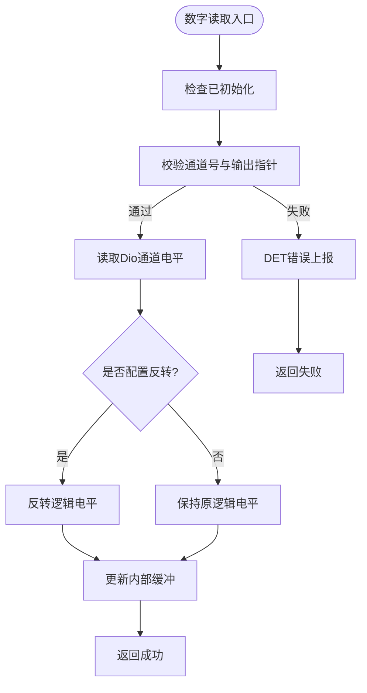
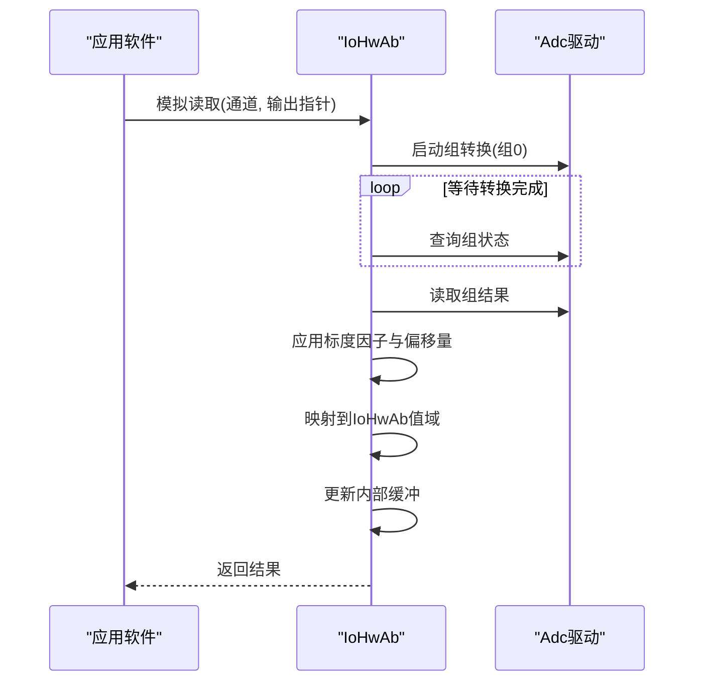
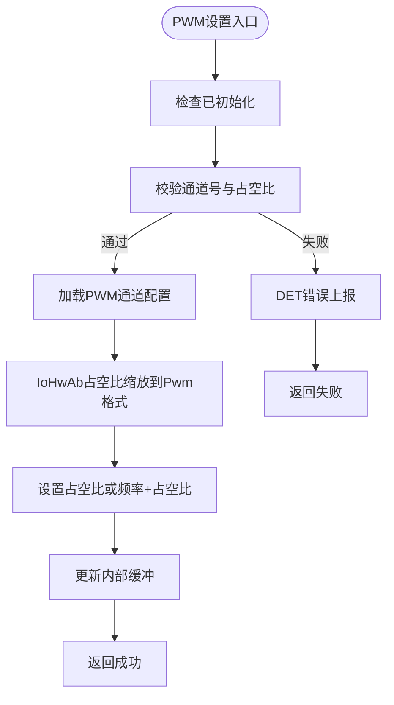
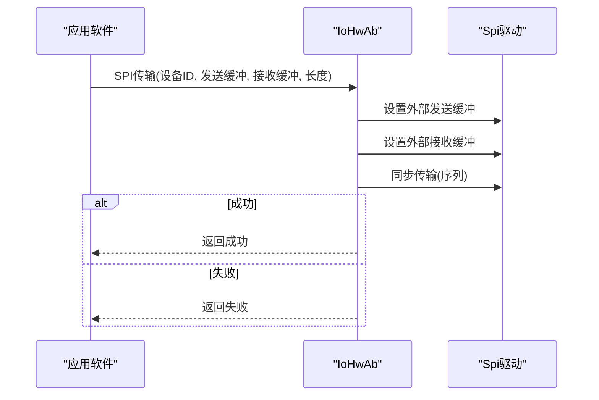
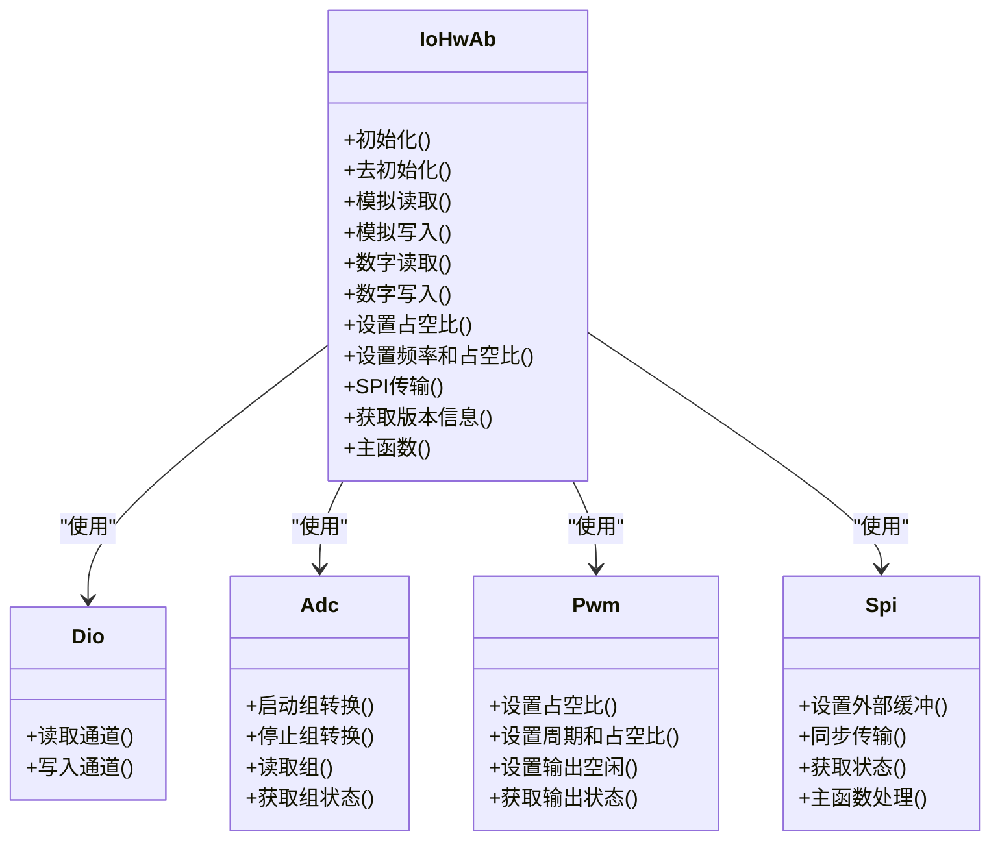

# IoHwAb I/O硬件抽象模块

<cite>
**本文档引用的文件**
- [IoHwAb.h](file://src/bsw/ecual/iohwab/include/IoHwAb.h)
- [IoHwAb_Cfg.h](file://src/bsw/ecual/iohwab/include/IoHwAb_Cfg.h)
- [IoHwAb.c](file://src/bsw/ecual/iohwab/src/IoHwAb.c)
- [Dio.h](file://src/bsw/mcal/dio/include/Dio.h)
- [Adc.h](file://src/bsw/mcal/adc/include/Adc.h)
- [Pwm.h](file://src/bsw/mcal/pwm/include/Pwm.h)
- [Spi.h](file://src/bsw/mcal/spi/include/Spi.h)
- [main.c（LED闪烁示例）](file://examples/led_blink/main.c)
- [main.c（CAN通信示例）](file://examples/can_demo/main.c)
</cite>

## 目录
1. [简介](#简介)
2. [项目结构](#项目结构)
3. [核心组件](#核心组件)
4. [架构总览](#架构总览)
5. [详细组件分析](#详细组件分析)
6. [依赖关系分析](#依赖关系分析)
7. [性能考虑](#性能考虑)
8. [故障排除指南](#故障排除指南)
9. [结论](#结论)
10. [附录](#附录)

## 简介
IoHwAb（I/O硬件抽象）模块是遵循AutoSAR Classic Platform 4.x标准的ECUAL层组件，旨在将不同类型的输入输出设备统一抽象为标准化接口。该模块支持以下三类I/O功能：
- 数字I/O：通过Dio驱动实现读写，支持引脚电平反转配置
- 模拟I/O：通过Adc驱动实现模数转换，支持标度因子与偏移量配置
- 特殊功能I/O：通过Pwm与Spi驱动实现脉宽调制与串行外设接口通信

IoHwAb在初始化时加载配置并维护内部缓冲区，提供统一的服务接口，并通过主函数周期性处理数字通道与SPI异步操作。

## 项目结构
IoHwAb模块位于ECUAL层，直接依赖MCAL层的Dio、Adc、Pwm、Spi驱动，并通过Det进行运行时错误检测。其典型目录组织如下：
- 头文件：src/bsw/ecual/iohwab/include/IoHwAb.h、IoHwAb_Cfg.h
- 实现：src/bsw/ecual/iohwab/src/IoHwAb.c
- 配置模板：src/bsw/config/templates/IoHwAb_Cfg.h
- 示例应用：examples/led_blink/main.c、examples/can_demo/main.c

**图表来源**
- [IoHwAb.h:13-263](file://src/bsw/ecual/iohwab/include/IoHwAb.h#L13-L263)
- [IoHwAb.c:9-386](file://src/bsw/ecual/iohwab/src/IoHwAb.c#L9-L386)
- [Dio.h:14-195](file://src/bsw/mcal/dio/include/Dio.h#L14-L195)
- [Adc.h:13-384](file://src/bsw/mcal/adc/include/Adc.h#L13-L384)
- [Pwm.h:13-299](file://src/bsw/mcal/pwm/include/Pwm.h#L13-L299)
- [Spi.h:13-362](file://src/bsw/mcal/spi/include/Spi.h#L13-L362)

**章节来源**
- [IoHwAb.h:13-263](file://src/bsw/ecual/iohwab/include/IoHwAb.h#L13-L263)
- [IoHwAb_Cfg.h:1-102](file://src/bsw/ecual/iohwab/include/IoHwAb_Cfg.h#L1-L102)
- [IoHwAb.c:9-386](file://src/bsw/ecual/iohwab/src/IoHwAb.c#L9-L386)

## 核心组件
- 统一接口定义：提供初始化、去初始化、模拟读写、数字读写、PWM设置、SPI传输、版本信息查询与主函数等标准接口
- 配置管理：通过IoHwAb_ConfigType集中管理模拟、数字、PWM与SPI设备的配置数组与数量
- 设备映射：每个IoHwAb通道类型映射到具体MCAL驱动的通道或序列
- 内部缓冲：维护模拟值、数字值与PWM参数的内部缓冲，用于状态读取与周期性更新
- 错误处理：启用DevErrorDetect时，对空指针、越界、未初始化等进行DET报告

关键数据类型与接口路径：
- 配置结构体：[IoHwAb_ConfigType:129-141](file://src/bsw/ecual/iohwab/include/IoHwAb.h#L129-L141)
- 模拟通道配置：[IoHwAb_AnalogChannelConfigType:88-96](file://src/bsw/ecual/iohwab/include/IoHwAb.h#L88-L96)
- 数字通道配置：[IoHwAb_DigitalChannelConfigType:101-105](file://src/bsw/ecual/iohwab/include/IoHwAb.h#L101-L105)
- PWM通道配置：[IoHwAb_PwmChannelConfigType:110-115](file://src/bsw/ecual/iohwab/include/IoHwAb.h#L110-L115)
- SPI设备配置：[IoHwAb_SpiDeviceConfigType:120-125](file://src/bsw/ecual/iohwab/include/IoHwAb.h#L120-L125)
- 接口声明：[IoHwAb_Init/DeInit/AnalogRead/AnalogWrite/DigitalRead/DigitalWrite/PwmSet*/SpiTransfer/GetVersionInfo/MainFunction:178-257](file://src/bsw/ecual/iohwab/include/IoHwAb.h#L178-L257)

**章节来源**
- [IoHwAb.h:68-171](file://src/bsw/ecual/iohwab/include/IoHwAb.h#L68-L171)
- [IoHwAb.h:129-141](file://src/bsw/ecual/iohwab/include/IoHwAb.h#L129-L141)
- [IoHwAb.h:178-257](file://src/bsw/ecual/iohwab/include/IoHwAb.h#L178-L257)

## 架构总览
IoHwAb采用分层架构，向上提供统一的I/O抽象接口，向下封装MCAL驱动细节。初始化流程会依次初始化Adc、Dio、Pwm与Spi驱动，并清空内部缓冲；主函数负责周期性处理数字通道与SPI异步处理。

**图表来源**
- [IoHwAb.c:32-95](file://src/bsw/ecual/iohwab/src/IoHwAb.c#L32-L95)
- [IoHwAb.c:361-382](file://src/bsw/ecual/iohwab/src/IoHwAb.c#L361-L382)

**章节来源**
- [IoHwAb.c:32-95](file://src/bsw/ecual/iohwab/src/IoHwAb.c#L32-L95)
- [IoHwAb.c:361-382](file://src/bsw/ecual/iohwab/src/IoHwAb.c#L361-L382)

## 详细组件分析

### 数字I/O子系统
- 功能：读取/写入Dio通道，支持引脚电平反转
- 关键点：
  - 读取时根据配置决定是否反转逻辑电平
  - 写入时先按配置进行电平反转再写入Dio
  - 更新内部数字缓冲以供周期性读取

**图表来源**
- [IoHwAb.c:165-198](file://src/bsw/ecual/iohwab/src/IoHwAb.c#L165-L198)
- [IoHwAb.c:200-230](file://src/bsw/ecual/iohwab/src/IoHwAb.c#L200-L230)

**章节来源**
- [IoHwAb.c:165-230](file://src/bsw/ecual/iohwab/src/IoHwAb.c#L165-L230)
- [Dio.h:101-112](file://src/bsw/mcal/dio/include/Dio.h#L101-L112)

### 模拟I/O子系统
- 功能：通过Adc驱动进行模数转换，支持标度因子与偏移量配置，输出范围映射至IoHwAb值域
- 关键点：
  - 启动Adc组转换并轮询等待完成
  - 读取Adc结果后进行线性变换与范围映射
  - 更新内部模拟缓冲

**图表来源**
- [IoHwAb.c:97-142](file://src/bsw/ecual/iohwab/src/IoHwAb.c#L97-L142)
- [Adc.h:276-290](file://src/bsw/mcal/adc/include/Adc.h#L276-L290)

**章节来源**
- [IoHwAb.c:97-142](file://src/bsw/ecual/iohwab/src/IoHwAb.c#L97-L142)
- [Adc.h:276-290](file://src/bsw/mcal/adc/include/Adc.h#L276-L290)

### PWM子系统
- 功能：设置占空比与频率，支持默认周期与占空比配置
- 关键点：
  - 占空比缩放：IoHwAb的0-10000映射到Pwm驱动的0x0000-0x8000
  - 频率计算：基于24MHz时钟计算周期
  - 更新内部PWM缓冲

**图表来源**
- [IoHwAb.c:232-296](file://src/bsw/ecual/iohwab/src/IoHwAb.c#L232-L296)
- [Pwm.h:225-233](file://src/bsw/mcal/pwm/include/Pwm.h#L225-L233)

**章节来源**
- [IoHwAb.c:232-296](file://src/bsw/ecual/iohwab/src/IoHwAb.c#L232-L296)
- [Pwm.h:225-233](file://src/bsw/mcal/pwm/include/Pwm.h#L225-L233)

### SPI子系统
- 功能：同步SPI传输，支持外部设备选择与波特率配置
- 关键点：
  - 设置外部缓冲区（EB），分别配置发送与接收缓冲
  - 使用指定序列执行同步传输
  - 更新内部缓冲

**图表来源**
- [IoHwAb.c:298-343](file://src/bsw/ecual/iohwab/src/IoHwAb.c#L298-L343)
- [Spi.h:291-327](file://src/bsw/mcal/spi/include/Spi.h#L291-L327)

**章节来源**
- [IoHwAb.c:298-343](file://src/bsw/ecual/iohwab/src/IoHwAb.c#L298-L343)
- [Spi.h:291-327](file://src/bsw/mcal/spi/include/Spi.h#L291-L327)

### 配置管理与设备映射
- 配置项：
  - DevErrorDetect：启用运行时错误检测
  - VersionInfoApi：启用版本信息查询
  - 通道数量：模拟、数字、PWM、SPI设备数量
  - 通道与设备标识符：预编译宏定义
  - ADC分辨率与PWM占空比缩放常量
  - 主函数周期（毫秒）

- 设备映射规则：
  - IoHwAb通道号映射到具体MCAL驱动的通道或序列
  - 模拟通道包含ADC通道、分辨率、最小/最大值、标度因子与偏移量
  - 数字通道包含Dio通道与是否反转标志
  - PWM通道包含默认周期、默认占空比与Pwm通道
  - SPI设备包含序列、片选引脚与波特率

**章节来源**
- [IoHwAb_Cfg.h:15-100](file://src/bsw/ecual/iohwab/include/IoHwAb_Cfg.h#L15-L100)
- [IoHwAb.h:88-125](file://src/bsw/ecual/iohwab/include/IoHwAb.h#L88-L125)

### 错误处理策略
- DET错误码覆盖：
  - 参数指针为空、通道越界、数值越界、未初始化、已初始化、配置错误、忙、超时
- 触发条件：
  - 初始化/去初始化时检查配置指针与重复初始化
  - 读写操作前检查初始化状态、通道号与指针有效性
  - PWM设置时检查占空比范围
  - SPI传输时检查设备ID与缓冲指针
- 行为：
  - 报告错误码并返回非成功状态

**章节来源**
- [IoHwAb.h:56-63](file://src/bsw/ecual/iohwab/include/IoHwAb.h#L56-L63)
- [IoHwAb.c:34-43](file://src/bsw/ecual/iohwab/src/IoHwAb.c#L34-L43)
- [IoHwAb.c:99-112](file://src/bsw/ecual/iohwab/src/IoHwAb.c#L99-L112)
- [IoHwAb.c:234-247](file://src/bsw/ecual/iohwab/src/IoHwAb.c#L234-L247)
- [IoHwAb.c:300-313](file://src/bsw/ecual/iohwab/src/IoHwAb.c#L300-L313)

### 使用模式与示例
- LED闪烁示例展示了Dio与Gpt的基本用法，可作为IoHwAb数字输出的参考模式
- CAN通信示例展示了Can、CanIf与Com的集成，可作为IoHwAb与其他BSW模块协同工作的参考

**章节来源**
- [main.c（LED闪烁示例）:37-56](file://examples/led_blink/main.c#L37-L56)
- [main.c（LED闪烁示例）:61-99](file://examples/led_blink/main.c#L61-L99)
- [main.c（CAN通信示例）:37-58](file://examples/can_demo/main.c#L37-L58)
- [main.c（CAN通信示例）:63-118](file://examples/can_demo/main.c#L63-L118)

## 依赖关系分析
IoHwAb对MCAL驱动的依赖关系如下：

**图表来源**
- [IoHwAb.h:178-257](file://src/bsw/ecual/iohwab/include/IoHwAb.h#L178-L257)
- [Dio.h:101-112](file://src/bsw/mcal/dio/include/Dio.h#L101-L112)
- [Adc.h:276-321](file://src/bsw/mcal/adc/include/Adc.h#L276-L321)
- [Pwm.h:225-246](file://src/bsw/mcal/pwm/include/Pwm.h#L225-L246)
- [Spi.h:291-356](file://src/bsw/mcal/spi/include/Spi.h#L291-L356)

**章节来源**
- [IoHwAb.h:178-257](file://src/bsw/ecual/iohwab/include/IoHwAb.h#L178-L257)
- [Dio.h:101-112](file://src/bsw/mcal/dio/include/Dio.h#L101-L112)
- [Adc.h:276-321](file://src/bsw/mcal/adc/include/Adc.h#L276-L321)
- [Pwm.h:225-246](file://src/bsw/mcal/pwm/include/Pwm.h#L225-L246)
- [Spi.h:291-356](file://src/bsw/mcal/spi/include/Spi.h#L291-L356)

## 性能考虑
- ADC采样：当前实现采用轮询等待转换完成，建议在实际项目中结合中断或DMA以减少CPU占用
- PWM缩放：IoHwAb的占空比缩放为整数运算，注意精度损失；如需更高精度可调整缩放基数
- SPI传输：同步传输阻塞当前任务，建议配合异步模式与回调机制提升吞吐量
- 缓冲更新：主函数周期性读取数字通道并更新缓冲，可根据实际需求调整周期（配置项：主函数周期）
- 错误检测：启用DevErrorDetect会增加分支判断与函数调用开销，发布版本可按需关闭

[本节为通用性能指导，不直接分析具体文件，故无“章节来源”]

## 故障排除指南
- 未初始化错误：确保在调用任何IoHwAb接口前正确初始化，并检查配置指针非空
- 通道越界：确认使用的通道号不超过配置的数量定义
- 指针为空：调用读取接口时确保输出指针有效
- 占空比越界：设置PWM占空比时确保不超过IoHwAb的缩放上限
- SPI传输失败：检查设备ID、缓冲指针与长度，确认序列配置正确
- ADC读取异常：检查Adc组配置与通道映射，确保转换完成后再读取

**章节来源**
- [IoHwAb.c:34-43](file://src/bsw/ecual/iohwab/src/IoHwAb.c#L34-L43)
- [IoHwAb.c:99-112](file://src/bsw/ecual/iohwab/src/IoHwAb.c#L99-L112)
- [IoHwAb.c:234-247](file://src/bsw/ecual/iohwab/src/IoHwAb.c#L234-L247)
- [IoHwAb.c:300-313](file://src/bsw/ecual/iohwab/src/IoHwAb.c#L300-L313)

## 结论
IoHwAb模块通过统一接口抽象了数字、模拟与特殊功能I/O，实现了对MCAL驱动的轻量封装与配置化管理。其设计遵循AutoSAR标准，具备良好的可移植性与扩展性。在实际工程中，建议结合中断/DMA、异步SPI与更精细的错误处理策略进一步提升性能与可靠性。

[本节为总结性内容，不直接分析具体文件，故无“章节来源”]

## 附录
- 配置示例路径：
  - [IoHwAb配置头文件:15-100](file://src/bsw/ecual/iohwab/include/IoHwAb_Cfg.h#L15-L100)
  - [IoHwAb配置结构体:129-141](file://src/bsw/ecual/iohwab/include/IoHwAb.h#L129-L141)
- 使用示例路径：
  - [LED闪烁示例（数字输出）:37-56](file://examples/led_blink/main.c#L37-L56)
  - [CAN通信示例（模块集成）:37-58](file://examples/can_demo/main.c#L37-L58)

**章节来源**
- [IoHwAb_Cfg.h:15-100](file://src/bsw/ecual/iohwab/include/IoHwAb_Cfg.h#L15-L100)
- [IoHwAb.h:129-141](file://src/bsw/ecual/iohwab/include/IoHwAb.h#L129-L141)
- [main.c（LED闪烁示例）:37-56](file://examples/led_blink/main.c#L37-L56)
- [main.c（CAN通信示例）:37-58](file://examples/can_demo/main.c#L37-L58)