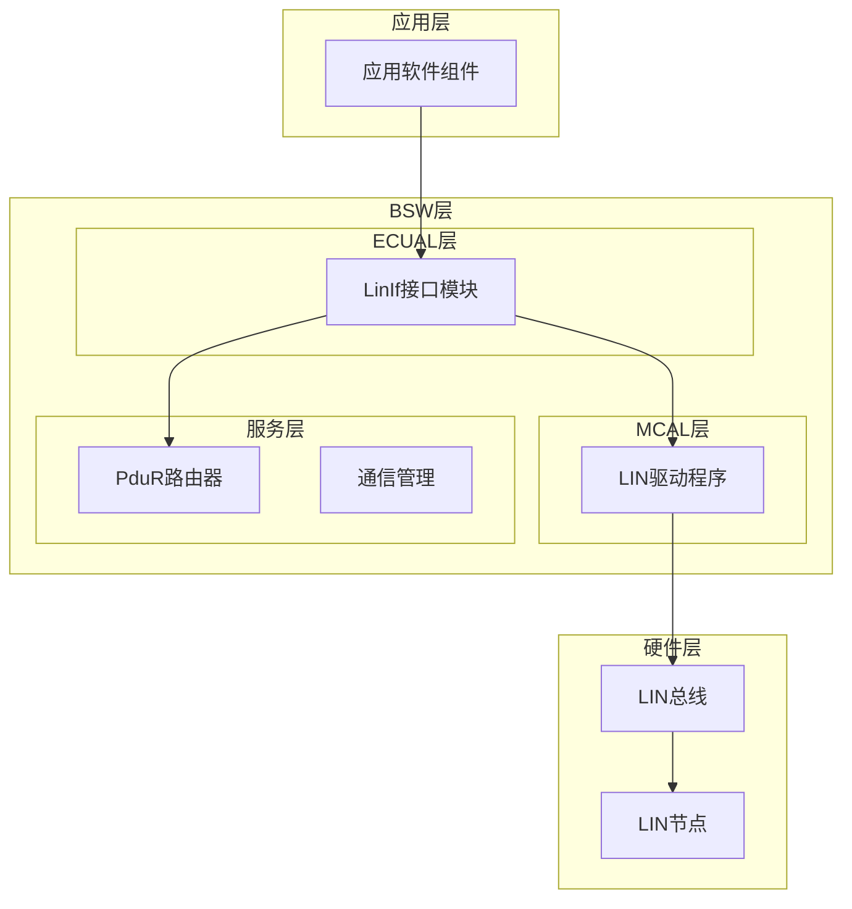
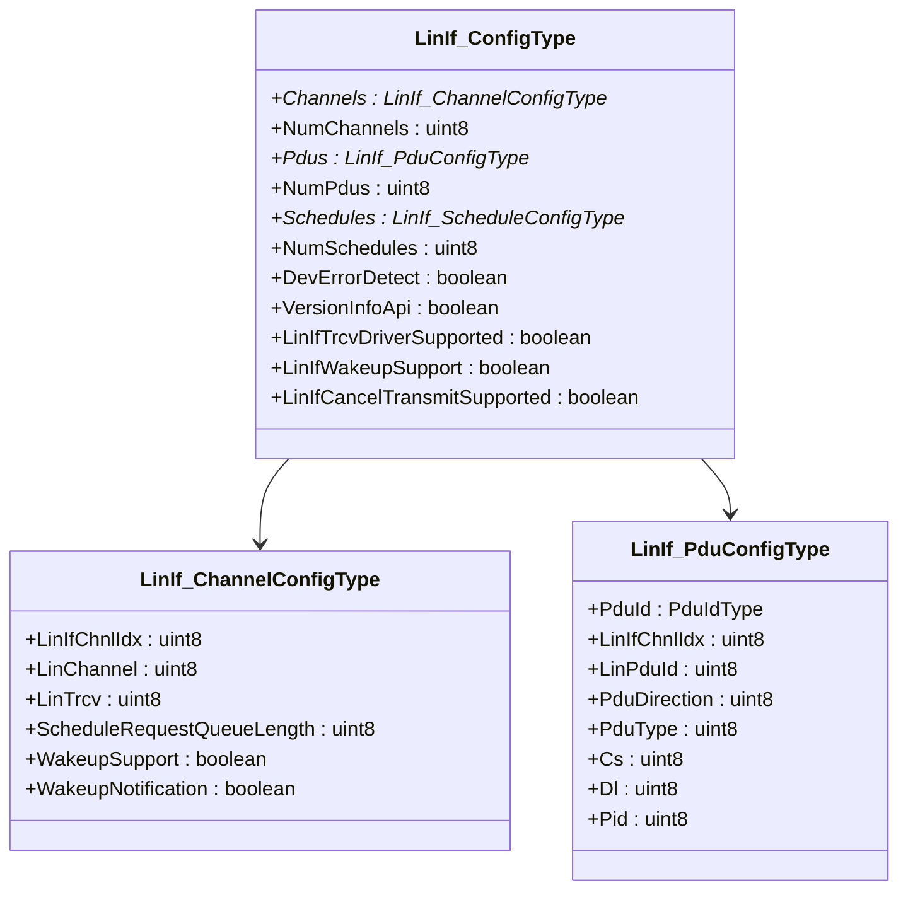
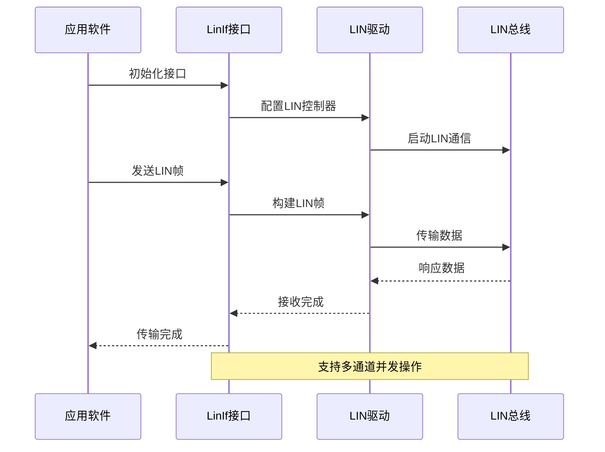
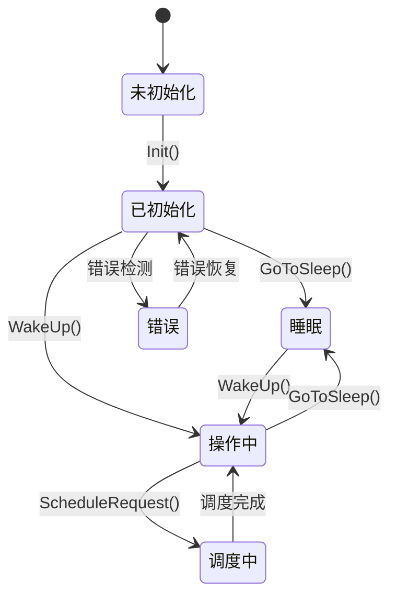
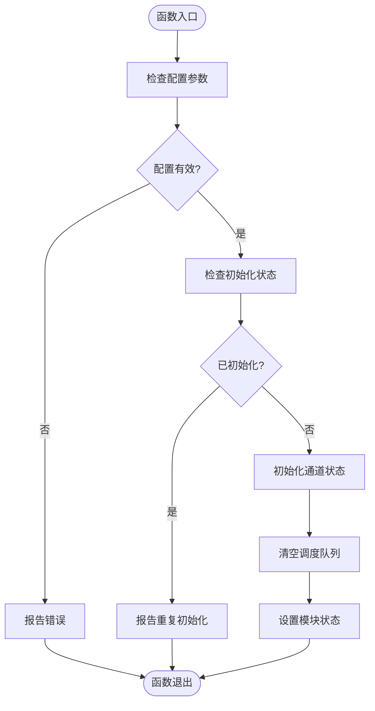
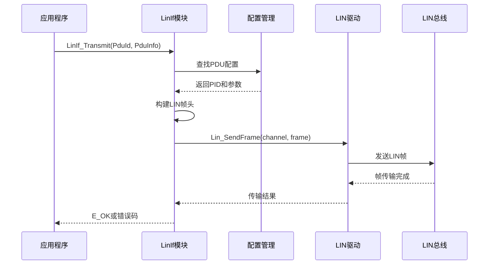
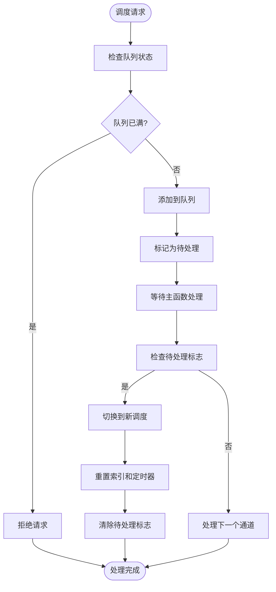
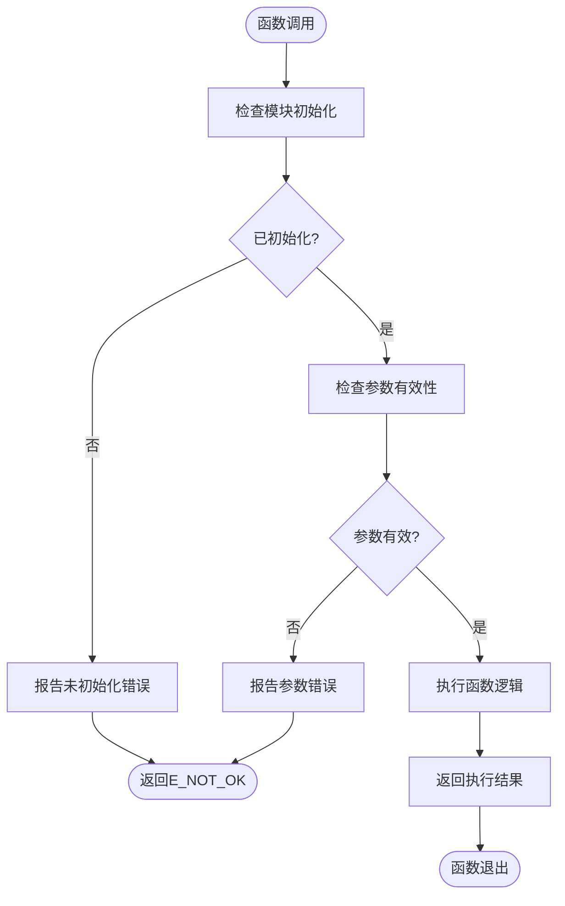
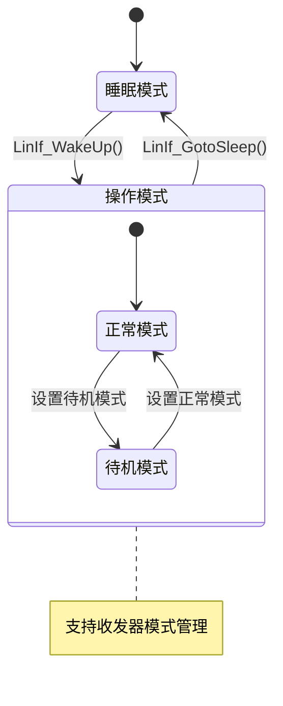
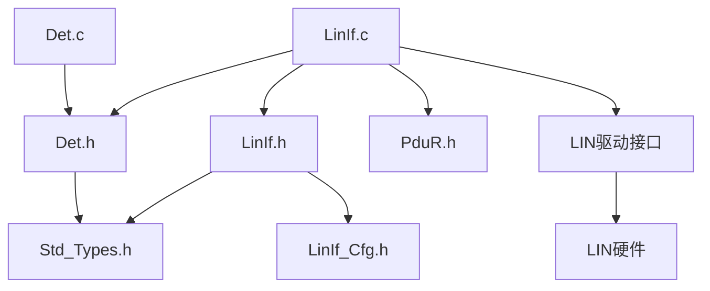

# LinIf LIN接口模块

<cite>
**本文档引用的文件**
- [LinIf.h](file://src/bsw/ecual/linif/include/LinIf.h)
- [LinIf_Cfg.h](file://src/bsw/ecual/linif/include/LinIf_Cfg.h)
- [LinIf.c](file://src/bsw/ecual/linif/src/LinIf.c)
- [Std_Types.h](file://src/bsw/common/Std_Types.h)
- [Det.h](file://src/bsw/common/Det.h)
- [Det.c](file://src/bsw/common/Det.c)
- [bsw_config.json](file://config/bsw_config.json)
</cite>

## 目录
1. [简介](#简介)
2. [项目结构](#项目结构)
3. [核心组件](#核心组件)
4. [架构概览](#架构概览)
5. [详细组件分析](#详细组件分析)
6. [依赖关系分析](#依赖关系分析)
7. [性能考虑](#性能考虑)
8. [故障排除指南](#故障排除指南)
9. [结论](#结论)
10. [附录](#附录)

## 简介

LinIf（LIN接口）模块是基于AutoSAR经典平台4.x标准开发的LIN总线接口抽象层，位于ECU抽象层(ECUAL)中。该模块提供了LIN总线通信的标准化接口，实现了主从节点管理、帧调度和错误检测机制。

LIN（Local Interconnect Network）是一种低成本的车载网络协议，主要用于车身控制应用。LinIf模块通过抽象化LIN硬件接口，为上层应用提供了统一的编程接口，支持多通道操作、动态调度管理和唤醒功能。

## 项目结构

LinIf模块采用AutoSAR标准的分层架构设计，主要包含以下组件：



**图表来源**
- [LinIf.h:197-302](file://src/bsw/ecual/linif/include/LinIf.h#L197-L302)
- [LinIf.c:48-80](file://src/bsw/ecual/linif/src/LinIf.c#L48-L80)

**章节来源**
- [LinIf.h:1-305](file://src/bsw/ecual/linif/include/LinIf.h#L1-L305)
- [LinIf_Cfg.h:1-105](file://src/bsw/ecual/linif/include/LinIf_Cfg.h#L1-L105)

## 核心组件

### 配置管理系统

LinIf模块提供了灵活的配置系统，支持编译时配置和运行时参数调整：

| 配置类别 | 参数名称 | 默认值 | 描述 |
|---------|----------|--------|------|
| 功能开关 | LINIF_DEV_ERROR_DETECT | STD_ON | 错误检测功能 |
| 功能开关 | LINIF_VERSION_INFO_API | STD_ON | 版本信息API |
| 功能开关 | LINIF_TRCV_DRIVER_SUPPORTED | STD_ON | 收发器驱动支持 |
| 通道数量 | LINIF_NUM_CHANNELS | 4 | 支持的LIN通道数 |
| PDU数量 | LINIF_NUM_PDUS | 32 | 支持的PDU数量 |
| 调度数量 | LINIF_NUM_SCHEDULES | 16 | 支持的调度数量 |

### 数据结构定义

LinIf模块定义了完整的数据结构来描述LIN通信配置：



**图表来源**
- [LinIf.h:166-178](file://src/bsw/ecual/linif/include/LinIf.h#L166-L178)
- [LinIf.h:118-125](file://src/bsw/ecual/linif/include/LinIf.h#L118-L125)
- [LinIf.h:130-139](file://src/bsw/ecual/linif/include/LinIf.h#L130-L139)

**章节来源**
- [LinIf.h:115-178](file://src/bsw/ecual/linif/include/LinIf.h#L115-L178)
- [LinIf_Cfg.h:14-27](file://src/bsw/ecual/linif/include/LinIf_Cfg.h#L14-L27)

## 架构概览

LinIf模块遵循AutoSAR架构模式，实现了完整的接口抽象层：



**图表来源**
- [LinIf.c:48-80](file://src/bsw/ecual/linif/src/LinIf.c#L48-L80)
- [LinIf.c:104-150](file://src/bsw/ecual/linif/src/LinIf.c#L104-L150)

### 状态管理架构

LinIf模块实现了完整的状态管理系统：



**图表来源**
- [LinIf.h:82-93](file://src/bsw/ecual/linif/include/LinIf.h#L82-L93)
- [LinIf.c:25-32](file://src/bsw/ecual/linif/src/LinIf.c#L25-L32)

**章节来源**
- [LinIf.c:48-102](file://src/bsw/ecual/linif/src/LinIf.c#L48-L102)
- [LinIf.h:80-113](file://src/bsw/ecual/linif/include/LinIf.h#L80-L113)

## 详细组件分析

### 初始化流程

LinIf模块的初始化过程遵循严格的错误检测和状态管理：



**图表来源**
- [LinIf.c:48-80](file://src/bsw/ecual/linif/src/LinIf.c#L48-L80)

#### 关键初始化步骤

1. **配置验证**：检查传入的配置指针是否有效
2. **状态检查**：确保模块未处于已初始化状态
3. **通道初始化**：为每个通道设置默认状态（睡眠模式）
4. **队列清理**：初始化调度请求队列
5. **状态设置**：将模块状态设置为已初始化

**章节来源**
- [LinIf.c:48-80](file://src/bsw/ecual/linif/src/LinIf.c#L48-L80)

### 传输管理机制

LinIf模块实现了完整的PDU传输管理：



**图表来源**
- [LinIf.c:104-150](file://src/bsw/ecual/linif/src/LinIf.c#L104-L150)

#### 传输流程特点

1. **配置查找**：根据PDU ID查找对应的LIN配置
2. **帧构建**：组合PID、数据和校验和
3. **驱动调用**：通过LIN驱动发送帧
4. **状态检查**：验证通道状态和参数有效性

**章节来源**
- [LinIf.c:104-150](file://src/bsw/ecual/linif/src/LinIf.c#L104-L150)

### 调度管理系统

LinIf模块实现了基于队列的调度管理：



**图表来源**
- [LinIf.c:152-185](file://src/bsw/ecual/linif/src/LinIf.c#L152-L185)
- [LinIf.c:439-491](file://src/bsw/ecual/linif/src/LinIf.c#L439-L491)

#### 调度处理机制

1. **请求排队**：新的调度请求被添加到队列中
2. **主函数处理**：在主函数中检查并处理队列
3. **状态切换**：更新当前调度、索引和定时器
4. **循环执行**：支持一次性和循环模式

**章节来源**
- [LinIf.c:152-185](file://src/bsw/ecual/linif/src/LinIf.c#L152-L185)
- [LinIf.c:439-491](file://src/bsw/ecual/linif/src/LinIf.c#L439-L491)

### 错误检测和处理

LinIf模块实现了完整的错误检测机制：



**图表来源**
- [LinIf.c:106-119](file://src/bsw/ecual/linif/src/LinIf.c#L106-L119)

#### 错误类型分类

| 错误类别 | 错误代码 | 触发条件 | 处理方式 |
|---------|----------|----------|----------|
| 初始化错误 | LINIF_E_UNINIT | 模块未初始化 | 报告DET错误 |
| 参数错误 | LINIF_E_PARAMETER | 参数超出范围 | 报告DET错误 |
| 指针错误 | LINIF_E_PARAMETER_POINTER | 空指针 | 报告DET错误 |
| 通道错误 | LINIF_E_NONEXISTENT_CHANNEL | 无效通道号 | 报告DET错误 |
| 调度错误 | LINIF_E_INVALID_SCHEDULE_INDEX | 无效调度索引 | 报告DET错误 |

**章节来源**
- [LinIf.c:106-119](file://src/bsw/ecual/linif/src/LinIf.c#L106-L119)
- [LinIf.h:59-77](file://src/bsw/ecual/linif/include/LinIf.h#L59-L77)

### 唤醒和睡眠管理

LinIf模块支持完整的设备电源管理模式：



**图表来源**
- [LinIf.c:215-245](file://src/bsw/ecual/linif/src/LinIf.c#L215-L245)
- [LinIf.c:187-213](file://src/bsw/ecual/linif/src/LinIf.c#L187-L213)

#### 唤醒流程

1. **状态检查**：验证通道是否处于睡眠状态
2. **驱动调用**：通过LIN驱动发送唤醒信号
3. **状态更新**：更新通道和收发器状态
4. **回调通知**：通知上层应用唤醒完成

**章节来源**
- [LinIf.c:215-245](file://src/bsw/ecual/linif/src/LinIf.c#L215-L245)
- [LinIf.c:187-213](file://src/bsw/ecual/linif/src/LinIf.c#L187-L213)

## 依赖关系分析

### 内部依赖关系



**图表来源**
- [LinIf.h:19-21](file://src/bsw/ecual/linif/include/LinIf.h#L19-L21)
- [LinIf.c:9-12](file://src/bsw/ecual/linif/src/LinIf.c#L9-L12)

### 外部接口依赖

LinIf模块依赖于多个外部接口：

| 依赖模块 | 用途 | 接口函数 |
|---------|------|----------|
| Det | 错误检测 | Det_ReportError() |
| PduR | PDU路由 | PduR接口函数 |
| LIN驱动 | 硬件抽象 | Lin_SendFrame()等 |
| 标准类型 | 类型定义 | Std_ReturnType等 |

**章节来源**
- [LinIf.c:9-12](file://src/bsw/ecual/linif/src/LinIf.c#L9-L12)
- [LinIf.h:19-21](file://src/bsw/ecual/linif/include/LinIf.h#L19-L21)

## 性能考虑

### 内存使用优化

LinIf模块采用了内存效率设计：

- **静态分配**：所有全局变量使用静态存储类
- **数组优化**：使用固定大小数组避免动态内存分配
- **位域使用**：合理使用布尔变量节省内存空间

### 处理器效率

- **轮询机制**：使用主函数轮询而非中断驱动
- **快速路径**：常见操作使用最短执行路径
- **缓存友好**：数据结构按访问频率优化布局

### 实时性保证

- **确定性延迟**：调度处理具有可预测的延迟
- **优先级处理**：高优先级操作优先执行
- **超时机制**：关键操作包含超时保护

## 故障排除指南

### 常见问题诊断

#### 初始化失败

**症状**：调用LinIf_Init()后返回错误

**可能原因**：
1. 配置指针为空
2. 模块已经初始化
3. 内存分配失败

**解决方法**：
1. 检查配置结构体的有效性
2. 确保只调用一次初始化函数
3. 验证内存可用性

#### 传输失败

**症状**：LinIf_Transmit()返回E_NOT_OK

**可能原因**：
1. 通道未正确初始化
2. PDU ID超出范围
3. 数据指针为空
4. 通道处于睡眠状态

**解决方法**：
1. 确保先调用LinIf_InitChannel()
2. 验证PDU ID配置
3. 检查PduInfoPtr的有效性
4. 确保通道处于操作模式

#### 调度无响应

**症状**：调度请求不被执行

**可能原因**：
1. 调度队列已满
2. 通道未处于操作模式
3. 调度索引无效

**解决方法**：
1. 检查调度队列长度配置
2. 确保通道状态为操作模式
3. 验证调度配置的有效性

**章节来源**
- [LinIf.c:50-59](file://src/bsw/ecual/linif/src/LinIf.c#L50-L59)
- [LinIf.c:106-119](file://src/bsw/ecual/linif/src/LinIf.c#L106-L119)
- [LinIf.c:154-167](file://src/bsw/ecual/linif/src/LinIf.c#L154-L167)

### 调试建议

1. **启用DET**：确保LINIF_DEV_ERROR_DETECT设置为STD_ON
2. **日志记录**：在关键位置添加调试输出
3. **状态监控**：定期检查LinIf_ChannelStatus数组
4. **内存检查**：验证全局变量的正确初始化

## 结论

LinIf LIN接口模块是一个功能完整、设计良好的LIN总线抽象层实现。它成功地实现了以下关键特性：

### 主要优势

1. **标准兼容性**：完全符合AutoSAR经典平台4.x规范
2. **模块化设计**：清晰的接口分离和配置管理
3. **错误处理**：完善的错误检测和报告机制
4. **扩展性**：支持多通道、多调度和动态配置

### 技术特色

- **状态管理**：完整的模块和通道状态跟踪
- **调度系统**：基于队列的异步调度处理
- **电源管理**：支持完整的睡眠和唤醒机制
- **配置灵活性**：编译时可配置的参数设置

### 应用价值

LinIf模块为上层应用提供了：
- 统一的LIN通信接口
- 标准化的错误处理机制
- 灵活的配置选项
- 完善的调试支持

该模块为LIN总线在现代汽车电子系统中的应用奠定了坚实的基础，支持从简单的车身控制到复杂的诊断通信等多种应用场景。

## 附录

### 使用示例

#### 基本初始化流程

```c
// 1. 定义配置结构体
const LinIf_ConfigType myConfig = {
    .Channels = myChannelConfig,
    .NumChannels = 4,
    .Pdus = myPduConfig,
    .NumPdus = 32,
    .Schedules = myScheduleConfig,
    .NumSchedules = 16,
    .DevErrorDetect = STD_ON,
    .VersionInfoApi = STD_ON,
    .LinIfTrcvDriverSupported = STD_ON,
    .LinIfWakeupSupport = STD_ON,
    .LinIfCancelTransmitSupported = STD_ON
};

// 2. 初始化LinIf模块
LinIf_Init(&myConfig);

// 3. 初始化各个通道
for (uint8 i = 0; i < 4; i++) {
    LinIf_InitChannel(i);
}
```

#### 发送LIN帧示例

```c
// 1. 准备PDU数据
PduInfoType pduInfo;
pduInfo.SduLength = 8;
pduInfo.SduDataPtr = myDataBuffer;

// 2. 发送LIN帧
Std_ReturnType result = LinIf_Transmit(MY_LIN_PDU_ID, &pduInfo);

// 3. 检查结果
if (result == E_OK) {
    // 传输成功
} else {
    // 处理错误
}
```

#### 调度管理示例

```c
// 1. 请求新的调度
Std_ReturnType result = LinIf_ScheduleRequest(0, MY_SCHEDULE);

// 2. 在主函数中处理
while (running) {
    LinIf_MainFunction();
    // 其他任务...
}

// 3. 清理资源
LinIf_GotoSleep(0);
```

### 配置参数详解

| 参数名称 | 类型 | 默认值 | 描述 |
|---------|------|--------|------|
| LINIF_DEV_ERROR_DETECT | boolean | STD_ON | 是否启用错误检测 |
| LINIF_VERSION_INFO_API | boolean | STD_ON | 是否提供版本信息 |
| LINIF_TRCV_DRIVER_SUPPORTED | boolean | STD_ON | 是否支持收发器驱动 |
| LINIF_NUM_CHANNELS | uint8 | 4 | LIN通道数量 |
| LINIF_NUM_PDUS | uint8 | 32 | PDU数量 |
| LINIF_NUM_SCHEDULES | uint8 | 16 | 调度数量 |
| LINIF_MAIN_FUNCTION_PERIOD_MS | uint32 | 5 | 主函数周期(毫秒) |
| LINIF_SCHEDULE_REQUEST_QUEUE_LENGTH | uint8 | 4 | 调度请求队列长度 |

**章节来源**
- [LinIf_Cfg.h:14-98](file://src/bsw/ecual/linif/include/LinIf_Cfg.h#L14-L98)
- [LinIf.h:166-178](file://src/bsw/ecual/linif/include/LinIf.h#L166-L178)