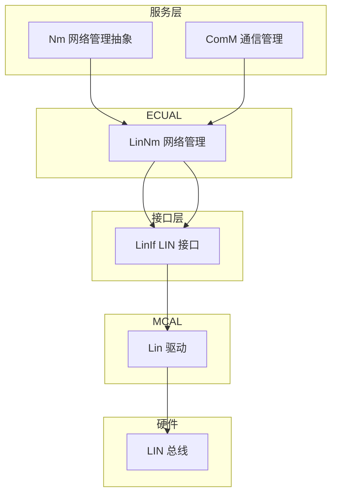
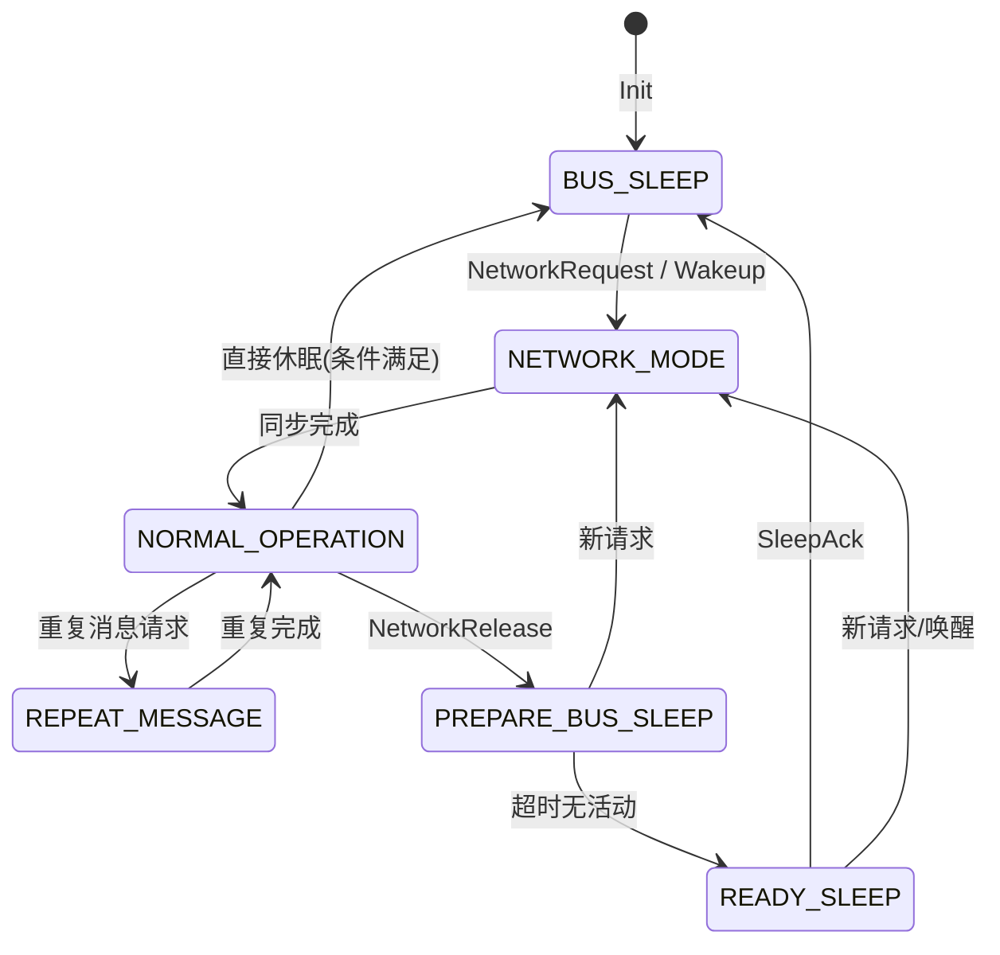
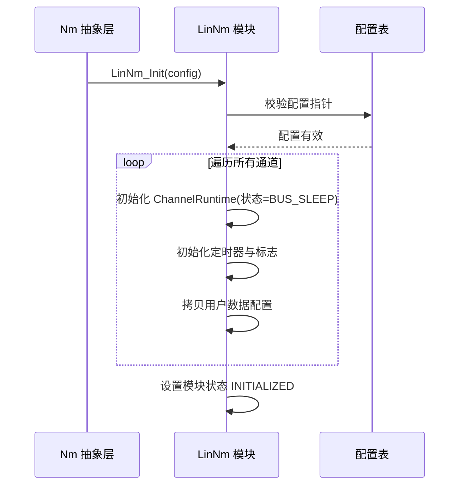
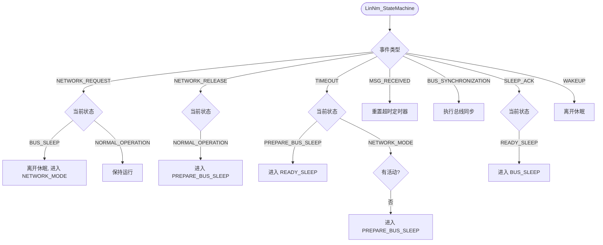
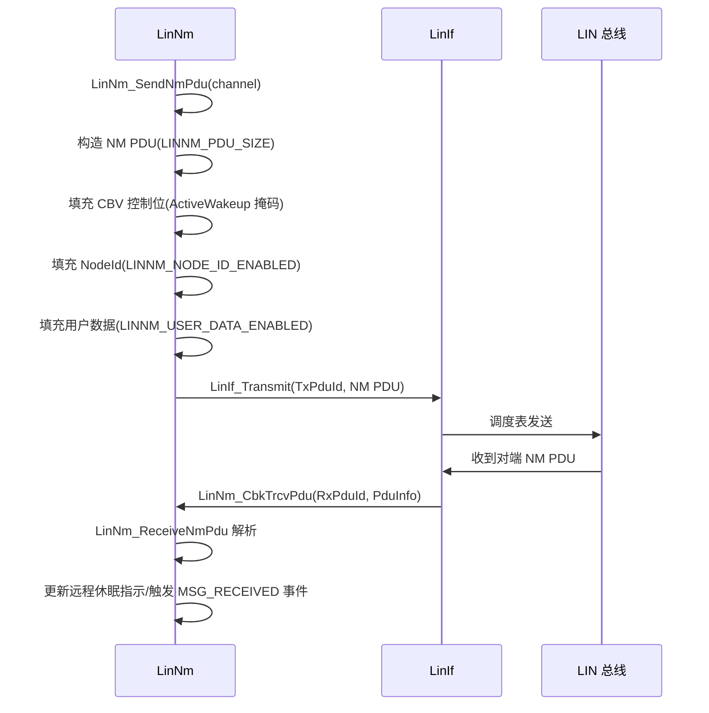

# LinNm（LIN网络管理模块）

<cite>
**本文档引用的文件**
- [LinNm.h](file://src/bsw/ecual/linNm/include/LinNm.h)
- [LinNm_Cfg.h](file://src/bsw/ecual/linNm/include/LinNm_Cfg.h)
- [LinNm.c](file://src/bsw/ecual/linNm/src/LinNm.c)
- [LinNm_Lcfg.c](file://src/bsw/ecual/linNm/src/LinNm_Lcfg.c)
- [Nm.h](file://src/bsw/services/nm/include/Nm.h)
- [ComM.h](file://src/bsw/services/comM/include/ComM.h)
- [Std_Types.h](file://src/bsw/os/include/Std_Types.h)
</cite>

## 目录
1. [简介](#简介)
2. [项目结构](#项目结构)
3. [核心组件](#核心组件)
4. [架构概览](#架构概览)
5. [详细组件分析](#详细组件分析)
6. [依赖关系分析](#依赖关系分析)
7. [性能考虑](#性能考虑)
8. [故障排除指南](#故障排除指南)
9. [结论](#结论)
10. [附录](#附录)

## 简介

LinNm（LIN Network Management，LIN 网络管理模块）是基于 AUTOSAR 4.4.0 标准开发的 ECUAL 层网络管理模块，实现基于 LIN 总线调度表的轻量级网络管理。该模块管理 LIN 网络的休眠/唤醒状态机，支持总线同步（Bus Synchronization）、远程休眠指示（Remote Sleep Indication）和通信控制（Communication Control）等功能。

LinNm 位于 LinIf 之上、Nm（网络管理抽象）之下，通过周期发送 NM PDU 维持网络活动，在无通信需求时协调进入总线休眠，实现 LIN 网络的低功耗管理。

**章节来源**
- [LinNm.h:30-60](file://src/bsw/ecual/linNm/include/LinNm.h#L30-L60)
- [LinNm.h:16-24](file://src/bsw/ecual/linNm/include/LinNm.h#L16-L24)

## 项目结构

LinNm 模块源码位于 `src/bsw/ecual/linNm/`：

```
src/bsw/ecual/linNm/
├── include/
│   ├── LinNm.h              # 公共 API 与类型定义（383 行）
│   └── LinNm_Cfg.h          # 预编译配置
└── src/
    ├── LinNm.c              # 状态机与主函数实现（1062 行）
    └── LinNm_Lcfg.c         # 链接时通道配置
```



**图表来源**
- [LinNm.h:24-30](file://src/bsw/ecual/linNm/include/LinNm.h#L24-L30)
- [LinNm.c:8-16](file://src/bsw/ecual/linNm/src/LinNm.c#L8-L16)

**章节来源**
- [LinNm.h:1-60](file://src/bsw/ecual/linNm/include/LinNm.h#L1-L60)
- [LinNm_Cfg.h:1-60](file://src/bsw/ecual/linNm/include/LinNm_Cfg.h#L1-L60)

## 核心组件

LinNm 模块的核心组件包括：

### 状态机定义
- **LinNm_StateType**: 内部状态枚举（6 状态）：
  - BUS_SLEEP（总线休眠）、PREPARE_BUS_SLEEP（准备休眠）、READY_SLEEP（休眠就绪）
  - NORMAL_OPERATION（正常运行）、REPEAT_MESSAGE（重复消息）、NETWORK_MODE（网络模式）
- **LinNm_ModeType**: 对外模式枚举（BUS_SLEEP/PREPARE_BUS_SLEEP/SYNCHRONIZE/NETWORK_MODE）
- **LinNm_NetworkRequestType**: 网络请求类型（NONE/REQUEST/RELEASE）
- **LinNm_NodeTypeType**: 节点类型（MASTER/SLAVE）
- **LinNm_EventType**（LinNm.c 内部）: 状态机事件（NETWORK_REQUEST/NETWORK_RELEASE/TIMEOUT/MSG_RECEIVED/BUS_SYNCHRONIZATION/SLEEP_ACK/WAKEUP）

### 配置结构
- **LinNm_ChannelConfigType**: 通道配置（NetworkHandle、LinIf 通道句柄、NodeId、节点类型、6 个定时参数、用户数据长度、功能开关）
- **LinNm_GeneralConfigType**: 全局配置（总线同步、通信控制、协调器同步、被动模式、远程休眠、状态变化指示、用户数据、NodeId、通道数）
- **LinNm_ChannelRuntimeType**: 通道运行时状态（当前状态、模式、通信使能、远程休眠指示、定时器、用户数据缓冲、总线负载降低、重复消息计数）

### 配置参数（LinNm_Cfg.h）
- **LINNM_TIMEOUT_TIME**: 默认超时 100ms
- **LINNM_CH0/CH1_NETWORK_HANDLE**: 通道网络句柄 0/1
- **LINNM_CH0/CH1_TX_PDU_ID**: NM 报文 PDU ID（0/1）
- **LINNM_NODE_DETECTION_ENABLED**: 节点检测默认关闭

**章节来源**
- [LinNm.h:85-190](file://src/bsw/ecual/linNm/include/LinNm.h#L85-L190)
- [LinNm.h:194-230](file://src/bsw/ecual/linNm/include/LinNm.h#L194-L230)

## 架构概览

LinNm 采用事件驱动的状态机架构，所有状态转换由 LinNm_StateMachine() 统一处理：



**图表来源**
- [LinNm.c:21-29](file://src/bsw/ecual/linNm/src/LinNm.c#L21-L29)
- [LinNm.c:33-52](file://src/bsw/ecual/linNm/src/LinNm.c#L33-L52)
- [LinNm.c:102-560](file://src/bsw/ecual/linNm/src/LinNm.c#L102-L560)

## 详细组件分析

### 初始化组件分析

LinNm_Init() 完成通道状态初始化：



**图表来源**
- [LinNm.c:33-52](file://src/bsw/ecual/linNm/src/LinNm.c#L33-L52)

#### 初始化流程详解

1. **参数验证**: 检查配置指针与通道数
2. **运行时初始化**: 每通道状态置 BUS_SLEEP、通信禁用
3. **定时器清零**: TimeoutTimer/RemoteSleepTimer/MessageCycleTimer 置 0
4. **模块标志**: 记录初始化完成状态

**章节来源**
- [LinNm.c:33-52](file://src/bsw/ecual/linNm/src/LinNm.c#L33-L52)

### 状态机组件分析

LinNm_StateMachine() 是核心处理函数，响应 7 类事件：



**图表来源**
- [LinNm.c:102-560](file://src/bsw/ecual/linNm/src/LinNm.c#L102-L560)
- [LinNm.c:39-52](file://src/bsw/ecual/linNm/src/LinNm.c#L39-L52)

#### 状态机特性

- **事件驱动**: 7 类事件统一分发，状态转换集中管理
- **超时监控**: LinNm_ProcessTimeouts() 周期递减定时器
- **状态通知**: 转换时通过 LinNm_NotifyStateChange/NotifyModeChange 通知 Nm 层
- **休眠路径**: NORMAL → PREPARE_BUS_SLEEP → READY_SLEEP → BUS_SLEEP 四级降级

**章节来源**
- [LinNm.c:39-52](file://src/bsw/ecual/linNm/src/LinNm.c#L39-L52)
- [LinNm.c:102-560](file://src/bsw/ecual/linNm/src/LinNm.c#L102-L560)

### NM PDU 处理组件分析

LinNm_SendNmPdu() / LinNm_ReceiveNmPdu() 实现 NM 报文收发：



**图表来源**
- [LinNm.c:102-145](file://src/bsw/ecual/linNm/src/LinNm.c#L102-L145)

#### NM PDU 特性

- **CBV 控制字节**: 首位为 ActiveWakeup 掩码（LINNM_CBV_ACTIVEWAKEUP_MASK）
- **NodeId 支持**: LINNM_NODE_ID_ENABLED 开启时携带节点 ID
- **用户数据**: LINNM_USER_DATA_ENABLED 开启时携带最多 8 字节用户数据
- **远程休眠**: 收到对端休眠请求更新 RemoteSleepIndication

**章节来源**
- [LinNm.c:102-145](file://src/bsw/ecual/linNm/src/LinNm.c#L102-L145)
- [LinNm_Cfg.h:30-45](file://src/bsw/ecual/linNm/include/LinNm_Cfg.h#L30-L45)

### 网络请求组件分析

LinNm_NetworkRequest()/NetworkRelease() 提供 Nm 层接口：

- **NetworkRequest**: 请求进入网络模式，触发 NETWORK_REQUEST 事件
- **NetworkRelease**: 请求释放网络，触发 NETWORK_RELEASE 事件（进入休眠降级流程）
- **PassiveStartUp**: 被动启动（SLAVE 节点模式）
- **GetState**: 查询当前通道状态（供 Nm/ComM 轮询）
- **RepeatMessageRequest**: 重复消息请求（唤醒后重传 NM PDU）

**章节来源**
- [LinNm.h:230-280](file://src/bsw/ecual/linNm/include/LinNm.h#L230-L280)
- [LinNm.c:600-1062](file://src/bsw/ecual/linNm/src/LinNm.c#L600-L1062)

## 依赖关系分析

LinNm 的依赖关系：

```mermaid
graph TB
subgraph "LinNm 内部"
LN_H[LinNm.h]
LN_CFG[LinNm_Cfg.h]
LN_C[LinNm.c]
LN_LCFG[LinNm_Lcfg.c]
end
subgraph "基础依赖"
STD[Std_Types.h]
END
subgraph "上层"
NM[Nm 抽象层]
COMM[ComM]
END
subgraph "下层"
LINIF[LinIf 接口]
END
LN_H --> STD
LN_H --> LN_CFG
LN_C --> LN_H
LN_LCFG --> LN_CFG
NM --> LN_H
COMM --> LN_H
LN_C --> LINIF
```

**图表来源**
- [LinNm.h:24-30](file://src/bsw/ecual/linNm/include/LinNm.h#L24-L30)
- [LinNm.c:8-14](file://src/bsw/ecual/linNm/src/LinNm.c#L8-L14)

### 关键依赖关系

1. **Nm 依赖**: 通过 Nm_StateChangeIndication/Nm_ModeChangeIndication 通知状态变化
2. **LinIf 依赖**: 通过 LinIf_Transmit 发送 NM PDU，接收 LinNm_CbkTrcvPdu 回调
3. **ComM 依赖**: NetworkHandle 与 ComM 通道句柄映射
4. **配置依赖**: LinNm_Lcfg.c 提供通道配置表

**章节来源**
- [LinNm.h:24-30](file://src/bsw/ecual/linNm/include/LinNm.h#L24-L30)
- [LinNm.h:130-150](file://src/bsw/ecual/linNm/include/LinNm.h#L130-L150)

## 性能考虑

### 定时参数

| 参数 | 含义 | 默认值 |
|------|------|--------|
| TimeoutTimeMs | NM 超时时间 | 100ms |
| WaitBusSleepTimeMs | 等待休眠时间 | 配置值 |
| RemoteSleepIndTimeMs | 远程休眠指示时间 | 配置值 |
| MsgCycleTimeMs | 消息周期 | 配置值 |
| MsgReducedTimeMs | 降低负载周期 | 配置值 |
| MsgCycleOffsetMs | 周期偏移 | 配置值 |

### 总线负载优化

- **总线负载降低**: BusLoadReductionActive 标志，休眠前降低 NM 消息频率
- **重复消息**: RepeatMessageCounter 控制唤醒后的重复发送次数
- **被动模式**: PassiveModeEnabled 下仅监听不主动发送

### 资源占用

- 通道运行时：约 40 字节/通道
- NM PDU 缓冲：LINNM_PDU_SIZE 字节
- 用户数据：8 字节/通道

**章节来源**
- [LinNm.h:150-190](file://src/bsw/ecual/linNm/include/LinNm.h#L150-L190)
- [LinNm_Cfg.h:40-55](file://src/bsw/ecual/linNm/include/LinNm_Cfg.h#L40-L55)

## 故障排除指南

### 常见错误代码

| 错误代码 | 错误含义 | 可能原因 | 解决方案 |
|---------|---------|---------|---------|
| LINNM_E_UNINIT (0x01) | 未初始化 | Init 前调用 API | 检查初始化时序 |
| LINNM_E_ALREADY_INITIALIZED (0x02) | 重复初始化 | 多次调用 Init | 检查初始化逻辑 |
| LINNM_E_INVALID_CHANNEL (0x03) | 通道无效 | 句柄越界 | 检查通道配置 |
| LINNM_E_INVALID_POINTER (0x04) | 指针无效 | 空指针参数 | 检查调用参数 |
| LINNM_E_NOT_IN_BUS_SLEEP (0x05) | 不在休眠态 | 休眠操作在错误状态 | 检查状态机 |
| LINNM_E_ALREADY_IN_NETWORK_MODE (0x06) | 已在网络模式 | 重复网络请求 | 检查调用逻辑 |
| LINNM_E_COM_CONTROL_ERROR (0x09) | 通信控制错误 | ComControl 冲突 | 检查 ComM 请求 |
| LINNM_E_PDUID_INVALID (0x0A) | PDU ID 无效 | 未配置的 PDU | 检查 Lcfg |
| LINNM_E_INVALID_NODE_TYPE (0x0C) | 节点类型无效 | 类型枚举非法 | 检查配置 |

### 调试建议

1. **状态跟踪**: 使用 LinNm_GetState 观察通道状态转换
2. **报文监控**: LIN 总线分析仪抓取 NM PDU 验证 CBV/NodeId 字段
3. **休眠时序**: 验证 PREPARE → READY → SLEEP 的各级超时是否合理
4. **唤醒验证**: 确认 Wakeup 事件能否从 BUS_SLEEP 正常唤醒

**章节来源**
- [LinNm.h:66-80](file://src/bsw/ecual/linNm/include/LinNm.h#L66-L80)
- [LinNm.c:15-33](file://src/bsw/ecual/linNm/src/LinNm.c#L15-L33)

## 结论

LinNm LIN 网络管理模块是一个实现完整、符合 AUTOSAR 4.4.0 规范的 ECUAL 网络管理组件。它提供：

1. **完整状态机**: BUS_SLEEP → NETWORK_MODE 全生命周期管理
2. **多通道支持**: 独立管理多个 LIN 通道
3. **NM 报文处理**: CBV/NodeId/用户数据完整编解码
4. **休眠降级**: 四级休眠路径实现低功耗管理
5. **主从节点适配**: MASTER/SLAVE 双模式支持

该模块是 LIN 网络低功耗管理的核心组件，与 Nm 抽象层和 LinIf 接口无缝协作。

## 附录

### 通道配置示例

```c
/* LinNm_Lcfg.c 通道配置 */
const LinNm_ChannelConfigType LinNm_Channels[LINNM_NUMBER_OF_CHANNELS] = {
    {
        .NetworkHandle = LINNM_CH0_NETWORK_HANDLE,
        .LinIfChannelHandle = 0U,
        .NodeId = 0x01U,
        .NodeType = LINNM_NODE_TYPE_MASTER,
        .PassiveModeEnabled = FALSE,
        .StateReportEnabled = TRUE,
        .TimeoutTimeMs = LINNM_CH0_TIMEOUT_TIME,
        .WaitBusSleepTimeMs = 500U,
        .RemoteSleepIndTimeMs = 1000U,
        .MsgCycleTimeMs = 100U,
        .MsgReducedTimeMs = 1000U,
        .MsgCycleOffsetMs = 0U,
        .UserDataLength = 0U,
        .BusSynchronizationEnabled = TRUE,
        .RemoteSleepIndEnabled = TRUE,
        .ComControlEnabled = TRUE,
        .CoordinatorSyncSupport = FALSE
    }
};
```

### 与 Nm 的协作流程

1. Nm 层调用 LinNm_NetworkRequest 请求网络激活
2. LinNm 进入 NETWORK_MODE 并周期发送 NM PDU
3. Nm 层调用 NetworkRelease 后进入休眠降级流程
4. READY_SLEEP 后发送休眠请求，收到 SLEEP_ACK 进入 BUS_SLEEP
5. 总线活动触发唤醒，重新进入 NETWORK_MODE

**章节来源**
- [LinNm_Lcfg.c:1-200](file://src/bsw/ecual/linNm/src/LinNm_Lcfg.c#L1-L200)
- [LinNm.h:130-190](file://src/bsw/ecual/linNm/include/LinNm.h#L130-L190)
