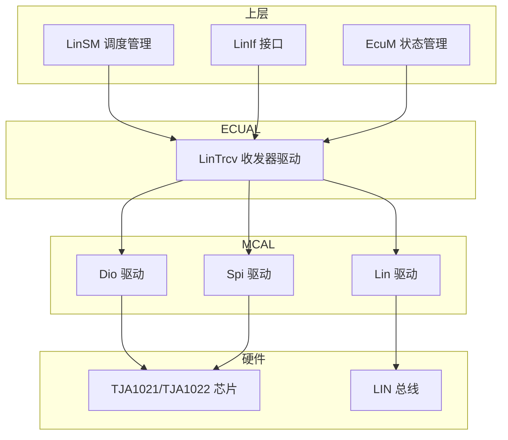
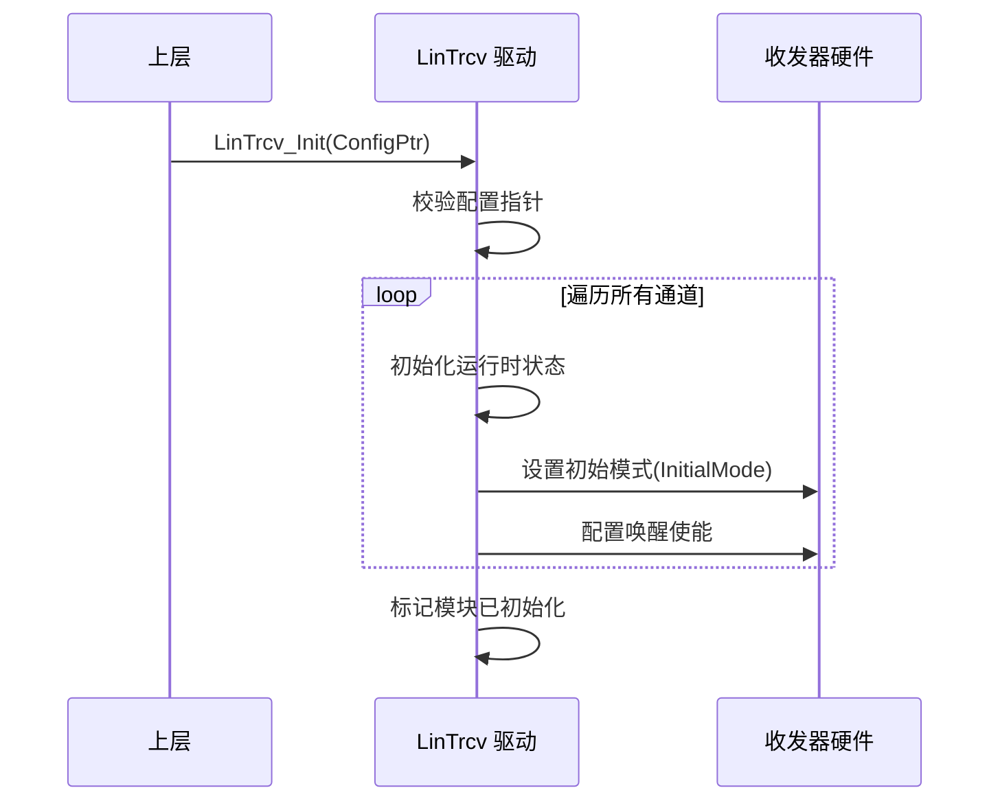
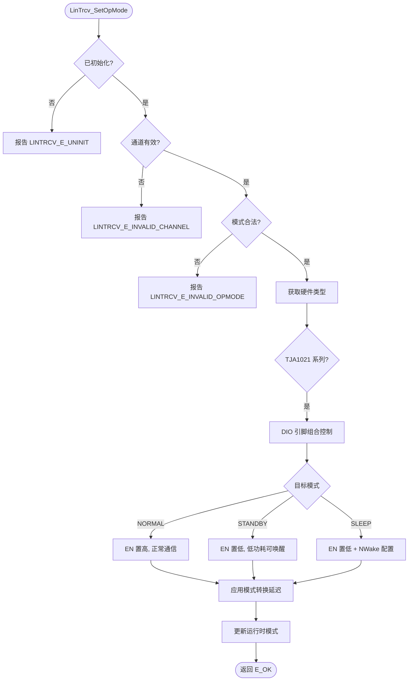
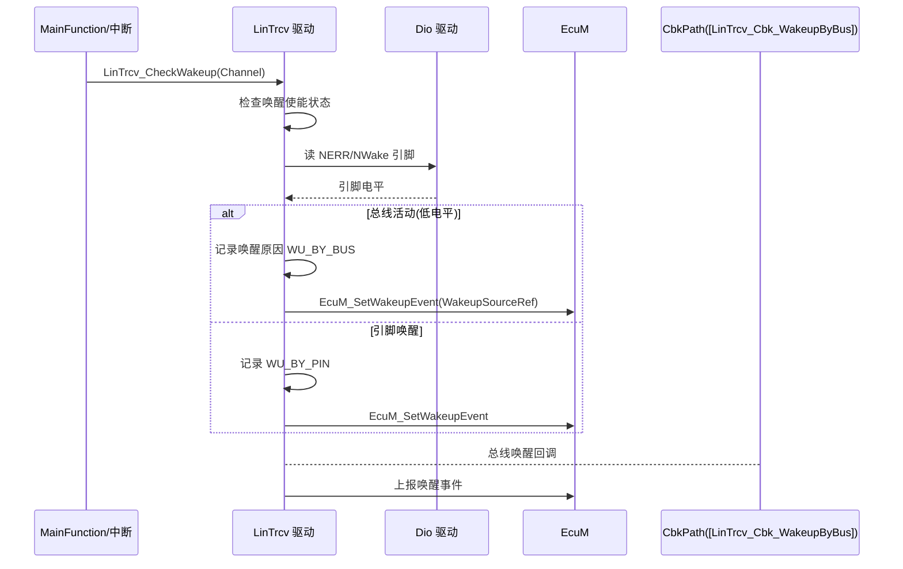

# LinTrcv（LIN收发器模块）

<cite>
**本文档引用的文件**
- [LinTrcv.h](file://src/bsw/ecual/lintrcv/include/LinTrcv.h)
- [LinTrcv_Cfg.h](file://src/bsw/ecual/lintrcv/include/LinTrcv_Cfg.h)
- [LinTrcv.c](file://src/bsw/ecual/lintrcv/src/LinTrcv.c)
- [LinTrcv_Lcfg.c](file://src/bsw/ecual/lintrcv/src/LinTrcv_Lcfg.c)
- [Dio.h](file://src/bsw/mcal/dio/include/Dio.h)
- [EcuM.h](file://src/bsw/services/ecum/include/EcuM.h)
- [Std_Types.h](file://src/bsw/os/include/Std_Types.h)
</cite>

## 目录
1. [简介](#简介)
2. [项目结构](#项目结构)
3. [核心组件](#核心组件)
4. [架构概览](#架构概览)
5. [详细组件分析](#详细组件分析)
6. [依赖关系分析](#依赖关系分析)
7. [性能考虑](#性能考虑)
8. [故障排除指南](#故障排除指南)
9. [结论](#结论)
10. [附录](#附录)

## 简介

LinTrcv（LIN Transceiver Driver，LIN 收发器驱动）是基于 AUTOSAR 4.4.0 标准开发的 ECUAL 层收发器驱动模块，负责管理 LIN 总线物理层收发器芯片的运行模式与唤醒检测。该模块适配 TJA1021、TJA1022、TJA1028 及通用 LIN 收发器，支持 Normal/Standby/Sleep 三种运行模式及总线/引脚双路径唤醒检测。

LinTrcv 位于 Lin 驱动之上、LinIf/LinSM 之下，通过 DIO 引脚（EN、NWake、NERR）或 SPI 接口控制收发器，向 LinSM 提供模式切换与唤醒管理能力，是 LIN 网络低功耗管理的关键 ECUAL 组件。

**章节来源**
- [LinTrcv.h:31-65](file://src/bsw/ecual/lintrcv/include/LinTrcv.h#L31-L65)
- [LinTrcv.h:16-24](file://src/bsw/ecual/lintrcv/include/LinTrcv.h#L16-L24)

## 项目结构

LinTrcv 模块源码位于 `src/bsw/ecual/lintrcv/`：

```
src/bsw/ecual/lintrcv/
├── include/
│   ├── LinTrcv.h              # 公共 API 与类型定义（293 行）
│   └── LinTrcv_Cfg.h          # 预编译配置
└── src/
    ├── LinTrcv.c              # 驱动实现（778 行）
    └── LinTrcv_Lcfg.c         # 链接时通道配置
```



**图表来源**
- [LinTrcv.h:26-30](file://src/bsw/ecual/lintrcv/include/LinTrcv.h#L26-L30)
- [LinTrcv.c:8-16](file://src/bsw/ecual/lintrcv/src/LinTrcv.c#L8-L16)

**章节来源**
- [LinTrcv.h:1-65](file://src/bsw/ecual/lintrcv/include/LinTrcv.h#L1-L65)
- [LinTrcv_Cfg.h:1-80](file://src/bsw/ecual/lintrcv/include/LinTrcv_Cfg.h#L1-L80)

## 核心组件

LinTrcv 模块的核心组件包括：

### 数据类型定义
- **LinTrcv_OpmodeType**: 运行模式枚举（NORMAL/STANDBY/SLEEP）
- **LinTrcv_WakeupReasonType**: 唤醒原因枚举（9 种：WU_BY_BUS/WU_BY_PIN/WU_BY_SYSERR/WU_RESET/WU_INTERNAL/WU_NOT_SUPPORTED/WU_ERROR/WU_POWER_ON/WU_BY_BUS_CS）
- **LinTrcv_WakeupModeType**: 唤醒模式（ENABLE/DISABLE/CLEAR）
- **LinTrcv_ChannelStateType**: 通道状态（UNINIT/INIT）
- **LinTrcv_HardwareType**: 硬件类型（TJA1021/TJA1022/TJA1028/GENERIC）
- **LinTrcv_ControlInterfaceType**: 控制接口（DIO/SPI/I2C）

### 配置结构
- **LinTrcv_ChannelConfigType**: 通道配置：
  - DIO 引脚：EnPinDio（EN，TJA1021 Pin2）、TxDPinDio、NwadrsPinDio（NWake，Pin6）、NerrPinDio（NERR，Pin9）
  - 唤醒配置：WakeupByBusEnabled、WakeupByPinEnabled、WakeupSourceRef
  - SPI 配置：SpiChannel/SpiDevice
  - 模式转换延迟：SleepToNormalDelay、StandbyToNormalDelay、NormalToStandbyDelay、NormalToSleepDelay
  - InitialMode: 初始化后的初始模式
- **LinTrcv_ConfigType**: 全局配置（通道数、通道配置数组、版本 API/唤醒开关）

### 配置参数（LinTrcv_Cfg.h）
- **LINTRCV_NUM_CHANNELS**: 2 个通道
- **LINTRCV_WAKEUP_SUPPORTED**: 唤醒支持开启
- **DIO_CHANNEL_TJA1021_0_TXD/RXD**: 通道 0 TXD=3、RXD=4

**章节来源**
- [LinTrcv.h:72-175](file://src/bsw/ecual/lintrcv/include/LinTrcv.h#L72-L175)
- [LinTrcv_Cfg.h:30-70](file://src/bsw/ecual/lintrcv/include/LinTrcv_Cfg.h#L30-L70)

## 架构概览

LinTrcv 采用"API 层 → 运行时管理层 → 硬件控制层"的分层架构：

```mermaid
graph TB
subgraph "公共 API 层"
INIT[LinTrcv_Init/DeInit]
MODE[LinTrcv_SetOpMode/GetOpMode]
WU[LinTrcv_GetBusWuReason]
WAKE[LinTrcv_Wakeup/CheckWakeup]
CBK[LinTrcv_Cbk_WakeupByBus]
MAIN[LinTrcv_MainFunction]
VER[LinTrcv_GetVersionInfo]
end
subgraph "运行时管理层"
RUNTIME[通道运行时状态]
MODETRACK[模式跟踪]
WUTRCK[唤醒原因跟踪]
end
subgraph "硬件控制层"
HWSET[引脚模式设置]
HWGET[引脚模式读取]
WUDET[唤醒检测]
end
subgraph "硬件接口"
DIOIF[Dio_ReadChannel/WriteChannel]
ECUMIF[EcuM 唤醒上报]
END
INIT --> RUNTIME
MODE --> MODETRACK
MODETRACK --> HWSET
HWSET --> DIOIF
HWGET --> DIOIF
WU --> WUTRCK
WUDET --> ECUMIF
CBK --> WUDET
WAKE --> WUDET
MAIN --> WUDET
```

**图表来源**
- [LinTrcv.c:359-778](file://src/bsw/ecual/lintrcv/src/LinTrcv.c#L359-L778)
- [LinTrcv.h:178-293](file://src/bsw/ecual/lintrcv/include/LinTrcv.h#L178-L293)

## 详细组件分析

### 初始化组件分析

LinTrcv_Init() 完成收发器初始化：



**图表来源**
- [LinTrcv.c:359-415](file://src/bsw/ecual/lintrcv/src/LinTrcv.c#L359-L415)

#### 初始化流程详解

1. **参数验证**: 检查配置指针，无效时报告 LINTRCV_E_PARAM_POINTER
2. **通道状态初始化**: 每通道模式置为配置的 InitialMode
3. **硬件配置**: 通过 DIO/SPI 接口配置收发器引脚
4. **唤醒配置**: 按 WakeupByBusEnabled/WakeupByPinEnabled 使能唤醒检测

**章节来源**
- [LinTrcv.c:359-415](file://src/bsw/ecual/lintrcv/src/LinTrcv.c#L359-L415)

### 模式控制组件分析

LinTrcv_SetOpMode() 实现收发器模式切换：



**图表来源**
- [LinTrcv.c:441-495](file://src/bsw/ecual/lintrcv/src/LinTrcv.c#L441-L495)

#### 模式控制特性

- **多硬件适配**: TJA1021/TJA1022/TJA1028/GENERIC 不同控制时序
- **转换延迟**: SleepToNormalDelay 等 4 个延迟参数确保时序合规
- **DIO/SPI 双路径**: 按 ControlInterfaceType 选择控制方式
- **状态回读**: LinTrcv_GetOpMode() 从运行时状态回读当前模式

**章节来源**
- [LinTrcv.c:441-550](file://src/bsw/ecual/lintrcv/src/LinTrcv.c#L441-L550)
- [LinTrcv.h:133-165](file://src/bsw/ecual/lintrcv/include/LinTrcv.h#L133-L165)

### 唤醒检测组件分析

LinTrcv_CheckWakeup() 与 LinTrcv_Cbk_WakeupByBus() 实现双路径唤醒：



**图表来源**
- [LinTrcv.c:611-717](file://src/bsw/ecual/lintrcv/src/LinTrcv.c#L611-L717)

#### 唤醒特性

- **总线唤醒**: 通过 NERR 引脚电平检测总线活动
- **引脚唤醒**: NWake 引脚本地唤醒（TJA1021 特有）
- **唤醒原因查询**: GetBusWuReason() 返回 9 种原因枚举
- **EcuM 集成**: WakeupSourceRef 绑定唤醒源 ID

**章节来源**
- [LinTrcv.c:551-588](file://src/bsw/ecual/lintrcv/src/LinTrcv.c#L551-L588)
- [LinTrcv.c:611-717](file://src/bsw/ecual/lintrcv/src/LinTrcv.c#L611-L717)

### 主动唤醒组件分析

LinTrcv_Wakeup() 实现本地唤醒请求：

- 从 Sleep/Standby 模式发起唤醒：拉低 TXD 引脚发送唤醒脉冲
- 等待对端响应后由 LinTrcv_CheckWakeup 确认总线状态
- 唤醒成功后进入 Normal 模式恢复通信
- LinTrcv_MainFunction() 周期处理唤醒确认与错误监控

**章节来源**
- [LinTrcv.c:611-640](file://src/bsw/ecual/lintrcv/src/LinTrcv.c#L611-L640)
- [LinTrcv.c:718-778](file://src/bsw/ecual/lintrcv/src/LinTrcv.c#L718-L778)

## 依赖关系分析

LinTrcv 的依赖关系：

```mermaid
graph TB
subgraph "LinTrcv 内部"
LT_H[LinTrcv.h]
LT_CFG[LinTrcv_Cfg.h]
LT_C[LinTrcv.c]
LT_LCFG[LinTrcv_Lcfg.c]
END
subgraph "基础依赖"
STD[Std_Types.h]
DET[Det.h]
MEMMAP[MemMap.h]
END
subgraph "硬件驱动"
DIO[Dio 驱动]
SPI[Spi 驱动]
END
subgraph "上层"
LINSM[LinSM]
ECUM[EcuM]
END
LT_H --> STD
LT_H --> LT_CFG
LT_C --> LT_H
LT_C --> DET
LT_C --> DIO
LT_C --> SPI
LT_LCFG --> LT_CFG
LINSM --> LT_H
ECUM --> LT_H
```

**图表来源**
- [LinTrcv.h:26-30](file://src/bsw/ecual/lintrcv/include/LinTrcv.h#L26-L30)
- [LinTrcv.c:8-16](file://src/bsw/ecual/lintrcv/src/LinTrcv.c#L8-L16)

### 关键依赖关系

1. **Dio 依赖**: EN/NWake/NERR 引脚控制与读取
2. **Spi 依赖**: SPI 控制接口（按配置启用）
3. **EcuM 依赖**: 唤醒源上报（EcuM_SetWakeupEvent）
4. **LinSM 依赖**: 上层通过 SetOpMode 控制休眠/唤醒流程

**章节来源**
- [LinTrcv.h:26-30](file://src/bsw/ecual/lintrcv/include/LinTrcv.h#L26-L30)
- [LinTrcv_Cfg.h:35-50](file://src/bsw/ecual/lintrcv/include/LinTrcv_Cfg.h#L35-L50)

## 性能考虑

### 模式转换延迟

| 转换路径 | 延迟参数 | 典型值 |
|---------|---------|--------|
| Sleep → Normal | SleepToNormalDelay | 微秒级（芯片数据手册） |
| Standby → Normal | StandbyToNormalDelay | 微秒级 |
| Normal → Standby | NormalToStandbyDelay | 微秒级 |
| Normal → Sleep | NormalToSleepDelay | 微秒级 |

### 唤醒响应

- 总线唤醒检测在主函数周期内完成（≤10ms 轮询粒度）
- 引脚唤醒支持中断路径（更快响应）
- 唤醒确认需等待总线活动稳定

### 资源占用

- 运行时状态：每通道约 16 字节
- DIO 路径开销极低（引脚读写）
- 无动态内存分配

**章节来源**
- [LinTrcv.h:150-160](file://src/bsw/ecual/lintrcv/include/LinTrcv.h#L150-L160)
- [LinTrcv_Cfg.h:60-80](file://src/bsw/ecual/lintrcv/include/LinTrcv_Cfg.h#L60-L80)

## 故障排除指南

### 常见错误代码

| 错误代码 | 错误含义 | 可能原因 | 解决方案 |
|---------|---------|---------|---------|
| LINTRCV_E_UNINIT (0x01) | 未初始化 | Init 前调用 API | 检查初始化时序 |
| LINTRCV_E_INVALID_CHANNEL (0x02) | 通道无效 | 通道号越界 | 检查 LINTRCV_NUM_CHANNELS |
| LINTRCV_E_INVALID_OPMODE (0x03) | 模式无效 | 模式枚举非法 | 使用 OpmodeType 枚举 |
| LINTRCV_E_PARAM_POINTER (0x04) | 指针无效 | 空指针参数 | 检查调用参数 |
| LINTRCV_E_INIT_FAILED (0x05) | 初始化失败 | 引脚配置错误 | 检查 DIO 配置 |
| LINTRCV_E_BUS_WU_NOT_SUPPORTED (0x06) | 不支持总线唤醒 | 硬件不支持 | 检查芯片选型 |
| LINTRCV_E_HW_FAILURE (0x08) | 硬件故障 | 收发器异常 | 检查供电/总线 |

### 调试建议

1. **引脚验证**: 示波器检查 EN/NWake/NERR 引脚时序
2. **唤醒排查**: 确认 WakeupReason 与实际唤醒源一致
3. **模式确认**: GetOpMode 回读与期望模式对比
4. **总线波形**: 检查 TXD 唤醒脉冲宽度是否符合 LIN 规范（250μs-5ms）

**章节来源**
- [LinTrcv.h:45-52](file://src/bsw/ecual/lintrcv/include/LinTrcv.h#L45-L52)
- [LinTrcv.c:20-40](file://src/bsw/ecual/lintrcv/src/LinTrcv.c#L20-L40)

## 结论

LinTrcv LIN 收发器驱动模块是一个功能完整、硬件适配良好的 AUTOSAR 4.4.0 ECUAL 组件。它提供：

1. **完整 AUTOSAR 接口**: 模式控制、唤醒管理、版本信息等 10 个 API
2. **多芯片适配**: TJA1021/TJA1022/TJA1028 及通用收发器
3. **双路径唤醒**: 总线唤醒 + 引脚唤醒，与 EcuM 深度集成
4. **时序合规**: 4 个模式转换延迟参数确保硬件时序
5. **灵活控制**: DIO/SPI/I2C 三接口支持

该模块是 LIN 网络休眠唤醒管理的核心 ECUAL 组件，为 LinSM 提供了可靠的收发器抽象。

## 附录

### 通道配置示例

```c
/* LinTrcv_Lcfg.c 通道配置 */
const LinTrcv_ChannelConfigType LinTrcv_Channels[LINTRCV_NUM_CHANNELS] = {
    {
        .ChannelId = 0U,
        .HwType = LINTRCV_TJA1021,
        .CtrlIf = LINTRCV_CTRL_DIO,
        .EnPinDio = DIO_CHANNEL_TJA1021_0_TXD,
        .TxDPinDio = DIO_CHANNEL_TJA1021_0_RXD,
        .NwadrsPinDio = 5U,          /* NWake 引脚 */
        .NerrPinDio = 6U,            /* NERR 引脚 */
        .WakeupByBusEnabled = TRUE,
        .WakeupByPinEnabled = TRUE,
        .WakeupSourceRef = ECUM_WKSOURCE_LIN,
        .SleepToNormalDelay = 100U,
        .StandbyToNormalDelay = 50U,
        .NormalToStandbyDelay = 10U,
        .NormalToSleepDelay = 10U,
        .InitialMode = LINTRCV_OPMODE_NORMAL
    }
};
```

### 与 LinSM 的协作流程

1. 总线休眠：LinSM 请求 SetOpMode(SLEEP)，收发器进入最低功耗
2. 总线唤醒：总线活动经 NERR 检测，LinTrcv 上报 EcuM
3. LinSM 确认唤醒后 SetOpMode(NORMAL) 恢复通信
4. 本地唤醒：LinTrcv_Wakeup() 拉低 TXD 发起唤醒脉冲

**章节来源**
- [LinTrcv_Lcfg.c:1-160](file://src/bsw/ecual/lintrcv/src/LinTrcv_Lcfg.c#L1-L160)
- [LinTrcv.h:133-175](file://src/bsw/ecual/lintrcv/include/LinTrcv.h#L133-L175)
