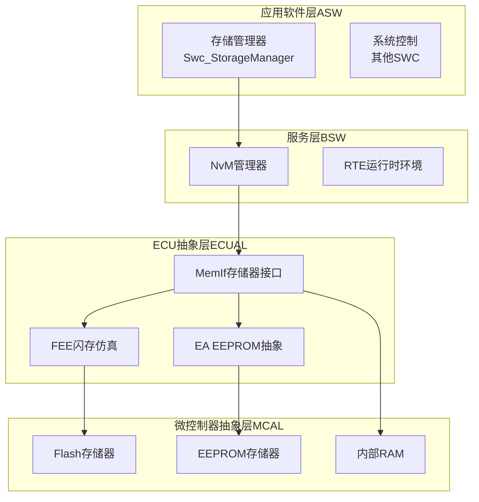
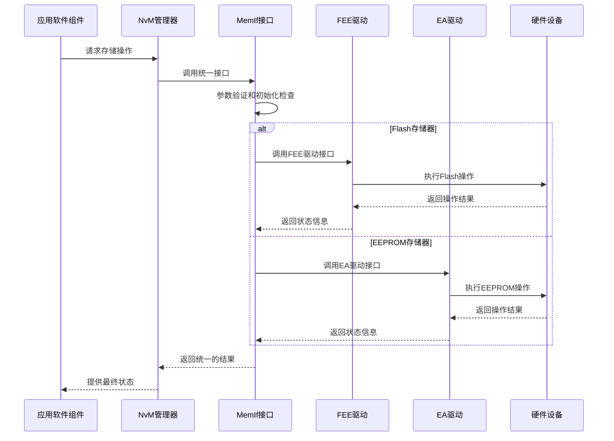
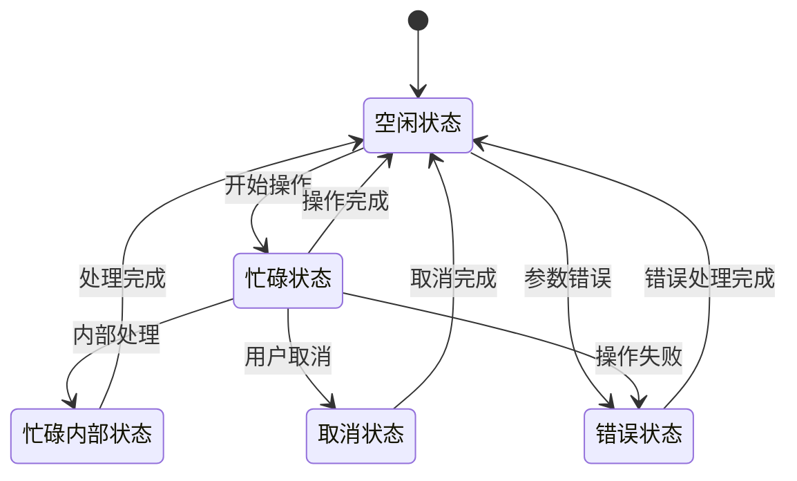
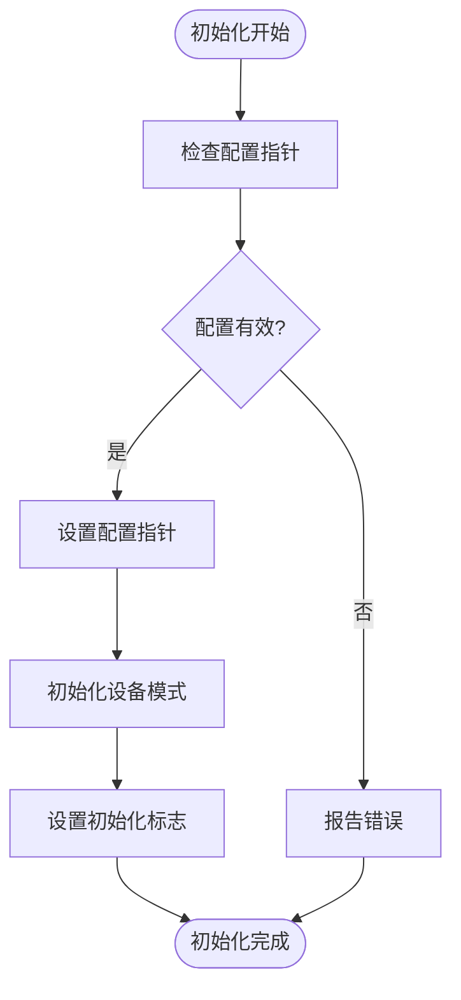
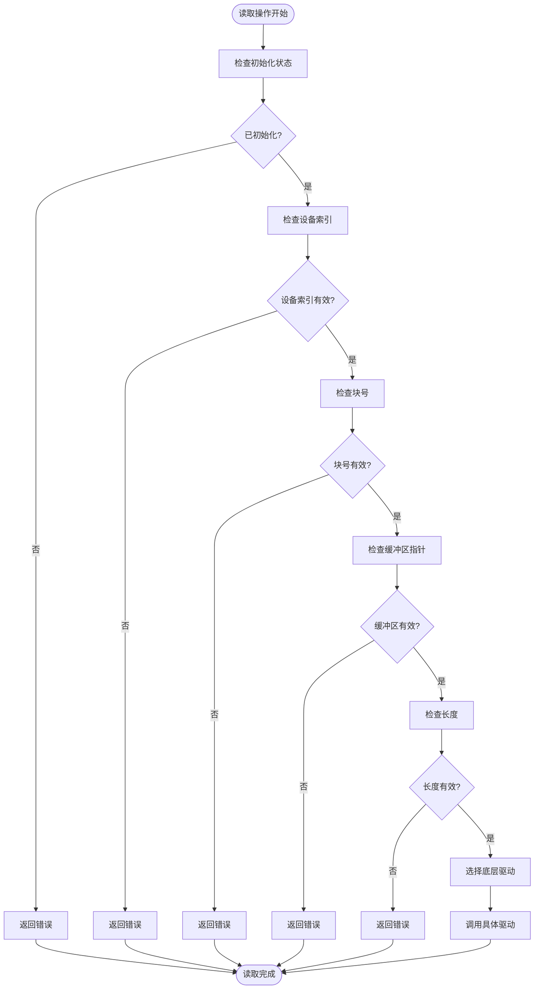
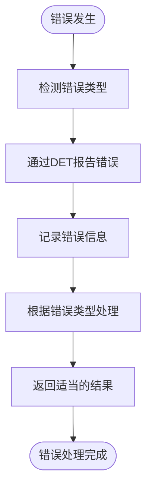
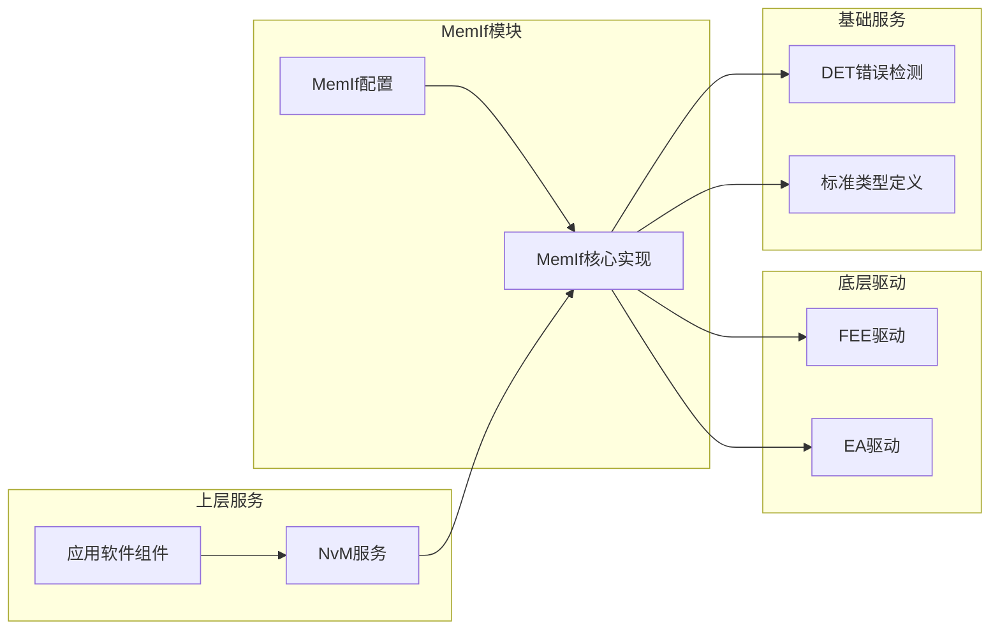
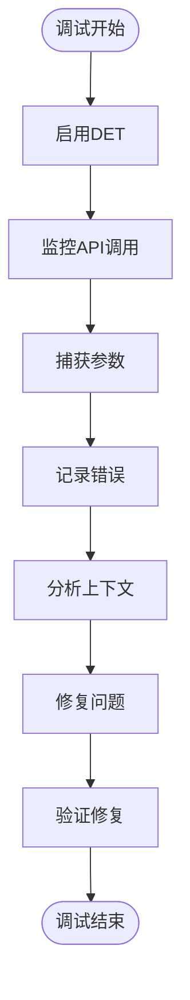

# MemIf 存储器接口模块

<cite>
**本文档引用的文件**
- [MemIf.h](file://src/bsw/ecual/memif/include/MemIf.h)
- [MemIf_Cfg.h](file://src/bsw/ecual/memif/include/MemIf_Cfg.h)
- [MemIf.c](file://src/bsw/ecual/memif/src/MemIf.c)
- [Fee.h](file://src/bsw/ecual/fee/include/Fee.h)
- [Ea.h](file://src/bsw/ecual/ea/include/Ea.h)
- [NvM.h](file://src/bsw/services/nvm/include/NvM.h)
- [Swc_StorageManager.h](file://src/asw/storage_manager/include/Swc_StorageManager.h)
- [Swc_StorageManager.c](file://src/asw/storage_manager/src/Swc_StorageManager.c)
- [Det.h](file://src/bsw/services/det/include/Det.h)
- [NvM_test.c](file://src/bsw/services/nvm/src/NvM_test.c)
</cite>

## 目录
1. [简介](#简介)
2. [项目结构](#项目结构)
3. [核心组件](#核心组件)
4. [架构概览](#架构概览)
5. [详细组件分析](#详细组件分析)
6. [依赖关系分析](#依赖关系分析)
7. [性能考虑](#性能考虑)
8. [故障排除指南](#故障排除指南)
9. [结论](#结论)

## 简介

MemIf（Memory Interface）是基于AUTOSAR经典平台4.x标准开发的存储器接口模块。该模块作为ECU抽象层的核心组件，提供了统一的存储器访问接口，能够抽象化各种存储介质的差异，包括Flash、EEPROM和RAM等。

MemIf模块的主要目标是为上层应用软件组件提供一致的存储器操作接口，屏蔽底层存储设备的硬件差异，实现存储器操作的标准化和模块化。通过这种抽象设计，系统可以灵活地支持多种存储介质，同时保持上层代码的独立性和可移植性。

## 项目结构

MemIf模块位于AUTOSAR分层架构的ECU抽象层（ECUAL），与底层硬件驱动和上层应用软件组件形成清晰的层次结构：

**图表来源**
- [MemIf.h:1-232](file://src/bsw/ecual/memif/include/MemIf.h#L1-L232)
- [Fee.h:1-273](file://src/bsw/ecual/fee/include/Fee.h#L1-L273)
- [Ea.h:1-242](file://src/bsw/ecual/ea/include/Ea.h#L1-L242)

**章节来源**
- [MemIf.h:1-232](file://src/bsw/ecual/memif/include/MemIf.h#L1-L232)
- [MemIf_Cfg.h:1-61](file://src/bsw/ecual/memif/include/MemIf_Cfg.h#L1-L61)

## 核心组件

### 存储器接口抽象层

MemIf模块的核心功能是提供统一的存储器访问接口，主要包含以下关键组件：

#### 设备配置管理
- **设备类型定义**：支持多种存储设备类型，包括Flash、EEPROM和RAM
- **块配置管理**：定义块大小、总容量和块数量限制
- **模式配置**：支持慢速和快速两种操作模式

#### 操作接口
- **读取操作**：支持按块和偏移量的数据读取
- **写入操作**：支持整块数据的写入操作
- **状态管理**：提供设备状态查询和作业结果获取
- **控制操作**：支持取消操作、失效化和立即擦除

#### 错误检测机制
- **参数验证**：对所有输入参数进行完整性检查
- **初始化检查**：确保模块正确初始化后再执行操作
- **设备索引验证**：防止越界访问设备数组

**章节来源**
- [MemIf.h:107-139](file://src/bsw/ecual/memif/include/MemIf.h#L107-L139)
- [MemIf_Cfg.h:38-61](file://src/bsw/ecual/memif/include/MemIf_Cfg.h#L38-L61)

## 架构概览

MemIf模块采用分层架构设计，实现了存储器访问的完整抽象：

**图表来源**
- [MemIf.c:44-63](file://src/bsw/ecual/memif/src/MemIf.c#L44-L63)
- [MemIf.c:147-171](file://src/bsw/ecual/memif/src/MemIf.c#L147-L171)

### 状态管理系统

MemIf模块实现了完整的状态管理机制，用于跟踪存储器操作的状态：

**图表来源**
- [MemIf.h:58-84](file://src/bsw/ecual/memif/include/MemIf.h#L58-L84)
- [MemIf.h:68-76](file://src/bsw/ecual/memif/include/MemIf.h#L68-L76)

## 详细组件分析

### MemIf核心实现

#### 初始化流程
MemIf模块的初始化过程确保了所有配置参数的正确设置和设备状态的初始化：

**图表来源**
- [MemIf.c:44-63](file://src/bsw/ecual/memif/src/MemIf.c#L44-L63)

#### 读取操作流程
MemIf模块的读取操作实现了完整的参数验证和设备选择逻辑：

**图表来源**
- [MemIf.c:65-120](file://src/bsw/ecual/memif/src/MemIf.c#L65-L120)

#### 写入操作实现
写入操作与读取操作类似，但针对写入特性进行了优化：

**章节来源**
- [MemIf.c:122-171](file://src/bsw/ecual/memif/src/MemIf.c#L122-L171)

### 底层驱动集成

#### FEE驱动集成
MemIf模块通过函数指针机制集成了FEE（Flash EEPROM Emulation）驱动：

| 功能 | FEE接口 | MemIf映射 |
|------|---------|-----------|
| 初始化 | `Fee_Init()` | `MemIf_Init()` |
| 读取 | `Fee_Read()` | `MemIf_Read()` |
| 写入 | `Fee_Write()` | `MemIf_Write()` |
| 状态查询 | `Fee_GetStatus()` | `MemIf_GetStatus()` |
| 作业结果 | `Fee_GetJobResult()` | `MemIf_GetJobResult()` |
| 取消操作 | `Fee_Cancel()` | `MemIf_Cancel()` |

#### EA驱动集成
EA（EEPROM Abstraction）驱动的集成方式与FEE类似，但针对EEPROM特性进行了调整：

**章节来源**
- [MemIf.c:13-30](file://src/bsw/ecual/memif/src/MemIf.c#L13-L30)

### 错误检测和处理

#### 错误码定义
MemIf模块实现了完整的错误检测机制，包含以下错误类型：

| 错误类型 | 错误码 | 描述 |
|----------|--------|------|
| 参数设备 | 0x01 | 设备索引超出范围 |
| 参数块 | 0x02 | 块号超出范围 |
| 参数指针 | 0x03 | 数据缓冲区指针为空 |
| 参数长度 | 0x04 | 数据长度无效 |
| 参数数据 | 0x05 | 数据内容无效 |
| 未初始化 | 0x06 | 模块未正确初始化 |

#### 错误处理流程

**图表来源**
- [MemIf.c:71-92](file://src/bsw/ecual/memif/src/MemIf.c#L71-L92)
- [Det.h:39-76](file://src/bsw/services/det/include/Det.h#L39-L76)

**章节来源**
- [MemIf.h:47-56](file://src/bsw/ecual/memif/include/MemIf.h#L47-L56)
- [MemIf.c:71-92](file://src/bsw/ecual/memif/src/MemIf.c#L71-L92)

## 依赖关系分析

### 组件间依赖关系

**图表来源**
- [MemIf.c:9-11](file://src/bsw/ecual/memif/src/MemIf.c#L9-L11)
- [Fee.h:14-21](file://src/bsw/ecual/fee/include/Fee.h#L14-L21)
- [Ea.h:14-21](file://src/bsw/ecual/ea/include/Ea.h#L14-L21)

### 配置管理

MemIf模块的配置管理采用了预编译配置的方式，支持灵活的设备配置：

#### 设备配置参数
| 参数名称 | 默认值 | 描述 |
|----------|--------|------|
| MEMIF_NUM_DEVICES | 2 | 设备数量 |
| MEMIF_DEFAULT_MODE | MEMIF_MODE_FAST | 默认操作模式 |
| MEMIF_MAX_BLOCK_NUMBER | 256 | 最大块数量 |
| MEMIF_MAX_BLOCK_SIZE | 4096 | 最大块大小（字节） |

#### 设备特定配置
每个设备都有独立的配置参数：
- **设备ID**：唯一标识符
- **底层驱动**：指定使用的驱动类型（FEE/EA/EEP）
- **底层设备ID**：对应底层驱动的设备标识
- **总容量**：设备总存储容量
- **块大小**：单个块的大小

**章节来源**
- [MemIf_Cfg.h:15-61](file://src/bsw/ecual/memif/include/MemIf_Cfg.h#L15-L61)

## 性能考虑

### 操作模式优化

MemIf模块支持两种操作模式，以适应不同的性能需求：

#### 快速模式（Fast Mode）
- **特点**：最大化吞吐量，最小化延迟
- **适用场景**：实时性要求高，数据量较大的操作
- **性能优势**：直接访问底层驱动，减少中间层开销

#### 慢速模式（Slow Mode）
- **特点**：优化功耗和设备寿命
- **适用场景**：电池供电设备，频繁写入操作
- **性能权衡**：降低操作速度以延长设备寿命

### 缓存和预取策略

虽然当前实现中没有显式的缓存机制，但可以通过以下方式优化性能：

1. **批量操作**：合并多个小操作为批量操作
2. **预取机制**：在读取操作前预取相关数据
3. **写入合并**：将多个写入操作合并为一次操作

## 故障排除指南

### 常见问题诊断

#### 初始化失败
**症状**：调用任何MemIf函数都返回错误
**可能原因**：
- 配置指针为空
- 设备配置不正确
- 底层驱动未正确初始化

**解决方法**：
1. 检查配置指针的有效性
2. 验证设备配置参数
3. 确认底层驱动初始化顺序

#### 参数验证错误
**症状**：特定API调用返回参数错误
**可能原因**：
- 设备索引超出范围
- 块号或长度参数无效
- 数据缓冲区指针为空

**解决方法**：
1. 验证所有输入参数
2. 检查内存分配情况
3. 确认参数边界条件

#### 设备访问冲突
**症状**：并发访问导致操作失败
**可能原因**：
- 多个任务同时访问同一设备
- 缺少适当的同步机制
- 底层驱动不支持并发操作

**解决方法**：
1. 实现互斥锁机制
2. 使用任务优先级调度
3. 检查底层驱动的并发支持

### 调试工具和方法

#### DET错误报告
MemIf模块集成了AUTOSAR标准的错误检测机制，可以提供详细的错误信息：

**图表来源**
- [NvM_test.c:100-109](file://src/bsw/services/nvm/src/NvM_test.c#L100-L109)

**章节来源**
- [Det.h:51-76](file://src/bsw/services/det/include/Det.h#L51-L76)
- [NvM_test.c:28-109](file://src/bsw/services/nvm/src/NvM_test.c#L28-L109)

## 结论

MemIf存储器接口模块成功实现了AUTOSAR标准的存储器抽象设计，为系统提供了统一、可靠且高效的存储器访问接口。通过模块化的架构设计，MemIf不仅简化了上层应用的开发复杂度，还增强了系统的可维护性和可扩展性。

### 主要优势

1. **统一接口**：为不同类型的存储器提供一致的操作接口
2. **灵活配置**：支持多种存储设备和操作模式
3. **完整错误处理**：内置全面的错误检测和报告机制
4. **模块化设计**：清晰的层次结构便于维护和扩展

### 技术特色

- **状态管理**：完善的设备状态跟踪和管理机制
- **异步操作**：支持非阻塞的存储器操作
- **性能优化**：可配置的操作模式适应不同需求
- **兼容性**：完全符合AUTOSAR 4.x标准规范

### 应用前景

MemIf模块为未来的存储器技术发展预留了充分的扩展空间，可以轻松适配新的存储介质和技术标准，确保系统的长期可用性和技术先进性。