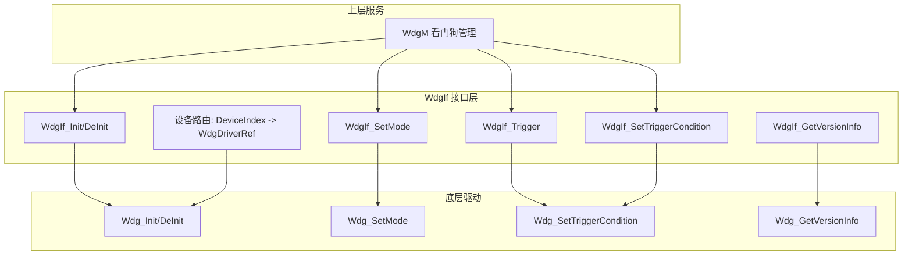
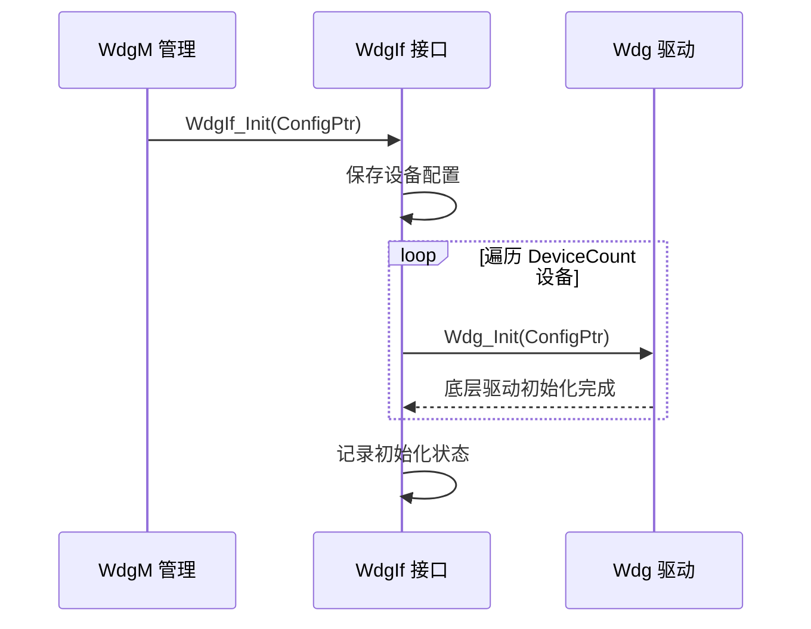
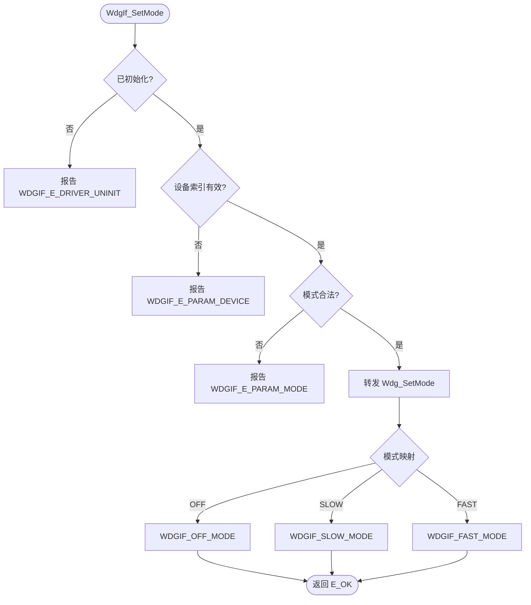

# WdgIf（看门狗接口模块）

<cite>
**本文档引用的文件**
- [WdgIf.h](file://src/bsw/ecual/wdgif/include/WdgIf.h)
- [WdgIf_Cfg.h](file://src/bsw/ecual/wdgif/include/WdgIf_Cfg.h)
- [WdgIf_MemMap.h](file://src/bsw/ecual/wdgif/include/WdgIf_MemMap.h)
- [WdgIf.c](file://src/bsw/ecual/wdgif/src/WdgIf.c)
- [WdgIf_Lcfg.c](file://src/bsw/ecual/wdgif/src/WdgIf_Lcfg.c)
- [Wdg.h](file://src/bsw/mcal/wdg/include/Wdg.h)
- [Std_Types.h](file://src/bsw/os/include/Std_Types.h)
</cite>

## 目录
1. [简介](#简介)
2. [项目结构](#项目结构)
3. [核心组件](#核心组件)
4. [架构概览](#架构概览)
5. [详细组件分析](#详细组件分析)
6. [依赖关系分析](#依赖关系分析)
7. [性能考虑](#性能考虑)
8. [故障排除指南](#故障排除指南)
9. [结论](#结论)
10. [附录](#附录)

## 简介

WdgIf（Watchdog Interface，看门狗接口模块）是基于 AUTOSAR 4.7.0 标准开发的 ECUAL 层看门狗接口模块，为上层服务（WdgM 看门狗管理）提供统一的看门狗硬件抽象接口。该模块封装底层 Wdg 驱动（MCAL 层）的差异，支持慢速/快速两种触发模式，并具备设备选择与触发条件配置能力。

WdgIf 是 WdgM（看门狗管理器）与 Wdg 驱动之间的标准化接口层，实现多看门狗设备的统一管理和模式切换抽象，保证看门狗喂狗逻辑的跨硬件可移植性。

**章节来源**
- [WdgIf.h:15-40](file://src/bsw/ecual/wdgif/include/WdgIf.h#L15-L40)
- [WdgIf.h:44-58](file://src/bsw/ecual/wdgif/include/WdgIf.h#L44-L58)

## 项目结构

WdgIf 模块源码位于 `src/bsw/ecual/wdgif/`：

```
src/bsw/ecual/wdgif/
├── include/
│   ├── WdgIf.h              # 公共 API 与类型定义（153 行）
│   ├── WdgIf_Cfg.h          # 预编译配置
│   └── WdgIf_MemMap.h       # 内存段映射
└── src/
    ├── WdgIf.c              # 接口实现（122 行）
    └── WdgIf_Lcfg.c         # 链接时设备配置
```

```mermaid
graph TB
subgraph "服务层"
WDGM[WdgM 看门狗管理]
DEM[错误处理]
end
subgraph "ECUAL"
WDGIF[WdgIf 看门狗接口]
end
subgraph "MCAL"
WDG[Wdg 看门狗驱动]
GPT[Gpt 定时器驱动]
end
subgraph "硬件"
WDG_HW[看门狗硬件]
END
WDGM --> WDGIF
WDGIF --> WDG
WDGIF --> GPT
WDG --> WDG_HW
```

**图表来源**
- [WdgIf.h:15-30](file://src/bsw/ecual/wdgif/include/WdgIf.h#L15-L30)
- [WdgIf.c:8-16](file://src/bsw/ecual/wdgif/src/WdgIf.c#L8-L16)

**章节来源**
- [WdgIf.h:1-58](file://src/bsw/ecual/wdgif/include/WdgIf.h#L1-L58)
- [WdgIf_Cfg.h:1-60](file://src/bsw/ecual/wdgif/include/WdgIf_Cfg.h#L1-L60)

## 核心组件

WdgIf 模块的核心组件包括：

### 数据类型定义
- **WdgIf_DeviceType**: 看门狗设备索引（uint8）
- **WdgIf_ModeType**: 触发模式枚举：
  - WDGIF_OFF_MODE（看门狗禁用）
  - WDGIF_SLOW_MODE（慢速触发，长超时）
  - WDGIF_FAST_MODE（快速触发，短超时）
- **WdgIf_StatusType**: 驱动状态（UNINIT/IDLE/BUSY）
- **WdgIf_TimeoutType**: 超时值类型（uint16）
- **WdgIf_DeviceConfigType**: 设备配置（DeviceIndex + WdgDriverRef 底层驱动引用）
- **WdgIf_ConfigType**: 全局配置（设备配置数组 + 设备数量）

### 配置参数（WdgIf_Cfg.h）
- **WDGIF_DEV_ERROR_DETECT**: DET 错误检测开启
- **WDGIF_VERSION_INFO_API**: 版本信息 API 开启
- **WDGIF_NUMBER_OF_DEVICES**: 1 个看门狗设备
- **WDGIF_DEFAULT_DEVICE**: 默认设备 0
- **WDGIF_FAST_MODE_TIMEOUT**: 快速模式超时 10ms
- **WDGIF_SLOW_MODE_TIMEOUT**: 慢速模式超时 100ms
- **WDGIF_FAST_MODE_TRIGGER_MS**: 快速模式触发周期 5ms
- **WDGIF_SLOW_MODE_TRIGGER_MS**: 慢速模式触发周期 50ms

**章节来源**
- [WdgIf.h:50-90](file://src/bsw/ecual/wdgif/include/WdgIf.h#L50-L90)
- [WdgIf_Cfg.h:15-45](file://src/bsw/ecual/wdgif/include/WdgIf_Cfg.h#L15-L45)

## 架构概览

WdgIf 采用极简的转发架构，将 WdgM 请求直接映射到底层 Wdg 驱动：



**图表来源**
- [WdgIf.c:37-122](file://src/bsw/ecual/wdgif/src/WdgIf.c#L37-L122)
- [WdgIf.h:90-153](file://src/bsw/ecual/wdgif/include/WdgIf.h#L90-L153)

## 详细组件分析

### 初始化组件分析

WdgIf_Init() 将初始化转发给底层 Wdg 驱动：



**图表来源**
- [WdgIf.c:37-49](file://src/bsw/ecual/wdgif/src/WdgIf.c#L37-L49)

#### 初始化流程详解

1. **配置保存**: 记录 WdgIf_ConfigType 设备配置
2. **驱动转发**: 对每个设备调用底层 Wdg_Init()
3. **状态记录**: 设置模块初始化标志，供后续 API 校验

**章节来源**
- [WdgIf.c:37-49](file://src/bsw/ecual/wdgif/src/WdgIf.c#L37-L49)

### 模式设置组件分析

WdgIf_SetMode() 实现触发模式切换：



**图表来源**
- [WdgIf.c:57-76](file://src/bsw/ecual/wdgif/src/WdgIf.c#L57-L76)

#### 模式设置特性

- **三模式支持**: OFF（禁用）/ SLOW（慢速）/ FAST（快速）
- **参数校验**: 未初始化、设备越界、模式非法均上报 DET
- **透明转发**: 模式直接映射到底层 Wdg 驱动

**章节来源**
- [WdgIf.c:57-76](file://src/bsw/ecual/wdgif/src/WdgIf.c#L57-L76)

### 触发组件分析

WdgIf_Trigger() 与 WdgIf_SetTriggerCondition() 实现喂狗：

- **WdgIf_Trigger**: 立即触发看门狗刷新（喂狗），由 WdgM 周期调用
- **WdgIf_SetTriggerCondition**: 设置触发条件（超时值），转发到底层 Wdg_SetTriggerCondition
- 触发周期与模式对应：FAST_MODE 5ms、SLOW_MODE 50ms（配置值）
- 设备路由通过 WdgIf_DeviceConfigType.WdgDriverRef 定位底层驱动

**章节来源**
- [WdgIf.c:77-108](file://src/bsw/ecual/wdgif/src/WdgIf.c#L77-L108)
- [WdgIf.h:100-110](file://src/bsw/ecual/wdgif/include/WdgIf.h#L100-L110)

## 依赖关系分析

WdgIf 的依赖关系：

```mermaid
graph TB
subgraph "WdgIf 内部"
WI_H[WdgIf.h]
WI_CFG[WdgIf_Cfg.h]
WI_MM[WdgIf_MemMap.h]
WI_C[WdgIf.c]
WI_LCFG[WdgIf_Lcfg.c]
END
subgraph "基础依赖"
STD[Std_Types.h]
DET[Det.h]
END
subgraph "底层驱动"
WDG[Wdg 驱动]
END
subgraph "上层"
WDGM[WdgM]
END
WI_H --> STD
WI_C --> WI_H
WI_C --> DET
WI_C --> WDG
WI_LCFG --> WI_CFG
WDGM --> WI_H
```

**图表来源**
- [WdgIf.h:26-32](file://src/bsw/ecual/wdgif/include/WdgIf.h#L26-L32)
- [WdgIf.c:8-16](file://src/bsw/ecual/wdgif/src/WdgIf.c#L8-L16)

### 关键依赖关系

1. **Wdg 驱动依赖**: 所有操作转发至底层 Wdg 驱动
2. **版本一致性检查**: WdgIf.h 中编译期检查 Std_Types AR 版本号匹配（`#error` 机制）
3. **MemMap 依赖**: WdgIf_MemMap.h 管理内存段
4. **上层依赖**: WdgM 周期调用 Trigger 实现喂狗

**章节来源**
- [WdgIf.h:26-36](file://src/bsw/ecual/wdgif/include/WdgIf.h#L26-L36)
- [WdgIf.h:26-40](file://src/bsw/ecual/wdgif/include/WdgIf.h#L26-L40)

## 性能考虑

### 触发时序

| 模式 | 触发周期 | 超时值 |
|------|---------|--------|
| WDGIF_FAST_MODE | 5ms（FAST_MODE_TRIGGER_MS） | 10ms（FAST_MODE_TIMEOUT） |
| WDGIF_SLOW_MODE | 50ms（SLOW_MODE_TRIGGER_MS） | 100ms（SLOW_MODE_TIMEOUT） |

### 实时性分析

- WdgIf 为纯转发层，单次调用开销为函数指针跳转级别
- 触发延迟完全由底层 Wdg 驱动与硬件决定
- 快速模式适用于启动/唤醒等关键阶段，慢速模式用于正常运行

### 资源占用

- 接口层无运行时状态，零内存开销
- 设备配置表位于只读段
- 函数体极小，代码段占用可忽略

**章节来源**
- [WdgIf_Cfg.h:25-40](file://src/bsw/ecual/wdgif/include/WdgIf_Cfg.h#L25-L40)
- [WdgIf.h:60-65](file://src/bsw/ecual/wdgif/include/WdgIf.h#L60-L65)

## 故障排除指南

### 常见错误代码

| 错误代码 | 错误含义 | 可能原因 | 解决方案 |
|---------|---------|---------|---------|
| WDGIF_E_DRIVER_UNINIT (0x01) | 驱动未初始化 | Init 前调用 API | 检查初始化时序 |
| WDGIF_E_PARAM_DEVICE (0x02) | 设备索引无效 | 设备号越界 | 检查 WDGIF_NUMBER_OF_DEVICES |
| WDGIF_E_PARAM_MODE (0x03) | 模式无效 | 模式枚举非法 | 使用 WdgIf_ModeType 枚举 |
| WDGIF_E_INV_POINTER (0x04) | 指针无效 | 空指针参数 | 检查调用参数 |

### 调试建议

1. **喂狗周期验证**: 用示波器测量看门狗复位引脚，确认触发周期正确
2. **模式切换测试**: 验证 SLOW↔FAST 切换后超时窗口变化
3. **复位排查**: 系统意外复位时检查是否漏喂狗或触发周期超时
4. **版本一致性**: 编译错误提示 AR 版本不匹配时检查 Std_Types.h

**章节来源**
- [WdgIf.h:48-52](file://src/bsw/ecual/wdgif/include/WdgIf.h#L48-L52)
- [WdgIf.c:20-36](file://src/bsw/ecual/wdgif/src/WdgIf.c#L20-L36)

## 结论

WdgIf 看门狗接口模块是一个简洁高效的 AUTOSAR 4.7.0 ECUAL 接口层组件。它提供：

1. **标准化接口**: WdgM 与 Wdg 之间的 AUTOSAR 标准接口
2. **多设备支持**: 设备配置表支持多看门狗路由
3. **模式抽象**: OFF/SLOW/FAST 三模式统一管理
4. **版本检查**: 编译期 AR 版本一致性校验
5. **极低开销**: 纯转发架构，零运行时状态

该模块为看门狗管理提供了清晰的分层边界，保障系统安全监控的可移植性。

## 附录

### 设备配置示例

```c
/* WdgIf_Lcfg.c 设备配置 */
const WdgIf_DeviceConfigType WdgIf_Devices[WDGIF_NUMBER_OF_DEVICES] = {
    {
        .DeviceIndex = WDGIF_DEFAULT_DEVICE,
        .WdgDriverRef = 0U   /* 引用 MCAL Wdg 驱动实例 0 */
    }
};

const WdgIf_ConfigType WdgIf_Config = {
    .DeviceConfig = WdgIf_Devices,
    .DeviceCount = WDGIF_NUMBER_OF_DEVICES
};
```

### 与 WdgM 的协作流程

1. WdgM 启动时调用 WdgIf_SetMode(FAST_MODE) 进入快速监控
2. WdgM 周期任务调用 WdgIf_Trigger() 喂狗
3. 系统稳定后 WdgM 切换 SLOW_MODE 降低触发频率
4. 关断前 WdgIf_SetMode(OFF_MODE) 禁用看门狗

**章节来源**
- [WdgIf_Lcfg.c:1-60](file://src/bsw/ecual/wdgif/src/WdgIf_Lcfg.c#L1-L60)
- [WdgIf.h:80-100](file://src/bsw/ecual/wdgif/include/WdgIf.h#L80-L100)
